# Git的使用

## 1. 版本控制

版本控制是一种记录文件内容变化，以便将来查阅特定版本修订情况的系统。 版本控制最重要的是可以记录文件修改历史记录，从而让用户能够查看历史版本， 方便版本切换。下图所示手动管理文件版本，不仅占用内存，还很不方便。

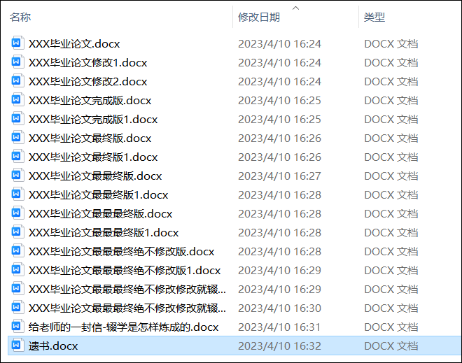

### 1.1 集中式版本控制

​		集中化的版本控制工具诸如 CVS、SVN、VSS 等，都有一个单一的集中管理的服务器，保存 所有文件的修订版本，而协同工作的人们都通过客户端连到这台服务器，取出最新的文件或 者提交更新。多年以来，这已成为版本控制系统的标准做法。 这种做法带来了许多好处，每个人都可以在一定程度上看到项目中的其他人正在做些什 么。而管理员也可以轻松掌控每个开发者的权限，并且管理一个集中化的版本控制系统，要 远比在各个客户端上维护本地数据库来得轻松容易。 事分两面，有好有坏。这么做显而易见的缺点是中央服务器的单点故障。如果服务器宕 机一小时，那么在这一小时内，谁都无法提交更新，也就无法协同工作。

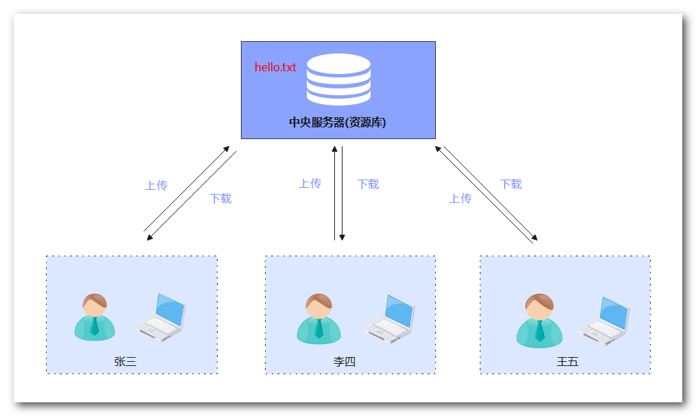

以VSS版本控制工具举例，假如张三从中央服务器下载了hello.txt文件，服务器会给该文件加把锁，其他用户无法对其修改，只能查看，只有等张三修改完成上传回去后其他用户才能下载修改。这极大影响开发效率。

### 1.2 分布式版本控制

分布式版本控制工具有Git、Mercurial、Bazaar、Darcs…… 像 Git 这种分布式版本控制工具，客户端提取的不是最新版本的文件快照，而是把代码 仓库完整地镜像下来（本地库）。这样任何一处协同工作用的文件发生故障，事后都可以用 其他客户端的本地仓库进行恢复。因为每个客户端的每一次文件提取操作，实际上都是一次 对整个文件仓库的完整备份。 

分布式的版本控制系统出现之后,解决了集中式版本控制系统的缺陷: 

- 服务器断网的情况下也可以进行开发（因为版本控制是在本地进行的）
-  每个客户端保存的也都是整个完整的项目（包含历史记录，更加安全

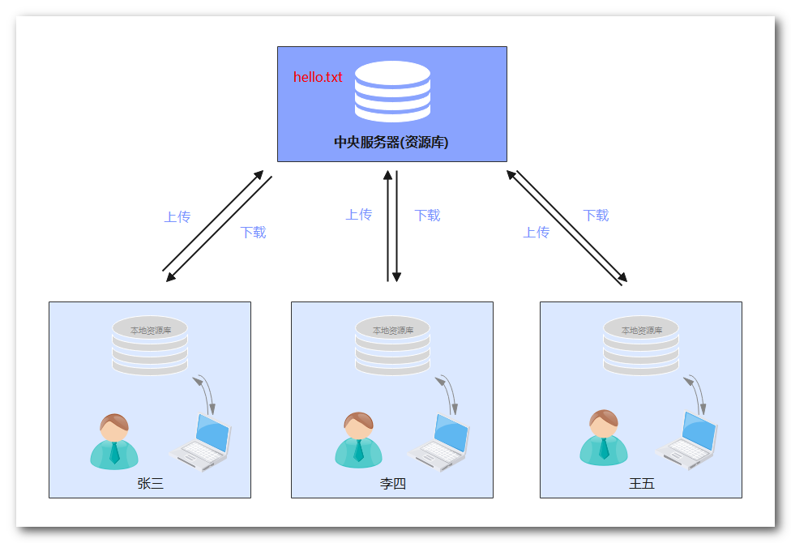


## 2. 本地库和远程库

### 2.1 本地库

本地库就是一个文件夹经过git初始化后的一个.git文件目录。

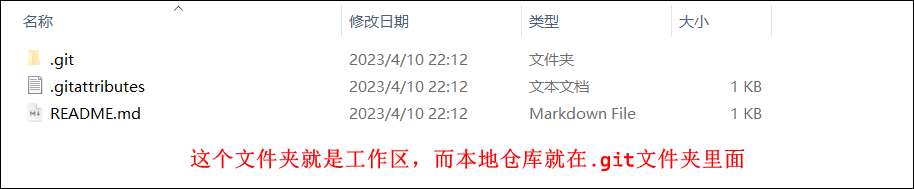


通常我们编辑的文件就放在工作区，通过git add命令将工作区的内容传到暂存区，暂存区用来比较工作区和本地库文件的内容，工作区和本地库的内容不一致，暂存区就会提示有文件发生改变，需要添加到暂存区。下面是github客户端中的暂存区：

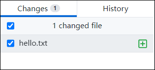

暂存区的文件通过git commit提交到本地库保存，本地库会记录每一次提交的版本。

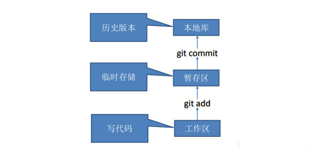


### 2.2 远程库

远程库就是GitHub、Gitee等代码托管平台。


## 3. Git命令

选择一个文件夹作为工作区，进入该文件夹右键选择Git Bash Here

#### git config

> git的配置信息

```bash
# 设置用户名和邮箱
git config user.name loneasing
git config user.email loneasing@163.com
# 全局配置
git config --global user.name XXX
```


#### git init

> 初始化本地仓库

```sh
git init
```

初始化本地库后会出现.git文件夹


#### git status

> 查看暂存区状态
>
> 向工作区添加文件后，文件属于未追踪文件，也就是没有添加到暂存区。

- 查看暂存区状态

  ```sh
  git status
  ```

  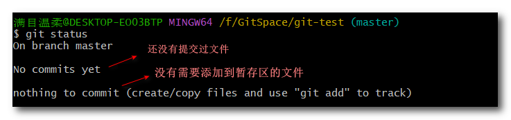

- 向工作区添加文件

  ```sh
  vim hello.txt	# 创建hello.txt文件并写入hello内容
  ```

- 再次查看暂存区状态

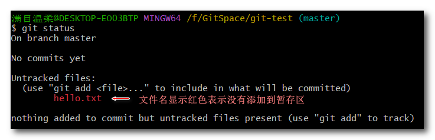


#### git add

> 添加到暂存区

```sh
git add hello.txt	# 将hello.txt文件添加到暂存区
git add .			# .表示将所有未追踪文件添加到暂存区
```


- 从暂存区移除

  ```sh
  git rm --cache hell.txt		# 从暂存区移除hell.txt文件
  ```


#### git commit

> 提交到本地库

```bash
# 单独提交一个文件
git commit hello.txt -m XXX		# -m表示版本描述信息
# 提交所有暂存区文件
git commit -m XXX
```

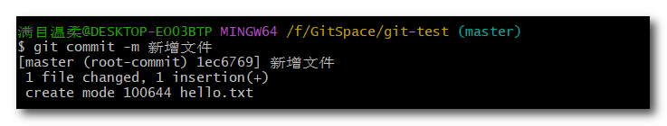

提交后再次查看暂存区状态


**修改文件**

```sh
vim hello.txt	# 再写入一句hello
# 修改文件后添加和提交可以合并成一句代码
git commit -a -m 修改		# -a表示添加到暂存区
```

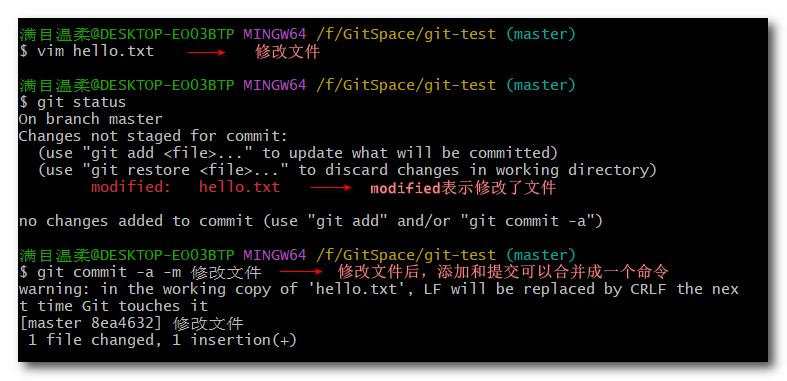

#### git log

> 查看日志信息

```sh
git log
git log --oneline	# 一行显示
```

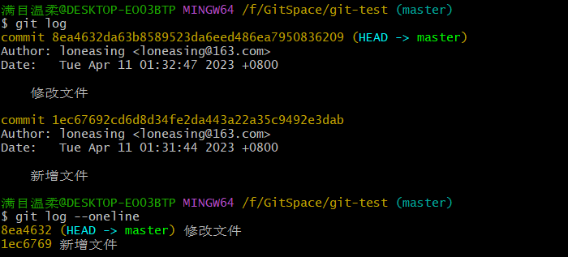


**删除文件**

```sh
git rm -f hello.txt		# 第一步。从工作区删除文件，如果不用命令直接从windows界面删除的话，需要先将删除的文件添加到暂存区
git commit -m 删除hello	 # 第二步。将文件从本地库删除
```

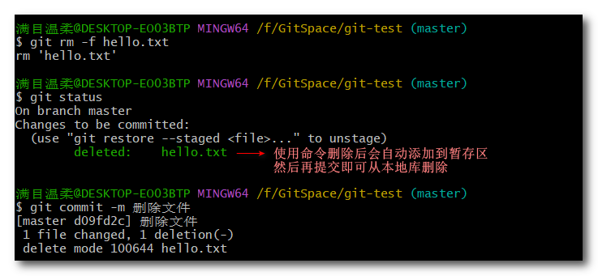

#### git restore

> 从本地库恢复文件
>
> 假如误删除文件，但是没有从本地库，可以从本地库恢复删除的文件

```sh
git restore 文件名
```


#### git reset

> 重置到指定版本。将文件从工作区删除且从本地库删除，可以使用reset命令恢复到指定版本，但是之后的版本会丢失

```sh
git reset --hard 版本号前七位
```

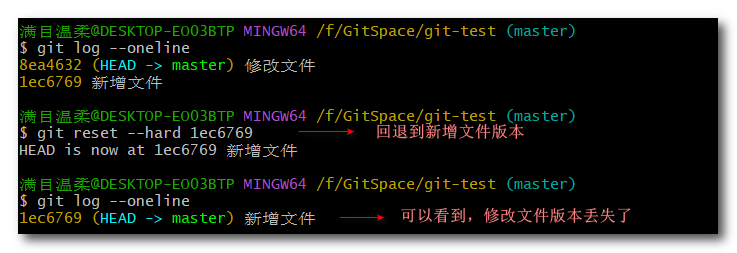

hello.txt文件确实回到了之前的版本，由之前的两个hello变回了一个

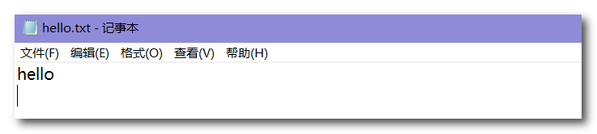

#### git revert

> 还原到某个版本之前，其之后的版本不会丢失，相当于新建一个之前的版本。

```
git revert 版本号
```

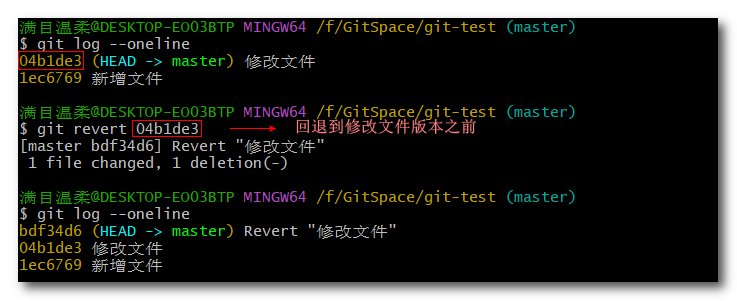


#### git branch

> 创建分支，创建分支是基于提交创建的，没有提交无法创建分支。

```sh
git branch 分支名		# 创建分支
git branch -d 分支名	# 删除分支
```


#### git checkout

>  切换分支

```sh
git checkout 分支名		# 切换分支
git checkout -b 分支名		# 创建并切换到该分支
```

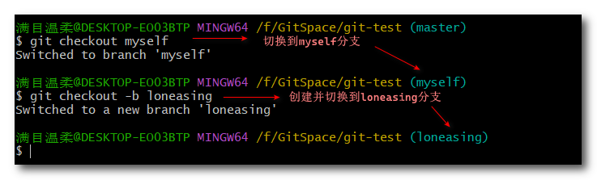


#### git merge

> 合并分支。（合并提交过的文件）

```sh
git merge 分支名	# 将该分支合并到当前分支 
```

首先现在myself分支里面修改hello.txt文件


回到主分支，查看主分支内容

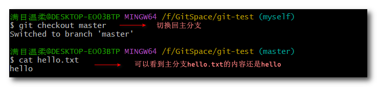

合并myself的内容到主分支

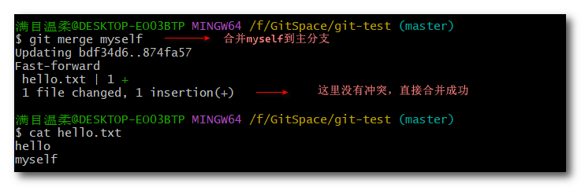

再次修改myself分支的内容，在同行修改，使其合并产生冲突

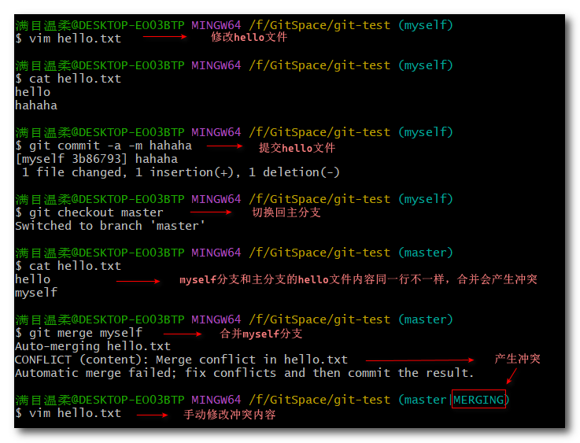

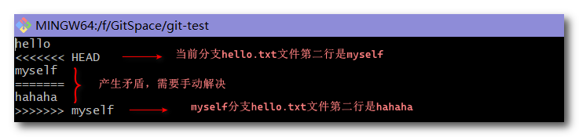


#### git tag

> 添加标签，相当于给版本号取个别名

```sh
git tag 标签名 版本号
```

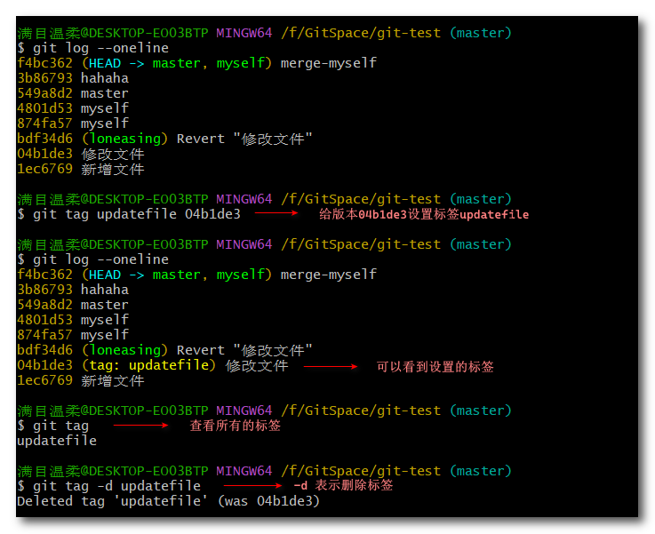


#### get clone

> 克隆远程仓库

```sh
git clone 链接
```

​	(1) 先复制远程仓库的连接

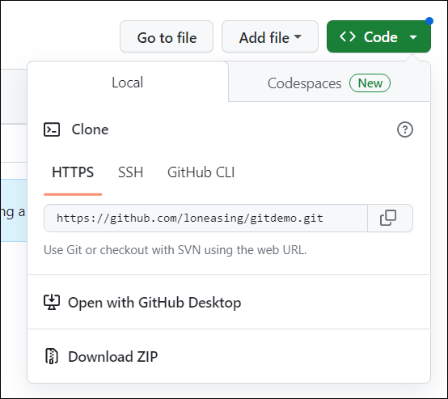

​	(2) 输入命令`git clone 链接`

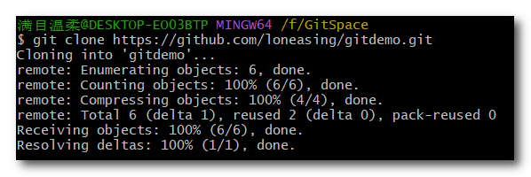

（3）查看配置信息

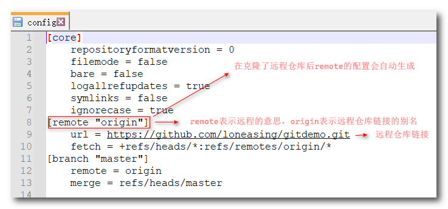


#### git remote

> 配置远程仓库。这里使用ssh链接传输。

```sh
git remote add 远程名 远程仓库地址	# 配置远程仓库
git remote remove 远程名			# 删除远程仓库
git remote rename 远程名			# 修改远程仓库别名
git remote -v 					  # 查看当前所有远程地址别名
```

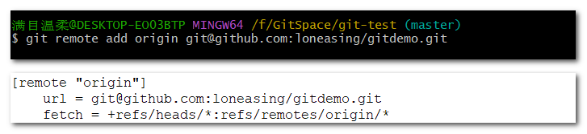


#### git push

> 将本地库的文件推送到远程库。

github支持两种同步方式“https”和“ssh”。如果使用https很简单基本不需要配置就可以使用，但是每次提交代码和下载代码时都需要输入用户名和密码。ssh模式比https模式的一个重要好处就是，每次push、pull、fetch等操作时，不用重复填写遍用户名密码。前提是必须是这个项目的拥有者或者合作者，且配好了ssh key。

- 配置ssh免密登录

  ①`ssh-keygen -t rsa -C GitHub账号`：生成免密登录密钥（按三次回车键）

  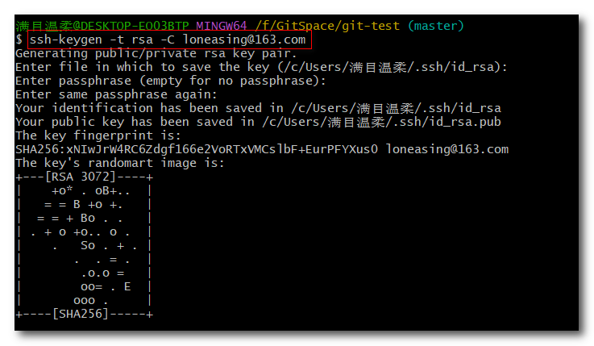

  ②复制密钥，生成的密钥文件在C:\Users\用户名\ .ssh文件中

  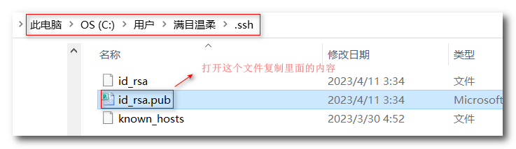

  ③在GitHub个人设置中保存密钥

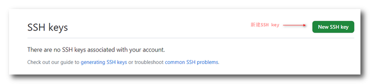

- 推送文件到远程库

  ```sh
  git push 远程名 当前分支名			# 将当前分支推送到远程库
  git push 远程仓库链接 当前分支名	  # 使用链接也可以
  ```

  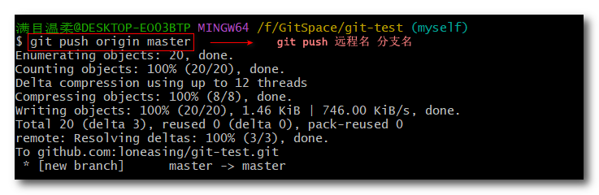

- 在远程库修改文件

  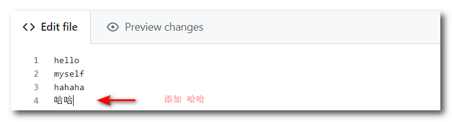

#### git pull

> 从远程库拉取文件。拉取到本地库和工作区

```sh
git pull 远程名 远程库的分支名	# 指定远程库的分支拉取到当前分支
```

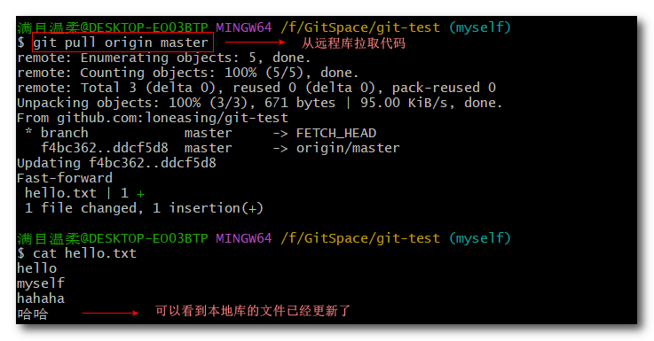
