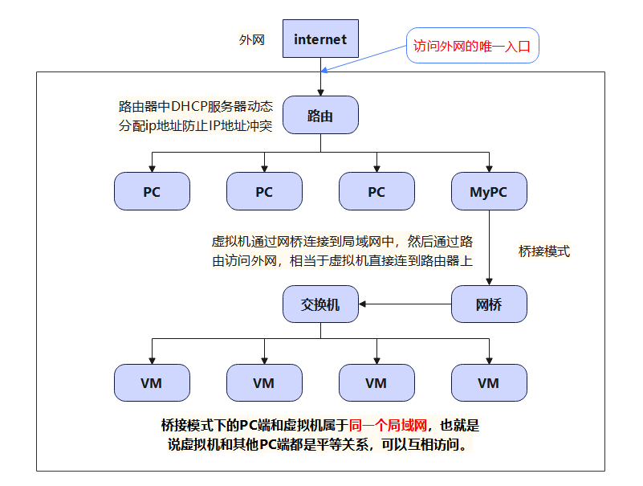
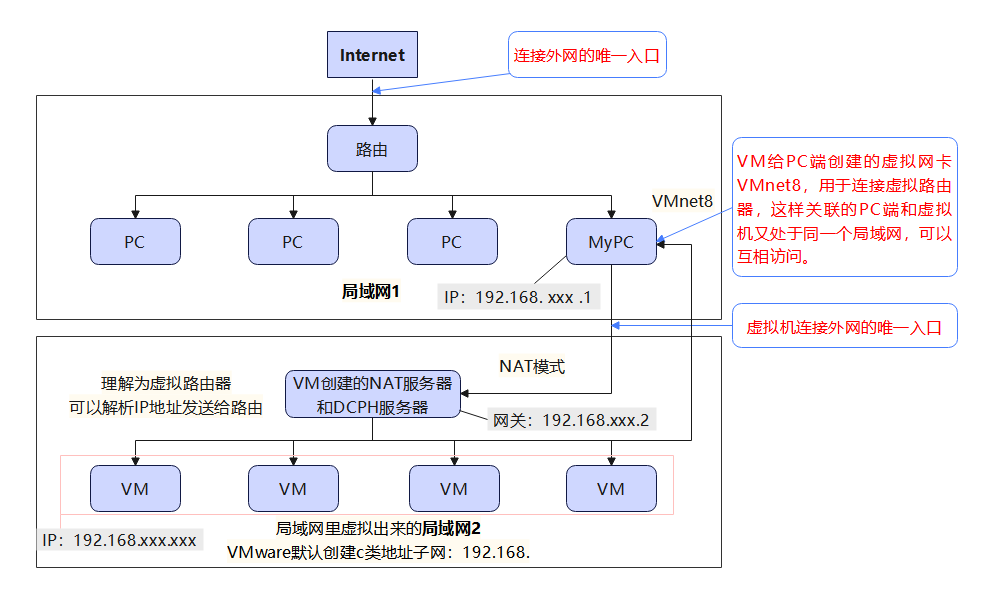
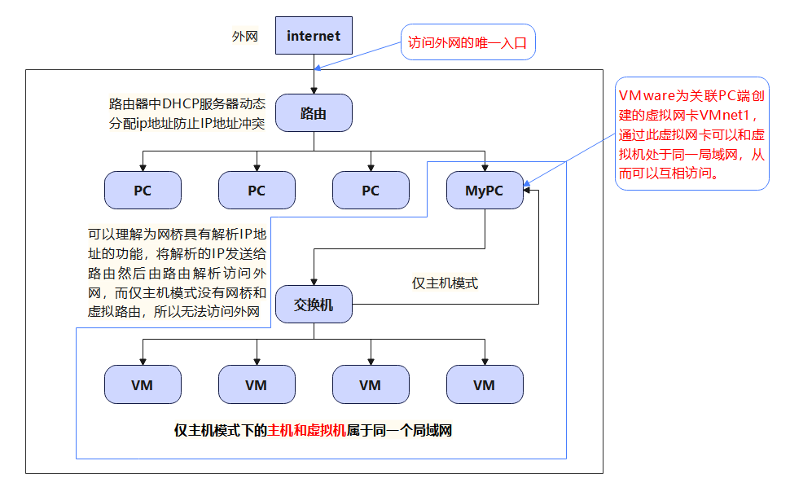

## 网络配置

### 1. 网络配置常用命令

- ping：检测网络是否可以链接

  > 例如：ping 192.168.1.10
  >
  > ​			ping www.baidu.com

- ifconfig：查看网络配置信息。windows中是ipconfig


### 2. 网络连接模式

#### 2.1 桥接模式

虚拟机直接链接外部物理网络的模式，主机起到了网桥的作用。这种模式下虚拟机可以直接访问外部网络，并且对外部网络是可见的。



#### 2.2 NAT模式

虚拟机和主机构建一个专用网络，并通过虚拟网络地址转换设备（NAT）对IP进行转换。虚拟机通过共享主机IP可以访问外部网络，但外部网络无法访问虚拟机。



#### 2.3 仅主机模式

虚拟机只与主机共享一个专用网络，与外部网络无法通信。



### 3. 修改IP地址

1. **查看IP配置文件**

   ```sh
   [root@hadoop100 ~]#vim /etc/sysconfig/network-scripts/ifcfg-ens33
   ```

   

2. **修改网络配置**

   修改为静态分配IP，然后设置IP地址、子网掩码（可以不需要设置，默认是255.255.255.0）、网关、域名解析器

   ```sh
   TYPE="Ethernet" #网络类型（通常是 Ethemet）
   PROXY_METHOD="none"
   BROWSER_ONLY="no"
   BOOTPROTO="static" #IP的配置方法[none|static|bootp|dhcp]（引导时不使用协议|静态分配 IP|BOOTP 协议|DHCP 协议）
   DEFROUTE="yes"
   IPV4_FAILURE_FATAL="no"
   IPV6INIT="yes"
   IPV6_AUTOCONF="yes"
   IPV6_DEFROUTE="yes"
   IPV6_FAILURE_FATAL="no"
   IPV6_ADDR_GEN_MODE="stable-privacy"
   NAME="ens33"
   UUID="5a611afd-3bb5-4527-9d1b-a37e2fbcef59" #随机id
   DEVICE="ens33" #接口名（设备,网卡）
   ONBOOT="yes" #系统启动的时候网络接口是否有效（yes/no）
   #IP地址
   IPADDR=192.168.61.100
   #子网掩码
   NETMASK=255.255.255.0
   #网关,第三个数也可以更改，但是需要保证在同一个网段，即全部相同，这是全都是61
   GATEWAY=192.168.61.2
   #域名解析器
   DNS1=192.168.61.2
   ```

3. **修改配置后需要重启网络**

   ```sh
   [root@hadoop100 ~]# service network start 
   ```

4. **查看网络信息**

   ```sh
   [root@hadoop100 ~]# ifconfig
   ens33: flags=4163<UP,BROADCAST,RUNNING,MULTICAST>  mtu 1500
           inet 192.168.101.110  netmask 255.255.255.0  broadcast 192.168.101.255	# inet为本机ip地址
           inet6 fe80::20c:29ff:feb1:1141  prefixlen 64  scopeid 0x20<link>
           ether 00:0c:29:b1:11:41  txqueuelen 1000  (Ethernet)
           RX packets 19485  bytes 13284579 (12.6 MiB)
           RX errors 0  dropped 0  overruns 0  frame 0
           TX packets 12254  bytes 1202959 (1.1 MiB)
           TX errors 0  dropped 0 overruns 0  carrier 0  collisions 0
   ```

   

### 4. 配置主机名

#### 4.1 查看主机名

```sh
#方法一：输入hostname
[root@hadoop100 ~]# hostname

#方法二：输入hostnamectl
[root@hadoop100 ~]# hostnamectl
```

#### 4.2 修改主机名

```sh
#方法一：修改hostname文件，这种方法需要重启才能生效
[root@hadoop100 ~]# vim /etc/hostname
#方法二：hostnamectl set-hostname 主机名，即刻生效
[root@hadoop100 ~]# hostnamectl set-hostname 主机名
```

#### 4.3 修改hosts映射文件

1. 修改 Linux 的主机映射文件（hosts 文件） 后续在 hadoop 阶段，虚拟机会比较多，配置时通常会采用主机名的方式配置， 比较简单方便，不用刻意记 IP 地址。

   ```sh
   （1）打开/etc/hosts
   	[root@hadoop100 ~]# vim /etc/hosts
   （2）添加主机名配置信息：IP地址 主机名
   	192.168.101.100 hadoop100
       192.168.101.101 hadoop101
       192.168.101.102 hadoop102
       192.168.101.103 hadoop103
       192.168.101.104 hadoop104
       192.168.101.105 hadoop105
   ```

2. 修改 windows 的主机映射文件（hosts 文件）

   ```sh
   （1）进入 C:\Windows\System32\drivers\etc 路径
   （2）拷贝 hosts 文件到桌面
   （3）打开桌面 hosts 文件并添加主机名配置信息
   	192.168.101.100 hadoop100
   	192.168.101.101 hadoop101
   	192.168.101.102 hadoop102
   	192.168.101.103 hadoop103
   	192.168.101.104 hadoop104
   	192.168.101.105 hadoop105
   （4）将桌面 hosts 文件覆盖 C:\Windows\System32\drivers\etc 路径的hosts文件
   ```
   
   

### 5. 远程登陆

在windows命令窗口中使用SSH协议登录：

```sh
#方式一：ssh 用户名@IP
C:\Users\满目温柔>ssh root@192.168.101.100
#方式二：ssh 用户名@主机名（前提要配置主机映射关系）
C:\Users\满目温柔>ssh root@hadoop100
```

