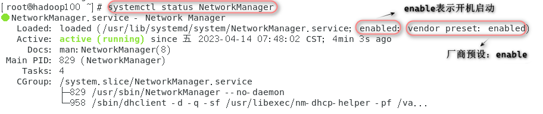
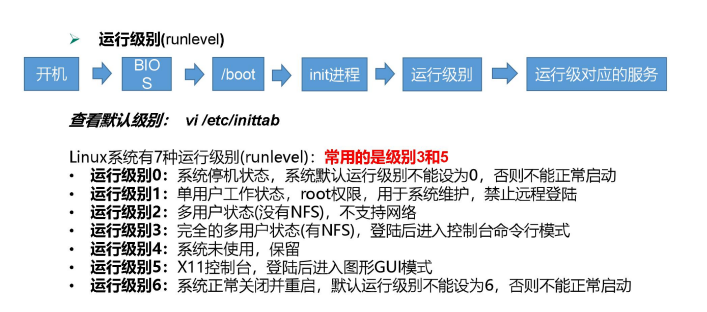

## 系统管理

### 1. 进程和服务

计算机中，一个正在执行的程序或命令，被叫做“进程”（process）。 

启动之后一直存在、常驻内存的进程，一般被称作“服务”（service）。


### 2. service服务管理

#### 2.1 centOS6版本

- **基本语法：service 服务名 操作（比如start|stop|restart|status）**

   ```sh
   # 查看网络服务状态
   [root@hadoop100 ~]# service network status
   # 启动网络服务
   [root@hadoop100 ~]# service network start
   # 停止网络服务
   [root@hadoop100 ~]# service network stop
   # 重启网络服务
   [root@hadoop100 ~]# service network restart
   ```

- **查看服务：ls /etc/init.d**

   ```sh
   # 查看服务
   [root@hadoop100 ~]# ls /etc/init.d
   ```

- **chkconfig 设置后台服务的自启配置**

   chkconfig （功能描述：查看所有服务器自启配置）
   chkconfig 服务名 off （功能描述：关掉指定服务的自动启动）
   chkconfig 服务名 on （功能描述：开启指定服务的自动启动）
   chkconfig 服务名 --list （功能描述：查看服务开机启动状态）

   ```sh
   # 开启/关闭 network服务的自动启动
   [root@hadoop100 ~]#chkconfig network on
   [root@hadoop100 ~]#chkconfig network off
   # 开启/关闭 network服务指定级别的自动启动
   [root@hadoop100 ~]#chkconfig --level 指定级别 network on
   [root@hadoop100 ~]#chkconfig --level 指定级别 network of
   ```


#### 2.2 centOS7版本

- **基本语法：systemctl 操作[start,stop,restart,status] 服务名**

   ```sh
   # 查看网络服务状态
   [root@hadoop100 ~]# systemctl status network
   # 启动网络服务
   [root@hadoop100 ~]# systemctl start network
   # 停止网路服务
   [root@hadoop100 ~]# systemctl stop network
   # 重启网络服务
   [root@hadoop100 ~]# systemctl restart network
   
   # 查看防火墙服务状态
   [root@hadoop100 ~]# systemctl status firewalld
   # 停止防火墙服务
   [root@hadoop100 ~]# systemctl stop firewalld
   # 启动防火墙服务
   [root@hadoop100 ~]# systemctl start firewalld
   # 重启防火墙服务
   [root@hadoop100 ~]# systemctl restart firewalld
   ```

   通常情况下不建议关闭防火墙，而是开放指定的端口号：

   ```sh
   # 开放指定端口，比如8080
   firewall-cmd --zone=public --add-port=8080/tcp --permanent
   # 关闭指定端口
   firewall-cmd --zone=public --remove-port=8080/tcp --permanent
   # 立即生效，执行上述的操作后要执行下面的命令才会立即生效
   firewall-cmd --reload
   # 查看开放的端口
   firewall-cmd --zone=public --list-ports
   ```

   

   centOS7中有一个新的网络服务：NetworkManager，network和NetworkManager只需要开启一个

   ```sh
   # 先停掉network服务
   [root@hadoop100 ~]# service network stop 或者 systemctl stop network
   # 再重启NetManager服务
   [root@hadoop100 ~]# systemctl restart NetworkManager
   
   不过配置文件中p静态IP只对network服务有效，使用NetworkManager服务通过ifconfig查出来的IP地址是动态IP。
   需要再开启network服务查出来的IP才是配置的静态地址，但是得使用service network start命令开启network服务才有效，
   使用systemctl start network开启network服务查出来的IP还是动态的。
   ```

   

   

- **查看服务：ls /usr/lib/systemd**

   ```sh
   # 查看服务
   [root@hadoop100 ~]# ls /usr/lib/systemd
   ```

- **systemctl 设置后台服务的自启配置**

   `systemctl list-unit-files`  ：查看服务开机启动状态
   `systemctl disable 服务名` ：关掉指定服务的自动启动
   `systemctl enable 服务名` ：开启指定服务的自动启动

   ```sh
   # 开启/关闭 iptables(防火墙)服务的自动启动，在centOS7中叫firewalld，后面的.service可以省略
   [root@hadoop100 ~]# systemctl enable firewalld.service
   [root@hadoop100 ~]# systemctl disable firewalld
   ```


### 3. 系统运行级别

- **CentOS 6系统运行级别如图所示**




- **CentOS7 的运行级别简化为:** 

  - multi-user.target 等价于原运行级别 3（多用户有网，无图形界面）

  - graphical.target 等价于原运行级别 5（多用户有网，有图形界面)

- **查看当前运行级别: systemctl get-default**

  ```sh
  [root@hadoop100 ~]# systemctl get-default
  ```

- **修改当前运行级别 systemctl set-default TARGET.target** （这里 TARGET 的值为 multi-user 或者 graphica)

  ```sh
  [root@hadoop100 ~]# systemctl set-default graphica.target
  ```


### 4. 关机重启相关命令

```sh
# 关机
[root@hadoop100 ~]# poweroff
[root@hadoop100 ~]# shutdown now 
[root@hadoop100 ~]# shutdown -h now 

# 重启
[root@hadoop100 ~]# reboot
[root@hadoop100 ~]# shutdown -r now

# 停机（不断电）
[root@hadoop100 ~]# halt
[root@hadoop100 ~]# shutdown -H now

# 1分钟后关机，-h可以省略
[root@hadoop100 ~]# shutdown 1
[root@hadoop100 ~]# shutdown -h 1 

# 指定时间关机，比如12点12分关机
[root@hadoop100 ~]# shutdown 12:12
[root@hadoop100 ~]# shutdown -h 02:00

# 取消操作
[root@hadoop100 ~]# shutdown -c
```

Linux 系统中为了提高磁盘的读写效率，对磁盘采取了 “预读迟写”操作方式。当用户 保存文件时，Linux 核心并不一定立即将保存数据写入物理磁盘中，而是将数据保存在缓 冲区中，等缓冲区满时再写入磁盘，这种方式可以极大的提高磁盘写入数据的效率。但是， 也带来了安全隐患，如果数据还未写入磁盘时，系统掉电或者其他严重问题出现，则将导 致数据丢失。使用 sync 指令可以立即将缓冲区的数据写入磁盘。

```sh
# 将数据由内存同步到硬盘中
[root@hadoop100 ~]# sync
```

