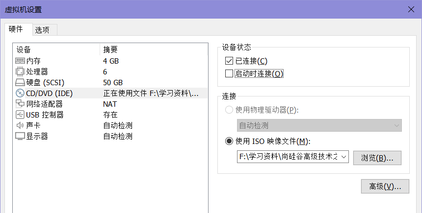
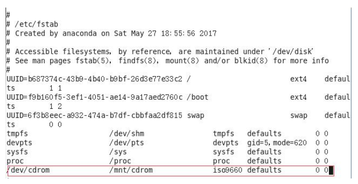
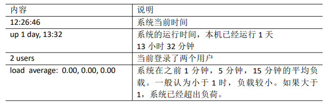
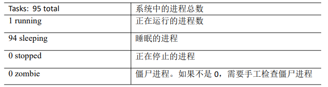
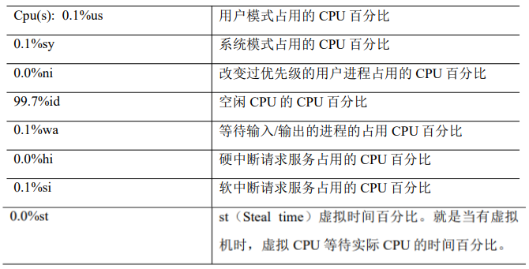
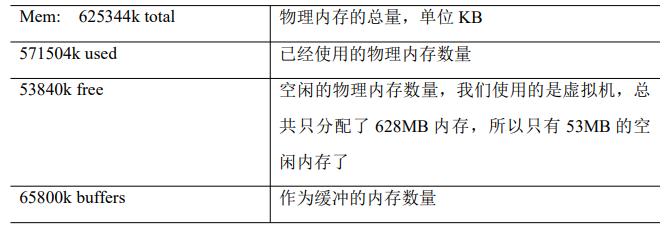
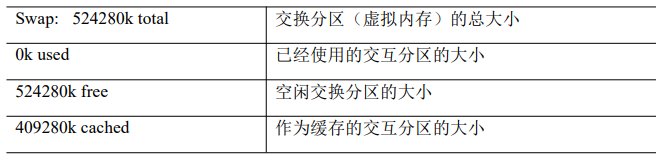

## Linux常用基本命令


### 1. 帮助命令

一部分基础功能的系统命令是直接内嵌在 shell 中的，系统加载启动之后会随着 shell 一起加载，常驻系统内存中。这部分命令被称为“内嵌（built-in）命令”；相应的其它命令 被称为“外部命令”

#### man

> manual的缩写，表示手册的意思，作用是查看命令使用信息，查看内嵌命令时显示的是bash的介绍，因为内置命令内置在bash中
>
> 使用方式：man 命令

```
# 查看 ls 命令的帮助信息
[root@hadoop100 ~]# man ls
```

#### help 

> 获得 shell 内嵌命令的帮助信息 
>
> 使用方式：help 命令 

```
# 查看 cd 命令的帮助信息（cd是内嵌命令）
[root@hadoop100 ~]# help cd
```

#### --help

> 获取shell外部命令的帮助信息
>
> 使用方式：命令 --help

```
# 查看 ls 命令的帮助信息（ls是外部命令）
[root@hadoop100 ~]# ls --help
```

#### type

> 查看命令的类型，是内嵌命令还是外部命令
>
> 使用方式：type 命令

```
# 查看 cd 是内嵌命令还是外部命令
[root@hadoop100 ~]# type cd
cd 是 shell 内嵌
```


### 2. 文件目录类

==如果路径末端加了/，就表示路径代表的是一个目录。==
==如果路径代表的是一个文件则不能加/，否则会按目录处理。==
所以平时路径代表的是一个目录时，建议加上/，比如cd /root/hello/，这样就更直观的知道hello是一个文件夹。

#### pwd

> print working directory，作用是显示当前工作路径的绝对路径
>
> 使用方法：pwd

```
[root@hadoop100 ~]# pwd
/root
```

#### ls

> list缩写，作用是列出目录的类容
>
> 使用方式：ls [选项] [目录或文件]
>
> 选项：-a  列出全部的文件，隐藏的文件(以.开头的文件)也会列出来
> 			-l  列出详细信息，包含文件的属性与权限等信息
> 			-al  列出全部文件的详细信息
>
> 列出的详细信息依次是： 文件类型与权限、链接数、文件属主、文件属组、文件大小(用byte表示)、建立或最近修改的时间、名字

```
# 列出当前目录的所有文件的详细信息
[root@hadoop100 ~]# ls -al
# 列出/root目录下的所有文件
[root@hadoop100 ~]# ls -a /root
# 列出/root目录下文件的详细信息（不包含隐藏文件）
[root@hadoop100 ~]# ls -l /root
# ls -l还可以缩写为ll
[root@hadoop100 ~]# ll /root
```

#### cd

> change directory，切换目录
>
> 使用方式：
> cd 路径：切换路径
> ​cd ~或cd ：回到家目录
> ​cd -：回到上一次所在目录
> cd .：当前目录
> cd ..：返回上一级目录
> cd -p：跳转到实际物理路径，非快捷方式路径

```
[root@hadoop100 ~]# cd
# cd 绝对路径
[root@hadoop100 ~]# cd /root/桌面
# cd 相对路径
[root@hadoop100 桌面]# cd ../视频
# 返回上一次所在目录
[root@hadoop100 视频]# cd -
/root/桌面
# 返回上一级目录
[root@hadoop100 桌面]# cd ..
[root@hadoop100 ~]# 
```

#### mkdir

> make directory，创建目录
>
> 使用方式：mkdir [选项] [路径]目录名
>
> 选项：-p  创建多层目录

```
# 创建一个hello目录
[root@hadoop100 ~]# mkdir hello
# 在hello目录中创建一个hi.txt目录
[root@hadoop100 ~]# mkdir hello/hi.txt/ 		##注意这里hi.txt是一个目录而不是文件
# 创建多个目录，在当前目录创建a目录和b目录
[root@hadoop100 ~]# mkdir a b
# 在a目录中创建b目录，前提a目录要存在
[root@hadoop100 ~]# mkdir /root/a/b
# 创建多层目录，如果目录不存在会自动创建
[root@hadoop100 ~]# mkdir -p hello/a/b
[root@hadoop100 ~]# mkdir -p a/b/c
```

#### rmdir

> remove directory，删除一个目录
>
> 使用方式：rmdir [选项] 目录
>
> 选项：-p  删除多层目录

```
# 删除hello目录，前提hello目录中没有目录或文件
[root@hadoop100 ~]# rmdir hello
# 删除多层目录，其中a目录下面有b目录，b目录下有c目录
[root@hadoop100 ~]# rmdir -p a/b/c ##它会先删除最里层的，依次往外层删除。
```

#### touch

> 创建一个文件
>
> 使用方式：touch [路径]文件名
>
> 不带后缀名创建的默认为文本文件，不带路径则创建在当前目录。
> 注意这个路径是要真实存在的，不存在则无法创建成功。
>
> vim 文件名 也有创建文件的功能，但是如果不输入直接退出则不会创建文件，需要保存退出才会创建文件。

```
# 创建一个hello文件
[root@hadoop100 ~]# touch hello
# 在指定路径中创建hello文件
[root@hadoop100 ~]# touch /home/loneasing/hello 	#注意hello是一个文件不是文件夹
# 在指定路径中创建hi.txt文件
[root@hadoop100 ~]# touch /home/loneasing/hi.txt
```

#### cp

> copy，复制文件到目标路径
>
> 使用方式：cp [选项] 目录或源文件 目标路径或者目标文件
> 当目标路径为一个文件时，表示覆盖该文件，文件名不会改变。强制覆盖不提示的方法：\cp，这表示是原生指令。
>
> 选项：-r	递归复制整个文件夹，因为通常都是需要复制文件夹及里面的内容而不是复制文件夹，所以需要递归复制文件夹的内容。

```
# 将hellox.txt文件复制到/home/loneasing目录下
[root@hadoop100 ~]# cp hello.txt /home/loneasing

# 将a.txt覆盖/home/loneasing目录中的hello.txt文件
[root@hadoop100 ~]# cp a.txt /home/loneasing/hello.txt
cp：是否覆盖"/home/loneasing/hello.txt"？ y 		## 输入y表示是，n表示否
 
# 强制覆盖
[root@hadoop100 ~]# \cp b.txt /home/loneasing/hello.txt 

# 递归复制整个文件夹到另一个目录，a是一个目录
[root@hadoop100 ~]# cp a /home/loneasing
```

#### rm

> remove的缩写，删除文件或者目录
>
> 使用方式：rm [选项] 文件或者目录
>
> 选项：-r	递归删除目录中的所有内容
> 			-f	强制删除，不用提示是否确认
> 			-v	显示指令的详细执行过程

```
# 删除文件
[root@hadoop100 ~]# rm a.txt
rm：是否删除普通空文件 "a.txt"？

# 删除目录中的文件且不提示
[root@hadoop100 ~]# rm -f /home/loneasing/a.txt

# 递归删除目录中的所有内容并且不用提示，a是一个目录
[root@hadoop100 ~]# rm -rf /home/loneasing/a

# 删除所有文件且不提示
[root@hadoop100 ~]# rm -rf /* 	## /*表示根目录下所有内容，注意这个指令不要轻易尝试
```

#### mv

> move的缩写，移动(剪切)文件或目录，重命名文件或目录
>
> 使用方式：mv oldFileName newFileName  表示重命名
>
> 使用方式：mv 原目录 新目录  表示以移动(剪切)目录到另一个目录。
> 注意如果新目录中存在和原目录中同名的目录，且该目录中存在与原目录中同名的目录或文件，则无法移动成功。

```
# 移动文件（剪切）
[root@hadoop100 ~]# mv a.txt /home/loneasing

# 重命名文件，将a.txt重命名为b.txt
[root@hadoop100 ~]# mv a.txt b.txt

# 剪切文件覆盖另一个文件（文件名不会更改）
[root@hadoop100 ~]# mv b.txt /home/loneasing/a.txt

# 移动目录到另一个目录，且目标目录有同名的目录
[root@hadoop100 ~]# mv a /home/loneasing
[root@hadoop100 ~]# mv a /home/loneasing
mv：是否覆盖"/home/loneasing/a"？ y
mv: 无法将"a" 移动至"/home/loneasing/a": 文件已存在  
## 这是因为目标目录也有a目录且该目录中有和原a目录中同名的文件或目录，所以无法进行移动

# 移动目录到另一个目录
[root@hadoop100 ~]# mv a /home/loneasing/a  
```

#### cat

> catch的缩写，查看文件内容
>
> 使用方式：cat [选项] 文件名	##一般查看比较小的文件。
> 选项：-n	显示所有行号

```
# 查看文件内容
[root@hadoop100 ~]# cat hello
haha linux!hello linux!hello linux!
haha linux!hello linux!hello linux!
# 查看文件内容并显示行号
[root@hadoop100 ~]# cat -n hello
     1	haha linux!hello linux!hello linux!
     2	haha linux!hello linux!hello linux!
# 不能查看目录
[root@hadoop100 ~]# cat 桌面
cat: 桌面: 是一个目录
```

#### more

> 文件内容分屏查看器
>
> 使用方式：more 文件名
>
> more 指令是一个基于 VI 编辑器的文本过滤器，它以全屏幕的方式按页显示文本文件 的内容。
> more 指令中内置了若干快捷键：
> Space：向下翻页
> Enter：向下翻一行
> f：下一屏
> b：上一屏
> q：退出more程序
> =：输出当前的行号
> :f:：输出文件名和当前的行号

```
# 进入more分屏查看器
[root@hadoop100 ~]# more jiangye.txt
```

#### less

> 也是分屏显示内容，功能更丰富
>
> 使用方式：less 文件名
>
> less 指令用来分屏查看文件内容，它的功能与 more 指令类似，但是比 more 指令更加 强大，支持各种显示终端。less 指令在显示文件内容时，并不是一次将整个文件加载之后 才显示，而是根据显示需要加载内容，对于显示大型文件具有较高的效率。
>
> more中的快捷键less中都适用，另外less中还有自己的快捷键：
> pageUp：向上翻一页
> pageDown：向下翻一页
> /字符串：向下搜寻字符串功能，按n向下查找，shift+n向上查找
> ?字符串：向上搜寻字符串功能，按n向上查找，shift+n向下查找
> q：退出less程序

```
# 进入less分屏查看器
[root@hadoop100 ~]# less jiangye.txt
```

#### head

> 显示文件的开头部分内容，默认情况下显示文件的前十行内容。
>
> 使用方式：head [选项] 文件名
>选项：-n行数	指定显示头部内容的行数

```
# 显示hello文件头部内容的前5行
[root@hadoop100 ~]# head -n5 hello  ## -n和行数之间空格可有可无
```

#### tail

> 输出文件尾部内容，默认情况下显示文件的后十行内容。
>
> 使用方式：tail [选项] 文件名
>选项：-n行数	显示尾部指定行数内容。
> 				==-f==	==实时追踪==该文档的所有更新，即在tail程序中，该文档有追加的新内容，会实时显示出来。
> 						在监控状态下按Ctrl+s停止监控，按Ctrl+q继续监控，按Ctrl+c退出监控。
> 
>注意如果使用vim进行更新文档，则无法追踪该文件的更新，Linux 所有硬盘分区的文件都会分配一个索引，因为使用vim编辑文档后该文档的索引会发生改变，而监控文件就是按照文件的索引号监控的。
> 使用ls -i 文件 可以查看文件的索引号。

```
# 显示hello文件尾部的后3行内容且实时追踪该文件
[root@hadoop100 ~]# tail -fn3 hello
haha linux!hello linux!hello linux!
haha linux!hello linux!hello linux!
haha linux!haha linux!haha linux!
# 如果该程序没有关闭，且该文件有新增内容，会实时显示出来
我是新增的内容
我是新增的内容2

# 在另一个终端输出内容到hello文件
[root@hadoop100 ~]# echo "我是新增的内容" hello
[root@hadoop100 ~]# echo "我是新增的内容2" hello
```

#### echo

> 输出内容到终端或者文件
>
> echo会把后面所有的内容全部输出，如果有连续多个空格则需要加上引号才能全部输出，否则只输出一个空格。
> 单引号：输出纯文本，原封不动输出引号内的内容。使用-e还是可以支持转义。
> 双引号：支持转义，支持变量的输出。
>
> 使用方式：echo [选项] 内容
> 选项：-e	表示支持转义字符的输出
>
> echo通常会和 ==>(输出重定向)== 和 ==>>(追加)== 搭配使用。
> 使用方式：echo 内容 > 文件	表示将内容输出到文件中，对该文件进行覆盖
> 					echo 内容 >> 文件	表示将内容追加到文件末尾。
>
> 当然其他命令也可以跟>和>>搭配使用，比如ls -l  > 文件，表示将列出的详细内容覆盖写入文件中。
> ls -l >> 文件，表示将列出的内容追加到文件中。
> cat 文件1 > 文件2，表示将文件1的内容覆盖到文件2中。 

```
# 输出到终端
[root@hadoop100 ~]# echo hello
hello
[root@hadoop100 ~]# echo 你好
你好
[root@hadoop100 ~]# echo hello      world		## 有多个空格不加引号只会输出一个
hello world
[root@hadoop100 ~]# echo "hello      world"		## 加上引号后连续空格全部输出
hello      world
[root@hadoop100 ~]# echo hello!					## 不加引号可以输出感叹号
hello!		
[root@hadoop100 ~]# echo 'hello!'				## 加单引号也可以输出感叹号
hello!
[root@hadoop100 ~]# echo "hello!"				## 加双引号不能输出感叹号，还会报错
-bash: !": event not found
[root@hadoop100 ~]# echo -e "hello\nworld"		## -e支持转义输出，和单双引号无关，当然bu'jai
hello
world

# 输出到文件
[root@hadoop100 ~]# echo "hello world" > /root/桌面/hello.txt
# 追加内容到文件
[root@hadoop100 ~]# echo "hello world" >> /root/桌面/hello.txt
```

#### ln

> link的缩写，表示为文件或目录创建软连接
> 软链接也称为符号链接，类似于 windows 里的快捷方式，有自己的数据块，主要存放了链接其他文件的路径。
>
> 使用方式：ln -s [源文件或目录] [软链接名]
> 使用方式：ln [源文件或目录] [硬链接名]，这种方式较少用
> 注意其中的源文件或目录或软链接名都要写绝对路径。
>
> 删除软链接：rm -rf  软链接名，会删除软链接，不会影响真实路径的内容。
> 如果使用rm -rf 软链接名/，会把软链接对应的真实目录下的内容删掉，且软链接不会删。
>
> 进入软链接实际路径：cd -P 软链接名

```
# 为文件在/home/loneasing目录创建软链接hi，访问hi相当于访问hello.txt文件
[root@hadoop100 ~]# ln -s /root/hello.txt /home/loneasing/hi

# 进入实际路径
[root@hadoop100 x]# pwd 	## 当前位置在/home/loneasing/x
/home/loneasing/x
[root@hadoop100 x]# ls		## x目录下的y是一个软链接
y  x.txt
[root@hadoop100 x]# ll y	## 查看y的详细信息
lrwxrwxrwx. 1 root root 7 3月  31 23:33 y -> /root/y	## 可以看到该软链接指向真实路径
[root@hadoop100 x]# cd -P y	## 进入该软链接的真实路径
[root@hadoop100 x]# pwd		## 真实路径是/root/y
/root/y

# 删除软链接
[root@hadoop100 ~]# rm -rf hi
```

#### history

> 查看已经执行过的历史命令
>
> 使用方式：history
>
> 历史命令会有一个编号，可以通过“!编号”来执行对应的历史命令。
>
> 清除历史命令：history -c

```
# 查看历史命令
[root@hadoop100 ~]# history
	......
  996  ll
  997  ls
  998  cd
  999  history
[root@hadoop100 ~]# !999		## 继续执行history命令

# 清除历史命令
[root@hadoop100 ~]# history -c
[root@hadoop100 ~]# history		## 继续查询历史命令只有一条记录
    1  history
```


### 3. 日期时间类

#### date

> 显示当前时间
>
> 使用方式：date [选项] [+format]
> date	显示标准时
> date +%Y	显示当前年份
> date +%m	显示当前月份
> date +%d	显示当前是哪一天
> date "+%Y-%m-%d %H:%M:%S"	显示年月日时分秒
> date +%s	获取时间戳，这里单位为s
>
> 选项：-d ''时间字符串''	显示指定的时间字符串表示的时间。
> 				-s ''日期时间字符串''	设置系统日期时间。
>
> 注意 + 号不能省略。

```
# 显示当前时间
[root@hadoop100 ~]# date
2023年 04月 01日 星期六 00:20:33 CST
[root@hadoop100 ~]# date "+%Y-%m-%d %H:%M:%S"
2023-04-01 00:21:52

# 显示指定时间
[root@hadoop100 ~]# date -d '1 days ago' "+%Y-%m-%d %H:%M:%S"		## 表示一天前
2023-03-31 00:25:18
[root@hadoop100 ~]# date -d '-1 days ago' "+%Y-%m-%d %H:%M:%S"		## 表示一天后
2023-04-02 00:27:18
[root@hadoop100 ~]# date -d '1 years ago' "+%Y-%m-%d %H:%M:%S"		## 表示一年前
2022-04-01 00:28:18

# 设置系统时间
[root@hadoop101 ~]# date -s "2030-01-01 00:00:00"

# 获取秒数时间戳
[root@hadoop100 ~]# date +%s	## 这里获取的时间戳单位为秒
1680280503
```

#### cal

> 查看日历
>
> 使用方式：cal [选项] [[[日] 月] 年]
>
> 选项：
> 	-3,	  显示上个月、当月和下个月
> 	-s,	  Sunday作为一周的第一天
> 	-m,	Monday作为一周的第一天
> 	-y, 	输出当前年的日历

```
# 查看本月日历
[root@hadoop100 ~]# cal
# 查看2025年的日历
[root@hadoop100 ~]# cal 2025
# 查看2025年7月份的日历
[root@hadoop100 ~]# cal 7 2025
      七月 2025     
日 一 二 三 四 五 六
       1  2  3  4  5
 6  7  8  9 10 11 12
13 14 15 16 17 18 19
20 21 22 23 24 25 26
27 28 29 30 31
# 星期一作为一周的第一天
[root@hadoop100 ~]# cal -m 7 2025
      七月 2025     
一 二 三 四 五 六 日
    1  2  3  4  5  6
 7  8  9 10 11 12 13
14 15 16 17 18 19 20
21 22 23 24 25 26 27
28 29 30 31
# 查看2025年7月8号的日历
[root@hadoop100 ~]# cal 8 7 2025

# 查看上一个月、当前月和下一个月的日历
[root@hadoop100 ~]# cal -3
```


### 4. 用户管理类

#### useradd

> 添加新用户
>
> 使用方式：useradd 用户名，添加新用户，用户主目录默认和用户名同名
> 				   useradd -d 主目录 用户名，为新用户指定用户主目录
> 				   useradd -g 组名 用户名，添加用户到某个组

```
# 添加新用户
[root@hadoop100 ~]# useradd tony	## 用户名和用户主目录同名
[root@hadoop100 ~]# useradd -d /home/davied davie		## 用户名和用户主目录不同名

# 添加新用户并且指定用户组
[root@hadoop100 ~]# useradd -g loneasing lyx			## 添加新用户lyx并且添加到loneasing组
```

#### passwd

> 设置用户密码
>
> 使用方式：passwd 用户名

```
# 为tony用户设置密码
[root@hadoop100 ~]# passwd tony
```

#### userdel

> 删除用户
>
> 使用方式：userdel 用户名，删除用户但保留用户主目录
> 				   userdel -r 用户名，删除用户和用户主目录

```
# 删除tony用户
[root@hadoop100 ~]# userdel tony
# 删除davie用户所有信息
[root@hadoop100 ~]# userdel -r davie
```

#### id

> 查看用户是否存在
>
> 使用方式：id 用户名
>
> 查看创建了哪些用户：cat /etc/passwd

```
# 查看用户是否存在
[root@hadoop100 ~]# id root
uid=0(root) gid=0(root) 组=0(root)	##第一列uid表示用户编号，第二列表示gid表示组编号，第三列表示属于哪些组，括号内是组名
[root@hadoop100 ~]# id tony
uid=1001(tony) gid=1001(tony) 组=1001(tony)	## tony用户属于tony组，编号为1001 
[root@hadoop100 ~]# id loneasing
uid=1000(loneasing) gid=1000(loneasing) 组=1000(loneasing),10(wheel) # 可以看到loneasing用户还属于wheel组
## wheel组同样拥有root权限，在安装系统时创建的普通用户默认加入到了wheel组

# 查看所有用户
[root@hadoop100 ~]# cat /etc/passwd
......
用户名:密码(加密过):用户id:组id:注释:用户家目录:shell解析器
loneasing:x:1000:1000:loneasing:/home/loneasing:/bin/bash
tony:x:1001:1003::/home/tony:/bin/bash
davie:x:1002:1003::/home/davied:/bin/bash
tom:x:1003:1003::/home/tom:/bin/bash

```

#### su

> switch user的缩写，切换用户，管理员切换到普通用户不需要输入密码，普通用户切换到其他用户需要输入密码。
>
> 使用方式：su 用户名，切换用户，只能获得用户得执行权限，不能获得环境变量
> 				   su - 用户名，切换用户，并获得用户执行权限和环境变量

```
# 切换tony用户
[root@hadoop100 ~]# su tony
[tony@hadoop100 root]$ echo $PATH
/usr/local/sbin:/usr/local/bin:/usr/sbin:/usr/bin:/root/bin
[tony@hadoop100 root]$ exit
exit
[root@hadoop100 ~]# su - tony
上一次登录：六 4月  1 01:51:26 CST 2023pts/0 上
[tony@hadoop100 ~]$ echo $PATH
/usr/local/bin:/bin:/usr/bin:/usr/local/sbin:/usr/sbin:/home/tony/.local/bin:/home/tony/bin

```

#### who

> 查看用户登录信息
>
> 使用方式：whoami，显示当前用户名称
> 				   who am i，显示登录用户的用户名、登录时间及IP
> 				   who，显示所有用户
>
> 在root用户切换普通用户后，相当于root用户包裹着普通用户，再在普通用户切换其他用户相当于普通用户包着其他用户，层层嵌套，使用exit命令表示退到上一层用户，直到退到root用户。这就是为什么who am i显示的是最开始的用户。

```
#查看当前用户名
[root@hadoop100 ~]# su - tony
[tony@hadoop100 ~]$ whoami
tony
[tony@hadoop100 ~]$ who am i
root     pts/0        2023-03-31 17:22 (192.168.101.1)		## pts/0指的是终端窗口m
[root@hadoop100 ~]# who
root     pts/0        2023-04-03 23:31 (192.168.101.1)
loneasing pts/1        2023-04-04 09:14 (192.168.101.1)
```

#### sudo

> 授予普通用户root权限
>
> 使用方式：sudo 操作
>
> 前提是root用户要在sudoers配置文件中添加用户：
>
> ```
> # 修改配置文件
> [root@hadoop101 ~]# vim /etc/sudoers
> # 在root下面添加用户，表示给用户授予root权限
> ## Allow root to run any commands anywhere
> root	ALL=(ALL) 		ALL
> loneasing	ALL=(ALL) 	NOPASSWD:ALL	## NOPASSWD表示使用sudo命令时不需要输入密码
> tony 	ALL=(ALL) 		ALL		
> ```
>
> 修改完毕，可以用 tony帐号登录，然后用命令 sudo ，即可获得 root 权限进行操作

```
# 在root目录切换到普通用户，然后获取权限查看root目录的内容
[root@hadoop100 ~]# su tony			## 切换tony用户
[tony@hadoop100 root]$ ls			## 当前是root目录，所以普通用户无法查看
ls: 无法打开目录.: 权限不够
[tony@hadoop100 root]$ sudo ls		## 使用sudo获取root权限
[sudo] tony 的密码：				 ## 需要输入tony的密码
a.html	anaconda-ks.cfg  hello	hi.txt	initial-setup-ks.cfg  jiangye.txt  z  公共  模板  视频	图片  文档  下载  音乐	桌面
```

#### usermod

> 修改用户所属的组，新建的用户默认就在自己同名的组里。
>
> 使用方式：usermod -g 用户组 用户名，修改用户组，给定的组必须存在，默认组id是1
>
> 查看所有用户组信息：cat etc/group

```
# 先创建haircut组
[root@hadoop100 ~]# groupadd haircut
# 查看tony用户的用户组
[root@hadoop100 ~]# id tony
uid=1001(tony) gid=1001(tony) 组=1001(tony)
# 查看davie用户的用户组
[root@hadoop100 ~]# id davie
uid=1002(davie) gid=1002(davie) 组=1002(davie)

# 修改用户组，将tony和davie用户添更改到haircut组
[root@hadoop100 ~]# usermod -g haircut tony
[root@hadoop100 ~]# usermod -g haircut davie

# 查看tony和davie用户的用户组，可以看到tony和davie都属于haircut组了
[root@hadoop100 ~]# id tony
uid=1001(tony) gid=1003(haircut) 组=1003(haircut)
[root@hadoop100 ~]# id davie
uid=1002(davie) gid=1003(haircut) 组=1003(haircut)

# 查看所有用户组信息
[root@hadoop100 ~]# cat etc/group
	...
loneasing:x:1000:loneasing		## 普通用户的用户编号是从1000开始的
tony:x:1001:
davie:x:1002:
haircut:x:1003:
```

#### groupadd

> 新增用户组
>
> 使用方式：groupadd 组名

```
# 新增用户组
[root@hadoop100 ~]# groupadd haircut
```

#### groupdel

> 删除用户组
>
> 使用方式：groupdel 组名

```
# 删除tony用户组和davie用户组，因为已经将他们更改到haircut用户组了，所以tony组和davie组可以删掉了
[root@hadoop100 ~]# groupdel tony
[root@hadoop100 ~]# groupdel davie
```

#### groupmod

> 修改组
>
> 使用方式：groupmod -n 新组名 原组名，-n表示修改组名

```
# 修改组名
[root@hadoop100 ~]# groupmod -n fashion haircut
```


### 5. 文件权限类

**文件属性**

- Linux系统是一种典型的多用户系统，不同的用户处于不同的地位，拥有不同的权限。 为了保护系统的安全性，Linux系统对不同的用户访问同一文件（包括目录文件）的权限做了不同的规定。在Linux中我们可以使用ll或者ls -l命令来显示一个文件的属性以及文件所属的用户和组。文件类型及权限由从左到右的 10 个字符表示，如图 所示。


​		如果没有权限，就会出现减号[ - ]。从左至右用0-9这些数字来表示: 	
​		（1）0 首位表示类型 在Linux中第一个字符代表这个文件是目录、文件或链接文件等等 - 代表文件 d 代表目录 l 链接文档(link file)； 		（2）第1-3位确定属主（该文件的所有者）拥有该文件的权限。---User 
​		（3）第4-6位确定属组（所有者的同组用户）拥有该文件的权限，---Group 
​		（4）第7-9位确定其他用户拥有该文件的权限 ---Other 

- rwx 作用文件和目录的不同解释 

  （1）作用到文件：
   		 [ r ]代表可读(read): 可以读取，查看。
   		[ w ]代表可写(write): 可以修改，但是不代表可以删除该文件，删除一个文件的前 提条件是对该文件所在的目录有写权限。
   		 [ x ]代表可执行(execute):可以被系统执行。
  （2）作用到目录： 
   		 [ r ]代表可读(read): 可以读取，ls查看目录内容 。
   		[ w ]代表可写(write): 可以修改，目录内创建+删除+重命名目录。
   	     [ x ]代表可执行(execute):可以进入该目录。

- 文件属性详细介绍

  

​		 （1）如果查看到是文件：链接数指的是硬链接个数。 
​		 （2）如果查看的是文件夹：链接数指的是子文件夹个数。

#### chmod

> change module的缩写，改变权限
>
> 使用方式1：chmod [选项] [{ugoa}{+-=}{rwx}] 文件或目录
> u:所属者(属主)	g:所有者所在组(属组)	o:其他人	a:所有人(u、g、o 的总和)
> 例如：chmod u=w hello，表示将hello文件权限设置为仅所属者可写文件
> 			chmod ug=rw hello，表示将hello文件权限设置为所属者和所属者同组用户可读可写
> 			chmod a=rwx hello，表示将hello文件权限设置为所有用户可读可写可执行
> 			chmod g-x hello，表示将hello文件取消所属者同组用户的可执行权限
> 			chmod o+r hello，表示给hello文件加上其他用户的可读权限
> 			chmod u=rwx,g+w,o-r，表示将文件hello权限设置为属主可读可写可执行、属组添加可写权限、其他用户取消可读权限

> 使用方式2：chmod [选项] 三位数字 文件或目录
> 其中数字的含义：三位数字分别对应u、g、o的值。
> 将rwx三位用二进制来表示，0表示关闭，1表示开启，最大值为111=7，由此可知r=4，w=2，x=1，rwx=4+2+1=7。
> 000  ->   ---    ->  0
> 001  ->  --x    ->  1
> 010  ->  -w-   ->  2
> 011  ->  -wx  ->  3
> 100  ->   r--   ->  4
> 101  ->  r-w  ->  5
> 110  ->  rw-  ->  6
> 111  ->  rwx ->  7
> 所以u、g、o分别都有8种值
> 777表示ugo分别都为7，也就是rwx都处于开启的状态，770表示ug的rwx都处于开启状态，o的rwx处于关闭状态
> 644表示u拥有rw权限，g只拥有r权限，o也只拥有r权限。
>
> 选项：-R	表示修改整个文件夹里面的所有文件的权限（针对于一个目录）。
> 当目录内所有文件的权限都改成某种权限后，那么该文件夹的权限也是该权限。

```
# 查看tony文件的详细信息
[tony@hadoop100 ~]$ ll tony
-rw-r--r--. 1 root root 0 4月   1 05:46 tony		## 可以看出该文件的权限是u=rw,g=r,o=r，也就是644

# 更改文件权限为属主可读可写可执行、属组可读可写、其他用户可读
[tony@hadoop100 ~]# chmod u+x,g+w tony
# 或者这样写
[tony@hadoop100 ~]# chmod u=rwx,g=rw,o=r tony
# 再或者这样写
[tony@hadoop100 ~]# chmod 764 tony

# 修改整个文件夹里面的所有文件的所有者、所属组、其他用户都具有可读可写可执行权限。
[tony@hadoop100 ~]$ mkdir Tony			## 首先创建一个文件夹
[tony@hadoop100 ~]$ touch Tony/a.html	## 创建两个文件
[tony@hadoop100 ~]$ touch Tony/b.html
[tony@hadoop100 ~]$ chmod -R 777 Tony	## 更改该文件夹内所有文件的权限为777
[tony@hadoop100 ~]$ ll Tony				## 查看文件的详细信息可以看到权限变成了所有用户可读可写可执行
总用量 0
-rwxrwxrwx. 1 tony fashion 0 4月   1 06:16 a.html
-rwxrwxrwx. 1 tony fashion 0 4月   1 06:16 b.html
```

#### chown

> change owner的缩写，改变所属者
>
> 使用方式：chown [选项] 最终用户 文件或目录
>选项：-R，递归操作，表示将所有文件都进行更改
> 当目录内所有文件的所属者都改成某个用户后，那么该文件夹的所属者也是该用户。

```
[tony@hadoop100 ~]$ ll hello		## 可以看到hello的所属者是tony，下面对其进行更改，注意需要root权限才能更改
-rw-r--r--. 1 tony fashion 0 4月   1 06:30 hello
# 将hello文件所属者改为loneasing
[root@hadoop100 ~]# chown loneasing /home/tony/hello/		## 将hello文件的所属者改成loneasing
[root@hadoop100 ~]# ll /home/tony/hello		## 查看文件属性可以看到文件所属者已经更改成loneasing
-rw-r--r--. 1 loneasing fashion 0 4月   1 06:30 /home/tony/hello

# 将Tony目录内文件的所属者都改为loneasing
[root@hadoop100 ~]# chown -R loneasing /home/tony/Tony
[root@hadoop100 ~]# ll /home/tony/Tony
总用量 0
-rwxrwxrwx. 1 loneasing fashion 0 4月   1 06:16 a.html
-rwxrwxrwx. 1 loneasing fashion 0 4月   1 06:16 b.html
```

#### chgrp

> change group的缩写，改变所属组
>
> 使用方式：chgrp [选项] 最终用户组 文件或目录
>选项：-R，将所有文件进行修改

```
# 改变所属组，将Tony目录的所属组改成loneasing
[root@hadoop100 ~]# chgrp -R loneasing /home/tony/Tony
[root@hadoop100 ~]# ll /home/tony/Tony		## 可以看到Tony目录内所有的文件的所属组都改成了loneasing
总用量 0
-rwxrwxrwx. 1 loneasing loneasing 0 4月   1 06:16 a.html
-rwxrwxrwx. 1 loneasing loneasing 0 4月   1 06:16 b.html
```


### 6. 搜索查找类

#### find

> 查找文件或目录
> find 指令将从指定目录向下递归地遍历其各个子目录，将满足条件的文件显示在终端。
>
> 使用方式：find 名字，查找该名字的文件或目录，不指定范围默认查找当前目录。
>
> 使用方式：find [搜索目录] [选项]
> 选项： -name 查询方式，按照指定的文件名查找模式查找文件
> 			-user 用户名，根据文件所属者查找
> 			-size {+-}文件大小<单位>，按照指定的文件大小查找文件，+nM表示大于n兆的，-nM表示小于n兆的
> 				单位：b ——块（512 字节），c —— 字节，w —— 字（2 字节），k —— 千字节，M —— 兆字节，G —— 吉字节

```
# 查找hello
[root@hadoop100 ~]# find hello
hello

# 搜索指定目录下的hello文件或目录
[root@hadoop100 ~]# find /home/tony/hello
/home/tony/hello
/home/tony/hello/hello.html
/home/tony/hello/hello.txt
/home/tony/hello/hi.txt
/home/tony/hello/hi.html

# 根据文件名查找
[root@hadoop100 ~]# find /home/tony -name hello.txt		## 查找/home/tony目录下的hello.txt文件
/home/tony/hello.txt
/home/tony/hello/hello.txt

# 根据文件名模糊查找
[root@hadoop100 ~]# find /home/tony/ -name '*.html'		## 查找以.html结尾的文件
/home/tony/Tony/a.html
/home/tony/Tony/b.html
/home/tony/hello/hello.html
/home/tony/hello/hi.html

# 根据所属者查找文件或目录
[root@hadoop100 ~]# find /home/tony -user loneasing
/home/tony/Tony
/home/tony/Tony/a.html
/home/tony/Tony/b.html
/home/tony/hello.txt
[root@hadoop100 ~]# ll /home/tony
总用量 0
drwxrwxr--. 2 root      fashion   70 4月   1 18:03 hello
-rw-r--r--. 1 root      root       0 4月   1 17:46 hello1
-rw-r--r--. 1 loneasing fashion    0 4月   1 06:30 hello.txt		## 所属者是loneasing
-rw-r--r--. 1 root      root       0 4月   1 05:46 tony
drwxrwxrwx. 2 loneasing loneasing 34 4月   1 06:16 Tony			## 所属者是loneasing

# 根据文件大小查找
[root@hadoop100 ~]# find -size +10M		## 当前目录查找大于10M的文件
[root@hadoop100 ~]# find /home/tony -size +1k -size -10k		## 查找/home/tony/目录种大于1k小于10k的文件	
```

#### locate

> 快速定位文件路径
>
> locate指令利用建立的系统中所有文件名称及路径的 locate 数据库实现快速定位给定的文件。Locate 指令无需遍历整个文件系统，查询速度较快。为了保证查询结果的准确度，管理员必须定期更新 locate 时刻。
>
> 使用方式：locate 名字，与find不同的是这是按照一个模式查找的，查找了包含这个名字的文件或目录，不指定范围默认全局查找
>
> 更新locate数据库：updatedb

```
# 查找hello
[root@hadoop100 ~]# updatedb		## 先更新locate数据库
[root@hadoop100 ~]# locate hello	## 查找关于hello的文件或目录
/boot/grub2/i386-pc/hello.mod
/home/tony/hello
/home/tony/hello.txt
/home/tony/hello1
/home/tony/hello/hello.html
/home/tony/hello/hello.txt
/home/tony/hello/hi.html
/home/tony/hello/hi.txt
/root/hello
/root/桌面/hello
/usr/lib/grub/i386-pc/hello.mod
/usr/lib64/python2.7/__phello__.foo.py
/usr/lib64/python2.7/__phello__.foo.pyc
/usr/lib64/python2.7/__phello__.foo.pyo
/usr/share/doc/python-ply-3.4/example/BASIC/hello.bas
```

#### grep

> 过滤查找，查找包含的指定内容，并且会高亮显示
>
> 使用方式：查找内容 | grep [选项] 指定内容
>
> 选项：-n，显示行号
> 			-v，匹配没有匹配到的行
>
> 通常搭配==管道符”|“==使用，管道符具有”且“的意思，它表示将前一个命令的结果集作为参数传递给后面的命令。
> 比如ls | grep hello，表示查看所有列表内容且内容包含hello。
> 管道符”|“还会和其他命令搭配使用，比如du | less ，表示将查看文件占用磁盘空间的信息分页显示。

```
# 查看tony相关内容
[root@hadoop100 ~]# locate tony
/home/tony
/home/tony/.bash_history
/home/tony/.bash_logout
/home/tony/.bash_profile
/home/tony/.bashrc
/home/tony/.cache
/home/tony/.config
/home/tony/.mozilla
/home/tony/Tony
/home/tony/hello
/home/tony/hello.txt
/home/tony/hello1
/home/tony/tony
/home/tony/.cache/abrt
/home/tony/.cache/abrt/lastnotification
/home/tony/.config/abrt
/home/tony/.mozilla/extensions
/home/tony/.mozilla/plugins
/home/tony/Tony/a.html
/home/tony/Tony/b.html
/home/tony/hello/hello.html
/home/tony/hello/hello.txt
/home/tony/hello/hi.html
/home/tony/hello/hi.txt
/root/桌面/tony
/var/db/sudo/lectured/tony
/var/spool/mail/tony

# 查看tony中与hello相关的内容
[root@hadoop100 ~]# locate tony | grep hello
/home/tony/hello
/home/tony/hello.txt
/home/tony/hello1
/home/tony/hello/hello.html
/home/tony/hello/hello.txt
/home/tony/hello/hi.html
/home/tony/hello/hi.txt
```

#### wc

> word count的缩写，统计指定文件中的字节数、单词数、行数，并将统计结果显示输出
>
> 使用方式：wc [选项] 文件
> 选项：-c 统计字节数。
> 			-l 统计行数。
> 			-m 统计字符数。这个标志不能与 -c 标志一起使用。
> 			-w 统计单词数。一个单词被定义为由空白、跳格或换行字符分隔的字符串。
> 			-L 打印最长行的长度。
>
> wc也经常搭配"|"管道符一起使用，比如ll | wc -l表示文件和目录的个数（包含自身目录）

```
# 统计文件的行数、单词数、字节数
[root@hadoop100 ~]# wc hello.txt 
  7 101 591 hello.txt				## 行数 单词数 字节数 文件名
# 统计字符数
[root@hadoop100 ~]# wc -m hello.txt 
591 hello.txt						## 591个字符

# 统计当前目录下的文件和目录数，包括隐藏文件
[root@hadoop100 ~]# ll -a | wc -l	## ll指令将一个文件或目录一行展示，所以行数就代表文件和目录个数
37									## 数量中包含了当前这个目录
```


### 7. 压缩和解压类

#### gzip

> 压缩文件，将文件压缩成.gz文件
>
> 使用方式：gzip 文件
> 压缩的文件保存在该文件的目录。
>
> 注意：gzip命令只能压缩文件，不能压缩目录；压缩后不会保留源文件；同时压缩多个文件会产生多个压缩包。

```
# 使用gzip压缩文件
[tom@hadoop100 ~]# gzip hello.txt hello.html		## 同时压缩两个文件
[tom@hadoop100 ~]# ls
hello.txt.gz	hello.html.gz						## 压缩文件的类型是.gz，压缩文件名会会保留原有的后缀
```

#### gunzip

> 解压缩文件，解压.gz压缩文件
>
> 使用方式：gzip 文件.gz

```
# 使用gunzip解压缩文件
[tom@hadoop100 ~]# gunzip hello.txt.gz	hello.html.gz
hello.txt	hello.html
```

#### zip

> 压缩文件，将文件压缩成.zip文件，可以压缩目录且保留源文件
>
> 使用方式：zip [选项] 压缩文件.zip 文件
> zip压缩的文件是.zip文件，压缩文件是压缩后的文件名，也可以写成路径的方式。
>
> 选项：-r，压缩目录里所有的文件，即压缩一个目录

```
# 使用zip压缩文件
[tom@hadoop100 ~]$ ls a				## a目录中有四个文件
a.html  a.txt  b.html  b.txt
[tom@hadoop100 ~]$ zip -r a.zip a	## 压缩a目录，并且命名为a.zip且存放在当前目录
  adding: a/ (stored 0%)
  adding: a/a.html (stored 0%)
  adding: a/b.html (stored 0%)
  adding: a/a.txt (stored 0%)
  adding: a/b.txt (stored 0%)
```

#### unzip

> 解压缩文件
>
> 使用方式：unzip [选项] 压缩文件
> 如果不指定解压缩目录，则默认将压缩文件解压到当前目录。
>
> 选项：-d 目录，指定解压后文件存放的目录。也可以这样写：unzip 压缩文件 -d 目录

```
# 使用unzip解压缩文件a.zip，该文件是由a目录压缩的
[tom@hadoop100 ~]$ unzip -d a a.zip		## 解压缩文件到a目录，当然也可以这样写更直观unzip a.zip -d a
Archive:  a.zip
   creating: a/a/
 extracting: a/a/a.html              
 extracting: a/a/b.html              
 extracting: a/a/a.txt               
 extracting: a/a/b.txt               
[tom@hadoop100 ~]$ ls a					## 可以看到a目录中多了个a目录
a  a.html  a.txt  b.html  b.txt

```

#### tar

> 打包(可包含压缩或解压缩)，内部压缩或解压缩使用了gzip和ungzip工具
>
> 使用方式：tar [选项] 打包后文件.tar[.gz] 打包内容
>
> 选项： -c，打包成.tar文件
> 				-v，显示详细信息
> 				-f，指定压缩且打包后的文件名
> 				-z，压缩gzip或解压缩gunzip，打包的时候表示压缩，解包的时候表示解压缩
> 				-x，解包.tar文件
> 				-C 目录，解压到指定的目录
>
> 一般使用-zcvf表示压缩打包，-zxvf表示解压解包

```
# 打包且压缩成ab.tar.gz文件
[loneasing@hadoop100 ~]$ tar -zcvf ab.tar.gz a.html b.html a.txt b.txt	## 压缩且打包四个文件并命名ab.tar.gz

# 将ab.tar.gz文件解压解包到tar目录
[loneasing@hadoop100 ~]$ tar -zxvf ab.tar.gz -C tar	## 解包解压.tar.gz文件，注意是zxvf，上面是zcvf
```


### 8. 磁盘和分区类

#### du

> disk usage 的缩写，查看文件和目录占用的磁盘空间
>
> 使用方式：du [选项] [目录或文件]
>选项：
> -h，以GB/MB/KB等单位显示大小
> -a，不仅查看子目录大小，还要包括文件大小
> -c，显示所有的文件和子目录的大小后，最后还显示总和
> -s，只显示总和
> --max-depth=n，指定统计子目录的深度为几层，n=0等价于-s

```
# 查看/root目录的第一层目录的磁盘占用情况
[root@hadoop100 ~]# du -h --max-depth=1
26M	./.cache
8.0K	./.dbus
120K	./.config
352K	./.local
16K	./桌面
0	./下载
0	./模板
0	./公共
0	./文档
0	./音乐
0	./图片
0	./视频
0	./z
59M	./.mozilla
4.0K	./tar
97M	.			## /root目录总的占用磁盘空间大小

# 只查看/root目录占用磁盘空间的大小
[root@hadoop100 ~]# du -hs
97M	.


# 查看/home/tom/a目录占用磁盘的大小
[root@hadoop100 ~]# du -h /home/tom/a/
16K	/home/tom/a/b/c
32K	/home/tom/a/b
72K	/home/tom/a/

# 查看/home/tom/a目录占用磁盘的大小及总占用大小
[root@hadoop100 ~]# du -ch /home/tom/a/
16K	/home/tom/a/b/c
32K	/home/tom/a/b
72K	/home/tom/a/
72K	总用量

# 查看/home/tom/a目录的所有目录及文件占用磁盘空间的大小及总用量
[root@hadoop100 ~]# du -ach /home/tom/a/
0	/home/tom/a/b.html
0	/home/tom/a/a.txt
0	/home/tom/a/b.txt
4.0K	/home/tom/a/aazip.zip
4.0K	/home/tom/a/azip.zip
4.0K	/home/tom/a/a.html.zip
0	/home/tom/a/a.html
4.0K	/home/tom/a/ab.gz
4.0K	/home/tom/a/ab.tar.gz
12K	/home/tom/a/ab.tar1.gz
4.0K	/home/tom/a/ab.tar2.gz
4.0K	/home/tom/a/a.tar.gz
4.0K	/home/tom/a/b/a.html
4.0K	/home/tom/a/b/a.txt
4.0K	/home/tom/a/b/b.html
4.0K	/home/tom/a/b/b.txt
4.0K	/home/tom/a/b/c/a.html
4.0K	/home/tom/a/b/c/a.txt
4.0K	/home/tom/a/b/c/b.html
4.0K	/home/tom/a/b/c/b.txt
16K	/home/tom/a/b/c
32K	/home/tom/a/b
72K	/home/tom/a/
72K	总用量

# 查看/hoem/tom/a目录第一层子目录的磁盘占用大小
[root@hadoop100 ~]# du -h --max-depth=1 /home/tom/a/		## 不会包括文件
32K	/home/tom/a/b
72K	/home/tom/a/

# 查看根目录占用磁盘空间的大小
[root@hadoop100 ~]# du -sh /
5.1G	/
```

#### df

> dick free，查看磁盘空间使用情况
>
> 使用方式：df [选项]
>
> 选项：-h，以人们较易阅读的 GBytes, MBytes, KBytes 等格式显示；

```
# 查看磁盘空间使用情况
[root@hadoop100 ~]# df -h
文件系统        容量  已用  可用 已用% 挂载点
devtmpfs        2.0G     0  2.0G    0% /dev			## devtmpfs是Linux内核一开始启动时创建的文件系统
tmpfs           2.0G     0  2.0G    0% /dev/shm		## tmpfs是内存文件系统，swap分区也是该文件系统
tmpfs           2.0G   13M  2.0G    1% /run
tmpfs           2.0G     0  2.0G    0% /sys/fs/cgroup
/dev/sda3        45G  5.1G   40G   12% /			## sda3是表示sda硬盘的第三个分区
/dev/sda1      1014M  169M  846M   17% /boot		## s表示SCSI硬盘，d表示disk，a表示第一块硬盘，b表示第二，以此类推
tmpfs           394M   12K  394M    1% /run/user/42
tmpfs           394M     0  394M    0% /run/user/0
```

#### free

> 查看内存空间的使用情况
>
> 使用方式：free [选项]

```
# 查看内存的使用情况
[root@hadoop100 ~]# free -h
              total        used        free      shared  buff/cache   available
Mem:           3.8G        659M        2.4G         18M        774M        2.9G		## 真实内存
Swap:          4.0G          0B        4.0G											## 虚拟内存
```

#### lsblk

> list block，查看设备挂载情况
>
> 使用方式：lsblk [选项]
> 选项：-f，查看详细的设备挂载情况

```
# 查看设备挂载情况
[root@hadoop100 ~]# lsblk
NAME   MAJ:MIN RM  SIZE RO TYPE MOUNTPOINT
sda      8:0    0   50G  0 disk 		## 第一块硬盘
├─sda1   8:1    0    1G  0 part /boot	## 第一个分区
├─sda2   8:2    0    4G  0 part [SWAP]	## 第二个分区
└─sda3   8:3    0   45G  0 part /		## 第三个分区
sr0     11:0    1 1024M  0 rom  		## 光驱设备，在文件中是/dev/cdrom，默认大小是1Gib
# 查看详细挂载信息
[root@hadoop100 ~]# lsblk -f
设备名	 文件系统  唯一标识										挂载点
NAME   FSTYPE LABEL UUID                                 MOUNTPOINT
sda                                                      
├─sda1 xfs          66ef907c-8747-4414-8234-093a53601021 /boot
├─sda2 swap         e6183fcd-44b7-45b5-86ed-4e8527013ba8 [SWAP]
└─sda3 xfs          0603f727-cb2b-4b6c-b049-6e0304d5d520 /
sr0   

# 当插入光盘后默认自动挂载到/run/media/root/目录下
[root@hadoop100 ~]# lsblk
NAME   MAJ:MIN RM  SIZE RO TYPE MOUNTPOINT
sda      8:0    0   50G  0 disk 
├─sda1   8:1    0    1G  0 part /boot
├─sda2   8:2    0    4G  0 part [SWAP]
└─sda3   8:3    0   45G  0 part /
sr0     11:0    1  4.4G  0 rom  /run/media/root/CentOS 7 x86_64		## 插入光盘后显示光盘的大小
```

#### mount

> 挂载设备，比如新增的硬盘，插入的光盘等
>
> 对于Linux用户来讲，不论有几个分区，分别分给哪一个目录使用，它总归就是一个根目录、一个独立且唯一的文件结构。 Linux中每个分区都是用来组成整个文件系统的一部分，它在用一种叫做“挂载”的处理方法，它整个文件系统中包含了一整套的文件和目录，并将一个分区和一个目录联系起来， 要载入的那个分区将使它的存储空间在这个目录下获得。
>
> 使用方式：mount [-t vfstype] [-o options] device dir
> -t vfstype：指定文件系统的类型，通常不必指定。mount 会自动选择正确的类型。
> 常用类型有： 光盘或光盘镜像：iso9660 
> 						DOS fat16 文件系统：msdos 
> 						Windows 9x fat32 文件系统：vfat 
> 						Windows NT ntfs 文件系统：ntfs 
> 						Mount Windows 文件网络共享：smbfs 
> 						UNIX(LINUX) 文件网络共享：nfs 
>
> -o options：主要用来描述设备或档案的挂接方式。
> 常用的参数有： loop：用来把一个文件当成硬盘分区挂接上系统 
> 								ro：采用只读方式挂接设备 
> 							   rw：采用读写方式挂接设备 
> 				   iocharset：指定访问文件系统所用字符集 
>
> device：要挂接(mount)的设备 
> dir：设备在系统上的挂接点(mount point)

**挂载前准备**(必须要有光盘或者已经连接镜像文件)：



```
# 手动挂载光盘镜像文件
[root@hadoop101 ~]# mkdir /mnt/cdrom/ 	## 建立挂载点
[root@hadoop101 ~]# mount -t iso9660 /dev/cdrom /mnt/cdrom/ ## 设备/dev/cdrom 挂载到 挂载点/mnt/cdrom 中
```

**设置开机自动挂载**：

```
# 设置开机自动挂载
[root@hadoop101 ~]# vi /etc/fstab		## 编辑内容如下图所示
```



#### umount

> 删除挂载点
>
> 使用方式：umount 挂载点或者设备，设备和挂载点一一对应

```
# 卸载光盘镜像文件
[root@hadoop101 ~]# umount /mnt/cdrom
或者
[root@hadoop101 ~]# umount /dev/cdrom
```

#### fdisk

> 分区
>
> 使用方式：fdisk -l	#查看磁盘分区详情
> 				   fdisk 硬盘设备名	#对新增硬盘进行分区操作，该操作必须在root用户下才能使用
>
> 分区操作按键说明 
> 	m：显示命令列表 
> 	p：显示当前磁盘分区
> 	n：新增分区
> 	w：写入分区信息并退出 
> 	q：不保存分区信息直接退出

```
# 查看分区详情
[root@hadoop100 ~]# fdisk -l

磁盘 /dev/sda：53.7 GB, 53687091200 字节，104857600 个扇区
Units = 扇区 of 1 * 512 = 512 bytes
扇区大小(逻辑/物理)：512 字节 / 512 字节
I/O 大小(最小/最佳)：512 字节 / 512 字节
磁盘标签类型：dos
磁盘标识符：0x000b4310

   设备 Boot      Start         End      Blocks   Id  System
/dev/sda1   *        2048     2099199     1048576   83  Linux
/dev/sda2         2099200    10487807     4194304   82  Linux swap / Solaris
/dev/sda3        10487808   104857599    47184896   83  Linux
```

- 名词解释：
  	Device：分区序列 
  	Boot：引导 
  	Start：从X磁柱开始 
  	End：到Y磁柱结束 
  	Blocks：容量 
  	Id：分区类型ID 
  	System：分区类型 


### 9. 进程管理类

#### ps

> process status，查看当前系统进程状态
>
> 使用方式：ps [选项]	
> 选项：
> a，列出带有终端的所有用户的进程
> x，累出当前用户的所有进程，包括没有中终端的进程
> u，面向用户友好的显示风格
> 前三种是BSD风格，后三种是标准的Unix风格
> -e，列出所有的进程
> -f，显示完整格式的进程列表
> -u，列出某个用户关联的所有进程
>
> 例如：ps	# 只显示用户调用以及跟终端相关联进程
> BSD风格：ps aux 	#查看系统中所有的进程
> Unix风格：ps -ef 	 #查看系统中所有的进程，还可以查看父子进程之间的关系
>
> 如果想查看进程的 CPU 占用率和内存占用率，可以使用 aux; 如果想查看进程的父进程 ID 可以使用 -ef

***ps aux 显示的信息说明：***
USER：该进程是由哪个用户产生的
PID：进程的 ID 号 
%CPU：该进程占用 CPU 资源的百分比，占用越高，进程越耗费资源；
%MEM：该进程占用物理内存的百分比，占用越高，进程越耗费资源；
VSZ：该进程占用虚拟内存的大小，单位 KB；
RSS：该进程占用实际物理内存的大小，单位 KB； 
TTY：该进程是在哪个终端中运行的。对于CentOS 来说，tty1是图形化终端，tty2-tty6是本地的字符界面终端，pts/0-255代表虚拟终端STAT：进程状态。常见的状态有：R：运行状态、S：睡眠状态、T：暂停状态、 Z：僵尸状态、s：包含子进程、l：多线程、+：前台显示 
START：该进程的启动时间
TIME：该进程占用 CPU 的运算时间，注意不是系统时间 
COMMAND：产生此进程的命令名

```
# 查看所有进程信息
[root@hadoop100 ~]# ps aux | less	## 将查看的信息分屏显示
USER        PID %CPU %MEM    VSZ   RSS TTY      STAT START   TIME COMMAND
root          1  0.0  0.1 193912  6980 ?        Ss   4月01   0:18 /usr/lib/systemd/systemd --switched-root --system --deserialize 22
root          2  0.0  0.0      0     0 ?        S    4月01   0:00 [kthreadd]	## 这个进程管理系统进程
root          4  0.0  0.0      0     0 ?        S<   4月01   0:00 [kworker/0:0H]
root          6  0.0  0.0      0     0 ?        S    4月01   0:00 [ksoftirqd/0]
root          7  0.0  0.0      0     0 ?        S    4月01   0:00 [migration/0]
root          8  0.0  0.0      0     0 ?        S    4月01   0:00 [rcu_bh]
root          9  0.0  0.0      0     0 ?        S    4月01   0:04 [rcu_sched]
root         10  0.0  0.0      0     0 ?        S<   4月01   0:00 [lru-add-drain]
root         11  0.0  0.0      0     0 ?        S    4月01   0:10 [watchdog/0]
root         12  0.0  0.0      0     0 ?        S    4月01   0:00 [watchdog/1]
root         13  0.0  0.0      0     0 ?        S    4月01   0:00 [migration/1]
root         14  0.0  0.0      0     0 ?        S    4月01   0:00 [ksoftirqd/1]
root         16  0.0  0.0      0     0 ?        S<   4月01   0:00 [kworker/1:0H]
root         17  0.0  0.0      0     0 ?        S    4月01   0:00 [watchdog/2]
root         18  0.0  0.0      0     0 ?        S    4月01   0:00 [migration/2]
root         19  0.0  0.0      0     0 ?        S    4月01   0:01 [ksoftirqd/2]
root         21  0.0  0.0      0     0 ?        S<   4月01   0:00 [kworker/2:0H]
root         22  0.0  0.0      0     0 ?        S    4月01   0:02 [watchdog/3]
root         23  0.0  0.0      0     0 ?        S    4月01   0:00 [migration/3]
root         24  0.0  0.0      0     0 ?        S    4月01   0:00 [ksoftirqd/3]
root         26  0.0  0.0      0     0 ?        S<   4月01   0:00 [kworker/3:0H]
root         27  0.0  0.0      0     0 ?        S    4月01   0:05 [watchdog/4]
root         28  0.0  0.0      0     0 ?        S    4月01   0:00 [migration/4]
root         29  0.0  0.0      0     0 ?        S    4月01   0:00 [ksoftirqd/4]
root         31  0.0  0.0      0     0 ?        S<   4月01   0:00 [kworker/4:0H]
root         32  0.0  0.0      0     0 ?        S    4月01   0:05 [watchdog/5]
root         33  0.0  0.0      0     0 ?        S    4月01   0:00 [migration/5]
root         34  0.0  0.0      0     0 ?        S    4月01   0:00 [ksoftirqd/5]
root         36  0.0  0.0      0     0 ?        S<   4月01   0:00 [kworker/5:0H]
root         38  0.0  0.0      0     0 ?        S    4月01   0:00 [kdevtmpfs]
root         39  0.0  0.0      0     0 ?        S<   4月01   0:00 [netns]
root         40  0.0  0.0      0     0 ?        S    4月01   0:00 [khungtaskd]
root         41  0.0  0.0      0     0 ?        S<   4月01   0:00 [writeback]
root         42  0.0  0.0      0     0 ?        S<   4月01   0:00 [kintegrityd]
root         43  0.0  0.0      0     0 ?        S<   4月01   0:00 [bioset]
root         44  0.0  0.0      0     0 ?        S<   4月01   0:00 [bioset]
root         45  0.0  0.0      0     0 ?        S<   4月01   0:00 [bioset]
root         46  0.0  0.0      0     0 ?        S<   4月01   0:00 [kblockd]
root         47  0.0  0.0      0     0 ?        S<   4月01   0:00 [md]
root         48  0.0  0.0      0     0 ?        S<   4月01   0:00 [edac-poller]
上面显示的是第一屏的信息

# 查看与sshd相关的进程
[root@hadoop100 ~]# ps aux | grep sshd
root        1232  0.0  0.1 112900  4356 ?        Ss   4月01   0:00 /usr/sbin/sshd -D ## sshd守护进程
root       26736  0.0  0.1 160988  5636 ?        Ss   00:59   0:01 sshd: root@pts/0	## 远程链接创建的虚拟终端 
root       44581  0.0  0.1 160988  5644 ?        Ss   05:30   0:00 sshd: root@pts/1
root       44801  0.0  0.1 160988  5580 ?        Ss   05:32   0:00 sshd: loneasing [priv]
loneasing  44806  0.0  0.0 160988  2384 ?        S    05:32   0:00 sshd: loneasing@pts/2
root       47024  0.0  0.0 112828   976 pts/0    S+   06:02   0:00 grep --color=auto sshd

# 统计进程的个数
[root@hadoop100 ~]# ps aux | wc -l		## 通过wc -l统计行数即可获取当前进程数
212		## 当前212个进程
```

***ps -ef 显示信息说明：***
UID：用户 ID 
PID：进程 ID 
PPID：父进程 ID 
C：CPU 用于计算执行优先级的因子。数值越大，表明进程是 CPU 密集型运算， 执行优先级会降低；数值越小，表明进程是 I/O 密集型运算，执行优先级会提高 。
STIME：进程启动的时间 
TTY：完整的终端名称 
TIME：CPU 时间 
CMD：启动进程所用的命令和参数

```
# 查看系统所有进程信息
[root@hadoop100 ~]# ps -ef | less
UID         PID   PPID  C STIME TTY          TIME CMD
root          1      0  0 4月01 ?       00:00:18 /usr/lib/systemd/systemd --switched-root --system --deserialize 22
root          2      0  0 4月01 ?       00:00:00 [kthreadd]
root          4      2  0 4月01 ?       00:00:00 [kworker/0:0H]
root          6      2  0 4月01 ?       00:00:00 [ksoftirqd/0]
root          7      2  0 4月01 ?       00:00:00 [migration/0]
root          8      2  0 4月01 ?       00:00:00 [rcu_bh]
root          9      2  0 4月01 ?       00:00:04 [rcu_sched]
root         10      2  0 4月01 ?       00:00:00 [lru-add-drain]
root         11      2  0 4月01 ?       00:00:10 [watchdog/0]
root         12      2  0 4月01 ?       00:00:00 [watchdog/1]
root         13      2  0 4月01 ?       00:00:00 [migration/1]
root         14      2  0 4月01 ?       00:00:00 [ksoftirqd/1]
root         16      2  0 4月01 ?       00:00:00 [kworker/1:0H]
root         17      2  0 4月01 ?       00:00:00 [watchdog/2]
root         18      2  0 4月01 ?       00:00:00 [migration/2]
root         19      2  0 4月01 ?       00:00:01 [ksoftirqd/2]
root         21      2  0 4月01 ?       00:00:00 [kworker/2:0H]
root         22      2  0 4月01 ?       00:00:02 [watchdog/3]
root         23      2  0 4月01 ?       00:00:00 [migration/3]
root         24      2  0 4月01 ?       00:00:00 [ksoftirqd/3]
root         26      2  0 4月01 ?       00:00:00 [kworker/3:0H]
root         27      2  0 4月01 ?       00:00:05 [watchdog/4]
root         28      2  0 4月01 ?       00:00:00 [migration/4]
root         29      2  0 4月01 ?       00:00:00 [ksoftirqd/4]
root         31      2  0 4月01 ?       00:00:00 [kworker/4:0H]
root         32      2  0 4月01 ?       00:00:05 [watchdog/5]
root         33      2  0 4月01 ?       00:00:00 [migration/5]
root         34      2  0 4月01 ?       00:00:00 [ksoftirqd/5]
root         36      2  0 4月01 ?       00:00:00 [kworker/5:0H]
root         38      2  0 4月01 ?       00:00:00 [kdevtmpfs]
root         39      2  0 4月01 ?       00:00:00 [netns]
root         40      2  0 4月01 ?       00:00:00 [khungtaskd]
root         41      2  0 4月01 ?       00:00:00 [writeback]
root         42      2  0 4月01 ?       00:00:00 [kintegrityd]
root         43      2  0 4月01 ?       00:00:00 [bioset]
root         44      2  0 4月01 ?       00:00:00 [bioset]
root         45      2  0 4月01 ?       00:00:00 [bioset]
root         46      2  0 4月01 ?       00:00:00 [kblockd]
root         47      2  0 4月01 ?       00:00:00 [md]
root         48      2  0 4月01 ?       00:00:00 [edac-poller]
上面显示的是第一屏的信息

# 查看与sshd相关进程的父子进程关系
[root@hadoop100 ~]# ps -ef | grep sshd
root        1232      1  0 4月01 ?       00:00:00 /usr/sbin/sshd -D	## sshd守护进程
root       26736   1232  0 00:59 ?        00:00:01 sshd: root@pts/0	## 远程连接创建的虚拟终端1
root       44581   1232  0 05:30 ?        00:00:00 sshd: root@pts/1	## 远程连接创建的虚拟终端2
root       44801   1232  0 05:32 ?        00:00:00 sshd: loneasing [priv] 
上面这个44801进程是用于权限分离而启动的，因为登录了loneasing用户，所以需要启动root用户来进行权限分离，loneasing用户进行需要root权限的操作都是通过该进程完成的。该进程是loneasing这个用户进程的父进程。
loneasing  44806  44801  0 05:32 ?        00:00:00 sshd: loneasing@pts/2
root       47182  26744  0 06:05 pts/0    00:00:00 grep --color=auto sshd ##这是一个虚拟终端输入grep命令的进程
查看上面47182的父进程26744可以看到它是一个bash进程
[root@hadoop100 ~]# ps -ef | grep 26744
root      26744  26736  0 00:59 pts/0    00:00:00 -bash
root      41240  26744  0 04:51 pts/0    00:00:00 wc
root      41350  26744  0 04:53 pts/0    00:00:00 wc
root      41442  26744  0 04:54 pts/0    00:00:00 cat
root      47829  26744  0 06:16 pts/0    00:00:00 ps -ef
root      47830  26744  0 06:16 pts/0    00:00:00 grep --color=auto 26744
查看bash进程的父进程可以看到它的父进程是远程登陆创建的虚拟终端
[root@hadoop100 ~]# ps -ef | grep 26736
root      26736   1232  0 00:59 ?        00:00:01 sshd: root@pts/0
root      26744  26736  0 00:59 pts/0    00:00:00 -bash
root      47931  26744  0 06:18 pts/0    00:00:00 grep --color=auto 26736

通过上面的过程可以知道root进程启动sshd进程，sshd进程创建虚拟终端也就是启动bash进程，bash进程中启动命令对应的进程。

[root@hadoop100 ~]# ps -ef | wc -l
212		## 和上面一样的
```

#### kill

> 通过进程号终止进程
>
> 使用方式：kill [选项] 进程号	#终止指定进程号的进程
> 选项：-9，强制终止进程

```
# 终止浏览器进程
[root@hadoop101 桌面]# kill -9 5102
```

#### killall

> 通过进程名终止进程
>
> 使用方式：kill 进程名
> 通过进程名终止进程，也支持使用通配符，在系统因负载过大而变得卡顿时很有用

```
# 终止火狐进程
[root@hadoop101 桌面]# killall firefox
```

#### pstree

> 查看进程树
>
> 使用方式：pstree [选项]
> 选项：-p，显示进程的PID
> 				-u，显示进程的所属用户（root用户进程的直系子进程还是root用户则不会显示所属用户）

```
# 查看进程数，显示所属用户
[root@hadoop100 ~]# pstree -u
# 查看进程数，显示PID和所属用户
[root@hadoop100 ~]# pstree -up
```

#### top

> 实时监控系统进程状态
>
> 使用方式：top [选项]
> 选项：-d 秒数，设置top指令的刷新时间，默认是3秒
> 				-i，不显示任何闲置或者僵尸进程
> 				-p PID，指定监控某个进程
>
> 在top监控模式下有以下几种操作：
> pageUp：上一页
> pageDown：下一页
> P：以CPU使用率排序，默认就是此项
> M：以内存的使用率排序
> N：以PID排序
> k：终止进程
> q：退出top

```
# 监控进程状态
[root@hadoop100 ~]# top
top - 06:40:56 up 12:18,  3 users,  load average: 0.00, 0.01, 0.05
Tasks: 208 total,   1 running, 207 sleeping,   0 stopped,   0 zombie
%Cpu(s):  0.0 us,  0.1 sy,  0.0 ni, 99.9 id,  0.0 wa,  0.0 hi,  0.0 si,  0.0 st
KiB Mem :  4026156 total,  2371920 free,   698444 used,   955792 buff/cache
KiB Swap:  4194300 total,  4194300 free,        0 used.  3023520 avail Mem 

   PID USER      PR  NI    VIRT    RES    SHR S  %CPU %MEM     TIME+ COMMAND
     1 root      20   0  193912   6980   4184 S   0.0  0.2   0:20.30 systemd
     2 root      20   0       0      0      0 S   0.0  0.0   0:00.05 kthreadd
     4 root       0 -20       0      0      0 S   0.0  0.0   0:00.00 kworker/0:0H
     6 root      20   0       0      0      0 S   0.0  0.0   0:00.04 ksoftirqd/0
     7 root      rt   0       0      0      0 S   0.0  0.0   0:00.07 migration/0
     8 root      20   0       0      0      0 S   0.0  0.0   0:00.00 rcu_bh
     9 root      20   0       0      0      0 S   0.0  0.0   0:04.69 rcu_sched
    10 root       0 -20       0      0      0 S   0.0  0.0   0:00.00 lru-add-drain
    11 root      rt   0       0      0      0 S   0.0  0.0   0:10.62 watchdog/0
    12 root      rt   0       0      0      0 S   0.0  0.0   0:00.21 watchdog/1
    13 root      rt   0       0      0      0 S   0.0  0.0   0:00.12 migration/1
    14 root      20   0       0      0      0 S   0.0  0.0   0:00.12 ksoftirqd/1
    16 root       0 -20       0      0      0 S   0.0  0.0   0:00.00 kworker/1:0H
    17 root      rt   0       0      0      0 S   0.0  0.0   0:00.21 watchdog/2
    18 root      rt   0       0      0      0 S   0.0  0.0   0:00.06 migration/2
    19 root      20   0       0      0      0 S   0.0  0.0   0:01.07 ksoftirqd/2
    21 root       0 -20       0      0      0 S   0.0  0.0   0:00.00 kworker/2:0H
    22 root      rt   0       0      0      0 S   0.0  0.0   0:02.22 watchdog/3
    23 root      rt   0       0      0      0 S   0.0  0.0   0:00.10 migration/3
    24 root      20   0       0      0      0 S   0.0  0.0   0:00.21 ksoftirqd/3
    26 root       0 -20       0      0      0 S   0.0  0.0   0:00.00 kworker/3:0H
    27 root      rt   0       0      0      0 S   0.0  0.0   0:05.66 watchdog/4
    28 root      rt   0       0      0      0 S   0.0  0.0   0:00.17 migration/4
    29 root      20   0       0      0      0 S   0.0  0.0   0:00.07 ksoftirqd/4
    31 root       0 -20       0      0      0 S   0.0  0.0   0:00.00 kworker/4:0H
    32 root      rt   0       0      0      0 S   0.0  0.0   0:05.45 watchdog/5
    33 root      rt   0       0      0      0 S   0.0  0.0   0:00.12 migration/5
    34 root      20   0       0      0      0 S   0.0  0.0   0:00.11 ksoftirqd/5                             
    36 root       0 -20       0      0      0 S   0.0  0.0   0:00.00 kworker/5:0H                           
    38 root      20   0       0      0      0 S   0.0  0.0   0:00.00 kdevtmpfs
    39 root       0 -20       0      0      0 S   0.0  0.0   0:00.00 netns
    40 root      20   0       0      0      0 S   0.0  0.0   0:00.02 khungtaskd
    41 root       0 -20       0      0      0 S   0.0  0.0   0:00.00 writeback
    42 root       0 -20       0      0      0 S   0.0  0.0   0:00.00 kintegrityd
    43 root       0 -20       0      0      0 S   0.0  0.0   0:00.00 bioset
    以上内容是第一页的内容
    
# 监控某个进程的状态
[root@hadoop101 ~]# top -p 2575
```

***top模式下的显示信息***：

**整体系统运行信息**
第一行信息为任务队列信息，如图所示



第二行信息为进程信息，如图所示



第三行信息为CPU信息，如图所示



第四行信息为物理内存信息，如图所示



第五行显示信息为交换分区(swap)信息，如图所示



**具体进程信息** 
PID USER      PR  NI    VIRT    RES    SHR S  %CPU %MEM     TIME+ COMMAND 

PID：进程的id
USER：进程所属的用户
PR：任务调度的优先级
NI：用户指定的nice值，进程友好度，值越大越友好，表示让其他进程先执行，即优先级越低，值越小越不友好非常霸道，优先级越高。
VIrt：虚拟内存占用的大小
RES：实际物理内存占用的大小
SHRS：share memory size，共享内存的大小
S：状态
%CPU：CPU占用比
%MEM：内存占用比
TIME+：进程运行的时间，+表示精确到0.01秒
COMMAND：启动当前进程的命令

#### netstat

> 显示网络状态和端口占用信息
>
> 使用方式：netstat [选项]
> 选项：-a，显示所有正在监听(listen)和未监听的套接字(socket)。套接字就是ip:port，比如192.168.111.1：8080
> 				-l，仅列出在监听的服务状态（注意不是字母i）
> 				-n，拒绝显示别名，能显示数字的全部转化成数字（比如localhost->127.0.0.1）
> 				-p，表示显示哪个进程在调用
>
> 通常使用：netstat -anp | grep xxx		##查看xxx进程的网络信息，可以根据PID或者进程名过滤
> 					netstat -lnp | grep 端口号	##查看网络端口占用情况

```
# 查看sshd有关进程的网络信息
[root@hadoop100 ~]# netstat -anp |grep sshd
协议	接收队列 发送队列	本地地址(socket形式)		远程地址				状态			进程ID/进程名
Proto Recv-Q Send-Q Local Address           Foreign Address         State       PID/Program name 
tcp        0      0 127.0.0.1:6010          0.0.0.0:*               LISTEN      49233/sshd: root@pt 
tcp        0      0 127.0.0.1:6011          0.0.0.0:*               LISTEN      44581/sshd: root@pt 
tcp        0      0 127.0.0.1:6012          0.0.0.0:*               LISTEN      44806/sshd: loneasi 
tcp        0      0 0.0.0.0:22(本地所有地址)     0.0.0.0:*               LISTEN      1232/sshd           
tcp        0     36 192.168.101.100:22      192.168.101.1:65498     ESTABLISHED 49233/sshd: root@pt 
tcp        0      0 192.168.101.100:22      192.168.101.1:56130     ESTABLISHED 44581/sshd: root@pt 
tcp        0      0 192.168.101.100:22      192.168.101.1:57493     ESTABLISHED 44801/sshd: loneasi 
tcp6       0      0 ::1:6010                :::*                    LISTEN      49233/sshd: root@pt 
tcp6       0      0 ::1:6011                :::*                    LISTEN      44581/sshd: root@pt 
tcp6       0      0 ::1:6012                :::*                    LISTEN      44806/sshd: loneasi 
tcp6       0      0 :::22                   :::*                    LISTEN      1232/sshd           
unix  3      [ ]         STREAM     CONNECTED     218099   44806/sshd: loneasi  
unix  2      [ ]         DGRAM                    218096   44801/sshd: loneasi  
unix  3      [ ]         STREAM     CONNECTED     218100   44801/sshd: loneasi  
unix  2      [ ]         DGRAM                    234481   49233/sshd: root@pt  
unix  2      [ ]         DGRAM                    217634   44581/sshd: root@pt  
unix  3      [ ]         STREAM     CONNECTED     28885    1232/sshd 

# 查看22端口占用情况
[root@hadoop100 ~]# netstat -lnp | grep 22
tcp        0      0 192.168.122.1:53        0.0.0.0:*               LISTEN      1573/dnsmasq        
tcp        0      0 0.0.0.0:22              0.0.0.0:*               LISTEN      1232/sshd           
tcp        0      0 127.0.0.1:631           0.0.0.0:*               LISTEN      1229/cupsd          
tcp6       0      0 :::22                   :::*                    LISTEN      1232/sshd           
tcp6       0      0 ::1:631                 :::*                    LISTEN      1229/cupsd          
udp        0      0 0.0.0.0:59223           0.0.0.0:*                           666/avahi-daemon: r 
udp        0      0 192.168.122.1:53        0.0.0.0:*                           1573/dnsmasq        
unix  2      [ ACC ]     STREAM     LISTENING     220328   44932/X              @/tmp/.X11-unix/X0
unix  2      [ ACC ]     STREAM     LISTENING     220329   44932/X              /tmp/.X11-unix/X0
unix  2      [ ACC ]     STREAM     LISTENING     220484   45029/pulseaudio     /run/user/42/pulse/native
unix  2      [ ACC ]     STREAM     LISTENING     220365   44961/dbus-daemon    @/tmp/dbus-rDxB83xvL9

```


### 10. 系统定时任务

#### crontab

> 系统定时任务
> 要设置定时任务要确保crond服务是开启的，并且开机自启动，可以使用指令查看该服务的状态：systemctl status crond
>
> 使用方式：crontab [选项]
> 选项：-e，编辑crontab定时任务，会进入vim编辑器
> 				-l，查询crontab任务
> 				-r，删除当前用户的所有crontab任务
>
> 编辑crontab定时任务说明：
> crontab定时任务的内容结构为：* * * * * 执行的任务
> 第一个 *：一小时中的第几分钟，范围0~59
> 第二个 *：一天当中的第几小时，范围0~23
> 第三个 *：一个月当中的第几天，范围1-31
> 第四个 *：一年当中的第几个月，范围1~12
> 第五个 *：一周当中的星期几，范围0-7（0和7都代表星期日）
> 每个数字之间用空格隔开，当然还能使用特殊符号来表达时间。
>
> 特殊符号：
> *：代表任何时间。比如第一个 *就代表一小时中每分钟 都执行一次的意思。如果全部都是 *的话，那么表示该任务一分钟执行一次
> , ：代表不连续的时间。比如“0 8,12,16 * * * 命令”，就代表在每天的 8 点 0 分，12 点 0 分，16 点 0 分都执行一次命令。
> -：代表连续的时间范围。比如“0 5 * * 1-6 命令”，代表在 周一到周六的凌晨 5点0分执行任务。
> */n：代表每隔多久执行一次。比如 “ */10 * * * * 命令”，代 表每隔10分钟就执行一遍命令。
>
> 示例：
> 45 22 * * * 命令	 #每天 22 点 45 分执行命令 
> 0 17 * * 1 命令	   #每周 1 的 17 点 0 分执行命令 
> 0 5 1,15 * * 命令	#每月 1 号和 15 号的凌晨 5 点 0 分执行命令 
> 40 4 * * 1-5 命令	#每周一到周五的凌晨 4 点 40 分执行命令 
> */10 4 * * * 命令	#每天的凌晨 4 点，每隔 10 分钟执行一次命令
> 0 0 1,15 * 1 命令	#每月 1 号和 15 号，每周 1 的 0 点 0 分都会执行命令。
> 注 意：星期几和几号最好不要同时出现，因为他们定义的都是天。非常容易让管理员混乱。

```
# 创建系统定时任务，每分钟向hi.txt文件追加一段字符
[root@hadoop100 ~]# crontab -e						## 编辑系统定时任务
crontab: installing new crontab
[root@hadoop100 ~]# crontab -l						## 查看系统定时任务
* * * * * echo -e 'come on!\tlyx' >> /root/hi.txt	## 使用echo命令输出重定(>>)向到hi.txt文件
[root@hadoop100 ~]# tail -f hi.txt 					## 监控hi.txt文件的实时变化
come on!	lyx
come on!	lyx
```

