## 软件包管理

RPM（RedHat Package Manager），RedHat软件包管理工具，类似windows里面的setup.exe 是Linux这系列操作系统里面的打包安装工具，它虽然是RedHat的标志，但理念是通用的。 

RPM包的名称格式 Apache-1.3.23-11.i386.rpm
	“apache” 软件名称 
	“1.3.23-11” 软件的版本号，主版本和此版本 
 	“i386” 是软件所运行的硬件平台，Intel 32位处理器的统称 
 	“rpm” 文件扩展名，代表RPM包

### rpm

> 查询安装的软件包
>
> 使用方式：rpm [选项]
> 选项：-q 软件包，查询指定的安装的rpm软件包
> 			-qa，查询安装的所有rpm软件
> 			-e，卸载软件包
> 			-i 软件包，安装软件包
> 			-v，显示详细信息
> 			-h，进度条
> 			--nodeps，不检查依赖
> 			-e --nodeps，不检查依赖卸载，这样的话那些使用该软件包的软件就不能正常工作了。
> 			-i --nodeps，不检查依赖安装，这样可能会导致软件运行不了
> 		（注：以--开头的选项都是需要接在其他选项后使用）
>
> 由于安装的所有rpm软件包由于软件包比较多，一般会采用过滤查询：rpm -qa | grep 软件包

```sh
# 查询firefox软件安装情况
[root@hadoop100 ~]# rpm -q firefox
firefox-68.10.0-1.el7.centos.x86_64
[root@hadoop100 ~]# rpm -qa | grep firefox
firefox-68.10.0-1.el7.centos.x86_64

# 卸载firefox软件包
[root@hadoop100 ~]# rpm -e firefox
[root@hadoop100 ~]# rpm -q firefox	## 再次查询firefox软件包发现已经卸载了
未安装软件包 firefox 

# 安装firefox，通过光盘安装
[root@hadoop100 ~]# cd /run/media/root/			## 首先进入光盘挂载点
[root@hadoop100 root]# ls
CentOS 7 x86_64
[root@hadoop100 root]# cd CentOS\ 7\ x86_64/	## 进入光盘
[root@hadoop100 CentOS 7 x86_64]# ls
CentOS_BuildTag  EFI  EULA  GPL  images  isolinux  LiveOS  Packages  repodata  RPM-GPG-KEY-CentOS-7  RPM-GPG-KEY-CentOS-Testing-7  TRANS.TBL
[root@hadoop100 CentOS 7 x86_64]# cd Packages/	## 进入Packages目录
[root@hadoop100 Packages]# ls | grep firefox	## 查询需要安装的软件包
firefox-68.10.0-1.el7.centos.x86_64.rpm	
[root@hadoop100 Packages]# rpm -ivh firefox-68.10.0-1.el7.centos.x86_64.rpm 	## 安装软件包
```


### yum

> 软件包管理器
>
> YUM（全称为 Yellow dog Updater, Modified）是一个在 Fedora 和 RedHat 以及 CentOS 中的 Shell 前端软件包管理器。基于 RPM 包管理，能够从指定的服务器自动下载 RPM 包并且安装，可以自动处理依赖性关系，并且一次安装所有依赖的软件包。
>
> 使用方式：yum [选项] [参数]
> 选项：-y，对安装过程中所有的确认都是yes
> 参数：install 软件包	#安装rpm软件包
> 			update 软件包	#更新软件包
> 			check-update 软件包	#检查是否有可用的更新rpm软件包
> 			remove 软件包	#卸载软件包
> 			list 软件包	#显示软禁包信息
> 			clean 软件包	#清理yum过期的缓存
> 			deplist 软件包	#显示软件包的所有依赖关系

```sh
# 查看firefox软件包信息
[root@hadoop100 ~]# yum list firefox
已加载插件：fastestmirror, langpacks
Loading mirror speeds from cached hostfile
 * base: mirrors.ustc.edu.cn
 * extras: mirrors.ustc.edu.cn
 * updates: mirrors.ustc.edu.cn
已安装的软件包
firefox.x86_64			68.10.0-1.el7.centos			@anaconda		## @符表示已安装的软件包
可安装的软件包
firefox.i686			102.9.0-3.el7.centos			updates  
firefox.x86_64			102.9.0-3.el7.centos			updates 

# 查看所有可更新的软件包
[root@hadoop100 ~]# yum check-update

# 卸载firefox软件包
[root@hadoop100 ~]# yum remove firefox
已加载插件：fastestmirror, langpacks
正在解决依赖关系
--> 正在检查事务
---> 软件包 firefox.x86_64.0.68.10.0-1.el7.centos 将被 删除
--> 解决依赖关系完成
依赖关系解决
=====================================================================================================
 Package			架构						版本						源				大小
=====================================================================================================
正在删除:
 firefox			x86_64			68.10.0-1.el7.centos			@anaconda			230 M

事务概要
=====================================================================================================	
移除  1 软件包

安装大小：230 M
是否继续？[y/N]：y

# 安装firefox软件包
[root@hadoop100 ~]# yum -y install firefox		## 使用yum安装fire软件包，yum会自动下载软件包及相关的依赖
已加载插件：fastestmirror, langpacks
Loading mirror speeds from cached hostfile
 * base: mirrors.ustc.edu.cn
 * extras: mirrors.ustc.edu.cn
 * updates: mirrors.ustc.edu.cn
正在解决依赖关系
--> 正在检查事务
---> 软件包 firefox.x86_64.0.102.9.0-3.el7.centos 将被安装
	......
```

**修改yum源**

默认的系统 YUM 源，需要连接国外 apache 网站，网速比较慢，可以修改关联的网络 YUM 源为国内镜像的网站，比如网易163,aliyun。然而Linux会获取地址自动连接距离自己ip地址最近的yum源，所以不需要配置镜像源也能很快速度下载。当然也可以手动配置镜像源。

1. 安装 wget, wget 用来从指定的 URL 下载文件

   ```sh
   [root@hadoop101 ~]# yum install wget
   ```

2. 在/etc/yum.repos.d/目录下，备份默认的 repos 文件

   ```sh
   [root@hadoop101 ~]# cd /etc/yum.repos.d/
   [root@hadoop101 yum.repos.d]# cp CentOS-Base.repo CentOS-Base.repo.backup	## 备份默认的repos文件
   ```

3. 下载网易 163 或者是 aliyun 的 repos 文件,任选其一

   ```sh
   [root@hadoop101 yum.repos.d]# wget http://mirrors.aliyun.com/repo/Centos-7.repo 		##阿里云
   [root@hadoop101 yum.repos.d]# wget http://mirrors.163.com/.help/CentOS7-Base-163.repo 	##网易 163
   ```

4. 使用下载好的 repos 文件替换默认的 repos 文件

   ```sh
   [root@hadoop101 yum.repos.d]# mv CentOS7-Base-163.repo 
   ```

5. 清理旧缓存数据，缓存新数据

   ```sh
   [root@hadoop101 yum.repos.d]#yum clean all
   [root@hadoop101 yum.repos.d]#yum makecache	## yum makecache 就是把服务器的包信息下载到本地电脑缓存起来
   ```


### 安装JDK

第一步：检查系统中的jdk版本：`java -version`

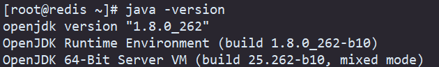

第二步：检测jdk安装包：`rpm -qa | grep java`

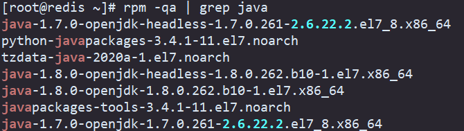

第三步：卸载自带的openjdk：`rpm -e --nodeps` 

> 除了 `python-javapackages-3.4.1-11.el7.noarch` 和 `javapackages-tools-3.4.1-11.el7.noarch` ，其他的都卸载。

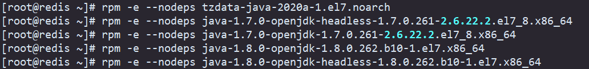

第四步：再次查询jdk版本，出现如下提示则可以进行jdk的安装。


第五步：将下载好的压缩包 `jdk-17.0.7_linux-x64_bin.tar.gz` 上传到linux服务器的/opt目录中（也可以上传到其他目录）

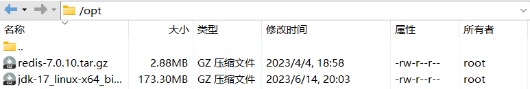

第六步：进入该目录使用 `tar -zxvf jdk-17.0.7_linux-x64_bin.tar.gz -C /usr/local/jdk` 命令解压到/usr/local目录中。

> 先在 `/usr/local` 目录中创建jdk目录，然后在进入 `/opt` 目录将压缩包解压到 `/usr/local/jdk` 目录中。

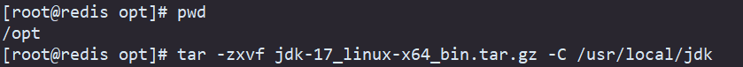

第七步：命令行输入 `vim /etc/profile` 配置环境变量，在profile文件末尾添加以下内容：

```
#set java environment
JAVA_HOME=/usr/local/jdk/jdk-17.0.7
PATH=$PATH:$JAVA_HOME/bin
```

第八步：配置好环境变量后source一下profile文件使该文件生效：`source /etc/profile`

第九步：通过 `java -version` 检查是否安装成功


### 安装Tomcat

第一步：将下载好的压缩包 `apache-tomcat-10.1.10.tar.gz` 上转到linux服务器的根目录中（也可以安装到其他目录）

第二步：使用 `tar -zxvf apache-tomcat-10.1.10.tar.gz -C /usr/local/tomcat10` 命令解压到/usr/local目录中

第三步：进入目录cd  `/usr/local/tomcat10/apache-tomcat-10.1.10/bin`

第四步：使用命令 `sh startup.sh` 或者 `./ startup.sh` 启动tomcat服务器，使用 `sh shutdown.sh` 或  `./ shutdown.sh `关闭


### 安装MySQL

(1) 下载mysql：https://downloads.mysql.com/archives/community/，下载第一个

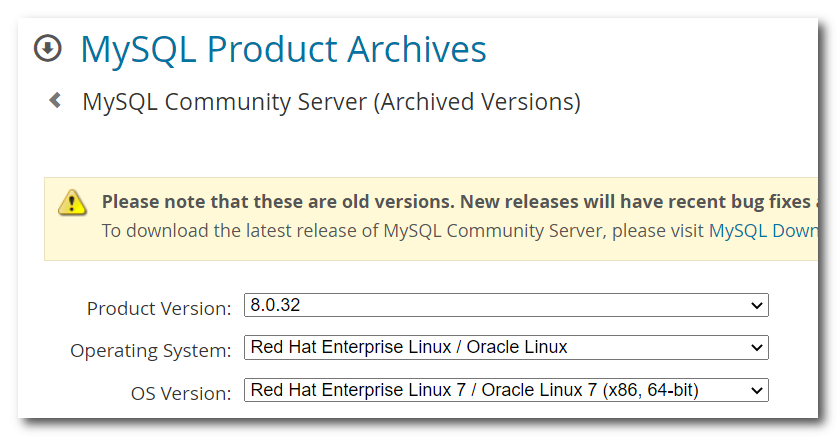

(2) 将下载的文件上传到虚拟机中解包，放到哪个文件夹中都行，到时候安装包可以删除

1. 首先在 `/usr/local`目录下创建 mysql 目录
2. 进入到存放包的目录使用命令：`tar -xvf mysql-8.0.33-1.el7.x86_64.rpm-bundle.tar -C /usr/local/mysql/` 进行解包。

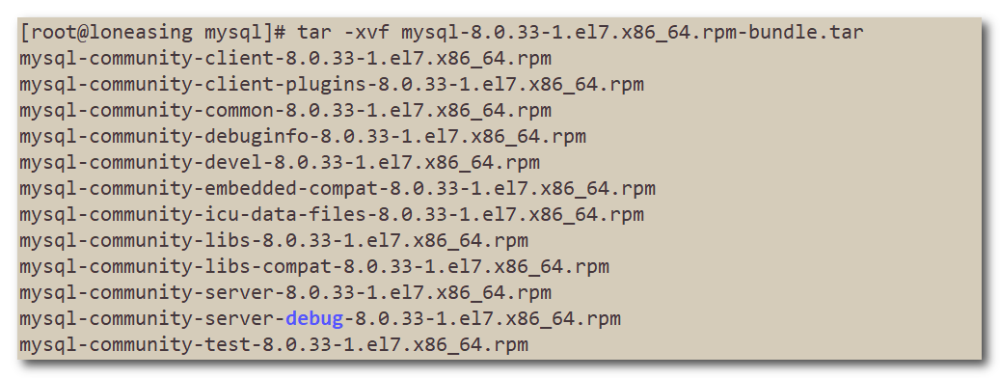

(3) 安装前先卸载CentOS7自带的mariadb数据库

1. 首先先查询是否安装了mariadb数据库：`rpm -qa | grep mariadb`
2. 若安装了则使用命令卸载：`rpm -e --nodeps mariadb-libs-5.5.68-1.el7.x86_64`

(3) 进入 `/usr/local/mysql` 目录，按照顺序安装软件包

1. `rpm -ivh mysql-community-common-8.0.33-1.el7.x86_64.rpm` 
2. `rpm -ivh mysql-community-client-plugins-8.0.33-1.el7.x86_64.rpm`
3. `rpm -ivh mysql-community-libs-8.0.33-1.el7.x86_64.rpm`
4. `rpm -ivh mysql-community-client-8.0.33-1.el7.x86_64.rpm`
5. `rpm -ivh mysql-community-icu-data-files-8.0.33-1.el7.x86_64.rpm` 
6. `rpm -ivh mysql-community-server-8.0.33-1.el7.x86_64.rpm`

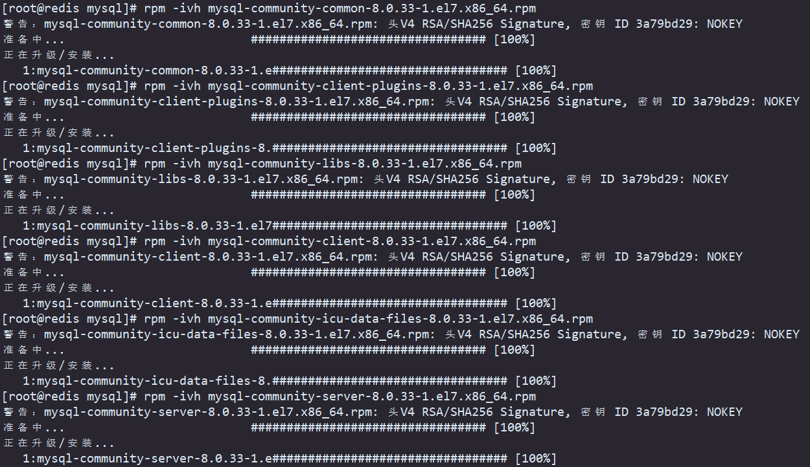

(4) 初始化mysqld，修改所属者

- 初始化：`mysqld --initialize --console`
- 修改所属者：`chown -R mysql:mysql /var/lib/mysql/`
- 启动mysql服务：`systemctl start mysqld`
- 查看临时密码：`cat /var/log/mysqld.log | grep localhost`
- 使用该密码登录：`mysql -uroot -p`，回车然后输入临时密码
- 登录后修改密码：`alter user 'root'@'localhost' identified by '密码';`（结尾要加上分号）

(5) 远程连接出现如下错误则需要修改数据库设置

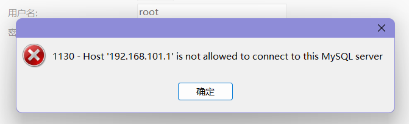

1. 登录数据库，执行命令：`use mysql;`
2. 查看主机信息：`select host from user where user = 'root';`
3. 修改主机信息：`update user set host='%' where user = 'root';`
3. 重启mysql服务：`systemctl restart mysqld`（该命令需要退出mysql客户端执行）

注意：mysql客户端的操作都要以分号结尾。


### 卸载MySQL

1. 停止正在运行的 MySQL 服务：`sudo systemctl stop mysql`
2. 使用命令：`rpm -e -nodeps 安装包` 卸载掉所有与mysql相关的安装包
3. 删除 MySQL 数据目录：`sudo rm -rf /var/lib/mysql/`
4. 清理配置文件和其他残留文件：`sudo rm /etc/mysql/my.cnf` 和 `sudo rm -rf /var/log/mysql/`


### 安装Nginx

1. 首先安装一些依赖的包：`yum -y install gcc pcre-devel zlib-devel openssl opensll-devel`

2. 将下载好的jar包上传到服务器解压：`tar -zxvf nginx-1.24.0.tar.gz`

3. 进入解压后的目录配置安装目录：`./configure --prefix=/usr/local/nginx`，prefix表示指定安装目录。

4. 进行编译和安装：`make && make install`

5. 开放80端口：`sudo ufw allow 'Nginx HTTP'`，或者关闭防火墙。

6. 浏览器中输入服务器的ip地址（80端口和index.html都被省略了），访问nginx的默认首页，如果能访问的到说明安装成功。

   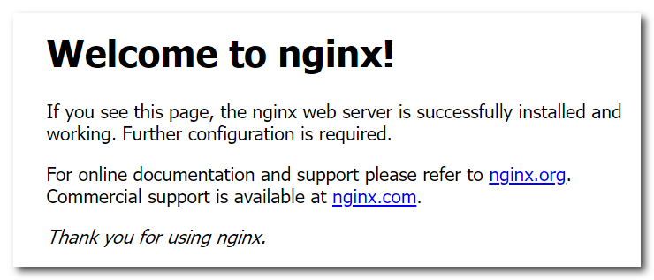

   7. 编辑 `/etc/profile` 文件配置环境变量，多个环境变量之间用 `:` 隔开

      ```shell
      #set java environment
      JAVA_HOME=/usr/local/jdk/jdk-17.0.7
      PATH=/usr/local/nginx/sbin:$PATH:$JAVA_HOME/bin	# 这里配置了nginx和java的环境变量
      ```


#### nginx命令

- **nginx**	启动nginx服务

- **nginx -s stop**	停止nginx服务

- **nginx -v**	查看版本号

- **nginx -t**	检查nginx配置文件是否有错误

- **nginx -s reload**	重新加载配置文件


#### nginx安装目录

- conf	nginx配置文件目录

- html	存放静态文件(html、css、Js等)

- log	日志目录，存放日志文件

- sbin	二进制文件，用于启动、停止nginx服务


#### nginx配置文件

Nginx配置文件(conf/nginx.conf)整体分为三部分:

- 全局块
  和Nginx运行相关的全局配置

- events块
  和网络连接相关的配置

- http块

  代理、缓存、日志记录、虚拟主机配置，http块中可以配置多个Server块，每个Server块中可以配置多个location块。

  - http全局块
  - Server块
    - Server全局块
    - location块

```
#user  nobody;
worker_processes  1;

#error_log  logs/error.log;
#error_log  logs/error.log  notice;
#error_log  logs/error.log  info;

#pid        logs/nginx.pid;


events {
    worker_connections  1024;
}


http {
    include       mime.types;
    default_type  application/octet-stream;

    #log_format  main  '$remote_addr - $remote_user [$time_local] "$request" '
    #                  '$status $body_bytes_sent "$http_referer" '
    #                  '"$http_user_agent" "$http_x_forwarded_for"';

    #access_log  logs/access.log  main;

    sendfile        on;
    #tcp_nopush     on;

    #keepalive_timeout  0;
    keepalive_timeout  65;
    #gzip  on;

    server {
        listen       80;
        server_name  localhost;

        #charset koi8-r;

        #access_log  logs/host.access.log  main;

        location / {
            root   html;
            index  index.html index.htm;
        }
        #error_page  404              /404.html;

        # redirect server error pages to the static page /50x.html
        #
        error_page   500 502 503 504  /50x.html;
        location = /50x.html {
            root   html;
        }

        # proxy the PHP scripts to Apache listening on 127.0.0.1:80
        #
        #location ~ \.php$ {
        #    proxy_pass   http://127.0.0.1;
        #}
    }


```

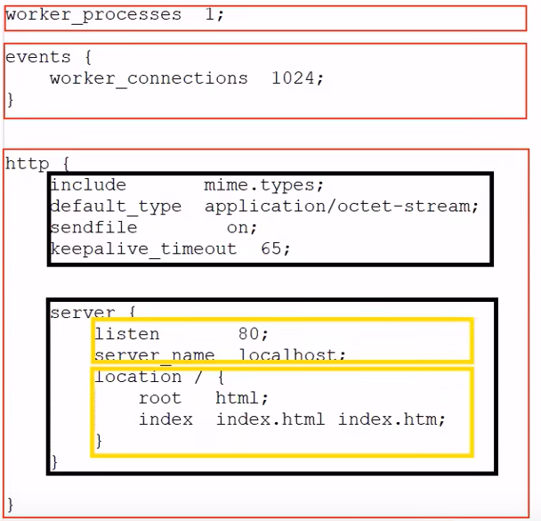


#### 部署静态资源

Nginx可以作为静态web服务器来部署静态资源。静态资源指在服务端真实存在并且能够直接展示的一些文件，比如常见的html页面、css文件、js文件、图片、视频等资源。

相对于Tomcat，Nginx处理静态资源的能力更加高效，所以在生产环境下，一般都会将静态资源部署到Nginx中。

将静态资源部署到Nginx非常简单，只需要将文件复制到Nginx安装目录下的html目录中即可。

可以修改nginx.conf来配置静态资源访问路径：

```nginx
http {
	
    server {
		listen 80;                #listen表示监听端口
  		server_name localhost;    #server_name服务器域名或者ip地址
  		location / {              #location表示匹配客户端请求url
    		root html;            #root表示指定静态资源根目录
    		index index.html;     #index表示指定默认首页
    	}
    }
}
```


#### 正向代理

正向代理： 正向代理是位于客户端和目标服务器之间的代理服务器。当客户端发起请求时，请求首先发送给正向代理服务器，然后由代理服务器代表客户端向目标服务器发送请求，并将目标服务器的响应返回给客户端。**在这种情况下，目标服务器并不知道请求是由代理服务器代表客户端发送的，客户端只与代理服务器进行通信。**

主要特点：

- 隐藏客户端的真实 IP 地址，保护客户端的隐私。
- 可以绕过防火墙限制，访问被封锁的内容。
- 可以缓存数据，提高访问速度。

示例应用场景：

- 绕过访问限制：在企业或学校网络中，正向代理可用于绕过网络访问限制，访问被屏蔽的网站或服务。
- 提高访问速度：代理服务器可以缓存常用的请求结果，减少对目标服务器的请求，提高访问速度。


#### 反向代理

反向代理： 反向代理是位于目标服务器和客户端之间的代理服务器。当客户端发起请求时，请求首先发送给反向代理服务器，然后由代理服务器代表客户端向目标服务器发送请求，并将目标服务器的响应返回给客户端。**在这种情况下，客户端并不知道请求是由代理服务器代表自己发送的，而是将代理服务器视为目标服务器。**

主要特点：

- 负载均衡：反向代理可以将请求分发到多个目标服务器，实现负载均衡，提高系统的可用性和性能。
- 安全性增强：反向代理可以作为防火墙，保护后端服务器免受直接访问。
- 缓存加速：反向代理可以缓存静态内容，提高访问速度。

示例应用场景：

- 负载均衡：反向代理可以将请求分发到多个后端服务器，实现负载均衡，提高系统的性能和容错能力。
- 安全防护：反向代理可以作为安全防护层，过滤和阻止恶意请求，提供安全性增强。
- 缓存加速：反向代理可以缓存静态内容，减轻后端服务器的负载，提高用户访问速度。

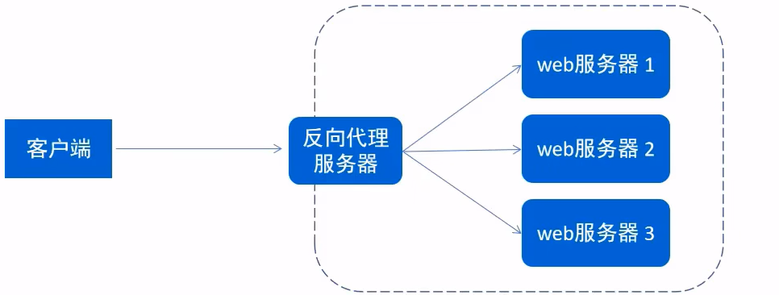

配置反向代理：

```nginx
server {
  listen       82;
  server_name  localhost;

  location / {
      proxy_pass http://192.168.101.111:8080; # 后端服务器的地址，可以是ip或者域名
  } 
}
```

在修改完代理服务器的配置文件后，保存并重新启动代理服务器，以使配置生效，或者使用命令：`nginx -s reload`。


#### 负载均衡

负载均衡（Load Balancing）是一种将网络流量或工作负载分配到多个服务器或资源上的技术，旨在提高系统的性能、可扩展性和可靠性。通过均衡分配流量或任务，负载均衡可以有效地避免单一服务器过载，提供更好的用户体验和系统响应。

负载均衡的主要目标是将流量或任务平均地分发到多个服务器或资源上，确保每个服务器都能够合理分担工作负载，避免出现瓶颈或单点故障。负载均衡可以在不同的层级上进行，包括以下几种常见的方式：

1. DNS 负载均衡：
   在 DNS 解析阶段，通过将同一个域名解析为多个 IP 地址，来将流量分散到多个服务器上。客户端通过请求不同的 IP 地址来实现负载均衡。

2. 硬件负载均衡器：
   使用专门的硬件设备（如负载均衡器）来处理流量分发。负载均衡器位于客户端和服务器之间，根据特定的负载均衡算法将请求分发到后端服务器。

3. 软件负载均衡器：
   在应用层面上实现负载均衡，通常使用代理服务器软件（如 Nginx、Apache HTTP Server）或负载均衡软件（如 HAProxy）来处理流量分发。

负载均衡算法决定了流量如何分配到后端服务器上。常见的负载均衡算法包括：

- 轮询（Round Robin）：按照顺序逐个分配请求给后端服务器。默认使用的就是轮询。
- 最小连接数（Least Connection）：将请求发送给连接数最少的服务器。
- 权重（Weighted）：给每个服务器分配一个权重，根据权重比例分配请求。
- IP 哈希（IP Hash）：根据客户端 IP 地址将请求分发给同一台服务器，确保同一客户端的请求都发送到同一台服务器。

负载均衡的好处包括提高系统的可用性、性能和扩展性。它可以减轻单一服务器的负载压力，提高系统的容错能力，同时也可以实现横向扩展，通过增加服务器来应对不断增长的流量或负载。

负载均衡就是基于反向代理实现的：


**配置负载均衡**：

```nginx
# upstream指令可以定义一组服务器，如果没有其他配置默认使用的是轮询策略
upstream targetserver1{   
  server 192.168.101.111:8080;
  server 192.168.101.112:8080;
}

# 下面根据权重策略配置负载均衡，权重越大分发请求的几率越高
upstream targetserver2{
  server 192.168.101.111:8080 weight=1;
  server 192.168.101.112:8080 weight=2;
}

server {
  listen  8080;
  server_name     localhost;
  location / {
      proxy_pass http://targetserver1;
  }
}
```

