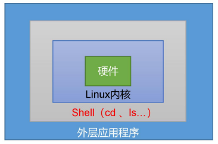

## shell编程

### 1. shell概述

shell是提供与内核沟通接口的命令解释器语句，它接收应用语句/用户的命令，然后调用操作系统内核，但实际上shell是这种解释器的统称，Linux系统的shell种类很多，包括Bourne shell（简称sh）、Bourne Again shell（简称bash）、C shell（简称csh）、K shell（简称ksh）、Shell for Root等等。更具体的来讲，shell就是一个用C语言编写的语句，这个语句提供了一个界面，用户可以通过这个界面访问操作系统内核的服务。



- 查询Linux提供的解析器

  ```sh
  [root@hadoop100 ~]# cat /etc/shells
  /bin/sh			
  /bin/bash
  /usr/bin/sh		## sh解析器
  /usr/bin/bash	## bash解析器（默认）
  /bin/tcsh		## tcsh解析器
  /bin/csh		## csh解析器
  ```

- sh和bash的关系：
  sh和bash都是Linux系统shell的一种，其中bash命令是sh命令的超集，大多数sh脚本都可以在bash下运行。Linux系统中预设默认使用的就是bash。

  ```sh
  [root@hadoop100 ~]# ll /usr/bin | grep bash
  -rwxr-xr-x. 1 root root     964536 4月   1 2020 bash
  lrwxrwxrwx. 1 root root         10 3月  27 23:56 bashbug -> bashbug-64
  -rwxr-xr-x. 1 root root       6964 4月   1 2020 bashbug-64
  lrwxrwxrwx. 1 root root          4 3月  27 23:56 sh -> bash				## 可以看到sh链接到了bash
  
  # 查看Linux默认解析器
  [root@hadoop100 ~]# echo $SHELL
  /bin/bash		## 可以看到Linux默认解析器就是bash
  ```


### 2. shell脚本

- **shell注释**

  以 # 开头的行就是注释，会被解释器忽略。

  多行注释还可以使用以下格式：

  ```sh
  # 多行注释
  :<<EOF
  注释内容...
  注释内容...
  注释内容...
  EOF
  
  # EOF还可以用其他符号
  :<<'
  注释内容...
  注释内容...
  注释内容...
  '
  或者
  :<<!
  注释内容...
  注释内容...
  注释内容...
  !
  ```

- **脚本格式**

  脚本以#!/bin/bash开头（指定解析器）

- **创建脚本**

  创建一个shell脚本输出hello world

  ```sh
  [loneasing@hadoop100 ~]$ vim helloworld.sh		## 创建shell脚本
  [loneasing@hadoop100 ~]$ cat helloworld.sh		## 查看脚本内容
  #!/bin/bash
  echo hello world!
  ```

- **执行脚本**

  执行脚本有三种方式：

  （1）bash(sh) 脚本相对路径或绝对路径，这种方式不用赋予脚本权限

  ```sh
  [loneasing@hadoop100 ~]# bash helloworld.sh
  hello world!
  或者
  [loneasing@hadoop100 ~]# bash /home/loneasing/helloworld.sh
  hello world!
  ```

  （2）直接输入脚本的相对路径或绝对路径执行脚本，该脚本权限必须具有可执行权限

  ```sh
  # 首先赋予脚本可执行权限
  [loneasing@hadoop100 ~]# chmod +x helloworld.sh
  # 输入绝对路径执行脚本
  [loneasing@hadoop100 ~]# /home/lonesing/helloworld.sh
  hello world!
  # 输入绝相对径执行脚本
  [loneasing@hadoop100 ~]# ./helloworld.sh	## 注意这种方式一定要加上./，不然bash会当作命令处理
  hello world！
  [loneasing@hadoop100 ~]$ helloworld.sh		## 如果没有配置PATH则不能这样写
  bash: helloworld.sh: 未找到命令...
  
  # 当然，如果把该脚本加入到bin或者sbin目录下，则该脚本就成了一个命令，可以直接执行，不用加./
  [loneasing@hadoop100 ~]$ cp helloworld.sh /bin/
  [loneasing@hadoop100 ~]$ sudo cp helloworld.sh /bin/
  [sudo] loneasing 的密码：
  [loneasing@hadoop100 ~]$ helloworld.sh 		## 此时helloworld.sh就是一个命令了，可以直接执行
  hello world!
  lyx
  
  # 可以修改PATH变量，将存放脚本的文件夹的路径加入到PATH变量中，这样就可以直接执行
  [loneasing@hadoop100 ~]# echo $PATH
  /usr/local/sbin:/usr/local/bin:/usr/sbin:/usr/bin:/root/bin		## 以冒号分隔
  ```

  （3）在脚本前面加上“.”或者source，注意要用空格隔开，这种方式也不需要执行权限

  ```sh
  [loneasing@hadoop100 ~]$ . helloworld.sh
  hello world！
  [loneasing@hadoop100 ~]$ source helloworld.sh
  hello world!
  ```

  **说明**：第一种方式本质上是bash帮我们执行脚本，所以不需要执行权限，第二种方式本质是脚本需要自己执行，所以需要执行权限，通常使用是第二种方式。	前两种方式都是在当前shell中打开一个子shell来执行脚本，当脚本执行结束，输入exit回车，子shell关闭，回到父shell中。第三种方式是脚本在当前shell中执行，无需打开子shell，也无需要执行权限，子shell与父shell的区别就在于环境变量的继承关系，如在子shell中设置的变量，父shell是不可见的。

  ```sh
  [root@hadoop100 ~]# bash	## 开启子bash，开启子bash后就进入了子bash中
  [root@hadoop100 ~]# ps -f
  UID         PID   PPID  C STIME TTY          TIME CMD
  root       7323   7307  0 16:52 pts/0    00:00:00 -bash
  root      17917   7323  0 22:11 pts/0    00:00:00 bash		## 可以看到这是父bash启动的bash
  root      17968  17917  0 22:12 pts/0    00:00:00 ps -f
  [root@hadoop100 ~]# exit	## 退出子bash回到当前bash。who指令就是则个道理。
  [root@hadoop100 ~]# exit	## 再次退出则会关闭当前连接
  ```

  

### 3. 变量

- **常用系统变量**
  $HOME、$PWD、$SHELL、$USER、$PATH等

  ```sh
  # 查看系统变量的值
  [loneasing@hadoop100 ~]$ echo $HOME
  /home/loneasing
  [loneasing@hadoop100 ~]$ echo $PWD
  /home/loneasing
  [loneasing@hadoop100 ~]$ echo $SHELL
  /bin/bash
  [loneasing@hadoop100 ~]$ echo $USER
  loneasing
  ```

- **查看所有的全局环境变量：env、printenv**

  ```sh
  # 使用env查看所有全局变量
  [loneasing@hadoop100 ~]$ env
  
  # 使用printenv查看所有全局变量
  [loneasing@hadoop100 ~]$ printenv
  # printenv还可以打印系统变量，不用加$符号
  [loneasing@hadoop100 ~]$ printenv HOME
  /home/loneasing
  [loneasing@hadoop100 ~]$ printenv USER
  loneasing
  ```

- **查看所有的变量，包括全局和局部**

  ```sh
  # 查看所有的变量
  [loneasing@hadoop100 ~]# set
  ```

- **自定义变量**

  定义变量：<u>变量名=变量值</u>，注意=前后不能有空格
  撤销变量：<u>unset 变量名</u>
  声明静态变量：<u>readonly 变量名</u>，静态变量不能撤销
  声明全局变量：<u>export 变量名</u>
  获取变量的值：<u>$变量名</u>	或者	<u>${变量名}</u>

  ```sh
  # 定义一个普通变量
  [loneasing@hadoop100 ~]$ xyz=123			## 定义一个变量
  [loneasing@hadoop100 ~]$ set | grep xyz		## 查看定义的变量（set是查看所有的变量，加个管道符过滤）
  xyz=123
  [loneasing@hadoop100 ~]$ echo $xyz			## 输出该变量的值
  123
  [loneasing@hadoop100 ~]$ unset xyz			## 删除变量
  [loneasing@hadoop100 ~]$ motto="努力只够及格，拼命才能优秀"	##变量的值带符号或空格则要加引号
  [loneasing@hadoop100 ~]$ echo $motto
  努力只够及格，拼命才能优秀
  
  # 定义一个静态变量
  [loneasing@hadoop100 ~]# readonly myname=lyx	## 定义一个静态变量
  [loneasing@hadoop100 ~]$ myname=lyz		## 企图修改静态变量
  bash: myname: 只读变量		## 只读变量不可以修改
  
  # 在bash中，变量默认类型都是字符串类型，无法直接进行数值运算
  [loneasing@hadoop100 ~]$ a=1+1
  [loneasing@hadoop100 ~]$ echo $a
  1+1		## 直接当字符串输出了
  
  # 把变量提升为全局变量，可以供子shell使用
  [loneasing@hadoop100 ~]$ export myname	## 将定义的变量提升为全局变量，这样子shell中就可以使用该变量
  [loneasing@hadoop100 ~]$ bash			## 打开子shell
  [loneasing@hadoop100 ~]$ echo $myname	## 在子shell中获取myname变量的值
  lyx
  # 在helloworld文件中也能使用全局变量
  [loneasing@hadoop100 ~]$ vi helloworld.sh
  #!/bin/bash
  echo hello world!
  echo $myname		## 获取全局变量myname
  [loneasing@hadoop100 ~]$ ./helloworld.sh
  hello world!
  lyx					## 输出了myname的值
  
  
  注意：在子shell中定义的变量，即使提升全局变量，父shell也无法使用，子shell的子shell可以使用
  
  # 在子shell中定义全局变量，父shell中也无法获取
  [loneasing@hadoop100 ~]$ export myage=18	## 在子shell中定义一个全局变量
  [loneasing@hadoop100 ~]$ exit				## 退出子shell
  [loneasing@hadoop100 ~]$ echo $myage		## 无法获取
  ```

- **特殊变量**

  - $n

    > n为数字，$0代表该脚本的名称(绝对路径表示)，$1-$9代表脚本后第一到第九个参数，十以上的参数要用大括号表示${10}
    >
    > 参数间用空格隔开
  
    ```sh
    [loneasing@hadoop100 ~]$ vim param.sh
    #!/bin/bash
    echo '***$n***'		## 单引号的内容不会被解析，双引号的话就会将$n解析成一个变量
    echo $0				## 脚本名称（如果带上了路径也会算进去），可以使用basename函数去掉前面的路径
    echo basename $0
    echo $1				## 第一个参数
    echo $2				## 第二个参数
    [loneasing@hadoop100 ~]$ chmod +x param.sh 			## 开启可执行权限
    [loneasing@hadoop100 ~]$ ./param.sh myname islyx	## myname为第一个参数，islyx是第二个参数
    ***$n***
    ./param.sh	## 脚本名称
    param.sh	## 去除了前面的路径，只保留脚本文件名
    myname		## 第一个参数
    islyx		## 第二个参数
    [loneasing@hadoop100 ~]$ ./param.sh 				## 如果不给参数的话，输出空串
    ***$n***
    ./param.sh
    
    
    ```

  - $#
  
    > 获取所有输入参数的个数，常用于循环、判断参数的个数是否正确以及加强脚本的健壮性
  
    ```sh
    [loneasing@hadoop100 ~]# vi param.sh
    #!/bin/bash
    echo '***$#***'
    echo $#				## 获取参数的个数
    [loneasing@hadoop100 ~]$ ./param.sh aaa bbb ccc ddd		## 输入四个参数
    ***$#***
    4					## 检测到参数有四个，与有没有使用无关
    ```
  
  - $*、$@
  
    > $*：这个变量代表命令行中所有的参数，$ *把所有的参数看成一个整体
    > $@：这个变量也代表命令行中所有的参数，$@相当于一个数组，可以通过遍历把获取每个参数
    > 不加引号时两个变量没有区别，加了引号后"$ *" 所代表的就是一个整体了
  
    ```sh
    [loneasing@hadoop100 ~]$ vi param.sh 
    #!/bin/bash
    echo '***$*/$@***'
    echo $*
    echo $@
    [loneasing@hadoop100 ~]$ ./param.sh 加油 内卷
    ***$*/$@***
    加油 内卷	## 这是一个整体“加油 内卷”
    加油 内卷	## 这是分开的两个字符串“加油”“内卷”
    ```
  
  - $?
  
    > 最后一次执行的命令的返回状态。如果这个变量的值为 0，证明上一 个命令正确执行；如果这个变量的值为非 0（具体是哪个数，由命令自己来决定），则证明 上一个命令执行不正确了。
    >
    > 未找到命令返回的是127。
  
    ```sh
    # 验证脚本是否正确执行
    [loneasing@hadoop100 ~]$ ./param.sh 加油 内卷
    ***$*/$@***
    加油 内卷
    加油 内卷
    [loneasing@hadoop100 ~]$ echo $?
    0			## 返回0，说明脚本执行正确
    [loneasing@hadoop100 ~]$ abcd		## 故意写个错误的指令
    bash: abcd: 未找到命令...
    [loneasing@hadoop100 ~]$ echo $?	
    127			## 未找到指令返回值127
    ```


### 4. 字符串

shell编程中，字符串可以用单引号，也可以用双引号，也可以不用引号。单引号和双引号有不同的区别。

**单引号：**纯文本，单引号里面的任何字符都会原样输出，在单引号中的变量是无效的。
**双引号：**支持转义如\ \就输出\，{$a}就输出变量$a=xxx的内容，变量可以在双引号里面生效，双引号里面可以出现转义字符。

- 单双引号的区别

  ```sh
  [loneasing@hadoop100 scripts]$ cat string.sh 
  #!/bin/bash
  myName=loneasing
  str1="hello $myName"
  str2="hello ${myName}"	#${myName}和$myName的效果一样
  str3="hello '$myName'"	#在双引号里面的单引号失去了它的特性
  str4='hello $myName'	#单引号里面的变量无效
  echo $str1
  echo $str2
  echo $str3
  echo $str4
  [loneasing@hadoop100 scripts]$ . string.sh 
  hello loneasing
  hello loneasing
  hello 'loneasing'
  hello $myName
  ```
  
- 字符串拼接

  ```sh
  # 字符串的拼接
  [loneasing@hadoop100 scripts]$ str=b
  [loneasing@hadoop100 scripts]$ if [ abc == a$strc ];then echo ok;else echo "not ok";fi	
  not ok
  [loneasing@hadoop100 scripts]$ if [ abc == a{$str}c ];then echo ok;else echo "not ok";fi
  not ok
  [loneasing@hadoop100 scripts]$ if [ abc == a${str}c ];then echo ok;else echo "not ok";fi
  ok
  [loneasing@hadoop100 scripts]$ if [ abc == a"$str"c ];then echo ok;else echo "not ok";fi
  ok
  由上可知shell字符串的拼接不需要加+号，直接跟在字符串后面就可以，前后都有字符串时变量需要引起来或者给变量名加花括号
  ```

- 获取字符串的长度：

  ```sh
  （1）${#str}
  [loneasing@hadoop100 scripts]$ string=abcd
  [loneasing@hadoop100 scripts]$ echo ${#string}
  4
  
  （2）expr length str
  [loneasing@hadoop100 scripts]$ string="good night"
  [loneasing@hadoop100 scripts]$ expr length "$string"  ## 因为string里面有空格，所以需要加双引号，不能加单引号
  4
  [loneasing@hadoop100 scripts]$ expr length helloworld
  10
  ```

- 提取子字符串：

  ```sh
  # ${str:index:num}
  # stirng代表字符串，index代表每个字符的索引，num表示需要提取的数量
  [loneasing@hadoop100 scripts]$ string="Have a good day"
  [loneasing@hadoop100 scripts]$ echo ${string:7:4}	## 从第8个字符开始提取4个字符
  good
  [loneasing@hadoop100 scripts]$ echo ${string:7}		## 从第8个字符开始一直到结束
  ```

- 截取字符串：

  ```sh
  [loneasing@hadoop100 scripts]$ url="http://www.abc.com/index.html"
  （1）${str#条件}
  [loneasing@hadoop100 scripts]$ echo ${url#*/}		## #*/表示删除第一个/及它左边所有内容，/*则相反
  /www.abc.com/index.html
  （2）${str##条件}
  [loneasing@hadoop100 scripts]$ echo ${url##*/}		## ##*/表示删除最后一个/及它左边的所有内容
  index.html
  （3）${str%/*}
  [loneasing@hadoop100 scripts]$ echo ${url%/*}		## %/*表示从右边开始删除第一个/及右边的内容
  http://www.abc.com
  （4）${str%%/*}
  [loneasing@hadoop100 scripts]$ echo ${url%%/*}		## %%/*表示从右边开始删除最后一个/及它右边的内容
  http:
  ```

  

### 5. 数组

bash支持一维数组（不支持多维数组），并且没有限定数组的大小。

数组元素的下标由 0 开始编号。获取数组中的元素要利用下标，下标可以是整数或算术表达式，其值应大于或等于 0。

在 Shell 中，用括号来表示数组，数组元素用"空格"符号分割开。定义数组的一般形式为： 数组名=(值1 值2 ... 值n)

```sh
# 创建一个数组 (单行适用在终端)
array=(value1 value2 value3)
或者 (多行适用于脚本)
array=(
value1
value2
value3
)

# 还可以单独定义数组的各个元素。可以不使用连续的下标，而且下标的范围没有限制。
array[0]=value0
array[1]=value1
array[n]=valuen

# 读取数组元素值的一般格式是：${数组名[下标]}
valuen=${array[n]}
# 使用 @ 符号可以获取数组中的所有元素
echo ${array[@]}

# 获取数组的长度(数组元素的个数)
length=${#array[@]}
 或者
length=${#array[*]}
# 取得数组单个元素的长度，n为下标
lengthn=${#array[n]}


```


### 6. 运算

数字在bash中是无法直接做加减运算的，因为变量默认都是字符串类型。需要通过特殊的符号来完成算数。

shell中的运算表达式：$((运算式)) 或者$[运算式]，前者使用双小括号可以用数学中的运算符运算。

当然还有一个表达式用来做运算：expr，运算符两边要用空格隔开，做乘法的时候需要转义，输出的时候需要用$()获取值。 

```sh
# 使用表达式$((运算式))做运算
[loneasing@hadoop100 ~]$ echo $((1+2))
3
[loneasing@hadoop100 ~]$ echo $((2*3))
6
[loneasing@hadoop100 ~]$ echo $(((2+3)*2))
10
[loneasing@hadoop100 ~]$ if ((5>3));then echo 5大于3;else echo 5小于3;fi
5大于3

# 使用表达式$[运算式]做运算（推荐使用）
[loneasing@hadoop100 ~]$ echo $[2+3]
5
[loneasing@hadoop100 ~]$ echo $[3/3]
1

# 使用expr表达式
[loneasing@hadoop100 ~]$ echo $(expr 1 + 2)		## +号两边要用空格隔开，获取值要用$()，这个东西叫做命令替换
3
[loneasing@hadoop100 ~]$ echo `expr 6 / 3`		## 使用反引号(sql中的着重号)进行命令替换，就是获取该命令的值
2
[loneasing@hadoop100 ~]$ echo $(expr 2 * 3)
expr: 语法错误
[loneasing@hadoop100 ~]$ echo $(expr 2 \* 3)	## 乘号需要进行转义
6

# 命令替换还可以这样用			
[loneasing@hadoop100 ~]$ echo `ll a`		## 获取ll a的内容，然后输出，输出的内容是连续的
总用量 0 drwxr-xr-x. 4 root root 41 3月 31 05:27 a drwxr-xr-x. 3 root root 19 3月 31 05:34 b drwxr-xr-x. 2 root root 19 3月 31 05:34 c.txt lrwxrwxrwx. 1 root root 12 3月 31 23:17 hi.txt -> /root/hi.txt

# 写一个加法脚本
[loneasing@hadoop100 scripts]$ vim add.sh
#!/bin/bash
sum=$[$1+$2]
echo sum=$sum
[loneasing@hadoop100 scripts]$ . add.sh 10 10	## 计算10+10
sum=20
```


### 7. 条件判断

- **使用语法**：

  方式一： <u>test condition</u>

  方式二： <u>[ condition ]</u>	#注意condition两边都要用空格隔开，并且condition中运算符两边也要用空格隔开。

  方式三： <u>((condition))</u>	#使用双小括号，里面的条件表达式可以使用数学中的运算符

  如果condition为true，则语句执行通过，执行echo $?返回0；
  如果condition为false，则执行不通过，执行echo $?返回1。
  如果方式二中括号里面不是条件判断，非空即为 true，否则false，比如[ loneasing ]返回 true，[ ] 返回 false。

- **常用条件判断**

  (1) 两个整数之间比较
  	-eq	等于(equal)
  	-ne	不等于(not equal)
  	-lt	小于(less than)
  	-le	小于等于(less equal)
  	-gt	大于(greater than)
  	-ge	大于等于(greater equal)
  	注意：如果是字符串之间比较，用"="判断相等，用"!="判断不相等

  ```sh
  # 判断2是否小于3
  [loneasing@hadoop100 scripts]$ test 2 -lt 3
  [loneasing@hadoop100 scripts]$ echo $?
  0	## 返回0，说明执行通过，条件为真
  
  # 判断5是否大于3
  [loneasing@hadoop100 scripts]$ ((5>3))
  [loneasing@hadoop100 scripts]$ echo $?
  0
  
  # 判断hello是否等于hell
  [loneasing@hadoop100 scripts]$ [ hello = hell ]		## 注意不能这样写[ hello=hell ]，不然会把里面当作一个整体
  [loneasing@hadoop100 scripts]$ echo $?
  1	## 条件为假，执行不通过，返回1
  ```

  (2) 按照文件权限进行判断
  	-r	有读的权限(read)
  	-w	有写的权限(write)
  	-x	有可执行的权限(execute)
  
  ```sh
  # 判断param.sh是否具有写的权限
  [loneasing@hadoop100 ~]$ ll param.sh
  -rwxrwxr-x. 1 loneasing loneasing 111 4月   3 01:17 param.sh		## 可以看大该文件具有写的权限
  [loneasing@hadoop100 ~]$ [ -w param.sh ]
  [loneasing@hadoop100 ~]$ echo $?
  0	## 条件为真，执行通过，返回0
  ```

  (3) 按照文件类型进行判断
  	-e	文件存在(existence)
  	-f	文件存在并且是一个文件(file)
  	-d	文件存在并且是一个目录(directory)
  
  ```sh
  # 判断haha文件是否存在
  [loneasing@hadoop100 ~]$ [ -e haha ]	## 判断存在haha文件
  [loneasing@hadoop100 ~]$ echo $?
  1	## 不存在haha文件，执行不通过所以返回1
  ```
  
  (4) 逻辑判断
  
  ​	！	非运算，表达式为 true 则返回 false，否则返回 true
  ​	-o	或运算，有一个表达式为 true 则返回 true
  ​	-a	与运算，两个表达式都为 true 才返回 true
  
  ```sh
  [loneasing@hadoop100 ~]$ echo $[!1]		## 非1为0
  0
  [loneasing@hadoop100 ~]$ echo $[!0]		## 非0为1
  1
  [loneasing@hadoop100 ~]$ [ 1 -gt 2 -o 1 -lt 2 ]		## 1大于2或者1小于2，执行通过，返回0
  [loneasing@hadoop100 ~]$ echo $?
  0
  [loneasing@hadoop100 ~]$ [ 1 -gt 2 -a 1 -lt 2 ]		## 1大于2且1小于2，显然不成立，执行不通过，返回1
  [loneasing@hadoop100 ~]$ echo $?
  1
  ```
  
  (5) 多条件判断
  	<u>[ condition ] && 命令1 || 命令2</u>		如果条件为真，执行命令1，为假执行命令2。
  	这个也不难理解，首先一个非判断语句的值就是true，所以命令1和命令2都是true，利用了短路或的原理。
  
  ```sh
  [loneasing@hadoop100 ~]$ [ 1 -gt 2 ] && echo 1大于2 || echo 1小于2		## 判断1是否大于2
  1小于2
  ```


### 8. 流程控制

- **if语句**
  (1) 单分支

  > if [ condition ]
  > then
  > 		语句
  > fi
  >
  > 终端命令格式：if [ condition ]; then 语句; fi  或者  if ((condition)); then 语句; fi
  
  ```sh
  # 示例
  [loneasing@hadoop100 scripts]$ vim testIf.sh
  #!/bin/bash
  name=lyx
  if [ true ]
  then
  echo "my name is $name"
  fi
  [loneasing@hadoop100 scripts]$ . testIf.sh 
  my name is lyx
  ```
  
  (2) 多分支
  
  > if [ condition ]
  > then
  > 		语句1
  > elif [ condition ]
  > then
  > 		语句2
  > else
  > 		语句3
  > fi
  >
  > 终端命令格式：if [ condition ];then 语句1;else 语句2;fi
  >
  > 注意：
  > ①[ 条件判断式 ]，中括号和条件判断式之间必须有空格
  > ②if 后要有空格
  
  ```sh
  # 示例1
  [root@hadoop100 ~]# if [ 2大于2 ];then echo 2大于2;else echo 2等于2;fi 	   ## 非判断语句不为空即为真
  2大于2
  [root@hadoop100 ~]# if [ 2 -lt 2 ];then echo 2大于2;else echo 2等于2;fi 	## 2 -lt 2 为假
  2等于2
  
  # 示例2
  [loneasing@hadoop100 scripts]$ vi testIfs.sh
  #!/bin/bash
  if [ x == $1x ] 			# 加个字符拼接成字符串，防止没有传入参数时为空出现错误
  then echo "你没有输入参数"
  elif [ $1 -lt 18 ]
  then echo "未成年"
  elif [ $1 -lt 35 ]
  then echo "活力青年"
  elif [ $1 -lt 60 ]
  then echo "中年人"
  else echo "老年人"
  fi  
  [loneasing@hadoop100 scripts]$ . testIfs.sh
  你没有输入参数
  [loneasing@hadoop100 scripts]$ . testIfs.sh 20
  活力青年
  ```
  
- **case语句**

  > case $变量名 in
  > value1) 语句1;;	
  > value2) 语句2;;
  > value3) 语句3;;
  > ......
  > valuen) 语句n;;
  > *) 语句;;
  > esac	
  >
  > 注意事项：
  > （1）“$变量名”的值和value匹配上了则执行对应的语句。
  > （1）case 行尾必须为单词“in”，每一个模式匹配必须以右括号“）”结束，整个case语句用esac结束。
  > （2）双分号“;;”表示命令序列结束，相当于 java 中的 break。
  > （3）最后的“*）”表示默认模式，相当于 java 中的 default，其他情况都不符合时执行该语句
  
  ```sh
  # 示例
  [loneasing@hadoop100 scripts]$ vi testCase.sh
  
  #!/bin/bash
  case $1 in
  1) echo 你输入了1;;
  2) echo 你输入了2;;
  3) echo 你输入了3;;
  a) echo 你输入了a;;
  b) echo 你输入了b;;
  c) echo 你输入了c;;
  *) echo "非1 2 3 a b c中的数";;
  esac
  
  [loneasing@hadoop100 scripts]$ . testCase.sh 
  非1 2 3 a b c中的数
  [loneasing@hadoop100 scripts]$ . testCase.sh a
  你输入了a
  ```
  
- **for循环**

  - 语法一：

    > for (( 初始值;循环控制条件;变量变化))
    > do
    > 	语句
    > done
    > 终端命令格式：for (( 初始值;循环控制条件;变量变化 )) ;do 语句;done

    ```sh
    # 计算1加到100的和，单行显示
    [loneasing@hadoop100 scripts]$ for ((i=0,sum=0;i<=100;i++));do sum=$[$sum+$i];done;echo $sum
    5050
    
    # 计算1加到100的和，脚本模式
    [loneasing@hadoop100 scripts]$ vi testFor.sh
    
    #!/bin/bash
    sum=0
    for ((i=0;i<=100;i++))  ## 因为这里用的是(())两层括号，所以可以直接使用数学运算表达式>,<,>=,<=等等
    do
       sum=$[$sum+$i]		## 注意累加的格式
    done
    echo $sum
    
    [loneasing@hadoop100 scripts]$ . testFor.sh 
    5050
    
    #####################################
    # 上面做累加的格式有点复杂，所以Linux推出了一个关键字let简化了操作，使用let语句就可以像大多数语言的语法一样了
    #!/bin/bash
    sum=0
    for ((i=0;i<=100;i++)) 
    do
       let sum+=i
    done
    echo $sum
    ```

  - 语法二：

    > for i in 变量1 变量2 变量3 ... 变量n
    > do
    > 	语句
    > done
    >
    > 类似于Java中的增强for循环。
    >
    > 终端命令格式：for 变量 in 值 1 值 2 值 3… ;do 语句;done

    ```sh
    # 打印数组中的值
    [loneasing@hadoop100 scripts]$ vi testForIn.sh
    
    #!/bin/bash
    array=(a b c d e f)
    for i in 0 1 2 3 4 5		## 将in后面的值依次赋给变量i
    do
            echo ${array[i]}
    done
    
    [loneasing@hadoop100 scripts]$ . testForIn.sh 
    a
    b
    c
    d
    e
    f
    ```

  - 比较$ * 和 $@的区别：

    ```sh
    [loneasing@hadoop100 scripts]$ vim testParam.sh
    #!/bin/bash
    # 测试 $*
    for i in $*
    do echo $i
    done
    echo "----------------"
    # 测试 $@
    for i in $@
    do echo $i
    done
    echo "----------------"
    
    # 测试 "$*"
    for i in "$*"
    do echo $i
    done
    echo "----------------"
    
    # 测试 "$@"
    for i in "$@"
    do echo $i
    done
    
    [loneasing@Hadoop100 scripts]$ chmod +x testParam.sh	## 开启可执行权限
    [loneasing@hadoop100 scripts]$ ./testParam.sh a b c d	## 使用相对路径执行脚本,a b c d为4个参数
    a
    b
    c
    d
    ----------------
    a
    b
    c
    d
    ----------------
    a b c d				## $*加了引号后"$*"会把获取到的参数当作一个整体
    ----------------
    a
    b
    c
    d
    由上可知，"$*"会把输入的参数作为一个整体，其他情况和$@一样将获取的参数存入一个数组
    ```

- **while**

  > 基本语法：
  >
  > while [ 条件判断式 ] 
  > do
  > 	语句
  > done
  >
  > 终端命令格式：while [ 条件判断式 ]; do 语句；done

  ```sh
  # 计算1加到100的和
  [loneasing@hadoop100 scripts]$ vim testWhile.sh
  
  #!/bin/bash
  sum=0
  i=1
  while [ $i -le 100 ]
  do
          sum=$[$sum+$i]	## 使用let语句：let sum+=i
          i=$[$i+1]		## 使用let语句：let i++
  done
  echo $sum
  
  [loneasing@hadoop100 scripts]$ . testWhile.sh
  5050
  ```


### 9. 读取控制台输入

- **read**

  > 读取控制台输入
  >
  > 使用语法：read [选项] [参数]
  > 选项：-p，指定读取时的提示符
  > 			-t，指定读取值时等待的时间，单位为秒，如果不指定默认一直等待
  > 			-n，输入字符长度限制(达到6位，自动结束)
  > 			-s，隐藏输入内容
  > 参数：指定读取值的变量名

  ```sh
  # 示例
  [loneasing@hadoop100 scripts]$ read -p 请输入你的名字 -t10 name	## 指定读取的值的变量名为name
  请输入你的名字lyx
  [loneasing@hadoop100 scripts]$ echo $name
  lyx
  
  # 示例2
  [loneasing@hadoop100 scripts]$ vim testRead.sh
  
  #!/bin/bash
  read -p "请输入你的姓名:" name
  echo "你的姓名是：$name"
  
  [loneasing@hadoop100 scripts]$ . testRead.sh 
  请输入你的姓名:loneasing
  你的姓名是：loneasing
  
  # 示例3
  [loneasing@hadoop100 scripts]$ vim testRead2.sh
  
  #!/bin/bash
  read -p "请输入密码:" -n 6 -t 10 -s password
  echo -e "\npassword is $password"
  
  [loneasing@hadoop100 scripts]$ . testRead2.sh
  请输入密码:
  password is 123456
  ```


### 10. 函数

​	函数就相当于轻量型的脚本。

- #### 系统函数

  **basename**

  > 获取路径里的文件名称
  >
  > 使用方式：basename [pathname] [suffix]
  > 功能描述：basename 命令会删掉路径中最后一个（‘/’）字符及它之前的内容，然后将剩余的字符串显示出来。
  >
  > suffix 为后缀，如果 suffix 被指定了，basename 还会将剩余字符串中的 suffix 去掉。

  ```sh
  # 获取文件名称及去掉后缀
  [loneasing@hadoop100 scripts]$ basename /home/loneasing/a/hi.txt
  hi.txt
  [loneasing@hadoop100 scripts]$ basename /home/loneasing/a/hi.txt .txt	## 指定去掉.txt后缀
  hi
  ```

  **dirname**

  > 获取文件绝对路径名称，不包含文件名
  >
  > 使用方式：dirname 文件绝对路径

  ```sh
  # 获取文件的绝对路径
  [loneasing@hadoop100 scripts]$ dirname /home/loneasing/a/hi.txt
  /home/loneasing/a
  ```

- 自定义函数

  > 基本语法：
  >
  > [ function ] funname()
  > {
  > 	 Action;
  > 	[return int;]
  > }
  >
  > 加[]的表示可有可无。
  >
  > 必须在调用函数地方之前，先声明函数，shell 脚本是逐行运行。不会像其它语言一 样先编译。
  > 函数返回值，只能通过$?获得，return返回的值是0-255之间的数字才能通过$?获取。
  
  ```sh
  # 自定义一个加法函数
  [loneasing@hadoop100 scripts]$ vi addFun.sh 
  
  #!/bin/bash
  
  function add(){
          sum=$[$1+$2]
          echo $sum
  }
  
  read -p "请输入第一个数：" a
  read -p "请输入第二个数：" b
  
  sum=$(add $a $b)	## 命令替换，获取命令的值赋给另一个变量
  echo $sum
  exit	
  #############################################
  
  ## 如果用. 脚本或者source 脚本的话，exit会关闭当前bash，所以一般是用./脚本方式执行执行脚本，因为./的方式另开了一个bash
  [loneasing@hadoop100 scripts]$ ./addFun.sh 
  请输入第一个数：7
  请输入第二个数：8
  15
  ```


### 11. 简单正则表达式

正则表达式使用单个字符串来描述、匹配一系列符合某个语法规则的字符串。在很多文 本编辑器里，正则表达式通常被用来检索、替换那些符合某个模式的文本。在 Linux 中，grep， sed，awk 等文本处理工具都支持通过正则表达式进行模式匹配。

- 特殊字符：**==^==**

  > 匹配以什么开头的内容，这个符号要放在字符的前面。

  ```sh
  # 查询以a开头的用户
  [root@hadoop100 ~]# cat /etc/passwd | grep ^a
  adm:x:3:4:adm:/var/adm:/sbin/nologin
  abrt:x:173:173::/etc/abrt:/sbin/nologin
  avahi:x:70:70:Avahi mDNS/DNS-SD Stack:/var/run/avahi-daemon:/sbin/nologin
  ```

- 特殊字符：==**$**==

  > 匹配以什么结尾的内容，这个符号要放在字符的后面。
  >
  > ^$表示匹配空行、空内容

  ```sh
  # 查询以bash结尾的行
  [root@hadoop100 ~]# cat /etc/passwd | grep bash$
  root:x:0:0:root:/root:/bin/bash
  loneasing:x:1000:1000:loneasing:/home/loneasing:/bin/bash
  tony:x:1001:1003::/home/tony:/bin/bash
  davie:x:1002:1003::/home/davied:/bin/bash
  tom:x:1003:1003::/home/tom:/bin/bash
  ```

- 特殊字符：==**.**==

  > 匹配一个任意的字符，两个点则表示匹配两个任意的字符，以此类推。

  ```sh
  # 匹配包含r..t的内容
  [root@hadoop100 ~]# cat /etc/passwd | grep r..t
  root:x:0:0:root:/root:/bin/bash
  operator:x:11:0:operator:/root:/sbin/nologin
  ftp:x:14:50:FTP User:/var/ftp:/sbin/nologin
  # 匹配包含r...t的内容
  [root@hadoop100 ~]# cat /etc/passwd | grep r...t
  rtkit:x:172:172:RealtimeKit:/proc:/sbin/nologin
  unbound:x:991:986:Unbound DNS resolver:/etc/unbound:/sbin/nologin
  ```

- 特殊字符：==*****==

  > *不单独使用，它和上一个字符连用，表示匹配该字符出现0次或多次的内容。
  >
  > 比如a*表示匹配a出现0次或多次的内容。
  >
  > .*表示任意字符可以出现0次或多次，也就是匹配所有内容

  ```sh
  # ro*t会匹配rt、rot、root、rooot...等内容
  [root@hadoop100 ~]# cat /etc/passwd | grep ro*t
  root:x:0:0:root:/root:/bin/bash
  operator:x:11:0:operator:/root:/sbin/nologin
  abrt:x:173:173::/etc/abrt:/sbin/nologin
  rtkit:x:172:172:RealtimeKit:/proc:/sbin/nologin
  ```

- 字符区间：**==[]==**

  > [ ] 表示匹配某个范围内的一个字符

  ```sh
  例如 [6,8]------匹配 6 或者 8 
  
  [0-9]----------匹配一个 0-9 的数字 
  
  [0-9]*---------匹配任意长度的数字字符串
  
  [a-z]----------匹配一个 a-z 之间的字符
  
  [a-z]* --------匹配任意长度的字母字符串 
  
  [a-c, e-f]-----匹配 a-c 或者 e-f 之间的任意字符
  
  # 比如r[a,b,c]*t，会匹配会匹配 rt,rat, rbt, rabt, rbact,rabccbaaacbt 等所有内容
  [root@hadoop100 ~]# cat /etc/passwd | grep r[a,b,c]*t
  operator:x:11:0:operator:/root:/sbin/nologin
  abrt:x:173:173::/etc/abrt:/sbin/nologin
  rtkit:x:172:172:RealtimeKit:/proc:/sbin/nologin
  sshd:x:74:74:Privilege-separated SSH:/var/empty/sshd:/sbin/nologin
  ```

- 特殊字符：\

  > \ 表示转义，并不会单独使用。由于所有特殊字符都有其特定匹配模式，当我们想匹配某一特殊字符本身时（比如 '$' ），就要 将转义字符和特殊字符连用，来表示特殊字符本身。

  ```sh
  #'a\ $b'会匹配包含a$b的内容，注意需要使用单引号将表达式引起来。
  [root@hadoop100 ~]$ cat /etc/passwd | grep 'a\$b'
  ```

  


### 12. 文本处理工具

- **cut**

  > cut 命令从文件的每 一行剪切字节、字符和字段并将这些字节、字符和字段输出。
  >
  > 使用方式：cut [选项] filename
  > 选项： -d，分隔符，按照指定分隔符分隔，默认是制表符“\t”。
  > 			-f n，以分隔符进行分隔，n表示提取第几列。-f 2- 表示提取第二列及以后的内容。
  > 			-b n，以字节为单位分隔，n表示取第几个字节。
  > 			-c n，按字符进行切割，n表示取第几个字符。

  ```sh
  [tony@hadoop100 ~]$ cat testCut.txt 
  i love china
  i am chinese
  i will be better
  好好学习 天天 向上
  
  # 取每一行的第三个字节
  [tony@hadoop100 ~]$ cat testCut.txt | cut -b3
  l
  a
  w
  ½	## 由于一个汉字占两个字节，所以显示不出完整的汉字
  
  # 取每一行的第三个字符
  [tony@hadoop100 ~]$ cat testCut.txt | cut -c3
  l
  a
  w
  学
  
  # 取每一行的第一列，以空格分隔
  [tony@hadoop100 ~]$ cat testCut.txt | cut -d " " -f1 
  i
  i
  i
  好好学习
  # 取每一行的第二、三列，以空格分隔
  [tony@hadoop100 ~]$ cat testCut.txt | cut -d " " -f 2,3
  love china
  am chinese
  will be
  天天 向上
  
  # 取第二列及后面所有的内容
  [tony@hadoop100 ~]$ cat testCut.txt | cut -d " " -f 2-
  love china
  am chinese
  will be better
  天天 向上
  ```

-  **awk**

  > 一个强大的文本分析工具，把文件逐行的读入，以空格为默认分隔符将每行切片，切开 的部分再进行分析处理。
  >
  > 使用方式：
  > awk [选项] ‘/pattern1/{action1} /pattern2/{action2}...’ filename 
  > 选项：-F，指定分隔符
  > 			-v，定义一个变量，比如-v i=1
  > pattern：匹配模式，需要用两个/包起来，比如/hello/就是匹配包含hello的，不指定就是匹配所有，pattern支持正则表达式。
  > action：在找到匹配内容时所执行的一系列命令，用{}包起来。
  > 通过pattern匹配到的数据会交给后面的{}处理，每一列的值相当于参数传递给{}，可以利用$n来获取这个参数。
  >
  > awk 的内置变量：
  > FILENAME 文件名
  > NR 已读的记录数（行号）
  > NF 浏览记录的域的个数（切割后，列的个数）

  ```sh
  # 数据准备
  [loneasing@hadoop100 ~]$ cat student
  余若雨,女,yry@qq.com,101
  长辞笙,男,ccs@qq.com,102
  洛秋凉,女,lql@qq.com,103
  枫无痕,男,fwh@qq.com,104
  月下研,女,yxy@qq.com,105
  龙吟凤,男,lyf@qq.com,106
  寻欢客,女,xhk@qq.com,107
  安瑾然,男,ajr@qq.com,108
  夕颜落,女,xyl@qq.com,109
  
  # 搜索以“龙”开头的所有行，并输出所有行的第3列
  [loneasing@hadoop100 ~]$ awk -F , '/^龙/{print $3}' student	## 以,为分隔符
  lyf@qq.com
  
  # 搜索包含“女”的所有行，并输出所有行的第1列和3列
  [loneasing@hadoop100 ~]$ awk -F , '/女/{print $1","$3}' student
  余若雨,yry@qq.com
  洛秋凉,lql@qq.com
  月下研,yxy@qq.com
  寻欢客,xhk@qq.com
  夕颜落,xyl@qq.com
  
  # BEGIN 在所有数据读取行之前执行；END 在所有数据执行之后执行。
  # 搜索包含“男”的所有行，并且在输出的第一行前面添加“好好学习”，在输出的最后一行后面添加“天天向上”
  [loneasing@hadoop100 ~]$ awk -F , 'BEGIN{print "好好学习"}/男/{print $1","$3}END{print "天天向上"}' student
  好好学习
  长辞笙,ccs@qq.com
  枫无痕,fwh@qq.com
  龙吟凤,lyf@qq.com
  安瑾然,ajr@qq.com
  天天向上
  
  # 将第四列的数都加1并输出
  [loneasing@hadoop100 ~]$ awk -v i=1 -F , '{print $4+i}' student	 ## 注意这里有点特殊，可以在代码块内直接做加法
  102
  103
  104
  105
  106
  107
  108
  109
  110
  
  # 获取当前文件名、行数、列数信息
  [loneasing@hadoop100 ~]$ awk -F , '{print "filename:"FILENAME",line:"NR",col:"NF}' student 
  filename:student,line:1,col:4
  filename:student,line:2,col:4
  filename:student,line:3,col:4
  filename:student,line:4,col:4
  filename:student,line:5,col:4
  filename:student,line:6,col:4
  filename:student,line:7,col:4
  filename:student,line:8,col:4
  filename:student,line:9,col:4
  ```


### 13. 综合案例

- **归档文件**

  需求：实现一个每天对指定目录归档备份的脚本，输入一个目录名称（末尾不带/）， 将目录下所有文件按天归档保存，并将归档日期附加在归档文件名上，放在/home/loneasing/archive 下。 
  这里用到了归档命令：tar 后面可以加上-c 选项表示归档，加上-z 选项表示同时进行压缩，得到的文件后缀名 为.tar.gz。

  ```sh
  # 编写脚本
  [root@hadoop100 ~]# vim daily_archive.sh
  
  #!/bin/bash
  
  # 判断输入参数个数是否为1
  if [ $# -ne 1 ]
  then
          echo "参数错误，应该输入一个参数作为需要归档的目录名"
          exit
  fi
  
  # 从参数中获取目录名称
  if [ -d $1 ]    # 判断是不是目录
  then
          echo	# 空行
  else
          echo    # 空行
          echo "目录不存在"
          exit
  fi
  
  # 获取输入的目录名
  DIR_NAME=$(basename $1) # 命令替换，将获取到路径的目录名赋给DIR_NAME
  
  # 获取输入的目录名的绝对路径
  DIR_PATH=$(cd $(dirname $1);pwd)        
  # 先切换到获取的路径，然后获取pwd的值也就是绝对路径的值赋给DIR_PATH，分号表示下一条语句。这样是预防输入的目录为相对路径
  
  # 获取当前日期
  DATE=$(date +%Y%m%d)
  
  # 定义生成归档文件名称
  FILE=archive_${DIR_NAME}_$DATE.tar.gz
  
  # 存储目录
  DEST=/home/loneasing/$FILE
  
  # 打包存档
  echo "开始归档..."
  
  tar -zcf $DEST $DIR_PATH/$DIR_NAME
  
  # 判断是否成功
  if [ $? -eq 0 ]
  then
          echo
          echo "归档成功"
          echo "归档文件："$DEST
          echo
  else
          echo "归档失败"
          echo
  fi
  
  # 退出
  exit
  
  #######################################################
  #测试
  [loneasing@hadoop100 ~]$ ./daily_archive.sh ./scripts	## 存档，scripts为要归档的目录，不过建议使用绝对路径
  开始归档...
  归档成功
  归档文件：/home/loneasing/archive_scripts_20230404.tar.gz
  [loneasing@hadoop100 ~]$ tar -zxvf archive_scripts_20230404.tar.gz -C 文档	## 解包到文档目录
  ```
  
- **发送消息**

  我们可以利用 Linux 自带的 mesg 和 write 工具，向其它用户发送消息。
  输入mesg回车即可查看是否开启发送消息功能，输入who -T回车也可以查看是否开启，+号表示开启，-号没开启。
  
  ```sh
  # mesg的使用
  [root@hadoop100 ~]# mesg	#mesg n表示关闭发送消息功能
  is y
  # who -T的使用
  [root@hadoop100 ~]# who -T
  root     + pts/0        2023-04-03 23:31 (192.168.101.1)	## pts/0代表终端名，前面的+表示开启了消息功能
  loneasing + pts/1        2023-04-04 09:14 (192.168.101.1)
  # write的使用：write 用户名 终端名
  [root@hadoop100 ~]# write loneasing pts/1
  hello
  goodbye
  ^C[root@hadoop100 ~]# 	## ctrl+c结束发送
  
  # loneasing用户pts/1终端窗口接收到了消息
  [loneasing@hadoop100 ~]$ 
  Message from root@hadoop100 on pts/0 at 09:21 ...
  hello
  good bye
  EOF
  
  ```
  
  需求：实现一个向某个用户快速发送消息的脚本，输入用户名作为第一个参数，后面直接跟要发送的消息。脚本需要检测用户是否登录在系统中、是否打开消息功能，以及当前发 送消息是否为空。
  
  ```sh
  # 编写脚本
  [root@hadoop100 ~]# vim send.sh
  
  #!/bin/bash
  
  # 查看用户是否登录
  login_user=$(who | grep -i -m1 $1 | awk '{print $1}')   
  #-i：表示忽略大小写；-m：表示最大显示多少行，-m1最大显示1行；awk用来获取第一列数据(用户名)
  
  # 判断是否为空
  if [ -z $login_user ]   # -z: zero，判断是否为空
  then
          echo "$1不在线"
          echo "脚本退出"
          exit
  fi
  
  isMsg=$(who -T | grep -i -m1 $1 | awk '{print $2}')
  
  # 判断是否开启消息功能
  if [ $isMsg != "+" ]	## 注意符号两边也要用空格隔开
  then
          echo "$1没有开启消息功能"
          echo "脚本退出"
          exit
  fi
  
  # 判断是消息是否为空
  if [ -z $2 ]
  then
          echo "没有消息发送"
          echo "脚本退出"
          exit
  fi
  
  # 获取要发送的消息
  message=$(echo $* | cut -d "" -f 2-)	# 获取第二列及以后的内容，即消息内容
  
  # 获取用户登录的终端
  terminal=$(who | grep -i -m1 $1 | awk '{print $2}')
  
  # 写入要发送的消息
  echo $message | write $login_user $terminal     # 输出要发送的消息通过管道传递给write发送
  
  # 判断是否发送成功
  if [ $? -eq 0 ]
  then
          echo "发送成功"
  else
          echo "发送失败"
  fi
  
  # 退出
  exit
  
  #######################################################
  # 测试
  [root@hadoop100 ~]# ./send.sh loneasing hello,loneasing
  发送成功
  # loneasing用户的终端窗口
  Message from root@hadoop100 on pts/0 at 10:08 ...
  hello,loneasing
  EOF
  ```
  
  