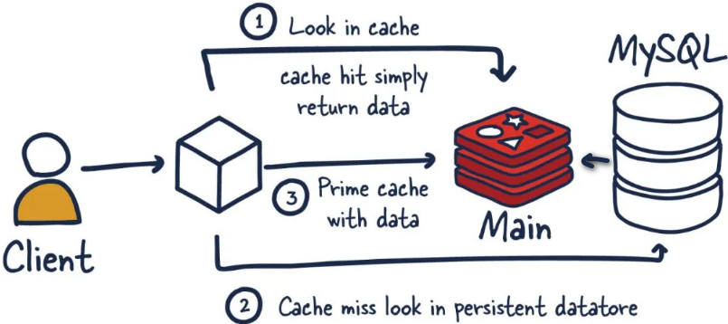
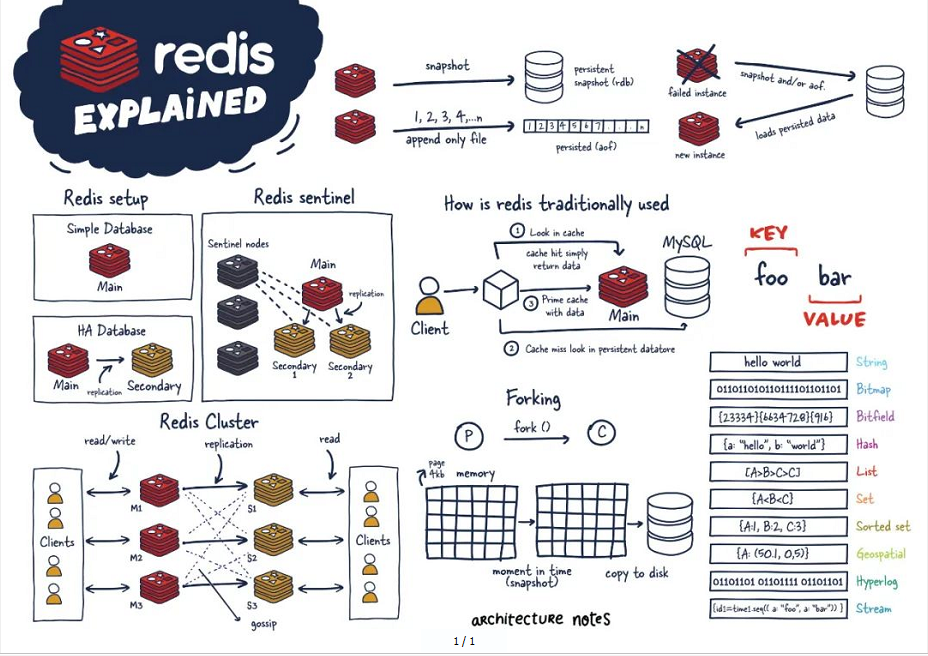
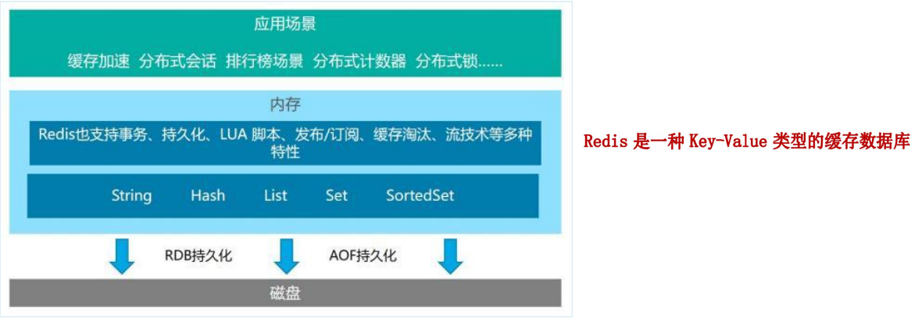

## Redis入门概述

### 1. Redis是什么

Redis全称 远程字典服务器（**Remote Dictionary Server**），它是完全开源的，使用ANSIC语言编写遵守BSD协议，是一个高性能的基于内存的Key-Value数据库，提供了丰富的数据结构，例如String、Hash、List、Set、SortedSet等等。数据时存在内存中的，同时Redis支持事务、持久化、LUA脚本、发布/订阅、缓存淘汰、流技术等多种功能特性，提供了主从模式、Redis Sentinel和Redis Cluster集群架构方案。

### 2. Redis与MySQL的关系

Redis是key-value数据库(NoSQL一种)，mysql是关系数据库。
Redis数据操作主要在内存，而mysql主要存储在磁盘。
Redis在某一些场景使用中要明显优于mysql，比如计数器、排行榜等方面。
Redis通常用于一些特定场景，需要与Mysql一起配合使用。
两者并不是相互替换和竞争关系，而是共用和配合使用。

按照二八原则，主流的应用对系统的请求80%都是查询，20%是增删改。客户端查询数据先查询Redis数据库，如果命中了则将查询结果返回，如果没有命中再去MySQL数据库查询，然后将数据返回并且将数据写入Redis数据库，下次再查询该数据时就可以从Redis数据库中获取。如图2-1所示。

### 3. Redis能干什么

- 缓存

  > Redis常用于作为高速缓存，将常用的数据存储在内存中，提高访问速度和响应时间，减轻后端数据库的压力。Redis支持多种数据结构，可以根据数据的类型和特点选择合适的数据结构进行缓存。

- RDB和AOF持久化

  > redis支持异步将内存中的数据写到硬盘上，同时不影响继续服务。
  >
  > 即使设备断电了，数据也不会丢失，重启后重新从硬盘恢复数据。

- 高可用架构搭配：单机、主从、哨兵、集群

  > 支持大规模数据存储和高并发访问。

- 解决缓存穿透、击穿、雪崩

  > 1. 对查询不存在的数据的请求进行过滤，比如采用 Bloom Filter 进行缓存预热或者对查询请求进行缓存穿透保护。
  > 2. 对于热点数据的访问，可以采用分布式锁等方法对缓存进行保护，避免缓存击穿。
  > 3. 对于缓存雪崩，可以采用缓存预热、缓存过期时间随机化、缓存数据的多级缓存等方法进行缓解。

- 分布式锁

  > Redis支持原子操作和过期时间等特性，可以用于实现分布式锁。
  >
  > 可以保证在分布式系统中同一时刻只有一个客户端可以持有锁，从而保证共享资源的互斥访问。
  >
  > 例如，可以使用Redis的SETNX命令实现基于key的锁，使用Lua脚本实现基于value的锁。

- 消息队列

  > redis提供了多种队列模式：List队列、Pub/Sub队列、Stream队列

- 计数器和排行榜

  > Redis支持原子操作，可以用于实现计数器和排行榜功能。
  >
  > 例如，可以使用Redis的INCR命令实现计数器功能，使用ZADD命令实现有序集合排行榜功能。

除了以上几个方面，Redis还可以用于实现限流、地理位置服务、实时统计等应用场景。总之，Redis是一个功能丰富、性能优秀的内存数据库，适合于需要高性能、高可用、高并发的应用场景。

### 4. Redis优势

- 性能极高 -Redis能读的速度是110000次/秒，写的速度是81000次/秒
- Redis数据类型丰富，不仅仅支持简单的key-value类型的数据，同时还提供list，zset，set，hash等数据结构的存储
- Redis支持数据的持久化，可以将内存中的数据保存在磁盘中，重启的时候可以再次加载进行使用
- Redis支持数据的备份，即master-slave模式的数据备份

