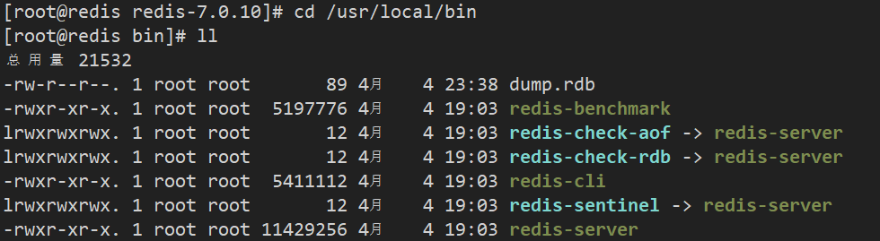
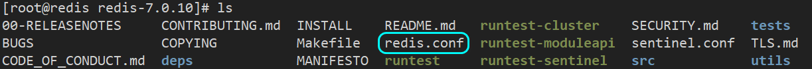
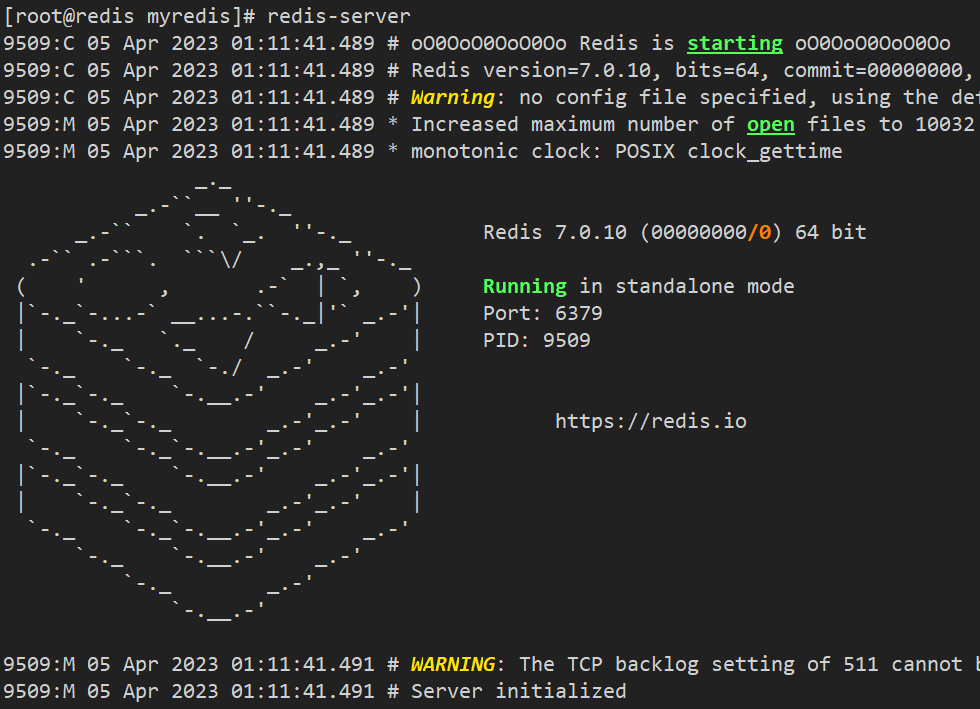
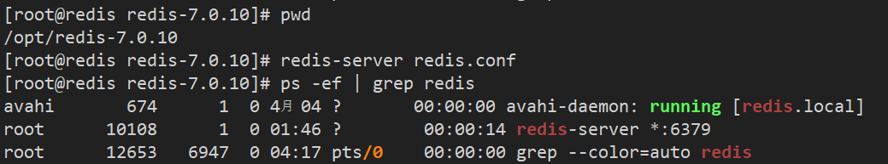
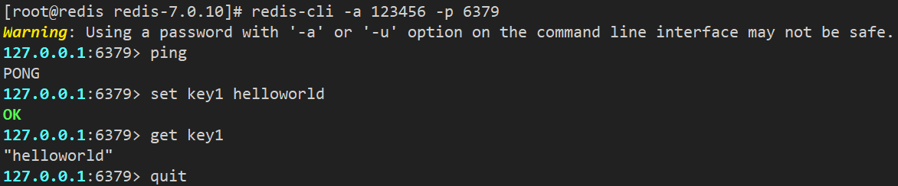
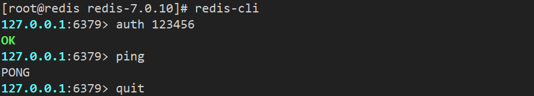
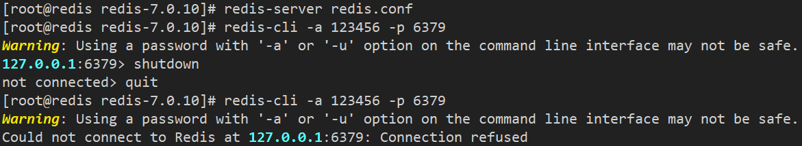

## Redis的安装和配置

Redis官网下载地址：https://redis.io/download/
Redis官方中文文档：https://www.redis.com.cn/documentation.html
Redis命令使用手册官方版：https://redis.io/commands/
Redis命令使用手册中文版：http://www.redis.cn/commands.html
Redis命令参考手册：http://doc.redisfans.com/

#### **(1) 检测Linux安装环境**

​	Linux环境安装Redis必须先具备gcc编译环境，gcc是linux下的一个编译程序，是C程序的编译工具。

```shell
gcc -v	# 查看是否安装了gcc
yum -y install gcc-c++	# 若是没有安装可以使用此命令安装
```

#### **(2) 下载redis**

​	下载redis-7.0.10.tar.gz，下载后使用工具将它传到Linux系统的/opt目录下，然后解压。对于第三方软件，一般都安装在/opt目录下。

```shell
tar -zxvf redis-7.0.10.tar.gz	# 解压到当前目录
```

#### **(3) 安装redis**

​	这里是redis的安装目录，进入解压目录执行make命令先编译后安装

```sh
cd redis-7.0.10	# 切换到解压目录
make	# 编译
make install	# 安装
```

#### **(4) 查看redis服务安装目录**

​	这里是redis服务的安装目录，redis服务默认安装目录在/usr/local/bin

​	装在这个目录下的文件，相当于配置了PATH变量，在任何目录都可以启动redis服务。

​	Linux下的/usr/local类似windows系统的C:\Program Files。



	redis-benchmark：性能测试工具
	redis-check-aof：修复有问题的aof文件
	redis-check-dump：修复有问题的rdb文件
	redis-cli：redis提供的命令行客户端
	redis-sentinel：redis的哨兵启动脚本
	redis-server：redis的服务端启动脚本

#### **(5) 修改配置文件**

​	回到解压目录，对redis.conf文件进行修改



​	修改配置文件前，先对文件进行备份

```sh
mkdir /myredis	#创建目录
cp redis.conf /myredis/redis7.conf	# 将配置文件复制到myredis目录并命名为redis7.conf
```

​	修改redis.conf配置文件，改完后确保生效，记得重启，记得重启

1.  默认daemonize no 改为 **`daemonize yes`**，表示开启后台启动
2.  默认protected-mode yes 改为 **`protected-mode no`**，需要别人来连接redis服务器的话需要改成no
3.  默认bind 127.0.0.1 **直接注释掉**(默认bind 127.0.0.1只能本机访问)或改成主机IP地址，否则影响远程IP连接
4.  添加redis密码，配置 **`requirepass 123456`** 即可（123456为设置的密码）

#### **(6) 启动redis服务**

​	启动配置文件，`redis-server`直接启动是前台启动，后面加上配置文件启动是后台启动。

​	任意目录输入redis-server都可以直接启动redis服务。



不过这样启动redis需要一直处在这个界面，也就是前台启动，不能进行其他操作，我们希望它在后台运行，后台启动需要指定配置文件

```shell
redis-server /opt/redis-7.0.10/redis.conf	# 指定配置启动：后台启动redis服务
ps -ef | grep redis		# 通过则个指令可以查看正在运行的redis服务
```



#### **(7) 连接redis服务**

​	通过redis的`redis-cli`可执行程序来连接redis服务

```sh
redis-cli -a 123456 -p 6379	# -a表示输入密码，-p表示端口号，本机访问可以省略不写，默认是6379
ping	# 输入ping后回车输出pong说明连接成功
set key1 helloworld		# 设置键key1的值为helloworld
get key		# 获取key1的值
quit	# 输入quit回车退出前台客户端，服务并没有退出
```



​	也可以直接执行`redis-cli`，然后在redis客户端命令行输入`auth 密码`



#### **(8) 停止redis服务**

​	利用`redis-cli`来执行 shutdown 命令停止 Redis 服务，因为之前配置了密码，因此需要通过 -u 来指定密码

```sh
# 单实例关闭
redis-cli -u 123456 shutdown 	
#多实例关闭，指定端口关闭
redis-cli -p 6379 shutdown
# 也可以使用   kill -9 进程号  终止对应的进程
```

​	如果是在redis的客户端窗口，可以直接使用shutdown命令关闭redis服务



​	可以看到，执行shutdown命令后就显示notconnected，然后使用quit命令退出redis客户端即可。
