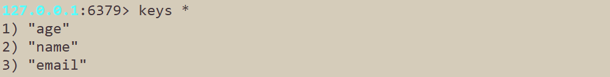
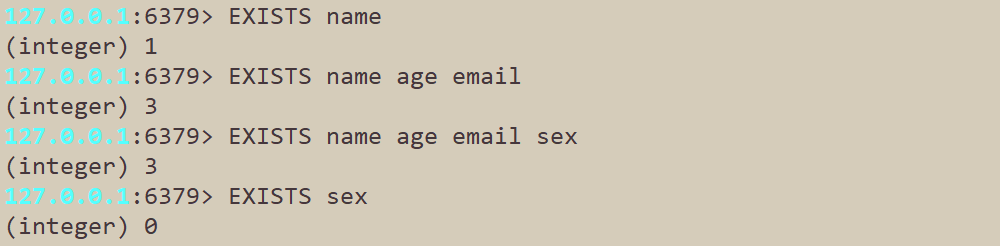
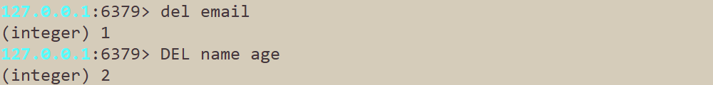
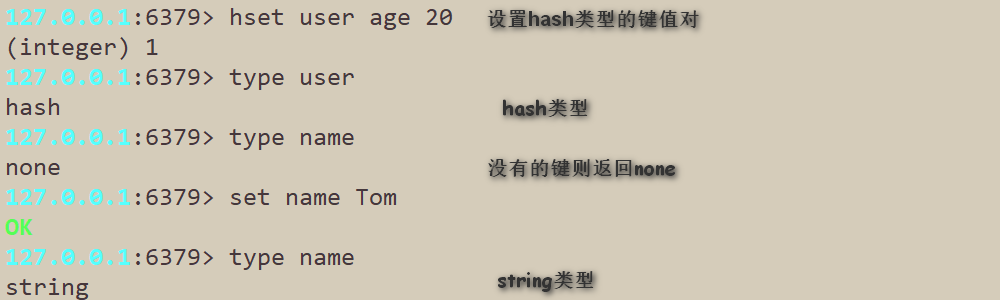
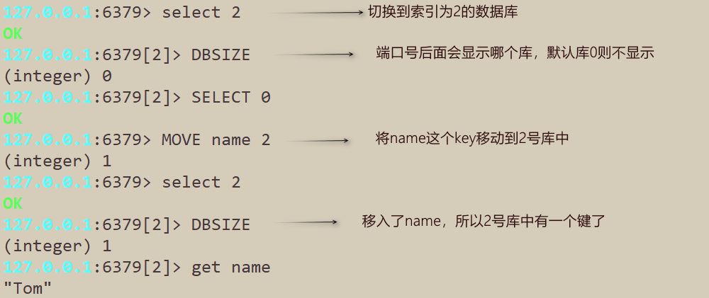
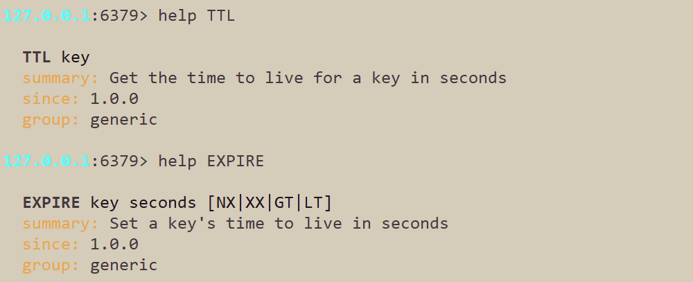
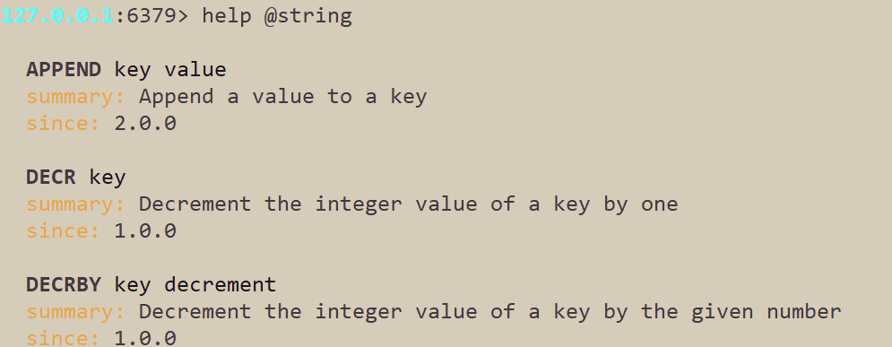

## Key的通用命令

redis命令不区分大小写，但是key是区分大小写的。没有返回值的命令执行成功会返回1，失败返回0。

#### **KEYS ***

> 查看所有的key，返回值是一个数组




#### **EXISTS**

> `EXISTS key [key ...]`：返回给定的key中已存在的个数，一个都不存在返回0。



#### **DEL** 

> `del key [key ...]`：删除给定的key，返回值为删除的个数




#### **EXPIRE**

> `expire key second`：给key设置一个过期时间second，单位为秒，比如expire name 10，表示name这个键10秒后过期


#### **TTL** 

> `ttl key`：查看key的过期时间，不设置过期时间的话默认是永不过期(返回值-1)，过期则返回-2。time to live的缩写。


#### **TYPE** 

> `type key`：返回key的类型，如果key不存在返回null




#### **DBSIZE**

> 查看当前数据库有多少个key

#### **SELECT** 

> `select index`：切换数据库，redis默认一共16个数据库，对应索引为0~15，默认的数据库是0号库

#### **MOVE** 

> `move key index`：将指定key移入指定数据库中




#### **FLUSHDB**

> 清空当前库的key

```sh
flushdb		# 输入fushdb回车即可清空当前库的所有键，此操作慎用
```

#### **FLUSHALL**

> 清空所有库的key

```sh
flushall	# 输入flushall会清空所有库的键，此操作慎用
```

------


#### **help**

> help命令可以查看redis命令或数据类型的使用说明，注意该命令要在redis客户端才能使用。

- help 命令：查看命令的使用说明



- help @数据类型：查看redis数据类型的使用说明



------


#### CONFIG

> 查看配置文件指定信息

```sh
127.0.0.1:6379> CONFIG get dir			# 查看RDB文件存放目录
1) "dir"							
2) "/opt/redis-7.0.10"
127.0.0.1:6379> CONFIG get save			# 查看RDB触发条件
1) "save"
2) "7 3"
127.0.0.1:6379> CONFIG get appendonly	# 查看AOF是否开启
1) "appendonly"
2) "yes"
```

