## Redis十大数据类型

redis中的数据都是用k-v键值对存储的，所有的key都是String类型，所说的十大==数据类型指的是value值的数据类型==。

准确来说这十大数据类型只有==六大数据类型==，分别是==String、List、Hash、Set、Zset、Stream==。
其余的四种是对这数据类型封装出来的数据结构，分别是Bitmap(String)、HyperLogLog(String)、Geospatial(Zset)、BitField(String)。

------


### 一. Stirng

> **字符串**
>
> String类型，也就是字符串类型，是Redis中最简单的存储类型，单key单value结构。
>其value是字符串，不过根据字符串的格式不同，又可以分为3类：
> String：普通字符串
> int：整数类型，可以做自增、自减操作
> float：浮点类型，可以做自增、自减操作
> 
>不管是哪种格式，底层都是字节数组形式存储，只不过是编码方式不同。字符串类型的最大空间不能超过512m.

------

<u>***String类型的常用命令：***</u>

#### **SET和GET**

**`set key value [可选参数]`**：添加或者修改一个String类型的键值对

**`get key`**：根据key获取String类型的value，不存在返回nil

> 可选参数：
>
> EX：以秒为单位设置过期时间
>
> PX：以毫秒为单位设置过期时间
>
> EXAT：设置以秒为单位的时间戳为过期时间
>
> PXAT：设置以毫秒为单位的时间戳为过期时间
>
> NX：键不存在的时候添加键值对，存在返回nil
>
> XX：键存在的时候设置键值，也就是覆盖，不存在返回nil
>
> GET：返回指定键原本的值，若不存在返回nil
>
> KEEPTTL：保留键之前的生存时间，即在覆盖键值时过期时间还是之前的过期时间
>
> 提示：set命令使用EX、PX、NX参数，效果等同于SETEX、SETPX、SETNX。

```sh
set name Tom	# 设置name=Tom
set name Bob get # 重新设置name值并返回原来的name值
set name Bob ex 20 get # 重新设置name值并设置过期时间20秒，并返回之前的name值
get name	# 获取name的值
```

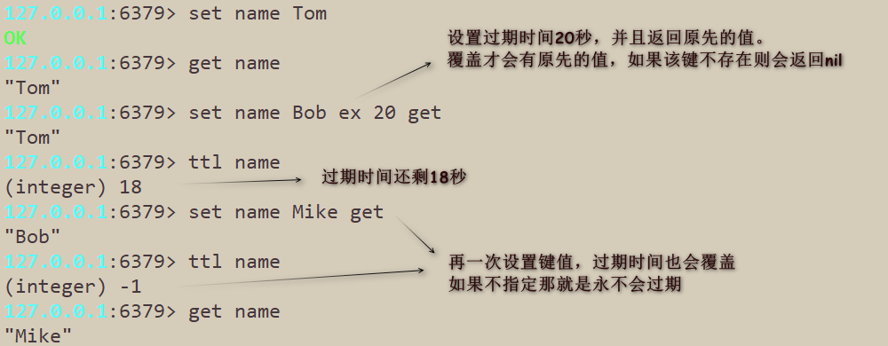

```sh
set name Marry keepttl	# 表示保持之前的过期时间
```

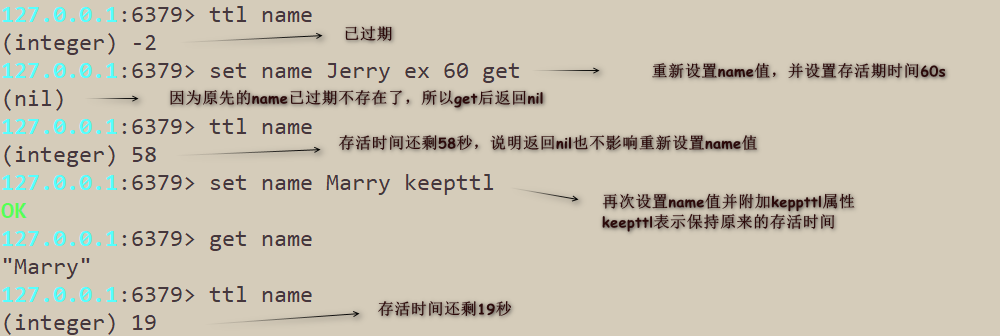

```sh
set name Mike XX	# name已存在时才创建(覆盖)
set name Mike NX	# name不存在时创建，已存在时不创建
```

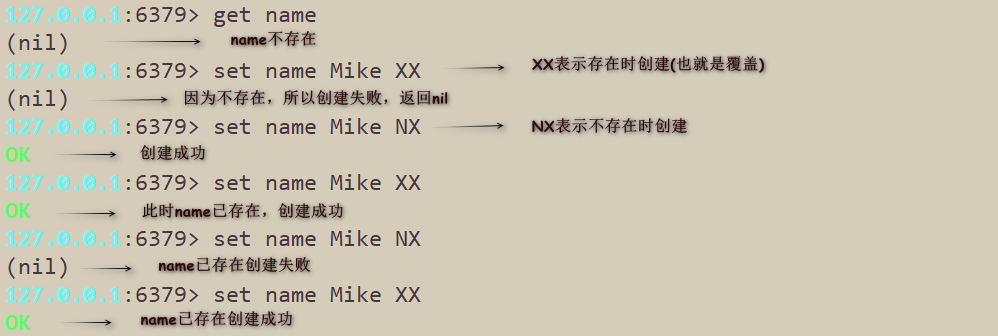

```sh
set name Mike EXAT 1680715582	# 设置以秒为单位的时间戳的过期时间
set name Mike PXAT 1680715582123	# 设置以毫秒为单位的时间戳的过期时间
```

------


#### **MSET和MGET**

> M是multi的缩写，表示多个的意思。
>

**`mset key value [key value ...]`**：批量添加多个String类型的键值对

```sh
mset name Tom age 18 sex man	# 设置name=Tom，age=18，sex=man
```

**`mget key [key ...]`**：批量获取String类型的value

```sh
mget name age sex	# 获取name、age、sex的值
```

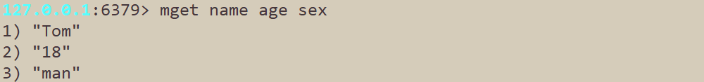

------


#### **INCR、INCRBY**

> increase的缩写，表示自增
>

**`incr key`**：让一个整型的key自增1

```sh
set age 20
incr age	# 让age自增1
```


**`incrby key step`**：指定步长step，让一个整型的key自增step

```sh
incrby age 2	# 让age自增2
```

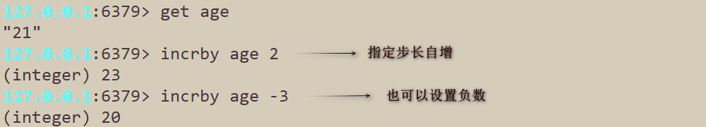


**`incrbyfloat key step`**：让一个浮点类型的数字指定步长自增（浮点类型只能指定步长自增，incrbyfloat也是用整型）

```sh
set weight 66.6
INCRBYFLOAT weight 0.2	# 让weight自增0.2
```

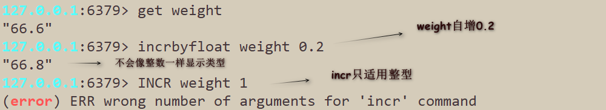

- **DECR、DECRBY、DECRBYFLOAT**

  自减，操作和上述自增一样。

------


#### **SETNX和SETEX**

> setnx：已存在就不会改变键的值。NX是not exists的缩写。
>
> setex：设定键的过期时间。EX是expire的缩写。

**`setnx key value`**：如果key不存在则创建一个String类型的键值对，如果key存在，则不执行。创建成功返回1，失败返回0。

**`setex key second`**：创建一个String类型的键值对，并设置过期时间，second为秒数


------


#### **MSETNX**

**`msetnx key value [key value ...]`**：批量添加多个String类型的键值对。

当且仅当要创建的所有key都不存在时才创建成功。只要有一个键已存在，则都创建失败。

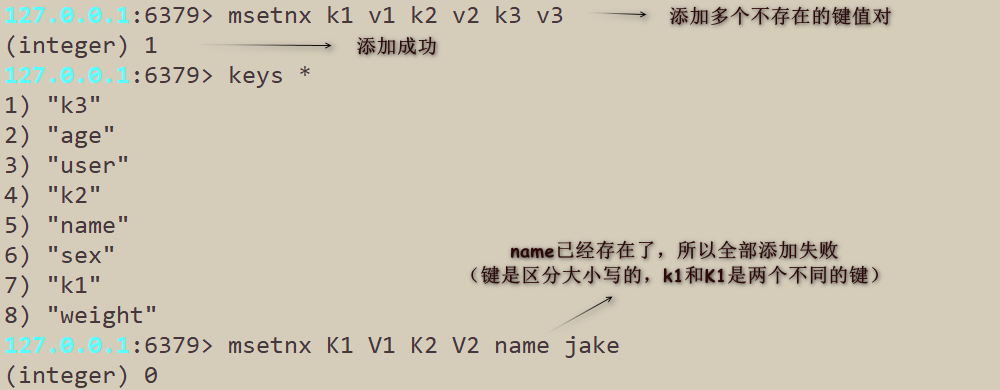

------


#### **SETRANGE和GETRANGE**

**`setrange key offset value`**：从指定位置替换值的内容，offset表示偏移量，如果为1表示从第二个字符开始。value为替换的内容。

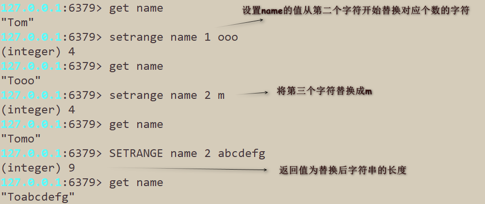


**`getrange key start end`**：获取key值指定范围的内容，start表示开始索引，end表示结束索引。0到-1表示获取全部。

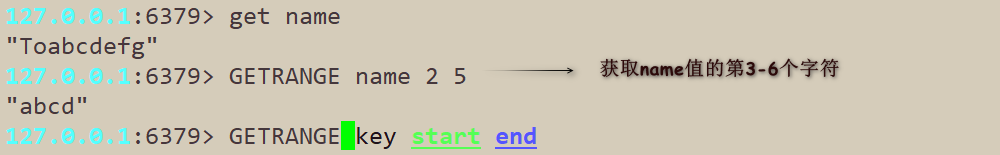

------


#### **STRLEN**

**`strlen key`**：获取key值的长度

```sh
strlen str # 获取str值的长度
```

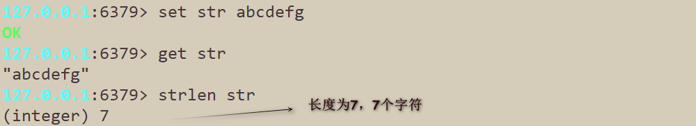

------


#### **APPEND**

**`append key value`**：在key值后追加内容value

```sh
append str hijklmn	# 在str值后追加内容hijklmn
```

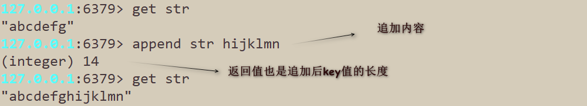

------


#### GETSET

**`getset key value`**：设置键值对时先获取原先的key值再设置新的key值，等价于set key get。

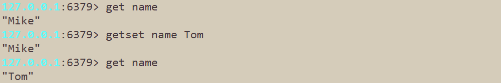

------


#### **key的结构**

Redis没有类似MySQL中的Table的概念，我们该如何区分不同类型的key呢？

例如，需要存储用户、商品信息到redis，有一个用户id是1，有一个商品id恰好也是1，此时如果使用id作为key，那就冲突了该怎么办？

我们可以通过给key添加前缀加以区分，不过这个前缀不是随便加的，有一定的规范：

Redis的key允许有多个单词形成层级结构，多个单词之间用':'隔开，格式如下：

```
	项目名:业务名:类型:id
```

这个格式并非固定，也可以根据自己的需求设计。这样我们就可以把不同类型的数据区分开了，从而避免了key的冲突问题。

例如我们的项目名称叫 heima，有user和product两种不同类型的数据，我们可以这样定义key：

- user相关的key：**heima:user:1**

- product相关的key：**heima:product:1**

如果Value是一个Java对象，例如一个User对象，则可以将对象序列化为JSON字符串后存储：

|     **KEY**     |                 **VALUE**                  |
| :-------------: | :----------------------------------------: |
|  heima:user:1   |    {"id":1,  "name": "Jack", "age": 21}    |
| heima:product:1 | {"id":1,  "name": "小米11", "price": 4999} |

并且，在Redis的桌面客户端中，还会以相同前缀作为层级结构，让数据看起来层次分明，关系清晰：

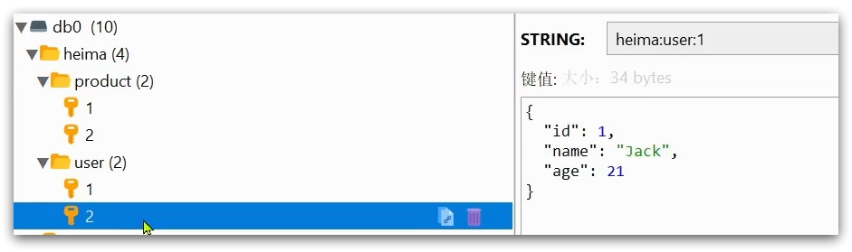

------

------


### 二. List

> **列表**
>
> Redis的List类型是一个单Key多Value的集合，其value值是有序可重复的。
>
> Redis中的List类型与Java中的LinkedList类似，可以看做是一个双向链表结构。既可以支持正向检索和也可以支持反向检索。
>
> *如果键不存在，创建新的链表；*
>
> *如果键已存在，新增内容，可重复；*
>
> *如果值全移除，对应的键也就消失了。*
>
> 特征与LinkedList类似：①有序 ②可重复 ③插入和删除速度快 ④查询速度一般
>
> 常用来存储一个有序数据，例如朋友圈点赞列表，评论列表等等。

------

*<u>**List类型常用命令：**</u>*

#### LPUSH和RPUSH

> 向列表头部或尾部插入元素。返回值为执行命令后列表的长度。当key不存在时则创建key。

**`LPUSH key element [element ...]`**：在列表key左边添加一个或多个元素，也就是在列表的头部添加元素。

**`RPUSH key element [element ...]`**：在列表key右边添加一个或多个元素，也就是在列表的尾部添加元素。

```sh
lpush list A B	# 创建一个列表，key为list
lpush list C D E	# 在列表左边（前面）追加C、D、E三个元素
rpush list X Y Z	# 在列表右边（后面）追加X、Y、Z三个元素
```


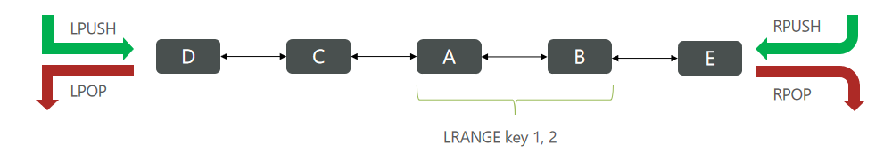

------


#### LPUSHX和RPUSHX

> 仅当列表存在时入栈，返回值为执行命令后列表的长度。

**`LPUSHX key vlaue`**：将value值插入到列表Key的表头，当且仅当 key存在并且是一个列表。当key不存在，执行失败，返回0。

**`RPUSHX key value`**：将值 value插入到列表key的表尾，当且仅当 key存在并且是一个列表。当key不存在，执行失败，返回0。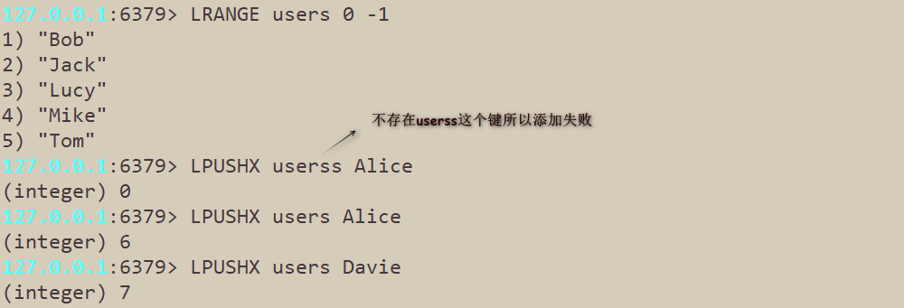

------


#### LRANGE

没有RRANGE。

**`LRANGE key start stop`**：返回列表 key中指定区间内的元素，区间以偏移量(索引) `start` 和 `stop` 指定。

> 0表示第一个元素，1表示列表第二个元素；-1表示列表最后一个元素，-2表示列表倒数第二个元素，以此类推。
>
> 如果start的下标比列表最大的下标end(LLEN list减一)还大，那么Lrange返回一个空列表。
>
> 如果stop的下标比end的下标还要大，Redis将stop的值设置为end。`0到-1表示列表的所有元素`。

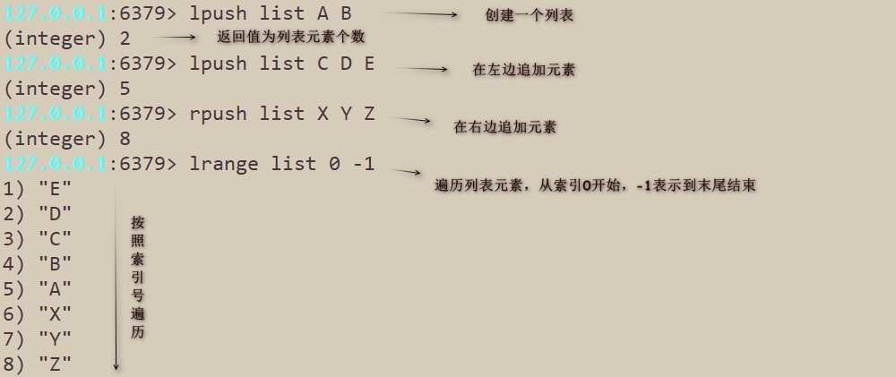

------


#### LPOP和RPOP

> 弹出列表最左端或最右端的元素。

**`LPOP key [count]`**：移除列表最左侧的元素并返回该元素，没有则返回nil，count为移除的个数。

**`RPOP key [count]`**：移除列表最右侧的元素并返回该元素，没有则返回nil，count为移除的个数。

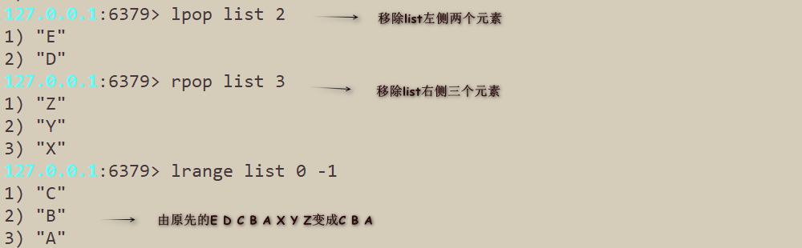

------


#### BLPOP和BRPOP

> B是blocking的缩写，表示阻塞的意思。
>
> 与LPOP和RPOP类似，只不过在没有元素时等待指定时间，而不是直接返回nil。

**`BLPOP key [key ...] timeout`**：移除列表第一个元素并返回该元素，如果列表没有元素会阻塞队列直到等待超时或发现可弹出元素为止

**`BRPOP key [key ...] timeout`**：移除列表最后一个元素并返回该元素，如果列表没有元素会阻塞队列直到等待超时或发现可弹出元素为止

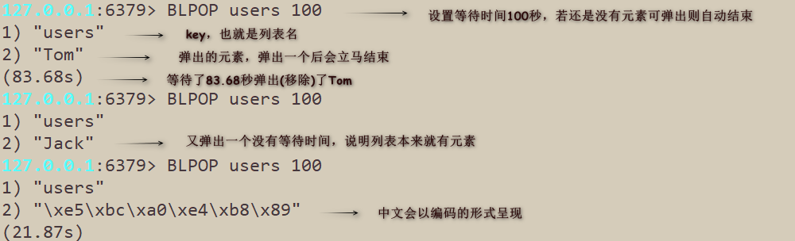

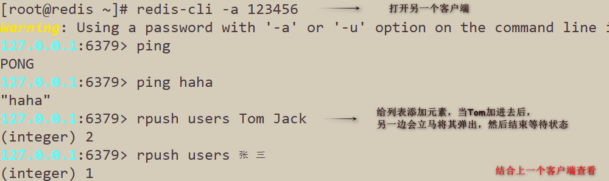

------


#### RPOPLPUSH

**`RPOPLPUSH source destination`**：将列表source中的尾元素弹出插入到列表destination的头部，并返回该元素。

> 如果source不存在，返回nil。
> 如果source和destination相同，则列表中的表尾元素被移动到表头，并返回该元素，这种情况可以视为列表的旋转操作。

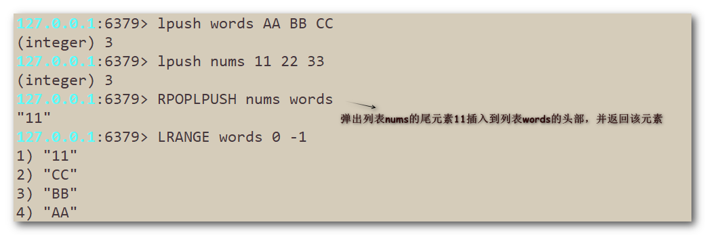

Redis的列表经常被用作队列(queue)，用于在不同程序之间有序地交换消息(message)。一个客户端通过 LPUSH命令将消息放入队列中，而另一个客户端通过 RPOP或者 BRPOP命令取出队列中等待时间最长的消息。

上面的队列方法是『不安全』的，因为在这个过程中，一个客户端可能在取出一个消息之后崩溃，而未处理完的消息也就因此丢失。

使用RPOPLPUSH命令(或者它的阻塞版本 BRPOPLPUSH )可以解决这个问题：因为它不仅返回一个消息，同时还将这个消息添加到另一个备份列表当中，如果一切正常的话，当一个客户端完成某个消息的处理之后，可以用 LREM 命令将这个消息从备份表删除。

最后，还可以添加一个客户端专门用于监视备份表，它自动地将超过一定处理时限的消息重新放入队列中去(负责处理该消息的客户端可能已经崩溃)，这样就不会丢失任何消息了。

------


#### LINDEX

**`LINDEX key index`**：通过索引获取列表元素。

下标(index)参数 `start` 和 `stop` 都以 `0` 为底，也就是说，以 `0` 表示列表的第一个元素，以 `1` 表示列表的第二个元素，以此类推。

你也可以使用负数下标，以 `-1` 表示列表的最后一个元素， `-2` 表示列表的倒数第二个元素，以此类推。

如果 `index` 参数的值不在列表的区间范围内(out of range)，返回 `nil` 。如果 `key` 不是列表类型，返回一个错误。

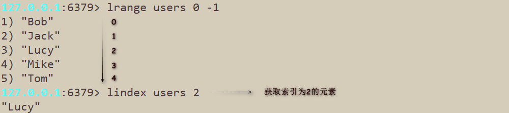

------


#### LLEN

**`LLEN key`**：返回列表key的长度。

> 如果key不存在，则key被解释为一个空列表，返回0。
>
> 如果key不是一个列表类型返回一个错误。

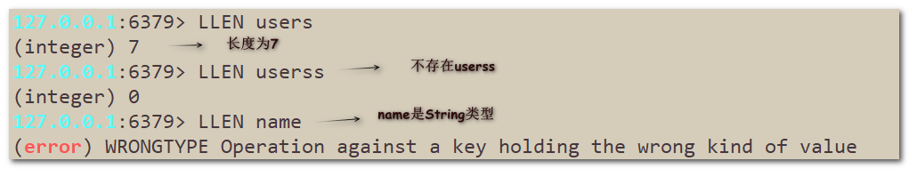

------


#### LREM

> remove的缩写，移除指定元素。
>
> 返回值：被移除元素的数量。不存在的 `key` 被视作空表(empty list)，所以当 `key` 不存在时， LREM命令总是返回 0 。

**`LREM key count value`**：根据count的值，移除列表中与参数value相等的元素。

> `count` 的值可以是以下几种：
>
> - `count > 0` : 从表头开始向表尾搜索，移除与 `value` 相等的元素，数量为 `count` 。
> - `count < 0` : 从表尾开始向表头搜索，移除与 `value` 相等的元素，数量为 `count` 的绝对值。
> - `count = 0` : 移除表中所有与 `value` 相等的值。

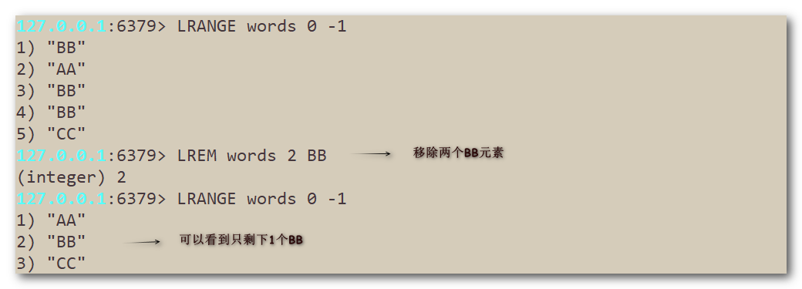

------


#### LTRIM

> 对一个列表进行修剪(trim)，让列表只保留指定区间内的元素，不在指定区间之内的元素都将被删除。

**`LTRIM key start stop`**：让列表key只保留`start`-`stop`区间的元素。成功返回ok，若key不是列表类型返回错误。

> 下标(index)参数 `start` 和 `stop` 都以 0 为底，也就是说，以 0 表示列表的第一个元素，以 1 表示列表的第二个元素，以此类推。
> 也可以使用负数下标，以 -1 表示列表的最后一个元素， -2 表示列表的倒数第二个元素，以此类推。

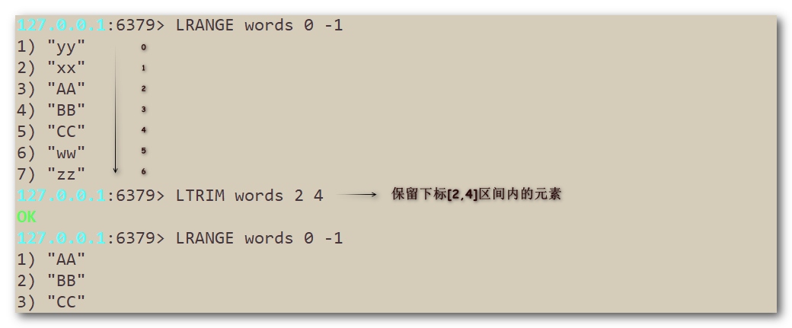

------


#### LSET

**`LSET key index value`**：将列表key下标为index的元素的值设置为value。操作成功返回ok。

> 当index参数超出范围，或对一个空列表(key不存在)进行LSET时，返回一个错误。关于更多的下标信息，参考LINDEX。

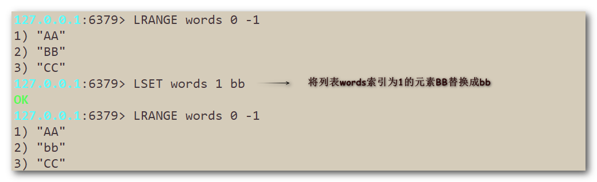

------


#### LINSERT

**`LINSERT key BEFORE|AFTER element value`**：将值value插入到列表key中element元素之前或之后。

> 当`element`不存在列表`key`中时，不执行任何操作。当`key`不存在时，也不执行任何操作。若`key`不是列表类型，返回一个错误。
>
> 返回值：
> 如果命令执行成功，返回插入操作完成之后，列表的长度。
> 如果没有找到 `element` ，返回 `-1` 。
> 如果 `key` 不存在或为空列表，返回 `0` 。

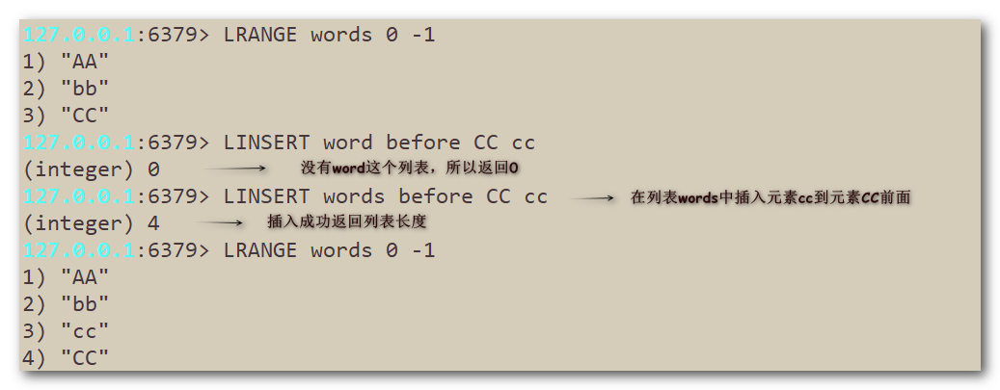

------

------


### 三. Hash

> **哈希表**
>
> hash类型，也叫做散列。其value是一个无序字典，类似于java中的HashMap结构。
>
> K-V模式不变，但v又是一个键值对：Map<key,Map<key,value>>

String结构是将对象序列化为JSON字符串后存储，当需要修改对象某个字段时很不方便：

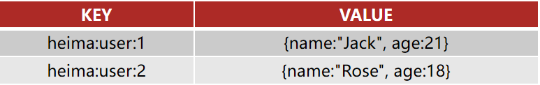

Hash结构可以将对象中的每个字段独立存储，可以针对单个字段做CRUD，下面是两个哈希表：

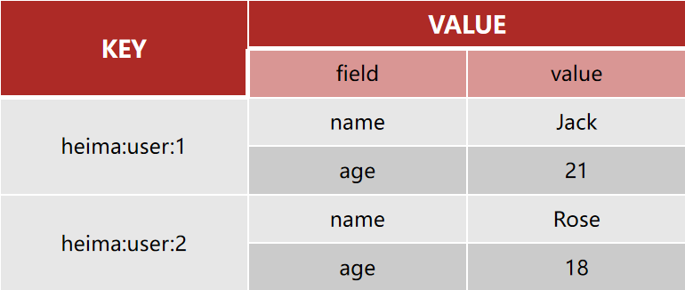

------


<u>***Hash类型的常用命令：***</u>

#### HSET和HGET

**`HSET key field value [field value ...]`**：将hash表key中的域field的值设置为value，支持同时设置多个域-值对。

> 如果key不存在，一个新的hash表被创建并执行HSET操作。
> 如果域field不存在，表示新增`field-value`(域值对)，如果域field已经存在哈希表key中，其旧值将被覆盖。
>
> 返回值：
> 如果 field 是哈希表中的一个新建域，并且值设置成功，返回 1 。多个则返回对应的个数。
> 如果哈希表中域 field 已经存在且旧值已被新值覆盖，返回 0。

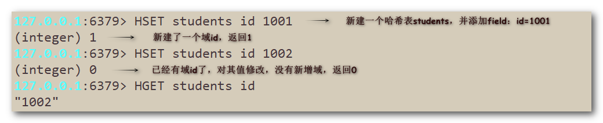

**`HGET key field `**：根据给定域field返回对应的value值。当key不存在或者field不存在，返回nil。

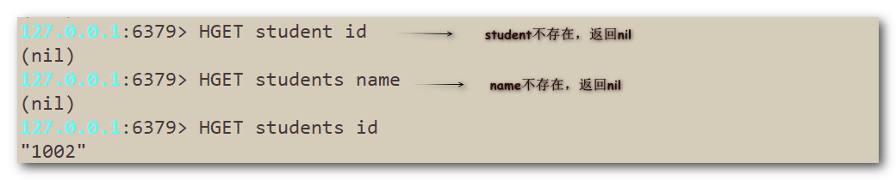

------


#### HMSET和HMGET

**`HMSET key field value [field value ...]`**：同时将多个`field-value`（域-值对）设置到哈希表key中。

> 此命令会覆盖哈希表中已存在的域，如果key不存在，一个空的哈希表被创建并执行HMSET操作。
>
> 返回值：执行成功返回ok；若key不是hash类型，返回一个错误。
>
> HSET在Redis版本迭代后也支持同时设置多个值到哈希表中，与HMSET操作完全相同，HMSET今后可能被淘汰。

**`HMGET key field [field ...]`**：返回哈希表key中一个或多个给定的域值。

> 如果给定的域不存在于哈希表，那么返回一个 `nil` 值。key不存在时也返回一个`nil`值。key不是Hash类型时报错。

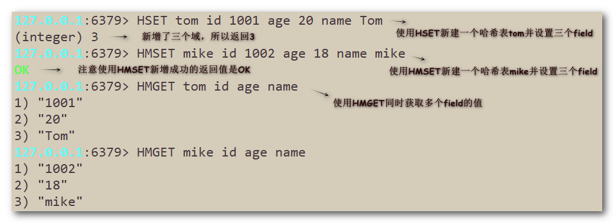

------


#### HGETALL

**`HGETALL key`**：返回哈希表key中所有的`field`和`value` 。

> 在返回值里，紧跟着域名后的是域的值，所以返回值的长度是哈希表大小的两倍。
>
> 返回值：以列表形式返回哈希表的域和值，若key不存在，返回空列表。若key不是hash类型则报错。
>
> 若在Redis客户端这样显示的数据就是列表：
> 1）"AA"
> 2）"BB"
> 3）"CC"
> ...

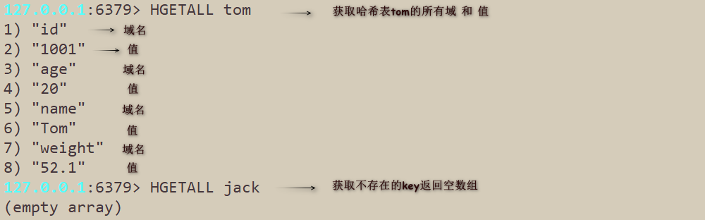

------


#### HDEL

**`HDEL key field [field ...]`**：删除哈希表 `key` 中的一个或多个指定域，不存在的域将被忽略。

> 返回值：被成功移除的域的数量，不包括被忽略的域。

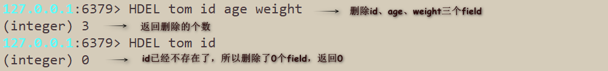

------


#### HLEN

**`HLEN key`**：返回哈希表 `key` 中域的数量。

> 返回值：返回哈希表中域的数量，当key不存在时返回0，若key不是hash类型则报错。

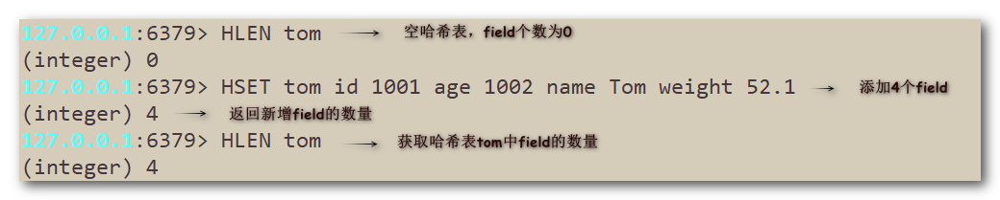

------


#### HEXISTS

**`HEXISTS key field`**：查看哈希表key中，给定域field是否存在。

> 如果哈希表中存在给定域，返回 `1` 。
> 如果哈希表中不存在给定域，或 `key` 不存在，返回 `0` 。

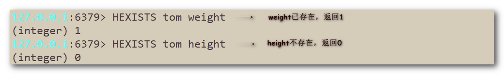

------


#### HKEYS和HVALS

**`HKEYS key`**：获取哈希表key中所有的`field`

> 返回值：返回哈希表中所有field的`数组`，若key不存在返回一个空数组。若key不是hash类型返回错误。

**`HVALS key`**：获取哈希表key中所有field对应的`value`值。

> 返回值：返回哈希表中所有field对应的value的`数组`，若key不存在返回一个空数组。若key不是hash类型返回错误。

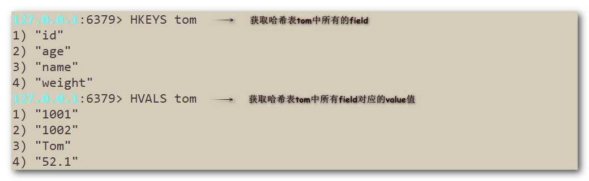

------


#### HINCR、HINCRBYFLOAT

**`HINCRBY key field increment`**：为哈希表 `key` 中的域 `field` 的值加上增量 `increment` 。只适用整型字符串

**`HINCRBYFLOAT key field increment`**：为哈希表 `key` 中的域 `field` 加上浮点数增量 `increment` 。只适用浮点型字符串

> 增量也可以为负数，相当于对给定域进行减法操作。
>
> 如果哈希表 `key` 不存在，那么会先创建一个哈希表，再创建域 `field` ，最后再执行`HINCRBY` 或 `HINCRBYFLOAT`操作。
>
> 如果域 `field` 不存在，那么在执行命令前，域的值被初始化为 `0` ，然后后执行`HINCRBY` 或 `HINCRBYFLOAT`操作。
>
> 对一个储存`非整型字符串`的域 field 执行 `HINCRBY` 命令将造成一个错误。
>
> 对一个储存`非数值型字符串`的域 field 执行 `HINCRBYFLOAT` 命令将造成一个错误。
>
> 本操作的值被限制在 64 位(bit)有符号数字表示之内。

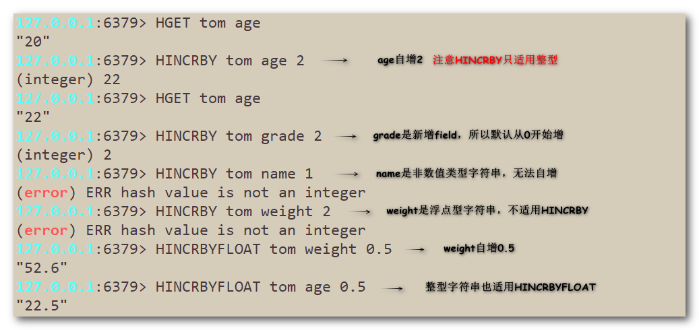

------


#### HSETNX

**`HSETNX key field value`**：向哈希表key中添加`field-value`，当且仅当域field不存在。

> 若field已存在，则该操作无效；若key不存在，则创建该哈希表并执行HSETNX操作。
>
> 返回值：添加成功，返回1；如果给定域已经存在返回 0 。

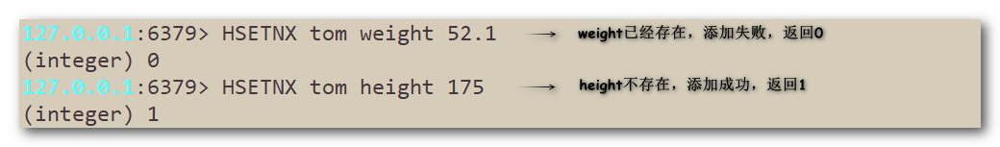

------

------


### 四. Set

> **集合**
>
> Redis的Set类型是一个和List一样的单key多value的集合，与List不同的是Set的value是无序且不可重复的。
>
> Redis的set相当于Java语言里面的HashSet，它内部键值对是无序的、唯一的。它的内部实现相当于一个特殊的字典，字典中所有的value都是一个值NULL，可以看做是一个value为null的HashMap。
>
> 具备与HashSet类似的特征：
> - 无序 
> - 元素不可重复
> - 查找快
> - 支持交集、并集、差集等功能
>
> *应用场景*：
> 微信抽奖小程序。（SRANDMEMBER）
> 微信朋友圈共友点赞。（SINTER）
> QQ推荐可能认识的人。（SDIFF）

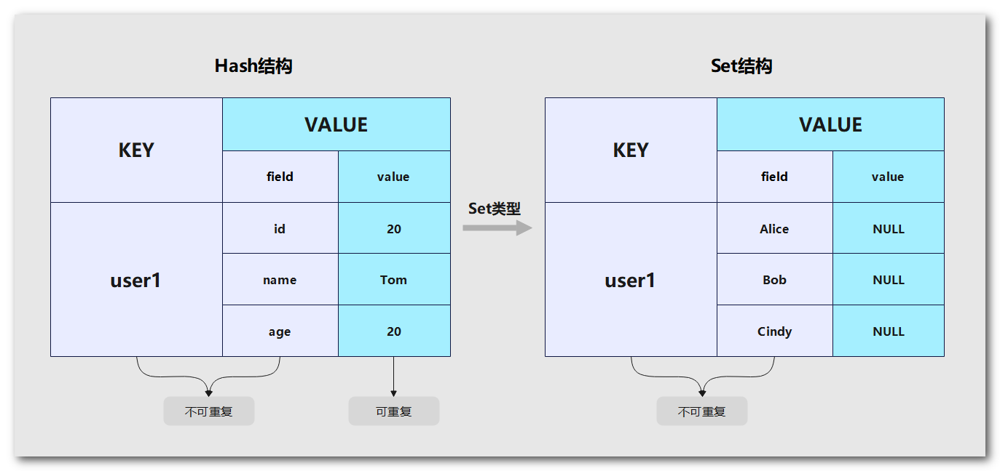

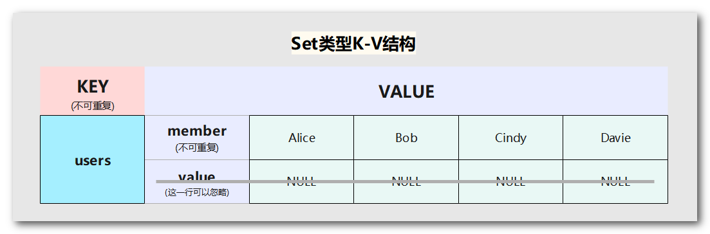

------


<u>***Set类型的常用命令：***</u>

#### SADD

**`SADD key member [member ...]`**：将一个或多个 `member` 元素加入到set集合 `key` 当中，已经存在于集合的 `member` 元素将被忽略。

> 假如 `key` 不存在，则创建一个只包含 `member` 元素作成员的集合。
>
> 当 `key` 不是Set集合类型时，返回一个错误。
>
> **返回值**：被添加到集合中的新元素的数量，不包括被忽略的元素。

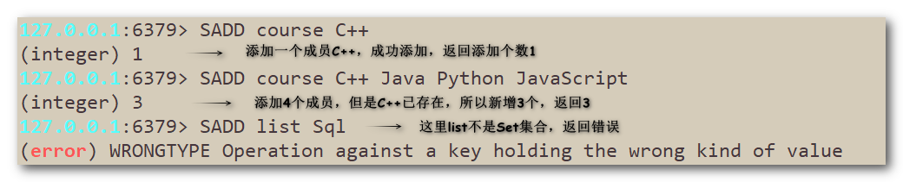

------


#### SMEMBERS

**`SMEMBERS key`**：返回集合`key`中所有的成员。

> 若key不存在，返回空数组；若key不是Set集合，返回错误。

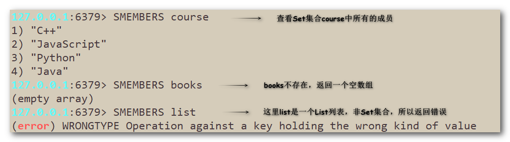

------


#### SISMEMBER

> S表示Set集合，ISMEMBER表示is member？

**SISMEMBER key member**：判断 `member` 元素是否是集合 `key` 的成员。

> 如果 `member` 元素是集合的成员，返回 `1` 。
>
> 如果 `member` 元素不是集合的成员，或 `key` 不存在，返回 `0` 。

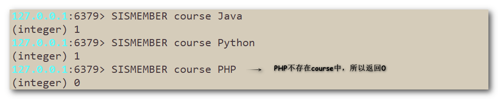

------


#### SCARD

**`SCARD key`**：返回集合key中成员的个数。当key不存在时，返回0。若key不是Set集合类型，返回错误。

```sh
127.0.0.1:6379> SCARD course	# 获取集合course中元素的个数
(integer) 4
```

------


#### SREM

**`SREM key member [member ...]`**：移除集合key中的一个或多个member元素并返回移除的个数，不存在的member元素会被忽略。

```sh
127.0.0.1:6379> SREM course C++		# 移除C++
(integer) 1		# 成功移除一个

```

------


#### SRANDMEMBER

**`SRANDMEMBER key [count]`**：随机返回集合中一个[或多个]元素。仅仅返回随机元素，而不对集合进行任何改动。

>  SRANDMEMBER命令可选的 `count` 参数：
>
> - 如果 `count` 为正数，且小于集合基数，那么命令返回一个包含 `count` 个元素的数组，数组中的元素**各不相同**。
>   如果 `count` 大于等于集合基数，那么返回整个集合。
> - 如果 `count` 为负数，那么命令返回一个数组，数组中的元素**可能会重复出现多次**，而数组的长度为 `count` 的绝对值。
>
> 返回值:
> 只提供 `key` 参数时，返回一个元素；如果集合为空，返回 `nil` 。
> 如果提供了 `count` 参数，那么返回一个数组；如果集合为空，返回空数组。

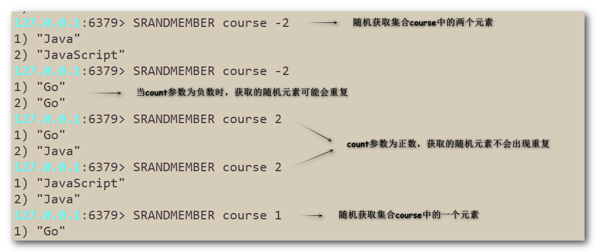

------


#### SPOP

**`SPOP key [count] `** ：移除并返回集合中的一个[或多个]随机元素。

> 如果只想获取一个随机元素，但不想该元素从集合中被移除的话，可以使用 SRANDMEMBER命令。
>
> 返回值：被移除的随机元素。当 `key` 不存在或 `key` 是空集时，返回 `nil` 。

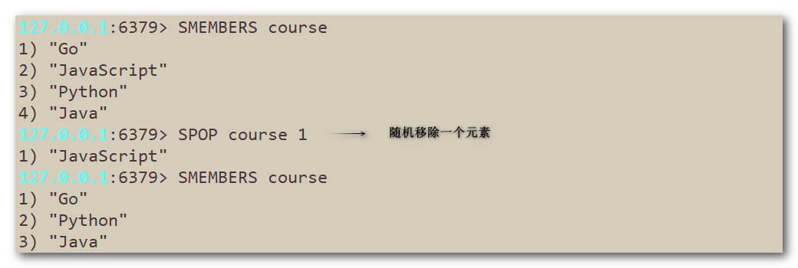

------


#### SMOVE

**`SMOVE source destination member`**：将 `member` 元素从 `source` 集合移动到 `destination` 集合。

> SMOVE是原子性操作。
>
> 如果 `source` 集合不存在或不包含指定的 `member` 元素，则 SMOVE 命令不执行任何操作，仅返回 `0` 。
>
> 当 `destination` 集合已经包含 `member` 元素时， SMOVE 命令只是简单地将 `source` 集合中的 `member` 元素删除。
>
> 当 `source` 或 `destination` 不是集合类型时，返回一个错误。
>
> **返回值:**
>
> 如果 `member` 元素被成功移除，返回 `1` 。
>
> 如果 `member` 元素不是 `source` 集合的成员，并且没有任何操作对 `destination` 集合执行，那么返回 `0` 。

```sh
127.0.0.1:6379> smembers course					# 集合course有三个成员
1) "Go"
2) "Python"
3) "Java"
127.0.0.1:6379> smembers subject				# 集合subject有四个成员
1) "Chinese"
2) "Physics"
3) "English"
4) "Math"
127.0.0.1:6379> SMOVE subject course Physics	# 将集合subject的成员Physics移动到集合course中
(integer) 1
127.0.0.1:6379> SMEMBERS course					# 集合course中新增成员Physics
1) "Physics"
2) "Go"
3) "Python"
4) "Java"
127.0.0.1:6379> SMEMBERS subject				# 集合subject中少了一个成员
1) "Chinese"
2) "English"
3) "Math"
127.0.0.1:6379> SADD subject Go					# 新增成员Go到集合subject
(integer) 1
127.0.0.1:6379> SMOVE subject course Go			# 移动成员Go从subject到course(Go在两个集合中都存在)
(integer) 1
127.0.0.1:6379> SMEMBERS subject				# 自身减少了一个成员
1) "Chinese"
2) "English"
3) "Math"
127.0.0.1:6379> SMEMBERS course					# course本身就已有Go成员，所以不执行任何操作(也可以理解为覆盖了)
1) "Physics"
2) "Go"
3) "Python"
4) "Java"
```

------


#### 集合运算

##### SDIFF

**`SDIFF key key2 ...`**：返回给定集合的差集。

> sdiff A B：返回属于集合A但不属于集合B的元素
> sdiff B A：返回属于集合B但不属于集合A的元素

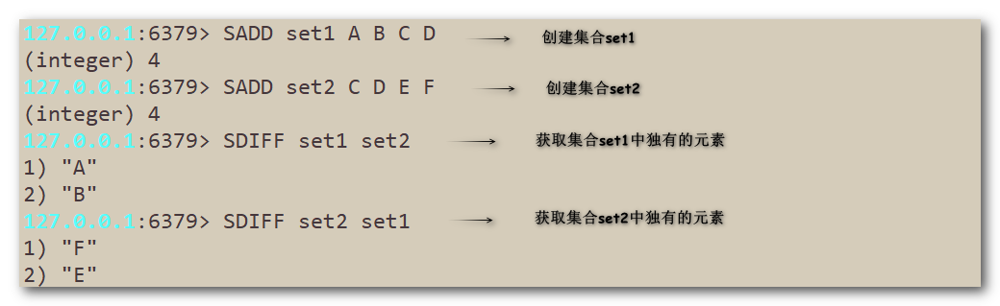

##### SUNION

**`SUNION key [key ...]`**：返回给定集合的并集。

> 比如`sunion A B`表示返回集合A和集合B的所有元素，公共的只取一份。

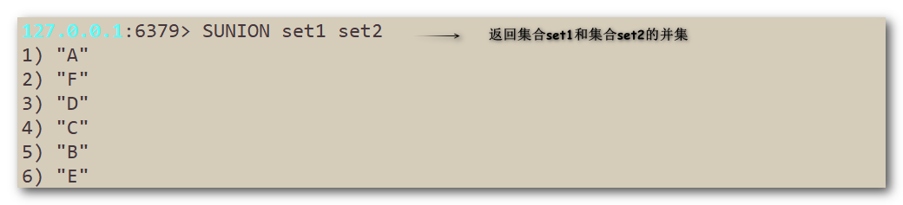

##### SINTER

**`SINTER key [key ...]`**：返回给定集合的交集。

> 比如`sinter A B`表示即返回集合A和集合B共有的元素。

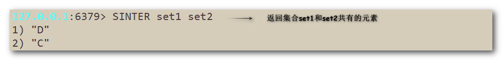

**`SINTERCARD numkeys key [key ...] [LIMIT limit]`** ：返回给定集合交集的个数。

> numkeys为key的个数。
>
> LIMIT为限制返回的个数的最大值，比如交集个数有10个，但是LIMIT为5，则返回5。

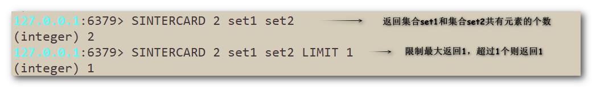

------

------


### 五. SortedSet

> **有序集合**
>
> SortedSet也叫ZSet。在Set的基础上，每个member前面加个score属性。
>
> Redis的SortedSet是一个可排序的set集合，与Java中的TreeSet有些类似，但底层数据结构却差别很大。
>
> SortedSet中的每一个元素都带有一个score属性，可以基于score属性对元素排序，底层的实现是一个跳表（SkipList）加 hash表。
>
> score的值是一个*整型数值或者浮点数值*  的数，是可重复的。
>
> SortedSet具备下列特性：
>
> - 可排序
> - 元素不重复
> - 查询速度快
>
> 因为SortedSet的可排序特性，经常被用来实现排行榜这样的功能。比如商品销售排行榜。
>

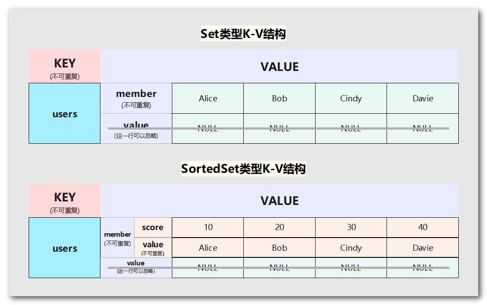

------


<u>***Zset类型的常用命令：***</u>

#### ZADD

**`ZADD key score member [[score member] [score member] ...]`**：将一个或多个元素及其`score`值添加到有序集合`key`中。

> 如果某个 `member` 已经是有序集的成员，那么更新这个 `member` 的 `score` 值，并通过重新插入这个 `member` 元素，来保证该 `member` 在正确的位置上。
>
> `score`是一个用于排序的属性，它的值是整数值或双精度浮点数，`score`写在`member`的前面。
>
> 如果 `key` 不存在，则创建一个空的有序集并执行 `ZADD` 操作。当 `key` 存在但不是有序集类型时，返回一个错误。
>
> 当然还可以加其他参数比如`NX`、`XX`、`INCR`等等，对有序集的更多介绍参见 [sorted set](http://redis.io/topics/data-types#sorted-sets) 。

```sh
127.0.0.1:6379> ZADD userZset 10 Alice 20 Bob 30 Cindy 40 Davie	# 添加四个成员
(integer) 4		# 返回添加成功的个数
```

------


#### ZCARD

**`ZCARD key `**：返回有序集 `key` 中成员的个数。当key不存在时返回0，若key不是有序集类型，返回错误。

```sh
127.0.0.1:6379> ZCARD userZset		# 获取有序集userZset中成员的个数
(integer) 4		# 四个
```

------


#### ZCOUNT

**`ZCOUNT key min max`**：返回有序集 `key` 中， `score` 值在 `min` 和 `max` 之间(默认包括 `score` 值等于 `min` 或 `max` )的成员的数量。

> 默认情况下，区间的取值使用闭区间(小于等于或大于等于)，也可以通过给参数前增加 `(` 符号将其改变为开区间。
> 比如 `(1 5` 表示 1<score<=5，`(1 (5` 表示 1<score<5。

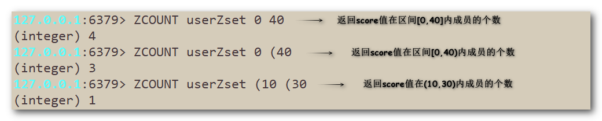

------


#### ZSCORE

**`ZSOCRE key member`**：返回有序集 `key `中指定成员 `member` 的 `score` 值。

> 如果 `member` 元素不是有序集 `key` 的成员，或 `key` 不存在，返回 `nil` 。
>
> 返回值：`member` 成员的 `score` 值，以字符串形式表示。

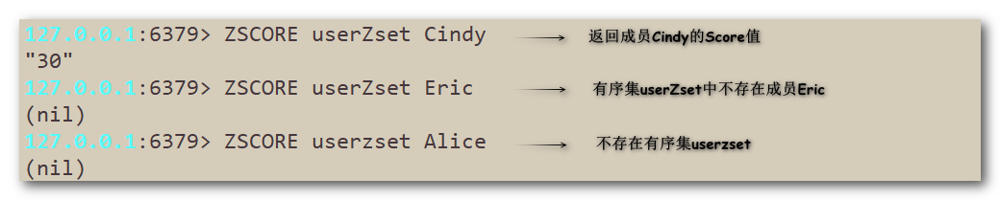

------


#### ZRANGE和ZREVRANGE

**`ZRANGE key start stop [WITHSCORES]`**：返回有序集合key中指定区间的成员。*从小到大排序*

> 其中成员的位置是按score值从小到大排序，具有相同score的车成员按字典序来排列。区间(下标参数)这里不再赘述。
>
> `WITHSCORES` 选项，表示让成员和它的 `score` 值一并返回，返回列表以 `member1,score1, ..., memberN,scoreN` 的格式表示。
> 可能会返回一些更复杂的数据类型，比如数组、元组等。
>
> 如果需要按score值从大到小排序，可以适用`ZREVRANGE`命令。

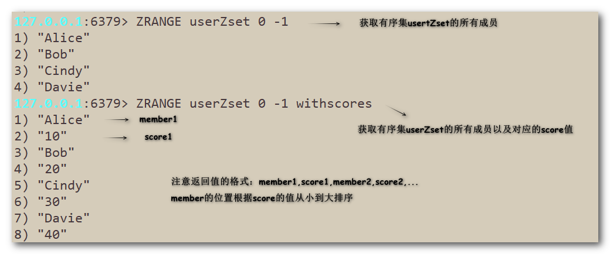

**`ZREVRANGE key start stop [WITHSCORES]`**：返回有序集合key中指定区间的成员。*从大到小排序*

> 成员的位置是按照`score`值从大到小排序，其余都和`ZRANGE`一样。

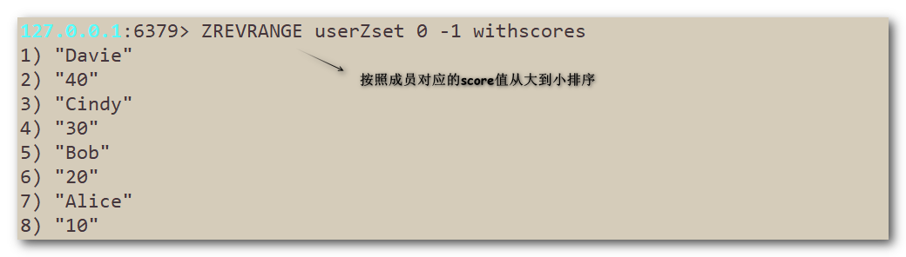

------


#### ZRANGEBYSCORE和ZREVRANGEBYSCORE

**`ZRANGEBYSCORE key min max [WITHSCORES] [LIMIT offset count]`**：返回有序集 `key` 中所有 `score` 值介于 `min` 和 `max` 之间(包括等于 `min` 或 `max` )的成员。按score值*从小到大排序*

> 默认情况下，区间的取值使用闭区间(小于等于或大于等于)，也可以通过给参数前增加 `(` 符号来使用可选的开区间(小于或大于)。
> 比如 `(1 5` 表示 1<score<=5，`(1 (5` 表示 1<score<5。
>
> `LIMIT` 参数限制返回结果的区间(就像SQL中的 `SELECT ... LIMIT offset, count` )，offset为下标偏移量，count为个数。
>
> `WITHSCORES` 表示将有序集成员及其 `score` 值一起返回。

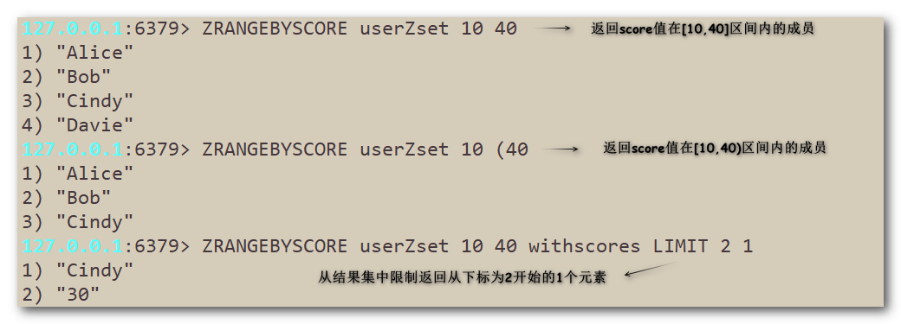

**`ZREVRANGEBYSCORE key min max [WITHSCORES] [LIMIT offset count]`**：返回有序集 `key` 中所有 `score` 值介于 `min` 和 `max` 之间(包括等于 `min` 或 `max` )的成员。按score值*从大到小排序*，其余参考ZRANGEBYSCORE。

------


#### ZRANK和ZREVRANK

**`ZRANK key member`**：返回有序集 `key` 中指定成员 `member` 的排名。*从小到大*

> 排名按 `score` 值递增(从小到大)顺序排列。排名以 `0` 为底，也就是说`score` 值最小的成员排名为 `0` 。
>
> 使用 `ZREVRANK` 命令可以获得成员按 `score` 值递减(从大到小)排列的排名。

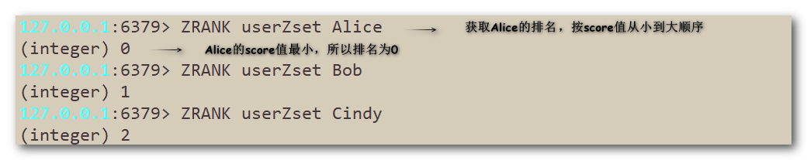

**`ZREVRANK key member`**：返回有序集 `key` 中指定成员 `member` 的排名。*从大到小*

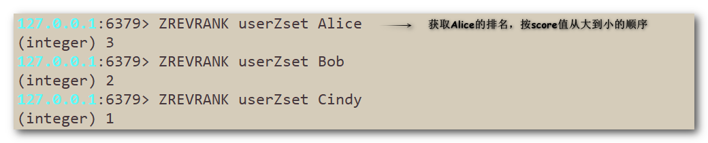

------


#### ZREM

**`ZREM key member [member ...]`**：移除有序集key中一个或多个成员，不存在的成员将被忽略。

> 当key不存在时返回0；当key存在但不是有序集时返回一个错误。
>
> 移除成功返回移除成员的数量。

```sh
127.0.0.1:6379> ZADD testZset 10 A 20 B 30 C 40 D 50 E
(integer) 5
127.0.0.1:6379> ZREM testZset C D E		# 移除三个成员
(integer) 3		# 移除成功返回3
```

------


#### ZINCRBY

**`ZINCRBY key increment member`**：为有序集 `key` 的成员 `member` 的 `score` 值加上增量 `increment` 

> 可以通过传递一个负数值  ，让 `score` 减去相应的值，比如 `ZINCRBY key -5 member` ，就是让 `member` 的 `score` 值减去 `5` 。
>
> **返回值**：返回`member` 成员的新 `score` 值，以字符串形式表示。
> 当 `key` 不是有序集类型时，返回一个错误。
> 当 `key` 不存在，或 `member` 不是 `key` 的成员时， `ZINCRBY key increment member` 等同于 `ZADD key increment member` 。
>
> `score` 值可以是整数值或双精度浮点数。

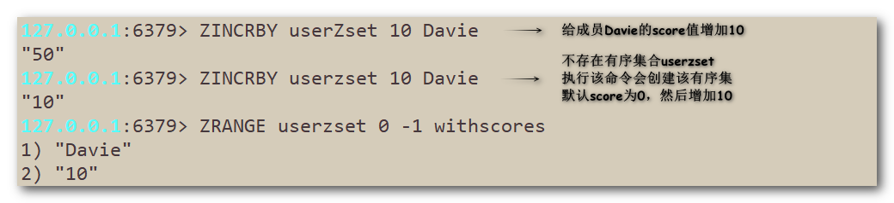

------


#### ZPOPMAX和ZPOPMIN

**`ZPOPMAX key [count]`**：删除并返回有序集`key`中`score`值最大的一个[或多个]成员。

**`ZPOPMIN key [count]`**：删除并返回有序集`key`中`score`值最小的一个[或多个]成员。

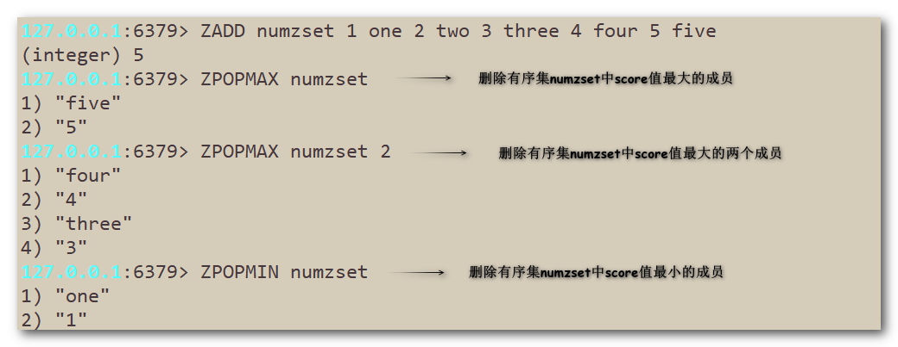

------


#### ZMPOP

**`ZMPOP numkeys key [key ...] <MIN | MAX> [COUNT count] `**：从所提供的键名列表中的第一个非空排序集中弹出一个[或多个]元素，这些元素是成员分数对。

> 这个指令就是ZPOPMAX和ZPOPMIN的升级版，可以对多个有序集合进行操作。

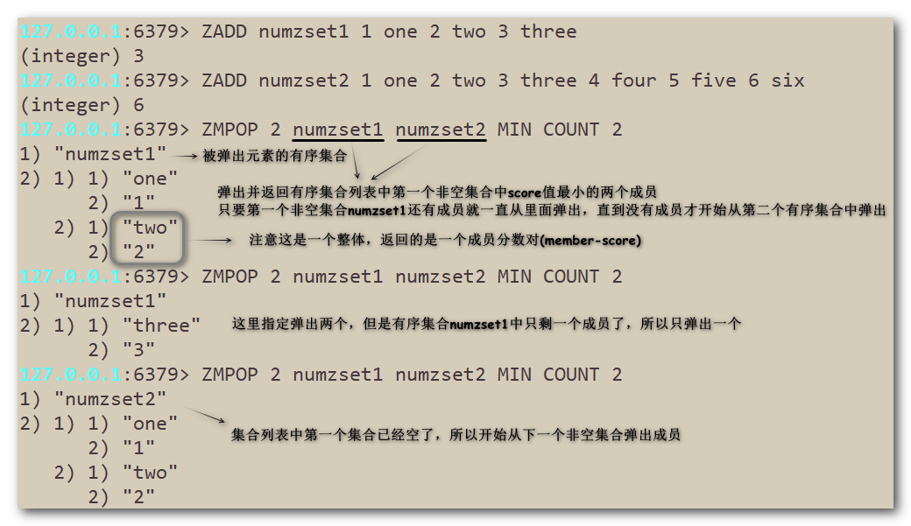

------


#### 集合运算

集合运算参考Set的集合运算，这里不再赘述。

> ZDIFF：求差集
> ZINTER：求交集
> ZUNION：求并集

------

------


### 六. Bitmap

> **位图**
>
> 用String类型作为底层数据结构实现的一种统计二值状态的数据类型。
>
> 位图本质是数组，该数组由多个二进制位组成，其值只能是1或0，默认0，每个二进制位都对应一个偏移量(我们称之为一个索引)。
>
> Bitmap支持的最大位数是2^32位，它可以极大的节约存储空间，使用512M内存就可以存储多达42.9亿的字节信息。
> (512*1024\*1024\*8=2^9\*2^10\*2^10\*2^3=2^32)
>
> 一个字节占有8位，若在一个bitmap类型的key中，偏移量(索引)为8的位置存入1，前面7位会默认设置为0，那么该key占用两个字节，因为偏移量为8的那一位属于第二个字节了。
>
> *==应用==* ：由于offset值得范围是[0,2^32-1]，这个数非常大，可以将<u>用户id和偏移量形成映射关系</u>来存储很多二值数据：
> 通常先将用户存储到哈希表中，通过field值来标识每一位用户，然后再将field值和偏移量形成映射关系，比如
> `HSET user 1 uid1001 2 uid1002` ：1代表uid1001，2代表uid1002
> `SETBIT sign:Monday 1 1`	偏移量1的位置值为1，偏移量1对应用户uid1001（1表示已签到，0表示未签到）
> `SETBIT sign:Monday 2 1`	偏移量2的位置值为1，偏移量2对应用户uid1002
> ......
> `SETBIT sign:Monday n 1`
> 再通过`BITCOUNT sign:Monday`就很容易获取Monday签到的用户数量了。

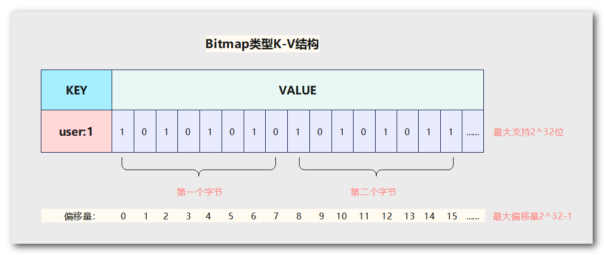

------


<u>***Bitmap结构的常用命令：***</u>

#### SETBIT

**`SETBIT key offset value`**：设置key的value(字符串)在offset处的bit值。

> offset：偏移量，从0开始，最大值2^32-1
>
> 返回值：在offset处原来的bit值。

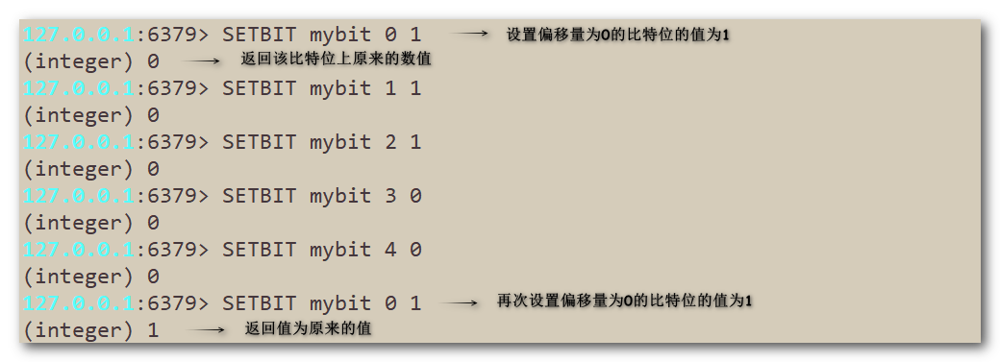

------


#### GETBIT

**`GETBIT key offset`**：返回key对应的value在offset处的bit值。

> 当offset超出了字符串长度的时候，超出的部分就被假定为由0比特填充的连续空间。
> 当key不存在的时候，它就认为是一个空字符串，所以offset总是超出范围，然后value也被认为是由0比特填充的连续空间。

```sh
127.0.0.1:6379> GETBIT mybit 2		# 获取offset为2的值
(integer) 1
127.0.0.1:6379> GETBIT mybit 100	# 获取offset为100的值，100已经超出了该字符串的长度，默认超出的比特位都是0
(integer) 0
127.0.0.1:6379> STRLEN mybit		# 获取mybit的长度(占用字节数)，因为只存储5位，不够一个字节，所以占用一个字节
(integer) 1
127.0.0.1:6379> SETBIT mybit 5 1
(integer) 0
127.0.0.1:6379> SETBIT mybit 6 0
(integer) 0
127.0.0.1:6379> SETBIT mybit 7 1
(integer) 0
127.0.0.1:6379> SETBIT mybit 8 1	# 偏移量8，属于第二个字节了，所以mybit的长度为2
(integer) 0
127.0.0.1:6379> STRLEN mybit
(integer) 2
```

------


#### BITCOUNT

**`BITCOUNT key [start end [byte|bit]]`**：统计value中比特位为1的个数。

> 可以指定特定的比特位区间或字节区间，只统计该区间上比特位为1的个数。
> byte表示一个字节为一个偏移量，bit表示一个位为一个偏移量。

```sh
127.0.0.1:6379> BITCOUNT mybit	# 统计整个字符串value中比特位为1的个数
(integer) 6
127.0.0.1:6379> BITCOUNT mybit 3 6 bit	# 统计比特位区间[3,6]中比特位为1的个数
(integer) 1
127.0.0.1:6379> BITCOUNT mybit 1 -1 byte	# 统计第二个字节及以后的字节中比特位为1的个数
(integer) 1
```

------


#### BITOP

**`BITOP operation destkey key [key ...]`**：对一个或多个保存二进制位的字符串key进行位运算，并将结果保存到destkey中。

> operation有四种操作：AND、OR、NOT、XOR
>
> - `BITOP AND destkey srckey1 srckey2 srckey3 ... srckeyN` ：对一个或多个 key 求按位与（同一列都为1则为1）
> - `BITOP OR destkey srckey1 srckey2 srckey3 ... srckeyN`：对一个或多个 key 求按位或（同一列有一个1即为1）
> - `BITOP XOR destkey srckey1 srckey2 srckey3 ... srckeyN`：对一个或多个 key 求按位异或（不同则为1）
> - `BITOP NOT destkey srckey`：对给定 key 求按位取反（1变0，0变1）
>
> 返回值：保存到destkey的字符串的长度（多少字节）

```sh
# 设置一个bitmap类型的bitmap1，存储1 0 1 0
127.0.0.1:6379> SETBIT bitmap1 0 1
(integer) 0
127.0.0.1:6379> SETBIT bitmap1 1 0
(integer) 0
127.0.0.1:6379> SETBIT bitmap1 2 1
(integer) 0
127.0.0.1:6379> SETBIT bitmap1 3 0
(integer) 0
# 设置一个bitmap类型的bitmap2，存储1 0 1 1
127.0.0.1:6379> SETBIT bitmap2 0 1
(integer) 0
127.0.0.1:6379> SETBIT bitmap2 1 0
(integer) 0
127.0.0.1:6379> SETBIT bitmap2 2 1
(integer) 0
127.0.0.1:6379> SETBIT bitmap2 3 1
(integer) 0

# 将这两个key做按位与运算，并将结果存到bitmap12中
127.0.0.1:6379> BITOP and bitmap12 bitmap1 bitmap2
(integer) 1		# 返回bitmap12的长度，1个字节
# 获取bitmap12的值
127.0.0.1:6379> GETBIT bitmap12 0	
(integer) 1
127.0.0.1:6379> GETBIT bitmap12 1
(integer) 0
127.0.0.1:6379> GETBIT bitmap12 2
(integer) 1
127.0.0.1:6379> GETBIT bitmap12 3
(integer) 0
可以看到得出的数是1 0 1 0

# 将bitmap1做按位取反运算
127.0.0.1:6379> BITOP not destkey1 bitmap1
(integer) 1
# 获取destkey1的值
127.0.0.1:6379> GETBIT destkey1 0
(integer) 0
127.0.0.1:6379> GETBIT destkey1 1
(integer) 1
127.0.0.1:6379> GETBIT destkey1 2
(integer) 0
127.0.0.1:6379> GETBIT destkey1 3
(integer) 1
可以看到取反后的数为0 1 0 1
```

------

------


### 七. HyperLogLog

> **基数统计**
>
> HyperLogLog是一种概率数据结构，用于计数唯一的事物(技术上这是指估计一个集合的基数)。
> (基数就是一个数据集中去除重复数据后总的个数)
>
> HyperLogLog的数据类型还是String。在Redis中的HyperLogLog，虽然技术上是不同的数据结构，但被编码为Redis字符串。
>
> 在Redis里面每个HyperLogLog键只需要花费12kb内存就可以统计接近2^64个不同元素的基数。
>
> HyperLogLog只会根据输入的元素来计算奇数，不会存储输入的元素本身，所以HyperLogLog不能像集合那样返回输入的元素。

------


<u>***HyperLogLog结构的常用命令：***</u>

#### PFADD

**`PFADD key element [element ...]`**：将元素element添加到HyperLogLog结构的key中。

> 如果 HyperLogLog 的内部被修改了,那么返回 1,否则返回 0 。
>
> 如果在调用该命令时仅提供变量名而不指定元素也是可以的，如果这个变量名存在，则不会有任何操作。如果不存在，则会创建一个数据结构（返回1）。

```shell
127.0.0.1:6379> PFADD hll a b c c d d f f g g	# 添加10个元素
(integer) 1		# 添加了10个元素，返回1
127.0.0.1:6379> PFADD hll a b c c d d f f g g	# 重复添加，HLL内部没有改变，返回0
(integer) 0
```

------


#### PFCOUNT

**`PFCOUNT key [key ...]`**：返回给定HyperLogLog结构的key的基数。

> 当参数为一个key时，返回存储在HyperLogLog结构体的该key的近似基数，如果该变量不存在，则返回0。
>
> 当参数为多个key时，返回这些HyperLogLog并集的近似基数，这个值是将所给定的所有key的HyperLoglog结构合并到一个临时的HyperLogLog结构中计算而得到的。

```sh
127.0.0.1:6379> PFADD hll a b c c d d f f g g
(integer) 0	
127.0.0.1:6379> PFCOUNT hll		# 统计hll的基数（去重统计）
(integer) 6
```

------


#### PFMERGE

**`PFMERGE destkey [sourcekey [sourcekey ...]]`**：将多个HyperLogLog合并成一个HyperLogLog。

> destkey是合并后的HyperLogLog结构。
>
> 这个命令可以用PFCOUNT命令实现。

```sh
127.0.0.1:6379> PFADD hll1 a a b b c c d e f	# 创建一个HyperLogLog结构的hll1
(integer) 1
127.0.0.1:6379> PFADD hll2 d e f g g h h i i	# 创建一个HyperLogLog结构的hll2
(integer) 1
127.0.0.1:6379> PFMERGE hll3 hll1 hll2			# 合并这两个HyperLogLog结构的key
OK
127.0.0.1:6379> PFCOUNT hll3					# 统计合并后HyperLogLog结构的hll3的基数
(integer) 9
127.0.0.1:6379> PFCOUNT hll1 hll2				# 直接统计hll1和hll2
(integer) 9
```

------

------


### 八. Geospatial

> **地理空间**
>
> Redis地理空间索引可以存储坐标并搜索它们。此数据结构用于在给定半径或包围框内查找附近点。
>
> Geopatial的数据类型是Zset，相当于由之前的`score`变成了`longitude`和`latitude`，可以使用Zset的命令对其进行操作。

------


<u>***Geospatial结构的常用命令：***</u>

#### GEOADD

**`GEOADD key [NX | XX] [CH] longitude latitude member [longitude latitude member ...]`**

> 将指定的地理空间项(经度、纬度、名称)添加到地理空间结构的key中。
>
> 数据以有序集的形式存储到键中，这样就可以使用GEOSEARCH命令查询项。
>
> 规定如下：
>
> - 有效的经度从-180度到180度。
> - 有效的纬度从-85.05112878度到85.05112878度。
>
> 当坐标位置超出上述指定范围时，该命令将会返回一个错误。

```sh
GEOADD city 116.403963 39.915119 "天安门" 116.403414 39.924091 "故宫" 116.024067 40.362639 "长城"
```

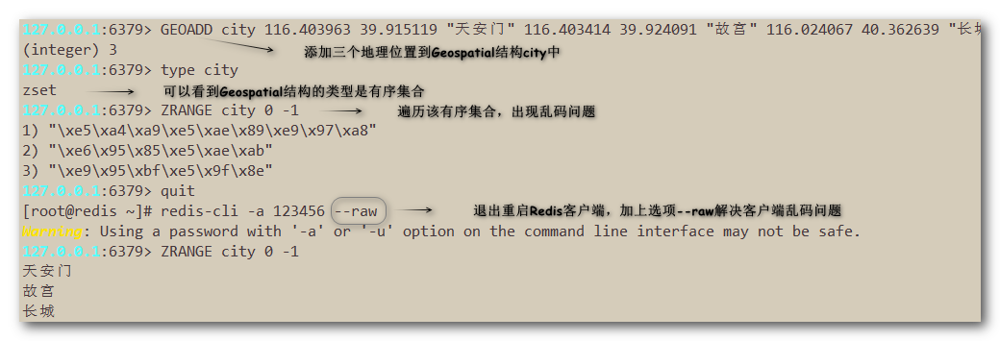

注意：使用--raw启动客户端后，返回数据的类型以及编号不会显示了

------


#### GEOPOS

**`GEOPOS key member [member ...]`**：从给定的key里返回所有指定member的位置(经度和纬度)，不存在的member返回nil。

> GEOPOS 命令返回一个数组， 数组中的每个项都由两个元素组成： 第一个元素为给定位置元素的经度， 而第二个元素则为给定位置元素的纬度。给定的位置元素不存在时， 对应的数组项为空值。

```sh
127.0.0.1:6379> GEOPOS city 天安门 故宫 长城
116.40396326780319214
39.91511970338637383
116.40341609716415405
39.92409008156928252
116.02406591176986694
40.36263993239462167
```

------


#### GEOHASH

**`GEOHASH key member [member ...]`**：获取一个或多个`member`的geohash值。

> 通常使用表示位置的元素使用不同的技术，使用Geohash位置52点整数编码。
> 由于编码和解码过程中所使用的初始最小和最大坐标不同，编码的编码也不同于标准。此命令返回一个标准的Geohash。

```sh
127.0.0.1:6379> GEOHASH city 天安门 故宫 长城
wx4g0f6f2v0
wx4g0gfqsj0
wx4t85y1kt0
```

------


#### GEODIST

**`GEODIST key member1 member2 [M | KM | FT | MI]`**：返回两个给定`member`之间的距离。

> 如果两个位置之间的其中一个不存在， 那么命令返回空值。
>
> - **m** 表示单位为米。
> - **km** 表示单位为千米。
> - **mi** 表示单位为英里。
> - **ft** 表示单位为英尺。
>
> 如果用户没有显式地指定单位参数， 那么 `GEODIST` 默认使用M作为单位。

```sh
127.0.0.1:6379> GEODIST city 天安门 长城
59338.9814		# 天安门距离长城59338.9814米
127.0.0.1:6379> GEODIST city 天安门 长城 km
59.3390			# 天安门距离长城59.3390千米
```

------


#### GEORADIUS

**`GEORADIUS key longitude latitude radius <M | KM | FT | MI> [WITHCOORD] [WITHDIST] [WITHHASH] `**
**`[COUNT count [ANY]] [ASC | DESC] [STORE key] [STOREDIST key]`**

> 以给定的经纬度为中心， 返回key包含的位置元素当中， 与中心的距离不超过给定最大距离的所有位置元素。
>
> radius：半径
>
> WITHDIST：在返回位置元素的同时， 将位置元素与中心之间的距离也一并返回。 距离的单位和用户给定的范围单位保持一致。
>
> WITHCOORD： 将位置元素的经度和维度也一并返回。
>
> WITHHASH：将geohash值一并返回。
>
> COUNT ：限定返回的记录数。
>
> ASC：由近到远返回（升序）
>
> DESC：由远到近返回（降序）

```sh
假设当前位置北京王府井(116.418017 39.914402)
# 由近到远排序
127.0.0.1:6379> GEORADIUS city 116.418017 39.914402 10 km withdist withcoord withhash count 10
天安门					  # member
1.2016					# 天安门距离北京王府井1.2km
4069885555089531		# geohash值
116.40396326780319214	# 经度值
39.91511970338637383	# 纬度值
故宫
1.6470					# 故宫距离北京王府井1.6km
4069885568908290
116.40341609716415405
39.92409008156928252
# 由远到近排序
127.0.0.1:6379> GEORADIUS city 116.418017 39.914402 10 km withdist withcoord withhash count 10 desc
故宫
1.6470
4069885568908290
116.40341609716415405
39.92409008156928252
天安门
1.2016
4069885555089531
116.40396326780319214
39.91511970338637383
# 将半径改为70km，这样长城也在范围内
127.0.0.1:6379> GEORADIUS city 116.418017 39.914402 70 km withdist withcoord withhash count 10 desc
长城
60.0642					# 长城距离北京王府井60km
4069895262981475
116.02406591176986694
40.36263993239462167
故宫
1.6470
4069885568908290
116.40341609716415405
39.92409008156928252
天安门
1.2016
4069885555089531
116.40396326780319214
39.91511970338637383
```

------


#### GEORADIUSBYMEMBER

**`GEORADIUSBYMEMBER key member radius <M | KM | FT | MI> [WITHCOORD] [WITHDIST] [WITHHASH] `**
**`[COUNT count [ANY]] [ASC | DESC] [STORE key] [STOREDIST key]`**

> 以给定的位置元素为中心点，找出位于指定范围内的元素。其他和GEORADIUS命令一样。

```sh
# 获取距离天安10km范围内的位置元素
127.0.0.1:6379> GEORADIUSBYMEMBER city 天安门 10 km withdist withcoord withhash count 10 desc
故宫
0.9988
4069885568908290
116.40341609716415405
39.92409008156928252
天安门
0.0000
4069885555089531
116.40396326780319214
39.91511970338637383
```

------

------


### 九. Stream

> **流**
>
> Redis流是一种数据结构（Stream类型），它的作用类似于只能追加的日志。您可以使用流来实时记录和同时聚合事件。
>
> Redis流用例示例包括:
>
> - 事件来源(例如，跟踪用户操作、点击等)
>
> - 传感器监测(例如，来自现场设备的读数)
>
> - 通知(例如，在单独的流中存储每个用户通知的记录)
>
> Redis为每个流消息生成一个唯一的ID，可以使用这些id检索它们关联的消息，或者读取和处理流中的所有后续消息。
>
> 四种和ID有关的特殊符号：
> `-`和`+`：当前流中最小ID和最大ID
> `$`：表示大于当前流中最大的id，用于新添加的消息
> `>`：用于XREANGROUP命令，表示迄今没有发送给组中使用者的信息，会更新消费者组的最后ID
> `*`：用于XADD命令中，表示让系统自动生成ID

Stream流就是Redis版的MQ消息中间件+阻塞队列，它能实现消息队列，它支持消息的持久化、支持自动生成全局唯一ID、支持ack确认消息的模式、支持消费组模式等，让消息队列更加的稳定和可靠。


> Message Content：消息内容
>
> Consumer group：消费组，通过XGROUP CREATE 命令创建，同一个消费组可以有多个消费者
>
> Last_delivered_id：游标，每个消费组会有个游标 last_delivered_id，任意一消费者读取了消息都会使游标 last_delivered_id 往前移动。
>
> Consumer：消费者，消费组中的消费者
>
> Pending_ids：消费者会有一个状态变量，用于记录被当前消费已读取但未ack的消息Id，如果客户端没有ack，这个变量里面的消息ID会越来越多，一旦某个消息被ack它就开始减少。这个pending_ids变量在Redis官方被称之为 PEL(Pending Entries List)，记录了当前已经被客户端读取的消息，但是还没有 ack (Acknowledge character：确认字符），它用来确保客户端至少消费了消息一次，而不会在网络传输的中途丢失了没处理

------


<u>***Stream类型的常用命令：***</u>

#### XADD

**`XADD key [NOMKSTREAM] [<MAXLEN | MINID> [= | ~] threshold
[LIMIT count]] <* | id> field value [field value ...] `**

> 将消息追加到指定流`key`的末尾，添加的消息ID要比上个消息的ID大。如果key不存在，将自动创建流key然后执行XADD操作。
>
> ID用于标识给定消息，如果指定的ID参数是字符`*`，`XADD`命令会自动生成一个唯一的ID。ID是由时间戳-序列号两部分组成，当自动生成ID时，第一部分是生成ID的Redis实例的毫秒格式的Unix时间。 第二部分是一个序列号，用来区分同一毫秒内生成的ID的。序列号是64位长度(18446744073709551615)，理论上在同一毫秒内生成的数据量无法到达这个级别，因此不用担心序列号会不够用。
>
> 该命令返回添加的消息的ID。如果ID参数传的是`*`，那么ID是自动生成的， 否则，命令仅返回用户在插入期间指定的相同的ID。
>
> 通常使用命令`XADD ID filed value [field value ...]`，其他的花里胡哨的参数了解即可。

```sh
127.0.0.1:6379> XADD mystream * name tom age 20	# 添加一条消息到mystream队列末尾，自动生成id
"1681002319038-0"	# 返回生成消息的id
127.0.0.1:6379> XADD mystream 1681002319038-0 name tom age 20	# 如果添加消息的id不比上一消息id大，则报错
(error) ERR The ID specified in XADD is equal or smaller than the target stream top item
127.0.0.1:6379> XADD mystream 1681002319038-1 name tom age 20	# 比上一消息id大，添加成功，返回添加消息的id
"1681002319038-1"
127.0.0.1:6379> 
```

------


#### XRANGE

**`XRANGE key start end [COUNT count]`**：返回给定id范围内流key的消息。

> id范围由[start,end]指定。特殊ID：`-` 表示流中最小的消息id，`+`表示流中最大的消息id。
>
> 返回的消息由id从小到大排序。

```sh
127.0.0.1:6379> XADD mystream * name Alice age 20
"1681003546319-0"
127.0.0.1:6379> XADD mystream * name Bob age 21
"1681003556153-0"
127.0.0.1:6379> XADD mystream * name Cindy age 22
"1681003570177-0"
127.0.0.1:6379> XADD mystream * name Davie age 23
"1681003595504-0"
127.0.0.1:6379> XRANGE mystream - +		# - + 表示返回流mystream中所有的消息，且根据id从小到大排序
1) 1) "1681003546319-0"
   2) 1) "name"
      2) "Alice"
      3) "age"
      4) "20"
2) 1) "1681003556153-0"
   2) 1) "name"
      2) "Bob"
      3) "age"
      4) "21"
3) 1) "1681003570177-0"
   2) 1) "name"
      2) "Cindy"
      3) "age"
      4) "22"
4) 1) "1681003595504-0"
   2) 1) "name"
      2) "Davie"
      3) "age"
      4) "23"
127.0.0.1:6379> XRANGE mystream - + count 2		# 限制返回两个
1) 1) "1681003546319-0"
   2) 1) "name"
      2) "Alice"
      3) "age"
      4) "20"
2) 1) "1681003556153-0"
   2) 1) "name"
      2) "Bob"
      3) "age"
      4) "21"
```

------


#### XREVRANGE

**`XREVRANGE key end start [COUNT count]`**：返回给定id范围内流key的消息。

> 在`XREVRANGE`中，要先指定结束ID，再指定开始ID，返回消息的顺序是根据id从大到小排序。其余和XRANGE一样。

```sh
127.0.0.1:6379> XREVRANGE mystream + -
1) 1) "1681003595504-0"
   2) 1) "name"
      2) "Davie"
      3) "age"
      4) "23"
2) 1) "1681003570177-0"
   2) 1) "name"
      2) "Cindy"
      3) "age"
      4) "22"
3) 1) "1681003556153-0"
   2) 1) "name"
      2) "Bob"
      3) "age"
      4) "21"
4) 1) "1681003546319-0"
   2) 1) "name"
      2) "Alice"
      3) "age"
      4) "20"
127.0.0.1:6379> XREVRANGE mystream + - count 2
1) 1) "1681003595504-0"
   2) 1) "name"
      2) "Davie"
      3) "age"
      4) "23"
2) 1) "1681003570177-0"
   2) 1) "name"
      2) "Cindy"
      3) "age"
      4) "22"
```

------


#### XDEL

**`XDEL key id [id ...]`**：从流key中删除指定id(消息)。

```sh
127.0.0.1:6379> XDEL mystream 1681003595504-0 1681003556153-0	# 删除Bob和Davie对应的id
(integer) 2		# 成功删除两个
127.0.0.1:6379> XRANGE mystream - +
1) 1) "1681003546319-0"
   2) 1) "name"
      2) "Alice"
      3) "age"
      4) "20"
2) 1) "1681003570177-0"
   2) 1) "name"
      2) "Cindy"
      3) "age"
      4) "22"
```

------


#### XLEN

**`XLEN mystream`**：返回流key中消息的条数。

```sh
127.0.0.1:6379> XLEN mystream	# 流mystream中有两条消息
(integer) 2
```

------


#### XTRIM

**`XTRIM key <MAXLEN | MINID> [= | ~] threshold [LIMIT count]`**：将流消息裁剪为指定数量的消息。

> MAXLEN：表示允许最大的消息长度(个数)，超过此数量会优先删除id较小的消息。
>
> MINID：表示允许最小的id，比此id还小的消息会被删除。
>
> 返回值：删除消息的数量。

```sh
# 创建五条消息存入流mystream中
127.0.0.1:6379> XADD mystream 1681006080120-0 name Alice age 18
"1681006080120-0"
127.0.0.1:6379> XADD mystream 1681006080120-1 name Bob age 19
"1681006080120-1"
127.0.0.1:6379> XADD mystream 1681006080120-2 name Cindy age 20
"1681006080120-2"
127.0.0.1:6379> XADD mystream 1681006080120-3 name Davie age 21
"1681006080120-3"
127.0.0.1:6379> XADD mystream 1681006080120-4 name Eric age 22
"1681006080120-4"
127.0.0.1:6379> XTRIM mystream maxlen 3		# 获取最近的3条消息，id较小的被删除（id是递增的）
(integer) 2
127.0.0.1:6379> XRANGE mystream - +
1) 1) "1681006080120-2"
   2) 1) "name"
      2) "Cindy"
      3) "age"
      4) "20"
2) 1) "1681006080120-3"
   2) 1) "name"
      2) "Davie"
      3) "age"
      4) "21"
3) 1) "1681006080120-4"
   2) 1) "name"
      2) "Eric"
      3) "age"
      4) "22"	
127.0.0.1:6379> XTRIM mystream minid 1681006080120-3	# 获取id不小于1681006080120-3的消息
(integer) 1
127.0.0.1:6379> XRANGE mystream - +
1) 1) "1681006080120-3"
   2) 1) "name"
      2) "Davie"
      3) "age"
      4) "21"
2) 1) "1681006080120-4"
   2) 1) "name"
      2) "Eric"
      3) "age"
      4) "22"
```

------


#### XREAD

**`XREAD [COUNT count] [BLOCK milliseconds] STREAMS key [key ...] id  [id ...]`**

> 从一个或者多个流中读取数据，仅返回id大于对应流中最大id的消息（也就是新添加的消息）。
>
> count：最多读取多少条
>
> block：是否以阻塞的方式读取，如果开启且milliseconds设为0，表示永远阻塞直到读取到消息。
>
> id：表示读取ID大于指定id的消息。
>
> 特殊ID：符号`$`。表示以当前Stream已经存储的最大的ID作为最后一个ID，当前Stream中不存在大于当前最大ID的消息，因此此时返回nil。一般用于阻塞队列获取新消息。

```sh
# 数据准备，创建两个流stream1和stream2
127.0.0.1:6379> XADD stream1 1681006080120-0 name Alice
"1681006080120-0"
127.0.0.1:6379> XADD stream1 1681006080120-1 name Bob
"1681006080120-1"
127.0.0.1:6379> XADD stream1 1681006080120-2 name Cindy
"1681006080120-2"
127.0.0.1:6379> XADD stream1 1681006080120-3 name Davie
"1681006080120-3"
127.0.0.1:6379> XADD stream1 1681006080120-4 name Eric
"1681006080120-4"
127.0.0.1:6379> XADD stream2 1681008731850-0 1 one
"1681008731850-0"
127.0.0.1:6379> XADD stream2 1681008731850-1 2 two
"1681008731850-1"
127.0.0.1:6379> XADD stream2 1681008731850-2 3 three
"1681008731850-2"
127.0.0.1:6379> XADD stream2 1681008731850-3 4 four
"1681008731850-3"
127.0.0.1:6379> XADD stream2 1681008731850-4 5 five
"1681008731850-4"
127.0.0.1:6379> XADD stream2 1681008731850-5 6 six
"1681008731850-5"

127.0.0.1:6379> XREAD count 3 streams stream1 0-0	# count 3表示只获取3个，0-0表示从最小的ID开始获取Stream中的消息
1) 1) "stream1"
   2) 1) 1) "1681006080120-0"
         2) 1) "name"
            2) "Alice"
      2) 1) "1681006080120-1"
         2) 1) "name"
            2) "Bob"
      3) 1) "1681006080120-2"
         2) 1) "name"
            2) "Cindy"
            
127.0.0.1:6379> XREAD count 3 streams stream1 0		# 使用0也可以表示从最小的ID开始获取Stream中的消息，000也可以
1) 1) "stream1"
   2) 1) 1) "1681006080120-0"
         2) 1) "name"
            2) "Alice"
      2) 1) "1681006080120-1"
         2) 1) "name"
            2) "Bob"
      3) 1) "1681006080120-2"
         2) 1) "name"
            2) "Cindy"
            
127.0.0.1:6379> XREAD count 3 streams stream1 $		# $表示读取大于当前流中最大的id的消息
(nil)


# 读取stream1中id大于1681006080120-2的三条消息，读取stream2中id大于1681008731850-3的三条消息
127.0.0.1:6379> XREAD count 3 block 0 streams stream1 stream2 1681006080120-2 1681008731850-3
1) 1) "stream1"					# 读取到了stream1中id大于1681006080120-2的3条消息（如果有多条则读取最新的消息）
   2) 1) 1) "1681006080120-3"
         2) 1) "name"
            2) "Davie"
      2) 1) "1681006080120-4"
         2) 1) "name"
            2) "Eric"
      3) 1) "1681008731850-0"
         2) 1) "name"
            2) "Jack"
2) 1) "stream2"					# stream2中有两条id大于1681008731850-3的消息
   2) 1) 1) "1681008731850-4"
         2) 1) "5"
            2) "five"
      2) 1) "1681008731850-5"
         2) 1) "6"
            2) "six"


# 加入阻塞选项，此时开启另一个redis客户端存入消息到stream1中，观察当前客户端的变化
127.0.0.1:6379> XREAD count 3 block 0 streams stream1 $
1) 1) "stream1"
   2) 1) 1) "1681008731850-0"	# 读取到了一条消息
         2) 1) "name"
            2) "Jack"
(53.24s)	# 等待了53.24s

```

------


***消费组相关指令***

#### XGROUP

**`XGROUP CREATE key group <id | $> `**：创建消费者组。

> 最后一个参数是要考虑已传递的流中最后一项的ID。
>
> $表示从Stream尾部开始消费，在这种情况下，从该消费者组获取数据的消费者只能看到到达流的新元素。
>
> 0表示从Stream头部开始消费，消费者组可以获取整个流的历史记录。
>
> 创建消费者组的时候必须指定 ID, ID 为 0 表示从头开始消费，为 $ 表示只消费新的消息。

```sh
# 创建消费者组
127.0.0.1:6379> XGROUP create mystream1 groupA $
OK
127.0.0.1:6379> XGROUP create mystream1 groupB 0
OK
```

**`XGROUP CREATECONSUMER key group consumer`**：创建消费者。

```sh
127.0.0.1:6379> XGROUP CREATECONSUMER mystream1 groupA consumerA	#在流mystream1的groupA中创建消费者consumerA
(integer) 1
127.0.0.1:6379> XINFO CONSUMERS mystream1 groupA	# 查看流mystream1的消费组groupA的消费者信息
1) 1) "name"
   2) "consumerA"	# 消费者名称
   3) "pending"		
   4) (integer) 0	# 消费者读取消息的数量（此时还未读取消息，所以为0）
   5) "idle"
   6) (integer) 26277
```

**`XGROUP DESTORY key group`**：删除流key中指定的消费组。

```sh
127.0.0.1:6379> XGROUP create mystream1 groupC 0	# 在流stream1中创建消费组groupC
OK
# 删除消费组
127.0.0.1:6379> XGROUP DESTROY mystream1 groupC	# 删除流stream1中的消费组groupC
(integer) 1		# 返回删除的个数
```

**`XGROUP DELCONSUMER key group consumer`**：删除流key中消费组group的指定消费者。

```sh
127.0.0.1:6379> XGROUP CREATECONSUMER mystream1 groupA consumerA
(integer) 1
127.0.0.1:6379> XGROUP DELCONSUMER mystream1 groupA consumerA
(integer) 0		
127.0.0.1:6379> XINFO CONSUMERS mystream1 groupA
(empty array)	# 消费者consumerA已经被删除
```


------


#### XREADGROUP

**`XREADGROUP GROUP group consumer [COUNT count] [BLOCK milliseconds]
[NOACK] STREAMS key [key ...] id [id ...]`**

> 读取消费者组中的消息。
>
> 消费者不存在则自动创建该消费者。
>
> 特殊ID：`>`表示从第一条未被消费的消息开始读取。

```sh
# 创建消费组
127.0.0.1:6379> XGROUP create stream1 groupA 0
ok
127.0.0.1:6379> XGROUP create stream1 groupB 0
OK

# 消费组groupA内的消费者consumer1从stream1消息队列中读取所有信息
127.0.0.1:6379> XREADGROUP GROUP groupA consumer1 STREAMS stream1  >	# >表示从第一条未被消费的消息开始读取。
1) 1) "stream1"
   2) 1) 1) "1681006080120-0"
         2) 1) "name"
            2) "Alice"
      2) 1) "1681006080120-1"
         2) 1) "name"
            2) "Bob"
      3) 1) "1681006080120-2"
         2) 1) "name"
            2) "Cindy"
      4) 1) "1681006080120-3"
         2) 1) "name"
            2) "Davie"
      5) 1) "1681006080120-4"
         2) 1) "name"
            2) "Eric"
      6) 1) "1681008731850-0"
         2) 1) "name"
            2) "Jack"
# 消费组groupA中消费者consumer1一口气读取完所有消息，组中其他消费者就不能读取消息了（同一个消费组里的消费者不能消费同一条消息）
127.0.0.1:6379> XREADGROUP GROUP groupA consumer2 STREAMS stream1  >	
(nil)	# 已经被消费者cumstomer1消费完了，所以返回nil


# 创建消费组
127.0.0.1:6379> XGROUP create stream2 groupA 0
OK
127.0.0.1:6379> XGROUP create stream2 groupB 0
OK
# 让组内的多个消费者共同分担读取消息，所以让每个消费者读取部分消息，从而实现消息读取负载在多个消费者间是均衡分布的
127.0.0.1:6379> XREADGROUP GROUP groupA consumer1 count 3 STREAMS stream2 >		# 限制读取3个
1) 1) "stream2"
   2) 1) 1) "1681008731850-0"
         2) 1) "1"
            2) "one"
      2) 1) "1681008731850-1"
         2) 1) "2"
            2) "two"
      3) 1) "1681008731850-2"
         2) 1) "3"
            2) "three"
127.0.0.1:6379> XREADGROUP GROUP groupA consumer2 count 3 STREAMS stream2 >		# 读取另外三个
1) 1) "stream2"
   2) 1) 1) "1681008731850-3"
         2) 1) "4"
            2) "four"
      2) 1) "1681008731850-4"
         2) 1) "5"
            2) "five"
      3) 1) "1681008731850-5"
         2) 1) "6"
            2) "six"
127.0.0.1:6379> XREADGROUP GROUP groupA consumer3 count 3 STREAMS stream2 >
(nil)		# 已经没有消息可读，返回nil
```

------


#### XPENDING

**`XPENDING key group`**：返回待处理消息相关信息。（读取到的消息没有经过XACK确认即为待处理消息）

> 返回一组数据，包括消费组待处理消息的数量、所有消费者读取的消息最小id、所有消费者所读取id的最大值、每个消费者待处理消息的数量。

```sh
127.0.0.1:6379> XPENDING stream1 groupA
1) (integer) 6			# 待处理消息数
2) "1681006080120-0"	# 待处理消息最小id
3) "1681008731850-0"	# 待处理消息最小id
4) 1) 1) "consumer1"	# 消费者consumer1
      2) "6"			# 消费者consumer1有6条待处理消息
127.0.0.1:6379> XPENDING stream2 groupA
1) (integer) 6			# 待处理消息数
2) "1681008731850-0"	# 待处理消息最小id
3) "1681008731850-5"	# 待处理消息最小id
4) 1) 1) "consumer1"	# 消费者consumer1
      2) "3"			# 消费者consumer1有3条待处理消息
   2) 1) "consumer2"	# 消费者consumer2
      2) "3"			# 消费者consumer2有3条待处理消息
```

**`XPENDING key group start end count consumer`**：查看指定消费者具体读取了哪些数据

```sh
# 查看消费者consumer1具体读取了哪些数据
127.0.0.1:6379> XPENDING stream2 groupA - + 5 consumer1	# 查看groupA组consumer1具体读取了哪些数据，设置最大返回5条
1) 1) "1681008731850-0"
   2) "consumer1"
   3) (integer) 2089450
   4) (integer) 1
2) 1) "1681008731850-1"
   2) "consumer1"
   3) (integer) 2089450
   4) (integer) 1
3) 1) "1681008731850-2"
   2) "consumer1"
   3) (integer) 2089450
   4) (integer) 1
```

------


#### XACK

**`XACK key group id [id ...]`**：向消息队列确认id对应的消息已处理完成，XACK会从待处理消息列表中删除该消息。

> 返回值：该命令返回成功确认的消息数。

```sh
127.0.0.1:6379> XACK stream1 groupA 1681006080120-0	# 确认id1681006080120-0处理完成
(integer) 1		# 成功确认一条
127.0.0.1:6379> XPENDING stream1 groupA
1) (integer) 5	# 待确认消息数减1
2) "1681006080120-1"
3) "1681008731850-0"
4) 1) 1) "consumer1"
      2) "5"
```

------


#### XINFO

**`XINFO stream key`**：获取流key的详细信息。

```sh
127.0.0.1:6379> XINFO stream stream2 	# 获取流stream2的详细信息
 1) "length"
 2) (integer) 6
 3) "radix-tree-keys"
 4) (integer) 1
 5) "radix-tree-nodes"
 6) (integer) 2
 7) "last-generated-id"
 8) "1681008731850-5"
 9) "max-deleted-entry-id"
10) "0-0"
11) "entries-added"
12) (integer) 6
13) "recorded-first-entry-id"
14) "1681008731850-0"
15) "groups"
16) (integer) 2
17) "first-entry"
18) 1) "1681008731850-0"
    2) 1) "1"
       2) "one"
19) "last-entry"
20) 1) "1681008731850-5"
    2) 1) "6"
       2) "six"
      
```

**`XINFO GROUPS key`**：获取流key中消费组信息

```sh
127.0.0.1:6379> XINFO GROUPS stream2	# 获取流stream2中的消费组信息
1)  1) "name"
    2) "groupA"		# 消费组groupA
    3) "consumers"
    4) (integer) 2
    5) "pending"
    6) (integer) 6
    7) "last-delivered-id"
    8) "1681008731850-5"
    9) "entries-read"
   10) (integer) 6
   11) "lag"
   12) (integer) 0
2)  1) "name"
    2) "groupB"		# 消费组groupB
    3) "consumers"
    4) (integer) 1
    5) "pending"
    6) (integer) 3
    7) "last-delivered-id"
    8) "1681008731850-2"
    9) "entries-read"
   10) (integer) 3
   11) "lag"
   12) (integer) 3
```

**`XINFO CONSUMERS key group`**：获取流key中消费组group中消费者信息

```sh
127.0.0.1:6379> XINFO CONSUMERS stream2 groupA	# 获取流stream2中消费组groupA中的消费者信息
1) 1) "name"
   2) "consumer1"
   3) "pending"
   4) (integer) 3
   5) "idle"
   6) (integer) 30195569
2) 1) "name"
   2) "consumer2"
   3) "pending"
   4) (integer) 3
   5) "idle"
   6) (integer) 30166362
```


------

------


### 十. Bitfield

> **位域**
>
> Bitfield结构的底层也是String类型。
>
> Redis位字段允许设置、递增和获取任意位长度的整数值。例如可以对从无符号1位整数到有符号63位整数的任何数字进行操作。
>
> 这些值使用二进制编码的Redis字符串存储。位字段支持原子读、写和递增操作，这使它们成为管理计数器和类似数值的好选择。
>
> 例如 hello 等价于 0110100001100101011011000110110001101111，每八位对应一个字母，也对应一个十进制值。可以修改每一位的数字从而改变对应的数值从而改变对应的字母。

------


<u>***Bitfield结构的常用命令：***</u>

#### BITFIELD

**`BITFIELD key [GET type offset] [SET type offset value] [INCRBY type offset increment] `**
**`[OVERFLOW WRAP|SAT|FAIL]`**

> 此命令会把Redis字符串当作位数组，并能对变长位宽和任意未字节对齐的指定整型位域进行寻址。
>
> 下面是已支持的命令列表：
>
> - GET <type> <offset> ：返回指定的位域的数值。
> - SET <type> <offset> <value> ： 设置指定位域的数值并返回它的原值。
> - INCRBY <type> <offset> <increment> ： 自增或自减（如果increment为负数）指定位域的值并返回它的新值。
>
> type表示多少位的有符号还是无符号整型。有符号整型需在位数前加`i`，无符号在位数前加`u`。例如，`u8`是一个8位的无符号整型，`i16`是一个16位的有符号整型。offset表示偏移量，比如i4表示以4个比特位为一个偏移量。
>
> 还有一个命令通过设置溢出行为来改变调用`INCRBY`指令的后序操作：OVERFLOW [WRAP|SAT|FAIL]
> wrap：使用回环方式处理有符号整数和无符号整数的溢出情况。
> sat：使用饱和计算方式处理溢出，下溢计算的结果为最小的整数值，上溢计算的结果为最大的整数值。
> fail：命令将拒绝执行那些会导致上溢或者下溢情况出现的计算，并向用户返回空值表示计算未被执行。
>
> 有符号整型最大支持64位，而无符号整型最大支持63位。对无符号整型的限制，是由于当前Redis协议不能在响应消息中返回64位无符号整数。

| 字母 | 数值 | 二进制（高位->低位） |
| :--: | :--: | :------------------: |
|  h   | 104  |      0110 1000       |
|  e   | 101  |      0110 0101       |
|  l   | 108  |      0110 1100       |
|  l   | 108  |      0110 1100       |
|  o   | 111  |      0110 1111       |
|  x   | 120  |      0111 1000       |

- **GET和SET选项**

```sh
127.0.0.1:6379> set mybitfield hello
OK
127.0.0.1:6379> BITFIELD mybitfield get i8 0	# 以8位位一组，偏移量0表示第一个字符
1) (integer) 104	# 返回该字符对应的十进制值数值
127.0.0.1:6379> BITFIELD mybitfield get i8 8	# 偏移量8表示第二个字符
1) (integer) 101
127.0.0.1:6379> BITFIELD mybitfield get i8 16
1) (integer) 108
127.0.0.1:6379> BITFIELD mybitfield get i8 24
1) (integer) 108
127.0.0.1:6379> BITFIELD mybitfield get i8 32
1) (integer) 111
127.0.0.1:6379> BITFIELD mybitfield set i8 32 120	#将偏移量为32的那一组的数值替换为120(字母x)
1) (integer) 111
127.0.0.1:6379> get mybitfield
hellx
```

- **INCRBY选项**

```sh
127.0.0.1:6379> set fieldkey hello
OK
127.0.0.1:6379> BITFIELD fieldkey incrby u4 2 1	# 从第三个比特位开始，对接下来的4位无符号数加1
1) (integer) 11		# 返回指定域增加后的数值
127.0.0.1:6379> get fieldkey	# 因为比特位的数值发生了变化，所以对应的数值也会发生变化，对应的字母也就变了
lello
127.0.0.1:6379> BITFIELD fieldkey incrby u4 2 1
1) (integer) 12
127.0.0.1:6379> BITFIELD fieldkey incrby u4 2 1
1) (integer) 13
127.0.0.1:6379> BITFIELD fieldkey incrby u4 2 1
1) (integer) 14
127.0.0.1:6379> BITFIELD fieldkey incrby u4 2 1
1) (integer) 15
127.0.0.1:6379> BITFIELD fieldkey incrby u4 2 1	# 4位表示最大的数为15，溢出控制默认为wrap（循环溢出），超出后从0开始
1) (integer) 0	# 从0开始
```

- **OVERFLOW选项**

```sh
127.0.0.1:6379> set fieldkey2 a
OK
127.0.0.1:6379> BITFIELD fieldkey2 overflow sat set i8 0 126	# 从偏移量0开始后八位对应的数值改为126
1) (integer) 97		# 返回之前的数值
127.0.0.1:6379> get fieldkey2
"~"					# 126对应这个~符号
127.0.0.1:6379> BITFIELD fieldkey2 overflow sat set i8 0 128	# 将数值改为128（超出了8位表示的最大值127）
1) (integer) 126	# 返回之前的数值
127.0.0.1:6379> get fieldkey2
"\x7f"				# 127对应的编码
127.0.0.1:6379> BITFIELD fieldkey2 overflow sat set i8 0 128	# 再次改为128
1) (integer) 127	# 使用sat溢出控制，超出了最大值的表示范围会取最大值127
127.0.0.1:6379> BITFIELD fieldkey2 overflow fail set i8 0 128	# 使用fail溢出控制，再次改为128
1) (nil)			# 使用fail溢出控制，超出了最大值的表示范围返回nil
```

