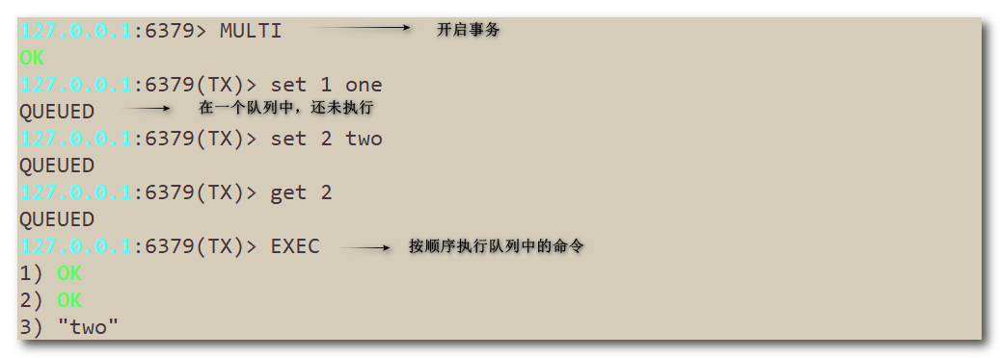
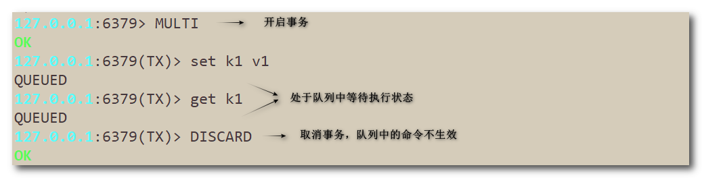
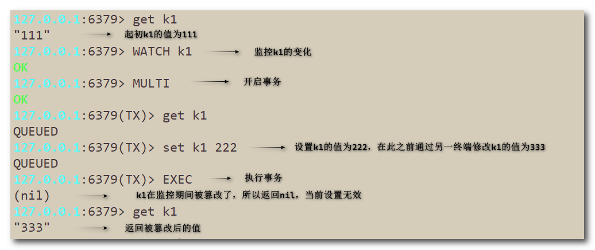
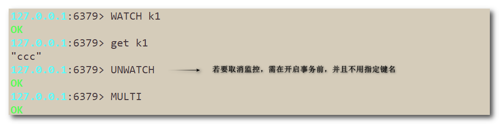
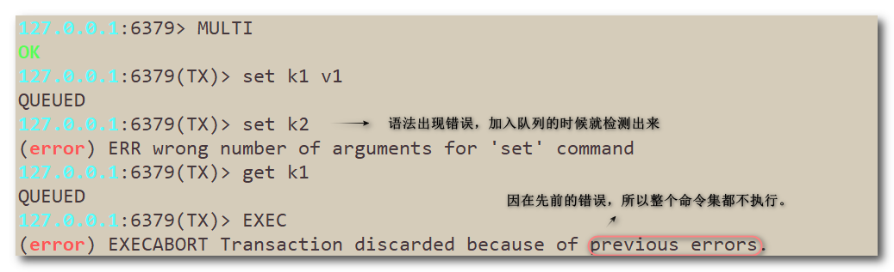
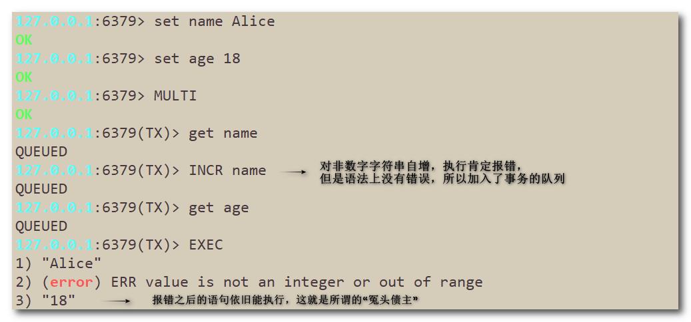

## Redis事务

Redis 事务（Transaction）是一组 Redis 命令的集合，这些命令被当作一个整体，按顺序地串行化执行，而不会被其他命令插入。

Redis 事务使用 MULTI、EXEC、WATCH、DISCARD 和 UNWATCH 这些命令来实现。

------

### 1. Redis事务特性

- 单独的隔离操作：事务中的所有命令都会序列化、按顺序地执行。事务在执行的过程中，不会被其他客户端发送来的命令请求所打断。
- 不保证原子性：Redis的事务不保证原子性，也就是不保证所有指令同时成功或同时失败，只有决定是否开始执行全部指令的能力，没有执行到一半进行回滚的能力。
- 排他性：Redis会保证一个事务内的命令依次执行，不会被其他命令插入。

### 2. Redis事务命令

> `MULTI`：开启事务
>
> `EXEC`：执行事务
>
> `DISCARD`：取消事务
>
> `WATCH key [key ...]`：监控指定的key
>
> `UNWATCH `：取消监控。

#### MULTI

> 标记一个事务块的开始。执行的命令都会放到一个队列中，通过EXEC命令统一执行。

#### EXEC

> 执行事务队列中的命令。

#### DISCARD

> 放弃事务。在开启了事务后，若不想执行命令了，可以通过DISCARD命令来取消事务。

#### WATCH

> 监控指定的key的变化，要先开启监控，再开启事务。若监控的数据被篡改了，则事务中无法再对其修改，会返回nil。
>
> 执行完EXEC命令后，之前加的监控都会失效。
>
> redis使用watch来提供乐观锁，类似于CAS(Check and Set)。
>
> 乐观锁(Optimistic Lock)， 顾名思义就是很乐观，每次去拿数据的时候都认为别人不会修改，所以不会上锁，但是在更新的时候会判断一下在此期间别人有没有去更新这个数据。如果有则取消当前操作让他人操作生效。乐观锁策略：提交版本要比当前记录版本高。
>
> 悲观锁(Pessimistic Lock), 顾名思义，就是很悲观，每次去拿数据的时候都认为别人会修改，所以每次在拿数据的时候都会上锁，这样别人想拿这个数据就会block直到它拿到锁。

#### UNWATCH

> 取消监控。在对某个key监控后，已经发现了它被篡改过了，可以使用unwatch命令取消对该key的监控。

### 3. 不保证原子性

#### ”全体连坐“

> 要么都执行，要么都不执行。

#### “冤头债主”

> 错误的命令报错归报错，正确的命令依旧执行，即使在错误命令之后也会执行。

### 4. 事务执行流程

​	（1）开启：以MULTI命令开启一个事务

​	（2）入队：将多个命令假如到事务队列中，接到这些命令并不会立即执行。

​	（3）执行：由EXEC命令执行事务队列中的命令。
