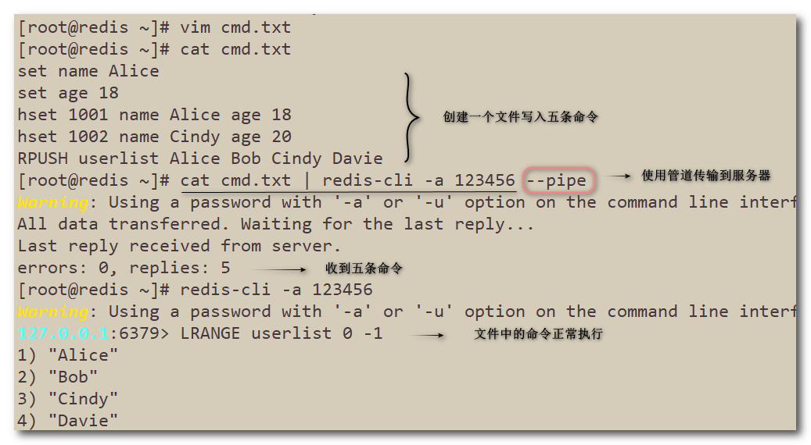

## Redis管道

Redis 管道（Pipeline）是一种在客户端和 Redis 服务器之间建立的双向通道，它可以让客户端在一次请求中发送多个命令并一次性接收多个命令的响应结果。通过使用 Redis 管道，客户端可以减少网络通信的次数，从而提高 Redis 的吞吐量和性能。

在传统的 Redis 操作中，每个命令都需要通过网络发送到 Redis 服务器，然后等待 Redis 服务器返回响应结果后再进行下一个命令的操作，这样就会产生大量的网络通信开销。而使用 Redis 管道，客户端可以将多个命令一次性发送到 Redis 服务器，然后一次性接收所有命令的响应结果，从而减少网络通信的次数和开销。

------

### 1. pipeline的使用

> 首先创建一个文件，写入需要执行的命令集。
> 在Linux终端使用`cat cmd.txt | redis-cli -a 123456 --pipe`命令将命令集传输到服务器。
> (管道符”|“表示将前面命令的结果集作为参数传输给后面的命令)

### 2. Pipeline小总结

- Pipeline与原生批量命令对比：
  - 原生批量命令（例如mset、mget）具有原子性，pipeline是非原子性。
  - 原生批量命令一次只能执行一种命令，pipeline支持批量执行不同命令。
  - 原生批命令是redis服务端实现，而pipeline需要redis服务端和客户端共同完成。
- Pipeline与事务对比：
  - 事务具有原子性，管道不具有原子性。
  - 管道一次性将命令发送给服务器，事务是一条一条的发，事务只有在接收到EXEC命令后才会执行。
  - 执行事务时会阻塞其他命令的执行，而执行管道中的命令不会。
- 使用Pipeline注意事项：
  - pipeline缓冲的指令只是会依次执行，不保证原子性，如果执行中指令发生异常，还会继续执行后续的指令。
  - 使用pipeline传输的命令也不能太多，如果数据量大客户端的阻塞时间可能会过久，同时服务端此时也被迫回复一个队列答复，占用很多内存。