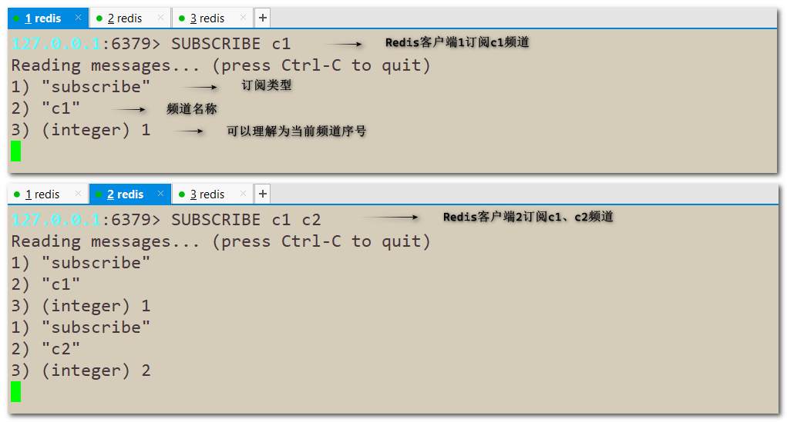
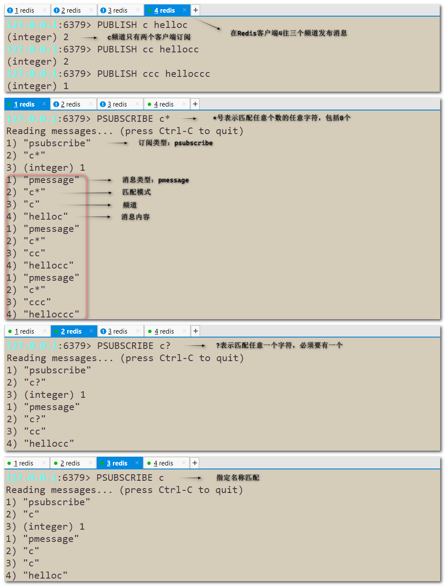
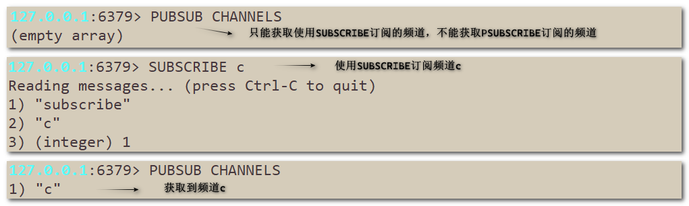
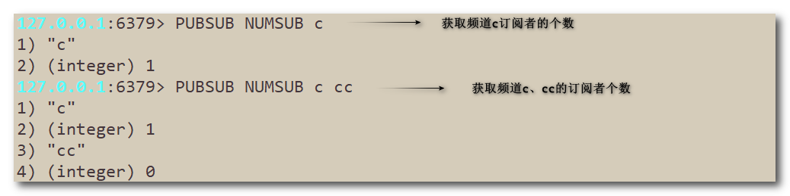

## Redis发布和订阅

Redis 发布和订阅（Publish/Subscribe，简称 Pub/Sub）是一种消息传递模式，用于在 Redis 中实现消息的发布和订阅。

在 Redis 中，发布者（Publisher）可以将消息发送到一个或多个频道（Channel），订阅者（Subscriber）可以订阅一个或多个频道，以接收发布者发送的消息。当发布者在某个频道上发布一条消息时，所有订阅该频道的订阅者都会收到这条消息。

Redis Pub/Sub 是基于消息传递的异步通信模型，可以用于构建实时系统、聊天室、实时广播等应用场景。

------


### 1. 常用命令

#### SUBSCRIBE

**`SUBSCRIBE channel [channel ...]`**：订阅一个或多个频道

> 一旦客户进入了订阅状态，客户端就只能接受订阅相关的命令SUBSCRIBE、PSUBSCRIBE、UNSUBSCRIBE和PUNSUBSCRIBE，除了这些命令，其他命令一律失效。按Ctrl+C结束订阅状态。
>
> 返回值：发布类型、频道名称、第几个频道




#### PUBLISH

**`PUBLISH channel message`**：发布消息到指定频道。

> 返回值为收到消息的客户端数量。


#### PSUBSCRIBE

**`PSUBSCRIBE pattern [pattern ...]`**：按照匹配模式批量订阅。

> 支持的模式有：?表示任意一个字符；*表示任意数量的任意字符；[]表示中括号中的指定字符。比如：
> h?llo：可以匹配hallo、hbllo、hello...
> h\*llo：可以匹配hello、heeello、habcdello...
> h[abc]llo：只能匹配hallo、hbllo、hcllo




#### PUBSUB

PUBSUB 是自省命令，能够检测PUB/SUB子系统的状态。

**`PUBSUB CHANNELS [pattern] `**：返回当前活跃的频道。

> 只会统计使用SUBSCRIBE订阅的频道。



**`PUBSUB NUMSUB channel [channel ...]`**：返回指定频道订阅者的个数。

> 只会统计使用SUBSCRIBE订阅的订阅者个数。



**`PUBSUB UNMPAT`**：返回订阅模式(PSUBSCRIBE)的数量。

>  这个命令返回的不是订阅模式的订阅者数量， 而是所有Redis客户端(订阅者)订阅的所有模式的数量总和。

```sh
127.0.0.1:6379> PUBSUB NUMPAT
(integer) 2		# 包括了客户端1，客户端2，客户端3的订阅模式的数量
```


#### UNSUBSCRIBE

**`UNSUBSCRIBE channel [channel ...]`**：指示客户端退订指定频道，若没有指定频道则退订所有频道。

```sh
127.0.0.1:6379> UNSUBSCRIBE c2	# 退定频道c1
1) "unsubscribe"
2) "c1"
3) (integer) 0
127.0.0.1:6379> UNSUBSCRIBE		# 退订所有频道
1) "unsubscribe"
2) (nil)
3) (integer) 0
```


#### PUNSUBSCRIBE

**`PUNSUBSCRIBE pattern [pattern ...]`**：指示客户端退订指定模式，若没有提供模式则退定所有模式。

```sh
127.0.0.1:6379> PUNSUBSCRIBE c*		# 退定订阅模式c*
1) "punsubscribe"
2) "c*"
3) (integer) 0
127.0.0.1:6379> PUNSUBSCRIBE		# 退订所有订阅模式
1) "punsubscribe"
2) (nil)
3) (integer) 0
```


### 2. 小总结

- 发布的消息在Redis系统不能持久化，因此必须先执行订阅，再等待消息发布，如果先发布了消息且该消息没有订阅者接收，那么该消息被直接丢弃。
- 消息只管发送，对于发布者而言消息是即发即失的，也没有ACK机制，无法保证消息是否消费成功。
- Redis5.0新增了Stream数据结构，不但支持多播，还支持数据持久化，比Pub/Sub更加强大。
