## Redis复制

Redis 复制（Replication）是 Redis 的一项核心功能，用于将一个 Redis 数据库的所有数据复制到另一个 Redis 实例上。Redis 复制可以提高系统的可用性、可靠性和扩展性，使得在发生故障时可以快速地恢复数据。

Redis 复制支持主从复制和从从复制两种方式，可以根据实际情况选择不同的方式来部署和管理 Redis 实例。

- **主从复制**

  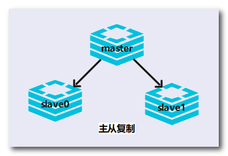

- **从从复制**

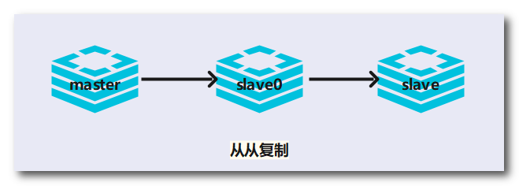

------

### 1. 环境配置

（1）克隆两个虚拟机，一主二仆，Redis设主节点，Redis1和Redis2设从节点。

（2）配置网络IP：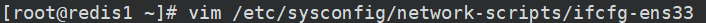

（3）关闭防火墙：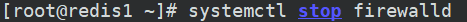

（4）修改redis.conf配置文件

- **基础配置**

  - 开启后台运行：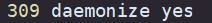

  - 注释bind 127.0.0.1：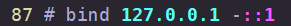

  - 关闭保护模式：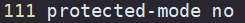

  - 指定端口号：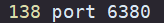

  - 持久化文件保存目录：

  - 修改持久化文件名：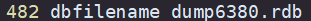

  - 设置日志文件名：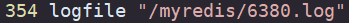

  - 配置密码：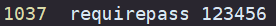

- **主要配置**

  > ”<u>配从不配主</u>“：
  > 在从节点的redis.conf文件配置主节点的ip和端口号：`replicaof 主节点IP 主节点Redis服务端口号`
  > 在从节点的redis.conf文件配置连接主节点Redis服务的密码：`masterauth 密码`

  - 配置从节点访问的主节点：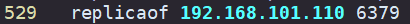

  - 配置从节点访问的主节点的密码：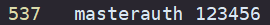

### 2. 基本命令

从节点配置了需要连接的主节点后，打开Redis客户端即可自动连接到主节点。并且开始同步主节点的数据。

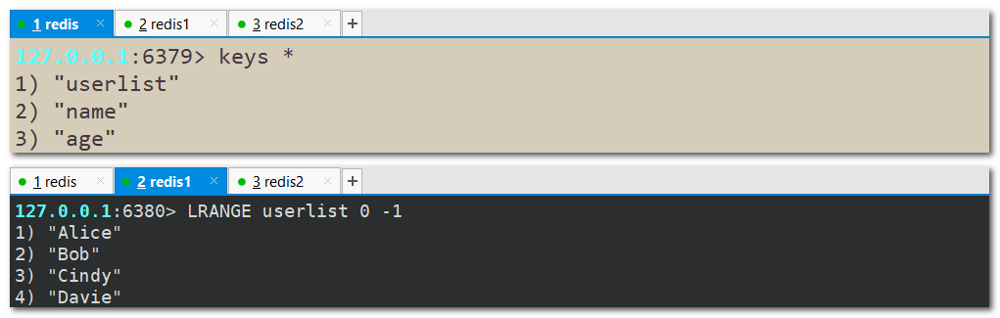

**`INFO REPLICATION`**：查看主从关系和配置信息

- 查看主节点信息

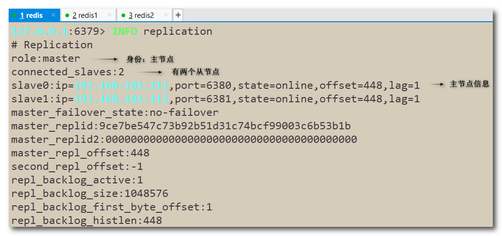

- 查看从节点信息

**`replicaof 主节点IP 主节点端口`**：配置需要连接的主节点IP和端口。一般写入进redis.conf文件中

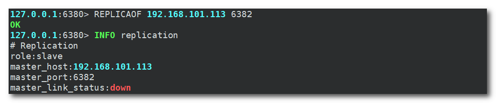

**`slaveof 主节点IP 主节点端口`**：临时更换需要连接的主节点IP和端口。

> 这是一个临时的主从关系，每次与主节点断开后都需要重新配置。
>
> 在运行期间修改slave节点的信息，如果该数据库已经是某个主数据库的从数据库，那么会停止和原数据库的同步关系，开始和新配置的主数据库同步，并且清除原有的数据。

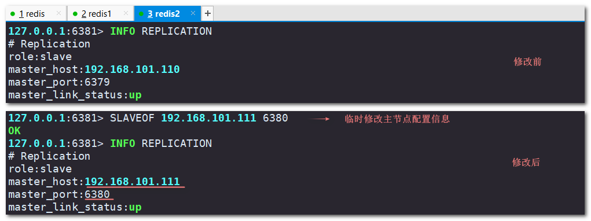

将从节点redis2的追随的主节点更改为redis1后，查看redis1的信息：是redis的从节点，也是redis2的主节点。

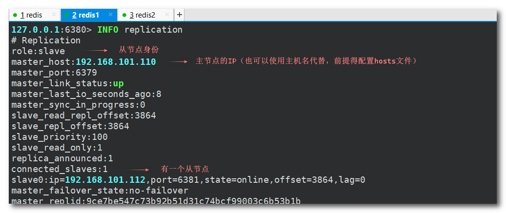

**`slaveof no one`**：停止当前从节点与主节点的的数据同步。

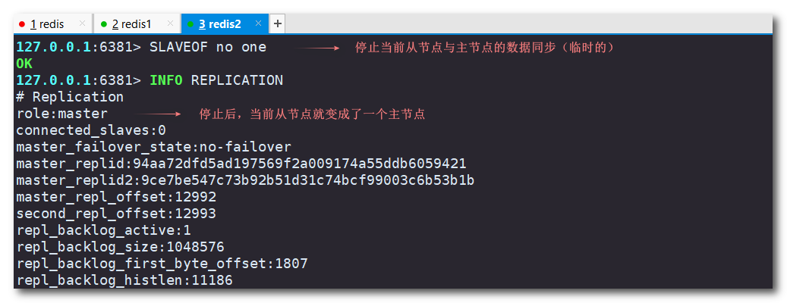

### 3. 常见问题

- slave可以执行写命令吗？

  > slave不可以执行写命令。master负责写命令，slave负责读命令，当然master也可以读命令。
  >
  > 即使slave是另一台slave的master，也不能执行写命令。

  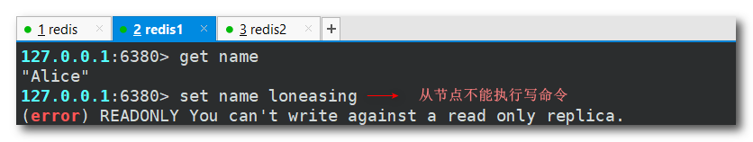

- slave是从头开始复制还是从切入点开始复制?

  > 在 Redis 复制中，从节点（Slave）可以选择从头开始复制或者从切入点开始复制。
  >
  > 当从节点第一次连接主节点时，如果主节点没有持久化数据，从节点将从头开始复制。即主节点会将自己的全部数据发送给从节点，从节点将接收并保存全部数据。
  >
  > 当从节点与主节点已经建立了连接，并且已经有了初始数据同步，如果从节点断开与主节点的连接后重新连接，从节点可以选择从上次同步的位置（复制偏移量）继续同步数据，这样可以避免从头开始复制所带来的性能影响和数据冗余。
  > （master会检查backlog里面的offset，master和slave都会保存一个复制的offset和一个masterId）
  >
  > 需要注意的是，如果从节点断开与主节点的连接时间过长，主节点可能已经自动执行了 BGSAVE 命令，生成了新的 RDB 文件，此时从节点需要从头开始复制。此外，如果从节点的内存不足，也可能需要从头开始复制，以避免内存溢出。
  >
  > 比如master写到k3，slave启动后会同步k3及之前的数据，然后跟随master同步数据。
  
  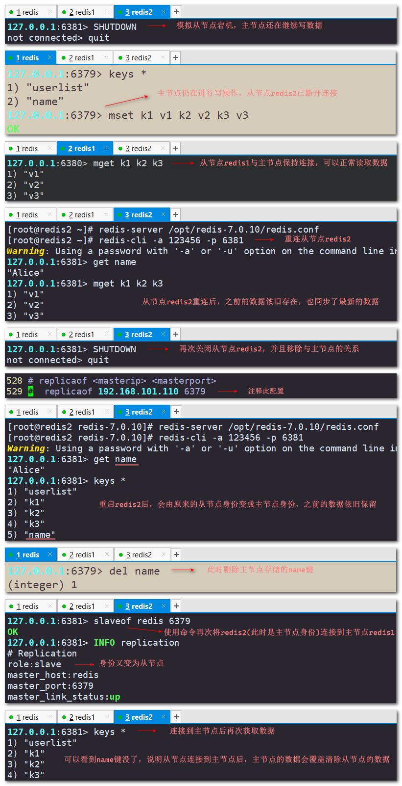

- 主节点SHUTDOWN后，从节点会上位吗？

  > 主节点关闭后，从节点不会变成主节点，它们会等待主节点重新启动，但是从节点的数据可以正常读取。
  >
  > 主节点重启后，主从关系依旧存在。

### 4. Redis复制流程

（1）从节点向主节点发送 SYNC 命令，请求全量复制。

（2）主节点接收到 SYNC 命令后，开始执行 BGSAVE 命令生成 RDB 文件，并在生成过程中记录所有执行的写命令。

（3）主节点在 BGSAVE 命令执行完毕后，将生成的 RDB 文件发送给从节点，同时将在执行 BGSAVE 命令期间记录的写命令发送给从节		  点，让从节点进行执行。

（4）从节点接收到主节点发送的 RDB 文件和写命令，并执行相应的操作来保持与主节点的数据一致。

（5）从节点持续监听主节点发来的新命令，并将其执行，以保持与主节点的数据同步。

（6）为了保持主节点和从节点之间的通信，master会发出PING包的周期默认是10秒：`repl-ping-replica-period 10`（在661行）

（6）当主节点发生故障时，从节点会尝试与其他主节点建立连接，并选举出一个新的主节点，从而成为新的从节点，保证系统的可用性		  和可靠性。

> 需要注意的是，Redis 复制是异步的，因此从节点可能存在数据不一致的情况。为了避免数据不一致，可以设置 Redis 的复制偏移量（replication offset），当从节点与主节点连接断开后，从节点可以通过该偏移量快速地同步数据。

### 5. Redis复制的缺点

（1）*数据同步延迟*：由于 Redis 复制是异步的，从节点的数据可能会与主节点存在一定的延迟，因此从节点可能无法实时获取到最新的		  数据。

（2）*单点故障*：当主节点发生故障时，需要手动进行故障转移或者使用集群来保证系统的可用性。

（3）*网络通信问题*：当网络出现故障或者通信延迟过高时，复制的效率会受到影响，从节点可能无法及时接收到主节点发送的数据。

（4）*内存消耗问题*：当从节点处理不过来主节点发送过来的写命令时，从节点会自动触发执行全量复制，这会导致从节点内存消耗变大

（5）*数据安全问题*：当主节点的数据被误删或者篡改时，从节点也会受到影响，因此需要采取一定的措施来保证数据的安全性。

> 需要注意的是，这些缺点并不是 Redis 复制本身的问题，而是分布式系统中常见的问题，需要根据实际情况进行综合考虑和处理。
