## Redis集群

Redis 集群是 Redis 数据库的分布式解决方案，它可以将数据分散存储在多个节点上，以支持大规模数据存储和高并发访问。

Redis 集群使用的是基于槽的分区策略，即将数据分成固定数量的槽，每个槽由一个主节点和多个从节点组成。客户端请求会根据键值的哈希值被路由到对应的槽上，从而实现数据的分布式存储和访问。同时，Redis 集群还提供了多种操作槽的命令，以支持集群的管理和维护。

Redis 集群的主要特点包括：

1. 分布式存储：Redis 集群将数据分散存储在多个节点上，每个节点负责处理一部分数据，从而实现数据的分布式存储和访问。集群可以扩展到数千个节点，以支持海量数据存储和高并发访问。建议控制在1000个以内的节点数。
2. 高可用性：Redis 集群通过多副本机制和自动故障转移机制，保证数据的可靠性和可用性。每个节点都有多个副本，其中一个副本为主节点，负责处理客户端请求，其他副本为从节点，负责复制主节点的数据。当主节点宕机时，从节点会自动选举一个新的主节点，以保证数据的连续性和可用性。
3. 数据自动分片：Redis 集群将数据自动分片存储在多个节点上，以实现数据的均衡分布和高效访问。每个节点都负责处理一部分数据，同时维护一份槽指派表，记录每个槽对应的主节点和从节点。客户端请求会根据键值的哈希值被路由到对应的槽上，从而实现数据的分布式存储和访问。
4. 支持在线扩容缩容：Redis 集群支持在线添加和删除节点，以扩展或缩小集群的容量，而无需停机或数据迁移。集群会自动将数据重新分片和迁移，以保证数据的连续性和可用性。
5. 负载均衡：Redis 集群通过智能路由算法，将客户端请求均匀地分发到不同的节点上，以实现负载均衡和性能优化。客户端可以通过集群模式下的代理节点（cluster-enabled proxy）进行连接，代理节点会自动将请求路由到正确的节点上。

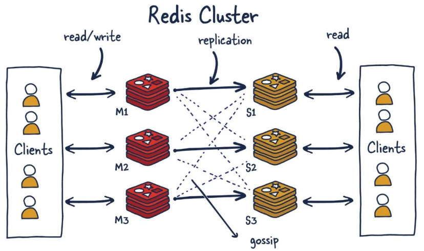

------


### 1. redis集群槽位

在 Redis 集群中，槽位（slot）是将数据进行分片的基本单位，也是实现数据分布式存储和访问的重要机制。Redis 集群默认将 16384 个槽位均分给不同的节点，每个节点负责处理一部分槽位，从而实现数据的分布式存储和访问。

具体来说，Redis 集群使用哈希槽（hash slot）的方式将数据进行分片，每个槽对应着一个整数编号，从 0 开始，一直到 16383。每个节点会负责处理一部分槽位，同时维护一份槽指派表（slot map），记录每个槽对应的主节点和从节点。

客户端请求会==根据键值的哈希值被路由到对应的槽==上，从而实现数据的分布式存储和访问。具体来说，客户端会将键值的哈希值对 16384 取模，得到一个槽号，然后将请求发送到对应的槽所在的节点上。如果该节点是主节点，它会将请求处理后的结果返回给客户端；如果该节点是从节点，则会将请求转发给对应的主节点进行处理。

需要注意的是，槽的数量是固定的，因此如果需要扩展 Redis 集群的容量，就需要将一些槽移动到新的节点上，以实现数据的重新分片和迁移。Redis 集群提供了多种操作槽的命令，以支持集群的管理和维护。

------


### 2. redis集群分片

在 Redis 集群中，数据分片（sharding）是将数据划分成多个部分，分别存储在不同的节点上，从而实现分布式存储和访问的基本方式。Redis 集群使用哈希槽（hash slot）的方式将数据进行分片，每个节点负责处理一部分槽位，从而实现数据的分布式存储和访问。

具体来说，Redis 集群默认将 16384 个槽位均分给不同的节点，每个节点负责处理一部分槽位，同时维护一份槽指派表（slot map），记录每个槽对应的主节点和从节点。客户端请求会根据键值的哈希值被路由到对应的槽上，从而实现数据的分布式存储和访问。

数据分片能够提高 Redis 集群的容量和可用性，减少单节点的负载压力，并支持横向扩展和动态扩容。同时，数据分片也会带来一些挑战和问题，例如数据迁移、节点失效、一致性维护等方面的问题，需要进行合理的设计和实现。

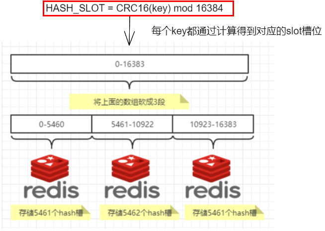

------


### 3. redis槽位映射

- **哈希取余分区**

  哈希取余分区是一种常见的数据分区技术，它将数据划分成多个分区，并将每个分区分配给集群中的不同节点，从而实现分布式存储和访问。
  
  在哈希取余分区中，首先根据某个键的哈希值对分区总数取模，得到该键所在的分区编号，然后将该键存储在对应的节点上。当需要访问某个键值对时，同样通过哈希值计算得到该键所在的分区编号，然后访问对应的节点，从而实现数据的分布式访问。
  
  哈希取余分区技术简单易懂，易于实现，可以较好地均衡数据在各个节点之间的分布，从而提高系统的可扩展性和可用性。但是，该技术存在数据倾斜和数据迁移等问题。如果某个键的哈希值对分区总数取模后恰好落在某个分区上，那么该分区的负载将会比其他分区更重，可能会导致性能问题。此外，在节点的动态扩容和缩容时，会需要进行数据迁移，对系统的稳定性和性能也会带来影响。

- **一致性哈希算法分区**

  一致性哈希算法（Consistent Hashing Algorithm）是一种用于分布式存储系统的数据分区技术，它可以使得数据在集群中的分布更加均匀，同时减少在数据分区发生变化时需要重新分配的数据量。
  
  在一致性哈希算法中，所有的数据被分成一定数量的分区，每个分区被映射到一个哈希环上。每个节点也被映射到哈希环上，并负责其所在的某些分区。当需要存储一个数据时，先对该数据进行哈希，然后将哈希值映射到哈希环上，找到最近的节点，并将数据存储在该节点上。当需要读取一个数据时，也先对该数据进行哈希，并映射到哈希环上，然后从离该数据最近的节点上读取数据。
  
  一致性哈希算法的核心思想是将哈希环视为一个环形空间，并将节点和数据视为该空间上的点。通过在哈希环上的均匀分布，可以使得数据在集群中的分布更加均匀。当某个节点宕机时，只会影响该节点所负责的一部分分区，不会影响整个集群，从而提高了系统的可用性和稳定性。同时，一致性哈希算法也能够自动地将数据重新映射到新的节点上，从而减少了数据的迁移量和系统的维护成本。
  
  一致性哈希算法已经被广泛地应用于各种分布式系统中，包括缓存系统、负载均衡系统、分布式文件系统等
  
  > 一致性哈希环
  >
  >   一致性哈希算法必然有个hash函数并按照算法产生hash值，这个算法的所有可能哈希值会构成一个全量集，这个集合可以成为一个hash空间[0,2^32-1]，这个是一个线性空间，但是在算法中，我们通过适当的逻辑控制将它首尾相连(0 = 2^32)，这样让它逻辑上形成了一个环形空间。
  >
  > 

- **哈希槽分区**

  哈希槽分区是 Redis 集群中常用的数据分区技术，它将整个数据集划分为固定数量的槽位（slot），然后将每个槽位分配到集群中不同的节点上，从而实现数据的分布式存储和访问。
  
  在哈希槽分区中，每个槽位都对应着一个哈希值范围，例如 0 到 16383。当需要存储某个键值对时，先计算出该键的哈希值，然后确定该哈希值所在的槽位，最后将键值对存储在负责管理该槽位的节点上。当需要访问某个键值对时，同样先计算出该键的哈希值，然后确定该哈希值所在的槽位，最后访问负责管理该槽位的节点，从而实现数据的分布式访问。
  
  哈希槽分区技术具有简单、可扩展性强等优点，它可以自动完成节点的动态扩容和缩容，并且在数据迁移时可以只迁移部分槽位，从而降低数据迁移的成本和风险。但是，该技术也存在一些问题，例如槽位的分配不均匀可能会导致某些节点的负载过重，从而影响系统的性能和可用性，此时可以通过手动调整槽位分配来解决这个问题。

------


### 4. 集群环境搭建

**（1）三主三从redis集群配置**

由于机器性能有限，这里只配置了三台虚拟机，一台虚拟机配置两个redis实例

> 192.168.101.110 (下面简称110)配置端口为6381和6382两个实例，配置文件分别为cluster6381.conf和cluster6382.conf
> 192.168.101.111 (下面简称111)配置端口为6383和6384两个实例，配置文件分别为cluster6383.conf和cluster6384.conf
> 192.168.101.112 (下面简称112)配置端口为6385和6386两个实例，配置文件分别为cluster6385.conf和cluster6386.conf

以实例cluster6381.conf为例，配置文件内容如下所示：

```sh
bind 0.0.0.0
daemonize yes
protected-mode no
port 6381
logfile "/myredis/cluster/cluster6381.log"
pidfile /myredis/ccluster6381.pid
dir /myredis/cluster
dbfilename dump6381.rdb
appendonly yes
appendfilename "appendonly6381.aof"
requirepass 123456
masterauth 123456
 
cluster-enabled yes		# 开启集群
cluster-config-file nodes-6381.conf		# 集群生成的配置文件
cluster-node-timeout 5000	# 集群节点之间的超时时间
```

在每台虚拟机的根目录创建`/myredis/cluster`目录，然后在该目录创建两个配置文件：

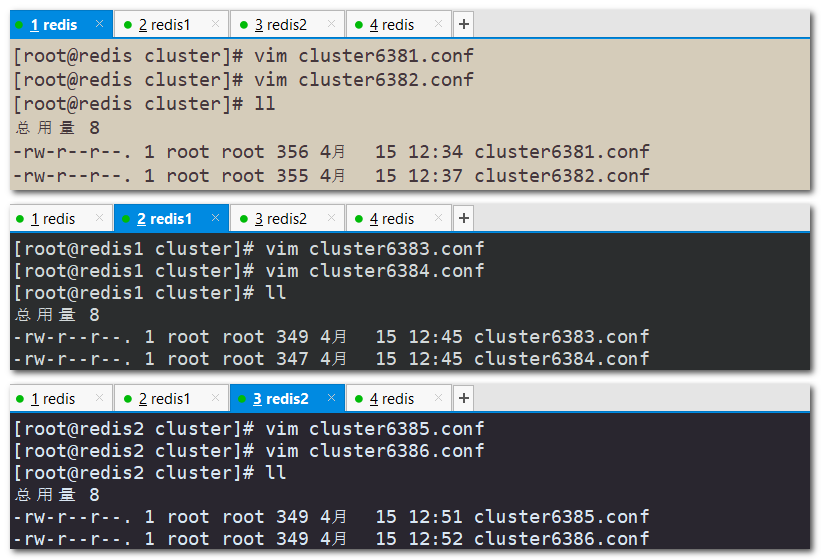

查看cluster6381.conf文件内容：

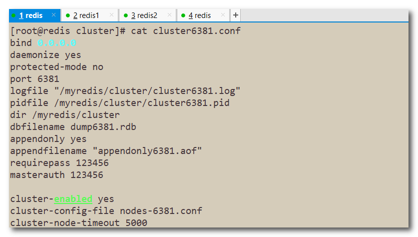

**（2）启动六台redis实例**

> 启动集群实例和之前启动redis实例一样，只不过配置文件中配置了开启集群，会以集群的方式启动redis实例。

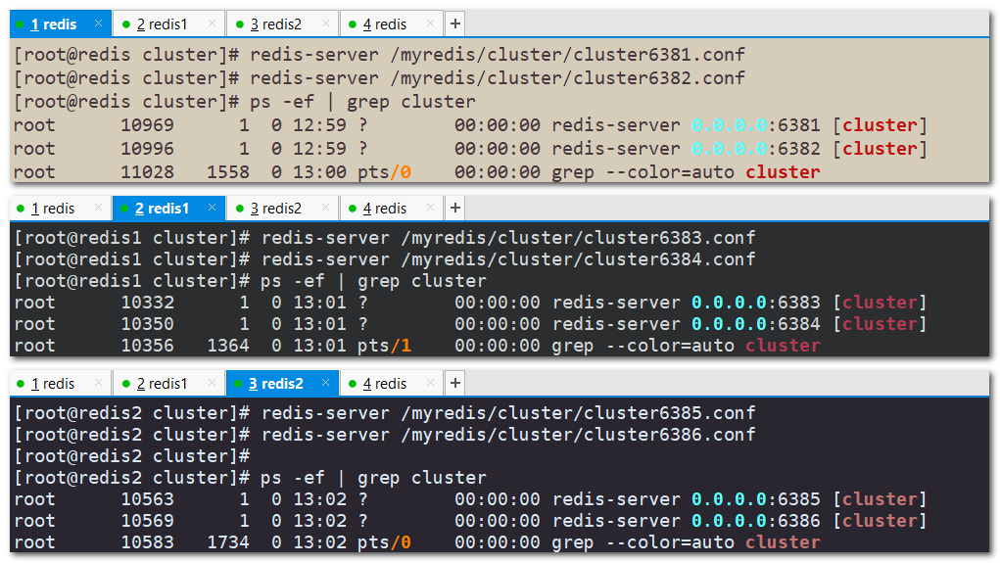

**（3）构建主从关系**

使用命令构建集群间的主从关系：**`redis-cli -a 密码 --cluster create --cluster-replicas 1 IP:端口号 [IP:端口号]`**

> 选项–replicas 1 表示我们希望为集群中的每个主节点创建一个从节点
>
> `IP:端口号`是redis实例的地址和端口号，多个redis实例构成一个集群
>
> 主从关系是随机分配的(个人见解：一般按照输入的顺序基数位为master，偶数位为slave)，其master-slave关系是随机分配的。

在任意一个虚拟机中执行这个命令都可以，下面在110虚拟机中执行此命令：

```shell
[root@redis cluster]# redis-cli -a 123456 --cluster create --cluster-replicas 1 192.168.101.110:6381 192.168.101.110:6382 192.168.101.111:6383 192.168.101.111:6384 192.168.101.112:6385 192.168.101.112:6386
Warning: Using a password with '-a' or '-u' option on the command line interface may not be safe.
>>> Performing hash slots allocation on 6 nodes...
Master[0] -> Slots 0 - 5460			# 1号主节点分配了0-5460的槽位
Master[1] -> Slots 5461 - 10922		# 2号主节点分配了5461-10922的槽位
Master[2] -> Slots 10923 - 16383	# 3号主节点分配了10923-16383的槽位
Adding replica 192.168.101.111:6384 to 192.168.101.110:6381	#111机器的6384实例同步110机器的6381实例
Adding replica 192.168.101.112:6386 to 192.168.101.111:6383	#112机器的6386实例同步111机器的6383实例
Adding replica 192.168.101.110:6382 to 192.168.101.112:6385	#110机器的6382实例同步112机器的6385实例
M: e4d44fbdc683d3882b39f7b02d5a78bc4c0b36a6 192.168.101.110:6381	# 主节点id IP:端口号
   slots:[0-5460] (5461 slots) master	# 分配了5461个槽位
S: 202075b6488c250e6f8227c44b905f7781162f30 192.168.101.110:6382	# 从节点id IP:端口号
   replicates 154d23ad6fb321801ebe84e8066411e3f3fc05ec	# 从属154d23(主节点id，对应6385)
M: 1b9c2607caafa82ab53a407f4979b00c9ee1ea9d 192.168.101.111:6383
   slots:[5461-10922] (5462 slots) master
S: 851c4e7c78ddfb59672dcdfae5e29a2372fdc192 192.168.101.111:6384
   replicates e4d44fbdc683d3882b39f7b02d5a78bc4c0b36a6
M: 154d23ad6fb321801ebe84e8066411e3f3fc05ec 192.168.101.112:6385
   slots:[10923-16383] (5461 slots) master
S: e2512f82160d0e044b40dade1f6e2df7a942c83c 192.168.101.112:6386
   replicates 1b9c2607caafa82ab53a407f4979b00c9ee1ea9d
Can I set the above configuration? (type 'yes' to accept): yes	# 是否保存这些配置，输入yes保存
>>> Nodes configuration updated
>>> Assign a different config epoch to each node
>>> Sending CLUSTER MEET messages to join the cluster
Waiting for the cluster to join
..
>>> Performing Cluster Check (using node 192.168.101.110:6381)
M: e4d44fbdc683d3882b39f7b02d5a78bc4c0b36a6 192.168.101.110:6381
   slots:[0-5460] (5461 slots) master
   1 additional replica(s)
S: 851c4e7c78ddfb59672dcdfae5e29a2372fdc192 192.168.101.111:6384
   slots: (0 slots) slave	# 从节点分配了0个槽位
   replicates e4d44fbdc683d3882b39f7b02d5a78bc4c0b36a6
M: 1b9c2607caafa82ab53a407f4979b00c9ee1ea9d 192.168.101.111:6383
   slots:[5461-10922] (5462 slots) master
   1 additional replica(s)
S: 202075b6488c250e6f8227c44b905f7781162f30 192.168.101.110:6382
   slots: (0 slots) slave
   replicates 154d23ad6fb321801ebe84e8066411e3f3fc05ec
S: e2512f82160d0e044b40dade1f6e2df7a942c83c 192.168.101.112:6386
   slots: (0 slots) slave
   replicates 1b9c2607caafa82ab53a407f4979b00c9ee1ea9d
M: 154d23ad6fb321801ebe84e8066411e3f3fc05ec 192.168.101.112:6385
   slots:[10923-16383] (5461 slots) master
   1 additional replica(s)
[OK] All nodes agree about slots configuration.
>>> Check for open slots...
>>> Check slots coverage...
[OK] All 16384 slots covered.
```

重连6381实例再查看集群信息：`CLUSTER INFO`

```sh
[root@redis cluster]# redis-cli -a 123456 -p 6381
Warning: Using a password with '-a' or '-u' option on the command line interface may not be safe.
127.0.0.1:6381> CLUSTER INFO	# 查看集群信息
cluster_state:ok
cluster_slots_assigned:16384
cluster_slots_ok:16384
cluster_slots_pfail:0
cluster_slots_fail:0
cluster_known_nodes:6
cluster_size:3
cluster_current_epoch:6
cluster_my_epoch:1
cluster_stats_messages_ping_sent:3652
cluster_stats_messages_pong_sent:3675
cluster_stats_messages_sent:7327
cluster_stats_messages_ping_received:3670
cluster_stats_messages_pong_received:3652
cluster_stats_messages_meet_received:5
cluster_stats_messages_received:7327
total_cluster_links_buffer_limit_exceeded:0
```

查看集群节点的状态信息：`CLUSTER NODES`

```sh
[root@redis cluster]# redis-cli -a 123456 -p 6381
Warning: Using a password with '-a' or '-u' option on the command line interface may not be safe.
127.0.0.1:6381> CLUSTER NODES	# 查看集群节点状态信息
e4d44fbdc683d3882b39f7b02d5a78bc4c0b36a6 192.168.101.110:6381@16381 myself,master - 0 1681569469000 1 connected 0-5460	# myself,master表示当前所在的节点，是主节点。前面的一大串是该节点的id、IP端口信息
851c4e7c78ddfb59672dcdfae5e29a2372fdc192 192.168.101.111:6384@16384 slave e4d44fbdc683d3882b39f7b02d5a78bc4c0b36a6 0 1681569472503 1 connected	# 从节点851c41(6384)同步e4d44f(6381)
1b9c2607caafa82ab53a407f4979b00c9ee1ea9d 192.168.101.111:6383@16383 master - 0 1681569472000 3 connected 5461-10922
202075b6488c250e6f8227c44b905f7781162f30 192.168.101.110:6382@16382 slave 154d23ad6fb321801ebe84e8066411e3f3fc05ec 0 1681569472000 5 connected
e2512f82160d0e044b40dade1f6e2df7a942c83c 192.168.101.112:6386@16386 slave 1b9c2607caafa82ab53a407f4979b00c9ee1ea9d 0 1681569472503 3 connected
154d23ad6fb321801ebe84e8066411e3f3fc05ec 192.168.101.112:6385@16385 master - 0 1681569472604 5 connected 10923-16383
```


------


### 5. 测试集群读写

> 每个key都有自己的哈希值，根据哈希值通过某种算法算出对应的槽位，该key只能存储到该槽位所在的节点上。
>
> 然而这种情况并不是我们想要的，可以在连接redis客户端时添加`-c`参数，这样会帮我们把数据路由到指定的槽位上，即使在不同的节点上也能随便存储数据。

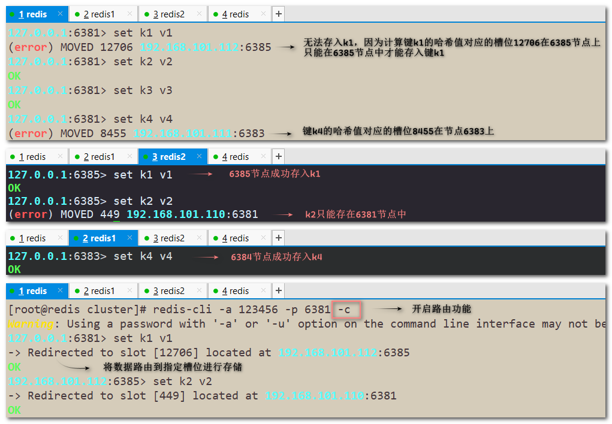

查看某个key对应的槽位值：`CLUSTER KEYSLOT key`

> 任何字符都有对应的哈希值，所以任何字符都能计算出对应的槽位

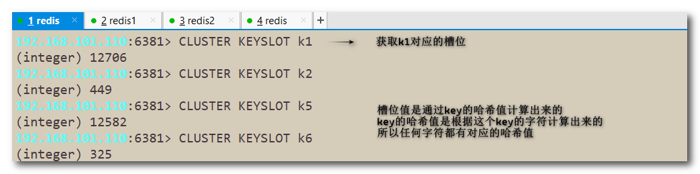

查看某个槽位是否被占用：`CLUSTER COUNTKEYSINSLOT 槽位号`

> 返回1表示该槽位被占用；返回0表示该槽位没有被占用。

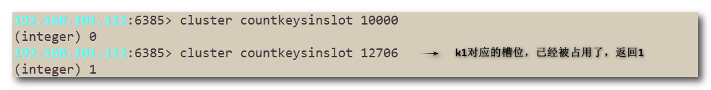

------


### 6. 测试集群主从切换

- 首先查看当前节点主从关系：`INFO REPLICATION`

  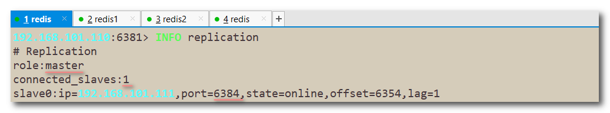

- 手动关闭主节点6381，查看集群节点状态

  > 在其他任何集群节点查看集群节点的状态都可以。
  >
  > 主节点宕机后，从节点会成为新的master。
  
  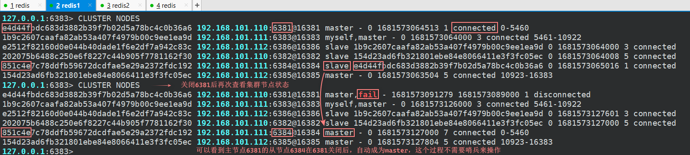

- 重新连接节点6381，查看集群节点状态

  > 恢复6381节点后，该节点会变成新master的slave。

  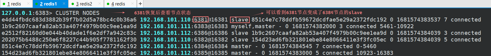

- 恢复6381master的身份：`CLUSTER FAILOVER`

  > 使用`cluster failover`可以恢复发生故障前的主从关系

  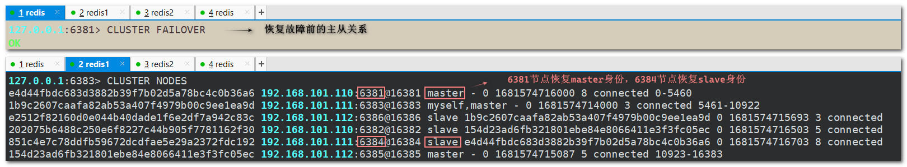

------


### 7. redis集群扩容

在112虚拟机上新建两个redis实例6387和6388，此时112虚拟机上有4个redis实例分别是6385、6386、6387、6388

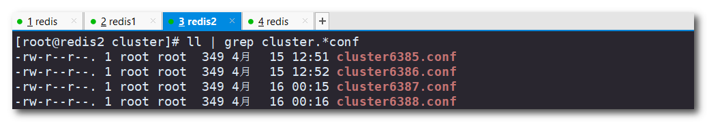

启动这两个新节点，此时它们都是master

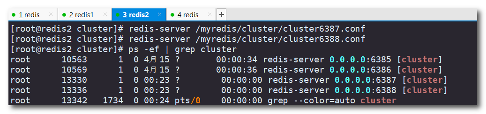

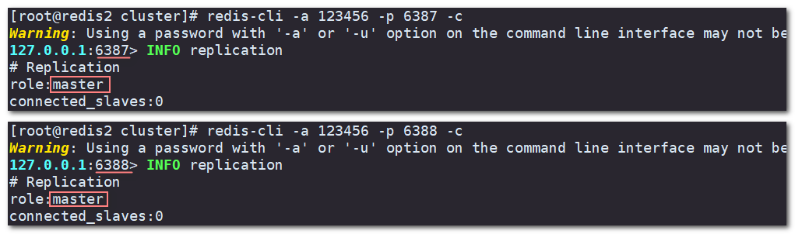

将6387节点作为master加入到集群中：**`redis-cli -a 密码 --cluster add-node IP:port IP:port`**

> 前者`IP:port`为需要加入到集群的节点ip和端口
> 后者`IP:port`指集群中任一节点的ip和端口（可以理解为推荐人）

```sh
[root@redis2 cluster]# redis-cli -a 123456 --cluster add-node 192.168.101.112:6387 192.168.101.110:6381
Warning: Using a password with '-a' or '-u' option on the command line interface may not be safe.
>>> Adding node 192.168.101.112:6387 to cluster 192.168.101.110:6381
>>> Performing Cluster Check (using node 192.168.101.110:6381)
M: e4d44fbdc683d3882b39f7b02d5a78bc4c0b36a6 192.168.101.110:6381
   slots:[0-5460] (5461 slots) master
   1 additional replica(s)
M: 154d23ad6fb321801ebe84e8066411e3f3fc05ec 192.168.101.112:6385
   slots:[10923-16383] (5461 slots) master
   1 additional replica(s)
M: 1b9c2607caafa82ab53a407f4979b00c9ee1ea9d 192.168.101.111:6383
   slots:[5461-10922] (5462 slots) master
   1 additional replica(s)
S: e2512f82160d0e044b40dade1f6e2df7a942c83c 192.168.101.112:6386
   slots: (0 slots) slave
   replicates 1b9c2607caafa82ab53a407f4979b00c9ee1ea9d
S: 202075b6488c250e6f8227c44b905f7781162f30 192.168.101.110:6382
   slots: (0 slots) slave
   replicates 154d23ad6fb321801ebe84e8066411e3f3fc05ec
S: 851c4e7c78ddfb59672dcdfae5e29a2372fdc192 192.168.101.111:6384
   slots: (0 slots) slave
   replicates e4d44fbdc683d3882b39f7b02d5a78bc4c0b36a6
[OK] All nodes agree about slots configuration.
>>> Check for open slots...
>>> Check slots coverage...
[OK] All 16384 slots covered.
>>> Getting functions from cluster
>>> Send FUNCTION LIST to 192.168.101.112:6387 to verify there is no functions in it
>>> Send FUNCTION RESTORE to 192.168.101.112:6387
>>> Send CLUSTER MEET to node 192.168.101.112:6387 to make it join the cluster.
[OK] New node added correctly.
```

检查集群情况：**`redis-cli -a 密码 --cluster check IP:port`**

> 只需要指定集群中任意一个在线的节点的地址(IP:端口号)， 就会自动找到集群中的其他节点，即可查看整个集群的信息。

```sh
[root@redis1 ~]# redis-cli -a 123456 --cluster check 192.168.101.110:6381
Warning: Using a password with '-a' or '-u' option on the command line interface may not be safe.
192.168.101.110:6381 (e4d44fbd...) -> 2 keys | 5461 slots | 1 slaves.
192.168.101.112:6385 (154d23ad...) -> 1 keys | 5461 slots | 1 slaves.
192.168.101.112:6387 (b1ef21d8...) -> 0 keys | 0 slots | 0 slaves.	#可以看到节点6387加入了集群但是没有分配槽位
192.168.101.111:6383 (1b9c2607...) -> 1 keys | 5462 slots | 1 slaves.
[OK] 4 keys in 4 masters.
0.00 keys per slot on average.
>>> Performing Cluster Check (using node 192.168.101.110:6381)
M: e4d44fbdc683d3882b39f7b02d5a78bc4c0b36a6 192.168.101.110:6381
   slots:[0-5460] (5461 slots) master
   1 additional replica(s)
M: 154d23ad6fb321801ebe84e8066411e3f3fc05ec 192.168.101.112:6385
   slots:[10923-16383] (5461 slots) master
   1 additional replica(s)
M: b1ef21d88293bc1560f61a46c4fca8b601d59d60 192.168.101.112:6387
   slots: (0 slots) master
M: 1b9c2607caafa82ab53a407f4979b00c9ee1ea9d 192.168.101.111:6383
   slots:[5461-10922] (5462 slots) master
   1 additional replica(s)
S: e2512f82160d0e044b40dade1f6e2df7a942c83c 192.168.101.112:6386
   slots: (0 slots) slave
   replicates 1b9c2607caafa82ab53a407f4979b00c9ee1ea9d
S: 202075b6488c250e6f8227c44b905f7781162f30 192.168.101.110:6382
   slots: (0 slots) slave
   replicates 154d23ad6fb321801ebe84e8066411e3f3fc05ec
S: 851c4e7c78ddfb59672dcdfae5e29a2372fdc192 192.168.101.111:6384
   slots: (0 slots) slave
   replicates e4d44fbdc683d3882b39f7b02d5a78bc4c0b36a6
[OK] All nodes agree about slots configuration.
>>> Check for open slots...
>>> Check slots coverage...
[OK] All 16384 slots covered.
```

重新分派槽号：**`redis-cli -a 密码 --cluster reshard IP:port`**

> 只需要指定集群中任意一个在线的节点的地址(IP:端口号)即可。

```sh
[root@redis2 cluster]# redis-cli -a 123456 --cluster reshard 192.168.101.110:6381
Warning: Using a password with '-a' or '-u' option on the command line interface may not be safe.
>>> Performing Cluster Check (using node 192.168.101.110:6381)
M: e4d44fbdc683d3882b39f7b02d5a78bc4c0b36a6 192.168.101.110:6381
   slots:[0-5460] (5461 slots) master
   1 additional replica(s)
M: 154d23ad6fb321801ebe84e8066411e3f3fc05ec 192.168.101.112:6385
   slots:[10923-16383] (5461 slots) master
   1 additional replica(s)
M: b1ef21d88293bc1560f61a46c4fca8b601d59d60 192.168.101.112:6387
   slots: (0 slots) master
M: 1b9c2607caafa82ab53a407f4979b00c9ee1ea9d 192.168.101.111:6383
   slots:[5461-10922] (5462 slots) master
   1 additional replica(s)
S: e2512f82160d0e044b40dade1f6e2df7a942c83c 192.168.101.112:6386
   slots: (0 slots) slave
   replicates 1b9c2607caafa82ab53a407f4979b00c9ee1ea9d
S: 202075b6488c250e6f8227c44b905f7781162f30 192.168.101.110:6382
   slots: (0 slots) slave
   replicates 154d23ad6fb321801ebe84e8066411e3f3fc05ec
S: 851c4e7c78ddfb59672dcdfae5e29a2372fdc192 192.168.101.111:6384
   slots: (0 slots) slave
   replicates e4d44fbdc683d3882b39f7b02d5a78bc4c0b36a6
[OK] All nodes agree about slots configuration.
>>> Check for open slots...
>>> Check slots coverage...
[OK] All 16384 slots covered.
How many slots do you want to move (from 1 to 16384)? 4096
What is the receiving node ID? b1ef21d88293bc1560f61a46c4fca8b601d59d60	# 指定一个节点id接收槽位
Please enter all the source node IDs.
  # all表示现有的三个分片平均拿出一点槽位分给新节点
  Type 'all' to use all the nodes as source nodes for the hash slots.
  Type 'done' once you entered all the source nodes IDs.
Source node #1: all

Ready to move 4096 slots.
```

再次检查集群情况

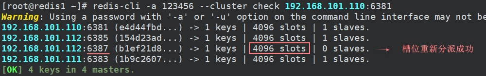

为集群中新主节点添加从节点：
**`redis-cli -a 密码 --cluster add-node IP:port IP:port --cluster-slave --cluster-master-id 新主节点id`**

> 前者`IP:port`指从节点的地址，后者`IP:port`为集群中任意一个在线节点的地址

```sh
[root@redis2 cluster]# redis-cli -a 123456 --cluster add-node 192.168.101.112:6388 192.168.101.112:6387 --cluster-slave --cluster-master-id b1ef21d88293bc1560f61a46c4fca8b601d59d60
Warning: Using a password with '-a' or '-u' option on the command line interface may not be safe.
>>> Adding node 192.168.101.112:6388 to cluster 192.168.101.112:6387
>>> Performing Cluster Check (using node 192.168.101.112:6387)
```

再次检查集群情况


------


### 8. redis集群缩容

首先先将从节点6388删除：**`redis-cli -a 密码 --cluster del-node IP:从节点端口 从节点id`** 

> 节点id可以通过检查集群情况命令查看：`redis-cli -a 密码 --cluster check IP:port`
> 也可以通过`CLUSTER NODES`命令查看。

```sh
[root@redis2 cluster]# redis-cli -a 123456 --cluster del-node 192.168.101.112:6388 8bc4986317910e2f57d67609931645b41d5a90e3		# 删除6388j
Warning: Using a password with '-a' or '-u' option on the command line interface may not be safe.
>>> Removing node 8bc4986317910e2f57d67609931645b41d5a90e3 from cluster 192.168.101.112:6388
>>> Sending CLUSTER FORGET messages to the cluster...
>>> Sending CLUSTER RESET SOFT to the deleted node.
```

将主节点6387的槽号清空重新分配

> 这里将清空的槽号全部分配给6381节点（当然也可以平均分配回之前的三个主节点，只不过要操作三次）

```sh
# 重新分配槽号
[root@redis2 cluster]# redis-cli -a 123456 --cluster reshard 192.168.101.110:6381
```

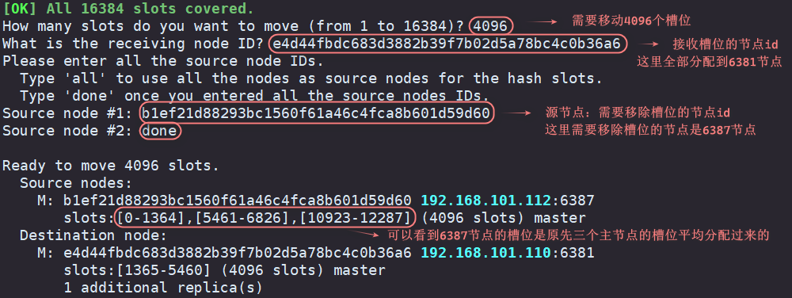

移除槽位后检查集群情况

> 6387节点槽位被清空，成为了6381节点的从节点
>
> 这和加入6387节点到集群时填写的集群中的`IP:port`有关（6381相当于推荐人）


此时节点6387是一个从节点，将节点6387删除

```sh
[root@redis2 cluster]# redis-cli -a 123456 --cluster del-node 192.168.101.112:6387 b1ef21d88293bc1560f61a46c4fca8b601d59d60
```

再次检查集群情况

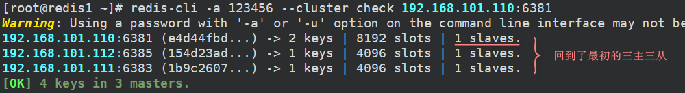
