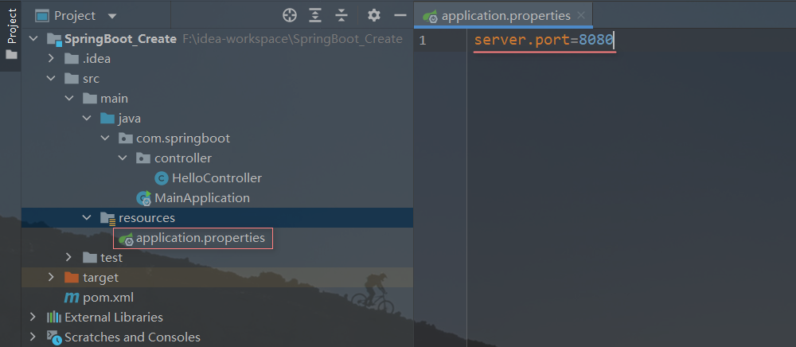
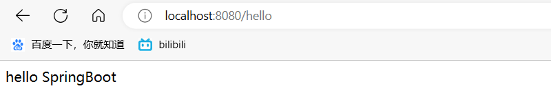
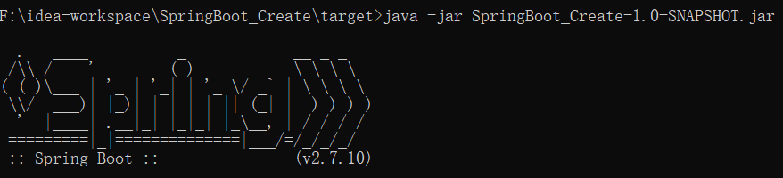

## 创建Spring Boot项目

 Intellij IDEA 一般可以通过两种方式创建 Spring Boot 项目：

- 使用 Maven 手动创建
- 使用 Spring Initializr 自动创建


### 1. 使用Maven手动创建

#### (1) 导入Spring Boot相关依赖

```xml
<project>
    ...
   
 	<!--导入父工程的springboot版本依赖-->
  	<parent>
        <groupId>org.springframework.boot</groupId>
        <artifactId>spring-boot-starter-parent</artifactId>
        <version>2.7.10</version>
    </parent>
  
    <dependencies>
        <!--导入web场景依赖-->
        <dependency>
            <groupId>org.springframework.boot</groupId>
            <artifactId>spring-boot-starter-web</artifactId>
        </dependency>
    </dependencies>
    
    <build>
        <plugins>
            <!--导入打包插件-->
            <!--会打包为一个独立可执行jar包，在命令行可以使用java -jar命令来运行这个jar包-->
            <plugin>
                <groupId>org.springframework.boot</groupId>
                <artifactId>spring-boot-maven-plugin</artifactId>
            </plugin>
        </plugins>
    </build>
	...
</project>
```


#### (2) 创建一个应用程序类

##### *@SpringBootApplication*

使用注解`@SpringBootApplication`标记此类，表示它是springboot应用程序的启动入口，这也相当于是一个配置类。

`@SpringBootApplication`注解内导入了`@ComponentScan`，会扫描当前类所在的包及子包下的组件类，并将其加载到Spring容器中。

```java
@SpringBootApplication
public class MainApplication {
    public static void main(String[] args) {
        //将MainApplication类的Class实例和main方法参数传进去，固定写法
        SpringApplication.run(MainApplication.class,args);//这句代码其实就是创建了spring容器
    }
}
```


#### (3) 创建一个控制器类

##### *@RestController*

使用注解`@RestController`标注此类为控制器，标记后该类的方法的返回值会以字符串形式响应到浏览器。

`@RestController`是`@Controller`和`@ResponseBody`的结合体。

```java
@RestController
public class HelloController {
    @GetMapping("/hello")
    public String hello(){
        return "hello SpringBoot";
    }
}
```

这个控制器类定义了一个名为`hello`的`GET`请求处理程序，当用户在浏览器中访问`http://localhost:8080/hello`时，将返回一个字符串`Hello, World!`。


#### (4) 创建一个配置文件

在resource目录创建一个application.properties文件，所有的配置信息都可以写在这个文件中，比如tomcat的端口号。




#### (5) 运行Spring Boot程序

**启动main方法**，到浏览器地址栏输入请求地址localhost:8080/hello



也可以使用`java -jar`命令在命令行启动打包好的jar包（使用maven的package工具打包）



------


### 2. 使用Spring Initializr自动创建

使用Spring Initializr可以快速创建一个Spring Boot应用程序，并自动管理依赖项和版本。

1. 打开IDE，创建一个新项目。
2. 选择Spring Initializr，填写项目信息，包括项目名称、包名、类型等。
3. 选择需要的依赖项，例如Web、数据库驱动程序、安全性等。
4. 点击“Generate Project”按钮，等待项目生成。
5. 导入项目到IDE中。
6. 编写代码和配置文件，实现具体的业务逻辑和功能。
7. 运行项目，查看结果。


