## yaml配置文件

Spring Boot支持多种类型的配置文件，包括：

- Properties文件：是一种经典的Java配置文件格式，使用key-value键值对的方式来表示配置信息，通常以".properties"为后缀名。

  > Properties文件内容每行都由一个键和一个值组成，中间用等号连接。键和值之间可以有空格。注释可以用#或!字符开头。

- YAML文件：是一种基于缩进的轻量级标记语言，使用缩进来表示数据结构，通常以".yml"或".yaml"为后缀名。

- XML文件：是一种基于标记的配置文件格式，使用XML语言来表示配置信息，通常以".xml"为后缀名。

Spring Boot默认使用properties文件来配置信息，可以根据实际需求和个人喜好来选择使用哪种配置文件格式，*下面主要介绍yaml文件*


### 1. yaml简介

YAML（YAML Ain't Markup Language），是一种轻量级的标记语言，具有易读、易写、易用的特点。

YAML可以用来表示多种数据类型，如字符串、数字、数组、字典等等。

yml和yaml都是同一种格式的文件，只不过后缀名不同而已。在实际使用中，可以根据个人喜好来选择使用哪种后缀名。

**yaml语法规则**：

- 键名大小写敏感
- 使用缩进表示层级关系，不允许使用Tab键只允许使用空格，空格数没有要求，但是同层级左侧必须对齐
- 属性值前面添加空格（属性名与属性值之间使用冒号+空格作为分隔）
- #号 表示注释


### 2. yaml语法

YAML 支持以下三种数据结构：

- 对象：键值对的集合。
- 数组：一组按次序排列的值。
- 字面量：单个的、不可拆分的值。例如：数字、字符串、布尔值、以及日期等。

下面创建一个yml文件和一个yaml文件：

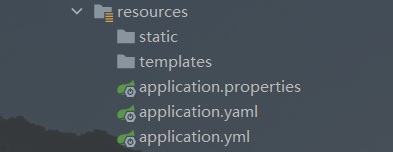

#### 字面量写法

在 YAML 中，使用`key:[空格]value`的形式表示一对键值对（空格不能省略）

```yaml
name: Alice		# 注意冒号与value之间要有空格
boolean: true	# true、TRUE、True都可以
```

如果value值中有空格，则需要加引号：双引号支持转义字符，单引号不支持转义

```yaml
str1: "hello world"	
str2: "hello\tworld"	# 双引号支持转义
str3: 'hello\tworld'	# 单引号不支持转义
```

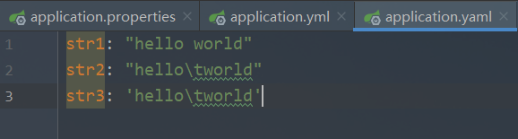

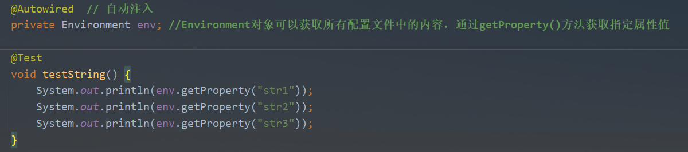

查看结果：
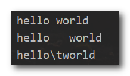


#### 对象写法

对象的格式是：`对象名: {key: value}`，对象可能包含多个属性(元素)，每一个属性都是一对键值对。

```yaml
countries:
  American: Washington
  Britain: London
  China:				# 对象的元素也可以是一个数组
    - Beijing
    - Tokyo
```

行内写法：

```yaml
countries: {American: Washington,Britain: London,China: [Beijing,Tokyo]}
```

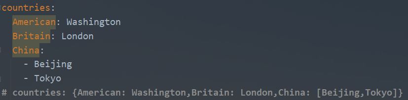

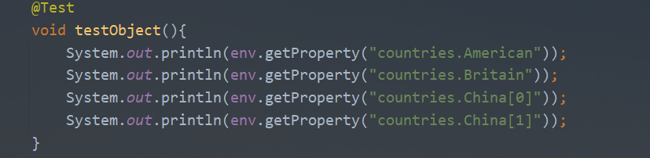

查看结果：
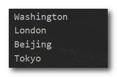


#### 数组写法

YAML 使用“-”表示数组中的元素，普通写法如下：

```yaml
# 普通数组
languages:
  - Chinese
  - English
  - French

# 对象数组
user:
  - name: Alice
    age: 18
  - name: Cindy
    age: 20

```

行内写法：

```yaml
# 普通数组
languages: [Chinese,English,French]
# 对象数组
user: [{name: Alice,age: 18},{name: Cindy,age: 20}]
```


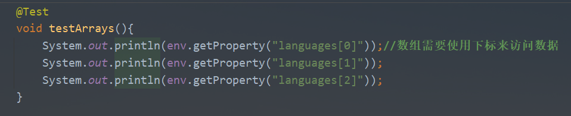

查看结果：
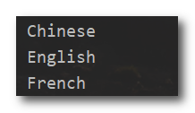

#### 数据引用

如果你在书写yaml数据时，经常出现如下现象，很多个文件都具有相同的目录前缀

```yaml
center:
	dataDir: /usr/local/fire/data
    tmpDir: /usr/local/fire/tmp
    logDir: /usr/local/fire/log
    msgDir: /usr/local/fire/msgDir
```

这个时候就可以使用引用格式来定义数据，其实就是定义了一个变量名，然后引用变量

```YAML
baseDir: /usr/local/fire
center:
    dataDir: ${baseDir}/data
    tmpDir: ${baseDir}/tmp
    logDir: ${baseDir}/log
    msgDir: ${baseDir}/msgDir
```


### 3. yaml数据读取

#### *@value*

yaml中保存的单个数据，可以使用Spring中的注解直接读取，使用`@Value`可以读取单个数据

> 使用方式：`@value(${属性名})`
>
> 如果属性名存在多层级：${一级属性名.二级属性名…}

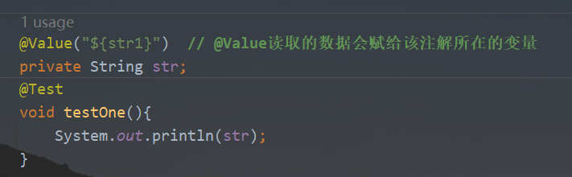


#### *Environment对象*

SpringBoot提供了一个`Environment`对象，能够把配置文件中所有的属性都封装到这一个对象中。（不需要手动创建该对象）

通过`getproperty("属性名")`即可获取该属性的值。


#### *@ConfigurationProperties*

首先定义一个类，并将该类纳入Spring管控的范围，然后使用注解`@ConfigurationProperties`指定加载配置文件中的对象。

定义类的属性要和需要加载的对象的属性一一对应，这样就可以将配置文件中对应的属性赋给自定义类的属性。

> `@ConfigurationProperties(value = "")`：读取配置文件中指定引用类型的变量信息，并将其值赋给类中对应的属性。
>
> value可以使用prefix替换，value值不能有大写字母，否则会报错，如果变量名有大写字母改成小写字母也能获取。

```java
    @Component  // 将此类交给Spring管理，才能为其属性自动注入
    @ConfigurationProperties(value = "usera")  // 读取配置文件中userA对象，并将其值赋给对应的属性
    public class User {

        private int id;
        private String name;
        private String email;
        ...
    }
```

在yaml文件中写入一个对象userA，包括id,name,email信息

```yaml
userA:
  id: 1001
  name: Alice
  email: "alice@qq.com"
```

打印User对象，看其属性是否注入了userA的值

```java
    @Autowired	// User类已经交由Spring管理了，所以可以自动注入User对象
    private User user;
    @Test
    void testUser(){
        System.out.println(user);
    }
```

查看结果

```java
User{id=1001, name='Alice', email='alice@qq.com'}	// 注入成功
```


### 4. 配置文件优先级

通常会使用properties、yml、ymal类型的文件来配置SpringBoot，如果三个配置文件同时存在，SpringBoot会优先读取properties类型的配置文件，其次是yml，最后是yaml。多个配置文件中有相同项的配置，优先级高的文件中的配置会覆盖优先级低的文件中的配置。如果配置项不同的话，那所有的配置项都会生效。相当于取所有配置文件的并集。

**验证结论**：properties文件 > yml文件 > yaml文件

配置三分不同的配置的文件：

- properties配置文件

```properties
server.port=6666	# 等号两边可以有空格，在读取的时候会被忽略，如果需要读取空格，需要进行转义
```

- yml配置文件

```yml
server:
  port: 7777		# 注意冒号与值之间要有空格
  
spring:
  main:
    banner-mode: off	# 关闭启动时控制台打印Spring
```

- yaml配置文件

```yaml
server:
  port: 8888
```

启动程序可以看到tomcat端口号为6666，说明properties的配置生效了，其优先级最高

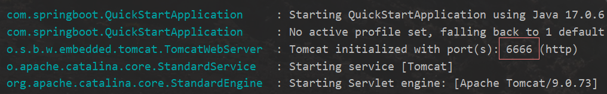

yml文件中配置的spring.main.banner-mode=off生效了，说明所有配置文件的配置项都会加载，有冲突的取优先级高的配置文件配置项

> `spring.main.banner-mode=off`表示关闭启动SpringBoot程序时打印的”Spring“

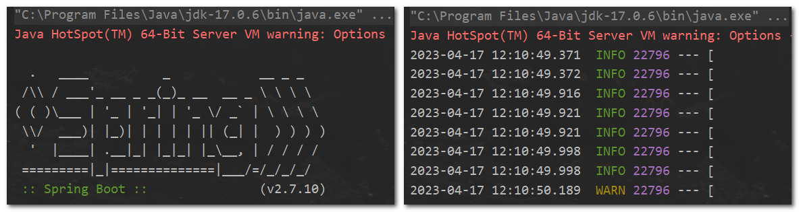

------


打开SpringBoot的官网，找到SpringBoot官方文档，打开查看附录中的Application Properties就可以查看所有配置项
https://docs.spring.io/spring-boot/docs/current/reference/html/application-properties.html#application-properties
