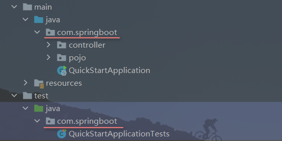
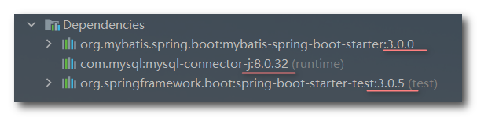
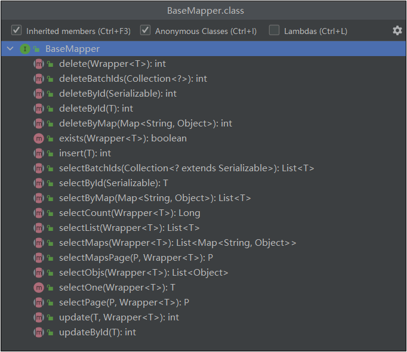

## SpringBoot整合第三方技术


### 1. 整合JUnit

导入测试的starter，这个在创建SpringBoot项目时是自动导入的

```xml
<dependency>
    <groupId>org.springframework.boot</groupId>
    <artifactId>spring-boot-starter-test</artifactId>
    <scope>test</scope>
</dependency>
```

测试类在test目录中与引导类同名的包中，编译后就会与引导类在同一包下，这个也是创建SpringBoot项目自动创建的



首先来看一下在Spring中测试类的使用：

> Spring中测试类需要使用的注解：
>
> - 加载spring整合junit专用的类运行器：`@RunWith(SpringJUnit4ClassRunner.class)`，这是固定写法
> - 加载配置信息（二选一）：
>   - `@ContextConfiguration(classes = SpringConfig.class)`：加载配置类信息。
>   - `@ContextConfiguration(locations = {"classpath:spring.xml"})`：加载配置文件信息。

```java
@RunWith(SpringJUnit4ClassRunner.class)
@ContextConfiguration(classes = SpringConfig.class)
class ApplicationTests{
	@Test
	void hello(){ 
       	System.out.println("hello");
    }
}
```

##### *@SpringBootTest*

再来看看SpringBoot中测试类的使用：

> SpringBoot测试类需要使用的注解：`@SpringBootTest`，这个注解结合了`@RunWith`和 `@ContextConfiguration`的功能。
>
> 这个注解默认加载同包下的引导类，如果测试类不在引导类所在包或其子包下，需要指定引导类的Class实例：
>
> `@SpringBootTest(classes = XXX.class)`（XXX为引导类名）

```java
@SpringBootTest(classes = Application.class)
class ApplicationTests {
	@Test
	void hello(){
        System.out.println("hello");
    }
}
```

------


### 2. 整合MyBatis

导入mybatis的starter和mysql数据库连接驱动依赖，在创建项目时勾选MyBatis Framework和MySQL Driver即可自动导入。

```xml
<!--导入mybatis的starter-->
<dependency>
     <groupId>org.mybatis.spring.boot</groupId>
     <artifactId>mybatis-spring-boot-starter</artifactId>
     <version>3.0.0</version><!--SpringBoot会根据自身的版本选择最佳的版本，这里SpringBoot是3.0.5-->
</dependency>

<!--mysql驱动，版本在parent中指定了-->
<dependency>
     <groupId>com.mysql</groupId>
     <artifactId>mysql-connector-j</artifactId>
     <scope>runtime</scope>
</dependency>
```

只要SpringBoot版本很新，它给我们导入的依赖的版本也会很新，这里SpringBoot是3.0.5版本



**(1) 配置数据源**

下面使用yml文件来保存配置信息

```yml
spring:
  datasource:
    driver-class-name: com.mysql.cj.jdbc.Driver
    url: jdbc:mysql://localhost:3306/mybatis?serverTimezone=UTC
    username: root
    password: 123456
```

**(2) 编写实体类**

##### *lombok的使用*

使用`lombok`技术快速制作实体类，首先导入lombok的依赖

```xml
<dependency>
    <groupId>org.projectlombok</groupId>
    <artifactId>lombok</artifactId>
</dependency>
```

> lombok中主要的注解：
>
> `@Getter`：提供get方法
> `@Setter`：提供set方法
> `@Date`：	提供get，set，toString，equals，hashCode等方法。注意不会提供构造方法，即使用默认的构造方法。
>
> `@AllArgsConstructor`：提供带有所有参数的构造方法
> `@NoArgsConstructor`：提供无参构造方法
> 创建了有参构造器，默认的无参构造器就没有了，所以这两个注解通常一起使用。

```java
@Date
@AllArgsConstructor
@NoArgsConstructor
public class Book {
    private Integer id;
    private String type;
    private String name;
    private String description;
}
```

**(3) 编写映射接口**

##### *@mapper*

> 注解`@Mapper`的作用是将Mapper接口交由Spring管理并且为其生成代理对象，这样不需要再配置Mapper接口扫描了

```java
@Mapper
public interface BookMapper {
    @Select("select * from tbl_book where id = #{id}")
    public Book getById(Integer id);
}
```

**(4) 编写测试类**

```java
@SpringBootTest
class MyBatisApplicationTests {
    @Autowired
    private BookMapper bookMapper;
    @Test
    void testGetById(){
        Book book = bookMapper.getById(1);
        System.out.println(book);
    }
}
// 输出结果：Book(id=1, type=计算机理论, name=Spring实战第五版, description=深入理解Spring原理技术内幕)
```

------


### 3. 整合MyBatisPlus

导入MyBatisPlus的starter，SpringBoot没有收录这项技术，所以需要手动导入

> 下面这个网站可以查看mybatisplus的starter的所有版本信息
>
> https://repo1.maven.org/maven2/com/baomidou/mybatis-plus-boot-starter

```xml
<!--MyBatisPlus的starter-->
<dependency>
    <groupId>com.baomidou</groupId>
    <artifactId>mybatis-plus-boot-starter</artifactId>	<!--注意与之前的命名不太一样-->
    <version>3.5.3</version>
</dependency>

<!--mysql驱动依赖-->
<dependency>
     <groupId>com.mysql</groupId>
     <artifactId>mysql-connector-j</artifactId>
     <scope>runtime</scope>
</dependency>

<!--lombok依赖：快速创建实体类-->
<dependency>
    <groupId>org.projectlombok</groupId>
    <artifactId>lombok</artifactId>
</dependency>
```


**(1) 配置数据源**

```yml
spring:
  datasource:
    driver-class-name: com.mysql.cj.jdbc.Driver
    url: jdbc:mysql://localhost:3306/mybatis?serverTimezone=UTC
    username: root
    password: 123456
```

**(2) 编写实体类**

```java
@Date
public class Book {
    private Integer id;
    private String type;
    private String name;
    private String description;
}
```

**(3) 编写映射接口**

##### *BaseMapper接口*

创建BookMapper接口继承MyBatisPlus的`BaseMapper`接口，并将实体类Book作为BaseMapper接口的泛型。

> BaseMapper接口内部预定了若干个常用的API接口，继承后可以直接使用。
>
> 常用的API接口指的是增删改查的方法，比如根据id查询、删除等等。
>
> 

```java
@Mapper
public interface BookMapper extends BaseMapper<Book> {}
```

这里还需要配置表名前缀，才能和实体类名相对应，因为数据库中表名是`tb_book`

```yml
mybatis-plus:
  global-config:
    db-config:
      table-prefix: tb_		#设置所有表的通用前缀名称为tb_
```

##### *@TableName*

当然还有更简单的方式解决表名映射问题，比如在实体类上上添加注解`@TableName(vlaue="表名")`

```java
@Data
@TableName("tb_book")	// 设置表tb_book和当前实体类Book相对应
public class Book {
    private Integer id;
    private String type;
    private String name;
    private String description;
}
```

**(4) 编写测试类**

```java
@SpringBootTest
class MyBatisPlusApplicationTests {

   @Autowired
   private BookMapper bookMapper;

    @Test
    void testMyBatisPlus() {
        Book book = bookMapper.selectById(2); //这个方法是BaseMapper为我们提供的，我们并没有写sql语句
        System.out.println(book);
    }
}
// 输出结果：Book(id=2, type=计算机理论, name=Spring5 核心原理, description=十年沉淀之作，手写Spring精华思想)
```

------


### 4. 整合Druid

整合druid有两种方式：

- **直接导入druid的依赖，然后配置数据源时通过type属性(连接池类型)指定为druid**

  ```xml
  <!--第一种方式：导入Druid依赖-->
  <dependency>
  	<groupId>com.alibaba</groupId>
  	<artifactId>druid</artifactId>
  	<version>1.2.5</version>
  </dependency>
  ```

  配置数据源

  ```yml
  # 配置数据源，通过type指定druid连接池
  spring:
    datasource:
      driver-class-name: com.mysql.cj.jdbc.Driver
      url: jdbc:mysql://localhost:3306/mybatis?serverTimezone=UTC
      username: root
      password: 123456
      type: com.alibaba.druid.pool.DruidDataSource  # 不指定默认是hikari连接池(这是小日本的技术)
  ```

- **导入druid的stater，使用druid数据源**

  ```xml
  <!--第二种方式：导入Druid的starter-->
  <dependency>
  	<groupId>com.alibaba</groupId>
  	<artifactId>druid-spring-boot-starter</artifactId>
  	<version>1.2.8</version>
  </dependency>
  ```

  配置数据源

  > 注意使用这种方式配置数据源，当前Springboot3.0以上的版本不支持
  
  ```yml
  # 直接使用阿里的druid数据源
  spring:
    datasource:
      druid:
        driver-class-name: com.mysql.cj.jdbc.Driver
        url: jdbc:mysql://localhost:3306/mybatis?serverTimezone=UTC
        username: root
        password: 123456
  ```
  
  

