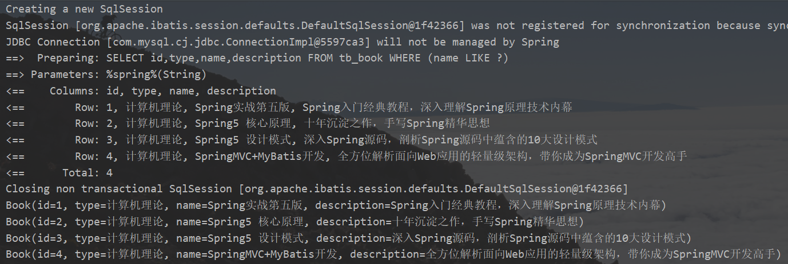
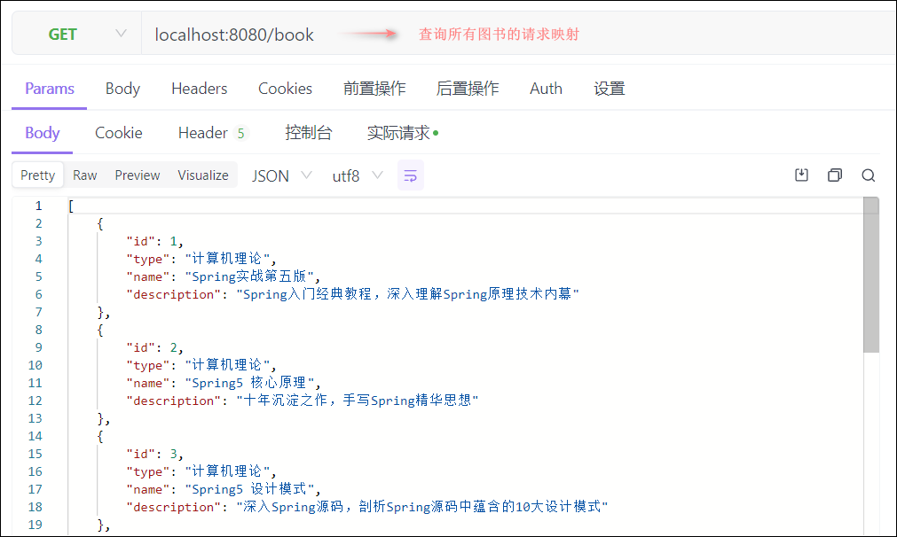
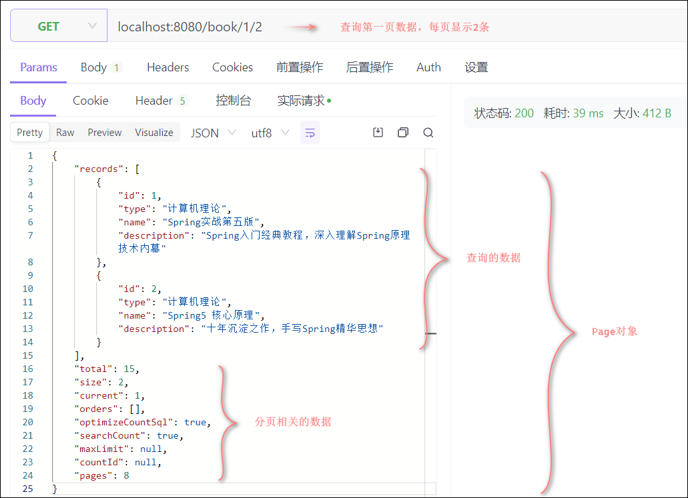
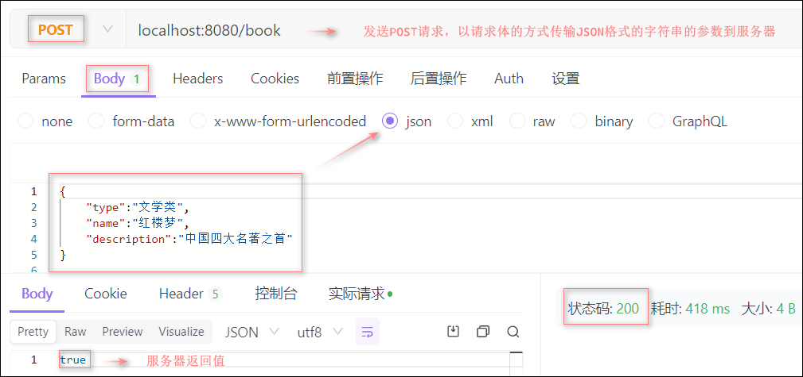
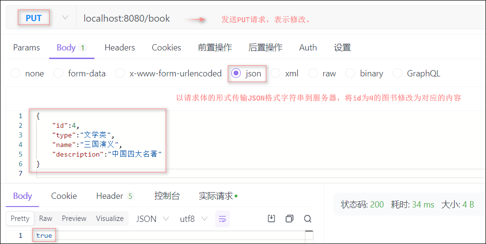
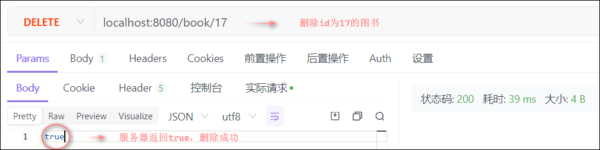
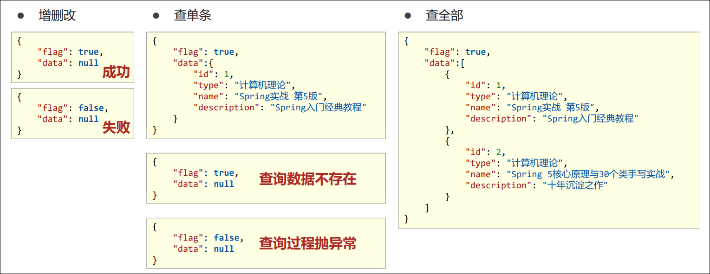
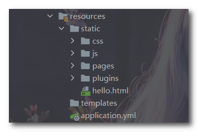
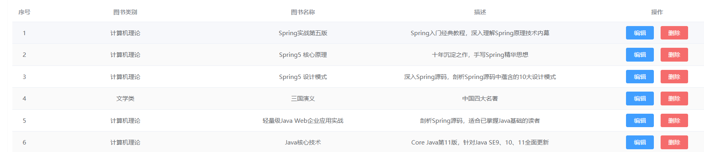

## SpringBoot整合SSMP案例

下面使用SpringBoot将Spring、SpringMVC、MyBatisPlus三个框架技术整合做一个简单的案例。

#### 1. 项目创建

首先创建一个SpringBoot项目，这里使用的是2.7.10版本，导入开发场景需要用到基础的依赖，后续可以慢慢补充

```xml
<dependencies>
    <!--MyBatisPlus的stater-->
    <dependency>
        <groupId>com.baomidou</groupId>
        <artifactId>mybatis-plus-boot-starter</artifactId>
        <version>3.5.3</version> 
    </dependency>

    <!--druid的starter-->
    <dependency>
        <groupId>com.alibaba</groupId>
        <artifactId>druid-spring-boot-starter</artifactId>
        <version>1.2.8</version>
    </dependency>

    <!--快速创建实体类的依赖-->
    <dependency>
        <groupId>org.projectlombok</groupId>
        <artifactId>lombok</artifactId>
    </dependency>
    
    <!--web开发需要用到的依赖-->
    <dependency>
        <groupId>org.springframework.boot</groupId>
        <artifactId>spring-boot-starter-web</artifactId>
    </dependency>
    
    <!--mysql数据库连接驱动-->
    <dependency>
        <groupId>com.mysql</groupId>
        <artifactId>mysql-connector-j</artifactId>
        <scope>runtime</scope>
    </dependency>
    
    <!--测试相关的依赖-->
    <dependency>
        <groupId>org.springframework.boot</groupId>
        <artifactId>spring-boot-starter-test</artifactId>
        <scope>test</scope>
    </dependency>
</dependencies>
```

------


#### 2. 实体类开发

##### (1) 创建数据库表

```sql
-- ----------------------------
-- Table structure for tbl_book
-- ----------------------------
DROP TABLE IF EXISTS `tbl_book`;
CREATE TABLE `tbl_book`  (
  `id` int(11) NOT NULL AUTO_INCREMENT,
  `type` varchar(20) CHARACTER SET utf8 COLLATE utf8_general_ci NULL DEFAULT NULL,
  `name` varchar(50) CHARACTER SET utf8 COLLATE utf8_general_ci NULL DEFAULT NULL,
  `description` varchar(255) CHARACTER SET utf8 COLLATE utf8_general_ci NULL DEFAULT NULL,
  PRIMARY KEY (`id`) USING BTREE
) ENGINE = InnoDB AUTO_INCREMENT = 51 CHARACTER SET = utf8 COLLATE = utf8_general_ci ROW_FORMAT = Dynamic;

-- ----------------------------
-- Records of tbl_book
-- ----------------------------
INSERT INTO `tbl_book` VALUES 
(1, '计算机理论', 'Spring实战 第5版', 'Spring入门经典教程，深入理解Spring原理技术内幕'),
(2, '计算机理论', 'Spring 5核心原理与30个类手写实战', '十年沉淀之作，手写Spring精华思想'),
(3, '计算机理论', 'Spring 5 设计模式', '深入Spring源码剖析Spring源码中蕴含的10大设计模式'),
(4, '计算机理论', 'Spring MVC+MyBatis开发从入门到项目实战','全方位解析面向Web应用的轻量级框架带你成为SpringMVC开发高手'),
(5, '计算机理论', '轻量级Java Web企业应用实战', '源码级剖析Spring框架，适合已掌握Java基础的读者'),
(6, '计算机理论', 'Java核心技术 卷I 基础知识（原书第11版）', 'Core Java 第11版，针对Java SE9、10、11全面更新'),
(7, '计算机理论', '深入理解Java虚拟机', '5个维度全面剖析JVM，大厂面试知识点全覆盖'),
(8, '计算机理论', 'Java编程思想（第4版）', 'Java学习必读经典,殿堂级著作！赢得了全球程序员的广泛赞誉'),
(9, '计算机理论', '零基础学Java（全彩版）', '零基础自学编程的入门图书，由浅入深，详解Java语言的编程思想和核心技术'),
(10, '市场营销', '直播就该这么做：主播高效沟通实战指南', '李子柒、李佳琦、薇娅成长为网红的秘密都在书中'),
(11, '市场营销', '直播销讲实战一本通', '和秋叶一起学系列网络营销书籍'),
(12, '市场营销', '直播带货：淘宝、天猫直播从新手到高手', '一本教你如何玩转直播的书，10堂课轻松实现带货月入3W+');
```

##### (2) 创建对应的实体类

```java
import lombok.Data;
@Data
@AllArgsConstructor	// 所有参数构造器
@NoArgsConstructor	// 无参构造器
public class Book {
    private Integer id;
    private String type;
    private String name;
    private String description;
}
```

------


#### 3. 数据层开发

##### (1) 基础CRUD

数据层开发本次使用MyBatisPlus技术，数据源使用DruidDataSource，使用yml文件配置数据源：

```yml
spring:
  datasource:
    druid:
      driver-class-name: com.mysql.cj.jdbc.Driver
      url: jdbc:mysql://localhost:3306/mybatis?serverTimezone=UTC
      username: root
      password: 123456
```

MP技术默认的主键生成策略为雪花算法，生成的主键ID长度较大，和目前的数据库设定规则不相符，需要配置MP使用数据库的主键生成策略，在application.yml中添加如下配置：

```yml
mybatis-plus:
  global-config:
    db-config:
      table-prefix: tb_		#设置表名通用前缀（这个可以用@TableName注解代替）
      id-type: auto			#设置主键id字段的生成策略为参照数据库设定的策略，当前数据库设置id生成策略为自增
```

编写Mapper接口：

> 这里使用MP提供的快速开发数据层的`BaseMapper`接口，其内部提供了简单的增删改查操作方法。

```java
@Mapper
public interface BookMapper extends BaseMapper<Book> {}
```

编写测试类测试CRUD：

```java
@SpringBootTest
class BookMapperTest {

    @Autowired
    private BookMapper bookMapper;

    /**
     * 测试根据id查询
     */
    @Test
    void testSelect() {
        System.out.println(bookMapper.selectById(1));
    }

    /**
     * 测试添加书籍
     */
    @Test
    void testInsert(){
        Book book = new Book(null, "经济学", "如何一夜暴富", "做梦");
        bookMapper.insert(book);
    }

    /**
     * 测试根据id修改
     */
    @Test
    void testUpdate(){
        Book book = new Book(13,"网络编程","Java从入门到放弃","程序猿必备书籍");
        bookMapper.updateById(book);
    }

    /**
     * 测试根据id删除
     */
    @Test
    void testDelete(){
        bookMapper.deleteById(13);
    }

}
// 上面这些增删改查的方法都是BaseMapper接口提供的，继承了该接口即可直接使用
```

查看MP运行日志，先对mybatisplus配置项进行日志的配置：

> 日志的配置在configuration属性中。注意`configuration`和`global-config`是同级的。

```yml
mybatis-plus:
  global-config:
    db-config:
      table-prefix: tb_		#设置表名通用前缀（这个可以用@TableName注解代替）
      id-type: auto			#设置主键id字段的生成策略为参照数据库设定的策略，当前数据库设置id生成策略为自增
  configuration:
    log-impl: org.apache.ibatis.logging.stdout.StdOutImpl	# stdout表示标准的输出
```

查看日志：


##### (2) 分页功能

首先回顾一下使用MyBatis分页插件进行分页：

> 第一步：开启分页功能 `PageHelper.startPage(int pageNum, int pageSize)`
>
> > 该方法返回一个`Page`对象，Page对象就是一个`List`集合，它是用来保存查询数据的，只不过该集合带有分页的相关信息，这些分页信息不会影响Page对象遍历查询数据。需要注意的是该对象中的查询数据是在执行了查询语句之后才有的，即执行了第二步后会将查询数据保存到Page对象中。不过`PageInfo`对象中分页相关的信息比Page更丰富，PageInfo对象中有一个`list`属性，而这个list属性就是Page对象，通常创建PageInfo对象来获取分页相关的信息。
>
> 第二步：查询所有数据返回一个集合`List<T> list`
>
> 第三步：创建分页信息对象`PageInfo<T> page = new PageInfo<>(List<T> list, int navigatePages);`
>
> *常用分页信息*：
>      `pageNum`：当前页的页码
>      `pageSize`：每页显示的条数
>      `size`：当前页显示的真实条数
>      `total`：总记录数
>      `pages`：总页数
>      `prePage`：上一页的页码
>      `nextPage`：下一页的页码
>      `isFirstPage/isLastPage`：是否为第一页/最后一页
>      `hasPreviousPage/hasNextPage`：是否存在上一页/下一页
>      `navigatePages`：导航分页的页码数
>      `navigatePageNums`：导航分页的页码。比如[1,2,3,4,5]

```java
@Service // 业务层
public class BookServiceImpl implements BookService {

    @Autowired
    private BookMapper bookMapper;

    @Override
    public PageInfo<Book> getAllBOokPage(Integer pageNum) {	// pageNum为当前页码
        // 开启分页功能，这个语句必须在查询语句开始前
        PageHelper.startPage(pageNum, 4); // 4的含义为设置每页显示4个
        // 查询所有图书的信息
        List<Book> list = bookMapper.getAllBook();
        // 获取分页对象
        PageInfo<Book> page = new PageInfo<>(list, 5); //navigatePage是导航分页的个数,其效果为[1,2,3,4,5]...
        return page;
    }
}
```


下面使用MyBatisPlus进行分页：

> 第一步：创建IPage接口实现类Page的对象 `IPage<T> page = new Page<T>(long current, long size)`
>
> 第二步：在**引导类**(配置类)中创建分页拦截器的bean让spring管理
>
> ```java
> @SpringBootApplication
> public class SsmpApplication {
> 
>     /**
>      * 创建M分页拦截器的bean
>      */
>     @Bean
>     public MybatisPlusInterceptor mybatisPlusInterceptor(){
>         MybatisPlusInterceptor interceptor = new MybatisPlusInterceptor();// 创建MP的拦截器
>         interceptor.addInnerInterceptor(new PaginationInnerInterceptor());// 添加分页拦截器
>         return interceptor;
>     }
> 
>     public static void main(String[] args) {
>         SpringApplication.run(SsmpApplication.class, args);
>     }
> 
> }
> ```
>
> 第三步：Page对象传入到MP提供的查询方法`selectPage(IPage<T> page, Wrapper<T> queryWrapper)`
>
> > queryWrapper为查询条件对象，设置为null即为查询全部内容并分页。

```java
	/**
     * 测试分页
     */
    @Test
    void testPage(){
        IPage page = new Page<Book>(1,5);// 创建IPage实现类对象
        bookMapper.selectPage(page, null);// 查询全部数据并分页
        System.out.println(page.getCurrent());// 获取当前页码
        System.out.println(page.getSize());// 获取每页显示数量
        System.out.println(page.getPages());// 获取总页数
        System.out.println(page.getTotal());// 获取总数量
        System.out.println(page.getRecords());// 获取查询数据，返回值是一个List列表
    }
```

查看结果：


##### (3) 条件查询

QueryWrapper对象是一个用于封装查询条件的对象，该对象可以动态调用API方法添加条件，最终转化成对应的SQL语句。

> QueryWrapper类继承了AbstractWrapper类，AbstractWrapper继承了Wrapper类还实现了Compare<Children, R>接口。
>
> Compare<Children, R>接口将多种比较查询条件封装成一个一个的方法，比如模糊查询方法like()、大于等于ge()、等于eq()

- 首先创建QueryWrapper对象：`QueryWrapper<T> qw = new QueryWrapper<>()`

  > 封装的是传入的泛型对应的表的操作。

- 其次使用QueryWrapper对象调用操作对应的方法，比如like()方法封装了模糊查询的操作

  > `like(R column, Object value)`: 表示封装 `查询指定字段column中包含value的数据` 的操作。其返回值还是qw对象。

- 最后将QueryWrapper对象传入查询方法中`selectList(Wrapper<T> queryMapper)`即可实现模糊查询

  > `selectList()`方法是查询所有的数据。

```java
    /**
     * 测试条件查询
     */
	@Test
    void testGetBy(){
        QueryWrapper<Book> qw = new QueryWrapper<>(); // 创建封装操作类对象

        //下面语句表示封装sql语句“ select * from tb_book name like %spring% ”成一个QueryWrapper的对象。
        qw.like("name", "spring");//第一个参数为字段名，第二个参数为匹配词。

        List<Book> books = bookMapper.selectList(qw); // 查询name包含“spring”的Book。
        books.forEach(book -> {
            System.out.println(book);
        });
    }
```

MP针对字段检查进行了功能升级，全面支持Lambda表达式，由QueryWrapper对象升级为LambdaQueryWrapper对象

> `LambdaQueryWrapper`对象中的like方法的字段名参数支持通过Lambda表达式获取，防止手动出入输错。
>
> 并且还提供了一个条件参数，可以防止将null数据作为条件使用：`like(Boolean condition,R column, Object val)`
>
> 如果condition条件为假，则like方法不执行。当然这个条件参数也可以不写（表示默认执行）。

```java
@Test
void testGetBy2(){
    String name = "1";
    LambdaQueryWrapper<Book> lqw = new LambdaQueryWrapper<Book>();
    // 第二个参数使用了方法引用获取name的值，相当于new Book().getName()
    lqw.like(Strings.isNotEmpty(name),Book::getName,"spring");// name值不为空则执行like方法
    bookMapper.selectList(lqw);
}
```

查看结果：



------


#### 4. 业务层开发

业务层的方法名要与业务有关，例如登录业务：`login(String username,String password)`

登录业务需要调用数据层的根据用户名和密码查询方法：`selectByUserNameAndPassword(String username,String password)`

下面只做简单的业务开发，所以业务方法名和数据层的方法名类似。

##### (1) 手动开发

首先定义一个业务层接口：

> 一般业务层只负责逻辑处理，所以将增删改的返回值设为布尔类型。影响记录数大于0则返回true。

```java
public interface BookService {
    Boolean save(Book book);
    Boolean update(Book book);
    Boolean delete(Integer id);
    Book getById(Integer id);
    List<Book> getAll();
    IPage<Book> getPage(int currentPage,int pageSize);
}
```

创建业务层实现类：

> 业务层调用数据层：通过数据层接口实现类对象调用数据层方法。

```java
@Service
public class BookServiceImpl implements BookService {

    @Autowired
    private BookMapper bookMapper;

    @Override
    public Boolean save(Book book) {
        return bookMapper.insert(book) > 0;
    }

    @Override
    public Boolean update(Book book) {
        return bookMapper.updateById(book) > 0;
    }

    @Override
    public Boolean delete(Integer id) {
        return bookMapper.deleteById(id) > 0;
    }

    @Override
    public Book getById(Integer id) {
        return bookMapper.selectById(id);
    }

    @Override
    public List<Book> getAll() {
        return bookMapper.selectList(null);
    }

    @Override
    public IPage<Book> getPage(int pageNum, int pageSize) {
        IPage page = new Page(pageNum,pageSize);
        bookMapper.selectPage(page,null);
        return page;
    }
}
```

##### (2) 快速开发

MP框架不仅提供了数据层快速开发的接口`BaseMapper`，MP也提供了业务层快速开发的接口`IService`，实际开发还是尽量不要用。

首先自定义一个业务层接口继承MP提供的`IService`接口：

```java
public interface IBookService extends IService<Book> {
    // 自定义一个查询所有数据且分页的业务方法getPage
    IPage<Book> getPage(Integer pageNum,Integer pageSize);
}
```

创建自定接口的实现类同时继承MP中的`ServiceImpl`类：

> 继承ServiceImpl类时需要指定两个泛型，一个是Mapper接口，一个是实体类。比如`ServiceImpl<BookMapper, Book>`

```java
@Service
public class IBookServiceImpl extends ServiceImpl<BookMapper, Book> implements IBookService {
	
    @Autowired
    private BookMapper bookMapper;
   //实现自定义抽象方法getPage
    @Override
    public IPage<Book> getPage(Integer pageNum, Integer pageSize) {
        IPage<Book> page = new Page<>(pageNum, pageSize);
        bookMapper.selectPage(page,null);
        return page;
    }
}
// ISevice接口中已经提供了分页功能方法page(IPage page)
```

对业务层接口进行测试：

> 这里测试的是MP提供的IService接口中的方法

```java
@SpringBootTest
public class IBookServiceTest {

    @Autowired
    private IBookService iBookService;

    //这里只是简单的增删改查，所以业务方法和数据层的方法差不多

    /**
     * 测试保存
     *
     * IService中的保存方法：save(Object entity)
     */
    @Test
    void testSave(){
        Book book = new Book(null, "经济学", "如何一夜暴富", "做梦");
        boolean save = iBookService.save(book);
        System.out.println(save);
    }

    /**
     * 测试修改
     *
     * IService接口中的修改方法：updateById(Object entity)
     */
    @Test
    void testUpdate(){
        Book book = new Book(18, "网络编程", "Java从入门到放弃", "程序猿必备书籍");
        System.out.println(iBookService.updateById(book));
    }

    /**
     * 测试删除
     *
     * IService中的删除方法：removeById(Integer id)
     */
    @Test
    void testDelete(){
        System.out.println(iBookService.removeById(18));
    }

    /**
     * 测试查询所有
     *
     * IService中的查询所有数据方法：list()
     */
    @Test
    void testGetAll(){
        iBookService.list().forEach(book -> {
            System.out.println(book);
        });
    }

    /**
     * 测试分页
     *
     * IService中的分页方法：page(IPage page)
     * BaseMapper中的分页方法：selectPage(IPage page, Wrapper queryWrapper)
     */
    @Test
    void testGetPage(){
        IPage<Book> page = new Page<Book>(2,5);
        iBookService.page(page);
        System.out.println(page.getCurrent());
        System.out.println(page.getSize());
        System.out.println(page.getTotal());
        System.out.println(page.getPages());
        System.out.println(page.getRecords());
    }
}
// 测试全部通过，这里就不列出来了
```

------


#### 5. 表现层开发

表现层基于Restful进行表现层接口开发，功能测试使用Apifox工具进行

首先编写控制层：

```java
@RestController
@RequestMapping("/book")
public class BookController {

    @Autowired
    private IBookService iBookService;

    /**
     * 查询所有图书
     */
    @GetMapping
    public List<Book> getAllBook(){
        return iBookService.list();
    }

    /**
     * 添加图书
     *
     * @RequestBody :将请求体中的参数赋给Book对象中同名的属性
     */
    @PostMapping
    public boolean addBook(@RequestBody Book book){
        return iBookService.save(book);
    }

    /**
     * 更新图书
     */
    @PutMapping
    public Boolean update(@RequestBody Book book){
        return iBookService.updateById(book);
    }

    /**
     * 删除图书
     *
     * @PathVariable : 将路径中占位符的参数赋给控制器方法形参
     */
    @DeleteMapping("/{id}")
    public Boolean delete(@PathVariable("id") Integer id){
        return iBookService.removeById(id);
    }

    /**
     * 查询指定图书
     */
    @GetMapping("/{id}")
    public Book getById(@PathVariable("id") Integer id){
        return iBookService.getById(id);
    }

    /**
     * 查询所有图书并且分页
     */
   @GetMapping("/{pageNum}/{pageSize}")
    public IPage<Book> getPage(@PathVariable("pageNum") int pageNum,@PathVariable("pageSize") int pageSize{
        return iBookService.page(new Page(pageNum,pageSize));
    }

}
```

下面使用Apifox工具模拟浏览器发送请求：

##### (1) GET请求






##### (2) POST请求




##### (3) PUT请求




##### (4) DELETE请求




##### (5) 前后端数据协议

通过测试可以发现，不同的操作会返回不同的数据类型，有布尔型的、有JSON格式字符串的、有JSON数组格式字符串的......多种格式的返回值不方便前端人员获取值，所以需要将所有操作返回的数据格式统一起来，这就需要设计表现层返回结果的模型类，用于后端与前端进行数据格式统一，也称为前后端数据协议。

```java
@Data
// 设计一个模型类R
public class R {
    // 这里设置了两种属性，
    private Boolean flag;// 是否执行成功
    private Object data;// 存储返回的数据
        
    public R(){}
    
    public R(Boolean flag){
        this.flag = flag;
    }
    public R(Boolean flag,Object data){
        this.flag = flag;
        this.data = data;
    }
}
```

设计了模型类R后，将表现层控制器方法的返回值统一成R类型：

```java
@RestController
@RequestMapping("/book")
public class BookController {

    @Autowired
    private IBookService iBookService;

    //查询所有图书
    @GetMapping
    public R getAllBook(){
        //return iBookService.list();
        return new R(true,iBookService.list());
    }

    //添加图书
    @PostMapping
    public R addBook(@RequestBody Book book){
        return new R(iBookService.save(book));
    }

    //更新图书
    @PutMapping
    public R update(@RequestBody Book book){
        return new R(iBookService.updateById(book));
    }
	
    //删除指定图书
    @DeleteMapping("/{id}")
    public R delete(@PathVariable Integer id){
        return new R(iBookService.removeById(id));
    }
    
	//查询指定图书
    @GetMapping("/{id}")
    public R getById(@PathVariable Integer id){
        return new R(true,iBookService.getById(id));
    }
    
	//查询所有图书并且分页
    @GetMapping("/{pageNum}/{pageSize}")
    public R getPage(@PathVariable("pageNum") int pageNum, @PathVariable("pageSize") int pageSize){
        return new R(true,iBookService.page(new Page(pageNum,pageSize)));
    }

}
```

这样返回的格式就统一成一个只有两个属性的JSON格式的字符串了：




#### 6. 页面功能开发

首先访问静态资源static中的pages目录下的books.html页面：`localhost:8080/pages/books.html`

> 需要注意的是，resources目录下的static目录下的资源可以直接访问，请求时不需要添加static前缀。
>
> 如下图访问hello.html：`localhost:8080/hello.html`
>
> 


##### (1) 列表功能

使用axios发送ajax请求获取所有图书并显示在页面上

> 这里使用了element组件，只需要将数据给dataList就会帮我们把dataList的数据展示出来

```js
// 列表
getAll() {
    axios.get('/book').then(response => {
        console.log(response.data.data)
        this.dataList = response.data.data
    })
}
```

下面是html代码：

```html
<el-table size="small" current-row-key="id" :data="dataList" stripe highlight-current-row>
   <el-table-column type="index" align="center" label="序号"></el-table-column>
   <el-table-column prop="type" label="图书类别" align="center"></el-table-column>
   <el-table-column prop="name" label="图书名称" align="center"></el-table-column>
   <el-table-column prop="description" label="描述" align="center"></el-table-column>
   <el-table-column label="操作" align="center">
       <template slot-scope="scope">
       <el-button type="primary" size="mini" @click="handleUpdate(scope.row)">编辑</el-button>
       <el-button type="danger" size="mini" @click="handleDelete(scope.row)">删除</el-button>
       </template>
   </el-table-column>
 </el-table>
```

效果展示：




##### (2) 添加功能

定义一个变量控制添加弹窗是否显示，点击添加修改该变量的值弹出窗口

```js
 //弹出添加窗口
  handleCreate() {
      // 设置添加表单可见
      this.dialogFormVisible = true
      // 重置表单数据
      this.resetForm()
  }
```

发送post请求将数据传输给服务器

```js
//添加
 handleAdd() {
     // 先判断表单项是否为空
     if (this.formData.type == "" && this.formData.title == "" && this.formData.description == "") {
        // axios中post()方法用于发送post请求，方法第一个参数为url，第二个参数为传输的数据（请求体的形式）
        axios.post("/book", this.formData).then(response => {
            // 判断当前操作是否成功
            if (response.data.flag) {
                // 添加数据后关闭弹层
                this.dialogFormVisible = false
                // 弹窗提示（这是element组件中的功能）
                this.$message.success('添加成功')
            } else {
                this.$message.error('添加失败')
            }
         }).finally(() => {    // finally()函数是axios封装的，不管成功与否都会执行此函数
             // 重新刷新数据
             this.getAll()
         })
     } else {
         this.$message.info('请输入完整信息')
     }
 }
```

html代码：

```html
 <!-- 添加图书弹层 -->
    <div class="add-form">
     <el-dialog title="新增图书" :visible.sync="dialogFormVisible">
      <el-form ref="dataAddForm" :model="formData" :rules="rules" label-position="right"
               label-width="100px">
          <el-row>
              <el-col :span="12">
                  <el-form-item label="图书类别" prop="type">
                      <el-input v-model="formData.type"/>
                  </el-form-item>
              </el-col>
              <el-col :span="12">
                  <el-form-item label="图书名称" prop="name">
                      <el-input v-model="formData.name"/>
                  </el-form-item>
              </el-col>
          </el-row>
          <el-row>
              <el-col :span="24">
                  <el-form-item label="描述">
                      <el-input v-model="formData.description" type="textarea"></el-input>
                  </el-form-item>
              </el-col>
          </el-row>
      </el-form>
      <div slot="footer" class="dialog-footer">
          <el-button @click="cancel()">取消</el-button>
          <el-button type="primary" @click="handleAdd()">确定</el-button>
      </div>
  </el-dialog>
  </div>
```


##### (3) 删除功能

发送delete请求，传入id参数，删除指定图书

```js
 // 删除
handleDelete(row) {
   	// this.$confirm()：弹出确认框框。
   	// 该方法第一个参数为提示内容，第二个参数为提示标题，第三个参数为消息类型（对象形式）。该方法返回一个promise对象。
    this.$confirm('此操作永久删除，是否继续', '提示', {type: 'info'}).then(
    	// 成功回调函数
        () => {
   		    // row存储了当前行组件中的图书对象
            // console.log(row)
            axios.delete('/book/' + row.id).then(
                // 成功回调函数。参数为一个成功的对象
                response => {
                     if (res.data.flag) this.$message.success('删除成功')
                     // 数据可能被别人删除了，但是页面还没来得及更新，再次删除时删除失败返回flag的值为false
                     else this.$message.error('数据同步异常，已重新加载数据')
                },
                // 失败回调函数。参数为一个失败(错误)的对象
                // 处理响应响应结果可以不用then的失败回调，这里只是演示一下可以这样操作。
                error => {
                    this.$message.error('删除失败：' + error.message) // error.message获取错误信息
                }).finally(() => {
                	this.getAll()
            })
         },
         // 失败回调函数。确认框点击取消了就表示失败。当然也可以用catch()捕获失败
         () => {
            // 取消删除
            this.$message.info('取消删除操作')
       	 }
     )
 }
```

html代码：

```html
 <el-table-column label="操作" align="center">
     <template slot-scope="scope">
     <!-- scope指的是当前行组件对象，scope.row表示获取该组件中图书对象 -->
     <el-button type="primary" size="mini" @click="handleUpdate(scope.row)">编辑</el-button>
     <el-button type="danger" size="mini" @click="handleDelete(scope.row)">删除</el-button>
     </template>
 </el-table-column>
```


##### (4) 编辑功能

定义一个变量控制编辑弹窗是否显示，点击编辑，修改该变量的值弹出窗口。（编辑弹窗和添加弹窗一模一样，但不是同一个）

```js
//弹出编辑窗口
 handleUpdate(row) {
     // 发送get请求根据id查询需要修改的图书用于显示
     axios.get('/book/' + row.id).then(
         // 成功回调
         res => {
           // 数据可能被别人删除了，但是页面还没来得及更新，点击编辑时，根据id查询成功，返回flag的值为true，但查询结果为null
           if (res.data.flag && res.data.data != null) {
               // 查询成功则将数据赋给formData，并且弹出编辑窗口
               this.formData = res.data.data
               this.dialogFormVisibleEdit = true
           } else {
               this.$message.error('数据同步异常，已重新加载数据')
           }
     	}, 
        // 错误回调
        error => {
            this.$message.error('出现错误：' + error.message)
        }).finally(() => {
        // 重新刷新数据
        this.getAll()
      })
  }
```

发送put请求修改信息

```js
//修改
handleEdit() {
     // 先判断表单项是否为空
     if (this.formData.type != "" && this.formData.name != "" && this.formData.description != "") {
           // axios中post()方法发送post请求，方法第一个参数为url，第二个参数为传输的数据（请求体的形式）
           axios.put("/book", this.formData).then(response => {
               if (response.data.flag) {
                   // 弹窗提示
                   this.$message.success('修改成功')
                   // 添加数据后关闭弹层
                   this.dialogFormVisibleEdit = false
               } else {
                   this.$message.error('数据同步异常，已重新加载数据')
               }
           }).finally(() => {    // finally()函数是axios封装的，不管成功与否都会执行此函数
               // 重新刷新数据
               this.getAll()
           })
       } else {
           this.$message.error('请输入完整信息')
       }
 }
```


##### (5) 异常消息处理

首先给模型类R添加消息属性：

```java
//设计一个模型类
@Data
public class R {

    private Boolean flag;// 是否执行成功
    private Object data;// 返回的数据
    private String msg;	// 提示消息

    public R(){
    }
    public R(Boolean flag){
        this.flag = flag;
    }
    public R(Boolean flag,Object data) {
        this.flag = flag;
        this.data = data;
    }
    public R(String msg){
        this.flag = false;
        this.msg = msg;
    }
    public R(Boolean flag,String msg){
        this.flag = flag;
        this.msg = msg;
    }
}
```

定义一个异常处理器：

```Java
/* 定义一个异常处理器：
*  使用@ControllerAdvice注解标记为异常处理器，它的作用是捕获处理异常。
*  使用@RestControllerAdvice注解标记为异常处理器，该注解相较于上一个包含了@ResponseBody的功能。
*
* */
@RestControllerAdvice
public class MyExceptionAdvice {

    // 可以使用@ExceptionHandler指定捕获的异常
    // @ExceptionHandler(NullPointerException.class)
    @ExceptionHandler(Exception.class)
    public R doException(Exception e){
        /*
        这里需要处理的事：
            记录日志
            发消息给运维
            发邮件给开发人员
        */
        e.printStackTrace();
        return new R("系统错误，请稍后再试！");
    }
}
```

将添加成功与失败的消息提示内容交给后端处理

```Java
@PostMapping
    public R addBook(@RequestBody Book book){
        boolean flag = iBookService.save(book);
        return new R(flag,flag?"添加成功^_^":"添加失败-_-");
    }
```


##### (6) 分页功能

将分页相关数据封装到pagination中：

```js
pagination: {				//分页相关模型数据
            currentPage: 1,	//当前页码
            pageSize: 10,	//每页显示的记录数
            total: 0		//总记录数
        }
```

将列表功能改为分页功能：

```Java
//分页列表
getAll() {
    axios.get(`/book/${this.pagination.currentPage}/${this.pagination.pageSize}`).then(response => {
      // 查询后需要将分页的数据赋给pagination
      this.pagination.total = response.data.data.total;
      this.pagination.currentPage = response.data.data.current;
      this.pagination.pagesize = response.data.data.size;
      // 将分页后records中的列表数据赋给dataList
      this.dataList = response.data.data.records; 
  	})
}
 
//切换页码
handleCurrentChange(currentPage) { // 当页面发生变化时调用此函数，接收的参数为当前页码
	this.pagination.currentPage = currentPage;
	this.getAll();
}
```

修改分页的功能，当当前页码大于总页码时，显示最后一页的数据

```Java
@GetMapping("/{pageNum}/{pageSize}")
public R getPage(@PathVariable("pageNum") int pageNum, @PathVariable("pageSize") int pageSize){
	// 这里使用了MP封装的service层方法page()，该方法返回一个page对象
    Page page = iBookService.page(new Page(pageNum, pageSize));
    // 如果当前页码值大于了总页码值，那么重新执行查询操作，使用最大页码值作为当前页码值
    if(pageNum > page.getPages()){
        page = iBookService.page(new Page(page.getPages(),pageSize));
    }
    return new R(true,page);
}
```


##### (7) 查询功能

分页查询的时候除了携带分页数据再多带几个查询的数据，所以将查询的参数也封装到分页模型中：

```js
//分页相关模型数据
pagination: {		
	currentPage: 1,		//当前页码
	pageSize:10,		//每页显示的记录数
	total:0,			//总记录数
	name: "",			//根据名字查询
	type: "",			//根据类型查询
	description: ""		//根据描述查询
}
```

使用Vue的双向数据绑定将type、name、description绑定到对应的表单上：

```html
<el-input placeholder="图书类别" v-model="pagination.type" style="width: 200px;" class="filter-item"/>
<el-input placeholder="图书名称" v-model="pagination.name" style="width: 200px;" class="filter-item"/>
<el-input placeholder="图书描述" v-model="pagination.description" style="width: 200px;" class="filter-item"/>
```

业务层接口使用自定义方法

```java
// 条件查询且分页
IPage<Book> getPage(Integer pageNum,Integer pageSize,Book book);
```

实现自定义的方法

```java
 // 实现自定义的抽象方法
    @Override
    public IPage<Book> getPage(Integer pageNum, Integer pageSize,Book book) {
        IPage<Book> page = new Page<>(pageNum, pageSize);
        // 创建封装操作类对象
        LambdaQueryWrapper<Book> lqw = new LambdaQueryWrapper<>();
        // like()：模糊查询
        // 第一个参数为判断条件，为true则执行该方法
        // 第二个参数为Book对象中属性对应表中的字段
        // 第三个参数为模糊查询传入的值
        lqw.like(Strings.isNotEmpty(book.getName()),Book::getName,book.getName());
        lqw.like(Strings.isNotEmpty(book.getType()),Book::getType,book.getType());
        lqw.like(Strings.isNotEmpty(book.getDescription()),Book::getDescription,book.getDescription());
        // selectPage()第一个参数为分页对象，第二个参数为封装操作类对象
        bookMapper.selectPage(page,lqw);
        return page;
    }
```

将分页与条件查询功能合并

```js
//条件查询且分页
getAll() {
    // 获取查询条件,拼接查询条件
    param = "?name=" + this.pagination.name;
    param += "&type=" + this.pagination.type;
    param += "&description=" + this.pagination.description;
                axios.get(`/book/${this.pagination.currentPage}/${this.pagination.pageSize}${param}`).then(response => {
    // 查询后需要将分页的数据赋给pagination
    this.pagination.total = response.data.data.total;
    this.pagination.currentPage = response.data.data.current;
    this.pagination.pagesize = response.data.data.size;
    // 将分页后records中的列表数据赋给dataList
    this.dataList = response.data.data.records;
  })
}
```


##### 页面整体代码

```html
<!DOCTYPE html>

<html>

<head>

    <!-- 页面meta -->
    <meta charset="utf-8">
    <meta http-equiv="X-UA-Compatible" content="IE=edge">
    <title>基于SpringBoot整合SSM案例</title>
    <meta content="width=device-width,initial-scale=1,maximum-scale=1,user-scalable=no" name="viewport">

    <!-- 引入样式 -->
    <link rel="stylesheet" href="../plugins/elementui/index.css">
    <link rel="stylesheet" href="../plugins/font-awesome/css/font-awesome.min.css">
    <link rel="stylesheet" href="../css/style.css">
</head>

<body class="hold-transition">
<div id="app">
    <div class="content-header">
        <h1>图书管理</h1>
    </div>
    <div class="app-container">
        <div class="box">
            <div class="filter-container">
                <el-input placeholder="图书类别" v-model="pagination.type" style="width: 200px;"
                          class="filter-item"></el-input>
                <el-input placeholder="图书名称" v-model="pagination.name" style="width: 200px;"
                          class="filter-item"></el-input>
                <el-input placeholder="图书描述" v-model="pagination.description" style="width: 200px;"
                          class="filter-item"></el-input>
                <el-button @click="getAll()" class="dalfBut">查询</el-button>
                <el-button type="primary" class="butT" @click="handleCreate()">新建</el-button>
            </div>
            <el-table size="small" current-row-key="id" :data="dataList" stripe highlight-current-row>
                <el-table-column type="index" align="center" label="序号"></el-table-column>
                <el-table-column prop="type" label="图书类别" align="center"></el-table-column>
                <el-table-column prop="name" label="图书名称" align="center"></el-table-column>
                <el-table-column prop="description" label="描述" align="center"></el-table-column>
                <el-table-column label="操作" align="center">
                    <template slot-scope="scope">
                    <!-- scope指的是当前行组件对象，scope.row表示获取该组件中图书对象 -->
                    <el-button type="primary" size="mini" @click="handleUpdate(scope.row)">编辑</el-button>
                    <el-button type="danger" size="mini" @click="handleDelete(scope.row)">删除</el-button>
                    </template>
                </el-table-column>
            </el-table>

            <!--分页组件-->
            <div class="pagination-container">
                <el-pagination
                        class="pagiantion"
                        @current-change="handleCurrentChange"
                        :current-page="pagination.currentPage"
                        :page-size="pagination.pageSize"
                        layout="total, prev, pager, next, jumper"
                        :total="pagination.total">
                </el-pagination>
            </div>

            <!-- 新增标签弹层 -->
            <div class="add-form">
                <el-dialog title="新增图书" :visible.sync="dialogFormVisible">
                    <el-form ref="dataAddForm" :model="formData" :rules="rules" label-position="right"
                             label-width="100px">
                        <el-row>
                            <el-col :span="12">
                                <el-form-item label="图书类别" prop="type">
                                    <el-input v-model="formData.type"/>
                                </el-form-item>
                            </el-col>
                            <el-col :span="12">
                                <el-form-item label="图书名称" prop="name">
                                    <el-input v-model="formData.name"/>
                                </el-form-item>
                            </el-col>
                        </el-row>
                        <el-row>
                            <el-col :span="24">
                                <el-form-item label="描述">
                                    <el-input v-model="formData.description" type="textarea"></el-input>
                                </el-form-item>
                            </el-col>
                        </el-row>
                    </el-form>
                    <div slot="footer" class="dialog-footer">
                        <el-button @click="cancel()">取消</el-button>
                        <el-button type="primary" @click="handleAdd()">确定</el-button>
                    </div>
                </el-dialog>
            </div>

            <!-- 编辑标签弹层 -->
            <div class="add-form">
                <el-dialog title="编辑检查项" :visible.sync="dialogFormVisibleEdit">
                    <el-form ref="dataEditForm" :model="formData" :rules="rules" label-position="right"
                             label-width="100px">
                        <el-row>
                            <el-col :span="12">
                                <el-form-item label="图书类别" prop="type">
                                    <el-input v-model="formData.type"/>
                                </el-form-item>
                            </el-col>
                            <el-col :span="12">
                                <el-form-item label="图书名称" prop="name">
                                    <el-input v-model="formData.name"/>
                                </el-form-item>
                            </el-col>
                        </el-row>
                        <el-row>
                            <el-col :span="24">
                                <el-form-item label="描述">
                                    <el-input v-model="formData.description" type="textarea"></el-input>
                                </el-form-item>
                            </el-col>
                        </el-row>
                    </el-form>

                    <div slot="footer" class="dialog-footer">
                        <el-button @click="cancel()">取消</el-button>
                        <el-button type="primary" @click="handleEdit()">确定</el-button>
                    </div>
                </el-dialog>
            </div>
        </div>
    </div>
</div>
</body>

<!-- 引入组件库 -->
<script src="../js/vue.js"></script>
<script src="../plugins/elementui/index.js"></script>
<script type="text/javascript" src="../js/jquery.min.js"></script>
<script src="../js/axios-0.18.0.js"></script>
<script>
    const vm = new Vue({
        el: '#app',
        data: {
            dataList: [],//当前页要展示的列表数据
            dialogFormVisible: false,//添加表单是否可见
            dialogFormVisibleEdit: false,//编辑表单是否可见
            formData: {},//表单数据
            rules: {//校验规则
                type: [{required: true, message: '图书类别为必填项', trigger: 'blur'}],
                name: [{required: true, message: '图书名称为必填项', trigger: 'blur'}]
            },
            pagination: {//分页相关模型数据
                currentPage: 1,//当前页码
                pageSize: 10,//每页显示的记录数
                total: 0,//总记录数
                type: "",
                name: "",
                description: ""
            }
        },

        //钩子函数，VUE对象初始化完成后自动执行
        created() {
            this.getAll()
        },

        methods: {
            //列表
            /* getAll() {
                 axios.get('/book').then(response => {
                     // console.log(response.data.data)
                     this.dataList = response.data.data
                 })
             },*/

            //分页列表
            /* getAll() {
                axios.get(`/book/${this.pagination.currentPage}/${this.pagination.pageSize}`).then(response => {
                    // 查询后需要将分页的数据赋给pagination
                    this.pagination.total = response.data.data.total;
                    this.pagination.currentPage = response.data.data.current;
                    this.pagination.pagesize = response.data.data.size;
                    // 将分页后records中的列表数据赋给dataList
                    this.dataList = response.data.data.records;
                })
            },*/


            //条件查询且分页
            getAll() {
                // 获取查询条件,拼接查询条件
                param = "?name=" + this.pagination.name;
                param += "&type=" + this.pagination.type;
                param += "&description=" + this.pagination.description;
                axios.get(`/book/${this.pagination.currentPage}/${this.pagination.pageSize}${param}`).then(response => {
                    // 查询后需要将分页的数据赋给pagination
                    this.pagination.total = response.data.data.total;
                    this.pagination.currentPage = response.data.data.current;
                    this.pagination.pagesize = response.data.data.size;
                    // 将分页后records中的列表数据赋给dataList
                    this.dataList = response.data.data.records; 
                })
            },

            //切换页码
            handleCurrentChange(currentPage) { // 当页面发生变化时调用此函数，接收的参数为当前页码
                this.pagination.currentPage = currentPage;
                this.getAll();
            },

            //弹出添加窗口
            handleCreate() {
                // 设置添加表单可见
                this.dialogFormVisible = true
                // 重置表单数据
                this.resetForm()
            },

            //重置表单
            resetForm() {
                this.formData = {type: '', name: '', description: ''}
            },

            //添加
            handleAdd() {
                // 先判断表单项是否为空
                if (this.formData.type != "" && this.formData.name != "" && this.formData.description != "") {
                    // axios中post()方法发送post请求，方法第一个参数为url，第二个参数为传输的数据（请求体的形式）
                    axios.post("/book", this.formData).then(response => {
                        // 判断当前操作是否成功
                        if (response.data.flag) {
                            // 添加数据后关闭弹层
                            this.dialogFormVisible = false
                            // 弹窗提示（这是组件中的功能）
                            this.$message.success(response.data.msg)
                        } else {
                            this.$message.error(response.data.msg)
                        }
                    }).finally(() => {    // finally()函数是axios封装的，不管成功与否都会执行此函数
                        // 重新刷新数据
                        this.getAll()
                    })
                } else {
                    this.$message.info('请输入完整信息')
                }
            },

            //取消
            cancel() {
                this.dialogFormVisible = false
                this.dialogFormVisibleEdit = false
                this.$message.info('你取消了操作')
            },
            // 删除
            handleDelete(row) {
                // this.$confirm()：弹出确认框框。第一个参数为提示内容，第二个参数为提示标题，第三个参数为消息类型（对象形式）。该方法返回一个promise对象。
                this.$confirm('此操作永久删除，是否继续', '提示', {type: 'info'}).then(
                    // 成功回调函数
                    () => {
                        // row存储了当前行组件中的图书对象
                        // console.log(row)
                        axios.delete('/book/' + row.id).then(
                            // 成功回调函数
                            (res) => {
                                if (res.data.flag) this.$message.success('删除成功')
                                // 数据可能被别人删除了，但是页面还没来得及更新，再次删除时删除失败返回flag的值为false
                                else this.$message.error('数据同步异常，已重新加载数据')
                            },
                            // 失败回调函数（代码出错会调用此函数）
                            error => {
                                this.$message.error('出现异常：' + error.message) // error.message获取错误信息
                            }).finally(() => {
                            this.getAll()
                        })
                    },
                    // 失败回调函数。确认框点击取消了就表示失败。当然也可以用catch()捕获失败
                    () => {
                        // 取消删除
                        this.$message.info('取消删除操作')
                    })

            },

            //弹出编辑窗口
            handleUpdate(row) {
                // 发送get请求根据id查询需要修改的图书用于显示
                axios.get('/book/' + row.id).then(
                    // 成功回调
                    res => {
                        // 数据可能被别人删除了，但是页面还没来得及更新，点击编辑时，根据id查询成功，返回flag的值为true，但查询结果为null
                        if (res.data.flag && res.data.data != null) {
                            this.formData = res.data.data
                            this.dialogFormVisibleEdit = true
                        } else {
                            this.$message.error('数据同步异常，已重新加载数据')
                        }
                    },
                    // 错误回调
                    error => {
                        this.$message.error('出现错误：' + error.message)
                    }).finally(() => {
                    // 重新刷新数据
                    this.getAll()
                })
            },

            //修改
            handleEdit() {
                // 先判断表单项是否为空
                if (this.formData.type != "" && this.formData.name != "" && this.formData.description != "") {
                    // axios中post()方法发送post请求，方法第一个参数为url，第二个参数为传输的数据（请求体的形式）
                    axios.put("/book", this.formData).then(response => {
                        if (response.data.flag) {
                            // 弹窗提示
                            this.$message.success('修改成功')
                            // 添加数据后关闭弹层
                            this.dialogFormVisibleEdit = false
                        } else {
                            this.$message.error('数据同步异常，已重新加载数据')
                        }
                    }).finally(() => {    // finally()函数是axios封装的，不管成功与否都会执行此函数
                        // 重新刷新数据
                        this.getAll()
                    })
                } else {
                    this.$message.error('请输入完整信息')
                }
            },
        }
    })
</script>
</html>
```

