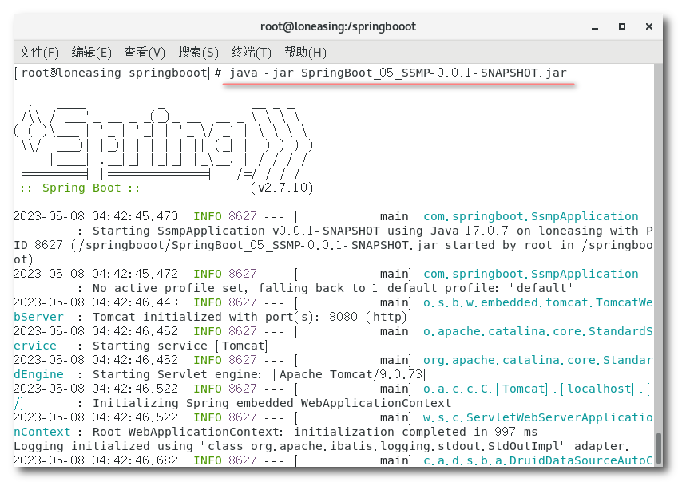
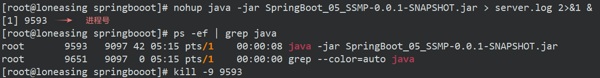
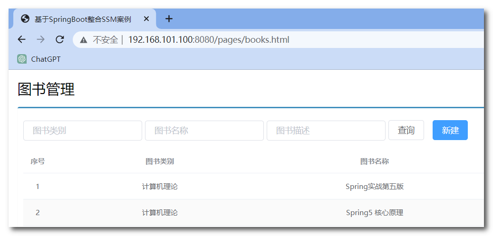
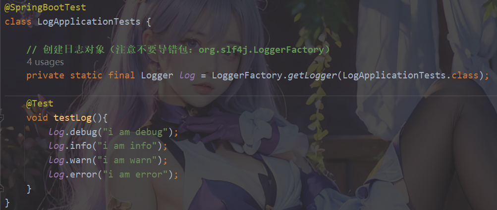
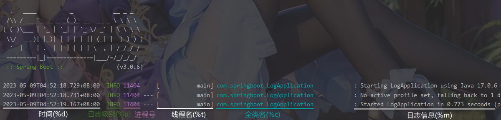
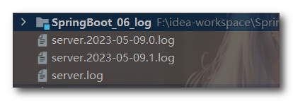

## SpringBoot运维篇


### 1. 打包与运行

**程序打包**

SpringBoot程序是基于Maven创建的，在Maven中提供有打包的插件，双击即可完成打包。

或者在idea的命令行窗口中使用命令：`mvn package`

打包后会产生一个与工程名类似的jar文件，其名称是由模块名+版本号+.jar组成的。

**程序运行**

使用命令：`java -jar jar包` 即可运行程序。使用该命令之前必须要确保已安装`jdk`环境。

注意：打好的jar包要想正常运行，pom文件中一定要有`spring-boot-maven-plugin`插件（默认引入的）

```xml
<build>
    <plugins>
        <plugin>
            <groupId>org.springframework.boot</groupId>
            <artifactId>spring-boot-maven-plugin</artifactId>
        </plugin>
    </plugins>
</build>
```


### 2. 在Linux上运行SpringBoot程序

首先将SpringBoot程序打成jar包，然后上传到Linux服务器中。

在linux中运行jar包也是使用命令：`jave -jar jar包` 。使用该命令之前必须要确保已安装`jdk`环境。




使用上述命令启动SpringBoot程序是前台启动，后台启动命令：`nohup java -jar jar包 > 日志文件.log 2>&1 &`

> nohup表示后台启动；『>』表示输出重定向到日志文件中；2>&1是将标准错误输出重定向到标准输出。
>
> 后台启动后若想关闭程序需要使用kill命令终止进程：`kill -9 进程号`。（使用`ps -ef | grep java` 查看进程号）




在本地浏览器中输入〔该虚拟机的IP地址:端口/资源路径〕访问运行的springboot项目。

> 前提要在linux系统中安装mysql环境（linux笔记有详细介绍），并且创建数据库表。




### 3. 配置属性

##### 临时属性设置

SpringBoot提供了灵活的属性配置方式，如果打包的项目中有个别属性需要重新配置，可以在运行jar包时重新设置属性的值。

使用方式：`java -jar springboot.jar --name=value`

```bash
// 比如临时修改tomcat服务器端口
java -jar springboot.jar --server.port=80
// 同时设置多个属性
java -jar springboot.jar --server.port=80 --logging.level.root=debug
```

注意：临时配置的属性的值传递给了main()方法的args参数。**临时属性的加载优先级要高于配置文件的。**

##### 配置文件分类

SpringBoot提供了四个级别的配置文件，分别是：

- 类路径下配置文件（也就是resources目录中的application.yml或application.properties文件）
- 类路径下config目录下配置文件（也就是类路径下创建一个config目录，然后将配置文件放置其中）
- 程序包所在目录中配置文（也就是jar所在目录下的配置文件）
- 程序包所在目录中config目录下配置文件

他们的加载顺序依次靠后，所以**优先级依次增高**（后加载的配置覆盖前面加载的配置）。


### 4. 多环境开发

##### yaml单一文件版

下面是application.yaml文件

```yml
spring:
	profiles:
		active: pro		# 激活pro环境
---		# ---表示文件分割符，每一次分隔都相当于一个新的配置文件
spring:
	profiles: pro	# profiles表示当前环境的名字
server:
	port: 80
---
spring:
	profiles: dev
server:
	port: 81
---
spring:
	profiles: test
server:
	port: 82
```

上述的格式是过时的，下面是标准格式

```yaml
spring:
	config:
    	activate:
        	on-profile: pro
```


##### yaml多文件版

**yaml环境配置文件的命名规则**：`aplication-环境名.yaml`

主配置文件application.yaml

```yaml
spring:
	profiles:
		active: pro		# 激活pro环境
```

下面是两组环境配置文件：

application-dev.yaml

```yaml
server:
	port: 80
```

application-pro.yaml

```yaml
server:
	port: 81
```


##### properties多文件版

**properties环境配置文件的命名规则**：`application-环境名.properties`

主配置文件application.properties

```properties
spring.profiles.active=pro	# 激活pro环境
```

下面是两组环境配置文件

application-dev.properties

```properties
server.port=80
```

application-pro.properties

```properties
server.port=81
```

注意：properties配置文件不能单文件配置多个开发环境。


##### 使用多个开发环境

将所有的配置根据功能对配置文件中的信息进行拆分，并制作成独立的配置文件：

- application-devDB.yml
- application-devRedis.yml
- application-devMVC.yml

使用include属性在激活指定环境的情况下，同时对多个环境进行加载使其生效，多个环境间使用逗号分隔

```yaml
spring:
	profiles:
    	active: dev	# 默认激活的环境，默认的环境最后加载
        include: devDB,devRedis,devMVC	# 激活指定环境，书写的顺序决定加载的先后，这里devMVC在这三个环境中最后加载
```

**多环境快速切换写法：**使用group属性替代include属性

```yaml
spring:
	profiles:
    	active: dev
        group:
        	"dev": devDB,devRedis,devMVC
      		"pro": proDB,proRedis,proMVC
      		"test": testDB,testRedis,testMVC
```


##### maven中管理多环境

springboot程序是基于maven创建的，在maven中配置环境，springboot读取maven中配置的环境。

```xml
<profiles>
	<!-- profile用于配置每一组环境 -->
    <profile>
        <!-- id表示该环境的唯一标识 -->
        <id>env_dev</id>
        <!-- properties用来配置属性 -->
        <properties>
            <!-- 标签中的名字就是属性名，可以自定义，读取的时候通过『@标签名@』读取标签体中的内容 -->
            <profile.active>dev</profile.active>
        </properties>
        <activation>
            <activeByDefault>true</activeByDefault>	<!--默认启动环境-->
        </activation>
    </profile>
    <profile>
        <id>env_pro</id>
        <properties>
            <profile.active>pro</profile.active>
        </properties>
    </profile>
</profiles>
```

springboot读取maven中的值：使用 `@标签名@` 读取

```yaml
spring:
	profiles:
    	active: @profile.active@	# 激活profile标签中的值对应的环境
```

注意：环境配置并没有配置在pom文件中，只是pom文件负责选择哪个环境，然后springboot读取pom文件选择的环境。环境配置仍然在配置文件中。


### 5. 日志的使用

##### 创建日志对象记录日志

首先创建日志对象：`Logger log = LoggerFactory.getLogger(Class clazz)`

log对象就是用来记录日志的对象，该对象主要有以下四个方法：

- `log.debug("debug...")`
- `log.info("info...")`
- `log.warn("warn...")`
- `log.error("error...")`




上面创建日志对象的方式比较麻烦，下面使用Lombok技术创建日志对象

###### *@Slf4j*

> 只需要导入Lombok的依赖，然后使用Lombok提供的`@Slf4j`注解即可自动为我们提供log对象，并且对象名就叫log


设置日志输出级别，日志的级别分为6种，分别是：

- TRACE：运行堆栈信息，使用率低
- DEBUG：程序员调试代码使用
- INFO：记录运维过程数据。这个级别也是系统使用的默认级别。
- WARN：记录运维过程报警数据
- ERROR：记录错误堆栈信息
- FATAL：灾难信息，合并计入ERROR

一般情况下，开发时候使用DEBUG，上线后使用INFO，运维信息记录使用WARN即可。


##### 设置整体应用日志级别

```yaml
# 开启debug模式，输出调试信息，常用于检查系统运行状况
debug: true
```

一般不使用上述方式设置debug日志级别，而是使用`logging.level.root=debug`的方式。

这种方式还能设置其他日志级别，root表示根节点，即整体应用日志级别。

```yaml
# 设置debug日志级别
logging:
  level:
    root: debug
    
# 设置warn日志级别
logging:
  level:
    root: warn
```


##### 指定包对应的日志级别

```yaml
logging:
  level:
    com.spingboot: debug	# 设置com.springboot这个包的日志级别
```


##### 设置日志组的日志级别

日志组使用group属性定义，该属性与level属性平级。组名自定义，值为包名，多个包用逗号隔开。

```yaml
logging:
  group:	# 设置日志组
    myPackage: com.springboot.controller,com.springboot.service	
  level:
    root: info
    myPackage: debug	# 给日志组设置日志级别
```


##### 日志输出格式控制



模仿官方日志模板的书写格式：`"%d %clr(%5p) --- [%16t] %clr(%-40.40c){cyan} : %m %n"`

> %clr表示添加颜色，要指定颜色在该项最后添加`{颜色}`，颜色的值不能随便写，只有固定几个值。
>
> %5p表示日志级别占用5个字符。
>
> %16t表示线程名占用16个字符。
>
> %-40c表示全类名占用40个字符且左对齐(默认是右对齐)
>
> %.40c表示全类名超过40个字符则只保留后40个字符。
>
> {cyan}表示一种颜色。
>
> %n表示换行。

自定义日志输出格式：logging.pattern.console="xxx"

```yaml
logging:
	pattern:
    	console: "%d %clr(%p) --- [%16t] %clr(%-40.40c){cyan} : %m %n"
```


##### 日志输出到日志文件

记录日志到文件中格式非常简单，设置日志文件名即可。生成的日志文件当前工程同一目录。

```yaml
logging:
	file:
    	name: server.log	# 设置生成的日志文件名
```

基于logback日志技术配置日志文件，要求容量到达100KB以后就转存信息到第二个文件中：

```yaml
logging:
    file:
    	name: server.log	# 注意日志文件名不能省略，否则会不生成文件
	logback:
    	rollingpolicy:	# 设置滚动日志
        	max-file-size: 100KB	# 设置日志文件最大100kb，超过后生成下一个日志文件
            file-name-pattern: server.%d{yyyy-MM-dd}.%i.log	# 文件命名格式
            # %d表示日期，%i是一个递增变量，用于区分日志文件。
```

生成的日志文件和当前项目在同一层目录


