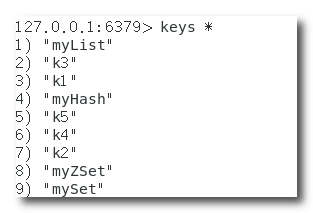
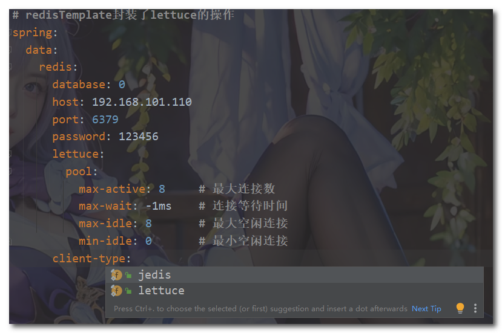
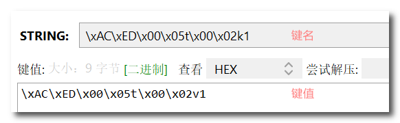
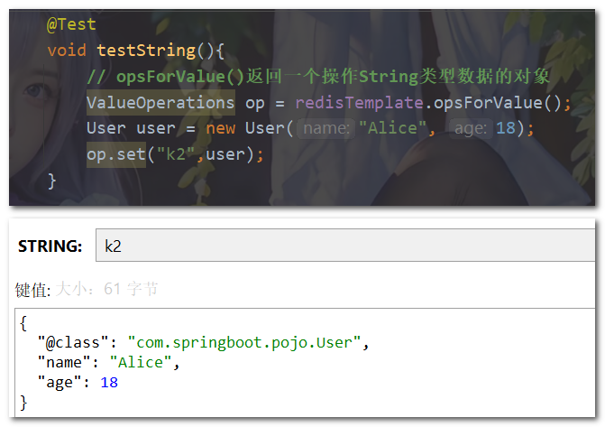
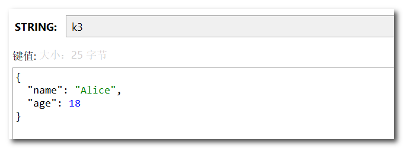

## SpringBoot整合Redis


### 1. SpringBoot集成Jedis

Jedis是一个Java语言的Redis客户端，它提供了方便的API，使得在Java应用程序中使用Redis非常容易。

(1) 导入依赖

```xml
 <!-- Jedis -->
 <dependency>
     <groupId>redis.clients</groupId>
     <artifactId>jedis</artifactId>
 </dependency>
```

(2) 配置Redis信息，因为开发中配置信息不会写死在代码里面，都是获取配置文件中的属性值。

```properties
# 这里属性名起的比较随意
jedis.url=192.168.101.110
jedis.port=6379
jedis.auth=123456
```

(3) 创建Jedis对象：`new Jedis(url,port)`，第一个参数位ip地址，第二个参数为端口号

```java
@Slf4j
@SpringBootTest
public class JedisDemo {

    // 注意不要导错了注解，不是lombok中的@Value
    @Value("${jedis.url}")
    String url;
    @Value("${jedis.port}")
    int port;
    @Value("${jedis.auth}")
    String auth;

    @Test
    public void testJedis() {
        // 创建Jedis对象连接本地的 Redis 服务，传入ip和端口
        Jedis jedis = new Jedis(url, port);
        // 设置登录密码
        jedis.auth(auth);
        log.info(jedis.ping());// 输出pong说明连接成功
    }
}
```

(4) 使用jedis对象调用api操作Redis指令

```java
@Slf4j
@SpringBootTest
public class JedisDemo {

    // 注意不要导错了注解，不是lombok中的@Value
    @Value("${jedis.url}")
    String url;
    @Value("${jedis.port}")
    int port;
    @Value("${jedis.auth}")
    String auth;

    @Test
    public void testJedis() {
        // 创建Jedis对象连接本地的 Redis 服务，传入ip和端口
        Jedis jedis = new Jedis(url, port);
        // 设置登录密码
        jedis.auth(auth);
        log.info(jedis.ping());// 输出pong说明连接成功

        // 存入字符串类型的数据
        jedis.set("k1", "jedis");
        // 读取单个字符串类型数据
        jedis.get("k1");
        // 批量存入多个字符串类型的数据
        jedis.mset("k2", "v2", "k3", "v3", "k4", "v4", "k5", "v5");
        // 批量读取字符串类型数据
        for (String s : jedis.mget("k1", "k2", "k3", "k4", "k5")) {
            System.out.println(s);
        }


        // 存入List类型数据
        jedis.lpush("myList", "one", "two", "three", "four", "five");
        // 读取myList列表的数据
        List<String> myList = jedis.lrange("myList", 0, -1);// 0到-1表示遍历整个列表
        for (String element : myList) {
            System.out.println(element);
        }

        // 存入Hash类型的数据
        jedis.hset("myHash", "name", "Alice");
        // 读取Hash表中的单个数据
        String s = jedis.hget("myHash", "name");
        // 批量存入多个Hash类型的数据
        HashMap<String, String> map = new HashMap<>();
        map.put("age", "18");
        map.put("email", "alice@qq.com");
        jedis.hmset("myHash", map);
        // 批量读取Hash表中的数据
        List<String> myHash = jedis.hmget("myHash", "name", "age", "email");
        for (String info : myHash) {
            System.out.println(info);
        }

        // 存入Set类型的数据
        jedis.sadd("mySet", "Alice", "Bryan", "Cindy", "David");
        // 读取Set集合所有成员
        Set<String> mySet = jedis.smembers("mySet");
        Iterator iterator = mySet.iterator();
        while (iterator.hasNext()) {
            String string = (String) iterator.next();
            System.out.println(string);
        }

        // 存入ZSet类型的数据
        jedis.zadd("myZSet", 10, "Alice");
        jedis.zadd("myZSet", 20, "Bryan");
        // 获取ZSet有序集合中成员的个数
        jedis.zcard("myZSet");
        // 遍历有序集合
        List<String> myZSet = jedis.zrange("myZSet", 0, -1);
        myZSet.forEach(System.out::println);
    }
}

```

查看redis客户端：


### 2. SpringBoot集成Lettuce

Lettuce是一个Java语言的Redis客户端，与Jedis类似，它也提供了方便的API，使得在Java应用程序中使用Redis非常容易。与Jedis不同的是，Lettuce使用异步、非阻塞的方式与Redis服务器进行通信，可以更好地支持高并发的场景。此外，Lettuce还支持集群、哨兵和Redis Sentinel等Redis高可用解决方案，并提供了更好的线程安全和内存管理。因此，Lettuce是一个性能更好、更可靠的Redis客户端，适合在高并发、高可用的应用场景中使用。

(1) 导入依赖

```xml
 <!--lettuce-->
 <dependency>
     <groupId>io.lettuce</groupId>
     <artifactId>lettuce-core</artifactId>
 </dependency>
```

(2) 使用Lettuce（这里为了方便没有配置redis信息，而是将数据写死在代码中了）

```Java
@SpringBootTest
public class LettuceDemo {
    @Test
    public void testLettuce(){
        // 创建RedisURI实例
        // redis(host, port)的参数为ip地址和端口号
        // withAuthentication(username, password)的参数为连接redis客户端的用户名和密码，用户名使用默认“default”
        RedisURI redisURI = RedisURI.builder().redis("192.168.101.110", 6379)
                .withAuthentication("default", "123456").build();
        // 创建连接客户端
        RedisClient redisClient = RedisClient.create(redisURI);
        // 获取连接
        StatefulRedisConnection<String, String> connect = redisClient.connect();
        // 获取命令操作对象
        RedisCommands<String, String> commands = connect.sync();

        // keys命令
        List<String> keys = commands.keys("*");

        // 存入String类型数据
        commands.set("k1","v1");
        // 读取String类型数据
        String k1 = commands.get("k1");
        // 批量存入String类型数据
        HashMap<String, String> strMap = new HashMap<>();
        strMap.put("k2","v2");
        strMap.put("k3","v3");
        commands.mset(strMap);

        // 存入List类型数据
        commands.lpush("myList","one","two","three","four","five");
        // 获取列表所有数据
        List<String> myList = commands.lrange("myList", 0, -1);

        // 存入Set类型数据
        commands.sadd("MySet","Alice","Bryan","Cindy","David");
        // 获取Set集合中所有的成员
        Set<String> mySet = commands.smembers("mySet");

        // 存入Hash类型数据
        commands.hset("myHash","name","Alice");
        // 批量存入Hash类型数据
        HashMap<String, String> map = new HashMap<>();
        map.put("age","18");
        map.put("email","alice@qq.com");
        commands.hset("myHash",map);
        // 读取Hash表中的数据
        String name = commands.hget("myHash", "name");
        String age = commands.hget("myHash", "age");

        // 存入ZSet类型数据
        commands.zadd("myZSet",10,"Alice");
        commands.zadd("myZSet",20,"Bryan");
        // 获取有序集合中成员个数
        Long count = commands.zcard("myZSet");
        // 遍历有序集合
        List<String> myZSet = commands.zrange("myZSet", 0, -1);

    }
}
```


### 3. SpringBoot集成RedisTemplate

redisTemplate是Spring Framework提供的一个用于操作Redis数据库的模板类，它是对jedis和lettuce的封装，默认使用lettuce客户端。

(1) 首先导入依赖：

```xml
 <!--RedisTemplate-->
  <dependency>
      <groupId>org.springframework.boot</groupId>
      <artifactId>spring-boot-starter-data-redis</artifactId>
  </dependency>
```

(2) 编写配置文件

```yml
spring:
  data:
    redis:
      database: 0
      host: 192.168.101.110
      port: 6379
      password: 123456
      # redisTemplate默认使用lettucek
      lettuce:
        pool:
          max-active: 8     # 最大连接数
          max-wait: -1ms    # 连接等待时间
          max-idle: 8       # 最大空闲连接
          min-idle: 0       # 最小空闲连接
```

可以通过设置client-type的值更改redis客户端类型：



(3) 使用RedisTemplate

```java
@SpringBootTest
public class RedisTemplateDemo {

    // 自动装配RedisTemplate对象
    @Resource
    private RedisTemplate redisTemplate;

    @Test
    void testString(){
        // opsForValue()返回一个操作String类型数据的对象
        ValueOperations op = redisTemplate.opsForValue();
        op.set("k1","v1");
        op.get("k1");
    }

    @Test
    void testList(){
        // opsForList()返回一个操作List类型数据的对象
        ListOperations op = redisTemplate.opsForList();
        // 存入一个值到List列表中：left()
        op.leftPush("myList","张三");
        // 批量存入数据到List列表中：leftPushAll
        op.leftPushAll("myList","Alice","Bryan","Cindy");
        // 根据索引获取列表中的元素
        Object one = op.index("myList", 1);// 获取的是一个object对象
        // 遍历列表元素
        List<String> myList = op.range("myList", 0, -1);
        for(String element : myList){
            System.out.println(element);
        }
    }

    @Test
    void testHash(){
        // opsForHash()返回一个操作Hash类型数据的对象
        HashOperations op = redisTemplate.opsForHash();
        // 存入数据到Hash表中：put()
        op.put("myHash","age","20");
        // 获取Hash表中的数据
        Object age = op.get("myHash", "age");
        // 获取Hash表中所有的键值对
        Map myHash = op.entries("myHash");
    }

    @Test
    void testSet(){
        // opsForSet()返回一个操作Set类型数据的对象
        SetOperations op = redisTemplate.opsForSet();
        // 存入数据到Set集合中：add()
        op.add("mySet","v1","v2","v3","v4","v5");
        // 获取Set集合中所有的成员：members
        Set mySet = op.members("mySet");
    }

    @Test
    void testZSet(){
        // opsForZSet()返回一个操作ZSet类型数据的对象
        ZSetOperations op = redisTemplate.opsForZSet();
        op.add("myZSet","Alice",10);
        op.add("myZSet","Bryan",20);
        // 遍历ZSet集合中的所有
        Set myZSet = op.range("myZSet", 0, -1);
    }
}
```


**序列化问题**：

RedisTemplate的key和value使用了默认的JDK序列化方式，所以存入的键和值会出现乱码问题。如下所示：



**解决序列化乱码问题**：

编写一个配置类，将RedisTemplate的key和value的序列化方式分别改为String序列化和JSON序列化：

```java
@Configuration
public class RedisConfig {

    @Bean
    public RedisTemplate<String, Object> redisTemplate(RedisConnectionFactory redisConnectionFactory) {
        // 创建RedisTemplate对象
        RedisTemplate<String,Object> redisTemplate = new RedisTemplate<>();
        // 设置连接工厂（这个工厂实例由SpringBoot提供，会自动注入）
        redisTemplate.setConnectionFactory(redisConnectionFactory);
        //设置key序列化方式为string方式
        redisTemplate.setKeySerializer(new StringRedisSerializer());
        redisTemplate.setHashKeySerializer(new StringRedisSerializer());
        //设置value的序列化方式为JSON方式（使用GenericJackson2JsonRedisSerializer替换默认序列化）
        redisTemplate.setValueSerializer(new GenericJackson2JsonRedisSerializer());
        redisTemplate.setHashValueSerializer(new GenericJackson2JsonRedisSerializer());

        return redisTemplate;
    }
}
```

使用JSON序列化需要导入jackson-databind依赖

```xml
 <dependency>
     <groupId>com.fasterxml.jackson.core</groupId>
     <artifactId>jackson-databind</artifactId>
 </dependency>
```

设置了序列化方式后，就不会出现乱码了，并且还支持对象反序列化。因为将对象进行JSON序列化时会存入一个@class属性，该属性存储了该对象的字节码文件。如下所示：




不过这种方式也不推荐使用，因为多存入一个属性占用了内存。

将`RedisTemplate`对象替换成`StringRedisTemplate`对象解决该问题，并且不需要写配置类。

**StringRedisTemplate对象的key和value的序列化方式都是String方式**。

不过存入对象数据时需要手动将对象序列化为JSON格式的字符串，反序列化时也需要手动将JSON格式的字符串转化成对象。


下面使用`StringRedisTemplate`对象来操作redis：

首先导入jackson-databind依赖，这里使用了ObjectMapper类来完成序列化：

- `new ObjectMapper().writeValueAsString`：将java对象转换成JSON格式的字符串
- `new ObjectMapper().readValue`：将JSON格式的字符串转换成Java对象

然后将RedisTemplate替换成StringRedisTemplate，存入对象时手动序列化即可。

注意一下，返回的操作对象指定一下泛型比如；`ValueOperations<String, String>`，这样就不再需要强转。

```Java
@SpringBootTest
public class StringRedisTemplateDemo {

    // 自动装配StringRedisTemplate对象
    @Resource
    private StringRedisTemplate stringRedisTemplate;
    // JSON工具
    private static final ObjectMapper MAPPER = new ObjectMapper();

    @Test
    void testString() throws JsonProcessingException {
        // opsForValue()返回一个操作String类型数据的对象，记得给该类型加上泛型
        ValueOperations<String, String> op = stringRedisTemplate.opsForValue();
        User alice = new User("Alice", 18);
        // 将对象转化成JSON格式的字符串
        String string = MAPPER.writeValueAsString(alice);
        op.set("k3",string);
        String s = op.get("k3");
        // 将JSON格式的字符串转化成java对象
        User user = MAPPER.readValue(s, User.class);
        System.out.println(user);

    }
}
```

查看结果：



可以看到占用内存大小笑了很多，这种方式需要手动序列化比较麻烦，但是可以将这个操作封装成一个操作类。推荐使用这种方式。
