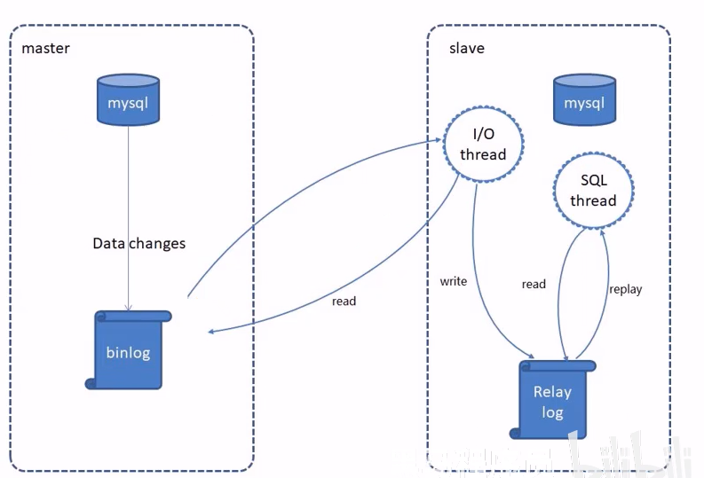
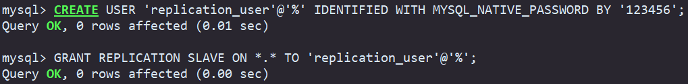
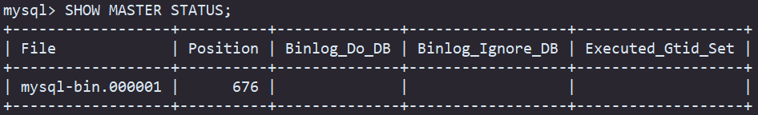
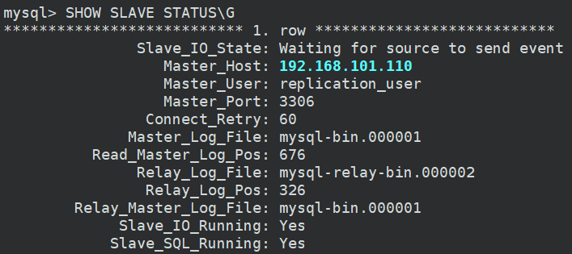
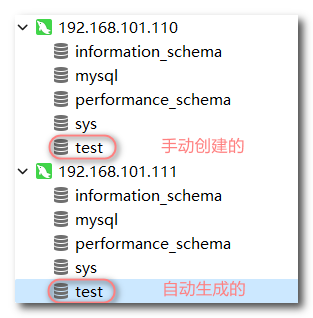

## Sharding-JDBC的使用


下面先介绍一下MySQL的主从复制：

### MySQL主从复制

MySQL主从复制是一个异步的复制过程，底层是基于Mysql数据库自带的二进制日志功能。就是一台或多台MySQL数据库(slave，即**从库**）从另一台MySQL数据库(master，即**主库**）进行日志的复制然后再解析日志并应用到自身，最终实现**从库**的数据和**主库**的数据保持一致。MySQL主从复制是MysQL数据库自带功能，无需借助第三方工具。

MysQL复制过程分成三步:

- master将改变记录到二进制日志（ binary log)

- slave将master的binary log拷贝到它的中继日志（relay log）
- slave重做中继日志中的事件，将改变应用到自己的数据库中



下面进行主从数据库的配置

(1) 准备好两台虚拟机

- 192.168.101.110 （master）
- 192.168.101.111 （slave）

(2) 配置主服务器

1. 打开主服务器的 MySQL 配置文件：`vim /etc/my.cnf` ，在 [mysqld] 部分添加以下配置：

   ```sh
   [mysqld]
   server-id = 110  # 设置主服务器的唯一标识，每个服务器必须具有唯一的 server-id
   log-bin = mysql-bin  # 启用二进制日志文件，用于记录主服务器上的所有写操作
   ```

   添加完后保存并关闭配置文件，重启MySQL服务：`systemctl restart mysqld`。

2. 登录数据库，创建一个用于复制的用户，并赋予该用户复制的权限

   ```sql
   # 创建一个用户replication_user，密码为123456
   # @后面接的是主机名，%表示通配符，@'%'指允许该用户从任意主机连接到MySQL服务器。
   # 注意：mysql8.0创建用户时需要在by之前加上with mysql_native_password，否则会报错。
   CREATE USER 'replication_user'@'%' IDENTIFIED WITH MYSQL_NATIVE_PASSWORD BY '123456';
   
   # 给创建的用户授予复制相关的权限
   GRANT REPLICATION SLAVE ON *.* TO 'replication_user'@'%';
   
   # 刷新权限，使更改立即生效
   FLUSH PRIVILEGES;
   ```

   

   提示：

   删除具有任意主机访问权限的用户 'myuser'，可以执行命令：`DROP USER 'myuser'@'%';`

   删除用户后，使用命令刷新权限：`FLUSH PRIVILEGES;`

3. 获取主服务器当前的二进制日志文件名和位置：`SHOW MASTER STATUS;`，用于配置从服务器。

   

   `File` : 当前正在写入的二进制日志文件名。`Position` : 当前二进制日志文件中的位置（偏移量）。

   这些信息在配置从服务器时会被用到，以确保从服务器可以从主服务器的正确位置开始复制日志。

   注意获取到这些信息后，在从服务器配置完之前不要进行其他操作，否则偏移量会发生变化。

(3) 配置从服务器

1. 打开主服务器的 MySQL 配置文件：`vim /etc/my.cnf` ，在 [mysqld] 部分添加以下配置：

   ```sh
   [mysqld]
   server-id = 111  # 设置从服务器的唯一标识，每个服务器必须具有唯一的 server-id
   relay-log = mysql-relay-bin  # 启用中继日志文件，用于从主服务器复制日志事件
   log-bin = mysql-bin  # 启用二进制日志文件，用于保存从服务器本地的写操作
   ```

   添加完后保存并关闭配置文件，重启MySQL服务：`systemctl restart mysqld`。

2. 登录从服务器的数据库，执行以下命令，配置从服务器连接到主服务器

   ```sql
   CHANGE MASTER TO MASTER_HOST='192.168.101.110', MASTER_USER='replication_user', 
   MASTER_PASSWORD='123456', MASTER_LOG_FILE='mysql-bin.000001', 
   MASTER_LOG_POS=676;
   ```

   其中，`MASTER_HOST` 是主服务器的 IP 地址，`MASTER_USER` 是用于复制的用户名，`MASTER_PASSWORD` 是该用户的密码，`MASTER_LOG_FILE` 是主服务器当前的二进制日志文件名，`MASTER_LOG_POS` 是主服务器当前的二进制日志位置。

3. 启动从服务器的复制进程：`START SLAVE;` （对应的停止复制进程：`STOP SLAVE;`）

4. 检查从服务器的复制状态：`SHOW SLAVE STATUS\G`

   

   在输出中，确保 `Slave_IO_Running` 和 `Slave_SQL_Running` 的值为 `Yes`，表示复制正在正常运行。

(4) 测试主从复制

在主服务器登录MySQL，创建一个数据库test，结果从服务器中的MySQL也会自动创建test数据库。




### Sharding-JDBC的使用

Sharding-JDBC 是一个开源的 Java 分库分表中间件，它提供了对关系型数据库的分库分表功能。它是在 JDBC 驱动的基础上进行封装，通过拦截 JDBC API 调用来实现数据分片的透明化。

以下是 Sharding-JDBC 的一些特点和主要功能：

1. 数据分片：Sharding-JDBC 可以将数据水平分片存储到多个数据库中，实现数据的分布式存储和查询。它支持垂直分片（按列划分）和水平分片（按行划分）。
2. 透明化访问：应用程序无需对代码进行修改，通过 Sharding-JDBC 配置文件进行简单的配置，即可实现对分片数据的访问。它会自动根据配置将查询和更新操作路由到正确的数据库或表中。
3. 读写分离：Sharding-JDBC 支持主从复制和读写分离，可以将读操作分发到多个从数据库，提高读性能。
4. 分布式事务支持：Sharding-JDBC 对分布式事务进行了支持，可以在分片环境下保证事务的一致性和隔离性。
5. 强大的扩展性：Sharding-JDBC 提供了丰富的插件扩展机制，可以灵活地定制和扩展功能，满足各种复杂的业务需求。

使用 Sharding-JDBC 可以有效地解决数据量大、负载高的场景下的数据库性能问题。它能够将数据分散到多个数据库中，提高查询和写入的并发能力，同时支持动态扩容和缩容，使得系统的横向扩展变得更加容易。

首先引入Sharding-JDBC的依赖：

```xml
<dependency>
    <groupId>org.apache.shardingsphere</groupId>
    <artifactId>sharding-jdbc-spring-boot-starter</artifactId>
    <version>4.1.1</version>
</dependency>
```

配置文件中配置 `shardingsphere`：

```yml
spring:
  shardingsphere:
    # 配置数据源
    datasource:
      names: master,slave # 数据源的名称，相当于声明，则下面即为定义数据源
      master:
        type: com.alibaba.druid.pool.DruidDataSource
        driver-class-name: com.mysql.cj.jdbc.Driver
        url: jdbc:mysql://192.168.101.110:3306/test?serverTimezone=UTC&useSSL=false&characterEncoding=utf-8
        username: root
        password: 123456
      slave:
        type: com.alibaba.druid.pool.DruidDataSource
        driver-class-name: com.mysql.cj.jdbc.Driver
        url: jdbc:mysql://192.168.101.111:3306/test?serverTimezone=UTC&useSSL=false&characterEncoding=utf-8
        username: root
        password: 123456
    # 读写分离配置
    masterslave:
      load-balance-algorithm-type: round_robin # 负载均衡算法：轮询
      name: dataSource # 最终的数据源名称
      master-data-source-name: master # 主库数据源的名称（上面声明的master，名称自定义不是必须为master）
      slave-data-source-names: slave # 从库数据源名称，多个从库数据源用逗号隔开
    props:
      # 开启sql显示，默认是false
      sql:
        show: true
  main:
    allow-bean-definition-overriding: true # 允许bean定义覆盖（因为这里有多个数据源，会产生冲突）

# 下面是mybatis-p
mybatis-plus:
  configuration:
    # 在映射实体或者属性时，将数据库中表名和字段名中的下划线去掉，按照驼峰命名法映射
    map-underscore-to-camel-case: true
    log-impl: org.apache.ibatis.logging.stdout.StdOutImpl
  global-config:
    db-config:
      id-type: ASSIGN_ID
```


