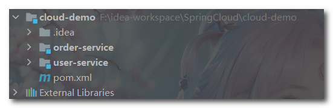

## 初识微服务

微服务是一种软件开发架构风格，旨在构建应用程序作为一组小型、独立的服务。每个微服务都运行在自己独立的进程中，通过轻量级的通信机制（通常是基于HTTP的API）进行相互之间的通信。每个微服务都专注于执行特定的业务功能，并且可以独立地进行开发、部署、扩展和管理。

### 1. 微服务的优点

微服务架构的核心理念是将一个复杂的应用程序拆分成多个更小、更易于管理的部分，每个部分都有自己的职责和功能。这种拆分的好处包括：

1. **松耦合性**：微服务之间通过定义明确定义的接口进行通信，彼此之间可以独立开发、部署和扩展。这使得团队可以并行工作，并且一个微服务的变更不会对其他微服务产生影响。
2. **可独立扩展**：由于每个微服务都是独立的，可以根据需要独立地进行扩展。这意味着可以根据负载的需求，只对需要处理更高负载的服务进行扩展，而无需对整个应用程序进行扩展。
3. **技术多样性**：微服务架构允许使用不同的技术栈和编程语言来实现不同的微服务。这使得团队可以选择最适合特定任务的工具和技术，而无需整个应用程序都使用相同的技术栈。
4. **容错性**：由于每个微服务都是独立的，一个微服务的故障不会影响整个应用程序的运行。系统可以通过合理的设计和故障处理机制来处理单个微服务的故障。


### 2. 微服务架构特点

微服务架构具有以下几个主要特点：

1. **服务拆分**：应用程序被拆分成一组小型、独立的服务。每个服务专注于单一的业务功能，具有明确的边界和责任。这种拆分使得开发人员可以更加关注每个服务的实现和维护，而不需要考虑整个应用程序的复杂性。
2. **独立部署**：每个微服务都可以独立地进行开发、测试、部署和扩展。这意味着对于需要变更或升级的特定服务，可以更快地进行部署，而不需要影响整个应用程序。独立部署也提供了更高的灵活性和快速迭代的能力。
3. **分布式通信**：微服务之间通过轻量级的通信机制进行交互，通常使用HTTP/REST、消息队列或RPC等方式。这种通信方式使得服务之间的耦合度较低，并且可以选择最适合特定需求的通信协议和技术。分布式通信是微服务架构中的一个关键方面，也是保持服务自治性的基础。
4. **自治性**：每个微服务都是独立的，具有自己的数据库和业务逻辑。它们可以独立地进行管理和维护，甚至使用不同的技术栈和工具。这种自治性使得团队可以根据服务的特点和需求进行自主决策，提高开发效率和灵活性。
5. **弹性和容错性**：微服务架构具有弹性和容错性，即使一个服务出现故障或异常，整个系统仍然可以继续运行。由于每个服务都是独立的，故障不会影响其他服务的正常运行。此外，通过使用负载均衡和故障恢复机制，系统可以更好地应对高负载和故障情况。
6. **可伸缩性**：由于每个微服务都是独立的，可以根据需要独立地进行扩展。这使得系统可以根据负载需求进行水平扩展，只扩展需要处理更高负载的服务。这种可伸缩性使得微服务架构适合应对大规模和高流量的应用程序。
7. **团队自治**：微服务架构鼓励团队自治和分布式责任。每个团队可以独立负责一个或多个微服务的开发、测试、部署和运维。这种分布式责任和自治性促进了团队间的并行工作和快速创新，提高了开发效率和灵活性。

微服务架构示意图：


### 3. Spring Cloud

Spring Cloud是一个用于构建分布式系统的开源框架，它基于Spring框架提供了一套丰富的工具和组件，用于简化分布式系统的开发和部署。它为开发人员提供了一种简单、灵活和可扩展的方式来构建和管理微服务架构。

Spring Cloud的主要特点和功能包括：

1. **服务注册与发现**：Spring Cloud通过集成服务注册与发现组件（如Netflix Eureka、Consul等）实现了服务的自动注册和发现。这使得微服务之间的通信更加简单，服务可以动态地注册和发现其他服务。

2. **负载均衡**：Spring Cloud支持集成负载均衡器（如Netflix Ribbon），可以在多个实例之间分配请求负载，提高系统的可伸缩性和性能。

3. **断路器模式**：Spring Cloud集成了断路器模式（如Netflix Hystrix），可以实现服务的容错和故障处理。当某个服务不可用时，断路器可以提供降级策略，避免级联故障。

4. **分布式配置管理**：Spring Cloud提供了分布式配置管理工具（如Spring Cloud Config），可以集中管理和动态更新应用程序的配置信息，使得配置的修改和发布更加方便和可控。

5. **消息总线**：Spring Cloud支持消息总线（如Spring Cloud Bus），可以简化配置的更新和刷新。通过消息总线，可以实现对所有微服务的配置变更的批量刷新，而不需要逐个重启服务。

6. **服务网关**：Spring Cloud集成了服务网关（如Netflix Zuul、Spring Cloud Gateway），用于提供对外的统一访问接口和路由功能。服务网关可以进行请求路由、负载均衡、安全认证和限流等操作。

7. **分布式追踪**：Spring Cloud集成了分布式追踪工具（如Spring Cloud Sleuth、Zipkin），用于跟踪和监控微服务之间的请求链路，帮助定位和解决系统中的性能问题和故障。

通过以上的功能和组件，Spring Cloud提供了一整套解决方案，用于构建和管理复杂的分布式系统。它提供了丰富的工具和技术，简化了微服务架构的开发、部署和运维过程，使开发人员能够更加专注于业务逻辑的实现，提高了系统的可靠性、可伸缩性和灵活性。

常见的组件：


SpringCloud与SpringBoot的版本兼容关系如下：

| SpringCloud版本 |                SpringBoot版本                 |
| :-------------: | :-------------------------------------------: |
|   Hoxton.SR12   | Spring Boot>=2.2.0.RELEASE and <2.4.0.RELEASE |
|    2020.0.6     |    Spring Boot >=2.4.0.RELEASE and <2.6.0     |
|    2021.0.7     |        Spring Boot >=2.6.0 and <3.0.0         |
|    2022.0.3     |       Spring Boot >=3.0.0 and <3.2.0-M1       |


### 4. 创建微服务项目

(1) 创建一个maven项目（该项目生成的src目录可以删除）代表父工程，用于管理依赖。

```xml
    <!-- 自定义版本信息 -->
	<properties>
        <maven.compiler.source>17</maven.compiler.source>
        <maven.compiler.target>17</maven.compiler.target>
        <project.build.sourceEncoding>UTF-8</project.build.sourceEncoding>
        <project.reporting.outputEncoding>UTF-8</project.reporting.outputEncoding>
        <spring-cloud.version>2022.0.3</spring-cloud.version>
        <spring-boot.version>3.1.0</spring-boot.version>
        <spring-cloud-ailibaba.version>2.2.9.RELEASE</spring-cloud-ailibaba.version>
        <mybatis-stater.version>3.0.0</mybatis-stater.version>
    </properties>

	<!-- 传递给子工程的依赖 -->
    <dependencyManagement>
        <dependencies>
            <!-- springCloud相关依赖 -->
            <dependency>
                <groupId>org.springframework.cloud</groupId>
                <artifactId>spring-cloud-dependencies</artifactId>
                <version>${spring-cloud.version}</version>
                <type>pom</type>
                <scope>import</scope>
            </dependency>
            <!-- SpringBoot相关依赖 -->
            <dependency>
                <groupId>org.springframework.boot</groupId>
                <artifactId>spring-boot-dependencies</artifactId>
                <version>${spring-boot.version}</version>
                <type>pom</type>
                <scope>import</scope>
            </dependency>
            <!-- SpringCloud alibaba相关依赖 -->
            <dependency>
                <groupId>com.alibaba.cloud</groupId>
                <artifactId>spring-cloud-alibaba-dependencies</artifactId>
                <version>${spring-cloud-ailibaba.version}</version>
                <type>pom</type>
                <scope>import</scope>
            </dependency>
            <!-- mybatis相关依赖 -->
            <dependency>
                <groupId>org.mybatis.spring.boot</groupId>
                <artifactId>mybatis-spring-boot-starter</artifactId>
                <version>${mybatis-stater.version}</version>
            </dependency>
        </dependencies>
    </dependencyManagement>
```

(2) 在父工程中创建两个SpringBoot项目，并且导入父工程：

```xml
	<!-- 导入父工程 -->
    <parent>
        <groupId>org.example</groupId>
        <artifactId>cloud-demo</artifactId>
        <version>1.0-SNAPSHOT</version>
        <relativePath/>
    </parent>
```

- order-service：订单微服务，负责订单相关业务
- user-service：用户微服务，负责用户相关业务

这样一个微服务架构就搭建出来了，如下所示：



要求：

- 订单微服务和用户微服务都必须有各自的数据库，相互独立
- 订单服务和用户服务都对外暴露Restful的接口
- 订单服务如果需要查询用户信息，只能调用用户服务的Restful接口，不能查询用户数据库。


### 5. 远程调用

修改order-service中的根据id查询订单业务，要求在查询订单的同时，根据订单中包含的userId查询出用户信息，一起返回。

而之前提到过微服务之间都是相互独立的，那么在订单服务中如果查询用户的信息呢？


RestTemplate是Spring框架提供的用于进行RESTful风格的HTTP请求的客户端工具。它封装了常见的HTTP操作，如GET、POST、PUT、DELETE等，并提供了方便的方法来处理请求和响应。

RestTemplate具有以下特点和功能：

1. **简化的API**：RestTemplate提供了简洁而直观的API，使得进行HTTP请求变得非常容易。它使用类似于Spring的模板方法设计模式，通过提供各种方法来执行不同类型的HTTP请求，例如getForObject()、postForObject()等。
2. **支持多种HTTP方法**：RestTemplate支持常见的HTTP方法，包括GET、POST、PUT、DELETE等。开发人员可以根据实际需求选择适当的HTTP方法来与远程服务进行通信。
3. **URI和参数处理**：RestTemplate可以接受URI和参数，并将其转换为完整的URL。开发人员可以使用占位符和参数映射来构建动态的URL，并将参数传递给请求。这样可以轻松地构建具有动态部分的URL。
4. **请求和响应处理**：RestTemplate提供了各种方法来处理请求和响应的内容。它支持将请求和响应转换为各种数据类型，包括基本数据类型、实体对象、JSON、XML等。还可以通过设置请求头、请求体、响应解析器等来进行高级的请求和响应处理。
5. **错误处理**：RestTemplate具有处理HTTP错误状态码的能力。它可以根据不同的错误状态码采取不同的处理策略，例如抛出异常、返回错误信息等。
6. **拦截器支持**：RestTemplate允许注册拦截器来对请求和响应进行拦截和修改。这使得可以在请求发送前或响应返回后进行自定义的处理操作，例如添加认证信息、修改请求头等。

需要注意的是，自Spring 5版本开始，RestTemplate被宣布为不推荐使用，并计划在未来的Spring版本中移除。推荐使用Spring WebFlux提供的WebClient作为替代方案，它是一个基于响应式编程的非阻塞HTTP客户端。WebClient提供了类似于RestTemplate的功能，但更适合于构建响应式和高性能的应用程序。

下面是RestTemplate使用的示例代码：

```Java
@Service
public class OrderServiceImpl implements OrderService {

    @Autowired
    private OrderMapper orderMapper;

    @Autowired
    private RestTemplate restTemplate;

    /**
     * 根据id查询订单和用户信息
     * @param orderId
     * @return
     */
    public Order queryOrderById(Long orderId) {
        // 1.查询订单
        Order order = orderMapper.findById(orderId);

        // 2.利用RestTemplate发起http请求，查询用户
        String url = "http://localhost:8081/user/"+order.getUserId();
        // getForObject第一个参数为请求路径，第二个参数为返回值类型（获取到的数据是JSON格式，会将其装化成指定类型的对象）
        User user = restTemplate.getForObject(url, User.class);
        
        order.setUser(user);
        return order;
    }
}
```


### 6. 提供者与消费者

在服务调用关系中，会有两个不同的角色：

**服务提供者**：一次业务中，被其它微服务调用的服务。（提供接口给其它微服务）

**服务消费者**：一次业务中，调用其它微服务的服务。（调用其它微服务提供的接口）


服务提供者与服务消费者的角色并不是绝对的，而是相对于业务而言。

如果服务A调用了服务B，而服务B又调用了服务C，服务B的角色是什么？

- 对于A调用B的业务而言：A是服务消费者，B是服务提供者
- 对于B调用C的业务而言：B是服务消费者，C是服务提供者

因此，服务B既可以是服务提供者，也可以是服务消费者。