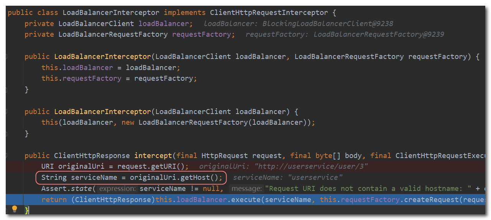

## Eureka注册中心

前面我们使用服务调度的时候，服务提供者的地址信息是写死的：


而实际生产中服务调度需要解决以下问题：

- 服务消费者该如何获取服务提供者的地址信息？
- 如果有多个服务提供者，消费者该如何选择？
- 消费者如何得知服务提供者的健康状态？


这时候就可以使用Eureka注册组件解决该问题，Eureka是Netflix开源的一种服务发现组件，用于构建分布式系统中的服务注册和发现机制。它的设计目标是简化微服务架构中服务之间的通信和管理。


### 1. Eureka的作用

**Eureka的主要特点和功能包括**：

1. **服务注册与发现**：Eureka允许服务将自己注册到注册中心，并提供一个易于访问的服务注册表。每个服务实例都可以向Eureka服务器注册自己的元数据，包括服务名称、主机名、端口号等信息。其他服务可以通过查询注册中心来发现和获取已注册的服务实例。
2. **高可用性**：Eureka采用了分布式的架构，并支持多节点的部署。每个节点都可以相互注册和复制服务注册表，以提供高可用性和容错能力。当某个节点出现故障时，其他节点可以接管其职责，确保服务的可靠性和稳定性。
3. **自我保护机制**：Eureka具有自我保护机制，用于处理网络分区和故障恢复情况。当Eureka服务器在一定时间内无法接收到心跳信息时，它会将该实例标记为"离线"，但仍然会保留该实例的信息。这样可以防止因网络问题或瞬时故障导致的服务实例被错误地注销。
4. **负载均衡**：Eureka客户端具有负载均衡功能，它可以在多个可用的服务实例之间进行请求的分发和负载均衡。通过选择可用的、健康的服务实例来处理请求，Eureka可以提高系统的可伸缩性和性能。
5. **集成Spring Cloud**：Eureka被广泛应用于Spring Cloud生态系统中，作为服务注册和发现的核心组件之一。Spring Cloud提供了方便的集成和配置，使得开发人员可以轻松地使用Eureka构建和管理微服务架构。

**在Eureka架构中，微服务角色有两类**：

- EurekaServer：服务端，注册中心

  - 记录服务信息

  - 心跳监控

- EurekaClient：客户端
  - Provider：服务提供者，例如案例中的 user-service
    - 注册自己的信息到EurekaServer
    - 每隔30秒向EurekaServer发送心跳
  - consumer：服务消费者，例如案例中的 order-service
    - 根据服务名称从EurekaServer拉取服务列表
    - 基于服务列表做负载均衡，选中一个微服务后发起远程调用

**Eureka作用示意图**：


注意：服务消费者也有可能是服务提供者，所以也可以注册到Eureka注册中心。

**使用Eureka解决了服务调度出现的问题**：

- 消费者该如何获取服务提供者具体信息？

  服务提供者启动时向eureka注册自己的信息，eureka保存这些信息，消费者根据服务名称向eureka拉取提供者信息。

- 如果有多个服务提供者，消费者该如何选择？

  服务消费者利用负载均衡算法，从服务列表中挑选一个。

- 消费者如何感知服务提供者健康状态？

  服务提供者会每隔30秒向EurekaServer发送心跳请求，报告健康状态，eureka会更新记录服务列表信息，心跳不正常会被剔除。


### 2. 搭建Eureka注册中心

**(1) 创建eureka-service服务**

在cloud-demo父工程下，创建一个子模块eureka-service，这必须是一个独立的微服务。

**(2) 引入 `eureka-service` 的starter依赖**

```
<dependency>
    <groupId>org.springframework.cloud</groupId>
    <artifactId>spring-cloud-starter-netflix-eureka-server</artifactId>
</dependency>
```

**(3) 给启动类添加@EnableEurekaServer注解，开启eureka的注册中心功能**

```Java
@SpringBootApplication
@EnableEurekaServer
public class EurekaServiceApplication {
    public static void main(String[] args) {
        SpringApplication.run(EurekaServiceApplication.class, args);
    }
}
```

**(4) 编写配置文件**

```yml
server:
  port: 10086
spring:
  application:
    name: eureka-server
eureka:
  client:
    service-url: 
      defaultZone: http://127.0.0.1:10086/eureka
```

**(5) 启动服务，浏览器输入loclahost:10086访问eureka注册中心**


### 3. 服务注册

下面将user-service注册到eureka-server中去。

1. **在user-service的pom文件中，引入下面的 `eureka-client` 依赖**

   ```xml
   <dependency>
       <groupId>org.springframework.cloud</groupId>
       <artifactId>spring-cloud-starter-netflix-eureka-client</artifactId>
   </dependency>
   ```

2. **在user-service中，修改application.yml文件，添加服务名称、eureka地址**

   ```
   spring:
     application:
       name: userservice
   eureka:
     client:
       service-url:
         defaultZone: http://127.0.0.1:10086/eureka
   ```

3. **启动多个user-service实例**

   

   

   4. **查看eureka-server管理页面**

      


### 4. 服务发现

下面，我们将order-service的逻辑修改：向eureka-server拉取user-service的信息，实现服务发现。

1. **引入依赖，这一步与服务注册时一致**

   ```xml
   <dependency>
       <groupId>org.springframework.cloud</groupId>
       <artifactId>spring-cloud-starter-netflix-eureka-client</artifactId>
   </dependency>
   ```

2. **配置文件，服务发现也需要知道eureka地址，因此第二步与服务注册一致，都是配置eureka信息**

   在order-service中，修改application.yml文件，添加服务名称、eureka地址：

   ```yml
   spring:
     application:
       name: orderservice
   eureka:
     client:
       service-url:
         defaultZone: http://127.0.0.1:10086/eureka
   ```

   启动服务可以发现 `order-service` 也被注册到了Eureka服务器上：

   

   

3. **服务拉取**

   修改访问的url路径，用服务名代替ip、端口：

   

   这个服务名就是配置文件中配置的application的名字：

   

4. **负载均衡**

   之前我们配置了RestTemplate这个Bean，只需要给这个Bean添加一个@LoadBalanced注解即可。

   使用该注解需要导入 `spring-cloud-commons` 依赖：

   ```xml
   <dependency>
       <groupId>org.springframework.cloud</groupId>
       <artifactId>spring-cloud-commons</artifactId>
   </dependency>
   ```

   ```java
   @Configuration
   public class RestTemplateConfig {
   
       /**
        * 配置RestTemplate对象
        * @return
        */
       @Bean
       @LoadBalanced
       public RestTemplate restTemplate(){
           return new RestTemplate();
       }
   }
   ```

spring会自动帮助我们从eureka-server端，根据userservice这个服务名称，获取实例列表，并完成负载均衡。


### 5. Ribbon负载均衡

上面提到了使用@LoadBalanced注解，即可实现负载均衡功能，这是什么原理呢？

`LoadBalancerInterceptor` 这个类会在对RestTemplate的请求进行拦截，然后从Eureka根据服务id获取服务列表，随后利用负载均衡算法得到真实的服务地址信息，替换服务id。



可以看到这里的intercept方法，拦截了用户的HttpRequest请求，然后做了几件事：

- `request.getURI()`：获取请求uri，本例中就是 http://userservice/user/3
- `originalUri.getHost()`：获取uri路径的主机名，其实就是服务id：`userservice`
- `this.loadBalancer.execute()`：处理服务id，和用户请求。

这里的`this.loadBalancer`是`LoadBalancerClient`类型，继续跟入execute方法：

- getLoadBalancer(serviceId)：根据服务id获取ILoadBalancer，而ILoadBalancer会拿着服务id去eureka中获取服务列表并保存。
- getServer(loadBalancer)：利用内置的负载均衡算法，从服务列表中选择一个。


**基本流程如下**：

- 拦截我们的RestTemplate请求http://userservice/user/1
- RibbonLoadBalancerClient会从请求url中获取服务名称，也就是userservice
- DynamicServerListLoadBalancer根据userservice到eureka拉取服务列表
- eureka返回列表，localhost:8081、localhost:8082
- IRule利用内置负载均衡规则，从列表中选择一个，例如localhost:8081
- RibbonLoadBalancerClient修改请求地址，用localhost:8081替代userservice，得到http://localhost:8081/user/1，发起真实请求


#### 5.1 负载均衡策略

负载均衡的规则都定义在IRule接口中，而IRule有很多不同的实现类：


不同规则的含义如下：

| **内置负载均衡规则类**    | **规则描述**                                                 |
| ------------------------- | ------------------------------------------------------------ |
| RoundRobinRule            | 简单轮询服务列表来选择服务器。它是Ribbon默认的负载均衡规则。 |
| AvailabilityFilteringRule | 对以下两种服务器进行忽略：   （1）在默认情况下，这台服务器如果3次连接失败，这台服务器就会被设置为“短路”状态。短路状态将持续30秒，如果再次连接失败，短路的持续时间就会几何级地增加。  （2）并发数过高的服务器。如果一个服务器的并发连接数过高，配置了AvailabilityFilteringRule规则的客户端也会将其忽略。并发连接数的上限，可以由客户端的<clientName>.<clientConfigNameSpace>.ActiveConnectionsLimit属性进行配置。 |
| WeightedResponseTimeRule  | 为每一个服务器赋予一个权重值。服务器响应时间越长，这个服务器的权重就越小。这个规则会随机选择服务器，这个权重值会影响服务器的选择。 |
| **ZoneAvoidanceRule**     | 默认实现类。以区域可用的服务器为基础进行服务器的选择。使用Zone对服务器进行分类，这个Zone可以理解为一个机房、一个机架等。而后再对Zone内的多个服务做轮询。 |
| BestAvailableRule         | 忽略那些短路的服务器，并选择并发数较低的服务器。             |
| RandomRule                | 随机选择一个可用的服务器。                                   |
| RetryRule                 | 重试机制的选择逻辑                                           |


#### 5.2 自定义负载均衡

通过定义IRule实现可以修改负载均衡规则，有两种方式：

1. 代码方式：定义一个新的IRule类型的Bean：

```java
@Bean
public IRule randomRule(){
    return new RandomRule();
}
```

2. 配置文件方式

```yaml
userservice: # 给某个微服务配置负载均衡规则，这里是userservice服务
  ribbon:
    NFLoadBalancerRuleClassName: com.netflix.loadbalancer.RandomRule # 负载均衡规则 
```


#### 5.3 饥饿加载

Ribbon默认是采用懒加载，即第一次访问时才会去创建LoadBalanceClient，请求时间会很长。

而饥饿加载则会在项目启动时创建，降低第一次访问的耗时，通过下面配置开启饥饿加载：

```yaml
ribbon:
  eager-load:
    enabled: true
    clients: userservice
```

