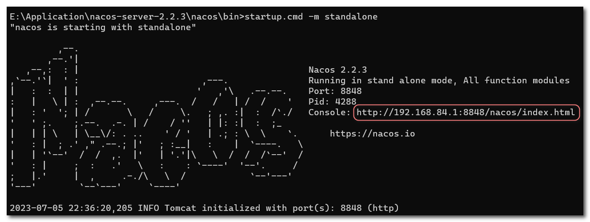
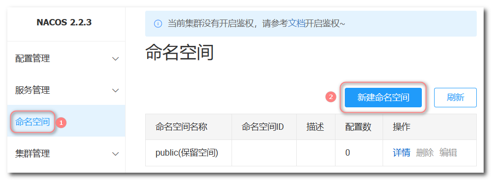
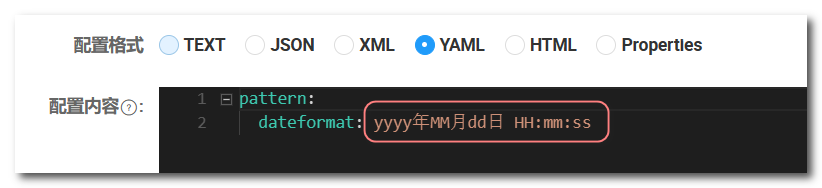

## Nacos注册中心

Nacos是一个功能丰富的分布式服务发现和配置管理系统，提供了服务注册与发现、动态配置管理、服务治理等功能。

Nacos的主要特点和功能包括：

1. 服务注册与发现：Nacos允许服务实例在启动时向Nacos注册自身的信息，包括IP地址、端口号、健康状态等。其他服务可以通过查询Nacos来发现可用的服务实例，实现服务之间的通信与调用。
2. 动态配置管理：Nacos提供了动态配置管理功能，可以实现对应用程序的配置进行集中管理。开发人员可以在Nacos中创建和管理配置，应用程序可以实时获取最新的配置信息。
3. 服务健康检查：Nacos通过定期发送心跳检测服务实例的健康状态，并提供了可插拔的健康检查机制。这样，当服务实例出现故障或不可用时，Nacos可以自动将其从服务注册中心中移除，避免将请求发送到不可用的实例上。
4. 服务路由与负载均衡：Nacos支持服务的动态路由和负载均衡。通过与服务网关（如Spring Cloud Gateway）集成，可以根据规则动态路由请求到不同的服务实例，实现负载均衡和灰度发布等功能。
5. 分布式配置监听：Nacos支持配置的实时变更通知，应用程序可以通过监听配置的变化来动态更新自身的配置。这使得应用程序能够在配置发生变化时及时做出响应，无需重启或停机。
6. 集群和高可用性：Nacos支持构建集群部署，提供了高可用性和容错机制。通过在Nacos集群中部署多个节点，可以实现服务注册与发现的高可用性。

### 1. 安装Nacos

进入官网下载安装包：[Releases · alibaba/nacos · GitHub](https://github.com/alibaba/nacos/releases)


下载后上传到Linux服务器，然后解压到/user/local目录：

```sh
tar -xvf nacos-server-2.2.3.tar.gz -C /usr/local/
```

解压后生成了nacos目录，该目录中有以下目录：


### 2. Nacos启动与关闭

**在Linux系统中启动和关闭Nacos**

在nacos/bin目录中，打开终端输入命令启动Nacos，standalone表示单机启动

```sh
sh startup.sh -m standalone 
```

关闭Nacos：

```sh
sh shutdown.sh
```

启动效果如下，点击图中的地址即可访问Nacos服务管理中心，或者手动输入：`192.168.101.100:8848/nacos`


**在Windows系统中启动和关闭Nacos**

在nacos/bin目录中，打开命令行窗口输入命令启动Nacos：

```sh
startup.cmd -m standalone
```

关闭Nacos：

```sh
shutdown.cmd
```

启动后的效果如下图所示，点击图中的网址即可访问Nacos服务管理中心，或者浏览器地址栏手动输入：`localhost:8848/nacos`




### 3. 注册与发现

首先需要引入依赖：

**父工程管理依赖**

```xml
<properties>
    <maven.compiler.source>17</maven.compiler.source>
    <maven.compiler.target>17</maven.compiler.target>
    <project.build.sourceEncoding>UTF-8</project.build.sourceEncoding>
    <project.reporting.outputEncoding>UTF-8</project.reporting.outputEncoding>
    <spring-cloud.version>2022.0.3</spring-cloud.version>
    <spring-boot.version>3.1.0</spring-boot.version>
    <spring-cloud-ailibaba.version>2022.0.0.0-RC1</spring-cloud-ailibaba.version>
</properties>

<dependencyManagement>
    <!-- SpringCloud alibaba相关依赖 -->
	<dependency>
    	<groupId>com.alibaba.cloud</groupId>
    	<artifactId>spring-cloud-alibaba-dependencies</artifactId>
    	<version>${spring-cloud-ailibaba.version}</version>
    	<type>pom</type>
    	<scope>import</scope>
	</dependency>
</dependencyManagement>
```

**服务消费者引入nacos服务发现依赖和负载均衡器依赖**

```xml
<!-- nacos服务发现依赖 -->
<dependency>
    <groupId>com.alibaba.cloud</groupId>
    <artifactId>spring-cloud-starter-alibaba-nacos-discovery</artifactId>
</dependency>
<!-- 负载均衡器 -->
<dependency>
    <groupId>org.springframework.cloud</groupId>
    <artifactId>spring-cloud-starter-loadbalancer</artifactId>
</dependency>
```

**服务提供者引入nacos服务发现依赖**

```xml
<!-- nacos服务发现依赖 -->
<dependency>
    <groupId>com.alibaba.cloud</groupId>
    <artifactId>spring-cloud-starter-alibaba-nacos-discovery</artifactId>
</dependency>
```

**配置Nacos服务发现地址**

> 这里Nacos服务安装在本机上，所以Nacos服务中心地址是 `localhost:8848` 

```yml
spring: 
  cloud:
    nacos:
      discovery:
        server-addr: localhost:8848
```

注册服务后，访问Nacos服务管理中心：`localhost:8848/nacos`


#### 3.1 Nacos版本

需要注意的是，SpringBoot、SpringCloud、SpringCloudAlibaba、Nacos之间的版本要一一对应，否则会出错：

| Spring Cloud Alibaba Version | Spring Cloud Version        | Spring Boot Version |
| ---------------------------- | --------------------------- | ------------------- |
| 2022.0.0.0-RC2*              | Spring Cloud 2022.0.0       | 3.0.2               |
| 2022.0.0.0-RC1               | Spring Cloud 2022.0.0       | 3.0.0               |
| 2021.0.5.0*                  | Spring Cloud 2021.0.5       | 2.6.13              |
| 2021.0.4.0                   | Spring Cloud 2021.0.4       | 2.6.11              |
| 2021.0.1.0                   | Spring Cloud 2021.0.1       | 2.6.3               |
| 2021.1                       | Spring Cloud 2020.0.1       | 2.4.2               |
| 2.2.10-RC1*                  | Spring Cloud Hoxton.SR12    | 2.3.12.RELEASE      |
| 2.2.9.RELEASE                | Spring Cloud Hoxton.SR12    | 2.3.12.RELEASE      |
| 2.2.8.RELEASE                | Spring Cloud Hoxton.SR12    | 2.3.12.RELEASE      |
| 2.2.7.RELEASE                | Spring Cloud Hoxton.SR12    | 2.3.12.RELEASE      |
| 2.2.6.RELEASE                | Spring Cloud Hoxton.SR9     | 2.3.2.RELEASE       |
| 2.2.1.RELEASE                | Spring Cloud Hoxton.SR3     | 2.2.5.RELEASE       |
| 2.2.0.RELEASE                | Spring Cloud Hoxton.RELEASE | 2.2.X.RELEASE       |

SpringCloudAlibaba组件版本关系：

| Spring Cloud Alibaba Version | Sentinel Version | Nacos Version | RocketMQ Version |
| ---------------------------- | ---------------- | ------------- | ---------------- |
| 2022.0.0.0-RC2               | 1.8.6            | 2.2.1         | 4.9.4            |
| 2021.0.5.0                   | 1.8.6            | 2.2.0         | 4.9.4            |
| 2.2.10-RC1                   | 1.8.6            | 2.2.0         | 4.9.4            |
| 2022.0.0.0-RC1               | 1.8.6            | 2.2.1-RC      | 4.9.4            |
| 2.2.9.RELEASE                | 1.8.5            | 2.1.0         | 4.9.4            |
| 2021.0.4.0                   | 1.8.5            | 2.0.4         | 4.9.4            |
| 2.2.8.RELEASE                | 1.8.4            | 2.1.0         | 4.9.3            |
| 2021.0.1.0                   | 1.8.3            | 1.4.2         | 4.9.2            |
| 2.2.7.RELEASE                | 1.8.1            | 2.0.3         | 4.6.1            |
| 2.2.6.RELEASE                | 1.8.1            | 1.4.2         | 4.4.0            |


### 4. 服务分级存储模型

一个服务可以有多个实例，例如userservice有三个实例，假如这些实例分布于全国各地的不同机房，例如

- 127.0.0.1:8081，在上海机房
- 127.0.0.1:8082，在上海机房
- 127.0.0.1:8083，在杭州机房

Nacos就将同一机房内的实例划分为一个集群。也就是说，user-service是服务，一个服务可以包含多个集群，如杭州、上海，每个集群下可以有多个实例，形成分级模型，如图：


微服务互相访问时，应该尽可能访问同集群实例，因为本地访问速度更快。当本集群内不可用时，才访问其它集群。


#### 4.1 配置userservice服务集群

修改user-service的application.yml文件，添加集群配置：

```yml
spring:
  cloud:
    nacos:
      discovery:
        server-addr: localhost:8848
        cluster-name: HZ # 集群名称
```

重启两个userservice实例后，我们可以在nacos控制台看到下面结果：


再次复制一个userservice启动配置，添加属性：

```sh
-Dserver.port=8083 -Dspring.cloud.nacos.discovery.cluster-name=SH
```


启动UserServiceApplication3后再次查看nacos控制台：


#### 4.2 同集群优先的负载均衡

默认的`ZoneAvoidanceRule`并不能实现根据同集群优先来实现负载均衡。

因此Nacos中提供了一个`NacosRule`的实现，可以优先从同集群中挑选实例。

修改 `order-service` 的application.yml文件，修改开启nacos负载均衡并修改负载均衡规则：

```yml
spring:
  application:
    name: orderservice
  datasource:
    url: jdbc:mysql://localhost:3306/cloud_user?useSSL=false&serverTimezone=UTC&allowPublicKeyRetrieval=true
    username: root
    password: 123456
    driver-class-name: com.mysql.cj.jdbc.Drive
  cloud:
    nacos:
      discovery:
        server-addr: localhost:8848
        cluster-name: HZ # 集群名称，HZ代表杭州
    loadbalancer:
      nacos:
        enabled: true # 开启nacos的负载均衡
# 配置userservice服务的负载均衡规则
userservice:
  ribbon:
    NFLoadBalancerRuleClassName: com.alibaba.cloud.nacos.ribbon.NacosRule 
```


#### 4.3 权重配置

在nacos控制台，找到userservice服务的实例列表，点击编辑，即可修改权重，权重越大则访问频率越高（0~1之间）。

如果权重修改为0，则该实例永远不会被访问。


#### 4.4 环境隔离

Nacos提供了namespace来实现环境隔离功能

- nacos中可以有多个namespace
- namespace下可以有group、service等
- 不同namespace之间相互隔离，例如不同namespace的服务互相不可见
- 默认情况下，所有service、data、group都在同一个namespace，名为public

##### 创建namespace




##### 配置namespace

配置orderservice的命名空间，修改orderservice的application.yml文件

```yml
spring:
  datasource:
    url: jdbc:mysql://localhost:3306/cloud_user?useSSL=false&serverTimezone=UTC&allowPublicKeyRetrieval=true
    username: root
    password: 123456
    driver-class-name: com.mysql.cj.jdbc.Driver
  cloud:
    loadbalancer:
      nacos:
        enabled: true
    nacos:
      discovery:
        server-addr: localhost:8848
        cluster-name: HZ # 集群名称，HZ代表杭州
        namespace: 80c44a82-2d25-498b-8dd8-58004f6c6e0c # 注意这里是命名空间的id而不是名称
```

重新启动服务后查看服务列表：


此时访问order-service，因为namespace不同，会导致找不到userservice，控制台会报错：


### 5. Nacos与Eureka的区别

Nacos的服务实例分为两种类型：

- 临时实例：如果实例宕机超过一定时间，会从服务列表剔除，默认的类型。

- 非临时实例：如果实例宕机，不会从服务列表剔除，也可以叫永久实例。

配置一个服务实例为永久实例（注意：public命名空间内只能是临时实例）：

```yaml
spring:
  cloud:
    nacos:
      discovery:
        server-addr: localhost:8848
        namespace: 80c44a82-2d25-498b-8dd8-58004f6c6e0c
        ephemeral: false # 设置为非临时实例
```

观察服务列表可以发现即使服务健康实例数为0个(宕机)，非临时实例服务依然存在：


Nacos与eureka的共同点

- 都支持服务注册和服务拉取
- 都支持服务提供者心跳方式做健康检测

Nacos与Eureka的区别

- Nacos支持服务端主动检测提供者状态：临时实例采用心跳模式，非临时实例采用主动检测模式
- 临时实例心跳不正常会被剔除，非临时实例则不会被剔除
- Nacos支持服务列表变更的消息推送模式，服务列表更新更及时
- Nacos集群默认采用AP方式，当集群中存在非临时实例时，采用CP模式；Eureka采用AP方式


### 6. Nacos配置管理

Nacos除了可以做注册中心，同样可以做配置管理来使用。


#### 6.1 在nacos中添加配置文件

需要热更新的配置才有放到nacos管理的必要。基本不会变更的一些配置还是保存在微服务本地比较好。

下面在public命名空间中添加配置文件：


#### 6.2 拉取nacos中管理的配置

微服务要拉取nacos中管理的配置，并且与本地的application.yml配置合并，才能完成项目启动。

但如果尚未读取application.yml，又如何得知nacos地址呢？

因此spring引入了一种新的配置文件：bootstrap.yaml文件，会在application.yml之前被读取，在bootstrap.yaml中配置nacos地址。


(1) 首先引入nacos的配置管理客户端依赖

```xml
<!--nacos配置管理依赖-->
<dependency>
    <groupId>com.alibaba.cloud</groupId>
    <artifactId>spring-cloud-starter-alibaba-nacos-config</artifactId>
</dependency>
```

(2) 引入bootstrap相关依赖，高版本的springcloud，需要手动引入bootstrap依赖才会自动读取bootstrap.yml文件

```xml
<!-- bootstrap相关依赖 -->
<dependency>
    <groupId>org.springframework.cloud</groupId>
    <artifactId>spring-cloud-starter-bootstrap</artifactId>
</dependency>
```

(3) 在userservice中创建一个bootstrap.yaml文件，内容如下：

```yml
spring:
  application:
    name: userservice # 服务名称
  profiles:
    active: dev #开发环境，这里是dev
  cloud:
    nacos:
      discovery:
        server-addr: localhost:8848 # Nacos地址
      config:
        file-extension: yaml # 文件后缀名
```

Spring会根据`${spring.cloud.nacos.discovery.server-addr}`获取nacos地址，再根据

`${spring.application.name}-${spring.profiles.active}.${spring.cloud.nacos.config.file-extension}`作为文件id，来读取nacos中的配置。


(4) 读取nacos配置

在user-service中的UserController中添加业务逻辑，使用 `@Value` 注解读取pattern.dateformat配置：

```Java
@Slf4j
@RestController
@RequestMapping("/user")
public class UserController {

    // 读取nacos中配置的属性
    @Value("${pattern.dateformat}")
    private String dateformat;

    @GetMapping("now")
    public String now(){
        return LocalDateTime.now().format(DateTimeFormatter.ofPattern(dateformat));
    }
}
```

访问 `localhost:8081/user/now`：


#### 6.3 配置热更新

我们最终的目的，是修改nacos中的配置后，微服务中无需重启即可让配置生效，也就是**配置热更新**。

实现配置热更新可以使用两种方式：

**方式一：在 `@Value` 注入的变量所在类上添加注解 `@RefreshScope`**


添加该注解后，修改nacos配置文件信息



无需重启服务刷新[localhost:8081/user/now](http://localhost:8081/user/now)页面，页面中的时间格式发生了变化，说明实现了热更新。


**方式二：使用@ConfigurationProperties注解代替@Value注解**

> @ConfigurationProperties注解有监测到属性发生变化自动更新的功能，使用该注解获取属性不需要添加@RefreshScope注解。

在user-service服务中，添加一个类，读取patterrn.dateformat属性：

```Java
@Component
@Data
@ConfigurationProperties(prefix = "pattern")
public class PatternProperties {
    private String dateformat;
}
```

在UserController中注入该类的对象，通过该对象获取读取到的属性

```Java
 	@Autowired
    private PatternProperties patternProperties;

    @GetMapping("now")
    public String now(){
        return LocalDateTime.now().format(DateTimeFormatter.ofPattern(patternProperties.getDateformat()));
    }
```


#### 6.4 多环境共享

微服务启动时，会去nacos读取多个配置文件，例如：

- `[spring.application.name]-[spring.profiles.active].yaml`，例如：userservice-dev.yaml 代表生产环境下的配置文件

- `[spring.application.name].yaml`，该文件不包含环境，因此可以被多个环境共享，例如：userservice.yaml

**(1) 添加一个环境共享配置**


**(2) 在user-service中读取共享配置**

在user-service服务中，修改PatternProperties类，读取新添加的属性：

```Java
@Component
@Data
@ConfigurationProperties(prefix = "pattern")
public class PatternProperties {
    private String dateformat;
    private String envSharedValue;
}
```

在user-service服务中，修改UserController，添加一个方法：

```Java
    @Autowired
    private PatternProperties patternProperties;

    @GetMapping("prop")
    public PatternProperties prop(){
        return patternProperties;
    }
```

**(3) 运行两个UserApplication，使用不同的profile**


在nacos中配置了生产环境下的dateformat属性，而测试环境没有配置，所以读取到null


nacos多环境共享配置和SpringBoot的多环境共享配置一样，详情可查看SpringBoot中运维篇的笔记。


### 7. Nacos集群搭建

搭建集群的基本步骤：

- 搭建数据库，初始化数据库表结构
- 下载nacos安装包
- 配置nacos
- 启动nacos集群
- nginx反向代理

#### 7.1 Windos环境下搭建nacos集群

**(1) 初始化数据库**

Nacos默认数据存储在内嵌数据库Derby中，不属于生产可用的数据库。

官方推荐的最佳实践是使用带有主从的高可用数据库集群，首先新建一个数据库，命名为nacos，而后执行安装包中的sql文件；


执行成功后，生成的数据表如下所示：


**(2) 配置Nacos**

这里在一台windows上配置三个nacos实例，使用不同的端口号，并且端口号不能连续，否则会报错。

进入每个nacos的conf目录，修改配置文件cluster.conf.example，重命名为cluster.conf，并添加以下内容：

```properties
192.168.84.1:8845;
192.168.84.1:8855;
192.168.84.1:8865;
```

然后修改application.properties文件，数据库配置的注释去掉，三个节点要使用一个数据库，所以数据库的ip要是同一个。

```properties
spring.datasource.platform=mysql
db.num=1
db.url.0=jdbc:mysql://192.168.101.100:3306/nacos?characterEncoding=utf8&connectTimeout=1000&socketTimeout=3000&autoReconnect=true&useUnicode=true&useSSL=false&serverTimezone=UTC
db.user.0=root
db.password.0=123456
```

然后分别进入nacos/bin目录启动三个nacos节点：

```
startup.cmd
```

最终每个nacos实例启动日志都显示 Nacos started successfully in cluster mode，则表示集群启动成功：


**(3) 配置Nginx反向代理**

修改nginx/conf目录下的nginx.conf文件，添加如下配置：

```nginx
upstream nacos-cluster {
    server 192.168.84.1:8845;
    server 192.168.84.1:8855;
    server 192.168.84.1:8865;
}

server {
    listen       80;
    server_name  localhost;

    location /nacos {
        proxy_pass http://nacos-cluster;
    }
}
```

添加配置后，启动nginx服务：**start nginx** 或者 **nginx.exe**

建议使用第一种，第二种会使cmd窗口一直处于执行中，不能进行其他命令操作。

其他的nginx相关命令：

- 停止nginx服务：**nginx.exe -s stop**

- 杀死nginx进程：**taskkill /f /im nginx.exe > null** 

- 重新载入nginx：**nginx.exe -s reload**

然后微服务的配置文件中的nacos服务地址改为 `localhost:80/nacos` 即可：


#### 7.2 Linux环境下搭建nacos集群

**(1) 初始化数据库**

这里准备了三台虚拟机，每台虚拟机分别安装一个nacos服务器，每个nacos服务器使用同一个数据库：

- 192.168.101.110:8848
- 192.168.101.111:8848
- 192.168.101.112:8848

这里选择节点192.168.101.110中的mysql数据库管理系统，ip为 `192.168.101.110:3306`。

在该mysql管理系统中新建一个数据库，命名为nacos，而后执行安装包中的sql文件。

**(2) 配置Nacos**

进入每个nacos的conf目录，修改配置文件cluster.conf.example，重命名为cluster.conf，并添加以下内容：

```properties
192.168.101.110:8848;
192.168.101.111:8848;
192.168.101.112:8848;
```

然后修改application.properties文件，数据库配置的注释去掉，三个节点要使用一个数据库，所以数据库的ip要是同一个。

```properties
spring.datasource.platform=mysql
db.num=1
db.url.0=jdbc:mysql://192.168.101.110:3306/nacos?characterEncoding=utf8&connectTimeout=1000&socketTimeout=3000&autoReconnect=true&useUnicode=true&useSSL=false&serverTimezone=UTC
db.user.0=root
db.password.0=123456
```

然后分别进入nacos/bin目录启动三个nacos节点：

```sh
sh startup.sh
```

在linux环境下，日志信息被存储到 `/usr/local/nacos/logs/start.out` 文件中，可以使用tail命令实时追踪日志：

```sh
tail -f /usr/local/nacos/logs/start.out
```


三个nacos实例启动日志都如上图所示，则表示集群启动成功。

**(3) 配置Nginx反向代理**

这里在192.168.101.110这台虚拟机中安装了Nginx服务器，详细安装步骤查看Linux软件包管理的笔记。

修改conf/nginx.conf文件，配置如下：

```nginx
upstream nacos-cluster {
    server 192.168.101.110:8848;
    server 192.168.101.111:8848;
    server 192.168.101.112:8848;
}

server {
    listen       80;
    server_name  localhost;

    location /nacos {
        proxy_pass http://nacos-cluster;
    }
}
```

修改配置文件后需要重新加载配置文件：

```sh
nginx -s reload
```

启动nginx服务：

```sh
nginx
```

然后将微服务的配置文件中的nacos服务地址改为 `192.168.101.110:80/nacos` 即可，nginx会将请求随机分配给三个节点。

