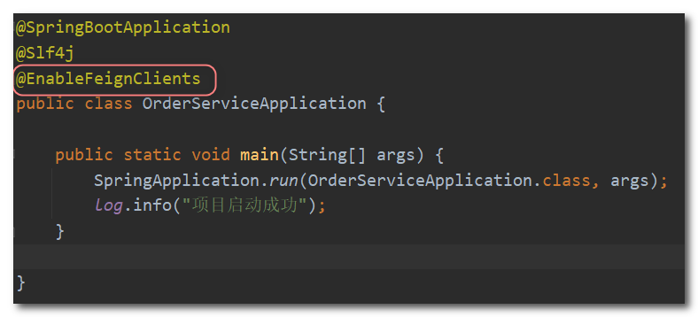
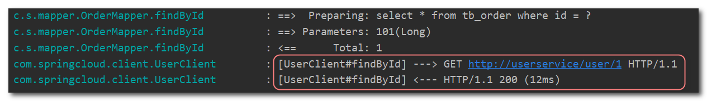
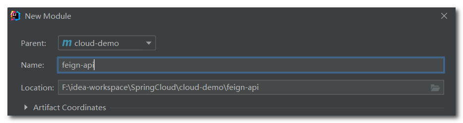
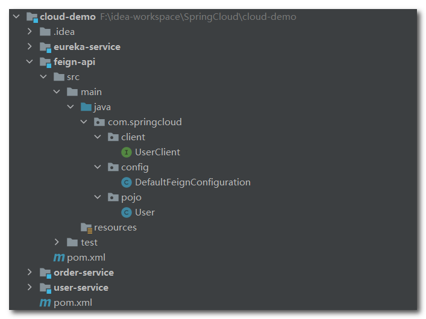
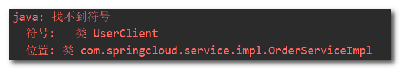

## Feign远程调用

### 1. Feign替代RestTemplate

Fegin的使用步骤如下：

**(1)  引入依赖**

我们在order-service服务的pom文件中引入feign的依赖

```xml
<dependency>
    <groupId>org.springframework.cloud</groupId>
    <artifactId>spring-cloud-starter-openfeign</artifactId>
</dependency>
```

**(2) 添加注解**

在order-service的启动类添加注解 `@EnableFeignClients` 开启Feign的功能：

> `@EnableFeignClients` 用于扫描启动类所在包下使用 `@FeignClient` 标识的接口，并为其创建Feign客户端的实例。
>
> `@EnableFeignClients` 注解上通常还会指定要扫描的Feign客户端接口所在的包路径。
>
> 例如，使用`@EnableFeignClients(basePackages = "com.example.clients")`可以告诉Spring容器去扫描`com.example.clients`包下的接口，并为其创建Feign客户端的实例。



**(3) 编写Feign的客户端**

在order-service中新建一个包client，在该包中新建一个接口，该接口使用注解 `@FeignClient` 标识：

> `@FeignClient` 注解的主要作用是标识该接口作为一个Feign客户端，并指定要调用的远程服务的名称。

```Java
@FeignClient("userservice") // 该注解中标明服务名称
public interface UserClient {
    @GetMapping("/user/{id}") // 这里是根据方法的参数id传递给请求路径中的id，与controller层中的请求正好相反
    User findById(@PathVariable("id") Long id);
}
```

这个客户端主要是基于SpringMVC的注解来声明远程调用的信息，比如：

- 服务名称：userservice
- 请求方式：GET
- 请求路径：/user/{id}
- 请求参数：Long id
- 返回值类型：User

这样，Feign就可以帮助我们发送http请求，无需自己使用RestTemplate来发送了。

**(4) 使用Feign发起调用**

修改order-service中的OrderServiceImpl类中的queryOrderById方法，使用Feign客户端代替RestTemplate：

```Java
    // 注入编写的Feign客户端
    @Autowired
    private UserClient userClient;

    public Order queryOrderById(Long orderId) {

        // 1.查询订单
        Order order = orderMapper.findById(orderId);

        // 2.利用Feign发起http请求，查询用户
        User user = userClient.findById(order.getUserId());
        
        order.setUser(user);
        return order;
    }
```

Feign内部集成了Ribbon，实现了负载均衡。


### 2. Feign的自定义配置

Feign可以支持很多的自定义配置，如下表所示：

| 类型                   | 作用             | 说明                                                   |
| ---------------------- | ---------------- | ------------------------------------------------------ |
| **feign.Logger.Level** | 修改日志级别     | 包含四种不同的级别：NONE、BASIC、HEADERS、FULL         |
| feign.codec.Decoder    | 响应结果的解析器 | http远程调用的结果做解析，例如解析json字符串为java对象 |
| feign.codec.Encoder    | 请求参数编码     | 将请求参数编码，便于通过http请求发送                   |
| feign. Contract        | 支持的注解格式   | 默认是SpringMVC的注解                                  |
| feign. Retryer         | 失败重试机制     | 请求失败的重试机制，默认是没有，不过会使用Ribbon的重试 |

一般情况下，默认值就能满足我们使用，如果要自定义时，只需要在配置文件中配置或者创建自定义的@Bean覆盖默认Bean即可。

下面以日志为例来演示如何自定义配置：

**(1) 配置文件的方式**

基于配置文件修改feign的日志级别针对单个服务：

```yaml
feign:  
  client:
    config: 
      userservice: # 针对某个微服务的配置
        loggerLevel: FULL #  日志级别 
```

也可以针对所有服务：

```yaml
feign:  
  client:
    config: 
      default: # 这里用default就是全局配置，如果是写服务名称，则是针对某个微服务的配置
        loggerLevel: FULL #  日志级别 
```

日志的级别分为四种：

- NONE：不记录任何日志信息，这是默认值。
- BASIC：仅记录请求的方法，URL以及响应状态码和执行时间
- HEADERS：在BASIC的基础上，额外记录了请求和响应的头信息
- FULL：记录所有请求和响应的明细，包括头信息、请求体、元数据。

**(2) java代码方式**

先声明一个配置类（不需要加注解修饰），然后创建一个Logger.Level的对象：

```java
public class DefaultFeignConfiguration  {
    @Bean
    public Logger.Level feignLogLevel(){
        return Logger.Level.BASIC; // 日志级别为BASIC
    }
}
```

如果要**全局生效**，将其放到启动类的 `@EnableFeignClients` 这个注解中：

```java
@EnableFeignClients(defaultConfiguration = DefaultFeignConfiguration .class) 
```

如果是**局部生效**，则把它放到对应的 `@FeignClient` 这个注解中：

```java
@FeignClient(value = "userservice", configuration = DefaultFeignConfiguration .class) 
```

效果如下：




### 3. Feign的使用优化

Feign底层发起http请求，依赖于其它的框架。其底层客户端实现包括：

- URLConnection：默认实现，不支持连接池

- Apache HttpClient ：支持连接池

- OKHttp：支持连接池

因此提高Feign的性能主要手段就是使用**连接池**代替默认的URLConnection。

这里我们用Apache的HttpClient来演示。

**(1) 引入依赖**

在order-service的pom文件中引入Apache的HttpClient依赖：

```xml
<!--httpClient的依赖 -->
<dependency>
    <groupId>io.github.openfeign</groupId>
    <artifactId>feign-httpclient</artifactId>
</dependency>
```

**(2) 配置连接池**

在order-service的application.yml中添加配置：

```yml
feign:
  client:
    config:
      default: # 全局的配置
        loggerLevel: BASIC # 日志级别，BASIC就是基本的请求和响应信息
  httpclient:
    enabled: true # 开启feign对HttpClient的支持
    max-connections: 200 # 最大的连接数
    max-connections-per-route: 50 # 每个路径的最大连接数
```


### 4. Feign的抽取

Feign的客户端与服务提供者的controller代码非常相似，有没有一种办法简化这种重复的代码编写呢？

将Feign的Client抽取为独立模块，并且把接口有关的POJO、默认的Feign配置都放到这个模块中，提供给所有消费者使用。

例如，将UserClient、User、Feign的默认配置都抽取到一个feign-api包中，所有微服务引用该依赖包，即可直接使用。


**(1) 创建一个新的module**

 首先创建一个maven项目，命名为feign-api：



在feign-api中然后引入feign的starter依赖

```xml
<dependency>
    <groupId>org.springframework.cloud</groupId>
    <artifactId>spring-cloud-starter-openfeign</artifactId>
</dependency>
```

**(2) 抽取公共部分**

将order-service中的UserClient、User、DefaultFeignConfiguration都复制到feign-api项目中。

然后删除order-service中的UserClient、User、DefaultFeignConfiguration等类或接口。



**(3) 导入创建的maven项目**

 在order-service中导入feign-api依赖

```xml
<!--feign-api的依赖-->
<dependency>
    <groupId>org.example</groupId>
    <artifactId>feign-api</artifactId>
    <version>1.0-SNAPSHOT</version>
</dependency>
```

修改order-service中的所有与上述三个组件有关的导包部分，改成导入feign-api中的包。

**(4) 解决扫描包问题**

重启服务后，发现服务报错了：



这是因为UserClient现在在feign-api项目的com.springcloud.client包下，

而order-service的@EnableFeignClients注解是在order-service项目的com.springcloud包下，不在同一个包，无法扫描到UserClient。

**方式一：指定Feign应该扫描的包：**

```java
@EnableFeignClients(basePackages = "com.springcloud.clients")
```

**方式二：指定需要加载的Client接口：**

```java
@EnableFeignClients(clients = {UserClient.class})
```

