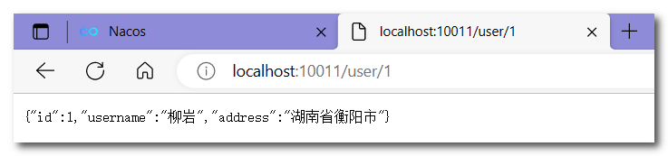
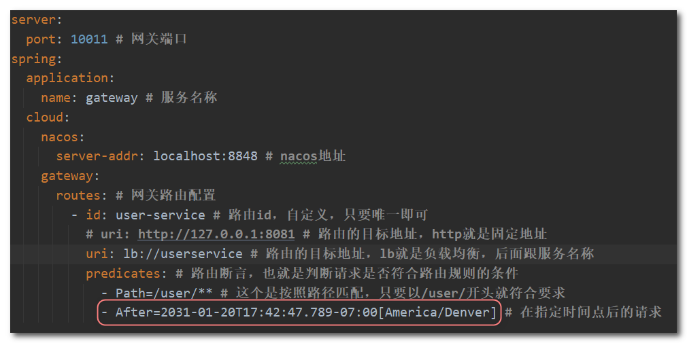
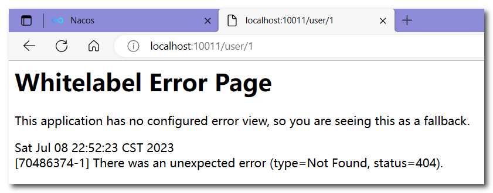
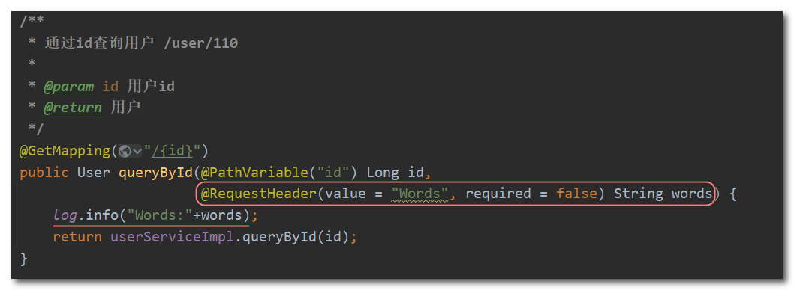
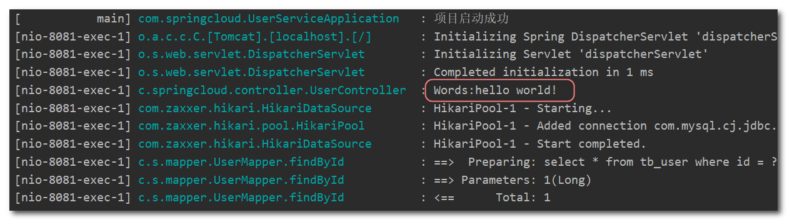
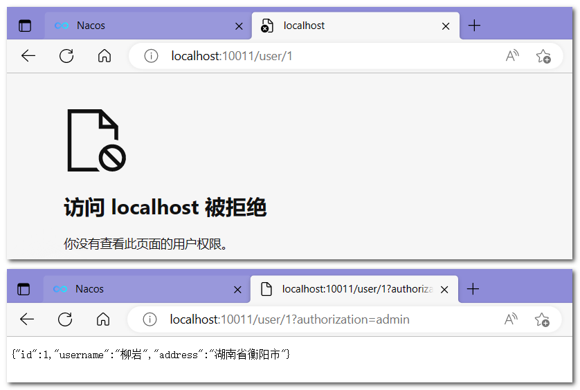

## Gateway服务网关

网关（Gateway）是一个在微服务架构中起到入口和出口的作用，它充当了客户端和后端服务之间的中间层。Spring Cloud Gateway是Spring Cloud提供的一种基于Spring Framework 5、Project Reactor和Spring Boot 2的网关解决方案，用于构建高效的微服务架构中的API网关。

Spring Cloud Gateway的主要特性包括：

1. 路由转发：Spring Cloud Gateway可以根据请求的路径、方法和其他条件将请求转发到相应的微服务实例。它支持灵活的路由配置，可以根据需要进行路径重写、添加请求头、请求参数等操作。

2. 过滤器：Gateway提供了一系列的过滤器，可以在请求被转发到目标服务之前或之后对请求进行处理。这些过滤器可以用于认证、鉴权、请求日志记录、流量控制等各种功能。

3. 负载均衡：Gateway集成了Spring Cloud LoadBalancer，可以通过负载均衡算法将请求分发到多个目标服务实例之间，实现高可用和高性能。

4. 断路器：Gateway内置了断路器功能，可以在目标服务出现故障或不可用时进行熔断处理，避免级联故障。

5. 动态路由：Gateway支持动态路由配置，可以通过服务发现机制（如Eureka、Consul等）动态地添加、删除或修改路由规则，无需重启网关服务。

6. 可扩展性：Gateway基于Spring Framework和Spring Boot构建，可以很容易地与其他Spring Cloud组件集成，如服务注册与发现、配置中心等。

通过使用Spring Cloud Gateway，可以实现统一的API入口，集中处理跨越多个微服务的共同功能，如身份验证、请求转发、限流等。它还提供了灵活的路由配置和丰富的过滤器机制，使得微服务架构中的API管理更加简单和可靠。


### 1. gateway快速入门

下面演示下网关的基本路由功能。基本步骤如下：

1. 创建SpringBoot工程gateway，引入网关依赖
2. 编写基础配置和路由规则
3. 启动网关服务进行测试

**(1) 创建gateway服务，引入依赖**

```xml
<!--网关-->
<dependency>
    <groupId>org.springframework.cloud</groupId>
    <artifactId>spring-cloud-starter-gateway</artifactId>
</dependency>
<!--nacos服务发现依赖-->
<dependency>
    <groupId>com.alibaba.cloud</groupId>
    <artifactId>spring-cloud-starter-alibaba-nacos-discovery</artifactId>
</dependency>
<!--负载均衡依赖-->
<dependency>
    <groupId>org.springframework.cloud</groupId>
    <artifactId>spring-cloud-starter-loadbalancer</artifactId>
</dependency>
```

**(2) 编写基础配置和路由规则**

路由配置包括：

1. 路由id：路由的唯一标示

2. 路由目标（uri）：路由的目标地址，http代表固定地址，lb代表根据服务名负载均衡

3. 路由断言（predicates）：判断路由的规则，

4. 路由过滤器（filters）：对请求或响应做处理

创建application.yml文件，内容如下：

```yml
server:
  port: 10010 # 网关端口
spring:
  application:
    name: gateway # 服务名称
  cloud:
    nacos:
      server-addr: localhost:8848 # nacos地址
    gateway:
      routes: # 网关路由配置
        - id: user-service # 路由id，自定义，只要唯一即可
          # uri: http://127.0.0.1:8081 # 路由的目标地址，http就是固定地址
          uri: lb://userservice # 路由的目标地址，lb就是负载均衡，后面跟服务名称
          predicates: # 路由断言，也就是判断请求是否符合路由规则的条件
            - Path=/user/** # 这个是按照路径匹配，只要以/user/开头就符合要求
          fiters: # 路由过滤器
          	#- AddRequestHeader=Words, hello world! # 添加请求头
```

符合`Path` 规则的一切请求，都代理到 `uri`参数指定的地址，再根据服务名拉取服务列表，实现负载均衡。

**(3) 测试**

访问http://localhost:10010/user/1，符合`/user/**`规则，请求转发到uri：http://userservice/user/1，再根据负载均衡分配到http://localhost:8081/user/1，结果如下所示




### 2. 网关路由的流程


### 3. 断言工厂

我们在配置文件中写的断言规则只是字符串，这些字符串会被Predicate Factory读取并处理，转变为路由判断的条件。

例如Path=/user/**是按照路径匹配，这个规则是由

`org.springframework.cloud.gateway.handler.predicate.PathRoutePredicateFactory`类来处理的。

像这样的断言工厂在SpringCloudGateway还有十几个:

| **名称**   | **说明**                       | **示例**                                                     |
| ---------- | ------------------------------ | ------------------------------------------------------------ |
| After      | 是某个时间点后的请求           | -  After=2031-01-20T17:42:47.789-07:00[America/Denver]       |
| Before     | 是某个时间点之前的请求         | -  Before=2031-04-13T15:14:47.433+08:00[Asia/Shanghai]       |
| Between    | 是某两个时间点之前的请求       | -  Between=2037-01-20T17:42:47.789-07:00[America/Denver],  2037-01-21T17:42:47.789-07:00[America/Denver] |
| Cookie     | 请求必须包含某些cookie         | - Cookie=chocolate, ch.p                                     |
| Header     | 请求必须包含某些header         | - Header=X-Request-Id, \d+                                   |
| Host       | 请求必须是访问某个host（域名） | -  Host=.somehost.org,.anotherhost.org                       |
| Method     | 请求方式必须是指定方式         | - Method=GET,POST                                            |
| Path       | 请求路径必须符合指定规则       | - Path=/red/{segment},/blue/**                               |
| Query      | 请求参数必须包含指定参数       | - Query=name, Jack或者-  Query=name                          |
| RemoteAddr | 请求者的ip必须是指定范围       | - RemoteAddr=192.168.1.1/24                                  |

下面介绍一下After规则的使用：



上述配置的After规则，需要在2023年1月23号之后的请求才会被处理，而当前不符合规则，所以无法访问：



暂时只需要掌握Path这种路由规则就可以了，忘记了去查阅官网，有详细的使用示例。


### 4. 过滤器工厂

GatewayFilter是Spring Cloud Gateway中的一个核心组件，用于在请求进入和响应离开网关时进行过滤和处理。GatewayFilter允许开发人员对请求和响应进行修改、增强和验证，以满足各种需求，例如安全认证、请求日志记录、请求转发等。


Spring提供了31种不同的路由过滤器工厂，例如：

| **名称**             | **说明**                     |
| -------------------- | ---------------------------- |
| AddRequestHeader     | 给当前请求添加一个请求头     |
| RemoveRequestHeader  | 移除请求中的一个请求头       |
| AddResponseHeader    | 给响应结果中添加一个响应头   |
| RemoveResponseHeader | 从响应结果中移除有一个响应头 |
| RequestRateLimiter   | 限制请求的流量               |

#### 4.1 请求头过滤器

下面介绍一下 `AddRequestHeader` 的使用：给所有进入userservice的请求添加一个请求头：`Words=hello world!`

只需要修改gateway服务的application.yml文件，添加路由过滤即可：

```yaml
spring:
  application:
    name: gateway # 服务名称
  cloud:
    nacos:
      server-addr: localhost:8848 # nacos地址
    gateway:
      routes: # 网关路由配置
        - id: user-service 
          uri: lb://userservice
          predicates: # 路由断言
            - Path=/user/**
          filters: # 过滤器
            - AddRequestHeader=Words, hello world! # 添加请求头
```

当前过滤器写在userservice路由下，因此仅仅对访问userservice的请求有效。

测试请求头是否添加成功，在UserController中查询用户的方法，声明一个形参接收一个请求头参数，然后将接收的参数打印出来：



访问 http://localhost:10010/user/1，查看控制台日志，可以看到获取到了添加的请求头信息：




#### 4.2 默认过滤器

如果要对所有的路由都生效，则可以将过滤器工厂写到default下，表示默认过滤器，格式如下：

```yml
spring:
  application:
    name: gateway 
  cloud:
    nacos:
      server-addr: localhost:8848 
    gateway:
      routes:
        - id: user-service 
          uri: lb://userservice
          predicates: 
            - Path=/user/**
          filters: 
            #- AddRequestHeader=Words, hello world! # 添加请求头
      default-filters:
        - AddRequestHeader=Words, Hello World! # 添加请求头
```

需要注意 `default-filters` 是与 `routes` 平级的。

访问 http://localhost:10010/user/1，查看控制台日志：


#### 4.3 全局过滤器

全局过滤器的作用也是处理一切进入网关的请求和微服务响应，与GatewayFilter的作用一样。

区别在于GatewayFilter通过配置定义，处理逻辑是固定的；而GlobalFilter的逻辑需要自己写代码实现。

定义全局过滤器的方式是**实现GlobalFilter接口**：

```Java
public interface GlobalFilter {
    /**
     *  处理当前请求，有必要的话通过{@link GatewayFilterChain}将请求交给下一个过滤器处理
     *
     * @param exchange 请求上下文，里面可以获取Request、Response等信息
     * @param chain 用来把请求委托给下一个过滤器 
     * @return Mono<Void> 返回Mono对象表示当前过滤器业务结束
     */
    Mono<Void> filter(ServerWebExchange exchange, GatewayFilterChain chain);
}
```

下面自定义一个全局过滤器：

需求：定义全局过滤器，拦截请求，判断请求的参数是否满足下面条件，如果同时满足则放行，否则拦截。

- 参数中是否有authorization

- authorization参数值是否为admin

实现：在gateway中创建一个包filters，定义一个过滤器，使用@Order注解标明过滤器的执行顺序：

> `@Order` 注解是Spring框架提供的一个通用注解，用于指定组件的加载顺序。在应用程序中存在多个组件（如过滤器、拦截器、切面等）时，可以使用 `@Order` 注解来控制它们的加载顺序。
>
> `@Order` 注解的值表示组件的优先级，具有较小值的组件会先被加载和执行。如果多个组件具有相同的优先级，它们的加载顺序将无法确定。

```Java
@Order(-1) // @Order中的值越大，执行的顺序越靠后。
@Component
public class AuthorizeFilter implements GlobalFilter {
    @Override
    public Mono<Void> filter(ServerWebExchange exchange, GatewayFilterChain chain) {
        // 1.获取请求参数
        MultiValueMap<String, String> params = exchange.getRequest().getQueryParams();
        // 2.获取authorization参数
        String auth = params.getFirst("authorization");
        // 3.校验
        if ("admin".equals(auth)) {
            // 放行
            return chain.filter(exchange); // filter方法会返回一个Mono的实例
        }
        // 4.拦截
        // 禁止访问，设置状态码
        exchange.getResponse().setStatusCode(HttpStatus.FORBIDDEN); // 状态码需要使用枚举类型
        // 结束处理
        return exchange.getResponse().setComplete(); // setComplete也会返回一个Mono的实例
    }
}
```

如果不使用@Order注解指明过滤器的执行先后，也可使通过实现Odered接口中的getOrder方法来代替@Order注解：

```java 
@Component
public class AuthorizeFilter implements GlobalFilter,Ordered {
    
    //过滤器方法。。。

    @Override
    public int getOrder() {
        return -1;
    }
}
```

访问 http://localhost:10010/user/1 和 http://localhost:10010/user/1?authorization=admin，查看结果




#### 4.4 过滤器执行顺序

请求进入网关会碰到三类过滤器：当前路由的过滤器、DefaultFilter、GlobalFilter

请求路由后，会将当前路由过滤器和DefaultFilter、GlobalFilter，合并到一个过滤器链（集合）中，排序后依次执行每个过滤器：


排序的规则是什么呢？

- 每一个过滤器都必须指定一个int类型的order值，**order值越小，优先级越高，执行顺序越靠前**。
- GlobalFilter通过实现Ordered接口，或者添加@Order注解来指定order值，由我们自己指定。
- 路由过滤器和defaultFilter的order由Spring指定，默认是按照声明顺序从1递增。
- 当过滤器的order值一样时，会按照 defaultFilter > 路由过滤器 > GlobalFilter的顺序执行。


### 5. cors跨域配置

#### 5.1 跨域问题

跨域：域名不一致就是跨域，主要包括：

- 域名不同： www.taobao.com 和 www.taobao.org 和 www.jd.com 和 miaosha.jd.com

- 域名相同，端口不同：localhost:8080和localhost8081

跨域问题：浏览器禁止请求的发起者与服务端发生跨域ajax请求，请求被浏览器拦截的问题

解决方案：CORS，不知道的可以查看https://www.ruanyifeng.com/blog/2016/04/cors.html


#### 5.2 解决跨域问题

在gateway服务的application.yml文件中，添加下面的配置：

```yaml
spring:
  cloud:
    gateway:
      # 。。。这里省略了其他配置
      globalcors: # 全局的跨域处理
        add-to-simple-url-handler-mapping: true # 解决options请求被拦截问题
        corsConfigurations:
          '[/**]':
            allowedOrigins: # 允许哪些网站的跨域请求 
              - "http://localhost:8090"
            allowedMethods: # 允许的跨域ajax的请求方式
              - "GET"
              - "POST"
              - "DELETE"
              - "PUT"
              - "OPTIONS"
            allowedHeaders: "*" # 允许在请求中携带的头信息
            allowCredentials: true # 是否允许携带cookie
            maxAge: 360000 # 这次跨域检测的有效期
```

