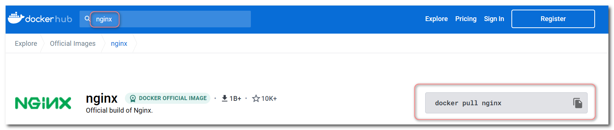
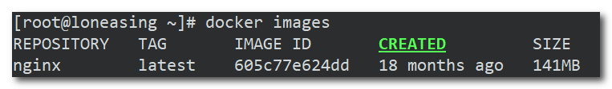
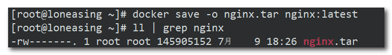
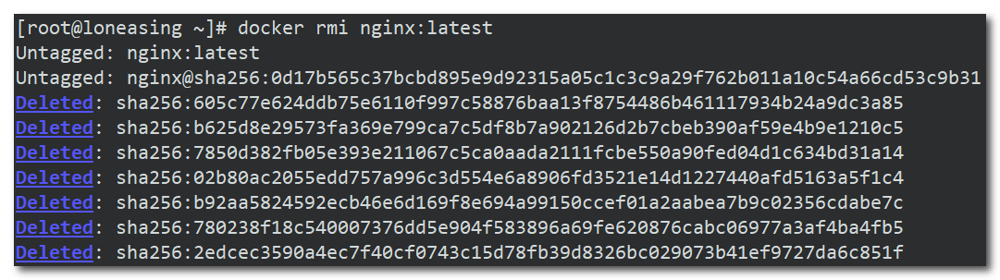
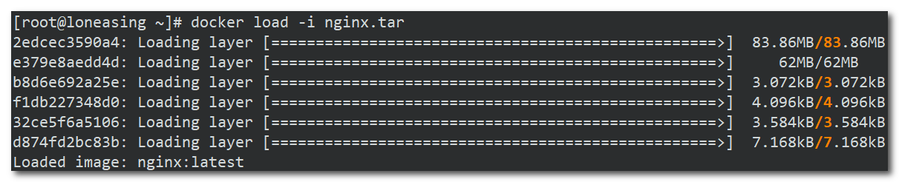
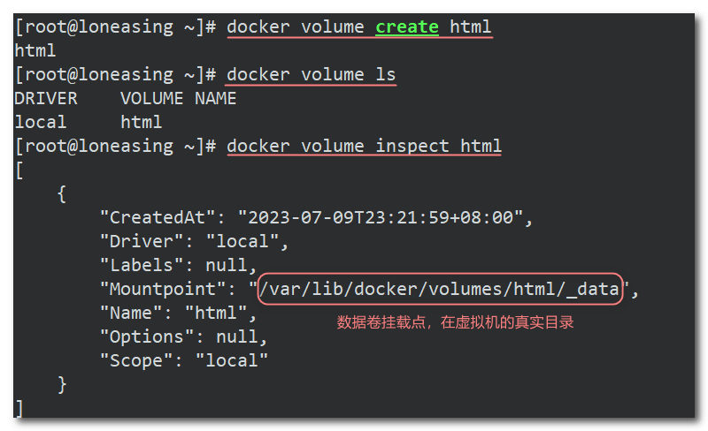
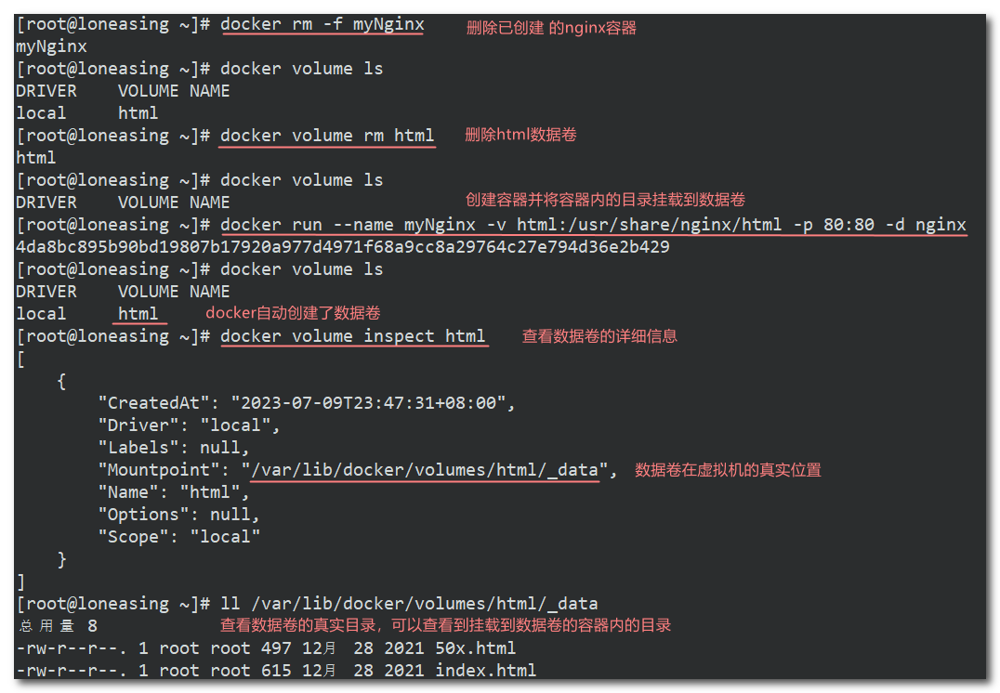
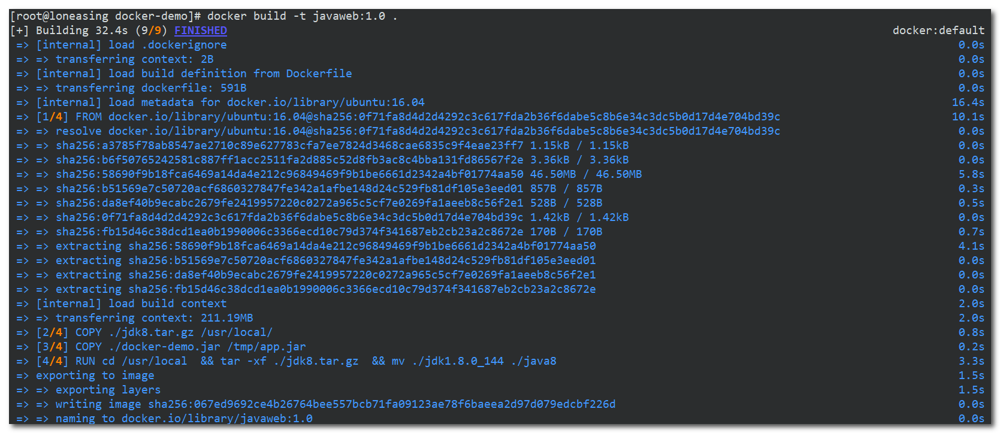
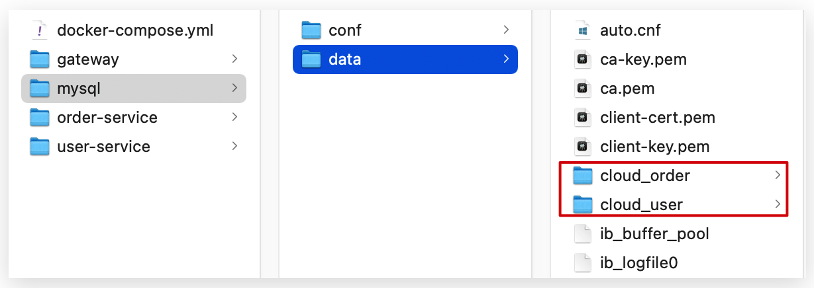
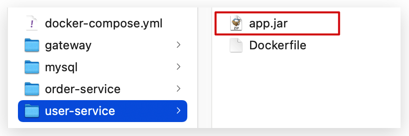

## Docker

Docker是一个开源的容器化平台，用于快速构建、部署和运行应用程序。它通过使用容器来封装应用程序及其依赖项，并提供了一个轻量级、可移植和可扩展的解决方案，使应用程序能够在不同的环境中以一致的方式运行。

以下是Docker的一些核心概念和特点：

1. 容器化：Docker利用Linux容器技术，将应用程序及其依赖项打包成一个独立的容器。容器包含了所需的操作系统、库文件、代码和配置等，可以在不同的环境中进行部署和运行，而无需担心环境差异和依赖冲突。
2. 镜像（Image）：镜像是Docker的基本构建块，它是一个只读的模板，包含了运行应用程序所需的所有内容。可以将镜像视为一个软件包，其中包含了应用程序、操作系统和其他依赖项。通过使用镜像，可以快速创建和启动容器。
3. 容器（Container）：容器是从镜像创建的运行实例。容器是一个隔离的、轻量级的进程，具有自己的文件系统、网络和进程空间。通过容器，可以在同一主机上同时运行多个应用程序，并且它们相互之间是隔离的，不会相互影响。
4. 易于构建和部署：Docker提供了一套简单而强大的命令行工具，可以使用Dockerfile定义应用程序的构建过程，并通过简单的命令进行构建、部署和管理容器。
5. 可移植性和可扩展性：Docker容器可以在不同的环境中运行，包括开发人员的本地机器、测试环境和生产环境。由于容器具有轻量级和隔离的特性，可以很容易地在不同的主机之间迁移和扩展应用程序。

### 1. 安装docker

Docker CE (社区免费版本) 要求linux内核版本不低于 3.10， CentOS 7 满足最低内核的要求，在CentOS 7安装Docker。

**(1) 安装yum工具**

```sh
yum install -y yum-utils device-mapper-persistent-data lvm2 --skip-broken
```

**(2) 更新本地镜像源**

```sh
yum-config-manager --add-repo https://mirrors.aliyun.com/docker-ce/linux/centos/docker-ce.repo
    
sed -i 's/download.docker.com/mirrors.aliyun.com\/docker-ce/g' /etc/yum.repos.d/docker-ce.repo

yum makecache 

```

**(3) 安装docker**

```sh
yum install -y docker-ce
```

输入命令，查看docker版本确定是否安装成功：

```sh
docker -v
```

**(4) 启动docker**

Docker应用需要用到各种端口，逐一去修改防火墙设置。非常麻烦，因此建议启动docker前直接关闭防火墙。

```sh
systemctl stop firewalld  # 关闭防火墙

systemctl disable firewalld  # 禁止开机启动防火墙
```

```sh
systemctl start docker  # 启动docker服务

systemctl stop docker  # 停止docker服务

systemctl restart docker  # 重启docker服务
```

**(5) 配置镜像加速**

docker官方镜像仓库网速较差，我们需要设置国内镜像服务：

```sh
mkdir -p /etc/docker
tee /etc/docker/daemon.json <<-'EOF'
{
  "registry-mirrors": ["https://z8dbcpx6.mirror.aliyuncs.com"]
}
EOF
systemctl daemon-reload
systemctl restart docker

```

参考阿里云的镜像加速文档：https://cr.console.aliyun.com/cn-hangzhou/instances/mirrors


### 2. 镜像操作

首先来看下镜像的名称组成：

- 镜名称一般分两部分组成：[repository]:[tag]。
- 在没有指定tag时，默认是latest，代表最新版本的镜像


这里的mysql就是repository，5.7就是tag，合一起就是镜像名称，代表5.7版本的MySQL镜像。


#### 2.1 镜像命令

- docker images	查看镜像
- docker rmi	删除镜像
- docker build	构建镜像
- docker push	推送镜像到服务
- docker pull	从服务拉取镜像
- docker save	保存镜像为一个tar压缩包
- docker load	加载tar压缩包为镜像


**注意**：命令的具体使用可以通过添加`--help`参数查询，比如查询load命令具体使用：`docker load --help`


#### 2.2 镜像操作案例

从DockerHub中拉取一个nginx镜像。

**(1) 首先去镜像仓库[DockerHub](https://hub.docker.com/)搜索nginx镜像**



**(2) 拉取镜像：doker pull [镜像名称]**

不指定版本，默认拉取最新的latest版本


**(3) 查看镜像：docker images**



**(4) 保存镜像：docker save -o [目标文件名称] [镜像名称]**

```sh
docker save -o nginx.tar nginx:latest
```



**(5) 删除镜像：docker rmi [镜像名称]**

```sh
docker rmi nginx:latest
```



**(6) 导入镜像：docker load -i [tar文件]**

```sh
docker load -i nginx.tar
```




### 3. 容器操作

#### 3.1 容器操作命令

- docker run：创建并运行一个容器，处于运行状态
- docker pause：让一个运行的容器暂停
- docker unpause：让一个容器从暂停状态恢复运行
- docker stop：停止一个运行的容器
- docker start：让一个停止的容器再次运行

- docker rm：删除一个容器


容器保护三个状态：

- 运行：进程正常运行
- 暂停：进程暂停，CPU不再运行，并不释放内存
- 停止：进程终止，回收进程占用的内存、CPU等资源


#### 3.2 容器操作案例

创建并运行nginx容器。

**(1) 创建并运行容器**

```sh
docker run --name myNginx -p 80:80 -d nginx
```

命令解读：

- docker run ：创建并运行一个容器
- --name : 给容器起一个名字，比如叫做myNginx
- -p ：将宿主机端口与容器端口映射，冒号左侧是宿主机端口，右侧是容器端口
- -d：后台运行容器
- nginx：镜像名称，例如nginx

这里的`-p`参数，是将容器端口映射到宿主机端口。

默认情况下，容器是隔离环境，我们直接访问宿主机的80端口，肯定访问不到容器中的nginx。

现在，将容器的80与宿主机的80关联起来，当我们访问宿主机的80端口时，就会被映射到容器的80，这样就能访问到nginx了：


启动成功返回一个容器id：


**(2) 查看所有运行的容器**

`docker ps` ，该命令仅查看运行中的容器。

`docker ps -a`，该命令可以查看所有的容器。

```sh
docker ps
docker ps -a
```


**(3) 进入容器内部修改文件**

**需求**：进入Nginx容器，修改HTML文件内容，添加“我在学习docker”

**提示**：进入容器要用到 docker exec 命令：`docker exec -it 容器名称 执行的命令`

1. 进入创建的nginx容器

   ```sh
   docker exec -it myNginx bash
   ```

   命令解读：

   - docker exec ：进入容器内部，执行一个命令

   - -it : 给当前进入的容器创建一个标准输入、输出终端，允许我们与容器交互

   - myNginx：要进入的容器的名称

   - bash：进入容器后执行的命令，bash是一个linux终端交互命令

2. 进入nginx的HTML所在目录

   ```sh
   cd /usr/share/nginx/html
   ```

   容器内部会模拟一个独立的Linux文件系统，看起来如同一个linux服务器一样，这个容器是个阉割版的Linux服务器，只携带跟镜像相关的文件。如下图所示，vi命令与nginx无关，所以该容器没有安装该命令。

   

3. 修改index.html的内容

   容器内没有vi命令，无法直接修改，我们用下面的命令来修改：

   ```sh
   sed -i -e 's#Welcome to nginx#我在学习docker#g' -e 's#<head>#<head><meta charset="utf-8">#g' index.html
   ```

   

**(4) 删除容器**

`docker rm 容器名称`，该命令只能删除停止的容器。

`docker rm -f 容器名称`，改名可以强制删除指定的容器。

```sh
docker rm myNignx
docker rm -f myNginx
```


### 4. 数据卷(容器数据管理)

在之前的nginx案例中，修改nginx的html页面时，需要进入nginx内部。并且因为没有编辑器，修改文件也很麻烦。

这就是因为容器与数据（容器内文件）耦合带来的后果。**数据卷（volume）**是一个虚拟目录，指向宿主机文件系统中的某个目录。


一旦完成数据卷挂载，对容器的一切操作都会作用在数据卷对应的宿主机目录了。

这样，我们操作宿主机的/var/lib/docker/volumes/html目录，就等于操作容器内的/usr/share/nginx/html目录了。

#### 4.1 数据卷操作命令

数据卷操作的基本语法：`docker volume [COMMAND]`

docker volume命令是数据卷操作，根据命令后跟随的command来确定下一步的操作：

- docker volume create：创建数据卷
- docker volume ls：查看所有数据卷
- docker volume inspect：查看数据卷详细信息，包括关联的宿主机目录位置
- docker volume rm：删除指定数据卷
- docker volume prune：删除所有未使用的数据卷


#### 4.2 创建和查看数据卷

 创建数据卷：`docker volume creat 数据卷名`，该数据卷会挂载到虚拟机的真实目录中。

```sh
docker volume create html
```

查看所有数据卷：

```sh
docker volume ls
```

查看数据卷详细信息：`docker volume inspect 数据卷名`

```sh
docker volume inspect html
```




#### 4.3 挂载数据卷

我们在创建容器时，可以通过 -v 参数将容器内的目录挂载到数据卷，这样访问虚拟机的真实目录也就是访问容器内的目录。

使用语法：`-v [数据卷名]:[需要挂载的目录]`

下面给nginx的html目录挂载数据卷：

①首先先删除已创建的nginx容器

```sh
docker rm -f myNginx
```

②创建容器并将容器内的/usr/share/nginx/html目录挂载到数据卷html，此时即使没有创建数据卷docker也会自动帮我们创建。

```sh
docker run --name myNginx -v html:/usr/share/nginx/html -p 80:80 -d nginx
```

③查看数据卷所在位置，查看该目录下的文件

```sh
# 查看html数据卷的位置
docker volume inspect html
# 查看该目录
ll /var/lib/docker/volumes/html/_data
```




#### 4.4 挂载本地目录

容器不仅仅可以挂载到数据卷，也可以直接挂载到宿主机目录上

**挂载本地目录的作用的用本地目录的文件覆盖所挂载的目录的文件**。关联关系如下：

- 挂载数据卷：宿主机目录 --> 数据卷 ---> 容器内目录
- 直接挂载目录：宿主机目录 ---> 容器内目录

挂载目录与挂载数据卷的语法是类似的：

- `-v [宿主机目录]:[容器内目录]`
- `-v [宿主机文件]:[容器内文件]`

**需求**：创建并运行一个MySQL容器，将宿主机目录直接挂载到容器

实现思路如下：

1）创建目录`/tmp/mysql/data`

2）创建目录`/tmp/mysql/conf`，将提供的hmy.cnf文件上传到/tmp/mysql/conf

3）下载mysql镜像

4）去DockerHub查阅资料，创建并运行MySQL容器，要求：

- 将mysql容器内数据存储目录：`/var/lib/mysql` 挂载到虚拟机目录 `/tmp/mysql/data`


- 将mysql容器的配置文件：`/etc/mysql/conf.d/hmy.cnf` 挂载到虚拟机目录下的文件 `/tmp/mysql/conf/hmy.cnf`


- 设置MySQL密码

```sh
docker run --name mysql -e MYSQL_ROOT_PASSWORD=123456 -p 3306:3306 \
-v /tmp/mysql/data:/var/lib/mysql \
-v /tmp/mysql/conf/hmy.cnf:/etc/mysql/conf.d/hmy.cnf \
-d mysql
```

挂载数据卷与直接挂载目录优缺点：

- 数据卷挂载耦合度低，由docker来管理目录，但是目录较深，不好找
- 目录挂载耦合度高，需要我们自己管理目录，不过目录容易寻找查看


### 5. 自定义镜像

#### 5.1 镜像结构

常见的镜像在DockerHub就能找到，但是我们自己写的项目就必须自己构建镜像了。

而要自定义镜像，就必须先了解镜像的结构才行，镜像是将应用程序及其需要的系统函数库、环境、配置、依赖打包而成。

以MySQL为例，来看看镜像的组成结构：


构建自定义的镜像时，并不需要一个个文件去拷贝，打包。我们只需要告诉Docker，我们的镜像的组成，需要哪些BaseImage、需要拷贝什么文件、需要安装什么依赖、启动脚本是什么，将来Docker会帮助我们构建镜像。而描述这些信息的文件就是Dockerfile文件。

**Dockerfile**就是一个文本文件，其中包含一个个的指令，用指令来说明要执行什么操作来构建镜像，每一个指令都会形成一层Layer。


下面是一个Dockerfile文件的内容示例：

```dockerfile
# 指定基础镜像
FROM ubuntu:16.04
# 配置环境变量，JDK的安装目录
ENV JAVA_DIR=/usr/local

# 拷贝jdk和java项目的包
COPY ./jdk8.tar.gz $JAVA_DIR/
COPY ./docker-demo.jar /tmp/app.jar

# 安装JDK
RUN cd $JAVA_DIR \
 && tar -xf ./jdk8.tar.gz \
 && mv ./jdk1.8.0_144 ./java8

# 配置环境变量
ENV JAVA_HOME=$JAVA_DIR/java8
ENV PATH=$PATH:$JAVA_HOME/bin

# 暴露端口
EXPOSE 8090
# 入口，java项目的启动命令
ENTRYPOINT java -jar /tmp/app.jar
```


#### 5.2 构建java项目的镜像

**(1) 基于Ubuntu镜像构建一个java项目镜像**

- 新建一个空文件夹`docker-demo`
- 拷贝资料中的 `docker-demo.jar `文件到 `docker-demo` 文件夹
- 拷贝资料中的 `jdk8.tar.gz `文件到 `docker-demo` 文件夹
- 拷贝资料中的 `Dockerfile` 到 `docker-demo` 文件夹

Dockerfile文件的内容如下：

```dockerfile
# 指定基础镜像
FROM ubuntu:16.04
# 配置环境变量，JDK的安装目录
ENV JAVA_DIR=/usr/local

# 拷贝jdk和java项目的包
COPY ./jdk8.tar.gz $JAVA_DIR/
COPY ./docker-demo.jar /tmp/app.jar

# 安装JDK
RUN cd $JAVA_DIR \
 && tar -xf ./jdk8.tar.gz \
 && mv ./jdk1.8.0_144 ./java8

# 配置环境变量
ENV JAVA_HOME=$JAVA_DIR/java8
ENV PATH=$PATH:$JAVA_HOME/bin

# 暴露端口
EXPOSE 8090
# 入口，java项目的启动命令
ENTRYPOINT java -jar /tmp/app.jar
```


将docker-demo文件夹上传到虚拟机的任意目录，然后进入docker-demo目录下执行命令构建镜像：

`docker build -t [镜像名称] [Dockerfile文件所在目录]`

```sh
docker build -t javaweb:1.0 .
```

上述命令中javaweb:1.0为自定义的镜像名称，.表示Dockerfile文件所在的目录为当前目录。



查看所有镜像，可以发现自定义的镜像也在docker仓库中了：


创建该镜像的容器：

```sh
docker run --name javaweb -p 8090:8090 -d javaweb:1.0 
```

最后访问 http://192.168.101.100:8090/hello/count


**(2) 基于java:8-alpine镜像构建Java项目镜像**

Java项目都需要依赖于JDK运行，所以每次创建镜像时都要导入JDK的包，并且配置环境变量，这些步骤非常枯燥。

可以基于java:8-alpine镜像将一个Java项目构建成一个镜像，java:8-alpine镜像中已经引入了jdk8并配置好了环境变量。

在基于Ubuntu镜像构建一个新镜像的基础上，只需要将Dockerfile文件进行修改，将基础的镜像改为java:8-alpine：

```dockerfile
FROM java:8-alpine
COPY ./app.jar /tmp/app.jar
EXPOSE 8090
ENTRYPOINT java -jar /tmp/app.jar
```

其他的操作与上述的操作一样。


### 6. DockerCompose

#### 6.1 安装DockerCompose

**(1) 下载DockerCompose文件**

```sh
curl -L https://github.com/docker/compose/releases/download/1.23.1/docker-compose-`uname -s`-`uname -m` > /usr/local/bin/docker-compose
```

如果下载速度较慢，或者下载失败，可以使用资料提供的docker-compose文件，将其上传到`/usr/local/bin/`目录。

**(2) 修改文件权限**

```sh
chmod +x /usr/local/bin/docker-compose
```

**(3) Base自动补全命令**

```sh
curl -L https://raw.githubusercontent.com/docker/compose/1.29.1/contrib/completion/bash/docker-compose > /etc/bash_completion.d/docker-compose
```

如果这里出现错误，需要修改自己的hosts文件：

```sh
echo "199.232.68.133 raw.githubusercontent.com" >> /etc/hosts
```


#### 6.2 部署微服务集群

利用DockerCompose部署之前学习的cloud-demo微服务集群。

**实现思路**：

① 查看资料提供的cloud-demo文件夹，里面已经编写好了docker-compose.yml文件

② 修改自己的cloud-demo项目，将数据库、nacos地址都命名为docker-compose中的服务名

③ 使用maven打包工具，将项目中的每个微服务都打包为app.jar

④ 将打包好的app.jar拷贝到cloud-demo中的每一个对应的子目录中

⑤ 将cloud-demo上传至虚拟机，利用 docker-compose up -d 来部署


**(1) 编写docker-compose.yml文件**

```yml
version: "3.2"

services:
  nacos:
    image: nacos/nacos-server
    environment:
      MODE: standalone
    ports:
      - "8848:8848"
  mysql:
    image: mysql:5.7.25
    environment:
      MYSQL_ROOT_PASSWORD: 123
    volumes:
      - "$PWD/mysql/data:/var/lib/mysql"
      - "$PWD/mysql/conf:/etc/mysql/conf.d/"
  userservice:
    build: ./user-service
  orderservice:
    build: ./order-service
  gateway:
    build: ./gateway
    ports:
      - "10010:10010"
```

可以看到，其中包含5个service服务：

- `nacos`：作为注册中心和配置中心
  - `image: nacos/nacos-server`： 基于nacos/nacos-server镜像构建
  - `environment`：环境变量
    - `MODE: standalone`：单点模式启动
  - `ports`：端口映射，这里暴露了8848端口
- `mysql`：数据库
  - `image: mysql:5.7.25`：镜像版本是mysql:5.7.25
  - `environment`：环境变量
    - `MYSQL_ROOT_PASSWORD: 123456`：设置数据库root账户的密码为123456
  - `volumes`：数据卷挂载，这里挂载了mysql的data、conf目录，其中有我提前准备好的数据
- `userservice`、`orderservice`、`gateway`：都是基于Dockerfile临时构建的


**(2) 为每个微服务编写Dckerfile文件，内容如下**

```dockerfile
FROM java:8-alpine
COPY ./app.jar /tmp/app.jar
ENTRYPOINT java -jar /tmp/app.jar
```


**(3) 导入mysql的数据和配置**




**(4) 修改微服务配置**

因为微服务将来要部署为docker容器，而容器之间互联不是通过IP地址，而是通过容器名。这里我们将order-service、user-service、gateway服务的mysql、nacos地址都修改为基于容器名的访问。如下所示：

```yml
spring:
  datasource:
    url: jdbc:mysql://mysql:3306/cloud_order?useSSL=false
    username: root
    password: 123
    driver-class-name: com.mysql.jdbc.Driver
  application:
    name: orderservice
  cloud:
    nacos:
      server-addr: nacos:8848 # nacos服务地址
```


**(5) 打包**

编写的Dockerfile中的jar包名称都是app.jar，因此我们的每个微服务都需要用这个名称。

可以通过修改pom.xml中的打包名称来实现，每个微服务都需要设置，然后使用maven打包工具打包。

```xml
<build>
  <!-- 服务打包的最终名称 -->
  <finalName>app</finalName>
  <plugins>
    <plugin>
      <groupId>org.springframework.boot</groupId>
      <artifactId>spring-boot-maven-plugin</artifactId>
    </plugin>
  </plugins>
</build>
```


**(6) 拷贝jar包到部署目录**




**(7) 部署**

我们需要将文件整个cloud-demo文件夹上传到虚拟机中，由DockerCompose部署.

进入cloud-demo目录，然后运行下面的命令：

```sh
docker-compose up -d 	#up表示创建并启动容器
```

DockerCompose相关命令：

- 停止某个容器：docker-compose stop 容器名
- 启动某个容器：docker-compose start 容器名

