# MQ

MQ是消息队列（Message Queue）的缩写，它是一种在分布式系统中用于实现异步通信的中间件技术。消息队列允许应用程序通过发送和接收消息来进行解耦、异步通信和可靠性传输。

在消息队列系统中，消息的发送者称为生产者（Producer），消息的接收者称为消费者（Consumer），而消息则被存储在一个中间组件（消息队列）中。生产者将消息发送到消息队列，而消费者则从消息队列中接收并处理消息。

以下是消息队列的一些主要特点和优势：

1. 异步通信：通过消息队列，生产者可以将消息发送到队列而无需等待消费者的实时响应。这种异步通信模式可以提高系统的吞吐量和响应速度。

2. 解耦和可扩展性：消息队列解耦了生产者和消费者之间的直接依赖关系，使得系统组件之间的通信更加灵活和可扩展。新的消费者可以根据需要订阅感兴趣的消息，而无需修改生产者的代码。

3. 消息持久化：消息队列通常会将消息持久化到磁盘，以确保即使在发生故障或重启后，消息也不会丢失。这使得消息队列在可靠性传输和数据保护方面非常有用。

4. 可靠性传输：通过消息队列，生产者可以确保消息可靠地发送到消息队列中，并由消息队列确保消息被正确地传递给消费者。这种可靠性传输机制可以提高系统的可靠性和稳定性。

5. 削峰填谷：消息队列可以在生产者和消费者之间起到缓冲的作用，从而使系统能够处理突发的高峰流量。消息队列可以暂存消息并按照消费者的处理能力逐渐消化消息，以避免系统过载。

6. 消息分发：消息队列可以根据预设的规则和策略将消息分发给不同的消费者。这使得实现消息广播、消息订阅和消息路由等复杂的消息分发模式变得更加简单。

常见的消息队列系统包括Apache Kafka、RabbitMQ、ActiveMQ、Redis等。它们提供了丰富的特性和功能，可根据具体需求选择适合的消息队列实现。


## 1. RabbitMQ

RabbitMQ中的一些角色：

- publisher：生产者
- consumer：消费者
- exchange个：交换机，负责消息路由
- queue：队列，存储消息
- virtualHost：虚拟主机，隔离不同租户的exchange、queue、消息的隔离


### 1.1 安装RabbitMQ

我们在Centos7虚拟机中使用Docker来安装。

**(1) 拉取镜像**

```
docker pull rabbitmq:3.9
```

**(2) 创建并启动RabbitMQ容器**

```sh
docker run \
 -e RABBITMQ_DEFAULT_USER=root \
 -e RABBITMQ_DEFAULT_PASS=123456 \
 --name mq \
 --hostname mq1 \
 -p 15672:15672 \
 -p 5672:5672 \
 -d \
 rabbitmq:3.9-management
```

上述命令中15672端口是一个访问管理界面的端口，5672端口是用于消息通讯的端口。

**(3) 浏览器访问管理界面：192.168.101.100:15672**


### 1.2 RabbitMQ消息模型


### 1.3 基本队列模型案例

简单队列模式的模型图：


官方的HelloWorld是基于最基础的消息队列模型来实现的，只包括三个角色：

- publisher：消息发布者，将消息发送到队列queue
- queue：消息队列，负责接受并缓存消息
- consumer：订阅队列，处理队列中的消息


下面创建一个java工程实现基本消息队列模型：

导入资料中的mq-demo项目

该项目的结构：


其中父工程中导入了AMQP的启动器，它包含了RabbitMQ的依赖：

```xml
<!--AMQP依赖，包含RabbitMQ-->
<dependency>
    <groupId>org.springframework.boot</groupId>
    <artifactId>spring-boot-starter-amqp</artifactId>
</dependency>
```

**publisher实现**

- 建立连接
- 创建Channel
- 声明队列
- 发送消息
- 关闭连接和channel

```java 
package com.springcloud.mq.helloworld;

import com.rabbitmq.client.Channel;
import com.rabbitmq.client.Connection;
import com.rabbitmq.client.ConnectionFactory;
import org.junit.Test;

import java.io.IOException;
import java.util.concurrent.TimeoutException;

public class PublisherTest {
    @Test
    public void testSendMessage() throws IOException, TimeoutException {
        // 1.建立连接
        ConnectionFactory factory = new ConnectionFactory();
        // 1.1.设置连接参数，分别是：主机名、端口号、vhost、用户名、密码
        factory.setHost("192.168.101.100");
        factory.setPort(5672);
        factory.setVirtualHost("/");
        factory.setUsername("root");
        factory.setPassword("123456");
        // 1.2.建立连接
        Connection connection = factory.newConnection();

        // 2.创建通道Channel
        Channel channel = connection.createChannel();

        // 3.创建队列
        String queueName = "simple.queue";
        channel.queueDeclare(queueName, false, false, false, null);

        // 4.发送消息
        String message = "hello, rabbitmq!";
        channel.basicPublish("", queueName, null, message.getBytes());
        System.out.println("发送消息成功：【" + message + "】");

        // 5.关闭通道和连接
        channel.close();
        connection.close();

    }
}
```


**consumer实现**

- 建立连接
- 创建Channel
- 声明队列
- 订阅消息

```java 
package com.springcloud.mq.helloworld;

import com.rabbitmq.client.*;

import java.io.IOException;
import java.util.concurrent.TimeoutException;

public class ConsumerTest {

    public static void main(String[] args) throws IOException, TimeoutException {
        // 1.建立连接
        ConnectionFactory factory = new ConnectionFactory();
        // 1.1.设置连接参数，分别是：主机名、端口号、vhost、用户名、密码
        factory.setHost("192.168.101.100");
        factory.setPort(5672);
        factory.setVirtualHost("/");
        factory.setUsername("root");
        factory.setPassword("123456");
        // 1.2.建立连接
        Connection connection = factory.newConnection();

        // 2.创建通道Channel
        Channel channel = connection.createChannel();

        // 3.创建队列
        String queueName = "simple.queue";
        channel.queueDeclare(queueName, false, false, false, null);

        // 4.订阅消息
        channel.basicConsume(queueName, true, new DefaultConsumer(channel){
            @Override
            public void handleDelivery(String consumerTag, Envelope envelope,
                                       AMQP.BasicProperties properties, byte[] body) throws IOException {
                // 5.处理消息
                String message = new String(body);
                System.out.println("接收到消息：【" + message + "】");
            }
        });
        System.out.println("等待接收消息。。。。");
    }
}
```


## 2. SpringAMQP

Spring AMQP是一个基于Spring框架的开源消息中间件框架，用于在应用程序中实现与AMQP（Advanced Message Queuing Protocol）兼容的消息传递。它提供了简化和抽象化的API，使得在使用AMQP协议的消息队列系统（如RabbitMQ）中发送和接收消息变得更加容易和高效。

SpringAMQP提供了三个功能：

- 自动声明队列、交换机及其绑定关系
- 基于注解的监听器模式，异步接收消息
- 封装了RabbitTemplate工具，用于发送消息 


下面基于SpringAMQ实现物种消息模型：

### 2.1 Simple Mode

Simple Mode，简单模式。在简单模式下，一个生产者向一个消费者发送消息。消息发送到队列，然后被一个消费者接收并处理。这是最基本的消息模型，适用于简单的单向通信。

在父工程mq-demo中引入依赖：

```xml
<!--AMQP依赖，包含RabbitMQ-->
<dependency>
    <groupId>org.springframework.boot</groupId>
    <artifactId>spring-boot-starter-amqp</artifactId>
</dependency>
```

**(1) 消息发送**

首先配置MQ地址，在publisher服务的application.yml中添加配置：

```yml
spring:
  rabbitmq:
    host: 192.168.101.100 # 主机名
    port: 5672 # 端口
    virtual-host: / # 虚拟主机
    username: root # 用户名
    password: 123456 # 密码
```

然后在publisher服务中编写测试类SpringAmqpTest，并利用 `RabbitTemplate` 调用 `convertAndSend` 方法实现消息发送：

```Java
@SpringBootTest
public class SpringAmqpTest {

    @Resource
    private RabbitTemplate rabbitTemplate;

    @Test
    public void testSimpleQueue() {
        // 队列名称（这个队列要提前创建好）
        String queueName = "simple.queue";
        // 消息
        String message = "hello, spring amqp!";
        // 发送消息
        rabbitTemplate.convertAndSend(queueName, message);
    }
}
```

**(2) 消息接收**

首先配置MQ地址，在consumer服务的application.yml中添加配置：

```yaml
spring:
  rabbitmq:
    host: 192.168.101.100 # 主机名
    port: 5672 # 端口
    virtual-host: / # 虚拟主机
    username: root # 用户名
    password: 123456 # 密码
```

在consumer服务的`com.springcloud.listener`包中新建一个类SpringRabbitListener，代码如下；

> 注意： 消费者方法接收的参数即是发布者发出的消息，所以声明参数时要根据发布者发出的消息类型声明参数。

```java 
@Component
public class SpringRabbitListener {
    @RabbitListener(queues = "simple.queue")
    public void listenSimpleQueueMessage(String msg) throws InterruptedException {
        System.out.println("spring 消费者接收到消息：【" + msg + "】");
    }
}
```

`@RabbitListener` 是Spring AMQP提供的一个注解，用于在应用程序中创建消息监听器，用于接收和处理从RabbitMQ等消息队列系统中接收到的消息。

通过在方法上添加 `@RabbitListener` 注解，你可以将方法标记为消息监听器，并指定要监听的队列或交换机。当消息到达指定的队列或交换机时，注解所标记的方法将被自动触发执行，用于处理接收到的消息。

`@RabbitListener` 注解的常用属性包括：

1. `queues`：指定要监听的队列名称。可以指定一个或多个队列。当有消息到达指定队列时，注解所标记的方法将被调用。
2. `bindings`：指定要监听的交换机和路由键的绑定关系。可以指定一个或多个绑定关系。当有符合绑定关系的消息到达时，注解所标记的方法将被调用。
3. `containerFactory`：指定要使用的消息监听容器工厂。可用于配置消息监听器的相关属性，如线程池大小、消费者数等。
4. `id`：指定监听器的唯一标识符。

使用 `@RabbitListener` 注解时，你需要确保已配置了适当的 RabbitMQ 连接工厂和消息监听容器。Spring AMQP会根据注解所提供的配置信息创建消息监听器，并将其注册到消息监听容器中。当消息到达时，消息监听器将被触发执行。


### 2.2 Work Queue Mode

Work queues，工作队列模式，也被称为（Task queues），任务模型。

简单来说就是**让多个消费者绑定到一个队列，共同消费队列中的消息**。

当消息处理比较耗时的时候，可能生产消息的速度会远远大于消息的消费速度。长此以往，消息就会堆积越来越多，无法及时处理。

此时就可以使用work 模型，多个消费者共同处理消息处理，速度就能大大提高了。


**(1) 消息发送**

这次我们循环发送，模拟大量消息堆积现象。

在publisher服务中的SpringAmqpTest类中添加一个测试方法：

```java
/**
 * workQueue
 * 向队列中不停发送消息，模拟消息堆积。
 */
@Test
public void testWorkQueue() throws InterruptedException {
    // 队列名称
    String queueName = "simple.queue";
    // 消息
    String message = "hello, message_";
    for (int i = 0; i < 50; i++) {
        // 发送消息
        rabbitTemplate.convertAndSend(queueName, message + i);
        Thread.sleep(20);
    }
}
```


**(2) 消息接收**

要模拟多个消费者绑定同一个队列，我们在consumer服务的SpringRabbitListener中添加2个新的方法：

```Java
@RabbitListener(queues = "simple.queue")
public void listenWorkQueue1(String msg) throws InterruptedException {
    System.out.println("消费者1接收到消息：【" + msg + "】" + LocalTime.now());
    Thread.sleep(20);
}

@RabbitListener(queues = "simple.queue")
public void listenWorkQueue2(String msg) throws InterruptedException {
    System.err.println("消费者2........接收到消息：【" + msg + "】" + LocalTime.now());
    Thread.sleep(200);
}
```

启动ConsumerApplication后，在执行publisher服务中刚刚编写的测试方法testWorkQueue。

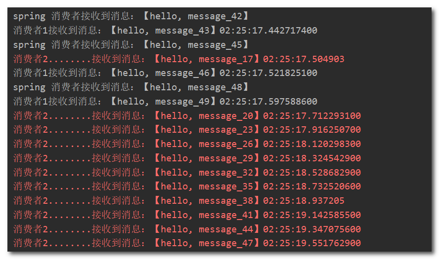

可以看到消费者1很快完成了自己的25条消息，消费者2却在缓慢的处理自己的25条消息。

也就是说消息是平均分配给每个消费者，并没有考虑到消费者的处理能力，这样显然是有问题的。

在spring中有一个简单的配置，可以解决这个问题。修改consumer服务的application.yml文件，添加配置：

```yaml
spring:
  rabbitmq:
    listener:
      simple:
        prefetch: 1 # 每次只能获取一条消息，处理完成才能获取下一个消息
```


### 2.3 Publish/Subscribe Mode

Publish/Subscribe Mode，发布订阅模式。在发布/订阅模式中，一个生产者发送消息到一个交换机，交换机将消息广播到多个绑定的队列。多个消费者分别从各自的队列接收消息。这种模式用于广播消息给多个消费者。


在订阅模型中，多了一个exchange角色，而且过程略有变化：

- Publisher：生产者，也就是要发送消息的程序，但是不再发送到队列中，而是发给交换机。
- Exchange：交换机。接收生产者发送的消息，将消息广播到多个绑定的队列，Exchange有以下3种类型：
  - **Fanout**：广播，将消息交给所有绑定到交换机的队列。
  - **Direct**：定向，把消息交给符合指定routing key 的队列。
  - **Topic**：通配符，把消息交给符合routing pattern（路由模式） 的队列。
- Consumer：消费者，与以前一样，订阅队列，没有变化。
- Queue：消息队列也与以前一样，接收消息、缓存消息。


Spring提供了一个接口Exchange，来表示所有不同类型的交换机：


#### Fanout

Fanout，广播模式。广播模式的特点：

- 可以有多个队列
- 每个队列都要绑定到Exchange（交换机）
- 生产者发送的消息，只能发送到交换机，交换机来决定要发给哪个队列，生产者无法决定
- 交换机把消息发送给绑定过的所有队列
- 订阅队列的消费者都能拿到消息


下面介绍Fanout交换机的使用：

- 创建一个FanoutExchange类型的交换机，取名为my.fanout

- 创建两个队列fanout.queue1和fanout.queue2，绑定到交换机my.fanout


**声明交换机和队列**

在consumer中创建一个类，声明队列和交换机：

```Java
@Configuration
public class FanoutConfig {
    /**
     * 声明交换机
     * @return Fanout类型交换机
     */
    @Bean
    public FanoutExchange fanoutExchange(){
        return new FanoutExchange("my.fanout");
    }

    /**
     * 第1个队列
     */
    @Bean
    public Queue fanoutQueue1(){
        return new Queue("fanout.queue1");
    }

    /**
     * 绑定队列和交换机
     */
    @Bean
    public Binding bindingQueue1(Queue fanoutQueue1, FanoutExchange fanoutExchange){
        return BindingBuilder.bind(fanoutQueue1).to(fanoutExchange);
    }

    /**
     * 第2个队列
     */
    @Bean
    public Queue fanoutQueue2(){
        return new Queue("fanout.queue2");
    }

    /**
     * 绑定队列和交换机
     */
    @Bean
    public Binding bindingQueue2(Queue fanoutQueue2, FanoutExchange fanoutExchange){
        return BindingBuilder.bind(fanoutQueue2).to(fanoutExchange);
    }
}
```

**消息发送**

在publisher服务的SpringAmqpTest类中添加测试方法：

```Java
@Test
public void testFanoutExchange() {
    // 队列名称
    String exchangeName = "my.fanout";
    // 消息
    String message = "广播模式！";
    rabbitTemplate.convertAndSend(exchangeName, "", message); // 第二个参数是路由键，这种交换机还不需要设置
}
```

**消息接收**

在consumer服务的SpringRabbitListener中添加两个方法，作为消费者：

```java
@RabbitListener(queues = "fanout.queue1")
public void listenFanoutQueue1(String msg) {
    System.out.println("消费者1接收到Fanout消息：【" + msg + "】");
}

@RabbitListener(queues = "fanout.queue2")
public void listenFanoutQueue2(String msg) {
    System.out.println("消费者2接收到Fanout消息：【" + msg + "】");
}
```

控制台查看结果：


#### Direct

Direct，路由模式。但是在某些场景下，我们希望不同的消息被不同的队列消费。这时就要用到Direct类型的Exchange。

Direct模型的特点：

- 队列与交换机的绑定，不能是任意绑定了，而是要指定一个`RoutingKey`（路由键）
- 消息的发送方在 向 Exchange发送消息时，也必须指定消息的 `RoutingKey`。
- Exchange不再把消息交给每一个绑定的队列，而是根据消息的`Routing Key`进行判断，只有队列的`Routingkey`与消息的 `Routing key`完全一致，才会接收到消息。


下面介绍Direct交换机的使用：

1. 利用@RabbitListener声明Exchange、Queue、RoutingKey。
2. 在consumer服务中，编写两个消费者方法，分别监听direct.queue1和direct.queue2。
3. 在publisher中编写测试方法，向交换机my. direct发送消息。


**基于注解声明队列和交换机**

基于@Bean的方式声明队列和交换机比较麻烦，Spring还提供了基于注解方式来声明。

在consumer的SpringRabbitListener中添加两个消费者，同时基于注解来声明队列和交换机：

```Java
@RabbitListener(bindings = @QueueBinding(
    value = @Queue(name = "direct.queue1"),
    exchange = @Exchange(name = "my.direct", type = ExchangeTypes.DIRECT),
    key = {"red", "blue"}
))
public void listenDirectQueue1(String msg){
    System.out.println("消费者接收到direct.queue1的消息：【" + msg + "】");
}

@RabbitListener(bindings = @QueueBinding(
    value = @Queue(name = "direct.queue2"),
    exchange = @Exchange(name = "my.direct", type = ExchangeTypes.DIRECT),
    key = {"red", "yellow"}
))
public void listenDirectQueue2(String msg){
    System.out.println("消费者接收到direct.queue2的消息：【" + msg + "】");
}
```

**消息发送**

在publisher服务的SpringAmqpTest类中添加测试方法：

```Java
@Test
public void testSendDirectExchange() {
    // 交换机名称
    String exchangeName = "my.direct";
    // 消息
    String message = "路由模式！";
    // 发送消息
    rabbitTemplate.convertAndSend(exchangeName, "red", message); // 第二个参数是路由键
}
```

查看结果，设置不同的路由键，消息会发送给绑定了对应路由键的队列：

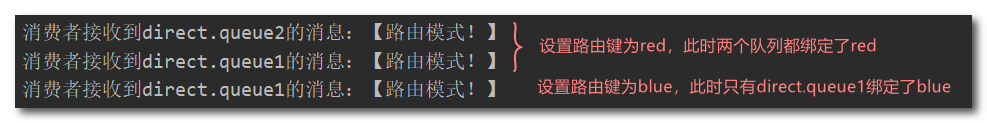


#### Topic

Topic，主题模式。Topic类型的Exchange与Direct相比，都是可以根据RoutingKey把消息路由到不同的队列。只不过Topic类型Exchange可以让队列在绑定Routingkey 的时候使用通配符。

`Routingkey` 一般都是有一个或多个单词组成，多个单词之间以”.”分割，例如： `item.insert`

 通配符规则：

- `#`：匹配一个或多个词

- `*`：匹配1个词


解释：

- Queue1：绑定的是`china.#` ，因此凡是以 `china.`开头的`routing key` 都会被匹配到。包括china.news和china.weather
- Queue2：绑定的是`#.news` ，因此凡是以 `.news`结尾的 `routing key` 都会被匹配。包括china.news和japan.news


下面介绍Topic交换机的使用：

1. 利用@RabbitListener声明Exchange、Queue、RoutingKey

2. 在consumer服务中，编写两个消费者方法，分别监听topic.queue1和topic.queue2

3. 在publisher中编写测试方法，向my. topic发送消息


**消息发送**

在publisher服务的SpringAmqpTest类中添加测试方法：

```Java
/**
 * topicExchange
 */
@Test
public void testSendTopicExchange() {
    // 交换机名称
    String exchangeName = "my.topic";
    // 消息
    String message = "主题模式！";
    // 发送消息
    rabbitTemplate.convertAndSend(exchangeName, "china.news", message);
}
```

**消息接收**

在consumer服务的SpringRabbitListener中添加方法：

```Java
@RabbitListener(bindings = @QueueBinding(
    value = @Queue(name = "topic.queue1"),
    exchange = @Exchange(name = "my.topic", type = ExchangeTypes.TOPIC),
    key = "china.#"
))
public void listenTopicQueue1(String msg){
    System.out.println("消费者接收到topic.queue1的消息：【" + msg + "】");
}

@RabbitListener(bindings = @QueueBinding(
    value = @Queue(name = "topic.queue2"),
    exchange = @Exchange(name = "my.topic", type = ExchangeTypes.TOPIC),
    key = "#.news"
))
public void listenTopicQueue2(String msg){
    System.out.println("消费者接收到topic.queue2的消息：【" + msg + "】");
}
```

查看结果：


Direct交换机与Topic交换机的差异:

- Topic交换机接收的消息RoutingKey必须是多个单词，以 `.` 分割
- Topic交换机与队列绑定时的bindingKey可以指定通配符
- `#`：代表0个或多个词
- `*`：代表1个词


### 2.4 消息转换器

Spring会将发送的消息序列化为字节发送给MQ，接收消息的时候，还会把字节反序列化为Java对象。

默认情况下Spring采用的序列化方式是JDK序列化，JDK序列化存在下列问题：

- 数据体积过大
- 有安全漏洞
- 可读性差

**测试默认转换器**

首先在配置类中声明一个队列：

```Java
@Bean
public Queue objectQuene(){
    return new Queue("object.queue");
}
```

修改消息发送的代码，发送一个Map对象：

```Java
@Test
public void testSendMap() throws InterruptedException {
    // 准备消息
    Map<String,Object> msg = new HashMap<>();
    msg.put("name", "Jack");
    msg.put("age", 21);
    // 发送消息
    rabbitTemplate.convertAndSend("object.queue","", msg);
}
```

发送消息后查看rabbitmq控制面板：


**配置JSON转换器**

显然，JDK序列化方式并不合适。我们希望消息体的体积更小、可读性更高，因此可以使用JSON方式来做序列化和反序列化。

在publisher和consumer两个服务中都引入依赖：

```xml
<dependency>
    <groupId>com.fasterxml.jackson.core</groupId>
    <artifactId>jackson-databind</artifactId>
    <version>2.15.0</version>
</dependency>
```

在publisher和consumer两个服务中的启动类或者配置类中添加一个消息转换器的Bean：

```Java
@Bean
public MessageConverter jsonMessageConverter(){
    return new Jackson2JsonMessageConverter();
}
```

在consumer服务的SpringRabbitListener中添加方法：

```Java
@RabbitListener(queues = "object.queue")
public void listenObjectQueue(Map<String,Object> msg) throws InterruptedException {
    System.err.println("收到消息：【" + msg + "】" );
}
```

发送的消息：

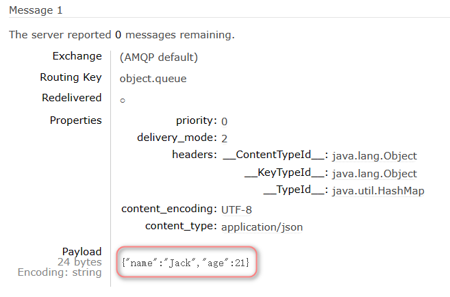

接收到的消息：

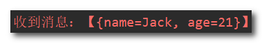


## 3. 消息可靠性

消息从发送，到消费者接收，会经理多个过程：


其中的每一步都可能导致消息丢失，常见的丢失原因包括：

- 发送时丢失：
  - 生产者发送的消息未送达exchange
  - 消息到达exchange后未到达queue
- MQ宕机，queue将消息丢失
- consumer接收到消息后未消费就宕机


针对这些问题，RabbitMQ分别给出了解决方案：

- 生产者确认机制
- mq持久化
- 消费者确认机制
- 失败重试机制


下面我们就通过案例来演示每一个步骤。

首先，导入资料提供的demo工程：


项目结构如下：

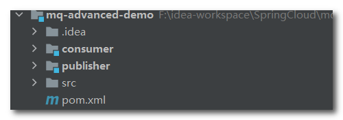

### 3.1 生产者消息确认

RabbitMQ提供了publisher confirm机制来避免消息发送到MQ过程中丢失。这种机制必须给每个消息指定一个唯一ID。消息发送到MQ以后，会返回一个结果给发送者，表示消息是否处理成功。

返回结果有两种方式：

- publisher-confirm，发送者确认
  - 消息成功投递到交换机，返回ack
  - 消息未投递到交换机，返回nack
- publisher-return，发送者回执
  - 消息投递到交换机了，但是没有路由到队列。返回ACK，及路由失败原因。

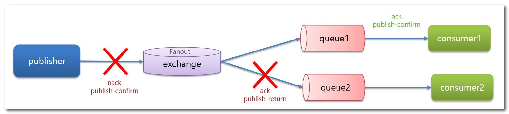

确认机制发送消息时，需要给消息设置一个全局唯一id，以区分不同消息，避免ack冲突。


#### 修改配置

首先，修改publisher服务中的application.yml文件，添加下面的内容：

```yaml
spring:
  rabbitmq:
    publisher-confirm-type: correlated
    publisher-returns: true
    template:
      mandatory: true
```

说明：

- `publish-confirm-type`：开启publisher-confirm，这里支持两种类型：
  - `simple`：同步等待confirm结果，直到超时。
  - `correlated`：异步回调。定义 `ConfirmCallback`，MQ返回结果时会回调这个 `ConfirmCallback`。
- `publish-returns`：开启publish-return功能，同样是基于callback机制，不过是定义 `ReturnCallback`。
- `template.mandatory`：定义消息路由失败时的策略。true，则调用ReturnCallback；false：则直接丢弃消息。

注意两种callback的创建方式不同。


#### 定义Return回调

每个RabbitTemplate只能配置一个ReturnCallback，因此需要在项目加载时配置：可以实现ApplicationContextAware接口。

修改publisher服务，在config包下添加一个配置类：

```java
@Slf4j
@Configuration
public class CommonConfig implements ApplicationContextAware {
    @Override
    public void setApplicationContext(ApplicationContext applicationContext) throws BeansException {
        // 获取RabbitTemplate
        RabbitTemplate rabbitTemplate = applicationContext.getBean(RabbitTemplate.class);
        // 设置ReturnCallback
        rabbitTemplate.setReturnCallback((message, replyCode, replyText, exchange, routingKey) -> {
            // 投递失败，记录日志
            log.info("消息发送失败，应答码{}，原因{}，交换机{}，路由键{},消息{}",
                     replyCode, replyText, exchange, routingKey, message.toString());
            // 如果有业务需要，可以重发消息
        });
    }
}
```


#### 定义ConfirmCallback

ConfirmCallback可以在发送消息时指定，因为每个业务处理confirm成功或失败的逻辑不一定相同。

在publisher服务的cn.itcast.mq.spring.SpringAmqpTest类中，定义一个单元测试方法：

```java
public void testSendMessage2SimpleQueue() throws InterruptedException {
    // 1.消息体
    String message = "hello, spring amqp!";
    // 2.全局唯一的消息ID，需要封装到CorrelationData中
    CorrelationData correlationData = new CorrelationData(UUID.randomUUID().toString());
    // 3.添加callback
    correlationData.getFuture().addCallback(
        result -> {
            if(result.isAck()){
                // 3.1.ack，消息发送成功
                log.debug("消息发送成功, ID:{}", correlationData.getId());
            }else{
                // 3.2.nack，消息发送失败
                log.error("消息发送失败, ID:{}, 原因{}",correlationData.getId(), result.getReason());
            }
        },
        ex -> log.error("消息发送异常, ID:{}, 原因{}",correlationData.getId(),ex.getMessage())
    );
    // 4.发送消息
    rabbitTemplate.convertAndSend("task.direct", "task", message, correlationData);

    // 休眠一会儿，等待ack回执
    Thread.sleep(2000);
}
```


### 3.2 消息持久化

#### 交换机持久化

RabbitMQ中交换机默认是非持久化的，mq重启后就丢失。

SpringAMQP中可以通过代码指定交换机持久化：

```java
@Bean
public DirectExchange simpleExchange(){
    // 三个参数：交换机名称、是否持久化、当没有queue与其绑定时是否自动删除
    return new DirectExchange("simple.direct", true, false);
}
```

默认情况下，由SpringAMQP声明的交换机都是持久化的。


#### 队列持久化

RabbitMQ中队列默认是非持久化的，mq重启后就丢失。

SpringAMQP中可以通过代码指定交换机持久化：

```java
@Bean
public Queue simpleQueue(){
    // 使用QueueBuilder构建队列，durable就是持久化的
    return QueueBuilder.durable("simple.queue").build();
}
```

默认情况下，由SpringAMQP声明的队列都是持久化的。


#### 消息持久化

利用SpringAMQP发送消息时，可以设置消息的属性（MessageProperties），指定delivery-mode：

- 非持久化：MessageDeliveryMode.PERSISTENT
- 持久化：PERSISTENT

用java代码指定：


SpringAMQP发出的任何消息都是持久化的，不用特意指定。	


### 3.3 消费者消息确认

RabbitMQ确认消息被消费者消费后会立刻删除。RabbitMQ通过消费者回执来确认消费者是否成功处理消息。

消费者获取消息后，应该向RabbitMQ发送ACK回执，表明自己已经处理消息。


设想这样的场景：

1）RabbitMQ投递消息给消费者

2）消费者获取消息后，返回ACK给RabbitMQ

3）RabbitMQ删除消息

4）消费者宕机，消息尚未处理

这样，消息就丢失了。因此消费者返回ACK的时机非常重要。


SpringAMQP则允许配置三种确认模式：

- manual：手动ack，需要在业务代码结束后，调用api发送ack。

- auto：自动ack，由spring监测listener代码是否出现异常，没有异常则返回ack；抛出异常则返回nack

- none：关闭ack，MQ假定消费者获取消息后会成功处理，因此消息投递后立即被删除

一般使用默认的auto即可。


#### none模式

修改consumer服务的application.yml文件，添加下面内容：

```yaml
spring:
  rabbitmq:
    listener:
      simple:
        acknowledge-mode: none # 关闭ack
```

修改consumer服务的SpringRabbitListener类中的方法，模拟一个消息处理异常：

```java
@RabbitListener(queues = "simple.queue")
public void listenSimpleQueue(String msg) {
    log.info("消费者接收到simple.queue的消息：【{}】", msg);
    // 模拟异常
    System.out.println(1 / 0);
    log.debug("消息处理完成！");
}
```

测试可以发现，当消息处理抛异常时，消息并没有处理完成，消息依然被RabbitMQ删除了。


#### auto模式

把确认机制修改为auto:

```yaml
spring:
  rabbitmq:
    listener:
      simple:
        acknowledge-mode: auto 
```

在异常位置打断点，再次发送消息，程序卡在断点时，可以发现此时消息状态为unack（未确定状态）：


当消费者出现异常后，消息会不断重入队到队列，再重新发送给消费者，然后再次异常，无限循环，导致mq的消息处理飙升：


终止服务后，因为Spring会自动返回nack，所以消息恢复至Ready状态，消息没有被RabbitMQ删除：


### 3.4 消费失败重试机制

当消费者出现异常后，消息会不断requeue（重入队）到队列，再重新发送给消费者，然后再次异常，再次requeue，无限循环，导致mq的消息处理飙升，带来不必要的压力。

利用Spring的retry机制，在消费者出现异常时利用本地重试，而不是无限制的requeue到mq队列。

修改consumer服务的application.yml文件，添加内容：

```yml
spring:
  rabbitmq:
    listener:
      simple:
        retry:
          enabled: true # 开启消费者失败重试
          initial-interval: 1000 # 初始的失败等待时长为1秒
          multiplier: 1 # 失败的等待时长倍数，下次等待时长 = multiplier * last-interval
          max-attempts: 3 # 最大重试次数
          stateless: true # true无状态；false有状态。如果业务中包含事务，这里改为false
```

​	重启consumer服务，重复之前的测试，可以发现：

- 开启本地重试时，消息处理过程中抛出异常，不会requeue到队列，而是在消费者本地重试
- 重试达到最大次数后，Spring会返回ack，消息会被丢弃


达到最大重试次数后，消息会被丢弃，这是由Spring内部机制决定的。

在开启重试模式后，重试次数耗尽，如果消息依然失败，则需要有MessageRecovery接口来处理，它包含三种不同的实现：

- RejectAndDontRequeueRecoverer：重试耗尽后，直接reject，丢弃消息。默认就是这种方式

- ImmediateRequeueMessageRecoverer：重试耗尽后，返回nack，消息重新入队

- RepublishMessageRecoverer：重试耗尽后，将失败消息投递到指定的交换机

  

推荐的处理方案是RepublishMessageRecoverer，失败后将消息投递到一个指定的，专门存放异常消息的队列，后续由人工集中处理，实现该方案只需要创建RepublishMessageRecoverer对象交由spring管理，并且关联队列和交换机：

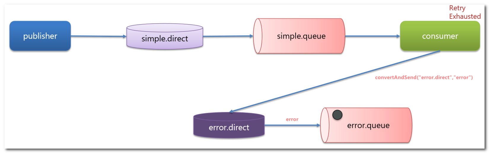

(1) 在consumer服务中定义处理失败消息的交换机和队列

```java 
@Bean
public DirectExchange errorMessageExchange(){
    return new DirectExchange("error.direct");
}
@Bean
public Queue errorQueue(){
    return new Queue("error.queue", true);
}
@Bean
public Binding errorBinding(Queue errorQueue, DirectExchange errorMessageExchange){
    return BindingBuilder.bind(errorQueue).to(errorMessageExchange).with("error");
}
```

(2) 定义一个RepublishMessageRecoverer，关联队列和交换机

```java 
@Bean
public MessageRecoverer republishMessageRecoverer(RabbitTemplate rabbitTemplate){
    return new RepublishMessageRecoverer(rabbitTemplate, "error.direct", "error");
}
```

完整代码：

```Java
package cn.itcast.mq.config;

import org.springframework.amqp.core.Binding;
import org.springframework.amqp.core.BindingBuilder;
import org.springframework.amqp.core.DirectExchange;
import org.springframework.amqp.core.Queue;
import org.springframework.amqp.rabbit.core.RabbitTemplate;
import org.springframework.amqp.rabbit.retry.MessageRecoverer;
import org.springframework.amqp.rabbit.retry.RepublishMessageRecoverer;
import org.springframework.context.annotation.Bean;

@Configuration
public class ErrorMessageConfig {
    @Bean
    public DirectExchange errorMessageExchange(){
        return new DirectExchange("error.direct");
    }
    @Bean
    public Queue errorQueue(){
        return new Queue("error.queue", true);
    }
    @Bean
    public Binding errorBinding(Queue errorQueue, DirectExchange errorMessageExchange){
        return BindingBuilder.bind(errorQueue).to(errorMessageExchange).with("error");
    }

    @Bean
    public MessageRecoverer republishMessageRecoverer(RabbitTemplate rabbitTemplate){
        return new RepublishMessageRecoverer(rabbitTemplate, "error.direct", "error");
    }
}
```

重启服务测试，可以看到异常的消息被投递到错误的交换机绑定的队列保存，并且有详细的错误信息：

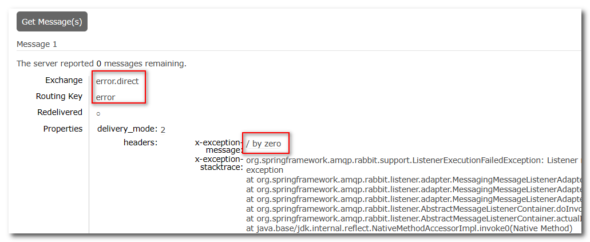


**小总结**

如何确保RabbitMQ消息的可靠性？

- 开启生产者确认机制，确保生产者的消息能到达队列
- 开启持久化功能，确保消息未消费前在队列中不会丢失
- 开启消费者确认机制为auto，由spring确认消息处理成功后完成ack
- 开启消费者失败重试机制，并设置MessageRecoverer，多次重试失败后将消息投递到异常交换机，交由人工处理


## 4. 死信交换机

消息被标记为死信的情况通常包括以下几种：

1. **消费者异常：** 如果消息在消费者处理过程中发生异常，并且消费者没有成功处理该消息，消息可能会被标记为死信。这可能是由于代码错误、异常抛出等原因。
2. **消费超时：** 如果消息在一定的时间内没有被消费者处理，可能会被认为是死信。这可以避免消息长时间占用资源。
3. **重试次数超过限制：** 在消息处理失败时，可能会进行自动的重试。如果消息达到了预定的重试次数上限，系统可能会将其标记为死信。
4. **消息过期：** 消息在发送时可能会设置一个有效期。如果消息在有效期内未被消费者处理，可能会被认为是死信。
5. **无法路由：** 当消息无法路由到任何队列时，例如，由于没有匹配的路由键或队列不存在，消息可能会被标记为死信。
6. **手动标记为死信：** 在某些情况下，系统管理员或开发人员可能会手动将消息标记为死信，以便进一步分析和处理。


**死信交换机**（Dead Letter Exchange，简称DLX）是在消息中间件系统中常见的一个概念。它通常用于处理无法被正常消费的消息，这些消息可能因为某些原因无法被消费者成功处理，例如消费者抛出异常、消息过期等。

如果队列配置了`dead-letter-exchange`属性，指定了一个交换机，那么队列中的死信就会投递到这个交换机中，而这个交换机称为死信交换机。

如图，一个消息被消费者拒绝了，变成了死信：


一般情况下，创建死信交换机和相关的死信队列需要以下步骤：

1. 创建一个死信交换机：这个交换机通常被配置成一个直接交换机，用于将无法被消费的消息转发到死信队列。
2. 创建一个死信队列：死信队列是接收无法被正常消费的消息的地方。您可以配置队列的属性，例如消息过期时间、最大重试次数等。
3. 将死信队列绑定到死信交换机：将死信队列绑定到死信交换机，并配置相应的路由规则，以便无法被消费的消息能够被路由到死信队列。
4. 在正常的队列中设置死信交换机：将死信交换机配置为正常队列的死信交换机。当消息被消费失败时，会被转发到死信交换机，并进而被路由到死信队列。

在consumer服务中，定义一组死信交换机、死信队列：

```java
// 声明普通的 simple.queue队列，并且为其指定死信交换机：dl.direct
@Bean
public Queue simpleQueue2(){
    return QueueBuilder.durable("simple.queue") // 指定队列名称，并持久化
        .deadLetterExchange("dl.direct") // 指定死信交换机
        .build();
}
// 声明死信交换机 dl.direct
@Bean
public DirectExchange dlExchange(){
    return new DirectExchange("dl.direct", true, false);
}
// 声明存储死信的队列 dl.queue
@Bean
public Queue dlQueue(){
    return new Queue("dl.queue", true);
}
// 将死信队列 与 死信交换机绑定
@Bean
public Binding dlBinding(){
    return BindingBuilder.bind(dlQueue()).to(dlExchange()).with("simple");
}
```


## 5. 超时时间(TTL)

一个队列中的消息如果超时未消费，则会变为死信，超时分为两种情况：

- 消息所在的队列设置了超时时间
- 消息本身设置了超时时间


### 5.1 给队列设置TTL

(1) 在consumer服务的SpringRabbitListener中，定义一个新的消费者，并且声明 死信交换机、死信队列：

```java
@RabbitListener(bindings = @QueueBinding(
    value = @Queue(name = "dl.ttl.queue", durable = "true"),
    exchange = @Exchange(name = "dl.ttl.direct"),
    key = "ttl"
))
public void listenDlQueue(String msg){
    log.info("接收到 dl.ttl.queue的延迟消息：{}", msg);
}
```

(2) 声明一个普通队列，并且指定TTL

这个队列设定了死信交换机为`dl.ttl.direct`，要给队列设置超时时间，需要在声明队列时配置ttl属性：

```java 
@Bean
public Queue ttlQueue(){
    return QueueBuilder.durable("ttl.queue") // 指定队列名称，并持久化
        .ttl(10000) // 设置队列的超时时间，10秒
        .deadLetterExchange("dl.ttl.direct") // 指定死信交换机
        .build();
}
```

(3) 声明交换机，将ttl.queue队列与交换机绑定：

```java
@Bean
public DirectExchange ttlExchange(){
    return new DirectExchange("ttl.direct");
}
    @Bean
    public Binding ttlBinding(){
        return BindingBuilder.bind(ttlQueue()).to(ttlExchange()).with("ttl");
    }
```

(4) 发送消息

```Java
@Test
public void testTTLQueue() {
    // 创建消息
    String message = "hello, ttl queue";
    // 消息ID，需要封装到CorrelationData中
    CorrelationData correlationData = new CorrelationData(UUID.randomUUID().toString());
    // 发送消息
    rabbitTemplate.convertAndSend("ttl.direct", "ttl", message, correlationData);
    // 记录日志
    log.debug("发送消息成功");
}
```

发送消息的日志：


接收消息的日志：


因为队列的TTL值是10000ms，也就是10秒。可以看到消息发送与接收之间的时差刚好是10秒。


### 5.2 给消息设置TTL

在发送消息时，也可以指定TTL。

发送消息时指定TTL需要通过MessageBuilder来构建消息，并且通过 `setExpiration` 方法来设置超时时间。

```java
@Test
public void testTTLMsg() {
    // 创建消息
    Message message = MessageBuilder
        .withBody("hello, ttl message".getBytes(StandardCharsets.UTF_8))
        .setExpiration("5000")
        .build();
    // 消息ID，需要封装到CorrelationData中
    CorrelationData correlationData = new CorrelationData(UUID.randomUUID().toString());
    // 发送消息
    rabbitTemplate.convertAndSend("ttl.direct", "ttl", message, correlationData);
    log.debug("发送消息成功");
}
```

查看发送消息日志：


查看接收消息日志：


这次，发送与接收的延迟只有5秒。说明当队列、消息都设置了TTL时，任意一个到期就会成为死信。


## 6. 延迟队列


延迟队列（Delay Queue）是一种特殊类型的消息队列，用于在一定的时间延迟后才将消息投递给消费者。

在延迟队列中，消息被发送到队列后，不会立即被消费者消费，而是在设置的延迟时间之后才会被消费者获取并处理。

利用TTL结合死信交换机，我们实现了消息发出后，消费者延迟收到消息的效果。这种消息模式就称为延迟队列（Delay Queue）模式。

延迟队列的使用场景包括：

- 延迟发送短信
- 用户下单，如果用户在15 分钟内未支付，则自动取消
- 预约工作会议，20分钟后自动通知所有参会人员


### 6.1 安装DelayExchange插件

**下载插件**

因为延迟队列的需求非常多，所以RabbitMQ的官方也推出了一个插件，原生支持延迟队列效果。

插件下载地址：[GitHub - rabbitmq/rabbitmq-delayed-message-exchange: Delayed Messaging for RabbitMQ](https://github.com/rabbitmq/rabbitmq-delayed-message-exchange)，资料中已提供。


这里使用rabbitmq3.8的版本，拉取镜像：

```
docker pull rabbitmq:3.8-management
```

创建并启动RabbitMQ容器：

```sh
docker run \
 -e RABBITMQ_DEFAULT_USER=root \
 -e RABBITMQ_DEFAULT_PASS=123456 \
 -v mq-plugins:/plugins \
 --name mq \
 --hostname mq1 \
 -p 15672:15672 \
 -p 5672:5672 \
 -d \
 rabbitmq:3.8-management
```

使用下面命令查看数据卷挂载的目录，然后将插件上传到该/var/lib/docker/volumes/mq-plugins/_data即可：

```
docker volume inspect mq-plugins
```

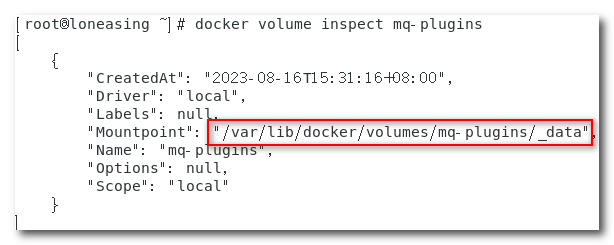

**安装插件**

进入MQ容器内部来执行安装，所以执行下面命令：

```sh
docker exec -it mq bash
```

进入容器内部后，执行下面命令开启插件：

```sh
rabbitmq-plugins enable rabbitmq_delayed_message_exchange
```

结果如下：


### 6.2 DelayExchange原理

DelayExchange需要将一个交换机声明为delayed类型。当我们发送消息到delayExchange时，流程如下：

- 接收消息
- 判断消息是否具备x-delay属性
- 如果有x-delay属性，说明是延迟消息，持久化到硬盘，读取x-delay值，作为延迟时间
- 返回routing not found结果给消息发送者
- x-delay时间到期后，重新投递消息到指定队列


### 6.3 使用DelayExchange

插件的使用也非常简单：声明一个交换机，交换机的类型可以是任意类型，只需要设定delayed属性为true，然后声明队列与其绑定。

1）声明DelayExchange交换机

基于`@RabbitListener`注解方式：

```Java
@RabbitListener(bindings = @QueueBinding(
        value = @Queue(name = "delay.queue",durable = "true"),
        exchange = @Exchange(name = "delay.direct",delayed = "true"),
        key = "delay"
))
public void listenDelayedQueue(String msg){
    log.info("接收到 delay.queue的延迟消息：{}",msg);
}
```

基于`@Bean`的方式：

```Java
@Configuration
public class DelayedQueueConfig {

    @Bean
    public DirectExchange delayedExchange(){
        return ExchangeBuilder
                .directExchange("delay.direct")
                .delayed()  // 设置延迟交换机
                .durable(true)
                .build();
    }

    @Bean
    public Queue delayedQueue(){
        return new Queue("delay.queue");
    }

    @Bean
    public Binding delayedBinding(){
        return BindingBuilder.bind(delayedQueue()).to(delayedExchange()).with("delay");
    }
}

```

2）发送消息

发送消息时，一定要携带 `x-delay` 属性，指定延迟的时间：

```Java
@Test
public void testDelayedMsg(){
    // 创建消息
    Message message = MessageBuilder
            .withBody("hello, ttl message".getBytes(StandardCharsets.UTF_8))
            .setHeader("x-delay",10000)
            .build();
    // 消息ID，需要封装到CorrelationData中
    CorrelationData correlationData = new CorrelationData(UUID.randomUUID().toString());
    // 发送消息
    rabbitTemplate.convertAndSend("delay.direct", "delay", message, correlationData);
    log.debug("发送消息成功");
}
```

3）查看结果

发送消息时的日志：


接收消息时的日志：


## 7. 惰性队列

### 7.1 消息堆积问题

当生产者发送消息的速度超过了消费者处理消息的速度，就会导致队列中的消息堆积，直到队列存储消息达到上限。之后发送的消息就会成为死信，可能会被丢弃，这就是消息堆积问题。


解决消息堆积有两种思路：

- 增加更多消费者，提高消费速度。也就是我们之前说的work queue模式
- 扩大队列容积，提高堆积上限


### 7.2 惰性队列

惰性队列（Lazy Queues）是一种在消息中间件中常见的优化策略，用于减少队列中消息的不必要消耗。通常，消息队列中的消息会一直保留在队列中，直到消费者准备好来消费它们。然而，在某些情况下，这些消息可能会在队列中停留很长时间，造成了资源浪费。

惰性队列解决了这个问题，其核心思想是，当消息队列中没有消费者订阅时，消息不会立即被保留在队列中。相反，只有在消息队列上有实际的消费者连接时，消息才会被添加到队列中等待消费。这样，当没有消费者需要处理消息时，队列不会占用系统资源。

惰性队列的特征如下：

- 接收到消息后直接存入磁盘而非内存
- 消费者要消费消息时才会从磁盘中读取并加载到内存
- 支持数百万条的消息存储

#### 基于命令行声明lazy-queue

设置一个队列为惰性队列，只需要在声明队列时，指定x-queue-mode属性为lazy即可：

```
rabbitmqctl set_policy Lazy "^lazy-queue$" '{"queue-mode":"lazy"}' --apply-to queues  
```

命令解读：

- `rabbitmqctl` ：RabbitMQ的命令行工具
- `set_policy` ：添加一个策略
- `Lazy` ：策略名称，可以自定义
- `"^lazy-queue$"` ：用正则表达式匹配队列的名字
- `'{"queue-mode":"lazy"}'` ：设置队列模式为lazy模式
- `--apply-to queues  `：策略的作用对象，是所有的队列


#### 基于Bean声明lazy-queue

```Java
@Bean
public Queue lazyQueue(){
    return QueueBuilder
            .durable("lazy.queue")
            .lazy() // 声明为惰性队列
            .build();
}
```


#### 基于注解声明lazy-queue

```Java
@RabbitListener(queuesToDeclare = @Queue(
        name = "lazy.queue",
        durable = "true",
        arguments = @Argument(name = "x-queue-mode", value = "lazy")
))
public void listenLazyQueue(String msg) {
    log.info("接收到 lazy.queue的消息：{}", msg);
}
```


#### 测试惰性队列和普通队列

声明两个队列：

```Java
@Configuration
public class LazyConfig {

    @Bean
    public Queue lazyQueue(){
        return QueueBuilder
                .durable("lazy.queue")
                .lazy() // 声明为惰性队列
                .build();
    }

    @Bean
    public Queue normalQueue(){
        return QueueBuilder
                .durable("normal.queue")
                .build();
    }
}
```

测试方法：

```Java
    @Test
    public void testLazyQueue() {
        for (int i = 0; i < 1000000; i++) {
            // 创建消息
            Message message = MessageBuilder
                    .withBody("hello, lazy queue".getBytes(StandardCharsets.UTF_8))
                    .setDeliveryMode(MessageDeliveryMode.NON_PERSISTENT)
                    .build();
            // 发送消息
            rabbitTemplate.convertAndSend("lazy.queue", message);
        }
    }

    @Test
    public void testNormalQueue() {
        for (int i = 0; i < 1000000; i++) {
            // 创建消息
            Message message = MessageBuilder
                    .withBody("hello, normal queue".getBytes(StandardCharsets.UTF_8))
                    .setDeliveryMode(MessageDeliveryMode.NON_PERSISTENT)
                    .build();
            // 发送消息
            rabbitTemplate.convertAndSend("normal.queue", message);
        }
    }

```

测试结果：

可以看到惰性队列的消息时没有存储在内存中，而是保存到了磁盘

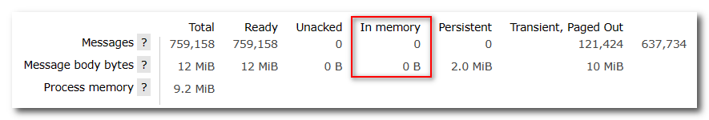

普通队列的消息是保存在内存中，当达到限定大小时会扇出到磁盘


**小总结**

消息堆积问题的解决方案？

- 队列上绑定多个消费者，提高消费速度
- 使用惰性队列，可以再mq中保存更多消息

惰性队列的优点有哪些？

- 基于磁盘存储，消息上限高
- 没有间歇性的page-out，性能比较稳定

惰性队列的缺点有哪些？

- 基于磁盘存储，消息时效性会降低
- 性能受限于磁盘的IO


## 8. MQ集群

RabbitMQ的是基于Erlang语言编写，而Erlang又是一个面向并发的语言，天然支持集群模式。RabbitMQ的集群有两种模式：

- **普通集群**：是一种分布式集群，将队列分散到集群的各个节点，从而提高整个集群的并发能力。

- **镜像集群**：是一种主从集群，普通集群的基础上，添加了主从备份功能，提高集群的数据可用性。

镜像集群虽然支持主从，但主从同步并不是强一致的，某些情况下可能有数据丢失的风险。因此在RabbitMQ的3.8版本以后，推出了**仲裁队列**来代替镜像集群，底层采用Raft协议确保主从的数据一致性。


### 8.1 普通集群

普通集群，或者叫标准集群（classic cluster），具备下列特征：

- 会在集群的各个节点间共享部分数据，包括：交换机、队列元信息。不包含队列中的消息。
- 当访问集群某节点时，如果队列不在该节点，会从数据所在节点传递到当前节点并返回。
- 队列所在节点宕机，队列中的消息就会丢失。


#### 创建集群

下面部署3节点的mq集群：

| 主机名 | 控制台端口      | amqp通信端口  |
| ------ | --------------- | ------------- |
| mq1    | 15671---> 15672 | 5671---> 5672 |
| mq2    | 15672---> 15672 | 5672---> 5672 |
| mq3    | 15673---> 15672 | 5673---> 5672 |

集群中的节点表示默认都是：`rabbit@[hostname]`，因此以上三个节点的名称分别为：

- rabbit@mq1
- rabbit@mq2
- rabbit@mq3

**(1) 创建一个网络**

```sh
docker network create mq-net
```

**(2) 启动集群节点**

```sh
docker run -d --net mq-net \
--hostname mq1 \
--name mq1 \
-p 15671:15672 \
-p 5671:5672 \
-e RABBITMQ_DEFAULT_USER=root \
-e RABBITMQ_DEFAULT_PASS=123456 \
-e RABBITMQ_ERLANG_COOKIE='rabbitcookie' \
rabbitmq:3.9-management
```

```sh
docker run -d --net mq-net \
--hostname mq2 \
--name mq2 \
-p 15672:15672 \
-p 5672:5672 \
-e RABBITMQ_DEFAULT_USER=root \
-e RABBITMQ_DEFAULT_PASS=123456 \
-e RABBITMQ_ERLANG_COOKIE='rabbitcookie' \
rabbitmq:3.9-management
```

```sh
docker run -d --net mq-net \
--hostname mq3 \
--name mq3 \
-p 15673:15672 \
-p 5673:5672 \
-e RABBITMQ_DEFAULT_USER=root \
-e RABBITMQ_DEFAULT_PASS=123456 \
-e RABBITMQ_ERLANG_COOKIE='rabbitcookie' \
rabbitmq:3.9-management
```

每个节点都需要设置相同的cookie。

**(3) 加入集群节点**

```sh
docker exec -it mq1 bashsh
rabbitmqctl stop_appsh
rabbitmqctl resetsh
rabbitmqctl start_app
exit
```

```sh
docker exec -it mq2 bash
rabbitmqctl stop_app
rabbitmqctl reset
rabbitmqctl join_cluster --ram rabbit@mq1
rabbitmqctl start_app
exit
```

```sh
docker exec -it mq3 bash
rabbitmqctl stop_app
rabbitmqctl reset
rabbitmqctl join_cluster --ram rabbit@mq1
rabbitmqctl start_appsh
exit
```

上述加入集群节点的指令会报错，但是不影响成功创建集群。

访问任意一个节点的地址：192.168.101.100:15671


#### SpringAMQP连接MQ集群

注意，这里用address来代替host、port方式

```java
spring:
  rabbitmq:
    addresses: 192.168.101.100:5671, 192.168.101.100:5672, 192.168.101.100:5673
    username: root
    password: 123456
    virtual-host: /
```


### 8.2 镜像模式

在刚刚的案例中，一旦创建队列的主机宕机，队列就会不可用。不具备高可用能力。如果要解决这个问题，必须使用官方提供的镜像集群方案。官方文档地址：https://www.rabbitmq.com/ha.html


#### 镜像模式的特征

默认情况下，队列只保存在创建该队列的节点上。而镜像模式下，创建队列的节点被称为该队列的主节点，队列还会拷贝到集群中的其它节点，也叫做该队列的镜像节点。但是，不同队列可以在集群中的任意节点上创建，因此不同队列的主节点可以不同。甚至，一个队列的主节点可能是另一个队列的镜像节点。

用户发送给队列的一切请求，例如发送消息、消息回执默认都会在主节点完成，如果是从节点接收到请求，也会路由到主节点去完成。镜像节点仅仅起到备份数据作用。

当主节点接收到消费者的ACK时，所有镜像都会删除节点中的数据。

总结如下：

- 镜像队列结构是一主多从（从就是镜像）
- 所有操作都是主节点完成，然后同步给镜像节点
- 主宕机后，镜像节点会替代成新的主（如果在主从同步完成前，主就已经宕机，可能出现数据丢失）
- 不具备负载均衡功能，因为所有操作都会有主节点完成（但是不同队列，其主节点可以不同，可以利用这个提高吞吐量）


#### 镜像模式的配置

镜像模式的配置有3种模式：

|     ha-mode     |     ha-params     | 效果                                                         |
| :-------------: | :---------------: | :----------------------------------------------------------- |
| 准确模式exactly | 队列的副本量count | 集群中队列副本（主服务器和镜像服务器之和）的数量。count如果为1意味着单个副本：即队列主节点。count值为2表示2个副本：1个队列主和1个队列镜像。换句话说：count = 镜像数量 + 1。如果群集中的节点数少于count，则该队列将镜像到所有节点。如果有集群总数大于count+1，并且包含镜像的节点出现故障，则将在另一个节点上创建一个新的镜像。 |
|       all       |      (none)       | 队列在群集中的所有节点之间进行镜像。队列将镜像到任何新加入的节点。镜像到所有节点将对所有群集节点施加额外的压力，包括网络I / O，磁盘I / O和磁盘空间使用情况。推荐使用exactly，设置副本数为（N / 2 +1）。 |
|      nodes      |   *node names*    | 指定队列创建到哪些节点，如果指定的节点全部不存在，则会出现异常。如果指定的节点在集群中存在，但是暂时不可用，会创建节点到当前客户端连接到的节点。 |

这里我们以rabbitmqctl命令作为案例来讲解配置语法。

语法示例：

**(1) exactly模式**

```
rabbitmqctl set_policy ha-two "^two\." '{"ha-mode":"exactly","ha-params":2,"ha-sync-mode":"automatic"}'
```

- `rabbitmqctl set_policy`：固定写法
- `ha-two`：策略名称，自定义
- `"^two\."`：匹配队列的正则表达式，符合命名规则的队列才生效，这里是任何以`two.`开头的队列名称
- `'{"ha-mode":"exactly","ha-params":2,"ha-sync-mode":"automatic"}'`: 策略内容
  - `"ha-mode":"exactly"`：策略模式，此处是exactly模式，指定副本数量
  - `"ha-params":2`：策略参数，这里是2，就是副本数量为2，1主1镜像
  - `"ha-sync-mode":"automatic"`：同步策略，默认是manual，即新加入的镜像节点不会同步旧的消息。如果设置为automatic，则新加入的镜像节点会把主节点中所有消息都同步，会带来额外的网络开销

**(2) all模式**

```
rabbitmqctl set_policy ha-all "^all\." '{"ha-mode":"all"}'
```

- `ha-all`：策略名称，自定义
- `"^all\."`：匹配所有以`all.`开头的队列名
- `'{"ha-mode":"all"}'`：策略内容
  - `"ha-mode":"all"`：策略模式，此处是all模式，即所有节点都会称为镜像节点

**(3) nodes模式**

```
rabbitmqctl set_policy ha-nodes "^nodes\." '{"ha-mode":"nodes","ha-params":["rabbit@nodeA", "rabbit@nodeB"]}'
```

- `rabbitmqctl set_policy`：固定写法
- `ha-nodes`：策略名称，自定义
- `"^nodes\."`：匹配队列的正则表达式，符合命名规则的队列才生效，这里是任何以`nodes.`开头的队列名称
- `'{"ha-mode":"nodes","ha-params":["rabbit@nodeA", "rabbit@nodeB"]}'`: 策略内容
  - `"ha-mode":"nodes"`：策略模式，此处是nodes模式
  - `"ha-params":["rabbit@mq1", "rabbit@mq2"]`：策略参数，这里指定副本所在节点名称


#### 测试数据共享

我们使用exactly模式的镜像，因为集群节点数量为3，因此镜像数量就设置为2.

运行下面的命令：

```sh
docker exec -it mq1 rabbitmqctl set_policy ha-two "^two\." '{"ha-mode":"exactly","ha-params":2,"ha-sync-mode":"automatic"}'
```

下面，我们创建一个新的队列：


在任意一个mq控制台查看队列：

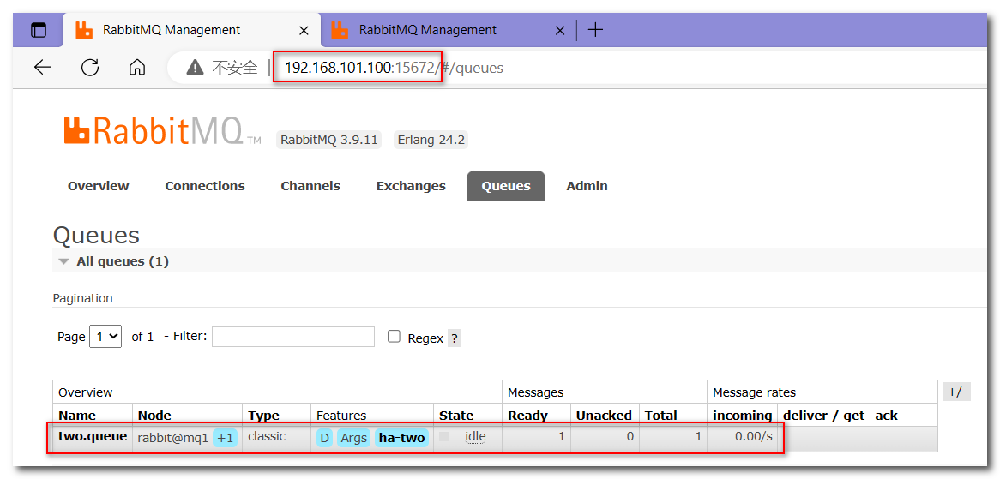

给two.queue发送一条消息：

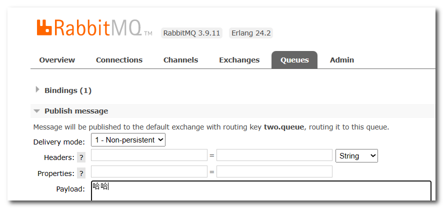

然后在mq1、mq2、mq3的任意控制台查看消息：

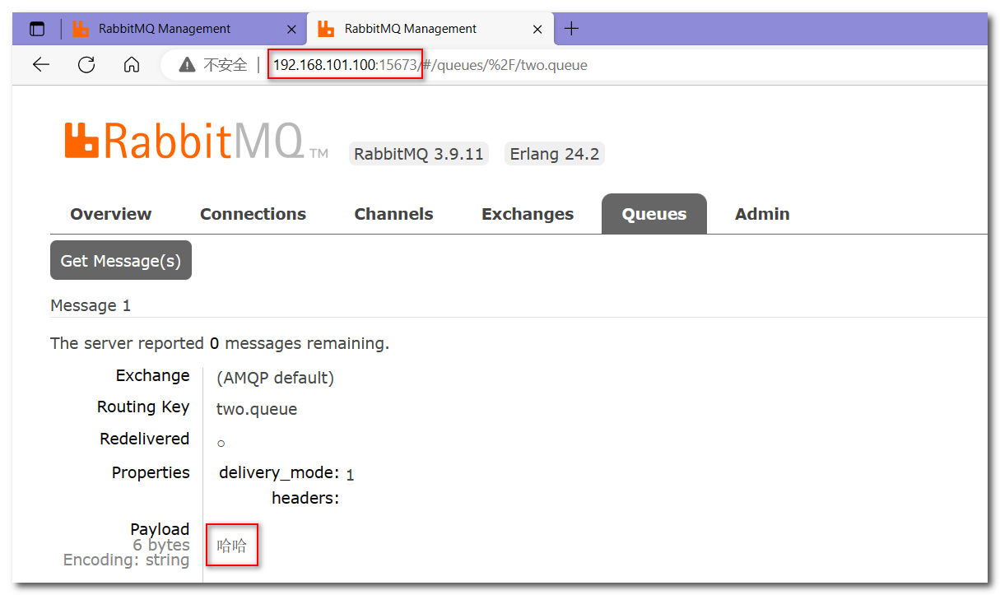


#### 测试高可用

现在，我们让two.queue的主节点mq1宕机：

```sh
docker stop mq1
```

查看集群状态：


查看队列状态：

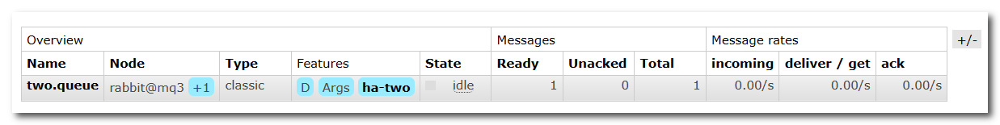

发现依然是健康的，并且其主节点切换到了rabbit@mq3上。


### 8.3 仲裁队列

从RabbitMQ 3.8版本开始，引入了新的仲裁队列，他具备与镜像队里类似的功能，但使用更加方便。

在任意控制台添加一个队列，一定要选择队列类型为Quorum类型。


在任意控制台查看队列：


可以看到，仲裁队列的 + 2字样。代表这个队列有2个镜像节点。

因为仲裁队列默认的镜像数为5。如果你的集群有7个节点，那么镜像数肯定是5；而我们集群只有3个节点，因此镜像数量就是3。


#### **Java代码创建仲裁队列**

```Java
@Bean
public Queue quorumQueue() {
    return QueueBuilder
        .durable("quorum.queue") // 持久化
        .quorum() // 仲裁队列
        .build();
}
```


### 8.4 集群扩容

#### 加入集群

1）启动一个新的MQ容器：

```sh
docker run -d --net mq-net \
--hostname mq4 \
--name mq4 \
-p 15673:15672 \
-p 5673:5672 \
-e RABBITMQ_DEFAULT_USER=root \
-e RABBITMQ_DEFAULT_PASS=123456 \
-e RABBITMQ_ERLANG_COOKIE='rabbitcookie' \
rabbitmq:3.9-management
```

2）进入容器控制台：

```sh
docker exec -it mq4 bash
```

3）停止mq进程

```sh
rabbitmqctl stop_app
```

4）重置RabbitMQ中的数据：

```sh
rabbitmqctl reset
```

5）加入mq1：

```sh
rabbitmqctl join_cluster rabbit@mq1
```

6）再次启动mq进程

```sh
rabbitmqctl start_app
```


#### 增加仲裁队列副本

我们先查看下quorum.queue这个队列目前的副本情况，进入mq1容器：

```sh
docker exec -it mq1 bash
```

执行命令：

```sh
rabbitmq-queues quorum_status "quorum.queue"
```

结果：


现在，我们让mq4也加入进来：

```sh
rabbitmq-queues add_member "quorum.queue" "rabbit@mq4"
```

结果：


再次查看：

```sh
rabbitmq-queues quorum_status "quorum.queue"
```


查看控制台，发现quorum.queue的镜像数量也从原来的 +2 变成了 +3：


