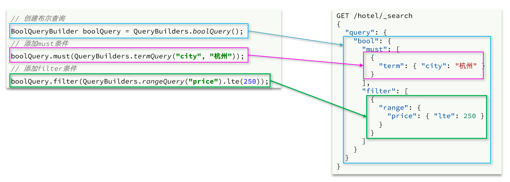
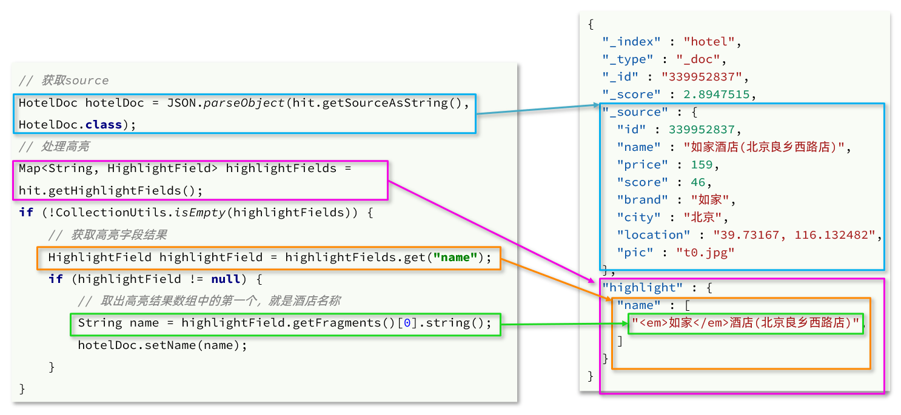
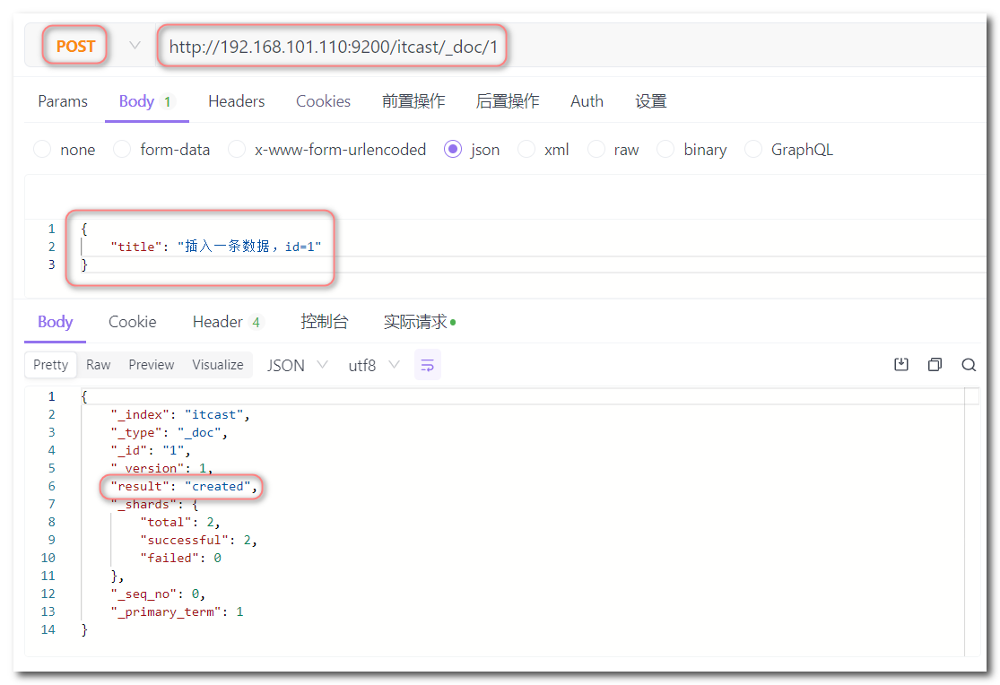

## Elasticsearch

Elasticsearch是一个开源的分布式搜索和分析引擎，构建在Apache Lucene库之上。它被设计用于处理大规模的实时数据，提供了高性能、可伸缩、全文搜索和复杂查询的功能。

以下是Elasticsearch的一些关键特点和功能：

1. 分布式架构：Elasticsearch采用分布式架构，可以将数据分散存储在多个节点上。这样可以实现数据的水平扩展和高可用性，同时支持大规模数据的处理和查询。
2. 实时搜索和分析：Elasticsearch提供了快速的实时搜索和分析能力。它能够在毫秒级别内响应用户的查询请求，并支持复杂的全文搜索、过滤、聚合和排序等操作。
3. 高性能和可伸缩性：Elasticsearch使用倒排索引（Inverted Index）来加快搜索速度。它采用分片和副本机制，可以水平扩展到数百台甚至数千台服务器，以应对大规模的数据和查询负载。
4. 多种数据类型支持：Elasticsearch支持多种数据类型，包括文本、数字、日期、地理位置等。它具有灵活的数据模型，可以轻松处理结构化、半结构化和非结构化的数据。
5. 分布式搜索和聚合：Elasticsearch支持分布式搜索和聚合操作。它可以将查询请求并行分发到多个节点上，并将结果进行合并和汇总，从而加快搜索和分析的速度。
6. RESTful API：Elasticsearch提供了简单易用的RESTful API，使得与Elasticsearch进行交互和操作变得非常方便。开发人员可以使用各种编程语言和工具来与Elasticsearch进行集成和开发应用程序。
7. 数据复制和故障恢复：Elasticsearch采用数据复制和故障恢复机制，确保数据的可靠性和持久性。它将数据分布到多个节点的副本上，并在节点故障时自动进行数据恢复和重新分配。
8. 插件生态系统：Elasticsearch拥有丰富的插件生态系统，提供了许多扩展功能和工具。这些插件可以用于数据分析、监控、安全性、可视化等方面，满足不同场景下的需求。


### 1. 初识elasticsearch

#### 1.1 文档和字段

elasticsearch是面向**文档（Document）**存储的，可以是数据库中的一条商品数据，一个订单信息。

文档数据会被序列化为json格式后存储在elasticsearch中，而Json文档中往往包含很多的**字段（Field）**，类似于数据库中的列。


#### 1.2 索引和映射

**索引（Index）**，就是相同类型的文档的集合。我们可以把索引当做是数据库中的表。

例如：

- 所有用户文档，就可以组织在一起，称为用户的索引；
- 所有商品的文档，可以组织在一起，称为商品的索引；
- 所有订单的文档，可以组织在一起，称为订单的索引；

数据库的表会有约束信息，用来定义表的结构、字段的名称、类型等信息。因此，索引库中就有**映射（mapping）**，是索引中文档的字段约束信息，类似表的结构约束。


统一的把mysql与elasticsearch的概念做一下对比：

| **MySQL** | **Elasticsearch** | **说明**                                                     |
| --------- | ----------------- | ------------------------------------------------------------ |
| Table     | Index             | 索引(index)，就是文档的集合，类似数据库的表(table)           |
| Row       | Document          | 文档（Document），就是一条条的数据，类似数据库中的行（Row），文档都是JSON格式 |
| Column    | Field             | 字段（Field），就是JSON文档中的字段，类似数据库中的列（Column） |
| Schema    | Mapping           | Mapping（映射）是索引中文档的约束，例如字段类型约束。类似数据库的表结构（Schema） |
| SQL       | DSL               | DSL是elasticsearch提供的JSON风格的请求语句，用来操作elasticsearch，实现CRUD |


#### 1.3 安装elasticsearch

**(1) 创建网络**

因为我们还需要部署kibana容器，因此需要让es和kibana容器互联。这里先创建一个网络：

```sh
docker network create es-net
```

**(2) 拉取镜像**

这里我们采用elasticsearch的7.12.1版本的镜像。

```sh
docker pull elasticsearch:7.12.1
```

**(3) 启动镜像**

```sh
docker run -d \
	--name elasticsearch \
    -e "ES_JAVA_OPTS=-Xms512m -Xmx512m" \
    -e "discovery.type=single-node" \
    -v es-data:/usr/share/elasticsearch/data \
    -v es-config:/user/share/elasticsearch/config \
    -v es-plugins:/usr/share/elasticsearch/plugins \
    --privileged \
    --network es-net \
    -p 9200:9200 \
    -p 9300:9300 \
elasticsearch:7.12.1
```

命令解释：

- `-e "cluster.name=es-docker-cluster"`：设置集群名称
- `-e "http.host=0.0.0.0"`：监听的地址，可以外网访问
- `-e "ES_JAVA_OPTS=-Xms512m -Xmx512m"`：内存大小
- `-e "discovery.type=single-node"`：非集群模式
- `-v es-data:/usr/share/elasticsearch/data`：挂载逻辑卷，绑定es的数据目录
- `-v es-logs:/usr/share/elasticsearch/logs`：挂载逻辑卷，绑定es的日志目录
- `-v es-config:/user/share/elasticsearch/config` ：挂载逻辑卷，绑定es的配置文件
- `-v es-plugins:/usr/share/elasticsearch/plugins`：挂载逻辑卷，绑定es的插件目录
- `--privileged`：授予逻辑卷访问权
- `--network es-net` ：加入一个名为es-net的网络中
- `-p 9200:9200`：端口映射配置

数据卷真实目录：

```sh
cd /var/lib/docker/volumes/es-config/_data
```

**(4) 访问elasticsearch**

访问：192.168.101.100:9200，高版本的es会出现下面的情况：


若出现上述情况，则需要创建Elasticsearch用户：

1. 首先，进入运行中的Elasticsearch容器，使用以下命令进入容器的shell环境：

   ```sh
   docker exec -it elasticsearch /bin/bash 
   ```

2. 在容器内，使用`elasticsearch-users`命令行工具或通过API进行用户管理：

   `bin/elasticsearch-users useradd <username> -p <password> -r <role(s)>`，其中，`<username>`为要创建的用户名，`<password>`为用户的密码，`<role(s)>`为用户的角色（如`superuser`、`monitoring`等）。

   例如，创建一个名为 "root" 的用户，设置密码为 "123456"，并将其分配为 "superuser" 角色：

   ```sh
   bin/elasticsearch-users useradd root -p 123456 -r superuser
   ```

   将上述两句命令合成一句命令：

   ```sh
   docker exec -it elasticsearch /bin/bash bin/elasticsearch-users useradd root -p 123456 -r superuser
   ```

3. 退出容器的shell环境：

   ```sh
   exit
   ```

   

#### 1.4 安装kibana

kibana可以给我们提供一个elasticsearch的可视化界面，kibana的版本要和elasticsearch的版本一致。

**(1) 拉取镜像**

```
docker pull kibana:7.12.1
```

**(2) 启动镜像**

```sh
docker run -d \
	--name kibana \
	-e ELASTICSEARCH_HOSTS=http://elasticsearch:9200 \
	--network es-net \
	-p 5601:5601  \
kibana:7.12.1
```

命令解释：

- `--network es-net` ：加入一个名为es-net的网络中，与elasticsearch在同一个网络中
- `-e ELASTICSEARCH_HOSTS=http://elasticsearch:9200"`：设置elasticsearch的地址，因为kibana已经与elasticsearch在一个网络，因此可以用容器名直接访问elasticsearch
- `-p 5601:5601`：端口映射配置

kibana启动一般比较慢，可以通过命令查看运行日志：

```sh
docker logs -f kibana
```

**(3) 访问kibana**

访问：192.168.101.100:5601


#### 1.5 安装ik分词器

es在创建倒排索引时需要对文档分词。在搜索时需要对用户输入的内容分词，但是默认的分词规则对中文的处理并不友好。

下面在kibana的DevTools中测试：


```
POST /_analyzer
{
	"analyzer":"standard",
	"text":"努力学习java找工作"
}
```

语法分析：

- POST为请求方式，后面接的是请求路径，这里省略了192.168.101.100:9200，kibana会自动补充。
- _analyze表示分词。
- 请求参数为json格式：
  - analyzer为分词器类型，这里是默认的standard分词器
  - text为要分词的内容

查看效果：


处理中文分词，一般会使用IK分词器，ik分词器包含两种模式：

- **ik_smart**：最少切分，粗粒度

- **ik_max_word**：最细切分，细粒度


**在线安装ik插件**

```sh
# 进入容器内部
docker exec -it elasticsearch /bin/bash

# 在线下载并安装
./bin/elasticsearch-plugin  install https://github.com/medcl/elasticsearch-analysis-ik/releases/download/v7.12.1/elasticsearch-analysis-ik-7.12.1.zip

#退出
exit

#重启容器
docker restart elasticsearch
```


**离线安装ik插件**

安装插件需要知道elasticsearch的plugins目录位置，而我们用了数据卷挂载，因此需要查看elasticsearch的数据卷目录：

```s
docker volume inspect es-plugins
```


将资料中的ik文件夹上传到数据卷的真实目录：


然后重启容器：

```sh
docker restart elasticsearch
```

将分词器更换为ik的 `ik_smart` 模式：

```
POST /_analyze
{
	"analyzer":"ik_smart",
	"text":"努力学习java找工作"
}
```

查看效果：


将分词器更换为ik的 `ik_max_word` 模式：

```
POST /_analyze
{
	"analyzer":"ik_max_word",
	"text":"努力学习java找工作"
}
```

查看效果：


**扩展词词典**

随着互联网的发展，“造词运动”也越发的频繁。出现了很多新的词语，在原有的词汇列表中并不存在。比如：“奥力给”。

IK分词器提供了扩展词汇的功能。

（1）打开IK分词器config目录：


（2）在 `IKAnalyzer.cfg.xml` 配置文件内容添加：

```xml
<?xml version="1.0" encoding="UTF-8"?>
<!DOCTYPE properties SYSTEM "http://java.sun.com/dtd/properties.dtd">
<properties>
        <comment>IK Analyzer 扩展配置</comment>
        <!--用户可以在这里配置自己的扩展字典，etc.dic为自定义的词典，此时需要创建一个这样的文件-->
        <entry key="ext_dict">ext.dic</entry>
</properties>
```

（3）新建一个 ext.dic，添加如下内容，可以参考ik/config目录下的dic文件

```
奥里给
```

（4）重启elasticsearch 

```sh
docker restart elasticsearch
```

（5）测试效果

```
GET /_analyze
{
  "analyzer": "ik_max_word",
  "text": "努力学习java找工作，奥力给！"
}
```


可以看到，ik将奥里给这三个字分成了一个词，因为我们配置了扩展词词典，其中就有这个词。


**停用词词典**

在互联网项目中，在网络间传输的速度很快，所以很多语言是不允许在网络上传递的，如：关于宗教、政治等敏感词语，那么我们在搜索时也应该忽略当前词汇。IK分词器也提供了强大的停用词功能，让我们在索引时就直接忽略当前的停用词汇表中的内容。

（1）在 `IKAnalyzer.cfg.xml` 配置文件内容添加：

```xml
<?xml version="1.0" encoding="UTF-8"?>
<!DOCTYPE properties SYSTEM "http://java.sun.com/dtd/properties.dtd">
<properties>
        <comment>IK Analyzer 扩展配置</comment>
        <!--用户可以在这里配置自己的扩展词字典-->
        <entry key="ext_dict">ext.dic</entry>
         <!--用户可以在这里配置自己的停用词字典-->
        <entry key="ext_stopwords">stopword.dic</entry>
</properties>
```

（2）新建stopword.dic，在该文件中添加停用词：

```
java
```

 （3）重启elasticsearch 

```
docker restart elasticsearch
```

（4）测试效果

```
GET /_analyze
{
  "analyzer": "ik_max_word",
  "text": "努力学习java找工作，奥力给！"
}
```


可以看到，查询结果中没有出现停用词java。


### 2. 索引库操作

#### 2.1 mapping属性

mapping是对索引库中文档的约束，常见的mapping属性包括：

- type：字段数据类型，常见的简单类型有：
  - 字符串：text（可分词的文本）、keyword（精确值，例如：品牌、国家、ip地址）
  - 数值：long、integer、short、byte、double、float、
  - 布尔：boolean
  - 日期：date
  - 对象：object
- index：是否创建索引，默认为true
- analyzer：使用哪种分词器
- properties：该字段的子字段

例如下面的json文档：

```
{
    "age": 21,
    "weight": 52.1,
    "isMarried": false,
    "info": "黑马程序员Java讲师",
    "email": "zy@itcast.cn",
    "score": [99.1, 99.5, 98.9],
    "name": {
        "firstName": "云",
        "lastName": "赵"
    }
}
```

对应的每个字段映射（mapping）：

- age：类型为 integer；参与搜索，因此需要index为true；无需分词器
- weight：类型为float；参与搜索，因此需要index为true；无需分词器
- isMarried：类型为boolean；参与搜索，因此需要index为true；无需分词器
- info：类型为字符串，需要分词，因此是text；参与搜索，因此需要index为true；分词器可以用ik_smart
- email：类型为字符串，但是不需要分词，因此是keyword；不参与搜索，因此需要index为false；无需分词器
- score：虽然是数组，但是我们只看元素的类型，类型为float；参与搜索，因此需要index为true；无需分词器
- name：类型为object，需要定义多个子属性
  - name.firstName；类型为字符串，但是不需要分词，因此是keyword；参与搜索，因此需要index为true；无需分词器
  - name.lastName；类型为字符串，但是不需要分词，因此是keyword；参与搜索，因此需要index为true；无需分词器


#### 2.2 索引库操作

索引库操作有哪些？

- 创建索引库：PUT /索引库名
- 查询索引库：GET /索引库名
- 删除索引库：DELETE /索引库名
- 添加字段：PUT /索引库名/_mapping

下面展示的操作都是在kibana客户端实现的：

##### 创建索引库

创建索引库发送的是PUT请求。

创建索引库和mapping的DSL语法如下：

```dsl
PUT /索引库名称
{
  "mappings": {
    "properties": {
      "字段名":{
        "type": "text",
        "analyzer": "ik_smart"
      },
      "字段名2":{
        "type": "keyword",
        "index": "false"
      },
      "字段名3":{
        "properties": {
          "子字段名": {
            "type": "keyword"
          }
        }
      },
      // ...略
    }
  }
}
```

示例：

```
# 创建索引库
PUT /heima
{
  "mappings": {
    "properties": {
      "info": {
        "type": "text",
        "analyzer": "ik_smart"
      },
      "email": {
        "type": "keyword",
        "index": false
      },
      "name": {
        "properties": {
          "firstname":{
            "type": "keyword"
          },
          "lastname": {
            "type": "keyword"
          }
        }
      }
    }
  }
}
```


##### 查询索引库

查询索引库的语法：

```
GET /索引库名
```


##### 添加字段信息

索引库是不支持需改的，只允许添加新字段的映射信息。

添加字段映射信息发送的是PUT请求，语法如下：

```
PUT /索引库名/_mapping
{
  "properties": {
    "新字段名":{
      "type": "integer"
    }
  }
}
```

示例：

```json
# 新增字段映射信息
PUT /heima/_mapping
{
  "properties": {
    "age": {
      "type": "integer"
    }
  }
}
```


##### 删除索引库

删除索引库的语法：

```
DELETE /索引库名
```


#### 2.3 文档操作

##### 新增文档

语法：

```json
POST /索引库名/_doc/文档id
{
    "字段1": "值1",
    "字段2": "值2",
    "字段3": {
        "子属性1": "值3",
        "子属性2": "值4"
    },
    // ...
}
```

示例：

```json
# 新增文档
POST /heima/_doc/1
{
  "info":"黑马程序员java讲师",
  "email": "zs@qq.com",
  "name": {
    "firstname":"三",
    "lastname": "张"
  }
}
```


##### 查询文档

语法：

```
GET /索引库名称/_doc/文档id
```


##### 修改文档

修改有两种方式：

- 全量修改：直接覆盖原来的文档，本质是先根据id删除，再新增
- 增量修改：修改文档中的部分字段

**(1) 全量修改**

全量修改发送的是PUT请求。

全量修改是覆盖原来的文档，其本质是根据指定的id删除文档，然后新增一个相同id的文档

**注意**：如果根据id删除时，id不存在，第二步的新增也会执行，也就从修改变成了新增操作了。

语法如下：

```
PUT /索引库名/_doc/文档id
{
    "字段1": "值1",
    "字段2": "值2",
    // ... 略
}
```

示例：

```
# 修改文档
POST /heima/_doc/1
{
  "info":"黑马程序员java讲师",
  "email": "ls@qq.com",
  "name": {
    "firstname":"四",
    "lastname": "李"
  }
}
```


**(2) 增量修改**

增量修改发送的是POST请求。

增量修改是只修改指定id匹配的文档中的部分字段。

语法：

```json
POST /索引库名/_update/文档id
{
    "doc": {
         "字段名": "新的值",
    }
}
```

示例：

```
POST /heima/_update/1
{
	"doc": {
		"info": "黑马程序员Python讲师"
	}
}
```


##### 删除文档

语法：

```
DELETE /索引库名/_doc/文档id
```


### 3. RestClient

导入资料中提供的项目：


项目结构如图：


创建数据库heima，执行sql资料中提供的`tb_hotel.sql`文件

编写数据表对应的索引库的DSL语句（注意DSL语句不需要包括请求方法和请求路径）：

```json
{
  "mappings": {
    "properties": {
      "id": {
        "type": "keyword"
      },
      "name":{
        "type": "text",
        "analyzer": "ik_max_word",
        "copy_to": "all"
      },
      "address":{
        "type": "keyword",
        "index": false
      },
      "price":{
        "type": "integer"
      },
      "score":{
        "type": "integer"
      },
      "brand":{
        "type": "keyword",
        "copy_to": "all"
      },
      "city":{
        "type": "keyword",
        "copy_to": "all"
      },
      "starName":{
        "type": "keyword"
      },
      "business":{
        "type": "keyword"
      },
      "location":{
        "type": "geo_point"
      },
      "pic":{
        "type": "keyword",
        "index": false
      },
      "all":{
        "type": "text",
        "analyzer": "ik_max_word"
      }
    }
  }
}
```

几个特殊字段说明：

- location：地理坐标，里面包含精度、纬度
- all：一个组合字段，其目的是将多字段的值利用 `copy_to` 属性合并，提供给用户搜索


#### 3.1 初始化RestClient

在elasticsearch提供的API中，与elasticsearch一切交互都封装在一个名为RestHighLevelClient的类中，必须先完成这个对象的初始化，建立与elasticsearch的连接。

(1) 引入es的RestHighLevelClient依赖

```xml
<dependency>
    <groupId>org.elasticsearch.client</groupId>
    <artifactId>elasticsearch-rest-high-level-client</artifactId>
</dependency>
```

(2) 因为当前使用的SpringBoot 2.3.10.RELEASE版本默认的ES版本是7.6.2，所以我们需要将当前使用的版本覆盖默认的ES版本：

```xml
<properties>
    <java.version>1.8</java.version>
    <elasticsearch.version>7.12.1</elasticsearch.version>
</properties>
```

(3) 初始化RestHighLevelClient

```java 
RestHighLevelClient client = 
new RestHighLevelClient(RestClient.builder(HttpHost.create("http://192.168.101.100:9200")));
```

这里为了单元测试方便，我们创建一个测试类`HotelIndexTest`，然后将初始化的代码编写在@BeforeEach标识的方法中：

> @BeforeEach注解所标识的方法会在每次执行测试方法之前执行。
>
> @AfterEach注解所标识的方法会在每次执行完测试方法之后执行。

```Java
public class HotelIndexTest {
    // 声明RestHighLevelClient
    private RestHighLevelClient client;

    @BeforeEach
    void setUp() {
        // 初始化RestHighLevelClient
        this.client = new RestHighLevelClient(RestClient.builder(
                HttpHost.create("http://192.168.101.100:9200")
        ));
    }

    @AfterEach
    void tearDown() throws IOException {
        // 关闭连接
        this.client.close();
    }
}
```


#### 3.2 RestClient操作索引库

##### 创建索引库

首先在hotel-demo的cn.itcast.hotel.constants包下，创建一个类，定义mapping映射的JSON字符串常量：

```Java
package cn.itcast.hotel.constants;

public class HotelConstants {
    public static final String MAPPING_TEMPLATE = "{\n" +
            "  \"mappings\": {\n" +
            "    \"properties\": {\n" +
            "      \"id\": {\n" +
            "        \"type\": \"keyword\"\n" +
            "      },\n" +
            "      \"name\":{\n" +
            "        \"type\": \"text\",\n" +
            "        \"analyzer\": \"ik_max_word\",\n" +
            "        \"copy_to\": \"all\"\n" +
            "      },\n" +
            "      \"address\":{\n" +
            "        \"type\": \"keyword\",\n" +
            "        \"index\": false\n" +
            "      },\n" +
            "      \"price\":{\n" +
            "        \"type\": \"integer\"\n" +
            "      },\n" +
            "      \"score\":{\n" +
            "        \"type\": \"integer\"\n" +
            "      },\n" +
            "      \"brand\":{\n" +
            "        \"type\": \"keyword\",\n" +
            "        \"copy_to\": \"all\"\n" +
            "      },\n" +
            "      \"city\":{\n" +
            "        \"type\": \"keyword\",\n" +
            "        \"copy_to\": \"all\"\n" +
            "      },\n" +
            "      \"starName\":{\n" +
            "        \"type\": \"keyword\"\n" +
            "      },\n" +
            "      \"business\":{\n" +
            "        \"type\": \"keyword\"\n" +
            "      },\n" +
            "      \"location\":{\n" +
            "        \"type\": \"geo_point\"\n" +
            "      },\n" +
            "      \"pic\":{\n" +
            "        \"type\": \"keyword\",\n" +
            "        \"index\": false\n" +
            "      },\n" +
            "      \"all\":{\n" +
            "        \"type\": \"text\",\n" +
            "        \"analyzer\": \"ik_max_word\"\n" +
            "      }\n" +
            "    }\n" +
            "  }\n" +
            "}";
}
```

在HotelIndexTest测试类中编写创建索引库方法：

```Java
    @Test
    void testCreateHotelIndex() throws IOException {
        //1.创建Request对象
        CreateIndexRequest request = new CreateIndexRequest("hotel"); // 参数为索引库名
        //2.请求参数，MAPPING_TEMPLATE是自定义的静态常量字符串，内容是创建索引库的DSL语句
        request.source(MAPPING_TEMPLATE, XContentType.JSON);
        //3.发送请求
        client.indices().create(request, RequestOptions.DEFAULT);// indices方法返回操作索引库的对象
    }
```


##### 删除索引库

在HotelIndexTest测试类中编写删除索引库方法：

```java
    @Test
    void testDeleteHotelIndex() throws IOException {
        //1.创建Request对象
        DeleteIndexRequest request = new DeleteIndexRequest("hotel");
        //2.发送请求
        client.indices().delete(request,RequestOptions.DEFAULT);
    }
```


##### 判断索引库是否存在

在HotelIndexTest测试类中编写判断索引库是否存在的方法：

```Java
    @Test
    void testExistsHotelIndex() throws IOException {
        //1.创建Request对象
        GetIndexRequest request = new GetIndexRequest("hotel");
        //2.发起请求
        boolean exists = client.indices().exists(request, RequestOptions.DEFAULT);
        System.out.println(exists?"索引库已存在":"索引库不存在");
    }
```


#### 3.3 RestClient操作文档

##### 创建索引库实体类

数据库查询后的结果是一个Hotel类型的对象，结构如下：

```Java
@Data
@TableName("tb_hotel")
public class Hotel {
    @TableId(type = IdType.INPUT)
    private Long id;
    private String name;
    private String address;
    private Integer price;
    private Integer score;
    private String brand;
    private String city;
    private String starName;
    private String business;
    private String longitude;
    private String latitude;
    private String pic;
}
```

与我们的索引库结构存在差异：longitude和latitude需要合并为location，因此需要定义一个新的类型，与索引库结构吻合：

```java
@Data
@NoArgsConstructor
public class HotelDoc {
    private Long id;
    private String name;
    private String address;
    private Integer price;
    private Integer score;
    private String brand;
    private String city;
    private String starName;
    private String business;
    private String location;
    private String pic;

    public HotelDoc(Hotel hotel) {
        this.id = hotel.getId();
        this.name = hotel.getName();
        this.address = hotel.getAddress();
        this.price = hotel.getPrice();
        this.score = hotel.getScore();
        this.brand = hotel.getBrand();
        this.city = hotel.getCity();
        this.starName = hotel.getStarName();
        this.business = hotel.getBusiness();
        this.location = hotel.getLatitude() + ", " + hotel.getLongitude();
        this.pic = hotel.getPic();
    }
}
```


##### 新增文档

新增文档的DSL语句如下：

```json
POST /索引库名/_doc/文档id
{
    "name": "Jack",
    "age": 21
}
```

对应的java代码如图：


可以看到与创建索引库类似，同样是三步走：

1）创建Request对象

2）准备请求参数，也就是DSL中的JSON文档

3）发送请求

变化的地方在于，这里直接使用client.xxx()的API，不再需要client.indices()了。


下面导入酒店数据，转换成文档，基本流程一致，但是需要考虑几点变化：

- 酒店数据来自于数据库，我们需要先查询出来，得到hotel对象
- hotel对象需要转为HotelDoc对象
- HotelDoc需要序列化为json格式

代码整体步骤如下：

1）根据id查询酒店数据Hotel

2）将Hotel封装为HotelDoc

3）将HotelDoc序列化为JSON

4）创建IndexRequest，指定索引库名和id

5）准备请求参数，也就是JSON文档

6）发送请求

在hotel-demo的HotelDocumentTest测试类中，测试新增文档：

```Java
@SpringBootTest
public class HotelDocumentTest {

    // 声明RestClient
    private RestHighLevelClient client;

    @Autowired
    private IHotelService hotelService;


    @BeforeEach
    void setUp() {
        this.client = new RestHighLevelClient(RestClient.builder(
                HttpHost.create("http://192.168.101.100:9200")
        ));
    }

    @AfterEach
    void tearDown() throws IOException {
        this.client.close();
    }

    /**
     * 新增文档
     */
    @Test
    void testAddDocument() throws IOException {
        // 1.根据id查询酒店数据
        Hotel hotel = hotelService.getById(61083L);
        // 2.转换为文档类型
        HotelDoc hotelDoc = new HotelDoc(hotel);
        // 3.将HotelDoc转json
        String json = JSON.toJSONString(hotelDoc);

        // 1.准备Request对象
        IndexRequest request = new IndexRequest("hotel").id(hotelDoc.getId().toString());
        // 2.准备Json文档
        request.source(json, XContentType.JSON);
        // 3.发送请求
        client.index(request, RequestOptions.DEFAULT);
    }

}
```


##### 查询文档

查询的DSL语句如下：

```
GET /索引库名/_doc/文档id
```

因此代码大概分两步：

- 准备Request对象
- 发送请求

对应的java代码如图：


不过查询的目的是得到结果，解析为HotelDoc，在hotel-demo的HotelDocumentTest测试类中，测试查询文档：

```Java
@Test
void testGetDocumentById() throws IOException {
    // 1.准备Request
    GetRequest request = new GetRequest("hotel", "61083");
    // 2.发送请求，得到响应
    GetResponse response = client.get(request, RequestOptions.DEFAULT);
    // 3.解析响应结果
    String json = response.getSourceAsString();
    HotelDoc hotelDoc = JSON.parseObject(json, HotelDoc.class); // 将json字符串转换成java对象
    System.out.println(hotelDoc);
}
```


##### 删除文档

删除的DSL语句如下：

```
DELETE /索引库名/_doc/文档id
```

与查询相比，仅仅是请求方式从DELETE变成GET：

1）准备Request对象，因为是删除，这次是DeleteRequest对象。要指定索引库名和id

2）发送请求，因为是删除，所以是client.delete()方法

在hotel-demo的HotelDocumentTest测试类中，编写单元测试：

```Java
@Test
void testDeleteDocument() throws IOException {
    // 1.准备Request
    DeleteRequest request = new DeleteRequest("hotel", "61083");
    // 2.发送请求
    client.delete(request, RequestOptions.DEFAULT);
}
```


##### 修改文档

修改有两种方式：

- 全量修改：直接覆盖原来的文档，本质是先根据id删除，再新增
- 增量修改：修改文档中的部分字段

在RestClient的API中，全量修改与新增的API完全一致，判断依据是ID：

- 如果新增时ID已经存在，则修改
- 如果新增时ID不存在，则新增

全量修改这里不再赘述，这里主要关注增量修改，代码流程如下：

1）准备Request对象。这次是修改，所以是UpdateRequest

2）准备参数。也就是JSON文档，里面包含要修改的字段

3）更新文档。这里调用client.update()方法

代码示例如图：


下面在hotel-demo的HotelDocumentTest测试类中，测试修改文档：

```Java
@Test
void testUpdateDocument() throws IOException {
    // 1.准备Request
    UpdateRequest request = new UpdateRequest("hotel", "61083");
    // 2.准备请求参数
    request.doc(
        "price", "952",
        "starName", "四钻"
    );
    // 3.发送请求
    client.update(request, RequestOptions.DEFAULT);
}
```


##### 批量导入文档

利用BulkRequest批量将数据库数据导入到索引库中。

步骤如下：

- 利用mybatis-plus查询酒店数据

- 将查询到的酒店数据（Hotel）转换为文档类型数据（HotelDoc）

- 利用RestClient中的BulkRequest批处理，实现批量新增文档。

BulkRequest，其本质就是将多个普通的CRUD请求组合在一起发送。

其中提供了一个add方法，用来添加其他请求：


可以看到，能添加的请求包括：

- IndexRequest，也就是新增
- UpdateRequest，也就是修改
- DeleteRequest，也就是删除

因此Bulk中添加了多个IndexRequest，就是批量新增功能了，代码流程如下：

1）创建Request对象。这里是BulkRequest

2）准备参数。批处理的参数，就是其它Request对象，这里就是多个IndexRequest

3）发起请求。这里是批处理，调用的方法为client.bulk()方法

代码示例：


我们在导入酒店数据时，将上述代码改造成for循环处理即可。在hotel-demo的HotelDocumentTest测试类中，测试批量新增文档：

```Java
@Test
void testBulkRequest() throws IOException {
    // 批量查询酒店数据
    List<Hotel> hotels = hotelService.list();

    // 1.创建Request
    BulkRequest request = new BulkRequest();
    // 2.准备参数，添加多个新增的Request
    for (Hotel hotel : hotels) {
        // 2.1.转换为文档类型HotelDoc
        HotelDoc hotelDoc = new HotelDoc(hotel);
        // 2.2.创建新增文档的Request对象
        request.add(new IndexRequest("hotel")
                    .id(hotelDoc.getId().toString())
                    .source(JSON.toJSONString(hotelDoc), XContentType.JSON));
    }
    // 3.发送请求
    client.bulk(request, RequestOptions.DEFAULT);
}
```


### 4. DSL查询文档

DSL查询语法的基本结构：

```
GET /hotel/_search
{
  "query": {
    "查询类型": {查询条件}
  }
}
```


#### 4.1 全文检索查询

常见的全文检索查询包括：

- match查询：单字段查询
- multi_match查询：多字段查询，任意一个字段符合条件就算符合查询条件
- match_all：查询所有

##### match查询

match查询语法如下：

```
GET /索引库名/_search
{
  "query": {
    "match": {
      "字段名": "查询词"
    }
  }
}
```

示例：查询name字段中包含“地铁”的文档

```
GET /hotel/_search
{
  "query": {
    "match": {
      "name": "地铁"
    }
  }
}
```


##### multi_match查询

multi_match语法如下：

```
GET /索引库名/_search
{
  "query": {
    "multi_match": {
      "query": "查询词",
      "fields": ["字段1", " 字段2"]
    }
  }
}
```

示例：查询brand、name、business字段中包含”外滩“的文档

```
GET /hotel/_search
{
  "query": {
    "multi_match": {
      "query": "外滩",
      "fields": ["brand","name","business"]
    }
  }
}
```

参与搜索的字段越多，查询的效率就越低，所以推荐使用match查询，multi_match查询也可以使用match查询代替，那就是将需要参与查询的字段使用`copy_to`属性加入到一个字段中，然后查询该字段即可。

比如将上述查询的三个字段加入到一个all字段中，然后查询all字段，这样的效果和上述使用multi_match查询一样：

```
GET /hotel/_search
{
  "query": {
    "match": {
      "all": "外滩"
    }
  }
}
```


##### match_all查询

match_all查询语法：

```
GET /索引库名/_search
{
  "query": {
    "match_all": {}
  }
}
```


#### 4.2 精确查询

精确查询一般是查找keyword、数值、日期、boolean等类型字段。所以不会对搜索条件分词。常见的有：

- term：根据词条精确值查询，一般搜索keyword类型、数值类型、布尔类型、日期类型字段。
- range：根据值的范围查询，可以是数值、日期的范围。

##### term查询

term查询语法如下：

```
GET /索引库名/_search
{
  "query": {
    "term": {
      "字段名": {
        "value": "查询值"
      }
    }
  }
}
```

或者：

```
GET /hotel/_search
{
  "query": {
    "term": {
      "字段名": "查询值"
    }
  }
}
```

示例：查询city字段为上海的文档

```
GET /hotel/_search
{
  "query": {
    "term": {
      "city": {
        "value": "上海"
      }
    }
  }
}
或者
GET /hotel/_search
{
  "query": {
    "term": {
      "city": "上海"
    }
  }
}
```


##### range查询

range查询语法：

```json
GET /索引库名/_search
{
  "query": {
    "range": {
      "字段名": {
        "gte": 10, // gte代表大于等于，gt则代表大于
        "lte": 20  // lte代表小于等于，lt则代表小于
      }
    }
  }
}
```

示例：查询酒店价格在1000-2000之间的

```json
GET /hotel/_search
{
  "query": {
    "range": {
      "price": {
        "gte": 1000,
        "lte": 2000
      }
    }
  }
}
```


#### 4.3 地理坐标查询

##### geo_bounding_box查询

矩形范围查询，也就是geo_bounding_box查询，查询坐标落在某个矩形范围的所有文档：


查询时，需要指定矩形的**左上**、**右下**两个点的坐标，然后画出一个矩形，落在该矩形内的都是符合条件的点。

语法如下：

```json
GET /索引库名/_search
{
  "query": {
    "geo_bounding_box": {
      "字段": { // 需要是geo_point类型的字段
        "top_left": { // 左上点
          "lat": 31.1, // 纬度
          "lon": 121.5 // 精度
        },
        "bottom_right": { // 右下点
          "lat": 30.9,
          "lon": 121.7
        }
      }
    }
  }
}
```


##### geo_distance查询

附近查询，也叫做距离查询（geo_distance）：查询到指定中心点小于某个距离值的所有文档。


语法说明：

```
// geo_distance 查询
GET /索引库名/_search
{
  "query": {
    "geo_distance": {
      "distance": "15km", // 半径	
      "字段名": "31.21,121.5" // 圆心，意思就是查询指定经纬度字段，距离指定圆心15km以内的数据
    }
  }
}
```

需要注意的是指定的圆心的经纬度是**纬度在前，精度在后**。

示例：

```
GET /hotel/_search
{
  "query": {
    "geo_distance": {
      "distance": "2km",
      "location": "31.2,121.5"
    }
  }
}
```


#### 4.4 复合查询

复合（compound）查询：复合查询可以将其它简单查询组合起来，实现更复杂的搜索逻辑。常见的有两种：

- fuction score：算分函数查询，可以控制文档相关性算分，控制文档排名
- bool query：布尔查询，利用逻辑关系组合多个其它的查询，实现复杂搜索


当我们利用match查询时，文档结果会根据与搜索词条的关联度打分（_score），返回结果时按照分值降序排列。

例如，我们搜索 "虹桥如家"，结果如下：

```
[
  {
    "_score" : 17.850193,
    "_source" : {
      "name" : "虹桥如家酒店真不错",
    }
  },
  {
    "_score" : 12.259849,
    "_source" : {
      "name" : "外滩如家酒店真不错",
    }
  },
  {
    "_score" : 11.91091,
    "_source" : {
      "name" : "迪士尼如家酒店真不错",
    }
  }
]
```

在elasticsearch中，早期使用的打分算法是TF-IDF算法，公式如下：


在后来的5.1版本升级中，elasticsearch将算法改进为BM25算法，公式如下：


要想人为控制相关性算分，就需要利用elasticsearch中的function score 查询了。

##### fuction score查询

fuction score查询语法说明：


function score 查询中包含四部分内容：

- **原始查询条件**：query部分，基于这个条件搜索文档，并且基于BM25算法给文档打分，得到**原始算分**（query score)
- **过滤条件**：filter部分，符合该条件的文档才会重新算分
- **算分函数**：符合filter条件的文档要根据这个函数做运算，得到**函数算分**（function score）。有四种函数：
  - weight：函数结果是常量
  - field_value_factor：以文档中的某个字段值作为函数结果
  - random_score：以随机数作为函数结果
  - script_score：自定义算分函数算法
- **运算模式**：算分函数的结果、原始查询的相关性算分。两者之间的运算方式如下：
  - multiply：相乘，默认的运算模式
  - replace：用function score替换query score
  - 其它，例如：sum、avg、max、min


function score的运行流程如下：

1）根据**原始条件**查询搜索文档，并且计算相关性算分，称为**原始算分**（query score）

2）根据**过滤条件**，过滤文档

3）符合**过滤条件**的文档，基于**算分函数**运算，得到**函数算分**（function score）

4）将**原始算分**（query score）和**函数算分**（function score）基于**运算模式**做运算，得到最终结果，作为相关性算分。


**需求**：给“如家”这个品牌的酒店排名靠前一些

翻译一下这个需求，转换为之前说的四个要点：

- 原始条件：不确定，可以任意变化
- 过滤条件：brand = "如家"
- 算分函数：可以简单粗暴，直接给固定的算分结果，weight
- 运算模式：比如求和

因此最终的DSL语句如下：

```
GET /hotel/_search
{
  "query": {
    "function_score": {
      "query": {  .... }, // 原始查询，可以是任意条件
      "functions": [ // 算分函数
        {
          "filter": { // 满足的条件，品牌必须是如家
            "term": {
              "brand": "如家"
            }
          },
          "weight": 2 // 算分权重为2
        }
      ],
      "boost_mode": "sum" // 加权模式，求和
    }
  }
}
```

在未添加算分函数时，如家得分如下：


添加了算分函数后：


##### bool查询

布尔查询是一个或多个查询子句的组合，每一个子句就是一个**子查询**。子查询的组合方式有：

- must：必须匹配每个子查询，类似“与”
- should：选择性匹配子查询，类似“或”
- must_not：必须不匹配，**不参与算分**，类似“非”
- filter：必须匹配，**不参与算分**


比如在搜索酒店时，除了关键字搜索外，我们还可能根据品牌、价格、城市等字段做过滤：


每一个不同的字段，其查询的条件、方式都不一样，必须是多个不同的查询，而要组合这些查询，就必须用bool查询了。

需要注意的是，搜索时，参与**打分的字段越多，查询的性能也越差**。因此这种多条件查询时，建议这样做：

- 搜索框的关键字搜索，是全文检索查询，使用must查询，参与算分
- 其它过滤条件，采用filter或者must_not查询，不参与算分

bool查询语法：

```
GET /hotel/_search
{
  "query": {
    "bool": {
      "must": [
        {"查询类型": {查询条件}}
      ],
      "should": [
        {"查询类型": {查询条件}},
      ],
      "must_not": [
        {"查询类型": {查询条件}}
      ],
      "filter": [
        {"查询类型": {查询条件}}
      ]
    }
  }
}
```

示例：

```
GET /hotel/_search
{
  "query": {
    "bool": {
      "must": [
        {"term": {"city": "上海" }}
      ],
      "should": [
        {"term": {"brand": "皇冠假日" }},
        {"term": {"brand": "华美达" }}
      ],
      "must_not": [
        { "range": { "price": { "lte": 500 } }}
      ],
      "filter": [
        { "range": {"score": { "gte": 45 } }}
      ]
    }
  }
}
```


需求：搜索名字包含“如家”，价格不高于400，在坐标31.21,121.5周围10km范围内的酒店。

分析：

- 名称搜索，属于全文检索查询，应该参与算分，放到must中
- 价格不高于400，用range查询，属于过滤条件，不参与算分。放到must_not中
- 周围10km范围内，用geo_distance查询，属于过滤条件，不参与算分。放到filter中


#### 4.5 搜索结果处理

##### 排序

elasticsearch默认是根据相关度算分（_score）来排序，但是也支持自定义方式对搜索[结果排序](https://www.elastic.co/guide/en/elasticsearch/reference/current/sort-search-results.html)。可以排序字段类型有：keyword类型、数值类型、地理坐标类型、日期类型等。

**(1) 普通字段排序**

keyword、数值、日期类型排序的语法基本一致。

```json
GET /indexName/_search
{
  "query": {
    "match_all": {}
  },
  "sort": [
    {
      "FIELD": "desc"  // 排序字段、排序方式asc、desc
    }
  ]
}
```

排序条件是一个数组，也就是可以写多个排序条件。按照声明的顺序，当第一个条件相等时，再按照第二个条件排序，以此类推。


**示例**：酒店数据按照用户评价（score)降序排序，评价相同的按照价格(price)升序排序

```
GET /hotel/_search
{
  "query": {
    "match_all": {}
  },
  "sort": [
    {
      "score": "desc"
    },
    {
      "price": "asc"
    }
  ]
}
```


**(2) 地理坐标排序**

语法说明：

```json
GET /索引库名/_search
{
  "query": {
    "match_all": {}
  },
  "sort": [
    {
      "_geo_distance": {
        "字段名": {	//文档中geo_point类型的字段名
          "lat": 纬度,
          "lon": 精度
        }, 
        "unit": "km",	 // 排序的距离单位
        "order": "desc"	 // 排序方式
      }
    }
  ]
}

或者

GET /索引库名/_search
{
  "query": {
    "match_all": {}
  },
  "sort": [
    {
      "_geo_distance" : {
          "字段名" : "纬度,经度", // 文档中geo_point类型的字段名、目标坐标点
          "order" : "asc", 
          "unit" : "km" 
      }
    }
  ]
}
```

获取你的位置的经纬度的方式：https://lbs.amap.com/demo/jsapi-v2/example/map/click-to-get-lnglat/

示例：假设我的位置是：31.034661，121.612282，寻找我周围距离最近的酒店。

```json
GET /hotel/_search
{
  "query": {
    "match_all": {}
  },
  "sort": [
    {
      "_geo_distance": {
        "location": {
          "lat": 31.034661,
          "lon": 121.612282
        }, 
        "unit": "km", 
        "order": "asc"
      }
    }
  ]
}
```


##### 分页

elasticsearch 默认情况下只返回top10的数据。而如果要查询更多数据就需要修改分页参数了。

elasticsearch中通过修改from、size参数来控制要返回的分页结果：

- from：从第几个文档开始
- size：总共查询几个文档

类似于mysql中的`limit ?, ?`

分页的基本语法如下：

```json
GET /索引库名/_search
{
  "query": {
    "match_all": {}
  },
  "from": 0, // 分页开始的位置，默认为0
  "size": 10, // 期望获取的文档总数
  "sort": [
    {"字段名": "asc"}
  ]
}
```

es在单点模式下，假如查询第990~第1000条 数据，必须先查询 0~1000条，然后截取其中的990 ~ 1000的这10条：


实际生产时elasticsearch一定是集群启动，因此要想获取整个集群的TOP1000，必须先查询出每个节点的TOP1000，汇总结果后，重新排名，重新截取TOP1000：


假如要查询9900~10000的数据呢？是不是要先查询TOP10000呢？那每个节点都要查询10000条？汇总到内存中？

当查询分页深度较大时，汇总数据过多，对内存和CPU会产生非常大的压力，因此elasticsearch会禁止from+ size 超过10000的请求。

针对深度分页，ES提供了两种解决方案，[官方文档](https://www.elastic.co/guide/en/elasticsearch/reference/current/paginate-search-results.html)：

- `search after`：分页时需要排序，原理是从上一次的排序值开始，查询下一页数据。官方推荐使用的方式。
- `scroll`：原理将排序后的文档id形成快照，保存在内存。官方已经不推荐使用。


##### 高亮

高亮的语法：

```json
GET /索引库名/_search
{
  "query": {
    "match": {
      "字段名": "查询词" // 查询条件，高亮一定要使用全文检索查询
    }
  },
  "highlight": {
    "fields": { // 指定要高亮的字段
      "字段名": {
        "pre_tags": "<em>",  // 用来标记高亮字段的前置标签
        "post_tags": "</em>" // 用来标记高亮字段的后置标签
      }
    }
  }
}
```

注意：

- 高亮是对关键字高亮，因此**搜索条件必须带有关键字**，而不能是范围这样的查询。
- 默认情况下，**高亮的字段，必须与搜索指定的字段一致**，否则无法高亮
- 如果要对非搜索字段高亮，则需要添加一个属性：required_field_match=false

示例：将name字段中的"如家"高亮显示


#### 4.6 总结

查询的DSL是一个大的JSON对象，包含下列属性：

- query：查询条件
- from和size：分页条件
- sort：排序条件
- highlight：高亮条件

示例：


### 5. RestClient查询文档

查询文档的操作步骤：

1）准备Request对象

2）准备请求参数

3）发起请求

4）解析响应


#### 5.1 match_all查询

(1) 创建`SearchRequest`对象，指定索引库名

(2) 利用`request.source()`构建DSL，DSL中可以包含查询、分页、排序、高亮等。

`query()`：代表查询条件，利用`QueryBuilders.matchAllQuery()`构建一个match_all查询的DSL


这里关键的API有两个，一个是`request.source()`，其中包含了查询、排序、分页、高亮等所有功能：


另一个是`QueryBuilders`，其中包含match、term、function_score、bool等各种查询：


(3) 利用client.search()发送请求，得到响应


elasticsearch返回的结果是一个JSON字符串，结构包含：

- `hits`：命中的结果
  - `total`：总条数，其中的value是具体的总条数值
  - `max_score`：所有结果中得分最高的文档的相关性算分
  - `hits`：搜索结果的文档数组，其中的每个文档都是一个json对象
    - `_source`：文档中的原始数据，也是json对象

因此，我们解析响应结果，就是逐层解析JSON字符串，流程如下：

- `SearchHits`：通过response.getHits()获取，就是JSON中的最外层的hits，代表命中的结果
  - `SearchHits.getTotalHits().value`：获取总条数信息
  - `SearchHits.getHits()`：获取SearchHit数组，也就是文档数组
    - `SearchHit.getSourceAsString()`：获取文档结果中的_source，也就是原始的json文档数据


完整代码如下：

```Java
@Test
void testMatchAll() throws IOException {
    // 1.准备Request
    SearchRequest request = new SearchRequest("hotel");
    // 2.准备DSL
    request.source()
        .query(QueryBuilders.matchAllQuery());
    // 3.发送请求
    SearchResponse response = client.search(request, RequestOptions.DEFAULT);

    // 4.解析响应
    handleResponse(response);
}

private void handleResponse(SearchResponse response) {
    // 4.解析响应
    SearchHits searchHits = response.getHits();
    // 4.1.获取总条数
    long total = searchHits.getTotalHits().value;
    System.out.println("共搜索到" + total + "条数据");
    // 4.2.文档数组
    SearchHit[] hits = searchHits.getHits();
    // 4.3.遍历
    for (SearchHit hit : hits) {
        // 获取文档source
        String json = hit.getSourceAsString();
        // 反序列化
        HotelDoc hotelDoc = JSON.parseObject(json, HotelDoc.class);
        System.out.println("hotelDoc = " + hotelDoc);
    }
}
```


#### 5.2 match查询

全文检索的match和multi_match查询与match_all的API基本一致。差别是查询条件，也就是query的部分。


因此，Java代码上的差异主要是request.source().query()中的参数了。同样是利用QueryBuilders提供的方法：


完整代码如下：

```Java
@Test
void testMatch() throws IOException {
    // 1.准备Request
    SearchRequest request = new SearchRequest("hotel");
    // 2.准备DSL
    request.source()
        .query(QueryBuilders.matchQuery("all", "如家"));
    // 3.发送请求
    SearchResponse response = client.search(request, RequestOptions.DEFAULT);
    // 4.解析响应
    handleResponse(response);

}
```


#### 5.3 精确查询

精确查询主要是两者：

- term：词条精确匹配
- range：范围查询

与之前的查询相比，差异同样在查询条件，其它都一样。

查询条件构造的API如下：


#### 5.4 布尔查询

布尔查询是用must、must_not、filter等方式组合其它查询，API与其它查询的差别同样是在查询条件的构建，代码示例如下：



完整代码如下：

```java
@Test
void testBool() throws IOException {
    // 1.准备Request
    SearchRequest request = new SearchRequest("hotel");
    // 2.准备DSL
    // 2.1.准备BooleanQuery
    BoolQueryBuilder boolQuery = QueryBuilders.boolQuery();
    // 2.2.添加term
    boolQuery.must(QueryBuilders.termQuery("city", "杭州"));
    // 2.3.添加range
    boolQuery.filter(QueryBuilders.rangeQuery("price").lte(250));

    request.source().query(boolQuery);
    // 3.发送请求
    SearchResponse response = client.search(request, RequestOptions.DEFAULT);
    // 4.解析响应
    handleResponse(response);

}
```


#### 5.5 排序和分页

搜索结果的排序和分页是与query同级的参数，因此同样是使用request.source()来设置。

对应的API如下：


完整代码示例：

```java
@Test
void testPageAndSort() throws IOException {
    // 页码，每页大小
    int page = 1, size = 5; // 因为当前页码和展示条数由页面传过来，所以这里模拟接收前端传递的参数

    // 1.准备Request
    SearchRequest request = new SearchRequest("hotel");
    // 2.准备DSL
    // 2.1.query
    request.source().query(QueryBuilders.matchAllQuery());
    // 2.2.排序 sort
    request.source().sort("price", SortOrder.ASC);
    // 2.3.分页 from、size
    request.source().from((page - 1) * size).size(5);
    // 3.发送请求
    SearchResponse response = client.search(request, RequestOptions.DEFAULT);
    // 4.解析响应
    handleResponse(response);

}
```


#### 5.6 高亮

高亮的代码与之前代码差异较大，有两点：

- 查询的DSL：其中除了查询条件，还需要添加高亮条件，同样是与query同级。
- 结果解析：结果除了要解析_source文档数据，还要解析高亮结果

**高亮请求构建**

高亮请求的构建API如下：


上述代码省略了查询条件部分，高亮查询必须使用全文检索查询，并且要有搜索关键字，将来才可以对关键字高亮。

完整代码如下：

```java
@Test
void testHighlight() throws IOException {
    // 1.准备Request
    SearchRequest request = new SearchRequest("hotel");
    // 2.准备DSL
    // 2.1.query
    request.source().query(QueryBuilders.matchQuery("all", "如家"));
    // 2.2.高亮
    // new HighlightBuilder()后面也可以链式调用preTags()和postTags()指定高亮的标签，默认是<em>标签。
    request.source().highlighter(new HighlightBuilder().field("name").requireFieldMatch(false));
    // 3.发送请求
    SearchResponse response = client.search(request, RequestOptions.DEFAULT);
    // 4.解析响应
    handleResponse(response);

}
```

**高亮结果解析**

高亮的结果与查询的文档结果默认是分离的，并不在一起。

因此解析高亮的代码需要额外处理：



代码解读：

- 第一步：从结果中获取source。hit.getSourceAsString()，这部分是非高亮结果，json字符串。还需要反序列为HotelDoc对象
- 第二步：获取高亮结果。hit.getHighlightFields()，返回值是一个Map，key是高亮字段名称，值是HighlightField对象，代表高亮值
- 第三步：从map中根据高亮字段名称，获取高亮字段值对象HighlightField
- 第四步：从HighlightField中获取Fragments，并且转为字符串。这部分就是真正的高亮字符串了
- 第五步：用高亮的结果替换HotelDoc中的非高亮结果

完整代码如下：

```java
private void handleResponse(SearchResponse response) {
    // 4.解析响应
    SearchHits searchHits = response.getHits();
    // 4.1.获取总条数
    long total = searchHits.getTotalHits().value;
    System.out.println("共搜索到" + total + "条数据");
    // 4.2.文档数组
    SearchHit[] hits = searchHits.getHits();
    // 4.3.遍历
    for (SearchHit hit : hits) {
        // 获取文档source
        String json = hit.getSourceAsString();
        // 反序列化
        HotelDoc hotelDoc = JSON.parseObject(json, HotelDoc.class);
        // 获取高亮结果
        Map<String, HighlightField> highlightFields = hit.getHighlightFields();
        // 注意这个集合工具类是这个包下的：org.springframework.util.CollectionUtils;
        if (!CollectionUtils.isEmpty(highlightFields)) {
            // 根据字段名获取高亮结果
            HighlightField highlightField = highlightFields.get("name");
            if (highlightField != null) {
                // 获取高亮值
                String name = highlightField.getFragments()[0].string();
                // 覆盖非高亮结果
                hotelDoc.setName(name);
            }
        }
        System.out.println("hotelDoc = " + hotelDoc);
    }
}
```

控制台查看结果：


### 6. 黑马旅游案例

在之前导入的hotel_demo项目，已经提供好了黑马旅游案例的前端界面。

#### 6.1 酒店搜索和分页


##### (1) 需求分析

在项目的首页，有一个搜索框，还有分页按钮，点击搜索按钮，可以看到浏览器控制台发出了请求：


请求参数如下：


由此可以知道，我们这个请求的信息如下：

- 请求方式：POST
- 请求路径：/hotel/list
- 请求参数：JSON对象，包含4个字段：
  - key：搜索关键字
  - page：页码
  - size：每页大小
  - sortBy：排序，目前暂不实现
- 返回值：分页查询，需要返回分页结果PageResult，包含两个属性：
  - `total`：总条数
  - `List<HotelDoc>`：当前页的数据

因此，我们实现业务的流程如下：

- 步骤一：定义实体类，接收请求参数的JSON对象
- 步骤二：编写controller，接收页面的请求
- 步骤三：编写业务实现，利用RestHighLevelClient实现搜索、分页

##### (2) 定义实体类 

实体类有两个，一个是前端的请求参数实体，一个是服务端应该返回的响应结果实体。

1）请求参数

前端请求的json结构如下：

```json
{
    "key": "搜索关键字",
    "page": 1,
    "size": 3,
    "sortBy": "default"
}
```

因此，我们在`cn.itcast.hotel.pojo`包下定义一个实体类：

```java
package cn.itcast.hotel.pojo;

import lombok.Data;

@Data
public class RequestParams {
    private String key;
    private Integer page;
    private Integer size;
    private String sortBy;
}
```

2）返回值

分页查询，需要返回分页结果PageResult，包含两个属性：

- `total`：总条数
- `List<HotelDoc>`：当前页的数据

因此，我们在`cn.itcast.hotel.pojo`中定义返回结果：

```java
package cn.itcast.hotel.pojo;

import lombok.Data;

import java.util.List;

@Data
public class PageResult {
    private Long total;
    private List<HotelDoc> hotels;

    public PageResult() {
    }

    public PageResult(Long total, List<HotelDoc> hotels) {
        this.total = total;
        this.hotels = hotels;
    }
}
```


##### (3) 定义controller

定义一个HotelController，声明查询接口，满足下列要求：

- 请求方式：Post
- 请求路径：/hotel/list
- 请求参数：对象，类型为RequestParam
- 返回值：PageResult，包含两个属性
  - `Long total`：总条数
  - `List<HotelDoc> hotels`：酒店数据


因此，我们在`cn.itcast.hotel.controller`中定义HotelController：

```java
@RestController
@RequestMapping("/hotel")
public class HotelController {

    @Autowired
    private IHotelService hotelService;
	// 搜索酒店数据
    @PostMapping("/list")
    public PageResult search(@RequestBody RequestParams params){
        return hotelService.search(params);
    }
}
```


##### (4) 实现搜索业务

我们在controller调用了IHotelService，并没有实现该方法，因此下面我们就在IHotelService中定义方法，并且去实现业务逻辑。

1）在`cn.itcast.hotel.service`中的`IHotelService`接口中定义一个方法：

```java
/**
 * 根据关键字搜索酒店信息
 * @param params 请求参数对象，包含用户输入的关键字 
 * @return 酒店文档列表
 */
PageResult search(RequestParams params);
```

2）实现搜索业务，肯定离不开RestHighLevelClient，我们需要把它注册到Spring中作为一个Bean。在`cn.itcast.hotel`中的`HotelDemoApplication`中声明这个Bean：

```java
@Bean
public RestHighLevelClient client(){
    return  new RestHighLevelClient(RestClient.builder(
        HttpHost.create("http://192.168.101.100:9200")
    ));
}
```

3）在`cn.itcast.hotel.service.impl`中的`HotelServiceImpl`中实现search方法：

```java
@Override
public PageResult search(RequestParams params) {
    try {
        // 1.准备Request
        SearchRequest request = new SearchRequest("hotel");
        // 2.准备DSL
        // 2.1.query
        String key = params.getKey();
        if (key == null || "".equals(key)) {
            boolQuery.must(QueryBuilders.matchAllQuery());
        } else {
            boolQuery.must(QueryBuilders.matchQuery("all", key));
        }

        // 2.2.分页
        int page = params.getPage();
        int size = params.getSize();
        request.source().from((page - 1) * size).size(size);

        // 3.发送请求
        SearchResponse response = client.search(request, RequestOptions.DEFAULT);
        // 4.解析响应
        return handleResponse(response);
    } catch (IOException e) {
        throw new RuntimeException(e);
    }
}

// 结果解析
private PageResult handleResponse(SearchResponse response) {
    // 4.解析响应
    SearchHits searchHits = response.getHits();
    // 4.1.获取总条数
    long total = searchHits.getTotalHits().value;
    // 4.2.文档数组
    SearchHit[] hits = searchHits.getHits();
    // 4.3.遍历
    List<HotelDoc> hotels = new ArrayList<>();
    for (SearchHit hit : hits) {
        // 获取文档source
        String json = hit.getSourceAsString();
        // 反序列化
        HotelDoc hotelDoc = JSON.parseObject(json, HotelDoc.class);
		// 放入集合
        hotels.add(hotelDoc);
    }
    
    // 下面是使用stream流的方式
    //  List<HotelDoc> hotels = Arrays.stream(hits).map(
    //        (hit) -> {
    //            // 获取文档source
    //            String source = hit.getSourceAsString();
    //            // 反序列化
    //            HotelDoc hotelDoc = JSON.parseObject(source, HotelDoc.class);
    //            return hotelDoc;
    //        }
    // ).collect(Collectors.toList());
    
    // 4.4.封装返回
    return new PageResult(total, hotels);
}
```


#### 6.2 酒店结果过滤


##### (1) 需求分析

添加品牌、城市、星级、价格等过滤功能，传递的参数如图：


包含的过滤条件有：

- brand：品牌值
- city：城市
- minPrice~maxPrice：价格范围
- starName：星级

我们需要做两件事情：

- 修改请求参数的对象RequestParams，接收上述参数
- 修改业务逻辑，在搜索条件之外，添加一些过滤条件

##### (2) 修改实体类

修改在`cn.itcast.hotel.pojo`包下的实体类RequestParams：

```java
@Data
public class RequestParams {
    private String key;
    private Integer page;
    private Integer size;
    private String sortBy;
    // 下面是新增的过滤条件参数
    private String city;
    private String brand;
    private String starName;
    private Integer minPrice;
    private Integer maxPrice;
}
```

##### (3) 修改搜索业务

在HotelService的search方法中，只有一个地方需要修改：requet.source().query( ... )其中的查询条件。

在之前的业务中，只有match查询，根据关键字搜索，现在要添加条件过滤，包括：

- 品牌过滤：是keyword类型，用term查询
- 星级过滤：是keyword类型，用term查询
- 价格过滤：是数值类型，用range查询
- 城市过滤：是keyword类型，用term查询

多个查询条件组合，肯定是boolean查询来组合：

- 关键字搜索放到must中，参与算分
- 其它过滤条件放到filter中，不参与算分


因为条件构建的逻辑比较复杂，这里先封装为一个函数：


buildBasicQuery的代码如下：

```java
private void buildBasicQuery(RequestParams params, SearchRequest request) {
    // 1.构建BooleanQuery
    BoolQueryBuilder boolQuery = QueryBuilders.boolQuery();
    // 2.关键字搜索
    String key = params.getKey();
    if (key == null || "".equals(key)) {
        boolQuery.must(QueryBuilders.matchAllQuery());
    } else {
        boolQuery.must(QueryBuilders.matchQuery("all", key));
    }
    // 3.城市条件
    if (params.getCity() != null && !params.getCity().equals("")) {
        boolQuery.filter(QueryBuilders.termQuery("city", params.getCity()));
    }
    // 4.品牌条件
    if (params.getBrand() != null && !params.getBrand().equals("")) {
        boolQuery.filter(QueryBuilders.termQuery("brand", params.getBrand()));
    }
    // 5.星级条件
    if (params.getStarName() != null && !params.getStarName().equals("")) {
        boolQuery.filter(QueryBuilders.termQuery("starName", params.getStarName()));
    }
	// 6.价格
    if (params.getMinPrice() != null && params.getMaxPrice() != null) {
        boolQuery.filter(QueryBuilders
                         .rangeQuery("price")
                         .gte(params.getMinPrice())
                         .lte(params.getMaxPrice())
                        );
    }
	// 7.放入source
    request.source().query(boolQuery);
}
```


#### 6.3 周边的酒店

##### (1) 需求分析

在酒店列表页的右侧，有一个小地图，点击地图的定位按钮，地图会找到你所在的位置：


并且，在前端会发起查询请求，将你的坐标发送到服务端：


我们要做的事情就是基于这个location坐标，然后按照距离对周围酒店排序。实现思路如下：

- 修改RequestParams参数，接收location字段
- 修改search方法业务逻辑，如果location有值，添加根据geo_distance排序的功能

##### (2) 修改实体类

修改在`cn.itcast.hotel.pojo`包下的实体类RequestParams：

```java
package cn.itcast.hotel.pojo;

import lombok.Data;

@Data
public class RequestParams {
    private String key;
    private Integer page;
    private Integer size;
    private String sortBy;
    private String city;
    private String brand;
    private String starName;
    private Integer minPrice;
    private Integer maxPrice;
    // 我当前的地理坐标
    private String location;
}
```

##### (3) 添加距离排序

地理坐标排序DSL语法如下：

```
GET /indexName/_search
{
  "query": {
    "match_all": {}
  },
  "sort": [
    {
      "price": "asc"  
    },
    {
      "_geo_distance" : {
          "FIELD" : "纬度，经度",
          "order" : "asc",
          "unit" : "km"
      }
    }
  ]
}
```

对应的java代码示例：


在`cn.itcast.hotel.service.impl`的`HotelServiceImpl`的`search`方法中，添加一个排序功能：

```JAVA 
@Override
public PageResult search(RequestParams params) {
    try {
        // 1.准备Request
        SearchRequest request = new SearchRequest("hotel");
        // 2.准备DSL
        // 2.1.query
        buildBasicQuery(params, request);

        // 2.2.分页
        int page = params.getPage();
        int size = params.getSize();
        request.source().from((page - 1) * size).size(size);

        // 2.3.排序
        String location = params.getLocation();
        if (location != null && !location.equals("")) {
            request.source().sort(SortBuilders
                                  .geoDistanceSort("location", new GeoPoint(location))
                                  .order(SortOrder.ASC)
                                  .unit(DistanceUnit.KILOMETERS)
                                 );
        }

        // 3.发送请求
        SearchResponse response = client.search(request, RequestOptions.DEFAULT);
        // 4.解析响应
        return handleResponse(response);
    } catch (IOException e) {
        throw new RuntimeException(e);
    }
}
```

##### (4) 排序距离显示

排序完成后，页面还要获取我附近每个酒店的具体距离值，这个值在响应结果中是独立的：


因此，我们在结果解析阶段，除了解析source部分以外，还要得到sort部分，也就是排序的距离，然后放到响应结果中：

- 修改HotelDoc，添加排序距离字段，用于页面显示
- 修改HotelService类中的handleResponse方法，添加对sort值的获取

1）修改HotelDoc类，添加距离字段

```java
@Data
@NoArgsConstructor
public class HotelDoc {
    private Long id;
    private String name;
    private String address;
    private Integer price;
    private Integer score;
    private String brand;
    private String city;
    private String starName;
    private String business;
    private String location;
    private String pic;
    // 排序时的 距离值
    private Object distance;

    public HotelDoc(Hotel hotel) {
        this.id = hotel.getId();
        this.name = hotel.getName();
        this.address = hotel.getAddress();
        this.price = hotel.getPrice();
        this.score = hotel.getScore();
        this.brand = hotel.getBrand();
        this.city = hotel.getCity();
        this.starName = hotel.getStarName();
        this.business = hotel.getBusiness();
        this.location = hotel.getLatitude() + ", " + hotel.getLongitude();
        this.pic = hotel.getPic();
    }
}
```

2）修改HotelServiceImpl中的handleResponse方法

```java
	 // 结果解析
    private PageResult handleResponse(SearchResponse response) {
        // 4.解析响应
        SearchHits searchHits = response.getHits();
        // 4.1.获取总条数
        long total = searchHits.getTotalHits().value;
        // 4.2.文档数组
        SearchHit[] hits = searchHits.getHits();
        // 4.3.遍历，使用stream流的方式
        List<HotelDoc> hotels = Arrays.stream(hits).map(
                (hit) -> {
                    // 获取文档source
                    String source = hit.getSourceAsString();
                    // 反序列化
                    HotelDoc hotelDoc = JSON.parseObject(source, HotelDoc.class);
                    // 获取排序值
                    Object[] sortValues = hit.getSortValues();
                    if(sortValues.length>0){
                        Object sortValue = sortValues[0];
                        hotelDoc.setDistance(sortValue);
                    }
                    return hotelDoc;
                }
        ).collect(Collectors.toList());

        // 4.4.封装返回
        return new PageResult(total, hotels);
    }
```


#### 6.4 酒店竞价排名

##### (1) 需求分析

让指定酒店排名靠前。因此我们需要给这些酒店添加一个标记，这样在过滤条件中就可以根据这个标记来判断，是否要提高算分。

比如，我们给酒店添加一个字段：isAD，Boolean类型：

- true：是广告
- false：不是广告

这样function_score包含3个要素就很好确定了：

- 过滤条件：判断isAD 是否为true
- 算分函数：我们可以用最简单暴力的weight，固定加权值
- 加权方式：可以用默认的相乘，大大提高算分


因此，业务的实现步骤包括：

1. 给HotelDoc类添加isAD字段，Boolean类型

2. 挑选几个你喜欢的酒店，给它的文档数据添加isAD字段，值为true

3. 修改search方法，添加function score功能，给isAD值为true的酒店增加权重

##### (2) 修改HotelDoc实体

给`cn.itcast.hotel.pojo`包下的HotelDoc类添加isAD字段：


##### (3) 添加广告标记

我们挑几个酒店，使用kibana客户端添加isAD字段，设置为true：

```json
POST /hotel/_update/584697
{
    "doc": {
        "isAD": true
    }
}
POST /hotel/_update/659496
{
    "doc": {
        "isAD": true
    }
}
POST /hotel/_update/711837
{
    "doc": {
        "isAD": true
    }
}
POST /hotel/_update/200214538
{
    "doc": {
        "isAD": true
    }
}
```

##### (4) 添加算分函数查询

修改查询条件，之前是用的boolean 查询，现在要改成function_socre查询。

function_score查询结构对应的JavaAPI示例如下：


将之前写的boolean查询作为**原始查询**条件放到query中，然后添加**过滤条件**、**算分函数**、**加权模式**。

修改`cn.itcast.hotel.service.impl`包下的`HotelServiceImpl`类中的`buildBasicQuery`方法，添加算分函数查询：

```java
private void buildBasicQuery(RequestParams params, SearchRequest request) {
    // 1.构建BooleanQuery
    BoolQueryBuilder boolQuery = QueryBuilders.boolQuery();
    // 关键字搜索
    String key = params.getKey();
    if (key == null || "".equals(key)) {
        boolQuery.must(QueryBuilders.matchAllQuery());
    } else {
        boolQuery.must(QueryBuilders.matchQuery("all", key));
    }
    // 城市条件
    if (params.getCity() != null && !params.getCity().equals("")) {
        boolQuery.filter(QueryBuilders.termQuery("city", params.getCity()));
    }
    // 品牌条件
    if (params.getBrand() != null && !params.getBrand().equals("")) {
        boolQuery.filter(QueryBuilders.termQuery("brand", params.getBrand()));
    }
    // 星级条件
    if (params.getStarName() != null && !params.getStarName().equals("")) {
        boolQuery.filter(QueryBuilders.termQuery("starName", params.getStarName()));
    }
    // 价格
    if (params.getMinPrice() != null && params.getMaxPrice() != null) {
        boolQuery.filter(QueryBuilders
                         .rangeQuery("price")
                         .gte(params.getMinPrice())
                         .lte(params.getMaxPrice())
                        );
    }

    // 2.算分控制
    FunctionScoreQueryBuilder functionScoreQuery =
        QueryBuilders.functionScoreQuery(
        // 原始查询，相关性算分的查询
        boolQuery,
        // function score的数组
        new FunctionScoreQueryBuilder.FilterFunctionBuilder[]{
            // 其中的一个function score 元素
            new FunctionScoreQueryBuilder.FilterFunctionBuilder(
                // 过滤条件
                QueryBuilders.termQuery("isAD", true),
                // 算分函数
                ScoreFunctionBuilders.weightFactorFunction(10)
            )
        });
    request.source().query(functionScoreQuery);
}
```


### 7. 数据聚合

**[聚合（](https://www.elastic.co/guide/en/elasticsearch/reference/current/search-aggregations.html)[aggregations](https://www.elastic.co/guide/en/elasticsearch/reference/current/search-aggregations.html)[）](https://www.elastic.co/guide/en/elasticsearch/reference/current/search-aggregations.html)**可以让我们极其方便的实现对数据的统计、分析、运算。例如：

- 什么品牌的手机最受欢迎？
- 这些手机的平均价格、最高价格、最低价格？
- 这些手机每月的销售情况如何？

实现这些统计功能的比数据库的sql要方便的多，而且查询速度非常快，可以实现近实时搜索效果。

聚合常见的有三类：

- **桶（Bucket）**聚合：用来对文档做分组
  - TermAggregation：按照文档字段值分组，例如按照品牌值分组、按照国家分组
  - Date Histogram：按照日期阶梯分组，例如一周为一组，或者一月为一组

- **度量（Metric）**聚合：用以计算一些值，比如：最大值、最小值、平均值等
  - Avg：求平均值
  - Max：求最大值
  - Min：求最小值
  - Stats：同时求max、min、avg、sum等
- **管道（pipeline）**聚合：其它聚合的结果为基础做聚合

**注意：**参加聚合的字段必须是keyword、日期、数值、布尔类型


#### 7.1 DSL实现聚合

要统计所有数据中的酒店品牌有几种，其实就是按照品牌对数据分组。此时可以根据酒店品牌的名称做聚合，也就是Bucket聚合。

##### Bucket聚合语法

```json
GET /hotel/_search
{
  "size": 0,  // 设置size为0，结果中不包含文档，只包含聚合结果
  "aggs": { // 定义聚合
    "聚合名称": { //给聚合起个名字
      "terms": { // 聚合的类型，按照品牌值聚合，所以选择term
        "field": "字段名", // 参与聚合的字段
        "size": 20 // 希望获取的聚合结果数量
      }
    }
  }
}
```

示例：


##### 聚合结果排序

默认情况下，Bucket聚合会统计Bucket内的文档数量，记为 `_count`，并且按照 `_count` 降序排序。

我们可以指定order属性，自定义聚合的排序方式：

```json
GET /hotel/_search
{
  "size": 0, 
  "aggs": {
    "brandAgg": {
      "terms": {
        "field": "brand",
        "order": {
          "_count": "asc" // 按照_count升序排列
        },
        "size": 20
      }
    }
  }
}
```


##### 限定聚合范围

默认情况下，Bucket聚合是对索引库的所有文档做聚合，但真实场景下，用户会输入搜索条件，因此聚合必须是对搜索结果聚合。那么聚合必须添加限定条件。我们可以限定要聚合的文档范围，只要添加query条件即可：

```json
GET /hotel/_search
{
  "query": {
    "range": {
      "price": {
        "lte": 200 //只对200元以下的文档聚合
      }
    }
  },
  "size": 0,
  "aggs": {
    "brandAgg": {
      "terms": {
        "field": "brand",
        "size": 20
      }
    }
  }
}
```


##### Metric聚合语法

之前对酒店按照品牌分组，形成了一个个桶。现在我们需要对桶内的酒店做运算，获取每个品牌的用户评分的min、max、avg等值。

这就要用到Metric聚合了，例如stats聚合：就可以获取min、max、avg等结果。

语法如下：

```json
GET /hotel/_search
{
  "size": 0, 
  "aggs": {
    "brandAgg": { 
      "terms": { 
        "field": "brand", 
        "size": 20
      },
      "aggs": { // 是brands聚合的子聚合，也就是分组后对每组分别计算
        "score_stats": { // 聚合名称
          "stats": { // 聚合类型，这里stats可以计算min、max、avg等
            "field": "score" // 聚合字段，这里是score
          }
        }
      }
    }
  }
}
```

我们还可以给聚合结果做个排序，例如按照每个桶的酒店平均分做排序：

```json
GET /hotel/_search
{
  "size": 0, 
  "aggs": {
    "brandAgg": { 
      "terms": { 
        "field": "brand", 
        "size": 20
        
      },
      "aggs": { // 是brands聚合的子聚合，也就是分组后对每组分别计算
        "score_stats": { // 聚合名称
          "stats": { // 聚合类型，这里stats可以计算min、max、avg等
            "field": "score" // 聚合字段，这里是score
          }
        }
      }
    }
  }
}
```


**小结**

aggs代表聚合，与query同级，此时query的作用是限定聚合的的文档范围。

聚合必须的三要素：聚合名称、聚合类型、聚合字段

聚合可配置属性有：

- size：指定聚合结果数量
- order：指定聚合结果排序方式
- field：指定聚合字段


#### 7.2 RestAPI实现聚合

##### API语法

聚合条件与query条件同级别，因此需要使用request.source()来指定聚合条件。

聚合条件的语法：


聚合的结果也与查询结果不同，API也比较特殊。不过同样是JSON逐层解析：


下面实现黑马旅游案例中的一个需求：

##### 业务需求

需求：搜索页面的品牌、城市等信息不应该是在页面写死，而是通过聚合索引库中的酒店数据得来的：


##### 需求分析

用户搜索“东方明珠”，那搜索的酒店肯定是在上海东方明珠附近，因此，城市只能是上海，此时城市列表中就不应该显示北京、深圳、杭州这些信息了。也就是说，搜索结果中包含哪些城市，页面就应该列出哪些城市；搜索结果中包含哪些品牌，页面就应该列出哪些品牌。

如何得知搜索结果中包含哪些品牌？如何得知搜索结果中包含哪些城市？

使用聚合功能，利用Bucket聚合，对搜索结果中的文档基于品牌分组、基于城市分组，就能得知包含哪些品牌、哪些城市了。

因为是对搜索结果聚合，因此聚合是**限定范围的聚合**，也就是说聚合的限定条件跟搜索文档的条件一致。

返回值类型就是页面要展示的最终结果：


结果是一个Map结构：

- key是字符串，城市、星级、品牌、价格
- value是集合，例如多个城市的名称


##### 业务实现

在`cn.itcast.hotel.controller`包的`HotelController`中添加一个方法，遵循下面的要求：

- 请求方式：`POST`
- 请求路径：`/hotel/filters`
- 请求参数：`RequestParams`，与搜索文档的参数一致
- 返回值类型：`Map<String, List<String>>`

```java
    @PostMapping("filters")
    public Map<String, List<String>> getFilters(@RequestBody RequestParams params){
        return hotelService.getFilters(params);
    }
```

这里调用了IHotelService中的getFilters方法，尚未实现，在`cn.itcast.hotel.service.IHotelService`中定义新方法：

```java
Map<String, List<String>> filters(RequestParams params);
```

在`cn.itcast.hotel.service.impl.HotelServiceImpl`中实现该方法：

```java
@Override
public Map<String, List<String>> filters(RequestParams params) {
    try {
        // 1.准备Request
        SearchRequest request = new SearchRequest("hotel");
        // 2.准备DSL
        // 2.1.query
        buildBasicQuery(params, request);
        // 2.2.设置size
        request.source().size(0);
        // 2.3.聚合
        buildAggregation(request);
        // 3.发出请求
        SearchResponse response = client.search(request, RequestOptions.DEFAULT);
        // 4.解析结果
        Map<String, List<String>> result = new HashMap<>();
        Aggregations aggregations = response.getAggregations();
        // 4.1.根据品牌名称，获取品牌结果
        List<String> brandList = getAggByName(aggregations, "brandAgg");
        result.put("brand", brandList);
        // 4.2.根据品牌名称，获取品牌结果
        List<String> cityList = getAggByName(aggregations, "cityAgg");
        result.put("city", cityList);
        // 4.3.根据品牌名称，获取品牌结果
        List<String> starList = getAggByName(aggregations, "starAgg");
        result.put("starName", starList);

        return result;
    } catch (IOException e) {
        throw new RuntimeException(e);
    }
}

private void buildAggregation(SearchRequest request) {
    request.source().aggregation(AggregationBuilders
                                 .terms("brandAgg")
                                 .field("brand")
                                 .size(100)
                                );
    request.source().aggregation(AggregationBuilders
                                 .terms("cityAgg")
                                 .field("city")
                                 .size(100)
                                );
    request.source().aggregation(AggregationBuilders
                                 .terms("starAgg")
                                 .field("starName")
                                 .size(100)
                                );
}

private List<String> getAggByName(Aggregations aggregations, String aggName) {
    // 4.1.根据聚合名称获取聚合结果
    Terms brandTerms = aggregations.get(aggName);
    // 4.2.获取buckets
    List<? extends Terms.Bucket> buckets = brandTerms.getBuckets();
    // 4.3.遍历
    List<String> brandList = new ArrayList<>();
    for (Terms.Bucket bucket : buckets) {
        // 4.4.获取key
        String key = bucket.getKeyAsString();
        brandList.add(key);
    }
    return brandList;
}
```


### 8. 自动补全

#### 8.1 拼音分词器

要实现根据字母做补全，就必须对文档按照拼音分词。

GitHub上好有elasticsearch的拼音分词插件，地址：https://github.com/medcl/elasticsearch-analysis-pinyin

下载与elasticsearch对应的版本（资料中已提供），将其上传到docker中elasticsearch的plugin目录，然后重启elasticsearch。


测试拼音分词器：

```json'
POST /_analyze
{
  "text": "如家酒店",
  "analyzer": "pinyin"
}
```


#### 8.2 自定义分词器

默认的拼音分词器会将每个汉字单独分为拼音，而我们希望的是每个词条形成一组拼音，需要对拼音分词器做个性化定制。

elasticsearch中分词器（analyzer）的组成包含三部分：

- character filters：在tokenizer之前对文本进行处理。例如删除字符、替换字符
- tokenizer：将文本按照一定的规则切割成词条（term）。例如keyword，就是不分词；还有ik_smart
- tokenizer filter：将tokenizer输出的词条做进一步处理。例如大小写转换、同义词处理、拼音处理等


文档分词时会依次由这三部分来处理文档：


声明自定义分词器的语法示例如下：

```json
PUT /test
{
  "settings": {
    "analysis": {
      "analyzer": {	// 自定义分词器
        "my_analyzer": {	// 分词器名称
          "tokenizer": "ik_max_word",
          "filter": "py"	// 使用自定义的filter
        }
      },
      "filter": {	// 自定义tokenizer filter
        "py": {	// 过滤器名称
          "type": "pinyin",	// 过滤器类型，这里是pinyin
          "keep_full_pinyin": false,
          "keep_joined_full_pinyin": true,
          "keep_original": true,
          "limit_first_letter_length": 16,
          "remove_duplicated_term": true,
          "none_chinese_pinyin_tokenize": false
        }
      }
    }
  },
  "mappings": {
    "properties": {
      "name": {
        "type": "text",
        "analyzer": "my_analyzer",	// 创建文档时使用的分词器
        "search_analyzer": "ik_smart"	// 查找时使用的分词器
      }
    }
  }
}
```

测试：

```json
POST /test/_analyze
{
  "text": "如家酒店",
  "analyzer": "my_analyzer"
}
```


#### 8.3 自动补全查询

elasticsearch提供了[Completion Suggester](https://www.elastic.co/guide/en/elasticsearch/reference/7.6/search-suggesters.html)查询来实现自动补全功能。

这个查询会匹配以用户输入内容开头的词条并返回。为了提高补全查询的效率，对于文档中字段的类型有一些约束：

- 参与补全查询的字段必须是completion类型。

- 字段的内容一般是用来补全的多个词条形成的数组。

比如，一个这样的索引库：

```json
PUT test2
{
  "mappings": {
    "properties": {
      "title": {
        "type": "completion"
      }
    }
  }
}
```

然后插入下面的数据：

```json
POST /test2/_doc
{
  "title": ["Sony", "WH-1000XM3"]
}
POST /test2/_doc
{
  "title": ["SK-II", "PITERA"]
}
POST /test2/_doc
{
  "title": ["Nintendo", "switch"]
}
```

查询的DSL语句如下：

```json
GET /test2/_search
{
  "suggest": {
    "title_suggest": {
      "text": "s",	// 关键字
      "completion": {
        "field": "title",	// 补全查询的字段
        "skip_duplicates": true,	// 跳过重复的
        "size": 10	// 获取前10条结果
      }
    }
  }
}
```


#### 8.4 实现酒店搜索框自动补全

1. 修改hotel索引库结构，设置自定义拼音分词器

2. 修改索引库的name、all字段，使用自定义分词器

3. 索引库添加一个新字段suggestion，类型为completion类型，使用自定义的分词器

4. 给HotelDoc类添加suggestion字段，内容包含brand、business

5. 重新导入数据到hotel库

##### 修改酒店映射结构

首先先删除酒店数据索引库：

```
DELETE /hotel
```

然后创建酒店数据索引库：

```
PUT /hotel
{
  "settings": {
    "analysis": {
      "analyzer": {
        "text_anlyzer": {
          "tokenizer": "ik_max_word",
          "filter": "py"
        },
        "completion_analyzer": {
          "tokenizer": "keyword",
          "filter": "py"
        }
      },
      "filter": {
        "py": {
          "type": "pinyin",
          "keep_full_pinyin": false,
          "keep_joined_full_pinyin": true,
          "keep_original": true,
          "limit_first_letter_length": 16,
          "remove_duplicated_term": true,
          "none_chinese_pinyin_tokenize": false
        }
      }
    }
  },
  "mappings": {
    "properties": {
      "id":{
        "type": "keyword"
      },
      "name":{
        "type": "text",
        "analyzer": "text_anlyzer",
        "search_analyzer": "ik_smart",
        "copy_to": "all"
      },
      "address":{
        "type": "keyword",
        "index": false
      },
      "price":{
        "type": "integer"
      },
      "score":{
        "type": "integer"
      },
      "brand":{
        "type": "keyword",
        "copy_to": "all"
      },
      "city":{
        "type": "keyword"
      },
      "starName":{
        "type": "keyword"
      },
      "business":{
        "type": "keyword",
        "copy_to": "all"
      },
      "location":{
        "type": "geo_point"
      },
      "pic":{
        "type": "keyword",
        "index": false
      },
      "all":{
        "type": "text",
        "analyzer": "text_anlyzer",
        "search_analyzer": "ik_smart"
      },
      "suggestion":{
          "type": "completion",
          "analyzer": "completion_analyzer"
      }
    }
  }
}
```


##### 修改HotelDoc实体

因为mappings中新增了一个字段suggestion，因此在HotelDoc中添加一个suggestion字段，类型为`List<String>`，然后将brand、business等信息放到里面。

```java
@Data
@NoArgsConstructor
public class HotelDoc {
    private Long id;
    private String name;
    private String address;
    private Integer price;
    private Integer score;
    private String brand;
    private String city;
    private String starName;
    private String business;
    private String location;
    private String pic;
    private Object distance;
    private Boolean isAD;
    private List<String> suggestion;

    public HotelDoc(Hotel hotel) {
        this.id = hotel.getId();
        this.name = hotel.getName();
        this.address = hotel.getAddress();
        this.price = hotel.getPrice();
        this.score = hotel.getScore();
        this.brand = hotel.getBrand();
        this.city = hotel.getCity();
        this.starName = hotel.getStarName();
        this.business = hotel.getBusiness();
        this.location = hotel.getLatitude() + ", " + hotel.getLongitude();
        this.pic = hotel.getPic();
        // 组装suggestion
        if(this.business.contains("、")){
            // business有多个值，需要切割
            String[] arr = this.business.split("、");
            // 添加元素
            this.suggestion = new ArrayList<>();
            this.suggestion.add(this.brand);
            Collections.addAll(this.suggestion, arr);
        }else {
            this.suggestion = Arrays.asList(this.brand, this.business);
        }
    }
}
```


##### 自动补全查询API

自动补全查询的DSL对应的JavaAPI，这里给出一个示例：


自动补全的结果也比较特殊，解析的代码如下：


##### 实现搜索框自动补全

查看前端页面，可以发现当我们在输入框键入时，前端会发起ajax请求：


返回值是补全词条的集合，类型为`List<String>`

1）在`cn.itcast.hotel.controller`包下的`HotelController`中添加新接口，接收新的请求：

```java
@GetMapping("suggestion")
public List<String> getSuggestions(@RequestParam("key") String prefix) {
    return hotelService.getSuggestions(prefix);
}
```

2）在`cn.itcast.hotel.service`包下的`IhotelService`中添加方法：

```java
List<String> getSuggestions(String prefix);
```

3）在`cn.itcast.hotel.service.impl.HotelServiceImpl`中实现该方法：

```java
@Override
public List<String> getSuggestions(String prefix) {
    try {
        // 1.准备Request
        SearchRequest request = new SearchRequest("hotel");
        // 2.准备DSL
        request.source().suggest(new SuggestBuilder().addSuggestion(
            "suggestions",
            SuggestBuilders.completionSuggestion("suggestion")
            .prefix(prefix)
            .skipDuplicates(true)
            .size(10)
        ));
        // 3.发起请求
        SearchResponse response = client.search(request, RequestOptions.DEFAULT);
        // 4.解析结果
        Suggest suggest = response.getSuggest();
        // 4.1.根据补全查询名称，获取补全结果
        CompletionSuggestion suggestions = suggest.getSuggestion("suggestions");
        // 4.2.获取options
        List<CompletionSuggestion.Entry.Option> options = suggestions.getOptions();
        // 4.3.遍历
        List<String> list = new ArrayList<>(options.size());
        for (CompletionSuggestion.Entry.Option option : options) {
            String text = option.getText().toString();
            list.add(text);
        }
        return list;
    } catch (IOException e) {
        throw new RuntimeException(e);
    }
}
```


### 9. 数据同步

elasticsearch中的酒店数据来自于mysql数据库，因此mysql数据发生改变时，elasticsearch也必须跟着改变，这个就是elasticsearch与mysql之间的**数据同步**。

在微服务中，负责酒店管理（操作mysql）的业务与负责酒店搜索（操作elasticsearch）的业务可能在两个不同的微服务上，数据同步该如何实现？

#### 9.1 数据同步方案

常见的数据同步方案有三种：

- 同步调用
- 异步通知
- 监听binlog

##### 同步调用


基本步骤如下：

- hotel-demo对外提供接口，用来修改elasticsearch中的数据
- 酒店管理服务在完成数据库操作后，直接调用hotel-demo提供的接口

优缺点：

- 优点：实现简单，粗暴
- 缺点：业务耦合度高


##### 异步通知


流程如下：

- hotel-admin对mysql数据库数据完成增、删、改后，发送MQ消息
- hotel-demo监听MQ，接收到消息后完成elasticsearch数据修改

优缺点：

- 优点：低耦合，实现难度一般
- 缺点：依赖mq的可靠性


##### 监听binlog


流程如下：

- 给mysql开启binlog功能
- mysql完成增、删、改操作都会记录在binlog中
- hotel-demo基于canal监听binlog变化，实时更新elasticsearch中的内容

优缺点：

- 优点：完全解除服务间耦合
- 缺点：开启binlog增加数据库负担、实现复杂度高


#### 9.2 异步通知实现数据同步

资料提供的hotel-admin项目作为酒店管理的微服务，当酒店数据发生增、删、改时，要求对elasticsearch中数据也要完成相同操作。

步骤：

- 导入资料提供的hotel-admin项目，启动并测试酒店数据的CRUD

- 声明exchange、queue、RoutingKey

- 在hotel-admin中的增、删、改业务中完成消息发送

- 在hotel-demo中完成消息监听，并更新elasticsearch中数据

- 启动并测试数据同步功能

##### 导入demo

导入资料提供的hotel-admin项目：


运行启动类，访问 http://localhost:8099


##### 声明交换机和队列

(1) 引入依赖

在hotel-admin、hotel-demo中引入rabbitmq的依赖：

```xml
<!--amqp-->
<dependency>
    <groupId>org.springframework.boot</groupId>
    <artifactId>spring-boot-starter-amqp</artifactId>
</dependency>
```

(2) 声明队列交换机名称

在hotel-admin和hotel-demo中的`cn.itcast.hotel.constants`包下新建一个类`MqConstants`：

```java 
package cn.itcast.hotel.constants;

    public class MqConstants {
    /**
     * 交换机
     */
    public final static String HOTEL_EXCHANGE = "hotel.topic";
    /**
     * 监听新增和修改的队列
     */
    public final static String HOTEL_INSERT_QUEUE = "hotel.insert.queue";
    /**
     * 监听删除的队列
     */
    public final static String HOTEL_DELETE_QUEUE = "hotel.delete.queue";
    /**
     * 新增或修改的RoutingKey
     */
    public final static String HOTEL_INSERT_KEY = "hotel.insert";
    /**
     * 删除的RoutingKey
     */
    public final static String HOTEL_DELETE_KEY = "hotel.delete";
}
```

(3) 定义交换机和队列

在hotel-demo的`cn.itcast.hotel.config`包中，定义配置类，定义队列、交换机：

```java
@Configuration
public class MqConfig {
    @Bean
    public TopicExchange topicExchange(){
        return new TopicExchange(MqConstants.HOTEL_EXCHANGE, true, false);
    }

    @Bean
    public Queue insertQueue(){
        return new Queue(MqConstants.HOTEL_INSERT_QUEUE, true);
    }

    @Bean
    public Queue deleteQueue(){
        return new Queue(MqConstants.HOTEL_DELETE_QUEUE, true);
    }

    @Bean
    public Binding insertQueueBinding(){
        return BindingBuilder.bind(insertQueue()).to(topicExchange()).with(MqConstants.HOTEL_INSERT_KEY);
    }

    @Bean
    public Binding deleteQueueBinding(){
        return BindingBuilder.bind(deleteQueue()).to(topicExchange()).with(MqConstants.HOTEL_DELETE_KEY);
    }
}
```


##### 配置rabbitmq

在hotel-demo和hotel-admin的application.yml文件中添加rabbitmq的配置信息：

```yml
spring:
  rabbitmq:
    host: 192.168.101.100 # 主机名
    port: 5672 # 端口
    virtual-host: / # 虚拟主机
    username: root # 用户名
    password: 123456 # 密码
```


##### 发送MQ消息

在hotel-admin中的增、删、改业务中分别发送MQ消息，因为业务逻辑较简单，所以这里直接将业务逻辑写在controller方法中。

```Java
    
    @Autowired
    private IHotelService hotelService;
    @Autowired
    private RabbitTemplate rabbitTemplate;

	/**
     * 新增
     */
    @PostMapping
    public void saveHotel(@RequestBody Hotel hotel){
     	hotelService.save(hotel);
        // 发送消息，发送整个酒店对象占用内存，只需要发送酒店id，es根据id查询对应的酒店信息然后保存到索引库
     rabbitTemplate.convertAndSend(MqConstants.HOTEL_EXCHANGE,MqConstants.HOTEL_INSERT_KEY,hotel.getId());
    }

    /**
     * 修改
     */
    @PutMapping()
    public void updateById(@RequestBody Hotel hotel){
        if (hotel.getId() == null) {
            throw new InvalidParameterException("id不能为空");
        }
        hotelService.updateById(hotel);
        // 发送消息
     rabbitTemplate.convertAndSend(MqConstants.HOTEL_EXCHANGE,MqConstants.HOTEL_INSERT_KEY,hotel.getId());
    }

    /**
     * 删除
     */
    @DeleteMapping("/{id}")
    public void deleteById(@PathVariable("id") Long id) {
        hotelService.removeById(id);
        // 发送消息
        rabbitTemplate.convertAndSend(MqConstants.HOTEL_EXCHANGE,MqConstants.HOTEL_DELETE_KEY,id);
    }
```


##### 接收MQ消息

hotel-demo接收到MQ消息要做的事情包括：

- 新增消息：根据传递的hotel的id查询hotel信息，然后新增一条数据到索引库
- 删除消息：根据传递的hotel的id删除索引库中的一条数据

1）首先在hotel-demo的`cn.itcast.hotel.service`包下的`IHotelService`中新增新增、删除业务

```java
void deleteById(Long id);

void insertById(Long id);
```

2）给hotel-demo中的`cn.itcast.hotel.service.impl`包下的HotelServiceImpl中实现业务：

```java
/**
 * 删除文档
 */
@Override
public void deleteById(Long id) {
    try {
        // 1.准备Request
        DeleteRequest request = new DeleteRequest("hotel", id.toString());
        // 2.发送请求
        client.delete(request, RequestOptions.DEFAULT);
    } catch (IOException e) {
        throw new RuntimeException(e);
    }
}

/**
 * 新增文档
 */
@Override
public void insertById(Long id) {
    try {
        // 1.根据id查询酒店数据
        Hotel hotel = getById(id);
        // 转换为文档类型
        HotelDoc hotelDoc = new HotelDoc(hotel);

        // 2.准备Request对象
        IndexRequest request = new IndexRequest("hotel").id(hotel.getId().toString());
        // 3.准备Json文档
        request.source(JSON.toJSONString(hotelDoc), XContentType.JSON);
        // 4.发送请求
        client.index(request, RequestOptions.DEFAULT);
    } catch (IOException e) {
        throw new RuntimeException(e);
    }
}
```

3）编写监听器

在hotel-demo中的`cn.itcast.hotel.mq`包新增一个类HotelListener：

```java
package cn.itcast.hotel.mq;

import cn.itcast.hotel.constants.MqConstants;
import cn.itcast.hotel.service.IHotelService;
import org.springframework.amqp.rabbit.annotation.RabbitListener;
import org.springframework.beans.factory.annotation.Autowired;
import org.springframework.stereotype.Component;

@Component
public class HotelListener {

    @Autowired
    private IHotelService hotelService;

    /**
     * 监听酒店新增或修改的业务
     * @param id 酒店id
     */
    @RabbitListener(queues = MqConstants.HOTEL_INSERT_QUEUE)
    public void listenHotelInsertOrUpdate(Long id){
        hotelService.insertById(id);
    }

    /**
     * 监听酒店删除的业务
     * @param id 酒店id
     */
    @RabbitListener(queues = MqConstants.HOTEL_DELETE_QUEUE)
    public void listenHotelDelete(Long id){
        hotelService.deleteById(id);
    }
}
```


### 10. elasticsearch集群

**ES集群相关概念**:

* 集群（cluster）：一组拥有共同的 cluster name 的 节点。

* <font color="red">节点（node)</font>   ：集群中的一个 Elasticearch 实例

* <font color="red">分片（shard）</font>：索引可以被拆分为不同的部分进行存储，称为分片。在集群环境下，一个索引的不同分片可以拆分到不同的节点中

  解决问题：数据量太大，单点存储量有限的问题。

* 主分片（Primary shard）：相对于副本分片的定义。

* 副本分片（Replica shard）每个主分片可以有一个或者多个副本，数据和主分片一样。


数据备份可以保证高可用，但是每个分片备份一份，所需要的节点数量就会翻一倍，为了在高可用和成本间寻求平衡，我们可以这样做：

- 首先对数据分片，存储到不同节点
- 然后对每个分片进行备份，放到对方节点，完成互相备份

这样可以大大减少所需要的服务节点数量，如图，我们以3分片，每个分片备份一份为例：


#### 10.1 搭建es集群

部署es集群可以直接使用docker-compose来完成，但这要求你的Linux虚拟机至少有**4G**的内存空间

首先编写一个docker-compose.yml文件（资料中已给出，上传到虚拟机根目录即可），内容如下：

```yml
version: '2.2'
services:
  es01:
    image: elasticsearch:7.12.1
    container_name: es01
    environment:
      - node.name=es01
      - cluster.name=es-docker-cluster
      - discovery.seed_hosts=es02,es03
      - cluster.initial_master_nodes=es01,es02,es03
      - "ES_JAVA_OPTS=-Xms512m -Xmx512m"
    volumes:
      - data01:/usr/share/elasticsearch/data
    ports:
      - 9200:9200
    networks:
      - elastic
  es02:
    image: elasticsearch:7.12.1
    container_name: es02
    environment:
      - node.name=es02
      - cluster.name=es-docker-cluster
      - discovery.seed_hosts=es01,es03
      - cluster.initial_master_nodes=es01,es02,es03
      - "ES_JAVA_OPTS=-Xms512m -Xmx512m"
    volumes:
      - data02:/usr/share/elasticsearch/data
    ports:
      - 9201:9200
    networks:
      - elastic
  es03:
    image: elasticsearch:7.12.1
    container_name: es03
    environment:
      - node.name=es03
      - cluster.name=es-docker-cluster
      - discovery.seed_hosts=es01,es02
      - cluster.initial_master_nodes=es01,es02,es03
      - "ES_JAVA_OPTS=-Xms512m -Xmx512m"
    volumes:
      - data03:/usr/share/elasticsearch/data
    networks:
      - elastic
    ports:
      - 9202:9200
volumes:
  data01:
    driver: local
  data02:
    driver: local
  data03:
    driver: local

networks:
  elastic:
    driver: bridge
```

es运行需要修改一些linux系统权限，修改`/etc/sysctl.conf`文件：

```sh
vi /etc/sysctl.conf
```

添加下面的内容：

```sh
vm.max_map_count=262144
```

执行命令使让配置生效：

```sh
sysctl -p
```

通过docker-compose启动集群：

```sh
docker-compose up -d
```


#### 10.2 集群状态监控

这里推荐使用cerebro来监控es集群状态，官方网址：https://github.com/lmenezes/cerebro

资料已经提供了安装包：


点进去，进入bin目录双击运行 `cerebro.bat` 文件，然后访问localhost:9000


#### 10.3 创建索引库并分片

**(1) 利用kibana的DevTools创建索引库**

在DevTools中输入指令：

```
PUT /itcast
{
  "settings": {
    "number_of_shards": 3, // 分片数量
    "number_of_replicas": 1 // 副本数量
  },
  "mappings": {
    "properties": {
      // mapping映射定义 ...
    }
  }
}
```

**(2) 利用cerebro创建索引库**

在cerebro管理界面点击more后点击create index：


填写索引库信息：


查看分片效果：


#### 10.4 集群职责划分

elasticsearch中集群节点有不同的职责划分：


默认情况下，集群中的任何一个节点都同时具备上述四种角色，但是真实的集群一定要将集群职责分离：

- master节点：对CPU要求高，但是内存要求第
- data节点：对CPU和内存要求都高
- coordinating节点：对网络带宽、CPU要求高

职责分离可以让我们根据不同节点的需求分配不同的硬件去部署，而且避免业务之间的互相干扰。

一个典型的es集群职责划分如图：


#### 10.5 脑裂问题

脑裂是因为集群中的节点失联导致的。

例如一个集群中，主节点与其它节点失联：


此时，node2和node3认为node1宕机，就会重新选主：


当node3当选后，集群继续对外提供服务，node2和node3自成集群，node1自成集群，两个集群数据不同步，出现数据差异。

当网络恢复后，因为集群中有两个master节点，集群状态的不一致，出现脑裂的情况：


解决脑裂的方案是，要求选票超过 ( eligible节点数量 + 1 ）/ 2 才能当选为主，因此eligible节点数量最好是奇数。对应配置项是discovery.zen.minimum_master_nodes，在es7.0以后，已经成为默认配置，因此一般不会发生脑裂问题


#### 10.6 集群分布式存储

当新增文档时，应该保存到不同分片，保证数据均衡，那么coordinating node如何确定数据该存储到哪个分片呢？

##### 分片存储测试

插入三条数据：




然后查询所有文档，并且设置"explain"属性（与query同等级）的值为true，这样可以显示文档存储在哪个分片：


查看响应结果，可以看到，三条数据分别在不同分片：

```json
{
    "took": 708,
    "timed_out": false,
    "_shards": {
        "total": 3,
        "successful": 3,
        "skipped": 0,
        "failed": 0
    },
    "hits": {
        "total": {
            "value": 3,
            "relation": "eq"
        },
        "max_score": 1.0,
        "hits": [
            {
                "_shard": "[itcast][1]",
                "_node": "HMsCu29MQPugzltXKI3kUQ",
                "_index": "itcast",
                "_type": "_doc",
                "_id": "2",
                "_score": 1.0,
                "_source": {
                    "title": "插入一条数据，id=2"
                },
                "_explanation": {
                    "value": 1.0,
                    "description": "*:*",
                    "details": []
                }
            },
            {
                "_shard": "[itcast][1]",
                "_node": "HMsCu29MQPugzltXKI3kUQ",
                "_index": "itcast",
                "_type": "_doc",
                "_id": "3",
                "_score": 1.0,
                "_source": {
                    "title": "插入一条数据，id=3"
                },
                "_explanation": {
                    "value": 1.0,
                    "description": "*:*",
                    "details": []
                }
            },
            {
                "_shard": "[itcast][2]",
                "_node": "KMov_sqPQoStTyqLwKQcdw",
                "_index": "itcast",
                "_type": "_doc",
                "_id": "1",
                "_score": 1.0,
                "_source": {
                    "title": "插入一条数据，id=1"
                },
                "_explanation": {
                    "value": 1.0,
                    "description": "*:*",
                    "details": []
                }
            }
        ]
    }
}
```


##### 分片存储原理

elasticsearch会通过hash算法来计算文档应该存储到哪个分片：


- _routing默认是文档的id
- 算法与分片数量有关，因此索引库一旦创建，分片数量不能修改！

例如新增文档的流程如下：


解读：

- 1）新增一个id=1的文档
- 2）对id做hash运算，假如得到的是2，则应该存储到shard-2
- 3）shard-2的主分片在node3节点，将数据路由到node3
- 4）保存文档
- 5）同步给shard-2的副本replica-2，在node2节点
- 6）返回结果给coordinating-node节点


#### 10.7 集群分布式查询

elasticsearch的查询分成两个阶段：

- scatter phase：分散阶段，coordinating node会把请求分发到每一个分片

- gather phase：聚集阶段，coordinating node汇总data node的搜索结果，并处理为最终结果集返回给用户


#### 10.8 集群故障转移

集群的master节点会监控集群中的节点状态，如果发现有节点宕机，会立即将宕机节点的分片数据迁移到其它节点，确保数据安全，这个叫做故障转移。

1）例如一个集群结构如图，node1是主节点，其它两个节点是从节点。


2）假设node1发生了故障：


宕机后的第一件事，需要重新选主，例如选中了node2：


node2成为主节点后，会检测集群监控状态，发现shard-1、shard-0没有副本节点，因此将node1上的数据迁移到node2、node3：


示例：

把node1关闭后，查看cerebro管理界面，可以看到将故障节点的分片信息迁移到了正常节点上


重启node1后，分片信息又恢复回去了，但是不会恢复主节点的身份


