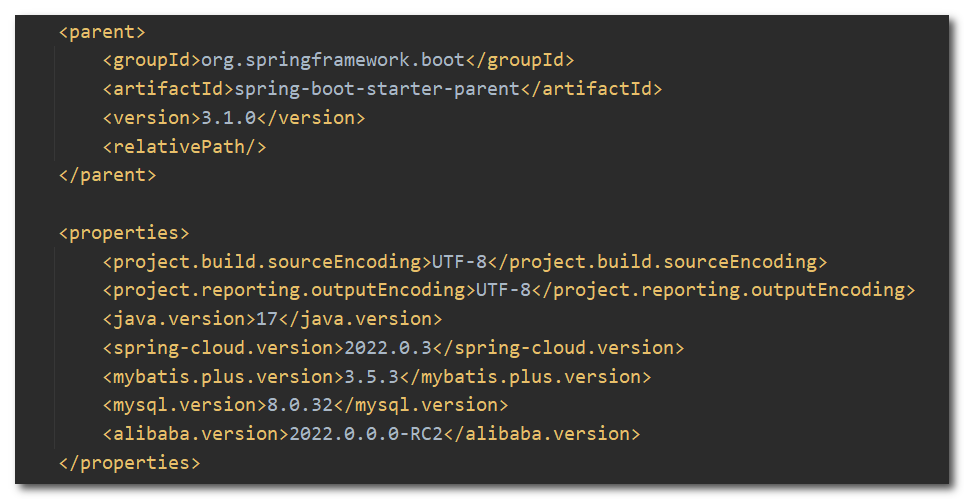
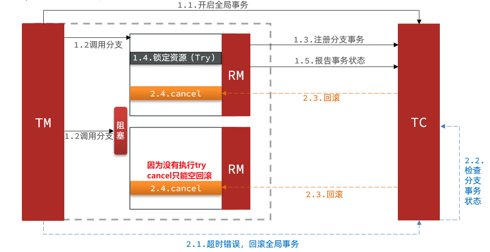
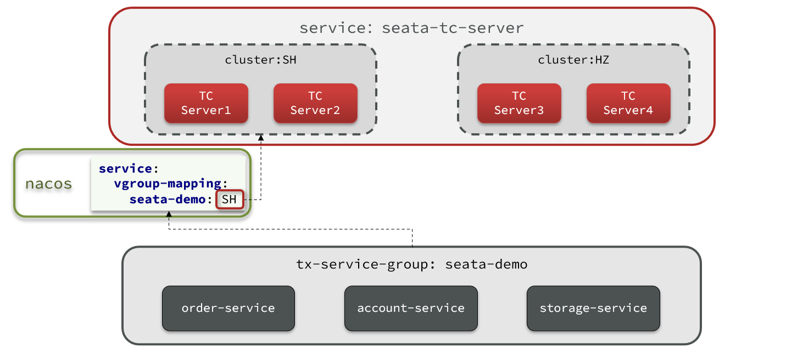
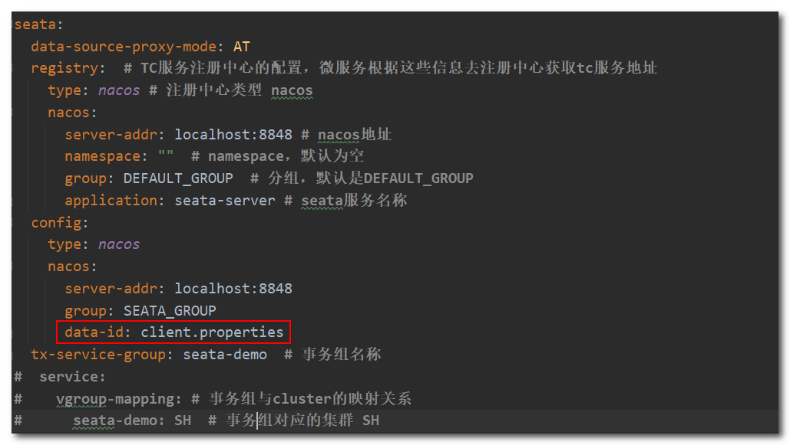

# Seata

## 1. 分布式事务

**分布式事务**，就是指不是在单个服务或单个数据库架构下，产生的事务。

在数据库水平拆分、服务垂直拆分之后，一个业务操作通常要跨多个数据库、服务才能完成。

例如电商行业中比较常见的下单付款案例，包括下面几个行为：

- 创建新订单
- 扣减商品库存
- 从用户账户余额扣除金额

完成上面的操作需要访问三个不同的微服务和三个不同的数据库：


订单的创建、库存的扣减、账户扣款在每一个服务和数据库内是一个本地事务，可以保证ACID原则。

但是当我们把三件事情看做一个"业务"，要满足保证“业务”的原子性，要么所有操作全部成功，要么全部失败，不允许出现部分成功部分失败的现象，这就是分布式系统下的事务了。此时ACID难以满足，这是分布式事务要解决的问题。


### 1.1 演示分布式事务的问题

(1) 导入资料提供的seata-server项目：


(2) 导入sql文件创建对应的数据库表：


项目结构如下：


父工程版本信息如下：



seata-demo：父工程，负责管理项目依赖

- account-service：账户服务，负责管理用户的资金账户。提供扣减余额的接口
- storage-service：库存服务，负责管理商品库存。提供扣减库存的接口
- order-service：订单服务，负责管理订单。创建订单时，需要调用account-service和storage-service

(3) 启动nacos、所有微服务，测试下单功能，使用Apifox工具发出Post请求：

```
http://localhost:8082/order?userId=user202103032042012&commodityCode=100202003032041&count=20&money=200
```


测试发现，当库存不足时，如果余额已经扣减，并不会回滚，出现了分布式事务问题。


### 1.2 CAP定理

分布式系统有三个指标：

- **Consistency（一致性）**：用户访问分布式系统中的任意节点，得到的数据必须一致。
- **Availability（可用性）**：用户访问集群中的任意健康节点，必须能得到响应，而不是超时或拒绝。
- **Partition tolerance （分区容错性）**
  - Partition（分区）：因为网络故障或其它原因导致分布式系统中的部分节点与其它节点失去连接，形成独立分区。
  - Tolerance（容错）：在集群出现分区时，整个系统也要持续对外提供服务


在分布式系统中，系统间的网络不能100%保证健康，一定会有故障的时候，而服务有必须对外保证服务。因此Partition Tolerance不可避免。当节点接收到新的数据变更时，就会出现问题了：

如果此时要保证**一致性**，就必须等待网络恢复，完成数据同步后，整个集群才对外提供服务，服务处于阻塞状态，不可用。

如果此时要保证**可用性**，就不能等待网络恢复，那node01、node02与node03之间就会出现数据不一致。


也就是说，在P一定会出现的情况下，A和C之间只能实现一个。


### 1.3 BASE理论

BASE理论是对CAP的一种解决思路，包含三个思想：

- **Basically Available** **（基本可用）**：分布式系统在出现故障时，允许损失部分可用性，即保证核心可用。
- **Soft State（软状态）：**在一定时间内，允许出现中间状态，比如临时的不一致状态。
- **Eventually Consistent（最终一致性）**：虽然无法保证强一致性，但是在软状态结束后，最终达到数据一致。


**解决分布式事务的思路**

分布式事务最大的问题是各个子事务的一致性问题，因此可以借鉴CAP定理和BASE理论，有两种解决思路：

- AP模式：各子事务分别执行和提交，允许出现结果不一致，然后采用弥补措施恢复数据即可，实现最终一致。

- CP模式：各个子事务执行后互相等待，同时提交，同时回滚，达成强一致。但事务等待过程中，处于弱可用状态。

不管是哪一种模式，都需要在子系统事务之间互相通讯，协调事务状态，也就是需要一个**事务协调者(TC)**：


这里的子系统事务，称为**分支事务**；有关联的各个分支事务在一起称为**全局事务**。


## 2. 初识Seata

Seata是 开源的分布式事务解决方案。致力于提供高性能和简单易用的分布式事务服务，为用户打造一站式的分布式解决方案。

官网地址：http://seata.io/

Seata事务管理中有三个重要的角色：

- **TC (Transaction Coordinator) -** **事务协调者：**维护全局和分支事务的状态，协调全局事务提交或回滚。

- **TM (Transaction Manager) -** **事务管理器：**定义全局事务的范围、开始全局事务、提交或回滚全局事务。

- **RM (Resource Manager) -** **资源管理器：**管理分支事务处理的资源，与TC交谈以注册分支事务和报告分支事务的状态，并驱动分支事务提交或回滚。

整体的架构如图：


Seata基于上述架构提供了四种不同的分布式事务解决方案：

- XA模式：强一致性分阶段事务模式，牺牲了一定的可用性，无业务侵入
- TCC模式：最终一致的分阶段事务模式，有业务侵入
- AT模式：最终一致的分阶段事务模式，无业务侵入，也是Seata的默认模式
- SAGA模式：长事务模式，有业务侵入

无论哪种方案，都离不开TC，也就是事务的协调者。


## 3. 部署Seata服务

部署Seata-server，也就是Seata的TC服务。

**(1) 下载**

首先我们要下载seata-server包，地址在[http](http://seata.io/zh-cn/blog/download.html)[://seata.io/zh-cn/blog/download](http://seata.io/zh-cn/blog/download.html)[.](http://seata.io/zh-cn/blog/download.html)[html](http://seata.io/zh-cn/blog/download.html) ，资料中已经准备好了。


**(2) 修改配置**

解压后进入conf目录，修改registry.conf文件，内容如下：

```properties
registry {
  # TC服务的注册中心类，这里选择nacos，也可以是eureka、zookeeper等
  type = "nacos"

  nacos {
    # seata tc 服务注册到 nacos的服务名称，可以自定义
    application = "seata-server"
    serverAddr = "127.0.0.1:8848"
    group = "DEFAULT_GROUP"
    namespace = ""
    cluster = "SH"
  }
}

config {
  # 读取TC服务端的配置文件的方式，这里是从nacos配置中心读取，这样如果TC是集群，可以共享配置
  type = "nacos"
  # 配置nacos地址等信息
  nacos {
    serverAddr = "127.0.0.1:8848"
    namespace = ""
    group = "SEATA_GROUP"
    dataId = "seataServer.properties"
  }
}
```

**(3) 在nacos添加配置**

为了让TC服务的集群可以共享配置，选择nacos作为统一配置中心。因此服务端配置文件seataServer.properties需要在nacos中配好。


```properties
# 数据存储方式，db代表数据库
store.mode=db
store.db.datasource=druid
store.db.dbType=mysql
store.db.driverClassName=com.mysql.cj.jdbc.Driver
store.db.url=jdbc:mysql://127.0.0.1:3306/seata?useUnicode=true&rewriteBatchedStatements=true&serverTimezone=UTC
store.db.user=root
store.db.password=123456
store.db.minConn=5
store.db.maxConn=30
store.db.globalTable=global_table
store.db.branchTable=branch_table
store.db.queryLimit=100
store.db.lockTable=lock_table
store.db.maxWait=5000
# 事务、日志等配置
server.recovery.committingRetryPeriod=1000
server.recovery.asynCommittingRetryPeriod=1000
server.recovery.rollbackingRetryPeriod=1000
server.recovery.timeoutRetryPeriod=1000
server.maxCommitRetryTimeout=-1
server.maxRollbackRetryTimeout=-1
server.rollbackRetryTimeoutUnlockEnable=false
server.undo.logSaveDays=7
server.undo.logDeletePeriod=86400000

# 客户端与服务端传输方式
transport.serialization=seata
transport.compressor=none
# 关闭metrics功能，提高性能
metrics.enabled=false
metrics.registryType=compact
metrics.exporterList=prometheus
metrics.exporterPrometheusPort=9898
```

其中的数据库地址、用户名、密码都需要修改成你自己的数据库信息。

**(4) 创建数据库表**

新建一个名为seata的数据库，运行资料提供的sql文件：


**(5) 启动TC服务**

进入bin目录，双击seata-server.bat即可启动。启动成功后，seata-server已经注册到nacos注册中心。


## 4. 微服务集成Seata

以order-service为例来演示。

**(1) 引入依赖**

首先，在order-service中引入依赖：

```xml
<dependency>
    <groupId>com.alibaba.cloud</groupId>
    <artifactId>spring-cloud-starter-alibaba-seata</artifactId>
</dependency>
```

**(2) 配置Seata地址**

```yml
seata:
  registry:  # TC服务注册中心的配置，微服务根据这些信息去注册中心获取TC服务地址
    type: nacos # 注册中心类型 nacos
    nacos:
      server-addr: localhost:8848 # nacos地址
      namespace: ""  # namespace，默认为空
      group: DEFAULT_GROUP  # 分组，默认是DEFAULT_GROUP
      application: seata-server # seata服务名称
  tx-service-group: seata-demo  # 事务组名称
  service:
    vgroup-mapping: # 事务组与cluster的映射关系
      seata-demo: SH  # 事务组对应的集群 SH
```

我们知道注册到Nacos中的微服务，确定一个具体实例需要四个信息：

- namespace：命名空间
- group：分组
- application：服务名
- cluster：集群名


namespace为空，就是默认的public，结合起来，TC服务的信息就是：public@DEFAULT_GROUP@seata-tc-server@SH，这样就能确定TC服务集群了。然后就可以去Nacos拉取对应的实例信息了。其它两个微服务也都参考order-service的步骤来做，完全一样。

**(3) 配置事务解决方案**

### 4.1 XA模式

XA 规范 是分布式事务处理（DTP，Distributed Transaction Processing）标准，XA 规范 描述了全局的TM与局部的RM之间的接口，几乎所有主流的数据库都对 XA 规范 提供了支持。目前主流数据库都实现了这种规范，实现的原理都是基于两阶段提交。

一阶段：

- 事务协调者通知每个事物参与者执行本地事务
- 本地事务执行完成后报告事务执行状态给事务协调者，此时事务不提交，继续持有数据库锁

二阶段：

- 事务协调者基于一阶段的报告来判断下一步操作
  - 如果一阶段都成功，则通知所有事务参与者，提交事务
  - 如果一阶段任意一个参与者失败，则通知所有事务参与者回滚事务

正常情况：


异常情况：


**Seata的XA模型**

Seata对原始的XA模式做了简单的封装和改造，以适应自己的事务模型，基本架构如图：


RM一阶段的工作：

​	① 注册分支事务到TC

​	② 执行分支业务sql但不提交

​	③ 报告执行状态到TC

TC二阶段的工作：

- TC检测各分支事务执行状态

  a.如果都成功，通知所有RM提交事务

  b.如果有失败，通知所有RM回滚事务

RM二阶段的工作：

- 接收TC指令，提交或回滚事务


**实现XA模式**

Seata的starter已经完成了XA模式的自动装配，实现非常简单，步骤如下：

(1) 修改application.yml文件（每个参与事务的微服务），开启XA模式：

```yml
seata:
  data-source-proxy-mode: XA
```

(2) 给发起全局事务的入口方法添加 `@GlobalTransactional` 注解：

本例中是OrderServiceImpl中的create方法


(3) 重启服务并测试

重启微服务，使用Apifox工具发送请求再次测试，在库存不足的情况下，扣款成功后会进行回滚。

```
http://localhost:8082/order?userId=user202103032042012&commodityCode=100202003032041&count=20&money=200
```


**XA模式优缺点**

优点：

- 事务的强一致性，满足ACID原则。
- 常用数据库都支持，实现简单，并且没有代码侵入

缺点是：

- 因为一阶段需要锁定数据库资源，等待二阶段结束才释放，性能较差
- 依赖关系型数据库实现事务


### 4.2 AT模式

AT模式同样是分阶段提交的事务模型，不过缺弥补了XA模型中资源锁定周期过长的缺陷。

**Seata的AT模型**


阶段一RM的工作：

- 注册分支事务
- 记录undo-log（数据快照）
- 执行业务sql并提交
- 报告事务状态

阶段二提交时RM的工作：

- 删除undo-log即可

阶段二回滚时RM的工作：

- 根据undo-log恢复数据到更新前


**流程分析**

用一个真实的业务来梳理下AT模式的原理。

比如，现在又一个数据库表，记录用户余额：

| **id** | **money** |
| ------ | --------- |
| 1      | 100       |

其中一个分支业务要执行的SQL为：

```sql
update tb_account set money = money - 10 where id = 1
```

AT模式下，当前分支事务执行流程如下：

一阶段：

1）TM发起并注册全局事务到TC

2）TM调用分支事务

3）分支事务准备执行业务SQL

4）RM拦截业务SQL，根据where条件查询原始数据，形成快照。

```json
{
    "id": 1, "money": 100
}
```

5）RM执行业务SQL，提交本地事务，释放数据库锁。此时 `money = 90`

6）RM报告本地事务状态给TC

二阶段：

1）TM通知TC事务结束

2）TC检查分支事务状态

①如果都成功，则立即删除快照

②如果有分支事务失败，需要回滚。读取快照数据（`{"id": 1, "money": 100}`），将快照恢复到数据库。此时数据库再次恢复为100


**脏写问题**

在多线程并发访问AT模式的分布式事务时，有可能出现脏写问题，如图：


解决思路就是引入了全局锁的概念。在释放DB锁之前，先拿到全局锁。避免同一时刻有另外一个事务来操作当前数据。


**实现AT模式**

AT模式中的快照生成、回滚等动作都是由框架自动完成，没有任何代码侵入，因此实现非常简单。

只不过，AT模式需要一个表来记录全局锁、另一张表来记录数据快照undo_log。

1）导入数据库表，记录全局锁

导入课前资料提供的Sql文件，其中lock_table导入到TC服务关联的数据库，undo_log导入到微服务关联的数据库：


2）修改微服务的application.yml文件，将事务模式修改为AT模式即可：

```yaml
seata:
  data-source-proxy-mode: AT # 默认就是AT
```

3）重启服务并测试


**AT模式优缺点**

AT模式的优点：

- 一阶段完成直接提交事务，释放数据库资源，性能比较好
- 利用全局锁实现读写隔离
- 没有代码侵入，框架自动完成回滚和提交

AT模式的缺点：

- 两阶段之间属于软状态，属于最终一致
- 框架的快照功能会影响性能，但比XA模式要好很多


**AT与XA的区别**

- XA模式一阶段不提交事务，锁定资源；AT模式一阶段直接提交，不锁定资源。
- XA模式依赖数据库机制实现回滚；AT模式利用数据快照实现数据回滚。
- XA模式强一致；AT模式最终一致


### 4.3 TCC模式

TCC模式与AT模式非常相似，每阶段都是独立事务，不同的是TCC通过人工编码来实现数据恢复。需要实现三个方法：

- Try：资源的检测和预留； 

- Confirm：完成资源操作业务；要求 Try 成功 Confirm 一定要能成功。

- Cancel：预留资源释放，可以理解为try的反向操作。

**Seata的TCC模型**


**流程分析**

举例，一个扣减用户余额的业务。假设账户A原来余额是100，需要余额扣减30元。

(1) 阶段一（ Try ）：检查余额是否充足，如果充足则冻结金额增加30元，可用余额扣除30

初始余额：


余额充足，可以冻结：


此时，总金额 = 冻结金额 + 可用金额，数量依然是100不变。事务直接提交无需等待其它事务。

(2) 阶段二：

- 假如要提交（Confirm），则清除冻结金额：


- 如果要回滚（Cancel），则释放冻结金额，恢复可用金额：


**空回滚和事务悬挂**

(1) 空回滚

当某分支事务的try阶段阻塞时，可能导致全局事务超时而触发二阶段的cancel操作。在未执行try操作时先执行了cancel操作，这时cancel不能做回滚，就是空回滚。执行cancel操作时，应当判断try是否已经执行，如果尚未执行，则应该空回滚。



(2) 事务悬挂

对于已经空回滚的业务，之前被阻塞的try操作恢复，继续执行try，就永远不可能confirm或cancel ，事务一直处于中间状态，这就是业务悬挂。执行try操作时，应当判断cancel是否已经执行过了，如果已经执行，应当阻止空回滚后的try操作，避免悬挂。


**实现TCC模式**

(1) 创建资源预留记录表

在微服务的数据库中创建资源预留记录表，资料中已经提供好了


```sql
DROP TABLE IF EXISTS `account_freeze_tbl`;
CREATE TABLE `account_freeze_tbl`  (
  `xid` varchar(128) CHARACTER SET utf8 COLLATE utf8_general_ci NOT NULL,
  `user_id` varchar(255) CHARACTER SET utf8 COLLATE utf8_general_ci NULL DEFAULT NULL,
  `freeze_money` int(11) UNSIGNED NULL DEFAULT 0,
  `state` int(1) NULL DEFAULT NULL COMMENT '事务状态，0:try，1:confirm，2:cancel',
  PRIMARY KEY (`xid`) USING BTREE
) ENGINE = InnoDB CHARACTER SET = utf8 COLLATE = utf8_general_ci ROW_FORMAT = COMPACT;
```

- xid：是全局事务id
- freeze_money：用来记录用户冻结金额
- state：用来记录事务状态

(2) 业务分析

- Try业务：
  - 记录冻结金额和事务状态到account_freeze表
  - 扣减account表可用金额
- Confirm业务
  - 根据xid删除account_freeze表的冻结记录
- Cancel业务
  - 修改account_freeze表，冻结金额为0，state为2
  - 修改account表，恢复可用金额
- 如何判断是否空回滚？
  - cancel业务中，根据xid查询account_freeze，如果为null则说明try还没做，需要空回滚
- 如何避免业务悬挂？
  - try业务中，根据xid查询account_freeze ，如果已经存在则证明Cancel已经执行，拒绝执行try业务


(3) 声明TCC接口

接下来，改造微服务account-service，利用TCC实现余额扣减功能。TCC的Try、Confirm、Cancel方法都需要在接口中基于注解来声明。

在`cn.itcast.account.service`包中新建一个接口，声明TCC三个方法，该接口需要使用 `@LocalTCC` 注解标识：

```Java
@LocalTCC
public interface AccountTCCService {

    @TwoPhaseBusinessAction(name = "deduct", commitMethod = "confirm", rollbackMethod = "cancel")
    void deduct(@BusinessActionContextParameter(paramName = "userId") String userId,
                @BusinessActionContextParameter(paramName = "money")int money);

    boolean confirm(BusinessActionContext ctx);

    boolean cancel(BusinessActionContext ctx);
}
```

- 使用 `@TwoPhaseBusinessAction` 注解标识的方法就是Try方法，在该注解中还需要声明Confirm、Cancel方法的名字。

- 使用 `@BusinessActionContextParameter` 注解标识的参数会保存到上下文对象中，可以通过 `BusinessActionContext` 获取。


(4) 编写实现类

在account-service服务中的`cn.itcast.account.service.impl`包下新建一个类，实现TCC业务：

```Java
@Service
@Slf4j
public class AccountTCCServiceImpl implements AccountTCCService {

    @Autowired
    private AccountMapper accountMapper;
    @Autowired
    private AccountFreezeMapper freezeMapper;

    @Override
    @Transactional
    public void deduct(String userId, int money) {
        // 1.获取事务id
        String xid = RootContext.getXID();
        // 2.业务悬挂判断：判断freeze中是否有冻结记录，如果有，一定是cancel执行过(confirm执行后会删除记录)，则不执行业务
        AccountFreeze oldFreeze = freezeMapper.selectById(xid);
        if (oldFreeze != null) {
            return;
        }
        // 3.扣减可用余额
        accountMapper.deduct(userId, money);
        // 4.记录冻结金额，事务状态
        AccountFreeze freeze = new AccountFreeze();
        freeze.setUserId(userId);
        freeze.setFreezeMoney(money);
        freeze.setState(AccountFreeze.State.TRY);
        freeze.setXid(xid);
        freezeMapper.insert(freeze);
    }

    @Override
    public boolean confirm(BusinessActionContext ctx) {
        // 1.获取事务id
        String xid = ctx.getXid();
        // 2.根据id删除冻结记录
        int count = freezeMapper.deleteById(xid);
        return count == 1;
    }

    @Override
    public boolean cancel(BusinessActionContext ctx) {
        // 1.查询冻结记录
        String xid = ctx.getXid();
        String userId = ctx.getActionContext("userId").toString();
        AccountFreeze freeze = freezeMapper.selectById(xid);
        // 2.空回滚判断，判断freeze是否为null，如果是，说明Try方法没有执行(如果Try执行了且没有记录说明执行了Confirm方法)，需要空回滚
        if (freeze == null) {
            freeze = new AccountFreeze();
            freeze.setUserId(userId);
            freeze.setFreezeMoney(0); // 冻结金额置零，因为没执行Try方法，冻结金额本来就是0
            freeze.setState(AccountFreeze.State.TRY);
            freeze.setXid(xid);
            freezeMapper.insert(freeze);
            return true;
        }
        // 3.幂等判断：只要Cancel方法执行了，状态一定会变成CANCEL
        if (freeze.getState() == AccountFreeze.State.CANCEL) {
            // 已经执行过Cancel方法，无需重复处理
            return true;
        }
        // 4.恢复可用余额
        accountMapper.refund(freeze.getUserId(), freeze.getFreezeMoney());
        // 5.将冻结金额清零，状态改为CANCEL
        freeze.setFreezeMoney(0);
        freeze.setState(AccountFreeze.State.CANCEL);
        int count = freezeMapper.updateById(freeze);
        return count == 1;
    }
}
```


(4) 测试

将 AccountController 中的调用的接口改为 AccountTCCService ：


重启微服务测试库存不足的情况下回滚效果：


**TCC模式优缺点**

TCC的优点：

- 一阶段完成直接提交事务，释放数据库资源，性能好
- 相比AT模型，无需生成快照，无需使用全局锁，性能最强
- 不依赖数据库事务，而是依赖补偿操作，可以用于非事务型数据库

TCC的缺点：

- 有代码侵入，需要人为编写try、Confirm和Cancel接口，太麻烦
- 软状态，事务是最终一致
- 需要考虑Confirm和Cancel的失败情况，做好幂等处理

> 所谓的幂等性，是分布式环境下的一个常见问题，一般是指在进行多次操作时，所得到的结果是一样的，即多次运算结果是一致的。
>
> 也就是说，用户对于同一操作，无论是发起一次请求还是多次请求，最终的执行结果是一致的，不会因为多次点击而产生副作用。


### 4.4 SAGA模式

 **Saga 模式原理**

在 Saga 模式下，分布式事务内有多个参与者，每一个参与者都是一个冲正补偿服务，需要用户根据业务场景实现其正向操作和逆向回滚操作。

分布式事务执行过程中，依次执行各参与者的正向操作，如果所有正向操作均执行成功，那么分布式事务提交。如果任何一个正向操作执行失败，那么分布式事务会去退回去执行前面各参与者的逆向回滚操作，回滚已提交的参与者，使分布式事务回到初始状态。


Saga也分为两个阶段：

- 一阶段：直接提交本地事务
- 二阶段：成功则什么都不做；失败则通过编写补偿业务来回滚


**Saga模式优缺点**

优点：

- 事务参与者可以基于事件驱动实现异步调用，吞吐高
- 一阶段直接提交事务，无锁，性能好
- 不用编写TCC中的三个阶段，实现简单

缺点：

- 软状态持续时间不确定，时效性差
- 没有锁，没有事务隔离，会有脏写


#### 四种模式对比


## 5. TC服务集群

搭建TC服务集群非常简单，启动多个TC服务，注册到nacos即可。

但集群并不能确保100%安全，万一集群所在机房故障怎么办？所以如果要求较高，一般都会做异地多机房容灾。

比如一个TC集群在上海，另一个TC集群在杭州：



微服务基于事务组（tx-service-group)与TC集群的映射关系，来查找当前应该使用哪个TC集群。当SH集群故障时，只需要将vgroup-mapping中的映射关系改成HZ。则所有微服务就会切换到HZ的TC集群了。


### (1) 搭建异地容灾的TC集群

计划启动两台seata的tc服务节点（性能有限，这里一个集群只设置一个节点）：

| 节点名称 | ip地址    | 端口号 | 集群名称 |
| -------- | --------- | ------ | -------- |
| seata    | 127.0.0.1 | 8091   | SH       |
| seata2   | 127.0.0.1 | 8092   | HZ       |

之前我们已经启动了一台seata服务，端口是8091，集群名为SH。现在，将seata目录复制一份，起名为seata2。


修改seata2/conf/registry.conf内容如下：

```properties
registry {
  type = "nacos"
  nacos {
    application = "seata-server"
    serverAddr = "127.0.0.1:8848"
    group = "DEFAULT_GROUP"
    namespace = ""
    cluster = "HZ"
    username = "nacos"
    password = "nacos"
  }
}

config {
  type = "nacos"
  nacos {
    serverAddr = "127.0.0.1:8848"
    namespace = ""
    group = "SEATA_GROUP"
    username = "nacos"
    password = "nacos"
    dataId = "seataServer.properties"
  }
}
```

进入seata2/bin目录，打开命令行窗口然后运行命令：

```powershell
seata-server.bat -p 8092
```

打开nacos控制台，查看服务列表：


点进详情查看：


### (2) 将事务组映射配置到nacos

将tx-service-group与cluster的映射关系都配置到nacos配置中心。


配置内容如下：

```properties
# 事务组映射关系
service.vgroupMapping.seata-demo=SH

service.enableDegrade=false
service.disableGlobalTransaction=false
# 与TC服务的通信配置
transport.type=TCP
transport.server=NIO
transport.heartbeat=true
transport.enableClientBatchSendRequest=false
transport.threadFactory.bossThreadPrefix=NettyBoss
transport.threadFactory.workerThreadPrefix=NettyServerNIOWorker
transport.threadFactory.serverExecutorThreadPrefix=NettyServerBizHandler
transport.threadFactory.shareBossWorker=false
transport.threadFactory.clientSelectorThreadPrefix=NettyClientSelector
transport.threadFactory.clientSelectorThreadSize=1
transport.threadFactory.clientWorkerThreadPrefix=NettyClientWorkerThread
transport.threadFactory.bossThreadSize=1
transport.threadFactory.workerThreadSize=default
transport.shutdown.wait=3
# RM配置
client.rm.asyncCommitBufferLimit=10000
client.rm.lock.retryInterval=10
client.rm.lock.retryTimes=30
client.rm.lock.retryPolicyBranchRollbackOnConflict=true
client.rm.reportRetryCount=5
client.rm.tableMetaCheckEnable=false
client.rm.tableMetaCheckerInterval=60000
client.rm.sqlParserType=druid
client.rm.reportSuccessEnable=false
client.rm.sagaBranchRegisterEnable=false
# TM配置
client.tm.commitRetryCount=5
client.tm.rollbackRetryCount=5
client.tm.defaultGlobalTransactionTimeout=60000
client.tm.degradeCheck=false
client.tm.degradeCheckAllowTimes=10
client.tm.degradeCheckPeriod=2000

# undo日志配置
client.undo.dataValidation=true
client.undo.logSerialization=jackson
client.undo.onlyCareUpdateColumns=true
client.undo.logTable=undo_log
client.undo.compress.enable=true
client.undo.compress.type=zip
client.undo.compress.threshold=64k
client.log.exceptionRate=100
```


### (3) 微服务读取nacos配置

修改每一个微服务的application.yml文件，添加config配置，让微服务读取nacos中的client.properties文件：

```yaml
seata:
  config:
    type: nacos
    nacos:
      server-addr: localhost:8848
      group: SEATA_GROUP
      data-id: client.properties
```



重启微服务，现在微服务连接的集群都统一由nacos的client.properties来决定了。

修改nacos中的client.properties可以实现热更新，这样修改集群配置信息就不需要再重启微服务了。


### (4) 测试TC集群容灾

修改nacos配置列表中client.properties的配置，将集群更改为HZ，即seata2所在的集群


查看结果，可以看到微服务全部注册到HZ集群的8091节点的TC服务上，这样就实现了集群容灾的效果，：


