# **微服务**


# 1. 初识微服务

微服务是一种软件开发架构风格，旨在构建应用程序作为一组小型、独立的服务。每个微服务都运行在自己独立的进程中，通过轻量级的通信机制（通常是基于HTTP的API）进行相互之间的通信。每个微服务都专注于执行特定的业务功能，并且可以独立地进行开发、部署、扩展和管理。

## 1.1 微服务的优点

微服务架构的核心理念是将一个复杂的应用程序拆分成多个更小、更易于管理的部分，每个部分都有自己的职责和功能。这种拆分的好处包括：

1. **松耦合性**：微服务之间通过定义明确定义的接口进行通信，彼此之间可以独立开发、部署和扩展。这使得团队可以并行工作，并且一个微服务的变更不会对其他微服务产生影响。
2. **可独立扩展**：由于每个微服务都是独立的，可以根据需要独立地进行扩展。这意味着可以根据负载的需求，只对需要处理更高负载的服务进行扩展，而无需对整个应用程序进行扩展。
3. **技术多样性**：微服务架构允许使用不同的技术栈和编程语言来实现不同的微服务。这使得团队可以选择最适合特定任务的工具和技术，而无需整个应用程序都使用相同的技术栈。
4. **容错性**：由于每个微服务都是独立的，一个微服务的故障不会影响整个应用程序的运行。系统可以通过合理的设计和故障处理机制来处理单个微服务的故障。


## 1.2 微服务架构特点

微服务架构具有以下几个主要特点：

1. **服务拆分**：应用程序被拆分成一组小型、独立的服务。每个服务专注于单一的业务功能，具有明确的边界和责任。这种拆分使得开发人员可以更加关注每个服务的实现和维护，而不需要考虑整个应用程序的复杂性。
2. **独立部署**：每个微服务都可以独立地进行开发、测试、部署和扩展。这意味着对于需要变更或升级的特定服务，可以更快地进行部署，而不需要影响整个应用程序。独立部署也提供了更高的灵活性和快速迭代的能力。
3. **分布式通信**：微服务之间通过轻量级的通信机制进行交互，通常使用HTTP/REST、消息队列或RPC等方式。这种通信方式使得服务之间的耦合度较低，并且可以选择最适合特定需求的通信协议和技术。分布式通信是微服务架构中的一个关键方面，也是保持服务自治性的基础。
4. **自治性**：每个微服务都是独立的，具有自己的数据库和业务逻辑。它们可以独立地进行管理和维护，甚至使用不同的技术栈和工具。这种自治性使得团队可以根据服务的特点和需求进行自主决策，提高开发效率和灵活性。
5. **弹性和容错性**：微服务架构具有弹性和容错性，即使一个服务出现故障或异常，整个系统仍然可以继续运行。由于每个服务都是独立的，故障不会影响其他服务的正常运行。此外，通过使用负载均衡和故障恢复机制，系统可以更好地应对高负载和故障情况。
6. **可伸缩性**：由于每个微服务都是独立的，可以根据需要独立地进行扩展。这使得系统可以根据负载需求进行水平扩展，只扩展需要处理更高负载的服务。这种可伸缩性使得微服务架构适合应对大规模和高流量的应用程序。
7. **团队自治**：微服务架构鼓励团队自治和分布式责任。每个团队可以独立负责一个或多个微服务的开发、测试、部署和运维。这种分布式责任和自治性促进了团队间的并行工作和快速创新，提高了开发效率和灵活性。

微服务架构示意图：


## 1.3 Spring Cloud

Spring Cloud是一个用于构建分布式系统的开源框架，它基于Spring框架提供了一套丰富的工具和组件，用于简化分布式系统的开发和部署。它为开发人员提供了一种简单、灵活和可扩展的方式来构建和管理微服务架构。

Spring Cloud的主要特点和功能包括：

1. **服务注册与发现**：Spring Cloud通过集成服务注册与发现组件（如Netflix Eureka、Consul等）实现了服务的自动注册和发现。这使得微服务之间的通信更加简单，服务可以动态地注册和发现其他服务。

2. **负载均衡**：Spring Cloud支持集成负载均衡器（如Netflix Ribbon），可以在多个实例之间分配请求负载，提高系统的可伸缩性和性能。

3. **断路器模式**：Spring Cloud集成了断路器模式（如Netflix Hystrix），可以实现服务的容错和故障处理。当某个服务不可用时，断路器可以提供降级策略，避免级联故障。

4. **分布式配置管理**：Spring Cloud提供了分布式配置管理工具（如Spring Cloud Config），可以集中管理和动态更新应用程序的配置信息，使得配置的修改和发布更加方便和可控。

5. **消息总线**：Spring Cloud支持消息总线（如Spring Cloud Bus），可以简化配置的更新和刷新。通过消息总线，可以实现对所有微服务的配置变更的批量刷新，而不需要逐个重启服务。

6. **服务网关**：Spring Cloud集成了服务网关（如Netflix Zuul、Spring Cloud Gateway），用于提供对外的统一访问接口和路由功能。服务网关可以进行请求路由、负载均衡、安全认证和限流等操作。

7. **分布式追踪**：Spring Cloud集成了分布式追踪工具（如Spring Cloud Sleuth、Zipkin），用于跟踪和监控微服务之间的请求链路，帮助定位和解决系统中的性能问题和故障。

通过以上的功能和组件，Spring Cloud提供了一整套解决方案，用于构建和管理复杂的分布式系统。它提供了丰富的工具和技术，简化了微服务架构的开发、部署和运维过程，使开发人员能够更加专注于业务逻辑的实现，提高了系统的可靠性、可伸缩性和灵活性。

常见的组件：


SpringCloud与SpringBoot的版本兼容关系如下：

| SpringCloud版本 |                SpringBoot版本                 |
| :-------------: | :-------------------------------------------: |
|   Hoxton.SR12   | Spring Boot>=2.2.0.RELEASE and <2.4.0.RELEASE |
|    2020.0.6     |    Spring Boot >=2.4.0.RELEASE and <2.6.0     |
|    2021.0.7     |        Spring Boot >=2.6.0 and <3.0.0         |
|    2022.0.3     |       Spring Boot >=3.0.0 and <3.2.0-M1       |


## 1.4 创建微服务项目

(1) 创建一个maven项目（该项目生成的src目录可以删除）代表父工程，用于管理依赖。

```xml
    <!-- 自定义版本信息 -->
	<properties>
        <maven.compiler.source>17</maven.compiler.source>
        <maven.compiler.target>17</maven.compiler.target>
        <project.build.sourceEncoding>UTF-8</project.build.sourceEncoding>
        <project.reporting.outputEncoding>UTF-8</project.reporting.outputEncoding>
        <spring-cloud.version>2022.0.3</spring-cloud.version>
        <spring-boot.version>3.1.0</spring-boot.version>
        <spring-cloud-ailibaba.version>2022.0.0.0-RC2</spring-cloud-ailibaba.version>
        <mybatis-stater.version>3.0.0</mybatis-stater.version>
    </properties>

	<!-- 传递给子工程的依赖 -->
    <dependencyManagement>
        <dependencies>
            <!-- springCloud相关依赖 -->
            <dependency>
                <groupId>org.springframework.cloud</groupId>
                <artifactId>spring-cloud-dependencies</artifactId>
                <version>${spring-cloud.version}</version>
                <type>pom</type>
                <scope>import</scope>
            </dependency>
            <!-- SpringBoot相关依赖 -->
            <dependency>
                <groupId>org.springframework.boot</groupId>
                <artifactId>spring-boot-dependencies</artifactId>
                <version>${spring-boot.version}</version>
                <type>pom</type>
                <scope>import</scope>
            </dependency>
            <!-- SpringCloud alibaba相关依赖 -->
            <dependency>
                <groupId>com.alibaba.cloud</groupId>
                <artifactId>spring-cloud-alibaba-dependencies</artifactId>
                <version>${spring-cloud-ailibaba.version}</version>
                <type>pom</type>
                <scope>import</scope>
            </dependency>
            <!-- mybatis相关依赖 -->
            <dependency>
                <groupId>org.mybatis.spring.boot</groupId>
                <artifactId>mybatis-spring-boot-starter</artifactId>
                <version>${mybatis-stater.version}</version>
            </dependency>
        </dependencies>
    </dependencyManagement>
```

(2) 在父工程中创建两个SpringBoot项目，并且导入父工程：

```xml
	<!-- 导入父工程 -->
    <parent>
        <groupId>org.example</groupId>
        <artifactId>cloud-demo</artifactId>
        <version>1.0-SNAPSHOT</version>
        <relativePath/>
    </parent>
```

- order-service：订单微服务，负责订单相关业务
- user-service：用户微服务，负责用户相关业务

这样一个微服务架构就搭建出来了，如下所示：

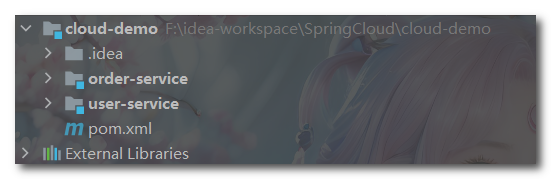

要求：

- 订单微服务和用户微服务都必须有各自的数据库，相互独立
- 订单服务和用户服务都对外暴露Restful的接口
- 订单服务如果需要查询用户信息，只能调用用户服务的Restful接口，不能查询用户数据库。


## 1.5 远程调用

修改order-service中的根据id查询订单业务，要求在查询订单的同时，根据订单中包含的userId查询出用户信息，一起返回。

而之前提到过微服务之间都是相互独立的，那么在订单服务中如果查询用户的信息呢？


RestTemplate是Spring框架提供的用于进行RESTful风格的HTTP请求的客户端工具。它封装了常见的HTTP操作，如GET、POST、PUT、DELETE等，并提供了方便的方法来处理请求和响应。

RestTemplate具有以下特点和功能：

1. **简化的API**：RestTemplate提供了简洁而直观的API，使得进行HTTP请求变得非常容易。它使用类似于Spring的模板方法设计模式，通过提供各种方法来执行不同类型的HTTP请求，例如getForObject()、postForObject()等。
2. **支持多种HTTP方法**：RestTemplate支持常见的HTTP方法，包括GET、POST、PUT、DELETE等。开发人员可以根据实际需求选择适当的HTTP方法来与远程服务进行通信。
3. **URI和参数处理**：RestTemplate可以接受URI和参数，并将其转换为完整的URL。开发人员可以使用占位符和参数映射来构建动态的URL，并将参数传递给请求。这样可以轻松地构建具有动态部分的URL。
4. **请求和响应处理**：RestTemplate提供了各种方法来处理请求和响应的内容。它支持将请求和响应转换为各种数据类型，包括基本数据类型、实体对象、JSON、XML等。还可以通过设置请求头、请求体、响应解析器等来进行高级的请求和响应处理。
5. **错误处理**：RestTemplate具有处理HTTP错误状态码的能力。它可以根据不同的错误状态码采取不同的处理策略，例如抛出异常、返回错误信息等。
6. **拦截器支持**：RestTemplate允许注册拦截器来对请求和响应进行拦截和修改。这使得可以在请求发送前或响应返回后进行自定义的处理操作，例如添加认证信息、修改请求头等。

需要注意的是，自Spring 5版本开始，RestTemplate被宣布为不推荐使用，并计划在未来的Spring版本中移除。推荐使用Spring WebFlux提供的WebClient作为替代方案，它是一个基于响应式编程的非阻塞HTTP客户端。WebClient提供了类似于RestTemplate的功能，但更适合于构建响应式和高性能的应用程序。

下面是RestTemplate使用的示例代码：

```Java
@Service
public class OrderServiceImpl implements OrderService {

    @Autowired
    private OrderMapper orderMapper;

    @Autowired
    private RestTemplate restTemplate;

    /**
     * 根据id查询订单和用户信息
     * @param orderId
     * @return
     */
    public Order queryOrderById(Long orderId) {
        // 1.查询订单
        Order order = orderMapper.findById(orderId);

        // 2.利用RestTemplate发起http请求，查询用户
        String url = "http://localhost:8081/user/"+order.getUserId();
        // getForObject第一个参数为请求路径，第二个参数为返回值类型（获取到的数据是JSON格式，会将其装化成指定类型的对象）
        User user = restTemplate.getForObject(url, User.class);
        
        order.setUser(user);
        return order;
    }
}
```


## 1.6 提供者与消费者

在服务调用关系中，会有两个不同的角色：

**服务提供者**：一次业务中，被其它微服务调用的服务。（提供接口给其它微服务）

**服务消费者**：一次业务中，调用其它微服务的服务。（调用其它微服务提供的接口）


服务提供者与服务消费者的角色并不是绝对的，而是相对于业务而言。

如果服务A调用了服务B，而服务B又调用了服务C，服务B的角色是什么？

- 对于A调用B的业务而言：A是服务消费者，B是服务提供者
- 对于B调用C的业务而言：B是服务消费者，C是服务提供者

因此，服务B既可以是服务提供者，也可以是服务消费者。


# 2. Eureka注册中心

前面我们使用服务调度的时候，服务提供者的地址信息是写死的：


而实际生产中服务调度需要解决以下问题：

- 服务消费者该如何获取服务提供者的地址信息？
- 如果有多个服务提供者，消费者该如何选择？
- 消费者如何得知服务提供者的健康状态？


这时候就可以使用Eureka注册组件解决该问题，Eureka是Netflix开源的一种服务发现组件，用于构建分布式系统中的服务注册和发现机制。它的设计目标是简化微服务架构中服务之间的通信和管理。


## 2.1 Eureka的作用

**Eureka的主要特点和功能包括**：

1. **服务注册与发现**：Eureka允许服务将自己注册到注册中心，并提供一个易于访问的服务注册表。每个服务实例都可以向Eureka服务器注册自己的元数据，包括服务名称、主机名、端口号等信息。其他服务可以通过查询注册中心来发现和获取已注册的服务实例。
2. **高可用性**：Eureka采用了分布式的架构，并支持多节点的部署。每个节点都可以相互注册和复制服务注册表，以提供高可用性和容错能力。当某个节点出现故障时，其他节点可以接管其职责，确保服务的可靠性和稳定性。
3. **自我保护机制**：Eureka具有自我保护机制，用于处理网络分区和故障恢复情况。当Eureka服务器在一定时间内无法接收到心跳信息时，它会将该实例标记为"离线"，但仍然会保留该实例的信息。这样可以防止因网络问题或瞬时故障导致的服务实例被错误地注销。
4. **负载均衡**：Eureka客户端具有负载均衡功能，它可以在多个可用的服务实例之间进行请求的分发和负载均衡。通过选择可用的、健康的服务实例来处理请求，Eureka可以提高系统的可伸缩性和性能。
5. **集成Spring Cloud**：Eureka被广泛应用于Spring Cloud生态系统中，作为服务注册和发现的核心组件之一。Spring Cloud提供了方便的集成和配置，使得开发人员可以轻松地使用Eureka构建和管理微服务架构。

**在Eureka架构中，微服务角色有两类**：

- EurekaServer：服务端，注册中心

  - 记录服务信息

  - 心跳监控

- EurekaClient：客户端
  - Provider：服务提供者，例如案例中的 user-service
    - 注册自己的信息到EurekaServer
    - 每隔30秒向EurekaServer发送心跳
  - consumer：服务消费者，例如案例中的 order-service
    - 根据服务名称从EurekaServer拉取服务列表
    - 基于服务列表做负载均衡，选中一个微服务后发起远程调用

**Eureka作用示意图**：


注意：服务消费者也有可能是服务提供者，所以也可以注册到Eureka注册中心。

**使用Eureka解决了服务调度出现的问题**：

- 消费者该如何获取服务提供者具体信息？

  服务提供者启动时向eureka注册自己的信息，eureka保存这些信息，消费者根据服务名称向eureka拉取提供者信息。

- 如果有多个服务提供者，消费者该如何选择？

  服务消费者利用负载均衡算法，从服务列表中挑选一个。

- 消费者如何感知服务提供者健康状态？

  服务提供者会每隔30秒向EurekaServer发送心跳请求，报告健康状态，eureka会更新记录服务列表信息，心跳不正常会被剔除。


## 2.2 搭建Eureka注册中心

**(1) 创建eureka-service服务**

在cloud-demo父工程下，创建一个子模块eureka-service，这必须是一个独立的微服务。

**(2) 引入 `eureka-service` 的starter依赖**

```
<dependency>
    <groupId>org.springframework.cloud</groupId>
    <artifactId>spring-cloud-starter-netflix-eureka-server</artifactId>
</dependency>
```

**(3) 给启动类添加@EnableEurekaServer注解，开启eureka的注册中心功能**

```Java
@SpringBootApplication
@EnableEurekaServer
public class EurekaServiceApplication {
    public static void main(String[] args) {
        SpringApplication.run(EurekaServiceApplication.class, args);
    }
}
```

**(4) 编写配置文件**

```yml
server:
  port: 10086
spring:
  application:
    name: eureka-server
eureka:
  client:
    service-url: 
      defaultZone: http://127.0.0.1:10086/eureka
```

**(5) 启动服务，浏览器输入loclahost:10086访问eureka注册中心**


## 2.3 服务注册

下面将user-service注册到eureka-server中去。

1. **在user-service的pom文件中，引入下面的 `eureka-client` 依赖**

   ```xml
   <dependency>
       <groupId>org.springframework.cloud</groupId>
       <artifactId>spring-cloud-starter-netflix-eureka-client</artifactId>
   </dependency>
   ```

2. **在user-service中，修改application.yml文件，添加服务名称、eureka地址**

   ```
   spring:
     application:
       name: userservice
   eureka:
     client:
       service-url:
         defaultZone: http://127.0.0.1:10086/eureka
   ```

3. **启动多个user-service实例**

   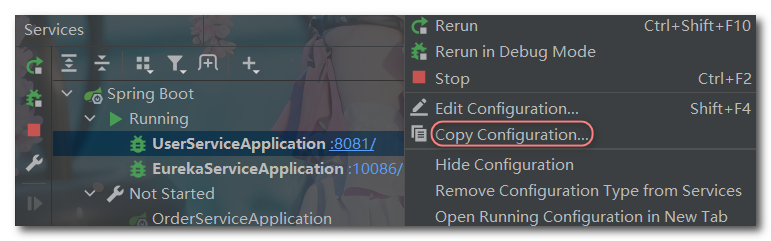

   

   4. **查看eureka-server管理页面**

      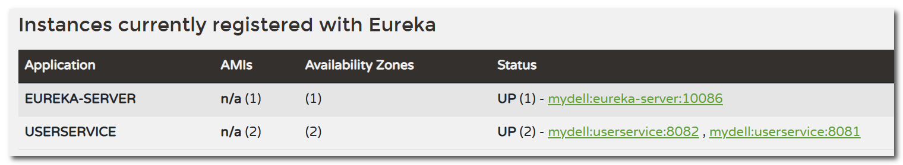


## 2.4 服务发现

下面，我们将order-service的逻辑修改：向eureka-server拉取user-service的信息，实现服务发现。

1. **引入依赖，这一步与服务注册时一致**

   ```xml
   <dependency>
       <groupId>org.springframework.cloud</groupId>
       <artifactId>spring-cloud-starter-netflix-eureka-client</artifactId>
   </dependency>
   ```

2. **配置文件，服务发现也需要知道eureka地址，因此第二步与服务注册一致，都是配置eureka信息**

   在order-service中，修改application.yml文件，添加服务名称、eureka地址：

   ```yml
   spring:
     application:
       name: orderservice
   eureka:
     client:
       service-url:
         defaultZone: http://127.0.0.1:10086/eureka
   ```

   启动服务可以发现 `order-service` 也被注册到了Eureka服务器上：

   

   

3. **服务拉取**

   修改访问的url路径，用服务名代替ip、端口：

   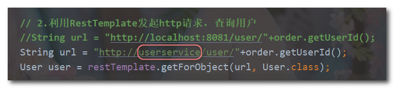

   这个服务名就是配置文件中配置的application的名字：

   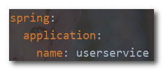

4. **负载均衡**

   之前我们配置了RestTemplate这个Bean，只需要给这个Bean添加一个@LoadBalanced注解即可。

   使用该注解需要导入 `spring-cloud-commons` 依赖：

   ```xml
   <dependency>
       <groupId>org.springframework.cloud</groupId>
       <artifactId>spring-cloud-commons</artifactId>
   </dependency>
   ```

   ```java
   @Configuration
   public class RestTemplateConfig {
   
       /**
        * 配置RestTemplate对象
        * @return
        */
       @Bean
       @LoadBalanced
       public RestTemplate restTemplate(){
           return new RestTemplate();
       }
   }
   ```

spring会自动帮助我们从eureka-server端，根据userservice这个服务名称，获取实例列表，并完成负载均衡。


## 2.5 Ribbon负载均衡

上面提到了使用@LoadBalanced注解，即可实现负载均衡功能，这是什么原理呢？

`LoadBalancerInterceptor` 这个类会在对RestTemplate的请求进行拦截，然后从Eureka根据服务id获取服务列表，随后利用负载均衡算法得到真实的服务地址信息，替换服务id。


可以看到这里的intercept方法，拦截了用户的HttpRequest请求，然后做了几件事：

- `request.getURI()`：获取请求uri，本例中就是 http://userservice/user/3
- `originalUri.getHost()`：获取uri路径的主机名，其实就是服务id：`userservice`
- `this.loadBalancer.execute()`：处理服务id，和用户请求。

这里的`this.loadBalancer`是`LoadBalancerClient`类型，继续跟入execute方法：

- getLoadBalancer(serviceId)：根据服务id获取ILoadBalancer，而ILoadBalancer会拿着服务id去eureka中获取服务列表并保存。
- getServer(loadBalancer)：利用内置的负载均衡算法，从服务列表中选择一个。


**基本流程如下**：

- 拦截我们的RestTemplate请求http://userservice/user/1
- RibbonLoadBalancerClient会从请求url中获取服务名称，也就是userservice
- DynamicServerListLoadBalancer根据userservice到eureka拉取服务列表
- eureka返回列表，localhost:8081、localhost:8082
- IRule利用内置负载均衡规则，从列表中选择一个，例如localhost:8081
- RibbonLoadBalancerClient修改请求地址，用localhost:8081替代userservice，得到http://localhost:8081/user/1，发起真实请求


### 2.5.1 负载均衡策略

负载均衡的规则都定义在IRule接口中，而IRule有很多不同的实现类：

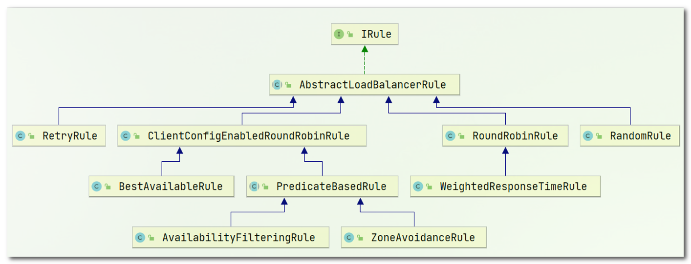

不同规则的含义如下：

| **内置负载均衡规则类**    | **规则描述**                                                 |
| ------------------------- | ------------------------------------------------------------ |
| RoundRobinRule            | 简单轮询服务列表来选择服务器。它是Ribbon默认的负载均衡规则。 |
| AvailabilityFilteringRule | 对以下两种服务器进行忽略：   （1）在默认情况下，这台服务器如果3次连接失败，这台服务器就会被设置为“短路”状态。短路状态将持续30秒，如果再次连接失败，短路的持续时间就会几何级地增加。  （2）并发数过高的服务器。如果一个服务器的并发连接数过高，配置了AvailabilityFilteringRule规则的客户端也会将其忽略。并发连接数的上限，可以由客户端的<clientName>.<clientConfigNameSpace>.ActiveConnectionsLimit属性进行配置。 |
| WeightedResponseTimeRule  | 为每一个服务器赋予一个权重值。服务器响应时间越长，这个服务器的权重就越小。这个规则会随机选择服务器，这个权重值会影响服务器的选择。 |
| **ZoneAvoidanceRule**     | 默认实现类。以区域可用的服务器为基础进行服务器的选择。使用Zone对服务器进行分类，这个Zone可以理解为一个机房、一个机架等。而后再对Zone内的多个服务做轮询。 |
| BestAvailableRule         | 忽略那些短路的服务器，并选择并发数较低的服务器。             |
| RandomRule                | 随机选择一个可用的服务器。                                   |
| RetryRule                 | 重试机制的选择逻辑                                           |


### 2.5.2 自定义负载均衡

通过定义IRule实现可以修改负载均衡规则，有两种方式：

1. 代码方式：定义一个新的IRule类型的Bean：

```java
@Bean
public IRule randomRule(){
    return new RandomRule();
}
```

2. 配置文件方式

```yaml
userservice: # 给某个微服务配置负载均衡规则，这里是userservice服务
  ribbon:
    NFLoadBalancerRuleClassName: com.netflix.loadbalancer.RandomRule # 负载均衡规则 
```


### 2.5.3 饥饿加载

Ribbon默认是采用懒加载，即第一次访问时才会去创建LoadBalanceClient，请求时间会很长。

而饥饿加载则会在项目启动时创建，降低第一次访问的耗时，通过下面配置开启饥饿加载：

```yaml
ribbon:
  eager-load:
    enabled: true
    clients: userservice
```


# 3. Nacos注册中心

Nacos是一个功能丰富的分布式服务发现和配置管理系统，提供了服务注册与发现、动态配置管理、服务治理等功能。

Nacos的主要特点和功能包括：

1. 服务注册与发现：Nacos允许服务实例在启动时向Nacos注册自身的信息，包括IP地址、端口号、健康状态等。其他服务可以通过查询Nacos来发现可用的服务实例，实现服务之间的通信与调用。
2. 动态配置管理：Nacos提供了动态配置管理功能，可以实现对应用程序的配置进行集中管理。开发人员可以在Nacos中创建和管理配置，应用程序可以实时获取最新的配置信息。
3. 服务健康检查：Nacos通过定期发送心跳检测服务实例的健康状态，并提供了可插拔的健康检查机制。这样，当服务实例出现故障或不可用时，Nacos可以自动将其从服务注册中心中移除，避免将请求发送到不可用的实例上。
4. 服务路由与负载均衡：Nacos支持服务的动态路由和负载均衡。通过与服务网关（如Spring Cloud Gateway）集成，可以根据规则动态路由请求到不同的服务实例，实现负载均衡和灰度发布等功能。
5. 分布式配置监听：Nacos支持配置的实时变更通知，应用程序可以通过监听配置的变化来动态更新自身的配置。这使得应用程序能够在配置发生变化时及时做出响应，无需重启或停机。
6. 集群和高可用性：Nacos支持构建集群部署，提供了高可用性和容错机制。通过在Nacos集群中部署多个节点，可以实现服务注册与发现的高可用性。

## 3.1 安装Nacos

进入官网下载安装包：[Releases · alibaba/nacos · GitHub](https://github.com/alibaba/nacos/releases)


下载后上传到Linux服务器，然后解压到/user/local目录：

```sh
tar -xvf nacos-server-2.2.3.tar.gz -C /usr/local/
```

解压后生成了nacos目录，该目录中有以下目录：

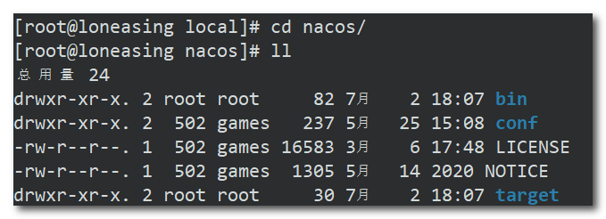


## 3.2 Nacos启动与关闭

**在Linux系统中启动和关闭Nacos**

在nacos/bin目录中，打开终端输入命令启动Nacos，standalone表示单机启动

```sh
sh startup.sh -m standalone 
```

关闭Nacos：

```sh
sh shutdown.sh
```

启动效果如下，点击图中的地址即可访问Nacos服务管理中心，或者手动输入：`192.168.101.100:8848/nacos`


**在Windows系统中启动和关闭Nacos**

在nacos/bin目录中，打开命令行窗口输入命令启动Nacos：

```sh
startup.cmd -m standalone
```

关闭Nacos：

```sh
shutdown.cmd
```

启动后的效果如下图所示，点击图中的网址即可访问Nacos服务管理中心，或者浏览器地址栏手动输入：`localhost:8848/nacos`


## 3.3 注册与发现

首先需要引入依赖：

**父工程管理依赖**

```xml
<properties>
    <maven.compiler.source>17</maven.compiler.source>
    <maven.compiler.target>17</maven.compiler.target>
    <project.build.sourceEncoding>UTF-8</project.build.sourceEncoding>
    <project.reporting.outputEncoding>UTF-8</project.reporting.outputEncoding>
    <spring-cloud.version>2022.0.3</spring-cloud.version>
    <spring-boot.version>3.1.0</spring-boot.version>
    <spring-cloud-ailibaba.version>2022.0.0.0-RC1</spring-cloud-ailibaba.version>
</properties>

<dependencyManagement>
    <!-- SpringCloud alibaba相关依赖 -->
	<dependency>
    	<groupId>com.alibaba.cloud</groupId>
    	<artifactId>spring-cloud-alibaba-dependencies</artifactId>
    	<version>${spring-cloud-ailibaba.version}</version>
    	<type>pom</type>
    	<scope>import</scope>
	</dependency>
</dependencyManagement>
```

**服务消费者引入nacos服务发现依赖和负载均衡器依赖**

```xml
<!-- nacos服务发现依赖 -->
<dependency>
    <groupId>com.alibaba.cloud</groupId>
    <artifactId>spring-cloud-starter-alibaba-nacos-discovery</artifactId>
</dependency>
<!-- 负载均衡器 -->
<dependency>
    <groupId>org.springframework.cloud</groupId>
    <artifactId>spring-cloud-starter-loadbalancer</artifactId>
</dependency>
```

**服务提供者引入nacos服务发现依赖**

```xml
<!-- nacos服务发现依赖 -->
<dependency>
    <groupId>com.alibaba.cloud</groupId>
    <artifactId>spring-cloud-starter-alibaba-nacos-discovery</artifactId>
</dependency>
```

**配置Nacos服务发现地址**

> 这里Nacos服务安装在本机上，所以Nacos服务中心地址是 `localhost:8848` 

```yml
spring: 
  cloud:
    nacos:
      discovery:
        server-addr: localhost:8848
```

注册服务后，访问Nacos服务管理中心：`localhost:8848/nacos`


### Nacos版本

需要注意的是，SpringBoot、SpringCloud、SpringCloudAlibaba、Nacos之间的版本要一一对应，否则会出错：

| Spring Cloud Alibaba Version | Spring Cloud Version        | Spring Boot Version |
| ---------------------------- | --------------------------- | ------------------- |
| 2022.0.0.0-RC2*              | Spring Cloud 2022.0.0       | 3.0.2               |
| 2022.0.0.0-RC1               | Spring Cloud 2022.0.0       | 3.0.0               |
| 2021.0.5.0*                  | Spring Cloud 2021.0.5       | 2.6.13              |
| 2021.0.4.0                   | Spring Cloud 2021.0.4       | 2.6.11              |
| 2021.0.1.0                   | Spring Cloud 2021.0.1       | 2.6.3               |
| 2021.1                       | Spring Cloud 2020.0.1       | 2.4.2               |
| 2.2.10-RC1*                  | Spring Cloud Hoxton.SR12    | 2.3.12.RELEASE      |
| 2.2.9.RELEASE                | Spring Cloud Hoxton.SR12    | 2.3.12.RELEASE      |
| 2.2.8.RELEASE                | Spring Cloud Hoxton.SR12    | 2.3.12.RELEASE      |
| 2.2.7.RELEASE                | Spring Cloud Hoxton.SR12    | 2.3.12.RELEASE      |
| 2.2.6.RELEASE                | Spring Cloud Hoxton.SR9     | 2.3.2.RELEASE       |
| 2.2.1.RELEASE                | Spring Cloud Hoxton.SR3     | 2.2.5.RELEASE       |
| 2.2.0.RELEASE                | Spring Cloud Hoxton.RELEASE | 2.2.X.RELEASE       |

SpringCloudAlibaba组件版本关系：

| Spring Cloud Alibaba Version | Sentinel Version | Nacos Version | RocketMQ Version |
| ---------------------------- | ---------------- | ------------- | ---------------- |
| 2022.0.0.0-RC2               | 1.8.6            | 2.2.1         | 4.9.4            |
| 2021.0.5.0                   | 1.8.6            | 2.2.0         | 4.9.4            |
| 2.2.10-RC1                   | 1.8.6            | 2.2.0         | 4.9.4            |
| 2022.0.0.0-RC1               | 1.8.6            | 2.2.1-RC      | 4.9.4            |
| 2.2.9.RELEASE                | 1.8.5            | 2.1.0         | 4.9.4            |
| 2021.0.4.0                   | 1.8.5            | 2.0.4         | 4.9.4            |
| 2.2.8.RELEASE                | 1.8.4            | 2.1.0         | 4.9.3            |
| 2021.0.1.0                   | 1.8.3            | 1.4.2         | 4.9.2            |
| 2.2.7.RELEASE                | 1.8.1            | 2.0.3         | 4.6.1            |
| 2.2.6.RELEASE                | 1.8.1            | 1.4.2         | 4.4.0            |


## 3.4 服务分级存储模型

一个服务可以有多个实例，例如userservice有三个实例，假如这些实例分布于全国各地的不同机房，例如

- 127.0.0.1:8081，在上海机房
- 127.0.0.1:8082，在上海机房
- 127.0.0.1:8083，在杭州机房

Nacos就将同一机房内的实例划分为一个集群。也就是说，user-service是服务，一个服务可以包含多个集群，如杭州、上海，每个集群下可以有多个实例，形成分级模型，如图：


微服务互相访问时，应该尽可能访问同集群实例，因为本地访问速度更快。当本集群内不可用时，才访问其它集群。


### 3.4.1 配置userservice服务集群

修改user-service的application.yml文件，添加集群配置：

```yml
spring:
  cloud:
    nacos:
      discovery:
        server-addr: localhost:8848
        cluster-name: HZ # 集群名称
```

重启两个userservice实例后，我们可以在nacos控制台看到下面结果：


再次复制一个userservice启动配置，添加属性：

```sh
-Dserver.port=8083 -Dspring.cloud.nacos.discovery.cluster-name=SH
```

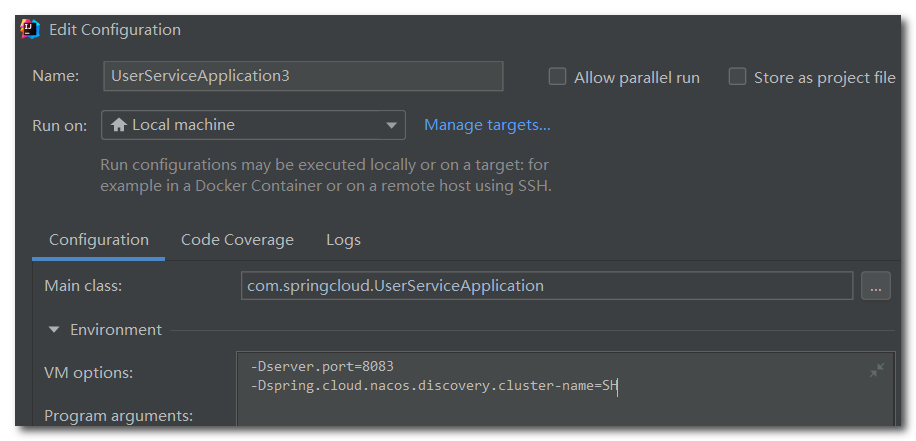

启动UserServiceApplication3后再次查看nacos控制台：

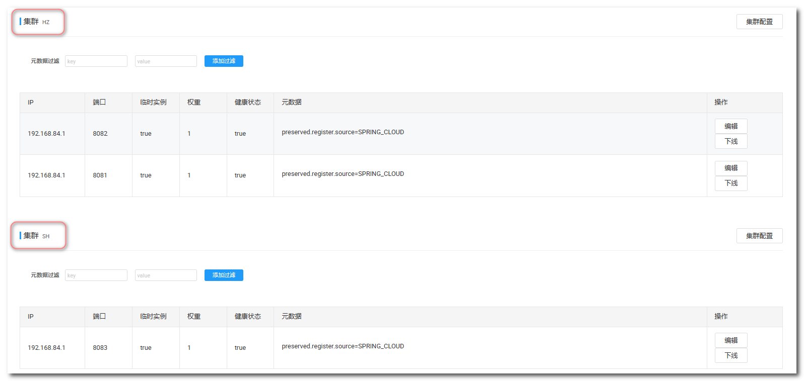


### 3.4.2 同集群优先的负载均衡

默认的`ZoneAvoidanceRule`并不能实现根据同集群优先来实现负载均衡。

因此Nacos中提供了一个`NacosRule`的实现，可以优先从同集群中挑选实例。

修改 `order-service` 的application.yml文件，修改开启nacos负载均衡并修改负载均衡规则：

```yml
spring:
  application:
    name: orderservice
  cloud:
    nacos:
      discovery:
        server-addr: localhost:8848
        cluster-name: HZ # 集群名称，HZ代表杭州
    loadbalancer:
      nacos:
        enabled: true # 开启nacos的负载均衡
# 配置userservice服务的负载均衡规则
userservice:
  ribbon:
    NFLoadBalancerRuleClassName: com.alibaba.cloud.nacos.ribbon.NacosRule 
```


### 3.4.3 权重配置

在nacos控制台，找到userservice服务的实例列表，点击编辑，即可修改权重，权重越大则访问频率越高（0~1之间）。

如果权重修改为0，则该实例永远不会被访问。

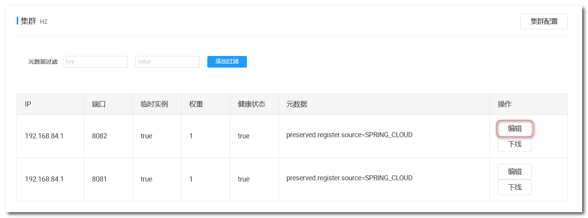


### 3.4.4 环境隔离

Nacos提供了namespace来实现环境隔离功能

- nacos中可以有多个namespace
- namespace下可以有group、service等
- 不同namespace之间相互隔离，例如不同namespace的服务互相不可见
- 默认情况下，所有service、data、group都在同一个namespace，名为public

#### 创建namespace


#### 配置namespace

配置orderservice的命名空间，修改orderservice的application.yml文件

```yml
spring:
  cloud:
    loadbalancer:
      nacos:
        enabled: true
    nacos:
      discovery:
        server-addr: localhost:8848
        cluster-name: HZ # 集群名称，HZ代表杭州
        namespace: 80c44a82-2d25-498b-8dd8-58004f6c6e0c # 注意这里是命名空间的id而不是名称
```

重新启动服务后查看服务列表：


此时访问order-service，因为namespace不同，会导致找不到userservice，控制台会报错：

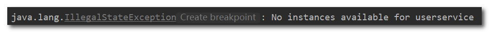


## 3.5 Nacos与Eureka的区别

Nacos的服务实例分为两种类型：

- 临时实例：如果实例宕机超过一定时间，会从服务列表剔除，默认的类型。

- 非临时实例：如果实例宕机，不会从服务列表剔除，也可以叫永久实例。

配置一个服务实例为永久实例（注意：public命名空间内只能是临时实例）：

```yaml
spring:
  cloud:
    nacos:
      discovery:
        server-addr: localhost:8848
        namespace: 80c44a82-2d25-498b-8dd8-58004f6c6e0c
        ephemeral: false # 设置为非临时实例
```

观察服务列表可以发现即使服务健康实例数为0个(宕机)，非临时实例服务依然存在：


Nacos与eureka的共同点

- 都支持服务注册和服务拉取
- 都支持服务提供者心跳方式做健康检测

Nacos与Eureka的区别

- Nacos支持服务端主动检测提供者状态：临时实例采用心跳模式，非临时实例采用主动检测模式
- 临时实例心跳不正常会被剔除，非临时实例则不会被剔除
- Nacos支持服务列表变更的消息推送模式，服务列表更新更及时
- Nacos集群默认采用AP方式，当集群中存在非临时实例时，采用CP模式；Eureka采用AP方式


## 3.6 Nacos配置管理

Nacos除了可以做注册中心，同样可以做配置管理来使用。

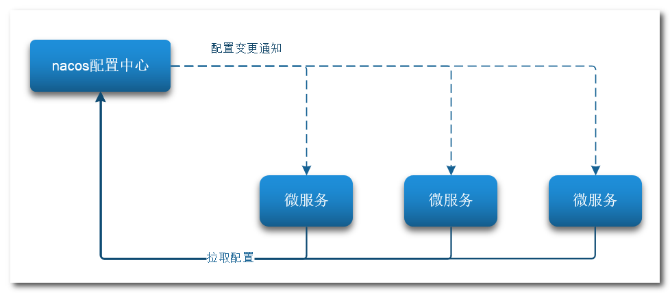

### 3.6.1 在nacos中添加配置文件

需要热更新的配置才有放到nacos管理的必要。基本不会变更的一些配置还是保存在微服务本地比较好。

下面在public命名空间中添加配置文件：


### 3.6.2 拉取nacos中管理的配置

微服务要拉取nacos中管理的配置，并且与本地的application.yml配置合并，才能完成项目启动。

但如果尚未读取application.yml，又如何得知nacos地址呢？

因此spring引入了一种新的配置文件：bootstrap.yaml文件，会在application.yml之前被读取，在bootstrap.yaml中配置nacos地址。


(1) 首先引入nacos的配置管理客户端依赖

```xml
<!--nacos配置管理依赖-->
<dependency>
    <groupId>com.alibaba.cloud</groupId>
    <artifactId>spring-cloud-starter-alibaba-nacos-config</artifactId>
</dependency>
```

(2) 引入bootstrap相关依赖，高版本的springcloud，需要手动引入bootstrap依赖才会自动读取bootstrap.yml文件

```xml
<!-- bootstrap相关依赖 -->
<dependency>
    <groupId>org.springframework.cloud</groupId>
    <artifactId>spring-cloud-starter-bootstrap</artifactId>
</dependency>
```

(3) 在userservice中创建一个bootstrap.yaml文件，内容如下：

```yml
spring:
  application:
    name: userservice # 服务名称
  profiles:
    active: dev #开发环境，这里是dev
  cloud:
    nacos:
      discovery:
        server-addr: localhost:8848 # Nacos地址
      config:
        file-extension: yaml # 文件后缀名
```

Spring会根据`${spring.cloud.nacos.discovery.server-addr}`获取nacos地址，再根据

`${spring.application.name}-${spring.profiles.active}.${spring.cloud.nacos.config.file-extension}`作为文件id，来读取nacos中的配置。


(4) 读取nacos配置

在user-service中的UserController中添加业务逻辑，使用 `@Value` 注解读取pattern.dateformat配置：

```Java
@Slf4j
@RestController
@RequestMapping("/user")
public class UserController {

    // 读取nacos中配置的属性
    @Value("${pattern.dateformat}")
    private String dateformat;

    @GetMapping("now")
    public String now(){
        return LocalDateTime.now().format(DateTimeFormatter.ofPattern(dateformat));
    }
}
```

访问 `localhost:8081/user/now`：

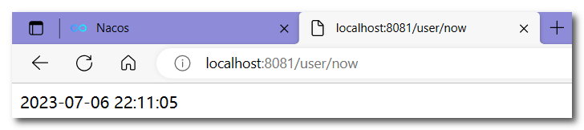


### 3.6.3 配置热更新

我们最终的目的，是修改nacos中的配置后，微服务中无需重启即可让配置生效，也就是**配置热更新**。

实现配置热更新可以使用两种方式：

**方式一：在 `@Value` 注入的变量所在类上添加注解 `@RefreshScope`**


添加该注解后，修改nacos配置文件信息


无需重启服务刷新[localhost:8081/user/now](http://localhost:8081/user/now)页面，页面中的时间格式发生了变化，说明实现了热更新。

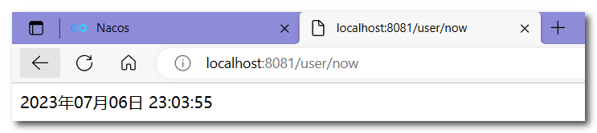

**方式二：使用@ConfigurationProperties注解代替@Value注解**

> @ConfigurationProperties注解有监测到属性发生变化自动更新的功能，使用该注解获取属性不需要添加@RefreshScope注解。

在user-service服务中，添加一个类，读取patterrn.dateformat属性：

```Java
@Component
@Data
@ConfigurationProperties(prefix = "pattern")
public class PatternProperties {
    private String dateformat;
}
```

在UserController中注入该类的对象，通过该对象获取读取到的属性

```Java
 	@Autowired
    private PatternProperties patternProperties;

    @GetMapping("now")
    public String now(){
        return LocalDateTime.now().format(DateTimeFormatter.ofPattern(patternProperties.getDateformat()));
    }
```


### 3.6.4 多环境共享

微服务启动时，会去nacos读取多个配置文件，例如：

- `[spring.application.name]-[spring.profiles.active].yaml`，例如：userservice-dev.yaml 代表生产环境下的配置文件

- `[spring.application.name].yaml`，该文件不包含环境，因此可以被多个环境共享，例如：userservice.yaml

**(1) 添加一个环境共享配置**

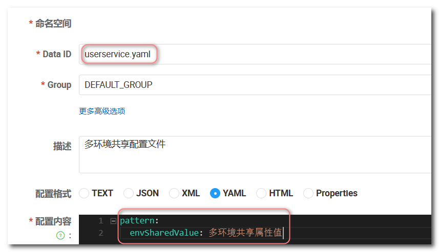

**(2) 在user-service中读取共享配置**

在user-service服务中，修改PatternProperties类，读取新添加的属性：

```Java
@Component
@Data
@ConfigurationProperties(prefix = "pattern")
public class PatternProperties {
    private String dateformat;
    private String envSharedValue;
}
```

在user-service服务中，修改UserController，添加一个方法：

```Java
    @Autowired
    private PatternProperties patternProperties;

    @GetMapping("prop")
    public PatternProperties prop(){
        return patternProperties;
    }
```

**(3) 运行两个UserApplication，使用不同的profile**


在nacos中配置了生产环境下的dateformat属性，而测试环境没有配置，所以读取到null


nacos多环境共享配置和SpringBoot的多环境共享配置一样，详情可查看SpringBoot中运维篇的笔记。


## 3.7 Nacos集群搭建

搭建集群的基本步骤：

- 搭建数据库，初始化数据库表结构
- 下载nacos安装包
- 配置nacos
- 启动nacos集群
- nginx反向代理

### 3.7.1 Windos环境下搭建nacos集群

**(1) 初始化数据库**

Nacos默认数据存储在内嵌数据库Derby中，不属于生产可用的数据库。

官方推荐的最佳实践是使用带有主从的高可用数据库集群，首先新建一个数据库，命名为nacos，而后执行安装包中的sql文件；


执行成功后，生成的数据表如下所示：


**(2) 配置Nacos**

这里在一台windows上配置三个nacos实例，使用不同的端口号，并且端口号不能连续，否则会报错。

进入每个nacos的conf目录，修改配置文件cluster.conf.example，重命名为cluster.conf，并添加以下内容：

```properties
192.168.84.1:8845;
192.168.84.1:8855;
192.168.84.1:8865;
```

然后修改application.properties文件，数据库配置的注释去掉，三个节点要使用一个数据库，所以数据库的ip要是同一个。

```properties
spring.datasource.platform=mysql
db.num=1
db.url.0=jdbc:mysql://192.168.101.100:3306/nacos?characterEncoding=utf8&connectTimeout=1000&socketTimeout=3000&autoReconnect=true&useUnicode=true&useSSL=false&serverTimezone=UTC
db.user.0=root
db.password.0=123456
```

然后分别进入nacos/bin目录启动三个nacos节点：

```
startup.cmd
```

最终每个nacos实例启动日志都显示 Nacos started successfully in cluster mode，则表示集群启动成功：


**(3) 配置Nginx反向代理**

修改nginx/conf目录下的nginx.conf文件，添加如下配置：

```nginx
upstream nacos-cluster {
    server 192.168.84.1:8845;
    server 192.168.84.1:8855;
    server 192.168.84.1:8865;
}

server {
    listen       80;
    server_name  localhost;

    location /nacos {
        proxy_pass http://nacos-cluster;
    }
}
```

添加配置后，启动nginx服务：**start nginx** 或者 **nginx.exe**

建议使用第一种，第二种会使cmd窗口一直处于执行中，不能进行其他命令操作。

其他的nginx相关命令：

- 停止nginx服务：**nginx.exe -s stop**

- 杀死nginx进程：**taskkill /f /im nginx.exe > null** 

- 重新载入nginx：**nginx.exe -s reload**

然后微服务的配置文件中的nacos服务地址改为 `localhost:80/nacos` 即可：

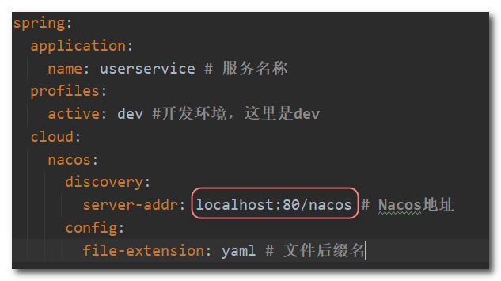


### 3.7.2 Linux环境下搭建nacos集群

**(1) 初始化数据库**

这里准备了三台虚拟机，每台虚拟机分别安装一个nacos服务器，每个nacos服务器使用同一个数据库：

- 192.168.101.110:8848
- 192.168.101.111:8848
- 192.168.101.112:8848

这里选择节点192.168.101.110中的mysql数据库管理系统，ip为 `192.168.101.110:3306`。

在该mysql管理系统中新建一个数据库，命名为nacos，而后执行安装包中的sql文件。

**(2) 配置Nacos**

进入每个nacos的conf目录，修改配置文件cluster.conf.example，重命名为cluster.conf，并添加以下内容：

```properties
192.168.101.110:8848;
192.168.101.111:8848;
192.168.101.112:8848;
```

然后修改application.properties文件，数据库配置的注释去掉，三个节点要使用一个数据库，所以数据库的ip要是同一个。

```properties
spring.datasource.platform=mysql
db.num=1
db.url.0=jdbc:mysql://192.168.101.110:3306/nacos?characterEncoding=utf8&connectTimeout=1000&socketTimeout=3000&autoReconnect=true&useUnicode=true&useSSL=false&serverTimezone=UTC
db.user.0=root
db.password.0=123456
```

然后分别进入nacos/bin目录启动三个nacos节点：

```sh
sh startup.sh
```

在linux环境下，日志信息被存储到 `/usr/local/nacos/logs/start.out` 文件中，可以使用tail命令实时追踪日志：

```sh
tail -f /usr/local/nacos/logs/start.out
```

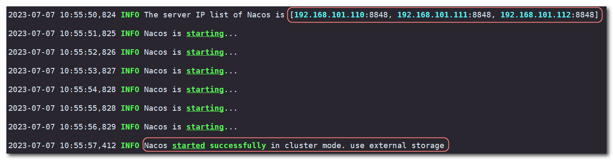

三个nacos实例启动日志都如上图所示，则表示集群启动成功。

**(3) 配置Nginx反向代理**

这里在192.168.101.110这台虚拟机中安装了Nginx服务器，详细安装步骤查看Linux软件包管理的笔记。

修改conf/nginx.conf文件，配置如下：

```nginx
upstream nacos-cluster {
    server 192.168.101.110:8848;
    server 192.168.101.111:8848;
    server 192.168.101.112:8848;
}

server {
    listen       80;
    server_name  localhost;

    location /nacos {
        proxy_pass http://nacos-cluster;
    }
}
```

修改配置文件后需要重新加载配置文件：

```sh
nginx -s reload
```

启动nginx服务：

```sh
nginx
```

然后将微服务的配置文件中的nacos服务地址改为 `192.168.101.110:80/nacos` 即可，nginx会将请求随机分配给三个节点。

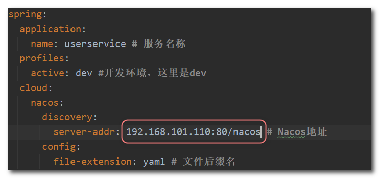


# 4. Feign远程调用

## 4.1 Feign替代RestTemplate

Fegin的使用步骤如下：

**(1)  引入依赖**

我们在order-service服务的pom文件中引入feign的依赖

```xml
<dependency>
    <groupId>org.springframework.cloud</groupId>
    <artifactId>spring-cloud-starter-openfeign</artifactId>
</dependency>
```

**(2) 添加注解**

在order-service的启动类添加注解 `@EnableFeignClients` 开启Feign的功能：

> `@EnableFeignClients` 用于扫描启动类所在包下使用 `@FeignClient` 标识的接口，并为其创建Feign客户端的实例。
>
> `@EnableFeignClients` 注解上通常还会指定要扫描的Feign客户端接口所在的包路径。
>
> 例如，使用`@EnableFeignClients(basePackages = "com.example.clients")`可以告诉Spring容器去扫描`com.example.clients`包下的接口，并为其创建Feign客户端的实例。


**(3) 编写Feign的客户端**

在order-service中新建一个包client，在该包中新建一个接口，该接口使用注解 `@FeignClient` 标识：

> `@FeignClient` 注解的主要作用是标识该接口作为一个Feign客户端，并指定要调用的远程服务的名称。

```Java
@FeignClient("userservice") // 该注解中标明服务名称
public interface UserClient {
    @GetMapping("/user/{id}") // 这里是根据方法的参数id传递给请求路径中的id，与controller层中的请求正好相反
    User findById(@PathVariable("id") Long id);
}
```

这个客户端主要是基于SpringMVC的注解来声明远程调用的信息，比如：

- 服务名称：userservice
- 请求方式：GET
- 请求路径：/user/{id}
- 请求参数：Long id
- 返回值类型：User

这样，Feign就可以帮助我们发送http请求，无需自己使用RestTemplate来发送了。

**(4) 使用Feign发起调用**

修改order-service中的OrderServiceImpl类中的queryOrderById方法，使用Feign客户端代替RestTemplate：

```Java
    // 注入编写的Feign客户端
    @Autowired
    private UserClient userClient;

    public Order queryOrderById(Long orderId) {

        // 1.查询订单
        Order order = orderMapper.findById(orderId);

        // 2.利用Feign发起http请求，查询用户
        User user = userClient.findById(order.getUserId());
        
        order.setUser(user);
        return order;
    }
```

Feign内部集成了Ribbon，实现了负载均衡。


## 4.2 Feign的自定义配置

Feign可以支持很多的自定义配置，如下表所示：

| 类型                   | 作用             | 说明                                                   |
| ---------------------- | ---------------- | ------------------------------------------------------ |
| **feign.Logger.Level** | 修改日志级别     | 包含四种不同的级别：NONE、BASIC、HEADERS、FULL         |
| feign.codec.Decoder    | 响应结果的解析器 | http远程调用的结果做解析，例如解析json字符串为java对象 |
| feign.codec.Encoder    | 请求参数编码     | 将请求参数编码，便于通过http请求发送                   |
| feign. Contract        | 支持的注解格式   | 默认是SpringMVC的注解                                  |
| feign. Retryer         | 失败重试机制     | 请求失败的重试机制，默认是没有，不过会使用Ribbon的重试 |

一般情况下，默认值就能满足我们使用，如果要自定义时，只需要在配置文件中配置或者创建自定义的@Bean覆盖默认Bean即可。

下面以日志为例来演示如何自定义配置：

**(1) 配置文件的方式**

基于配置文件修改feign的日志级别针对单个服务：

```yaml
feign:  
  client:
    config: 
      userservice: # 针对某个微服务的配置
        loggerLevel: FULL #  日志级别 
```

也可以针对所有服务：

```yaml
feign:  
  client:
    config: 
      default: # 这里用default就是全局配置，如果是写服务名称，则是针对某个微服务的配置
        loggerLevel: FULL #  日志级别 
```

日志的级别分为四种：

- NONE：不记录任何日志信息，这是默认值。
- BASIC：仅记录请求的方法，URL以及响应状态码和执行时间
- HEADERS：在BASIC的基础上，额外记录了请求和响应的头信息
- FULL：记录所有请求和响应的明细，包括头信息、请求体、元数据。

**(2) java代码方式**

先声明一个配置类（不需要加注解修饰），然后创建一个Logger.Level的对象：

```java
public class DefaultFeignConfiguration  {
    @Bean
    public Logger.Level feignLogLevel(){
        return Logger.Level.BASIC; // 日志级别为BASIC
    }
}
```

如果要**全局生效**，将其放到启动类的 `@EnableFeignClients` 这个注解中：

```java
@EnableFeignClients(defaultConfiguration = DefaultFeignConfiguration .class) 
```

如果是**局部生效**，则把它放到对应的 `@FeignClient` 这个注解中：

```java
@FeignClient(value = "userservice", configuration = DefaultFeignConfiguration .class) 
```

效果如下：


## 4.3 Feign的使用优化

Feign底层发起http请求，依赖于其它的框架。其底层客户端实现包括：

- URLConnection：默认实现，不支持连接池

- Apache HttpClient ：支持连接池

- OKHttp：支持连接池

因此提高Feign的性能主要手段就是使用**连接池**代替默认的URLConnection。

这里我们用Apache的HttpClient来演示。

**(1) 引入依赖**

在order-service的pom文件中引入Apache的HttpClient依赖：

```xml
<!--httpClient的依赖 -->
<dependency>
    <groupId>io.github.openfeign</groupId>
    <artifactId>feign-httpclient</artifactId>
</dependency>
```

**(2) 配置连接池**

在order-service的application.yml中添加配置：

```yml
feign:
  client:
    config:
      default: # 全局的配置
        loggerLevel: BASIC # 日志级别，BASIC就是基本的请求和响应信息
  httpclient:
    enabled: true # 开启feign对HttpClient的支持
    max-connections: 200 # 最大的连接数
    max-connections-per-route: 50 # 每个路径的最大连接数
```


## 4.4 Feign的抽取

Feign的客户端与服务提供者的controller代码非常相似，有没有一种办法简化这种重复的代码编写呢？

将Feign的Client抽取为独立模块，并且把接口有关的POJO、默认的Feign配置都放到这个模块中，提供给所有消费者使用。

例如，将UserClient、User、Feign的默认配置都抽取到一个feign-api包中，所有微服务引用该依赖包，即可直接使用。


**(1) 创建一个新的module**

 首先创建一个maven项目，命名为feign-api：


在feign-api中然后引入feign的starter依赖

```xml
<dependency>
    <groupId>org.springframework.cloud</groupId>
    <artifactId>spring-cloud-starter-openfeign</artifactId>
</dependency>
```

**(2) 抽取公共部分**

将order-service中的UserClient、User、DefaultFeignConfiguration都复制到feign-api项目中。

然后删除order-service中的UserClient、User、DefaultFeignConfiguration等类或接口。

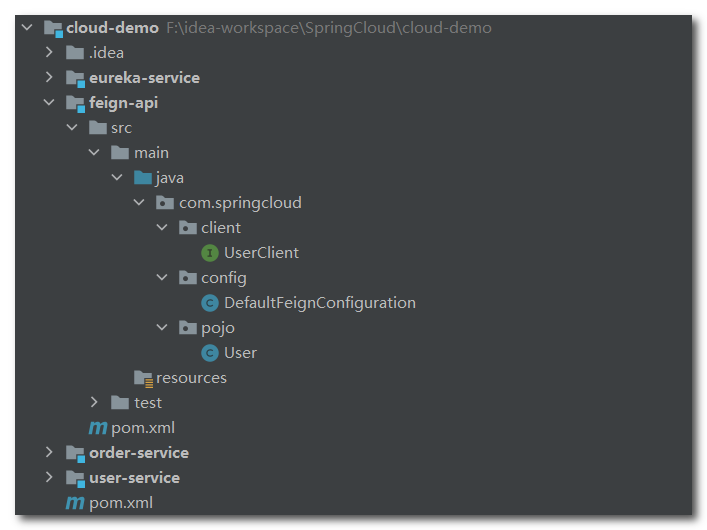

**(3) 导入创建的maven项目**

 在order-service中导入feign-api依赖

```xml
<!--feign-api的依赖-->
<dependency>
    <groupId>org.example</groupId>
    <artifactId>feign-api</artifactId>
    <version>1.0-SNAPSHOT</version>
</dependency>
```

修改order-service中的所有与上述三个组件有关的导包部分，改成导入feign-api中的包。

**(4) 解决扫描包问题**

重启服务后，发现服务报错了：

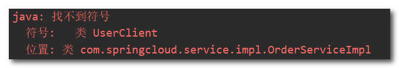

这是因为UserClient现在在feign-api项目的com.springcloud.client包下，

而order-service的@EnableFeignClients注解是在order-service项目的com.springcloud包下，不在同一个包，无法扫描到UserClient。

**方式一：指定Feign应该扫描的包：**

```java
@EnableFeignClients(basePackages = "com.springcloud.clients")
```

**方式二：指定需要加载的Client接口：**

```java
@EnableFeignClients(clients = {UserClient.class})
```


# 5. Gateway服务网关

网关（Gateway）是一个在微服务架构中起到入口和出口的作用，它充当了客户端和后端服务之间的中间层。Spring Cloud Gateway是Spring Cloud提供的一种基于Spring Framework 5、Project Reactor和Spring Boot 2的网关解决方案，用于构建高效的微服务架构中的API网关。

Spring Cloud Gateway的主要特性包括：

1. 路由转发：Spring Cloud Gateway可以根据请求的路径、方法和其他条件将请求转发到相应的微服务实例。它支持灵活的路由配置，可以根据需要进行路径重写、添加请求头、请求参数等操作。

2. 过滤器：Gateway提供了一系列的过滤器，可以在请求被转发到目标服务之前或之后对请求进行处理。这些过滤器可以用于认证、鉴权、请求日志记录、流量控制等各种功能。

3. 负载均衡：Gateway集成了Spring Cloud LoadBalancer，可以通过负载均衡算法将请求分发到多个目标服务实例之间，实现高可用和高性能。

4. 断路器：Gateway内置了断路器功能，可以在目标服务出现故障或不可用时进行熔断处理，避免级联故障。

5. 动态路由：Gateway支持动态路由配置，可以通过服务发现机制（如Eureka、Consul等）动态地添加、删除或修改路由规则，无需重启网关服务。

6. 可扩展性：Gateway基于Spring Framework和Spring Boot构建，可以很容易地与其他Spring Cloud组件集成，如服务注册与发现、配置中心等。

通过使用Spring Cloud Gateway，可以实现统一的API入口，集中处理跨越多个微服务的共同功能，如身份验证、请求转发、限流等。它还提供了灵活的路由配置和丰富的过滤器机制，使得微服务架构中的API管理更加简单和可靠。

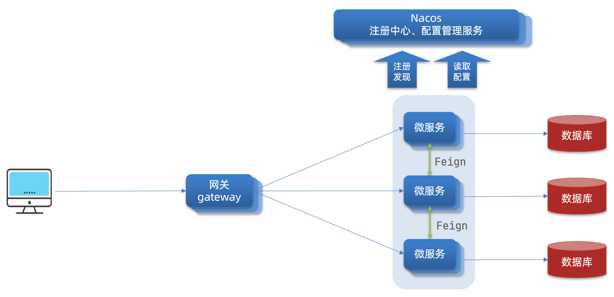

## 5.1 gateway快速入门

下面演示下网关的基本路由功能。基本步骤如下：

1. 创建SpringBoot工程gateway，引入网关依赖
2. 编写基础配置和路由规则
3. 启动网关服务进行测试

**(1) 创建gateway服务，引入依赖**

```xml
<!--网关-->
<dependency>
    <groupId>org.springframework.cloud</groupId>
    <artifactId>spring-cloud-starter-gateway</artifactId>
</dependency>
<!--nacos服务发现依赖-->
<dependency>
    <groupId>com.alibaba.cloud</groupId>
    <artifactId>spring-cloud-starter-alibaba-nacos-discovery</artifactId>
</dependency>
<!--负载均衡依赖-->
<dependency>
    <groupId>org.springframework.cloud</groupId>
    <artifactId>spring-cloud-starter-loadbalancer</artifactId>
</dependency>
```

**(2) 编写基础配置和路由规则**

路由配置包括：

1. 路由id：路由的唯一标示

2. 路由目标（uri）：路由的目标地址，http代表固定地址，lb代表根据服务名负载均衡

3. 路由断言（predicates）：判断路由的规则，

4. 路由过滤器（filters）：对请求或响应做处理

创建application.yml文件，内容如下：

```yml
server:
  port: 10010 # 网关端口
spring:
  application:
    name: gateway # 服务名称
  cloud:
    nacos:
      server-addr: localhost:8848 # nacos地址
    gateway:
      routes: # 网关路由配置
        - id: user-service # 路由id，自定义，只要唯一即可
          # uri: http://127.0.0.1:8081 # 路由的目标地址，http就是固定地址
          uri: lb://userservice # 路由的目标地址，lb就是负载均衡，后面跟服务名称
          predicates: # 路由断言，也就是判断请求是否符合路由规则的条件
            - Path=/user/** # 这个是按照路径匹配，只要以/user/开头就符合要求
          fiters: # 路由过滤器
          	#- AddRequestHeader=Words, hello world! # 添加请求头
```

符合`Path` 规则的一切请求，都代理到 `uri`参数指定的地址，再根据服务名拉取服务列表，实现负载均衡。

**(3) 测试**

访问http://localhost:10010/user/1，符合`/user/**`规则，请求转发到uri：http://userservice/user/1，再根据负载均衡分配到http://localhost:8081/user/1，结果如下所示


## 5.2 网关路由的流程


## 5.3 断言工厂

我们在配置文件中写的断言规则只是字符串，这些字符串会被Predicate Factory读取并处理，转变为路由判断的条件。

例如Path=/user/**是按照路径匹配，这个规则是由

`org.springframework.cloud.gateway.handler.predicate.PathRoutePredicateFactory`类来处理的。

像这样的断言工厂在SpringCloudGateway还有十几个:

| **名称**   | **说明**                       | **示例**                                                     |
| ---------- | ------------------------------ | ------------------------------------------------------------ |
| After      | 是某个时间点后的请求           | -  After=2031-01-20T17:42:47.789-07:00[America/Denver]       |
| Before     | 是某个时间点之前的请求         | -  Before=2031-04-13T15:14:47.433+08:00[Asia/Shanghai]       |
| Between    | 是某两个时间点之前的请求       | -  Between=2037-01-20T17:42:47.789-07:00[America/Denver],  2037-01-21T17:42:47.789-07:00[America/Denver] |
| Cookie     | 请求必须包含某些cookie         | - Cookie=chocolate, ch.p                                     |
| Header     | 请求必须包含某些header         | - Header=X-Request-Id, \d+                                   |
| Host       | 请求必须是访问某个host（域名） | -  Host=.somehost.org,.anotherhost.org                       |
| Method     | 请求方式必须是指定方式         | - Method=GET,POST                                            |
| Path       | 请求路径必须符合指定规则       | - Path=/red/{segment},/blue/**                               |
| Query      | 请求参数必须包含指定参数       | - Query=name, Jack或者-  Query=name                          |
| RemoteAddr | 请求者的ip必须是指定范围       | - RemoteAddr=192.168.1.1/24                                  |

下面介绍一下After规则的使用：


上述配置的After规则，需要在2023年1月23号之后的请求才会被处理，而当前不符合规则，所以无法访问：


暂时只需要掌握Path这种路由规则就可以了，忘记了去查阅官网，有详细的使用示例。


## 5.4 过滤器工厂

GatewayFilter是Spring Cloud Gateway中的一个核心组件，用于在请求进入和响应离开网关时进行过滤和处理。GatewayFilter允许开发人员对请求和响应进行修改、增强和验证，以满足各种需求，例如安全认证、请求日志记录、请求转发等。


Spring提供了31种不同的路由过滤器工厂，例如：

| **名称**             | **说明**                     |
| -------------------- | ---------------------------- |
| AddRequestHeader     | 给当前请求添加一个请求头     |
| RemoveRequestHeader  | 移除请求中的一个请求头       |
| AddResponseHeader    | 给响应结果中添加一个响应头   |
| RemoveResponseHeader | 从响应结果中移除有一个响应头 |
| RequestRateLimiter   | 限制请求的流量               |

### 5.4.1 请求头过滤器

下面介绍一下 `AddRequestHeader` 的使用：给所有进入userservice的请求添加一个请求头：`Words=hello world!`

只需要修改gateway服务的application.yml文件，添加路由过滤即可：

```yaml
spring:
  application:
    name: gateway # 服务名称
  cloud:
    nacos:
      server-addr: localhost:8848 # nacos地址
    gateway:
      routes: # 网关路由配置
        - id: user-service 
          uri: lb://userservice
          predicates: # 路由断言
            - Path=/user/**
          filters: # 过滤器
            - AddRequestHeader=Words, hello world! # 添加请求头
```

当前过滤器写在userservice路由下，因此仅仅对访问userservice的请求有效。

测试请求头是否添加成功，在UserController中查询用户的方法，声明一个形参接收一个请求头参数，然后将接收的参数打印出来：

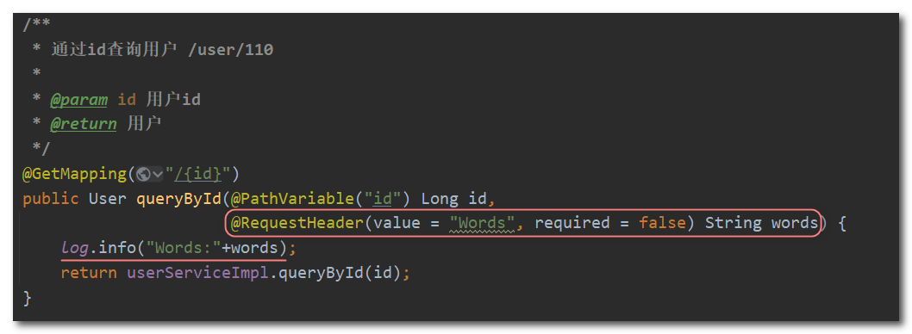

访问 http://localhost:10010/user/1，查看控制台日志，可以看到获取到了添加的请求头信息：

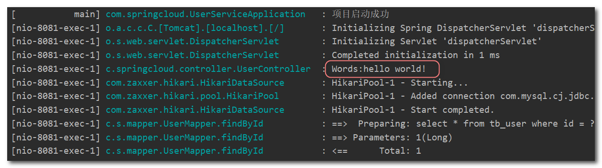


### 5.4.2 默认过滤器

如果要对所有的路由都生效，则可以将过滤器工厂写到default下，表示默认过滤器，格式如下：

```yml
spring:
  application:
    name: gateway 
  cloud:
    nacos:
      server-addr: localhost:8848 
    gateway:
      routes:
        - id: user-service 
          uri: lb://userservice
          predicates: 
            - Path=/user/**
          filters: 
            #- AddRequestHeader=Words, hello world! # 添加请求头
      default-filters:
        - AddRequestHeader=Words, Hello World! # 添加请求头
```

需要注意 `default-filters` 是与 `routes` 平级的。

访问 http://localhost:10010/user/1，查看控制台日志：

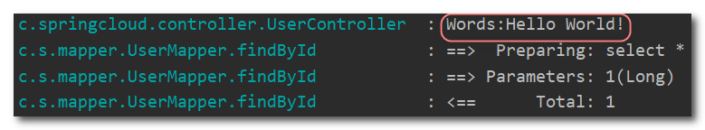


### 5.4.3 全局过滤器

全局过滤器的作用也是处理一切进入网关的请求和微服务响应，与GatewayFilter的作用一样。

区别在于GatewayFilter通过配置定义，处理逻辑是固定的；而GlobalFilter的逻辑需要自己写代码实现。

定义全局过滤器的方式是**实现GlobalFilter接口**：

```Java
public interface GlobalFilter {
    /**
     *  处理当前请求，有必要的话通过{@link GatewayFilterChain}将请求交给下一个过滤器处理
     *
     * @param exchange 请求上下文，里面可以获取Request、Response等信息
     * @param chain 用来把请求委托给下一个过滤器 
     * @return Mono<Void> 返回Mono对象表示当前过滤器业务结束
     */
    Mono<Void> filter(ServerWebExchange exchange, GatewayFilterChain chain);
}
```

下面自定义一个全局过滤器：

需求：定义全局过滤器，拦截请求，判断请求的参数是否满足下面条件，如果同时满足则放行，否则拦截。

- 参数中是否有authorization

- authorization参数值是否为admin

实现：在gateway中创建一个包filters，定义一个过滤器，使用@Order注解标明过滤器的执行顺序：

> `@Order` 注解是Spring框架提供的一个通用注解，用于指定组件的加载顺序。在应用程序中存在多个组件（如过滤器、拦截器、切面等）时，可以使用 `@Order` 注解来控制它们的加载顺序。
>
> `@Order` 注解的值表示组件的优先级，具有较小值的组件会先被加载和执行。如果多个组件具有相同的优先级，它们的加载顺序将无法确定。

```Java
@Order(-1) // @Order中的值越大，执行的顺序越靠后。
@Component
public class AuthorizeFilter implements GlobalFilter {
    @Override
    public Mono<Void> filter(ServerWebExchange exchange, GatewayFilterChain chain) {
        // 1.获取请求参数
        MultiValueMap<String, String> params = exchange.getRequest().getQueryParams();
        // 2.获取authorization参数
        String auth = params.getFirst("authorization");
        // 3.校验
        if ("admin".equals(auth)) {
            // 放行
            return chain.filter(exchange); // filter方法会返回一个Mono的实例
        }
        // 4.拦截
        // 禁止访问，设置状态码
        exchange.getResponse().setStatusCode(HttpStatus.FORBIDDEN); // 状态码需要使用枚举类型
        // 结束处理
        return exchange.getResponse().setComplete(); // setComplete也会返回一个Mono的实例
    }
}
```

如果不使用@Order注解指明过滤器的执行先后，也可使通过实现Odered接口中的getOrder方法来代替@Order注解：

```java 
@Component
public class AuthorizeFilter implements GlobalFilter,Ordered {
    
    //过滤器方法。。。

    @Override
    public int getOrder() {
        return -1;
    }
}
```

访问 http://localhost:10010/user/1 和 http://localhost:10010/user/1?authorization=admin，查看结果


### 5.4.4 过滤器执行顺序

请求进入网关会碰到三类过滤器：当前路由的过滤器、DefaultFilter、GlobalFilter

请求路由后，会将当前路由过滤器和DefaultFilter、GlobalFilter，合并到一个过滤器链（集合）中，排序后依次执行每个过滤器：


排序的规则是什么呢？

- 每一个过滤器都必须指定一个int类型的order值，**order值越小，优先级越高，执行顺序越靠前**。
- GlobalFilter通过实现Ordered接口，或者添加@Order注解来指定order值，由我们自己指定。
- 路由过滤器和defaultFilter的order由Spring指定，默认是按照声明顺序从1递增。
- 当过滤器的order值一样时，会按照 defaultFilter > 路由过滤器 > GlobalFilter的顺序执行。


## 5.5 cors跨域配置

### 5.5.1 跨域问题

跨域：域名不一致就是跨域，主要包括：

- 域名不同： www.taobao.com 和 www.taobao.org 和 www.jd.com 和 miaosha.jd.com

- 域名相同，端口不同：localhost:8080和localhost8081

跨域问题：浏览器禁止请求的发起者与服务端发生跨域ajax请求，请求被浏览器拦截的问题

解决方案：CORS，不知道的可以查看https://www.ruanyifeng.com/blog/2016/04/cors.html


### 5.5.2 解决跨域问题

在gateway服务的application.yml文件中，添加下面的配置：

```yaml
spring:
  cloud:
    gateway:
      # 。。。这里省略了其他配置
      globalcors: # 全局的跨域处理
        add-to-simple-url-handler-mapping: true # 解决options请求被拦截问题
        corsConfigurations:
          '[/**]':
            allowedOrigins: # 允许哪些网站的跨域请求 
              - "http://localhost:8090"
            allowedMethods: # 允许的跨域ajax的请求方式
              - "GET"
              - "POST"
              - "DELETE"
              - "PUT"
              - "OPTIONS"
            allowedHeaders: "*" # 允许在请求中携带的头信息
            allowCredentials: true # 是否允许携带cookie
            maxAge: 360000 # 这次跨域检测的有效期
```


# 6. Docker

Docker是一个开源的容器化平台，用于快速构建、部署和运行应用程序。它通过使用容器来封装应用程序及其依赖项，并提供了一个轻量级、可移植和可扩展的解决方案，使应用程序能够在不同的环境中以一致的方式运行。

以下是Docker的一些核心概念和特点：

1. 容器化：Docker利用Linux容器技术，将应用程序及其依赖项打包成一个独立的容器。容器包含了所需的操作系统、库文件、代码和配置等，可以在不同的环境中进行部署和运行，而无需担心环境差异和依赖冲突。
2. 镜像（Image）：镜像是Docker的基本构建块，它是一个只读的模板，包含了运行应用程序所需的所有内容。可以将镜像视为一个软件包，其中包含了应用程序、操作系统和其他依赖项。通过使用镜像，可以快速创建和启动容器。
3. 容器（Container）：容器是从镜像创建的运行实例。容器是一个隔离的、轻量级的进程，具有自己的文件系统、网络和进程空间。通过容器，可以在同一主机上同时运行多个应用程序，并且它们相互之间是隔离的，不会相互影响。
4. 易于构建和部署：Docker提供了一套简单而强大的命令行工具，可以使用Dockerfile定义应用程序的构建过程，并通过简单的命令进行构建、部署和管理容器。
5. 可移植性和可扩展性：Docker容器可以在不同的环境中运行，包括开发人员的本地机器、测试环境和生产环境。由于容器具有轻量级和隔离的特性，可以很容易地在不同的主机之间迁移和扩展应用程序。

## 6.1 安装docker

Docker CE (社区免费版本) 要求linux内核版本不低于 3.10， CentOS 7 满足最低内核的要求，在CentOS 7安装Docker。

**(1) 安装yum工具**

```sh
yum install -y yum-utils device-mapper-persistent-data lvm2 --skip-broken
```

**(2) 更新本地镜像源**

```sh
yum-config-manager --add-repo https://mirrors.aliyun.com/docker-ce/linux/centos/docker-ce.repo
    
sed -i 's/download.docker.com/mirrors.aliyun.com\/docker-ce/g' /etc/yum.repos.d/docker-ce.repo

yum makecache 

```

**(3) 安装docker**

```sh
yum install -y docker-ce
```

输入命令，查看docker版本确定是否安装成功：

```sh
docker -v
```

**(4) 启动docker**

Docker应用需要用到各种端口，逐一去修改防火墙设置。非常麻烦，因此建议启动docker前直接关闭防火墙。

```sh
systemctl stop firewalld  # 关闭防火墙

systemctl disable firewalld  # 禁止开机启动防火墙
```

```sh
systemctl start docker  # 启动docker服务

systemctl stop docker  # 停止docker服务

systemctl restart docker  # 重启docker服务
```

**(5) 配置镜像加速**

docker官方镜像仓库网速较差，我们需要设置国内镜像服务：

```sh
mkdir -p /etc/docker
tee /etc/docker/daemon.json <<-'EOF'
{
  "registry-mirrors": ["https://z8dbcpx6.mirror.aliyuncs.com"]
}
EOF
systemctl daemon-reload
systemctl restart docker

```

参考阿里云的镜像加速文档：https://cr.console.aliyun.com/cn-hangzhou/instances/mirrors


## 6.2 镜像操作

首先来看下镜像的名称组成：

- 镜名称一般分两部分组成：[repository]:[tag]。
- 在没有指定tag时，默认是latest，代表最新版本的镜像

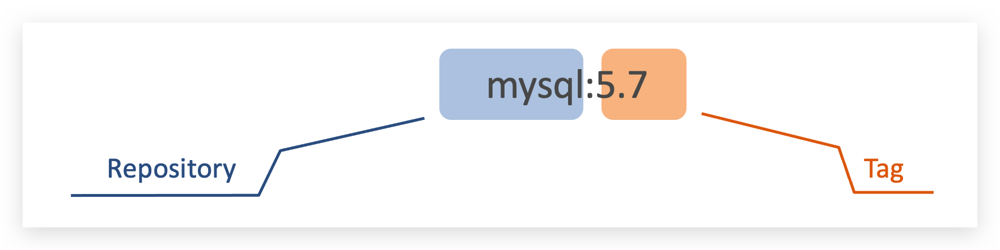

这里的mysql就是repository，5.7就是tag，合一起就是镜像名称，代表5.7版本的MySQL镜像。


### 6.2.1 镜像命令

- docker images	查看镜像
- docker rmi	删除镜像
- docker build	构建镜像
- docker push	推送镜像到服务
- docker pull	从服务拉取镜像
- docker save	保存镜像为一个tar压缩包
- docker load	加载tar压缩包为镜像


**注意**：命令的具体使用可以通过添加`--help`参数查询，比如查询load命令具体使用：`docker load --help`

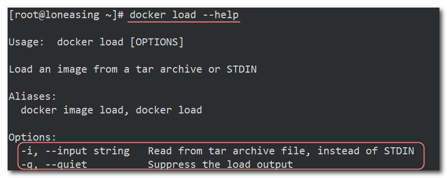


### 6.2.2 镜像操作案例

从DockerHub中拉取一个nginx镜像。

**(1) 首先去镜像仓库[DockerHub](https://hub.docker.com/)搜索nginx镜像**

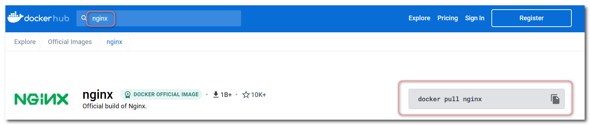

**(2) 拉取镜像：doker pull [镜像名称]**

不指定版本，默认拉取最新的latest版本

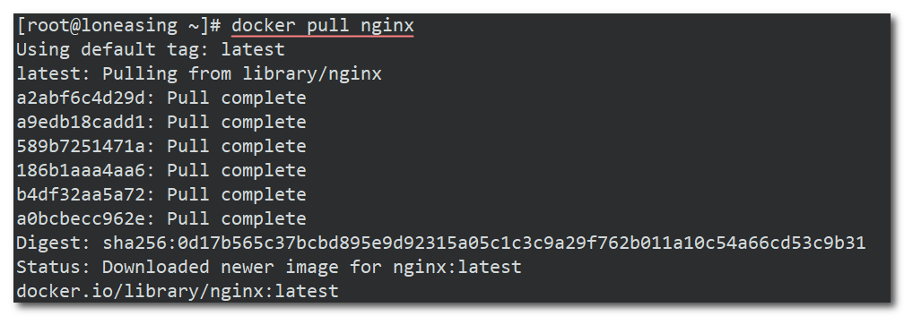

**(3) 查看镜像：docker images**

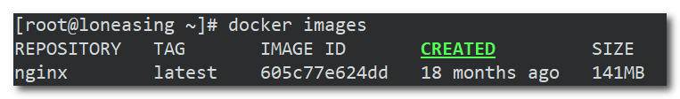

**(4) 保存镜像：docker save -o [目标文件名称] [镜像名称]**

```sh
docker save -o nginx.tar nginx:latest
```

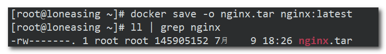

**(5) 删除镜像：docker rmi [镜像名称]**

```sh
docker rmi nginx:latest
```


**(6) 导入镜像：docker load -i [tar文件]**

```sh
docker load -i nginx.tar
```

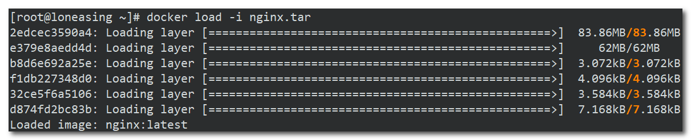


## 6.3 容器操作

### 6.3.1 容器操作命令

- docker run：创建并运行一个容器，处于运行状态
- docker pause：让一个运行的容器暂停
- docker unpause：让一个容器从暂停状态恢复运行
- docker stop：停止一个运行的容器
- docker start：让一个停止的容器再次运行

- docker rm：删除一个容器


容器保护三个状态：

- 运行：进程正常运行
- 暂停：进程暂停，CPU不再运行，并不释放内存
- 停止：进程终止，回收进程占用的内存、CPU等资源


### 6.3.2 容器操作案例

创建并运行nginx容器。

**(1) 创建并运行容器**

```sh
docker run --name myNginx -p 80:80 -d nginx
```

命令解读：

- docker run ：创建并运行一个容器
- --name : 给容器起一个名字，比如叫做myNginx
- -p ：将宿主机端口与容器端口映射，冒号左侧是宿主机端口，右侧是容器端口
- -d：后台运行容器
- nginx：镜像名称，例如nginx

这里的`-p`参数，是将容器端口映射到宿主机端口。

默认情况下，容器是隔离环境，我们直接访问宿主机的80端口，肯定访问不到容器中的nginx。

现在，将容器的80与宿主机的80关联起来，当我们访问宿主机的80端口时，就会被映射到容器的80，这样就能访问到nginx了：


启动成功返回一个容器id：

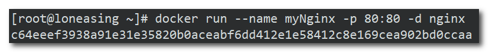

**(2) 查看所有运行的容器**

`docker ps` ，该命令仅查看运行中的容器。

`docker ps -a`，该命令可以查看所有的容器。

```sh
docker ps
docker ps -a
```

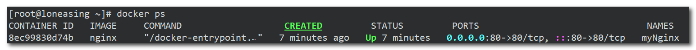

**(3) 进入容器内部修改文件**

**需求**：进入Nginx容器，修改HTML文件内容，添加“我在学习docker”

**提示**：进入容器要用到 docker exec 命令：`docker exec -it 容器名称 执行的命令`

1. 进入创建的nginx容器

   ```sh
   docker exec -it myNginx bash
   ```

   命令解读：

   - docker exec ：进入容器内部，执行一个命令

   - -it : 给当前进入的容器创建一个标准输入、输出终端，允许我们与容器交互

   - myNginx：要进入的容器的名称

   - bash：进入容器后执行的命令，bash是一个linux终端交互命令

2. 进入nginx的HTML所在目录

   ```sh
   cd /usr/share/nginx/html
   ```

   容器内部会模拟一个独立的Linux文件系统，看起来如同一个linux服务器一样，这个容器是个阉割版的Linux服务器，只携带跟镜像相关的文件。如下图所示，vi命令与nginx无关，所以该容器没有安装该命令。

   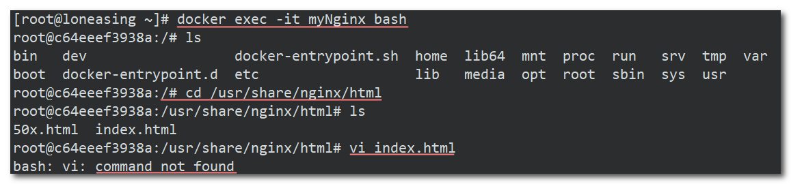

3. 修改index.html的内容

   容器内没有vi命令，无法直接修改，我们用下面的命令来修改：

   ```sh
   sed -i -e 's#Welcome to nginx#我在学习docker#g' -e 's#<head>#<head><meta charset="utf-8">#g' index.html
   ```

   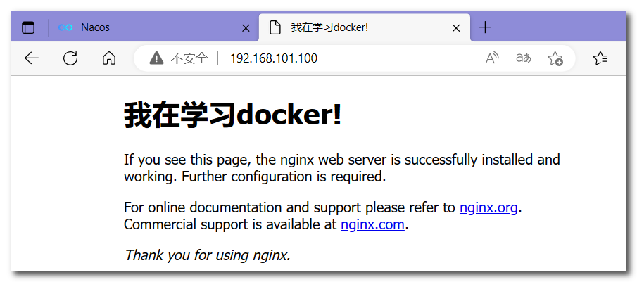

**(4) 删除容器**

`docker rm 容器名称`，该命令只能删除停止的容器。

`docker rm -f 容器名称`，改名可以强制删除指定的容器。

```sh
docker rm myNignx
docker rm -f myNginx
```

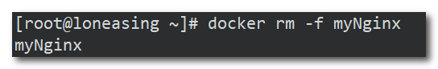


## 6.4 数据卷(容器数据管理)

在之前的nginx案例中，修改nginx的html页面时，需要进入nginx内部。并且因为没有编辑器，修改文件也很麻烦。

这就是因为容器与数据（容器内文件）耦合带来的后果。**数据卷（volume）**是一个虚拟目录，指向宿主机文件系统中的某个目录。

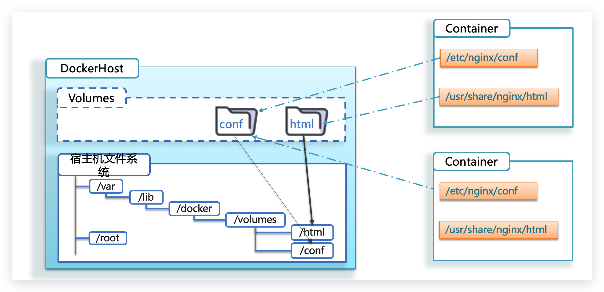

一旦完成数据卷挂载，对容器的一切操作都会作用在数据卷对应的宿主机目录了。

这样，我们操作宿主机的/var/lib/docker/volumes/html目录，就等于操作容器内的/usr/share/nginx/html目录了。

### 6.4.1 数据卷操作命令

数据卷操作的基本语法：`docker volume [COMMAND]`

docker volume命令是数据卷操作，根据命令后跟随的command来确定下一步的操作：

- docker volume create：创建数据卷
- docker volume ls：查看所有数据卷
- docker volume inspect：查看数据卷详细信息，包括关联的宿主机目录位置
- docker volume rm：删除指定数据卷
- docker volume prune：删除所有未使用的数据卷


### 6.4.2 创建和查看数据卷

 创建数据卷：`docker volume creat 数据卷名`，该数据卷会挂载到虚拟机的真实目录中。

```sh
docker volume create html
```

查看所有数据卷：

```sh
docker volume ls
```

查看数据卷详细信息：`docker volume inspect 数据卷名`

```sh
docker volume inspect html
```

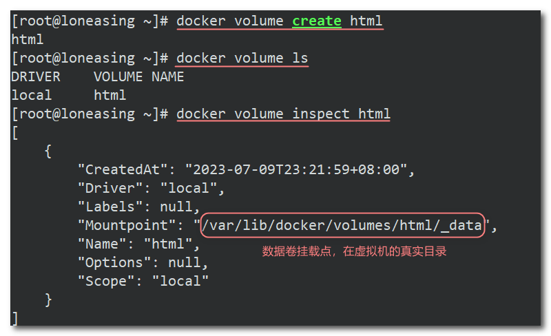


### 6.4.3 挂载数据卷

我们在创建容器时，可以通过 -v 参数将容器内的目录挂载到数据卷，这样访问虚拟机的真实目录也就是访问容器内的目录。

使用语法：`-v [数据卷名]:[需要挂载的目录]`

下面给nginx的html目录挂载数据卷：

①首先先删除已创建的nginx容器

```sh
docker rm -f myNginx
```

②创建容器并将容器内的/usr/share/nginx/html目录挂载到数据卷html，此时即使没有创建数据卷docker也会自动帮我们创建。

```sh
docker run --name myNginx -v html:/usr/share/nginx/html -p 80:80 -d nginx
```

③查看数据卷所在位置，查看该目录下的文件

```sh
# 查看html数据卷的位置
docker volume inspect html
# 查看该目录
ll /var/lib/docker/volumes/html/_data
```

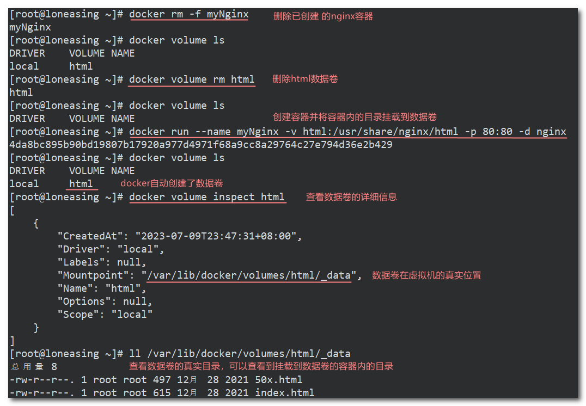


### 6.4.4 挂载本地目录

容器不仅仅可以挂载到数据卷，也可以直接挂载到宿主机目录上

**挂载本地目录的作用的用本地目录的文件覆盖所挂载的目录的文件**。关联关系如下：

- 挂载数据卷：宿主机目录 --> 数据卷 ---> 容器内目录
- 直接挂载目录：宿主机目录 ---> 容器内目录

挂载目录与挂载数据卷的语法是类似的：

- `-v [宿主机目录]:[容器内目录]`
- `-v [宿主机文件]:[容器内文件]`

**需求**：创建并运行一个MySQL容器，将宿主机目录直接挂载到容器

实现思路如下：

1）创建目录`/tmp/mysql/data`

2）创建目录`/tmp/mysql/conf`，将提供的hmy.cnf文件上传到/tmp/mysql/conf

3）下载mysql镜像

4）去DockerHub查阅资料，创建并运行MySQL容器，要求：

- 将mysql容器内数据存储目录：`/var/lib/mysql` 挂载到虚拟机目录 `/tmp/mysql/data`


- 将mysql容器的配置文件：`/etc/mysql/conf.d/hmy.cnf` 挂载到虚拟机目录下的文件 `/tmp/mysql/conf/hmy.cnf`


- 设置MySQL密码

```sh
docker run --name mysql -e MYSQL_ROOT_PASSWORD=123456 -p 3306:3306 \
-v /tmp/mysql/data:/var/lib/mysql \
-v /tmp/mysql/conf/hmy.cnf:/etc/mysql/conf.d/hmy.cnf \
-d mysql
```

挂载数据卷与直接挂载目录优缺点：

- 数据卷挂载耦合度低，由docker来管理目录，但是目录较深，不好找
- 目录挂载耦合度高，需要我们自己管理目录，不过目录容易寻找查看


## 6.5 自定义镜像

### 6.5.1 镜像结构

常见的镜像在DockerHub就能找到，但是我们自己写的项目就必须自己构建镜像了。

而要自定义镜像，就必须先了解镜像的结构才行，镜像是将应用程序及其需要的系统函数库、环境、配置、依赖打包而成。

以MySQL为例，来看看镜像的组成结构：


构建自定义的镜像时，并不需要一个个文件去拷贝，打包。我们只需要告诉Docker，我们的镜像的组成，需要哪些BaseImage、需要拷贝什么文件、需要安装什么依赖、启动脚本是什么，将来Docker会帮助我们构建镜像。而描述这些信息的文件就是Dockerfile文件。

**Dockerfile**就是一个文本文件，其中包含一个个的指令，用指令来说明要执行什么操作来构建镜像，每一个指令都会形成一层Layer。


下面是一个Dockerfile文件的内容示例：

```dockerfile
# 指定基础镜像
FROM ubuntu:16.04
# 配置环境变量，JDK的安装目录
ENV JAVA_DIR=/usr/local

# 拷贝jdk和java项目的包
COPY ./jdk8.tar.gz $JAVA_DIR/
COPY ./docker-demo.jar /tmp/app.jar

# 安装JDK
RUN cd $JAVA_DIR \
 && tar -xf ./jdk8.tar.gz \
 && mv ./jdk1.8.0_144 ./java8

# 配置环境变量
ENV JAVA_HOME=$JAVA_DIR/java8
ENV PATH=$PATH:$JAVA_HOME/bin

# 暴露端口
EXPOSE 8090
# 入口，java项目的启动命令
ENTRYPOINT java -jar /tmp/app.jar
```


### 6.5.2 构建java项目的镜像

**(1) 基于Ubuntu镜像构建一个java项目镜像**

- 新建一个空文件夹`docker-demo`
- 拷贝资料中的 `docker-demo.jar `文件到 `docker-demo` 文件夹
- 拷贝资料中的 `jdk8.tar.gz `文件到 `docker-demo` 文件夹
- 拷贝资料中的 `Dockerfile` 到 `docker-demo` 文件夹

Dockerfile文件的内容如下：

```dockerfile
# 指定基础镜像
FROM ubuntu:16.04
# 配置环境变量，JDK的安装目录
ENV JAVA_DIR=/usr/local

# 拷贝jdk和java项目的包
COPY ./jdk8.tar.gz $JAVA_DIR/
COPY ./docker-demo.jar /tmp/app.jar

# 安装JDK
RUN cd $JAVA_DIR \
 && tar -xf ./jdk8.tar.gz \
 && mv ./jdk1.8.0_144 ./java8

# 配置环境变量
ENV JAVA_HOME=$JAVA_DIR/java8
ENV PATH=$PATH:$JAVA_HOME/bin

# 暴露端口
EXPOSE 8090
# 入口，java项目的启动命令
ENTRYPOINT java -jar /tmp/app.jar
```

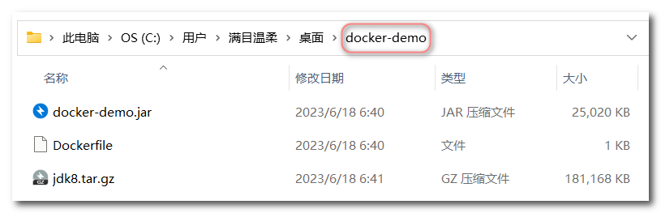

将docker-demo文件夹上传到虚拟机的任意目录，然后进入docker-demo目录下执行命令构建镜像：

`docker build -t [镜像名称] [Dockerfile文件所在目录]`

```sh
docker build -t javaweb:1.0 .
```

上述命令中javaweb:1.0为自定义的镜像名称，.表示Dockerfile文件所在的目录为当前目录。

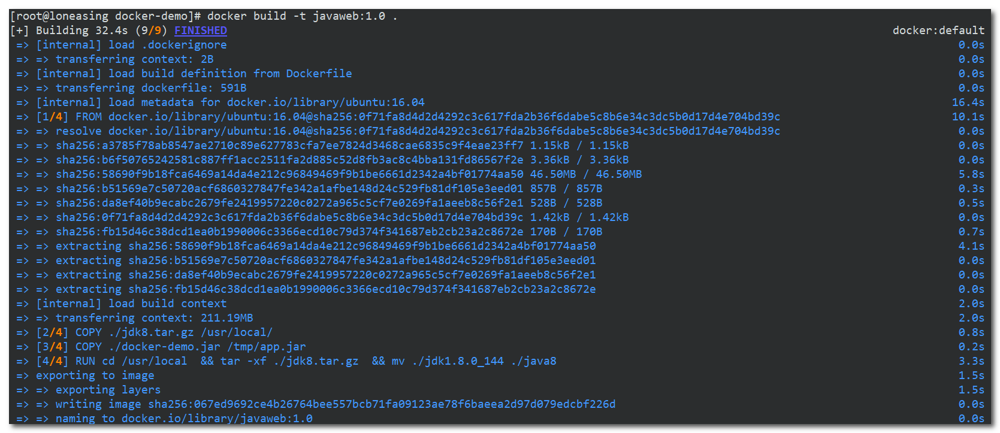

查看所有镜像，可以发现自定义的镜像也在docker仓库中了：

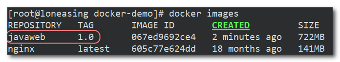

创建该镜像的容器：

```sh
docker run --name javaweb -p 8090:8090 -d javaweb:1.0 
```

最后访问 http://192.168.101.100:8090/hello/count

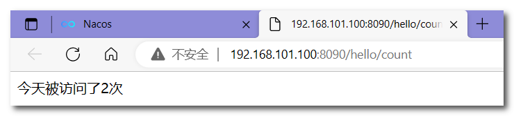


**(2) 基于java:8-alpine镜像构建Java项目镜像**

Java项目都需要依赖于JDK运行，所以每次创建镜像时都要导入JDK的包，并且配置环境变量，这些步骤非常枯燥。

可以基于java:8-alpine镜像将一个Java项目构建成一个镜像，java:8-alpine镜像中已经引入了jdk8并配置好了环境变量。

在基于Ubuntu镜像构建一个新镜像的基础上，只需要将Dockerfile文件进行修改，将基础的镜像改为java:8-alpine：

```dockerfile
FROM java:8-alpine
COPY ./app.jar /tmp/app.jar
EXPOSE 8090
ENTRYPOINT java -jar /tmp/app.jar
```

其他的操作与上述的操作一样。


## 6.6 DockerCompose

### 6.6.1 安装DockerCompose

**(1) 下载DockerCompose文件**

```sh
curl -L https://github.com/docker/compose/releases/download/1.23.1/docker-compose-`uname -s`-`uname -m` > /usr/local/bin/docker-compose
```

如果下载速度较慢，或者下载失败，可以使用资料提供的docker-compose文件，将其上传到`/usr/local/bin/`目录。

**(2) 修改文件权限**

```sh
chmod +x /usr/local/bin/docker-compose
```

**(3) Base自动补全命令**

```sh
curl -L https://raw.githubusercontent.com/docker/compose/1.29.1/contrib/completion/bash/docker-compose > /etc/bash_completion.d/docker-compose
```

如果这里出现错误，需要修改自己的hosts文件：

```sh
echo "199.232.68.133 raw.githubusercontent.com" >> /etc/hosts
```


### 6.6.2 部署微服务集群

利用DockerCompose部署之前学习的cloud-demo微服务集群。

**实现思路**：

① 查看资料提供的cloud-demo文件夹，里面已经编写好了docker-compose.yml文件

② 修改自己的cloud-demo项目，将数据库、nacos地址都命名为docker-compose中的服务名

③ 使用maven打包工具，将项目中的每个微服务都打包为app.jar

④ 将打包好的app.jar拷贝到cloud-demo中的每一个对应的子目录中

⑤ 将cloud-demo上传至虚拟机，利用 docker-compose up -d 来部署

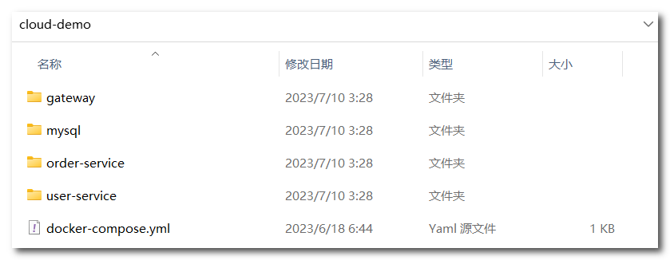

**(1) 编写docker-compose.yml文件**

```yml
version: "3.2"

services:
  nacos:
    image: nacos/nacos-server
    environment:
      MODE: standalone
    ports:
      - "8848:8848"
  mysql:
    image: mysql:5.7.25
    environment:
      MYSQL_ROOT_PASSWORD: 123
    volumes:
      - "$PWD/mysql/data:/var/lib/mysql"
      - "$PWD/mysql/conf:/etc/mysql/conf.d/"
  userservice:
    build: ./user-service
  orderservice:
    build: ./order-service
  gateway:
    build: ./gateway
    ports:
      - "10010:10010"
```

可以看到，其中包含5个service服务：

- `nacos`：作为注册中心和配置中心
  - `image: nacos/nacos-server`： 基于nacos/nacos-server镜像构建
  - `environment`：环境变量
    - `MODE: standalone`：单点模式启动
  - `ports`：端口映射，这里暴露了8848端口
- `mysql`：数据库
  - `image: mysql:5.7.25`：镜像版本是mysql:5.7.25
  - `environment`：环境变量
    - `MYSQL_ROOT_PASSWORD: 123456`：设置数据库root账户的密码为123456
  - `volumes`：数据卷挂载，这里挂载了mysql的data、conf目录，其中有我提前准备好的数据
- `userservice`、`orderservice`、`gateway`：都是基于Dockerfile临时构建的


**(2) 为每个微服务编写Dckerfile文件，内容如下**

```dockerfile
FROM java:8-alpine
COPY ./app.jar /tmp/app.jar
ENTRYPOINT java -jar /tmp/app.jar
```

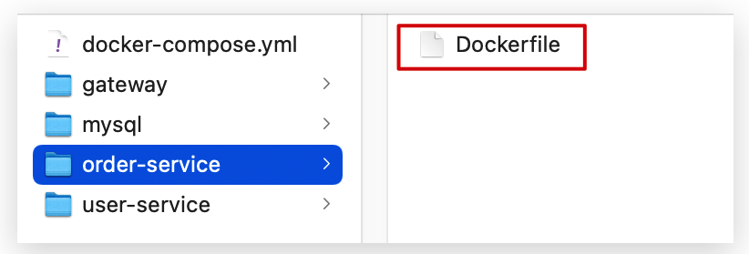


**(3) 导入mysql的数据和配置**

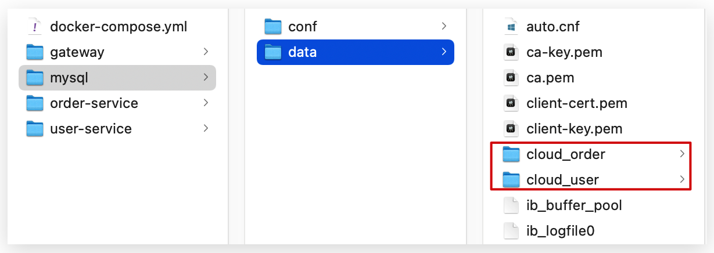


**(4) 修改微服务配置**

因为微服务将来要部署为docker容器，而容器之间互联不是通过IP地址，而是通过容器名。这里我们将order-service、user-service、gateway服务的mysql、nacos地址都修改为基于容器名的访问。如下所示：

```yml
spring:
  datasource:
    url: jdbc:mysql://mysql:3306/cloud_order?useSSL=false
    username: root
    password: 123
    driver-class-name: com.mysql.jdbc.Driver
  application:
    name: orderservice
  cloud:
    nacos:
      server-addr: nacos:8848 # nacos服务地址
```


**(5) 打包**

编写的Dockerfile中的jar包名称都是app.jar，因此我们的每个微服务都需要用这个名称。

可以通过修改pom.xml中的打包名称来实现，每个微服务都需要设置，然后使用maven打包工具打包。

```xml
<build>
  <!-- 服务打包的最终名称 -->
  <finalName>app</finalName>
  <plugins>
    <plugin>
      <groupId>org.springframework.boot</groupId>
      <artifactId>spring-boot-maven-plugin</artifactId>
    </plugin>
  </plugins>
</build>
```


**(6) 拷贝jar包到部署目录**

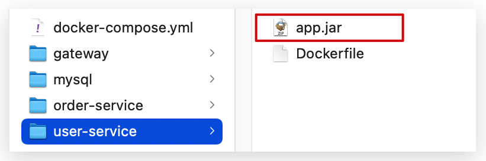

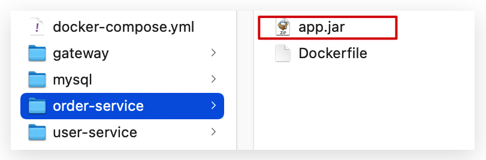

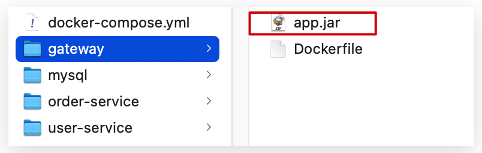


**(7) 部署**

我们需要将文件整个cloud-demo文件夹上传到虚拟机中，由DockerCompose部署.

进入cloud-demo目录，然后运行下面的命令：

```sh
docker-compose up -d 	#up表示创建并启动容器
```

DockerCompose相关命令：

- 停止某个容器：docker-compose stop 容器名
- 启动某个容器：docker-compose start 容器名


# 7. MQ

MQ是消息队列（Message Queue）的缩写，它是一种在分布式系统中用于实现异步通信的中间件技术。消息队列允许应用程序通过发送和接收消息来进行解耦、异步通信和可靠性传输。

在消息队列系统中，消息的发送者称为生产者（Producer），消息的接收者称为消费者（Consumer），而消息则被存储在一个中间组件（消息队列）中。生产者将消息发送到消息队列，而消费者则从消息队列中接收并处理消息。

以下是消息队列的一些主要特点和优势：

1. 异步通信：通过消息队列，生产者可以将消息发送到队列而无需等待消费者的实时响应。这种异步通信模式可以提高系统的吞吐量和响应速度。

2. 解耦和可扩展性：消息队列解耦了生产者和消费者之间的直接依赖关系，使得系统组件之间的通信更加灵活和可扩展。新的消费者可以根据需要订阅感兴趣的消息，而无需修改生产者的代码。

3. 消息持久化：消息队列通常会将消息持久化到磁盘，以确保即使在发生故障或重启后，消息也不会丢失。这使得消息队列在可靠性传输和数据保护方面非常有用。

4. 可靠性传输：通过消息队列，生产者可以确保消息可靠地发送到消息队列中，并由消息队列确保消息被正确地传递给消费者。这种可靠性传输机制可以提高系统的可靠性和稳定性。

5. 削峰填谷：消息队列可以在生产者和消费者之间起到缓冲的作用，从而使系统能够处理突发的高峰流量。消息队列可以暂存消息并按照消费者的处理能力逐渐消化消息，以避免系统过载。

6. 消息分发：消息队列可以根据预设的规则和策略将消息分发给不同的消费者。这使得实现消息广播、消息订阅和消息路由等复杂的消息分发模式变得更加简单。

常见的消息队列系统包括Apache Kafka、RabbitMQ、ActiveMQ、Redis等。它们提供了丰富的特性和功能，可根据具体需求选择适合的消息队列实现。


## 7.1 RabbitMQ

RabbitMQ中的一些角色：

- publisher：生产者
- consumer：消费者
- exchange个：交换机，负责消息路由
- queue：队列，存储消息
- virtualHost：虚拟主机，隔离不同租户的exchange、queue、消息的隔离


### 7.1.1 安装RabbitMQ

我们在Centos7虚拟机中使用Docker来安装。

**(1) 拉取镜像**

```
docker pull rabbitmq:3.9
```

**(2) 创建并启动RabbitMQ容器**

```sh
docker run \
 -e RABBITMQ_DEFAULT_USER=root \
 -e RABBITMQ_DEFAULT_PASS=123456 \
 --name mq \
 --hostname mq1 \
 -p 15672:15672 \
 -p 5672:5672 \
 -d \
 rabbitmq:3.9-management
```

上述命令中15672端口是一个访问管理界面的端口，5672端口是用于消息通讯的端口。

**(3) 浏览器访问管理界面：192.168.101.100:15672**

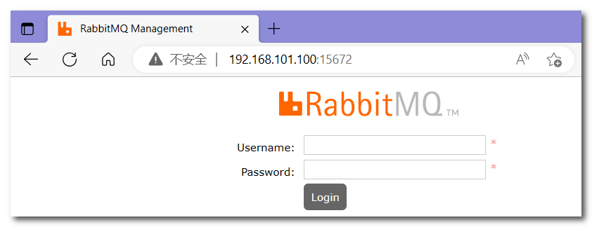


### 7.1.2 RabbitMQ消息模型


### 7.1.3 基本队列模型案例

简单队列模式的模型图：


官方的HelloWorld是基于最基础的消息队列模型来实现的，只包括三个角色：

- publisher：消息发布者，将消息发送到队列queue
- queue：消息队列，负责接受并缓存消息
- consumer：订阅队列，处理队列中的消息


下面创建一个java工程实现基本消息队列模型：

导入资料中的mq-demo项目

该项目的结构：

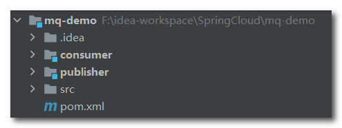

其中父工程中导入了AMQP的启动器，它包含了RabbitMQ的依赖：

```xml
<!--AMQP依赖，包含RabbitMQ-->
<dependency>
    <groupId>org.springframework.boot</groupId>
    <artifactId>spring-boot-starter-amqp</artifactId>
</dependency>
```

**publisher实现**

- 建立连接
- 创建Channel
- 声明队列
- 发送消息
- 关闭连接和channel

```java 
package com.springcloud.mq.helloworld;

import com.rabbitmq.client.Channel;
import com.rabbitmq.client.Connection;
import com.rabbitmq.client.ConnectionFactory;
import org.junit.Test;

import java.io.IOException;
import java.util.concurrent.TimeoutException;

public class PublisherTest {
    @Test
    public void testSendMessage() throws IOException, TimeoutException {
        // 1.建立连接
        ConnectionFactory factory = new ConnectionFactory();
        // 1.1.设置连接参数，分别是：主机名、端口号、vhost、用户名、密码
        factory.setHost("192.168.101.100");
        factory.setPort(5672);
        factory.setVirtualHost("/");
        factory.setUsername("root");
        factory.setPassword("123456");
        // 1.2.建立连接
        Connection connection = factory.newConnection();

        // 2.创建通道Channel
        Channel channel = connection.createChannel();

        // 3.创建队列
        String queueName = "simple.queue";
        channel.queueDeclare(queueName, false, false, false, null);

        // 4.发送消息
        String message = "hello, rabbitmq!";
        channel.basicPublish("", queueName, null, message.getBytes());
        System.out.println("发送消息成功：【" + message + "】");

        // 5.关闭通道和连接
        channel.close();
        connection.close();

    }
}
```


**consumer实现**

- 建立连接
- 创建Channel
- 声明队列
- 订阅消息

```java 
package com.springcloud.mq.helloworld;

import com.rabbitmq.client.*;

import java.io.IOException;
import java.util.concurrent.TimeoutException;

public class ConsumerTest {

    public static void main(String[] args) throws IOException, TimeoutException {
        // 1.建立连接
        ConnectionFactory factory = new ConnectionFactory();
        // 1.1.设置连接参数，分别是：主机名、端口号、vhost、用户名、密码
        factory.setHost("192.168.101.100");
        factory.setPort(5672);
        factory.setVirtualHost("/");
        factory.setUsername("root");
        factory.setPassword("123456");
        // 1.2.建立连接
        Connection connection = factory.newConnection();

        // 2.创建通道Channel
        Channel channel = connection.createChannel();

        // 3.创建队列
        String queueName = "simple.queue";
        channel.queueDeclare(queueName, false, false, false, null);

        // 4.订阅消息
        channel.basicConsume(queueName, true, new DefaultConsumer(channel){
            @Override
            public void handleDelivery(String consumerTag, Envelope envelope,
                                       AMQP.BasicProperties properties, byte[] body) throws IOException {
                // 5.处理消息
                String message = new String(body);
                System.out.println("接收到消息：【" + message + "】");
            }
        });
        System.out.println("等待接收消息。。。。");
    }
}
```


## 7.2 SpringAMQP

Spring AMQP是一个基于Spring框架的开源消息中间件框架，用于在应用程序中实现与AMQP（Advanced Message Queuing Protocol）兼容的消息传递。它提供了简化和抽象化的API，使得在使用AMQP协议的消息队列系统（如RabbitMQ）中发送和接收消息变得更加容易和高效。

SpringAMQP提供了三个功能：

- 自动声明队列、交换机及其绑定关系
- 基于注解的监听器模式，异步接收消息
- 封装了RabbitTemplate工具，用于发送消息 


下面基于SpringAMQ实现物种消息模型：

### 7.2.1 Simple Mode

Simple Mode，简单模式。在简单模式下，一个生产者向一个消费者发送消息。消息发送到队列，然后被一个消费者接收并处理。这是最基本的消息模型，适用于简单的单向通信。

在父工程mq-demo中引入依赖：

```xml
<!--AMQP依赖，包含RabbitMQ-->
<dependency>
    <groupId>org.springframework.boot</groupId>
    <artifactId>spring-boot-starter-amqp</artifactId>
</dependency>
```

**(1) 消息发送**

首先配置MQ地址，在publisher服务的application.yml中添加配置：

```yml
spring:
  rabbitmq:
    host: 192.168.101.100 # 主机名
    port: 5672 # 端口
    virtual-host: / # 虚拟主机
    username: root # 用户名
    password: 123456 # 密码
```

然后在publisher服务中编写测试类SpringAmqpTest，并利用 `RabbitTemplate` 调用 `convertAndSend` 方法实现消息发送：

```Java
@SpringBootTest
public class SpringAmqpTest {

    @Resource
    private RabbitTemplate rabbitTemplate;

    @Test
    public void testSimpleQueue() {
        // 队列名称（这个队列要提前创建好）
        String queueName = "simple.queue";
        // 消息
        String message = "hello, spring amqp!";
        // 发送消息
        rabbitTemplate.convertAndSend(queueName, message);
    }
}
```

**(2) 消息接收**

首先配置MQ地址，在consumer服务的application.yml中添加配置：

```yaml
spring:
  rabbitmq:
    host: 192.168.101.100 # 主机名
    port: 5672 # 端口
    virtual-host: / # 虚拟主机
    username: root # 用户名
    password: 123456 # 密码
```

在consumer服务的`com.springcloud.listener`包中新建一个类SpringRabbitListener，代码如下；

> 注意： 消费者方法接收的参数即是发布者发出的消息，所以声明参数时要根据发布者发出的消息类型声明参数。

```java 
@Component
public class SpringRabbitListener {
    @RabbitListener(queues = "simple.queue")
    public void listenSimpleQueueMessage(String msg) throws InterruptedException {
        System.out.println("spring 消费者接收到消息：【" + msg + "】");
    }
}
```

`@RabbitListener` 是Spring AMQP提供的一个注解，用于在应用程序中创建消息监听器，用于接收和处理从RabbitMQ等消息队列系统中接收到的消息。

通过在方法上添加 `@RabbitListener` 注解，你可以将方法标记为消息监听器，并指定要监听的队列或交换机。当消息到达指定的队列或交换机时，注解所标记的方法将被自动触发执行，用于处理接收到的消息。

`@RabbitListener` 注解的常用属性包括：

1. `queues`：指定要监听的队列名称。可以指定一个或多个队列。当有消息到达指定队列时，注解所标记的方法将被调用。
2. `bindings`：指定要监听的交换机和路由键的绑定关系。可以指定一个或多个绑定关系。当有符合绑定关系的消息到达时，注解所标记的方法将被调用。
3. `containerFactory`：指定要使用的消息监听容器工厂。可用于配置消息监听器的相关属性，如线程池大小、消费者数等。
4. `id`：指定监听器的唯一标识符。

使用 `@RabbitListener` 注解时，你需要确保已配置了适当的 RabbitMQ 连接工厂和消息监听容器。Spring AMQP会根据注解所提供的配置信息创建消息监听器，并将其注册到消息监听容器中。当消息到达时，消息监听器将被触发执行。


### 7.2.2 Work Queue Mode

Work queues，工作队列模式，也被称为（Task queues），任务模型。

简单来说就是**让多个消费者绑定到一个队列，共同消费队列中的消息**。

当消息处理比较耗时的时候，可能生产消息的速度会远远大于消息的消费速度。长此以往，消息就会堆积越来越多，无法及时处理。

此时就可以使用work 模型，多个消费者共同处理消息处理，速度就能大大提高了。


**(1) 消息发送**

这次我们循环发送，模拟大量消息堆积现象。

在publisher服务中的SpringAmqpTest类中添加一个测试方法：

```java
/**
 * workQueue
 * 向队列中不停发送消息，模拟消息堆积。
 */
@Test
public void testWorkQueue() throws InterruptedException {
    // 队列名称
    String queueName = "simple.queue";
    // 消息
    String message = "hello, message_";
    for (int i = 0; i < 50; i++) {
        // 发送消息
        rabbitTemplate.convertAndSend(queueName, message + i);
        Thread.sleep(20);
    }
}
```


**(2) 消息接收**

要模拟多个消费者绑定同一个队列，我们在consumer服务的SpringRabbitListener中添加2个新的方法：

```Java
@RabbitListener(queues = "simple.queue")
public void listenWorkQueue1(String msg) throws InterruptedException {
    System.out.println("消费者1接收到消息：【" + msg + "】" + LocalTime.now());
    Thread.sleep(20);
}

@RabbitListener(queues = "simple.queue")
public void listenWorkQueue2(String msg) throws InterruptedException {
    System.err.println("消费者2........接收到消息：【" + msg + "】" + LocalTime.now());
    Thread.sleep(200);
}
```

启动ConsumerApplication后，在执行publisher服务中刚刚编写的测试方法testWorkQueue。

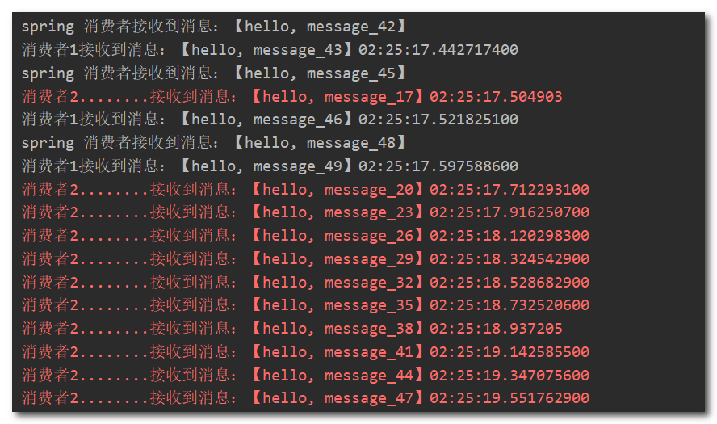

可以看到消费者1很快完成了自己的25条消息，消费者2却在缓慢的处理自己的25条消息。

也就是说消息是平均分配给每个消费者，并没有考虑到消费者的处理能力，这样显然是有问题的。

在spring中有一个简单的配置，可以解决这个问题。修改consumer服务的application.yml文件，添加配置：

```yaml
spring:
  rabbitmq:
    listener:
      simple:
        prefetch: 1 # 每次只能获取一条消息，处理完成才能获取下一个消息
```

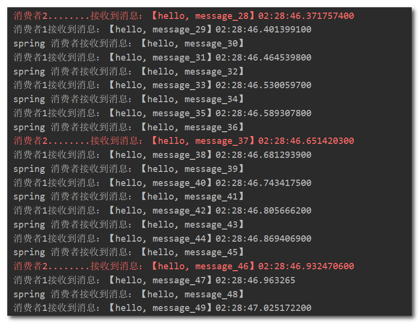


### 7.2.3 Publish/Subscribe Mode

Publish/Subscribe Mode，发布订阅模式。在发布/订阅模式中，一个生产者发送消息到一个交换机，交换机将消息广播到多个绑定的队列。多个消费者分别从各自的队列接收消息。这种模式用于广播消息给多个消费者。


在订阅模型中，多了一个exchange角色，而且过程略有变化：

- Publisher：生产者，也就是要发送消息的程序，但是不再发送到队列中，而是发给交换机。
- Exchange：交换机。接收生产者发送的消息，将消息广播到多个绑定的队列，Exchange有以下3种类型：
  - **Fanout**：广播，将消息交给所有绑定到交换机的队列。
  - **Direct**：定向，把消息交给符合指定routing key 的队列。
  - **Topic**：通配符，把消息交给符合routing pattern（路由模式） 的队列。
- Consumer：消费者，与以前一样，订阅队列，没有变化。
- Queue：消息队列也与以前一样，接收消息、缓存消息。


Spring提供了一个接口Exchange，来表示所有不同类型的交换机：

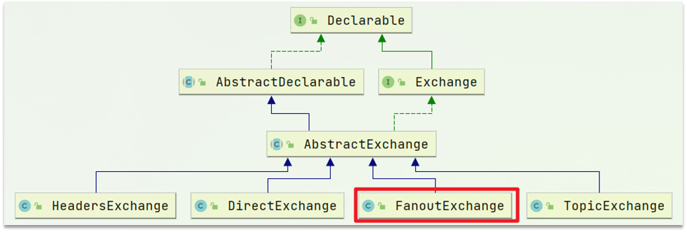


#### Fanout

Fanout，广播模式。广播模式的特点：

- 可以有多个队列
- 每个队列都要绑定到Exchange（交换机）
- 生产者发送的消息，只能发送到交换机，交换机来决定要发给哪个队列，生产者无法决定
- 交换机把消息发送给绑定过的所有队列
- 订阅队列的消费者都能拿到消息

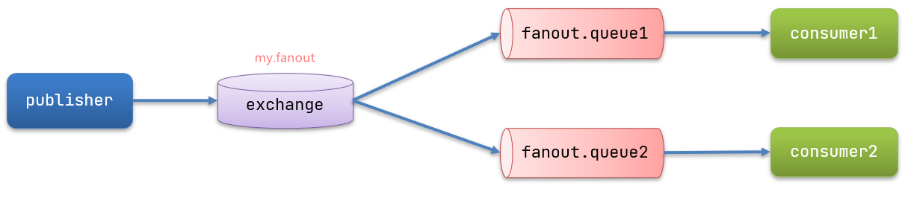

下面介绍Fanout交换机的使用：

- 创建一个FanoutExchange类型的交换机，取名为my.fanout

- 创建两个队列fanout.queue1和fanout.queue2，绑定到交换机my.fanout


**声明交换机和队列**

在consumer中创建一个类，声明队列和交换机：

```Java
@Configuration
public class FanoutConfig {
    /**
     * 声明交换机
     * @return Fanout类型交换机
     */
    @Bean
    public FanoutExchange fanoutExchange(){
        return new FanoutExchange("my.fanout");
    }

    /**
     * 第1个队列
     */
    @Bean
    public Queue fanoutQueue1(){
        return new Queue("fanout.queue1");
    }

    /**
     * 绑定队列和交换机
     */
    @Bean
    public Binding bindingQueue1(Queue fanoutQueue1, FanoutExchange fanoutExchange){
        return BindingBuilder.bind(fanoutQueue1).to(fanoutExchange);
    }

    /**
     * 第2个队列
     */
    @Bean
    public Queue fanoutQueue2(){
        return new Queue("fanout.queue2");
    }

    /**
     * 绑定队列和交换机
     */
    @Bean
    public Binding bindingQueue2(Queue fanoutQueue2, FanoutExchange fanoutExchange){
        return BindingBuilder.bind(fanoutQueue2).to(fanoutExchange);
    }
}
```

**消息发送**

在publisher服务的SpringAmqpTest类中添加测试方法：

```Java
@Test
public void testFanoutExchange() {
    // 队列名称
    String exchangeName = "my.fanout";
    // 消息
    String message = "广播模式！";
    rabbitTemplate.convertAndSend(exchangeName, "", message); // 第二个参数是路由键，这种交换机还不需要设置
}
```

**消息接收**

在consumer服务的SpringRabbitListener中添加两个方法，作为消费者：

```java
@RabbitListener(queues = "fanout.queue1")
public void listenFanoutQueue1(String msg) {
    System.out.println("消费者1接收到Fanout消息：【" + msg + "】");
}

@RabbitListener(queues = "fanout.queue2")
public void listenFanoutQueue2(String msg) {
    System.out.println("消费者2接收到Fanout消息：【" + msg + "】");
}
```

控制台查看结果：

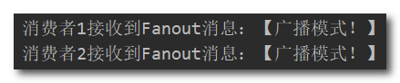


#### Direct

Direct，路由模式。但是在某些场景下，我们希望不同的消息被不同的队列消费。这时就要用到Direct类型的Exchange。

Direct模型的特点：

- 队列与交换机的绑定，不能是任意绑定了，而是要指定一个`RoutingKey`（路由键）
- 消息的发送方在 向 Exchange发送消息时，也必须指定消息的 `RoutingKey`。
- Exchange不再把消息交给每一个绑定的队列，而是根据消息的`Routing Key`进行判断，只有队列的`Routingkey`与消息的 `Routing key`完全一致，才会接收到消息。


下面介绍Direct交换机的使用：

1. 利用@RabbitListener声明Exchange、Queue、RoutingKey。
2. 在consumer服务中，编写两个消费者方法，分别监听direct.queue1和direct.queue2。
3. 在publisher中编写测试方法，向交换机my. direct发送消息。

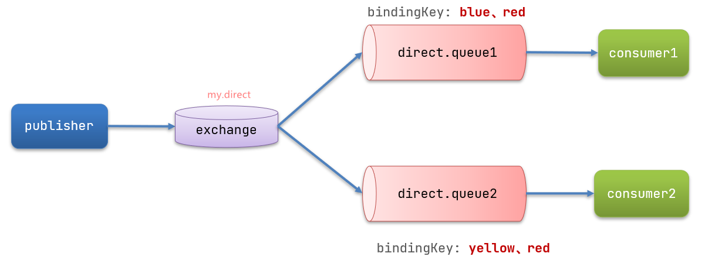

**基于注解声明队列和交换机**

基于@Bean的方式声明队列和交换机比较麻烦，Spring还提供了基于注解方式来声明。

在consumer的SpringRabbitListener中添加两个消费者，同时基于注解来声明队列和交换机：

```Java
@RabbitListener(bindings = @QueueBinding(
    value = @Queue(name = "direct.queue1"),
    exchange = @Exchange(name = "my.direct", type = ExchangeTypes.DIRECT),
    key = {"red", "blue"}
))
public void listenDirectQueue1(String msg){
    System.out.println("消费者接收到direct.queue1的消息：【" + msg + "】");
}

@RabbitListener(bindings = @QueueBinding(
    value = @Queue(name = "direct.queue2"),
    exchange = @Exchange(name = "my.direct", type = ExchangeTypes.DIRECT),
    key = {"red", "yellow"}
))
public void listenDirectQueue2(String msg){
    System.out.println("消费者接收到direct.queue2的消息：【" + msg + "】");
}
```

**消息发送**

在publisher服务的SpringAmqpTest类中添加测试方法：

```Java
@Test
public void testSendDirectExchange() {
    // 交换机名称
    String exchangeName = "my.direct";
    // 消息
    String message = "路由模式！";
    // 发送消息
    rabbitTemplate.convertAndSend(exchangeName, "red", message); // 第二个参数是路由键
}
```

查看结果，设置不同的路由键，消息会发送给绑定了对应路由键的队列：

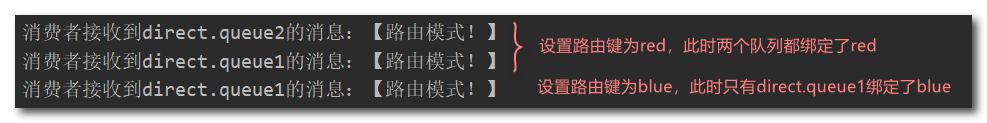


#### Topic

Topic，主题模式。Topic类型的Exchange与Direct相比，都是可以根据RoutingKey把消息路由到不同的队列。只不过Topic类型Exchange可以让队列在绑定Routingkey 的时候使用通配符。

`Routingkey` 一般都是有一个或多个单词组成，多个单词之间以”.”分割，例如： `item.insert`

 通配符规则：

- `#`：匹配一个或多个词

- `*`：匹配1个词


解释：

- Queue1：绑定的是`china.#` ，因此凡是以 `china.`开头的`routing key` 都会被匹配到。包括china.news和china.weather
- Queue2：绑定的是`#.news` ，因此凡是以 `.news`结尾的 `routing key` 都会被匹配。包括china.news和japan.news


下面介绍Topic交换机的使用：

1. 利用@RabbitListener声明Exchange、Queue、RoutingKey

2. 在consumer服务中，编写两个消费者方法，分别监听topic.queue1和topic.queue2

3. 在publisher中编写测试方法，向my. topic发送消息

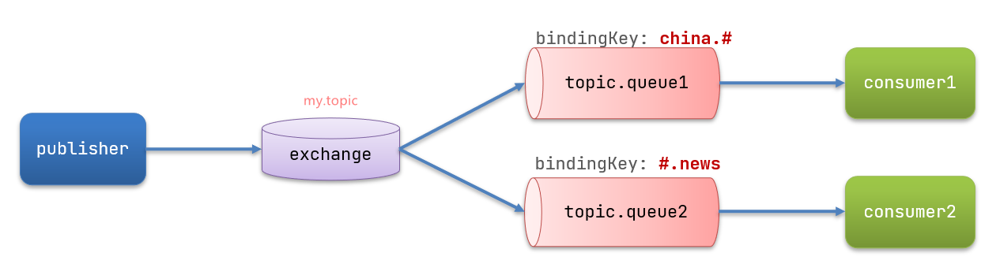

**消息发送**

在publisher服务的SpringAmqpTest类中添加测试方法：

```Java
/**
 * topicExchange
 */
@Test
public void testSendTopicExchange() {
    // 交换机名称
    String exchangeName = "my.topic";
    // 消息
    String message = "主题模式！";
    // 发送消息
    rabbitTemplate.convertAndSend(exchangeName, "china.news", message);
}
```

**消息接收**

在consumer服务的SpringRabbitListener中添加方法：

```Java
@RabbitListener(bindings = @QueueBinding(
    value = @Queue(name = "topic.queue1"),
    exchange = @Exchange(name = "my.topic", type = ExchangeTypes.TOPIC),
    key = "china.#"
))
public void listenTopicQueue1(String msg){
    System.out.println("消费者接收到topic.queue1的消息：【" + msg + "】");
}

@RabbitListener(bindings = @QueueBinding(
    value = @Queue(name = "topic.queue2"),
    exchange = @Exchange(name = "my.topic", type = ExchangeTypes.TOPIC),
    key = "#.news"
))
public void listenTopicQueue2(String msg){
    System.out.println("消费者接收到topic.queue2的消息：【" + msg + "】");
}
```

查看结果：

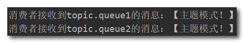


Direct交换机与Topic交换机的差异:

- Topic交换机接收的消息RoutingKey必须是多个单词，以 `.` 分割
- Topic交换机与队列绑定时的bindingKey可以指定通配符
- `#`：代表0个或多个词
- `*`：代表1个词


### 7.2.4 消息转换器

Spring会将发送的消息序列化为字节发送给MQ，接收消息的时候，还会把字节反序列化为Java对象。

默认情况下Spring采用的序列化方式是JDK序列化，JDK序列化存在下列问题：

- 数据体积过大
- 有安全漏洞
- 可读性差

**测试默认转换器**

首先在配置类中声明一个队列：

```Java
@Bean
public Queue objectQuene(){
    return new Queue("object.queue");
}
```

修改消息发送的代码，发送一个Map对象：

```Java
@Test
public void testSendMap() throws InterruptedException {
    // 准备消息
    Map<String,Object> msg = new HashMap<>();
    msg.put("name", "Jack");
    msg.put("age", 21);
    // 发送消息
    rabbitTemplate.convertAndSend("object.queue","", msg);
}
```

发送消息后查看rabbitmq控制面板：

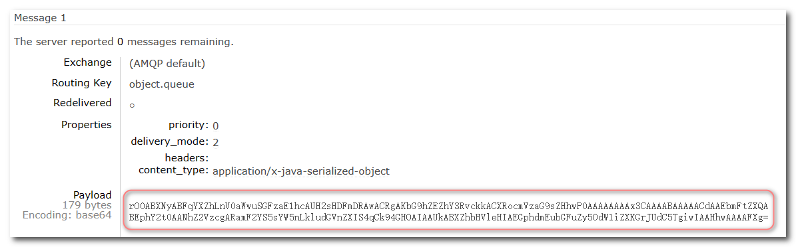

**配置JSON转换器**

显然，JDK序列化方式并不合适。我们希望消息体的体积更小、可读性更高，因此可以使用JSON方式来做序列化和反序列化。

在publisher和consumer两个服务中都引入依赖：

```xml
<dependency>
    <groupId>com.fasterxml.jackson.core</groupId>
    <artifactId>jackson-databind</artifactId>
    <version>2.15.0</version>
</dependency>
```

在publisher和consumer两个服务中的启动类或者配置类中添加一个消息转换器的Bean：

```Java
@Bean
public MessageConverter jsonMessageConverter(){
    return new Jackson2JsonMessageConverter();
}
```

在consumer服务的SpringRabbitListener中添加方法：

```Java
@RabbitListener(queues = "object.queue")
public void listenObjectQueue(Map<String,Object> msg) throws InterruptedException {
    System.err.println("收到消息：【" + msg + "】" );
}
```

发送的消息：

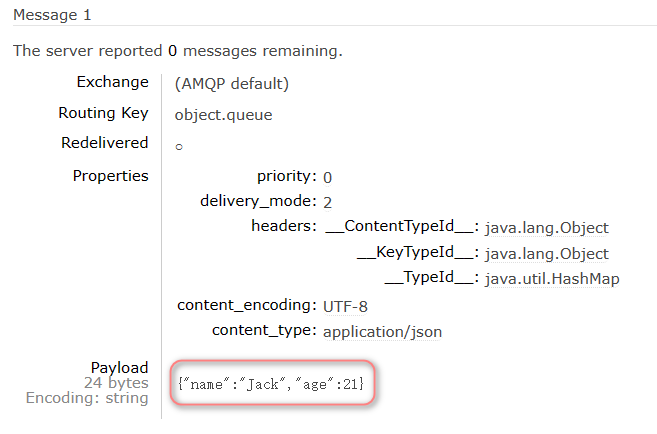

接收到的消息：

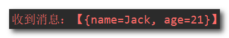


## 7.3 消息可靠性

消息从发送，到消费者接收，会经理多个过程：


其中的每一步都可能导致消息丢失，常见的丢失原因包括：

- 发送时丢失：
  - 生产者发送的消息未送达exchange
  - 消息到达exchange后未到达queue
- MQ宕机，queue将消息丢失
- consumer接收到消息后未消费就宕机


针对这些问题，RabbitMQ分别给出了解决方案：

- 生产者确认机制
- mq持久化
- 消费者确认机制
- 失败重试机制


下面我们就通过案例来演示每一个步骤。

首先，导入资料提供的demo工程：


项目结构如下：

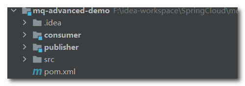

### 7.3.1 生产者消息确认

RabbitMQ提供了publisher confirm机制来避免消息发送到MQ过程中丢失。这种机制必须给每个消息指定一个唯一ID。消息发送到MQ以后，会返回一个结果给发送者，表示消息是否处理成功。

返回结果有两种方式：

- publisher-confirm，发送者确认
  - 消息成功投递到交换机，返回ack
  - 消息未投递到交换机，返回nack
- publisher-return，发送者回执
  - 消息投递到交换机了，但是没有路由到队列。返回ACK，及路由失败原因。

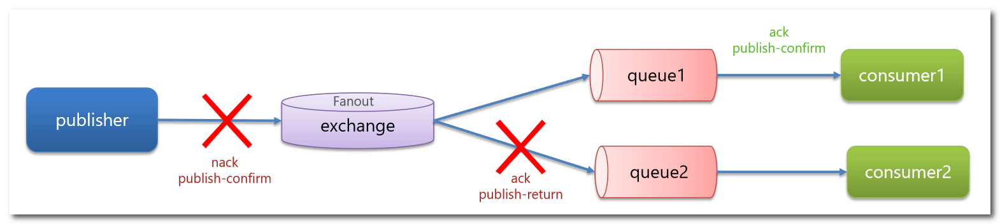

确认机制发送消息时，需要给消息设置一个全局唯一id，以区分不同消息，避免ack冲突。


#### 修改配置

首先，修改publisher服务中的application.yml文件，添加下面的内容：

```yaml
spring:
  rabbitmq:
    publisher-confirm-type: correlated
    publisher-returns: true
    template:
      mandatory: true
```

说明：

- `publish-confirm-type`：开启publisher-confirm，这里支持两种类型：
  - `simple`：同步等待confirm结果，直到超时。
  - `correlated`：异步回调。定义 `ConfirmCallback`，MQ返回结果时会回调这个 `ConfirmCallback`。
- `publish-returns`：开启publish-return功能，同样是基于callback机制，不过是定义 `ReturnCallback`。
- `template.mandatory`：定义消息路由失败时的策略。true，则调用ReturnCallback；false：则直接丢弃消息。

注意两种callback的创建方式不同。


#### 定义Return回调

每个RabbitTemplate只能配置一个ReturnCallback，因此需要在项目加载时配置：可以实现ApplicationContextAware接口。

修改publisher服务，在config包下添加一个配置类：

```java
@Slf4j
@Configuration
public class CommonConfig implements ApplicationContextAware {
    @Override
    public void setApplicationContext(ApplicationContext applicationContext) throws BeansException {
        // 获取RabbitTemplate
        RabbitTemplate rabbitTemplate = applicationContext.getBean(RabbitTemplate.class);
        // 设置ReturnCallback
        rabbitTemplate.setReturnCallback((message, replyCode, replyText, exchange, routingKey) -> {
            // 投递失败，记录日志
            log.info("消息发送失败，应答码{}，原因{}，交换机{}，路由键{},消息{}",
                     replyCode, replyText, exchange, routingKey, message.toString());
            // 如果有业务需要，可以重发消息
        });
    }
}
```


#### 定义ConfirmCallback

ConfirmCallback可以在发送消息时指定，因为每个业务处理confirm成功或失败的逻辑不一定相同。

在publisher服务的cn.itcast.mq.spring.SpringAmqpTest类中，定义一个单元测试方法：

```java
public void testSendMessage2SimpleQueue() throws InterruptedException {
    // 1.消息体
    String message = "hello, spring amqp!";
    // 2.全局唯一的消息ID，需要封装到CorrelationData中
    CorrelationData correlationData = new CorrelationData(UUID.randomUUID().toString());
    // 3.添加callback
    correlationData.getFuture().addCallback(
        result -> {
            if(result.isAck()){
                // 3.1.ack，消息发送成功
                log.debug("消息发送成功, ID:{}", correlationData.getId());
            }else{
                // 3.2.nack，消息发送失败
                log.error("消息发送失败, ID:{}, 原因{}",correlationData.getId(), result.getReason());
            }
        },
        ex -> log.error("消息发送异常, ID:{}, 原因{}",correlationData.getId(),ex.getMessage())
    );
    // 4.发送消息
    rabbitTemplate.convertAndSend("task.direct", "task", message, correlationData);

    // 休眠一会儿，等待ack回执
    Thread.sleep(2000);
}
```


### 7.3.2 消息持久化

#### 交换机持久化

RabbitMQ中交换机默认是非持久化的，mq重启后就丢失。

SpringAMQP中可以通过代码指定交换机持久化：

```java
@Bean
public DirectExchange simpleExchange(){
    // 三个参数：交换机名称、是否持久化、当没有queue与其绑定时是否自动删除
    return new DirectExchange("simple.direct", true, false);
}
```

默认情况下，由SpringAMQP声明的交换机都是持久化的。


#### 队列持久化

RabbitMQ中队列默认是非持久化的，mq重启后就丢失。

SpringAMQP中可以通过代码指定交换机持久化：

```java
@Bean
public Queue simpleQueue(){
    // 使用QueueBuilder构建队列，durable就是持久化的
    return QueueBuilder.durable("simple.queue").build();
}
```

默认情况下，由SpringAMQP声明的队列都是持久化的。


#### 消息持久化

利用SpringAMQP发送消息时，可以设置消息的属性（MessageProperties），指定delivery-mode：

- 非持久化：MessageDeliveryMode.PERSISTENT
- 持久化：PERSISTENT

用java代码指定：

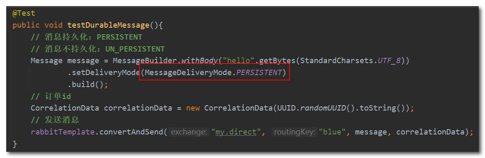

SpringAMQP发出的任何消息都是持久化的，不用特意指定。	


### 7.3.3 消费者消息确认

RabbitMQ确认消息被消费者消费后会立刻删除。RabbitMQ通过消费者回执来确认消费者是否成功处理消息。

消费者获取消息后，应该向RabbitMQ发送ACK回执，表明自己已经处理消息。


设想这样的场景：

1）RabbitMQ投递消息给消费者

2）消费者获取消息后，返回ACK给RabbitMQ

3）RabbitMQ删除消息

4）消费者宕机，消息尚未处理

这样，消息就丢失了。因此消费者返回ACK的时机非常重要。


SpringAMQP则允许配置三种确认模式：

- manual：手动ack，需要在业务代码结束后，调用api发送ack。

- auto：自动ack，由spring监测listener代码是否出现异常，没有异常则返回ack；抛出异常则返回nack


- none：关闭ack，MQ假定消费者获取消息后会成功处理，因此消息投递后立即被删除

一般使用默认的auto即可。


#### none模式

修改consumer服务的application.yml文件，添加下面内容：

```yaml
spring:
  rabbitmq:
    listener:
      simple:
        acknowledge-mode: none # 关闭ack
```

修改consumer服务的SpringRabbitListener类中的方法，模拟一个消息处理异常：

```java
@RabbitListener(queues = "simple.queue")
public void listenSimpleQueue(String msg) {
    log.info("消费者接收到simple.queue的消息：【{}】", msg);
    // 模拟异常
    System.out.println(1 / 0);
    log.debug("消息处理完成！");
}
```

测试可以发现，当消息处理抛异常时，消息并没有处理完成，消息依然被RabbitMQ删除了。


#### auto模式

把确认机制修改为auto:

```yaml
spring:
  rabbitmq:
    listener:
      simple:
        acknowledge-mode: auto 
```

在异常位置打断点，再次发送消息，程序卡在断点时，可以发现此时消息状态为unack（未确定状态）：


当消费者出现异常后，消息会不断重入队到队列，再重新发送给消费者，然后再次异常，无限循环，导致mq的消息处理飙升：


终止服务后，因为Spring会自动返回nack，所以消息恢复至Ready状态，消息没有被RabbitMQ删除：


### 7.3.4 消费失败重试机制

当消费者出现异常后，消息会不断requeue（重入队）到队列，再重新发送给消费者，然后再次异常，再次requeue，无限循环，导致mq的消息处理飙升，带来不必要的压力。

利用Spring的retry机制，在消费者出现异常时利用本地重试，而不是无限制的requeue到mq队列。

修改consumer服务的application.yml文件，添加内容：

```yml
spring:
  rabbitmq:
    listener:
      simple:
        retry:
          enabled: true # 开启消费者失败重试
          initial-interval: 1000 # 初始的失败等待时长为1秒
          multiplier: 1 # 失败的等待时长倍数，下次等待时长 = multiplier * last-interval
          max-attempts: 3 # 最大重试次数
          stateless: true # true无状态；false有状态。如果业务中包含事务，这里改为false
```

​	重启consumer服务，重复之前的测试，可以发现：

- 开启本地重试时，消息处理过程中抛出异常，不会requeue到队列，而是在消费者本地重试
- 重试达到最大次数后，Spring会返回ack，消息会被丢弃


达到最大重试次数后，消息会被丢弃，这是由Spring内部机制决定的。

在开启重试模式后，重试次数耗尽，如果消息依然失败，则需要有MessageRecovery接口来处理，它包含三种不同的实现：

- RejectAndDontRequeueRecoverer：重试耗尽后，直接reject，丢弃消息。默认就是这种方式

- ImmediateRequeueMessageRecoverer：重试耗尽后，返回nack，消息重新入队

- RepublishMessageRecoverer：重试耗尽后，将失败消息投递到指定的交换机

  

推荐的处理方案是RepublishMessageRecoverer，失败后将消息投递到一个指定的，专门存放异常消息的队列，后续由人工集中处理，实现该方案只需要创建RepublishMessageRecoverer对象交由spring管理，并且关联队列和交换机：

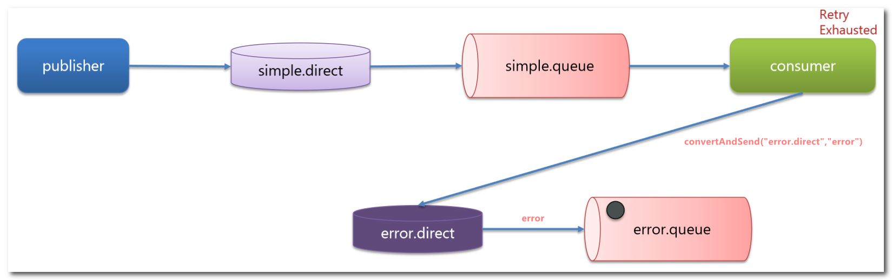

(1) 在consumer服务中定义处理失败消息的交换机和队列

```java 
@Bean
public DirectExchange errorMessageExchange(){
    return new DirectExchange("error.direct");
}
@Bean
public Queue errorQueue(){
    return new Queue("error.queue", true);
}
@Bean
public Binding errorBinding(Queue errorQueue, DirectExchange errorMessageExchange){
    return BindingBuilder.bind(errorQueue).to(errorMessageExchange).with("error");
}
```

(2) 定义一个RepublishMessageRecoverer，关联队列和交换机

```java 
@Bean
public MessageRecoverer republishMessageRecoverer(RabbitTemplate rabbitTemplate){
    return new RepublishMessageRecoverer(rabbitTemplate, "error.direct", "error");
}
```

完整代码：

```Java
package cn.itcast.mq.config;

import org.springframework.amqp.core.Binding;
import org.springframework.amqp.core.BindingBuilder;
import org.springframework.amqp.core.DirectExchange;
import org.springframework.amqp.core.Queue;
import org.springframework.amqp.rabbit.core.RabbitTemplate;
import org.springframework.amqp.rabbit.retry.MessageRecoverer;
import org.springframework.amqp.rabbit.retry.RepublishMessageRecoverer;
import org.springframework.context.annotation.Bean;

@Configuration
public class ErrorMessageConfig {
    @Bean
    public DirectExchange errorMessageExchange(){
        return new DirectExchange("error.direct");
    }
    @Bean
    public Queue errorQueue(){
        return new Queue("error.queue", true);
    }
    @Bean
    public Binding errorBinding(Queue errorQueue, DirectExchange errorMessageExchange){
        return BindingBuilder.bind(errorQueue).to(errorMessageExchange).with("error");
    }

    @Bean
    public MessageRecoverer republishMessageRecoverer(RabbitTemplate rabbitTemplate){
        return new RepublishMessageRecoverer(rabbitTemplate, "error.direct", "error");
    }
}
```

重启服务测试，可以看到异常的消息被投递到错误的交换机绑定的队列保存，并且有详细的错误信息：

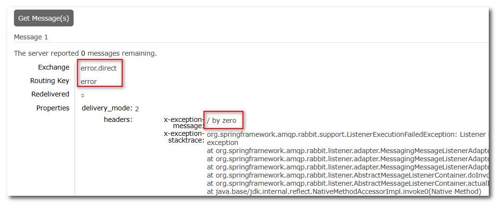


**小总结**

如何确保RabbitMQ消息的可靠性？

- 开启生产者确认机制，确保生产者的消息能到达队列
- 开启持久化功能，确保消息未消费前在队列中不会丢失
- 开启消费者确认机制为auto，由spring确认消息处理成功后完成ack
- 开启消费者失败重试机制，并设置MessageRecoverer，多次重试失败后将消息投递到异常交换机，交由人工处理


## 7.4 死信交换机

消息被标记为死信的情况通常包括以下几种：

1. **消费者异常：** 如果消息在消费者处理过程中发生异常，并且消费者没有成功处理该消息，消息可能会被标记为死信。这可能是由于代码错误、异常抛出等原因。
2. **消费超时：** 如果消息在一定的时间内没有被消费者处理，可能会被认为是死信。这可以避免消息长时间占用资源。
3. **重试次数超过限制：** 在消息处理失败时，可能会进行自动的重试。如果消息达到了预定的重试次数上限，系统可能会将其标记为死信。
4. **消息过期：** 消息在发送时可能会设置一个有效期。如果消息在有效期内未被消费者处理，可能会被认为是死信。
5. **无法路由：** 当消息无法路由到任何队列时，例如，由于没有匹配的路由键或队列不存在，消息可能会被标记为死信。
6. **手动标记为死信：** 在某些情况下，系统管理员或开发人员可能会手动将消息标记为死信，以便进一步分析和处理。


**死信交换机**（Dead Letter Exchange，简称DLX）是在消息中间件系统中常见的一个概念。它通常用于处理无法被正常消费的消息，这些消息可能因为某些原因无法被消费者成功处理，例如消费者抛出异常、消息过期等。

如果队列配置了`dead-letter-exchange`属性，指定了一个交换机，那么队列中的死信就会投递到这个交换机中，而这个交换机称为死信交换机。

如图，一个消息被消费者拒绝了，变成了死信：

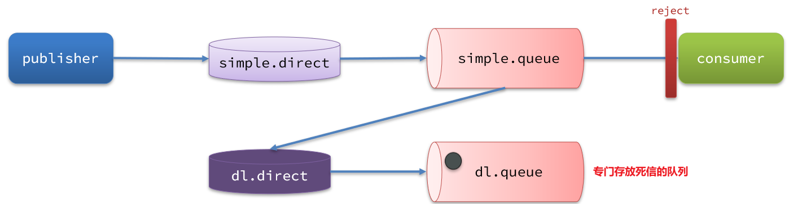


一般情况下，创建死信交换机和相关的死信队列需要以下步骤：

1. 创建一个死信交换机：这个交换机通常被配置成一个直接交换机，用于将无法被消费的消息转发到死信队列。
2. 创建一个死信队列：死信队列是接收无法被正常消费的消息的地方。您可以配置队列的属性，例如消息过期时间、最大重试次数等。
3. 将死信队列绑定到死信交换机：将死信队列绑定到死信交换机，并配置相应的路由规则，以便无法被消费的消息能够被路由到死信队列。
4. 在正常的队列中设置死信交换机：将死信交换机配置为正常队列的死信交换机。当消息被消费失败时，会被转发到死信交换机，并进而被路由到死信队列。

在consumer服务中，定义一组死信交换机、死信队列：

```java
// 声明普通的 simple.queue队列，并且为其指定死信交换机：dl.direct
@Bean
public Queue simpleQueue2(){
    return QueueBuilder.durable("simple.queue") // 指定队列名称，并持久化
        .deadLetterExchange("dl.direct") // 指定死信交换机
        .build();
}
// 声明死信交换机 dl.direct
@Bean
public DirectExchange dlExchange(){
    return new DirectExchange("dl.direct", true, false);
}
// 声明存储死信的队列 dl.queue
@Bean
public Queue dlQueue(){
    return new Queue("dl.queue", true);
}
// 将死信队列 与 死信交换机绑定
@Bean
public Binding dlBinding(){
    return BindingBuilder.bind(dlQueue()).to(dlExchange()).with("simple");
}
```


## 7.5 超时时间(TTL)

一个队列中的消息如果超时未消费，则会变为死信，超时分为两种情况：

- 消息所在的队列设置了超时时间
- 消息本身设置了超时时间


### 7.5.1 给队列设置TTL

(1) 在consumer服务的SpringRabbitListener中，定义一个新的消费者，并且声明 死信交换机、死信队列：

```java
@RabbitListener(bindings = @QueueBinding(
    value = @Queue(name = "dl.ttl.queue", durable = "true"),
    exchange = @Exchange(name = "dl.ttl.direct"),
    key = "ttl"
))
public void listenDlQueue(String msg){
    log.info("接收到 dl.ttl.queue的延迟消息：{}", msg);
}
```

(2) 声明一个普通队列，并且指定TTL

这个队列设定了死信交换机为`dl.ttl.direct`，要给队列设置超时时间，需要在声明队列时配置ttl属性：

```java 
@Bean
public Queue ttlQueue(){
    return QueueBuilder.durable("ttl.queue") // 指定队列名称，并持久化
        .ttl(10000) // 设置队列的超时时间，10秒
        .deadLetterExchange("dl.ttl.direct") // 指定死信交换机
        .build();
}
```

(3) 声明交换机，将ttl.queue队列与交换机绑定：

```java
@Bean
public DirectExchange ttlExchange(){
    return new DirectExchange("ttl.direct");
}
    @Bean
    public Binding ttlBinding(){
        return BindingBuilder.bind(ttlQueue()).to(ttlExchange()).with("ttl");
    }
```

(4) 发送消息

```Java
@Test
public void testTTLQueue() {
    // 创建消息
    String message = "hello, ttl queue";
    // 消息ID，需要封装到CorrelationData中
    CorrelationData correlationData = new CorrelationData(UUID.randomUUID().toString());
    // 发送消息
    rabbitTemplate.convertAndSend("ttl.direct", "ttl", message, correlationData);
    // 记录日志
    log.debug("发送消息成功");
}
```

发送消息的日志：


接收消息的日志：


因为队列的TTL值是10000ms，也就是10秒。可以看到消息发送与接收之间的时差刚好是10秒。


### 7.5.2 给消息设置TTL

在发送消息时，也可以指定TTL。

发送消息时指定TTL需要通过MessageBuilder来构建消息，并且通过 `setExpiration` 方法来设置超时时间。

```java
@Test
public void testTTLMsg() {
    // 创建消息
    Message message = MessageBuilder
        .withBody("hello, ttl message".getBytes(StandardCharsets.UTF_8))
        .setExpiration("5000")
        .build();
    // 消息ID，需要封装到CorrelationData中
    CorrelationData correlationData = new CorrelationData(UUID.randomUUID().toString());
    // 发送消息
    rabbitTemplate.convertAndSend("ttl.direct", "ttl", message, correlationData);
    log.debug("发送消息成功");
}
```

查看发送消息日志：


查看接收消息日志：


这次，发送与接收的延迟只有5秒。说明当队列、消息都设置了TTL时，任意一个到期就会成为死信。


## 7.6 延迟队列


延迟队列（Delay Queue）是一种特殊类型的消息队列，用于在一定的时间延迟后才将消息投递给消费者。

在延迟队列中，消息被发送到队列后，不会立即被消费者消费，而是在设置的延迟时间之后才会被消费者获取并处理。

利用TTL结合死信交换机，我们实现了消息发出后，消费者延迟收到消息的效果。这种消息模式就称为延迟队列（Delay Queue）模式。

延迟队列的使用场景包括：

- 延迟发送短信
- 用户下单，如果用户在15 分钟内未支付，则自动取消
- 预约工作会议，20分钟后自动通知所有参会人员


### 7.6.1 安装DelayExchange插件

**下载插件**

因为延迟队列的需求非常多，所以RabbitMQ的官方也推出了一个插件，原生支持延迟队列效果。

插件下载地址：[GitHub - rabbitmq/rabbitmq-delayed-message-exchange: Delayed Messaging for RabbitMQ](https://github.com/rabbitmq/rabbitmq-delayed-message-exchange)，资料中已提供。


这里使用rabbitmq3.8的版本，拉取镜像：

```
docker pull rabbitmq:3.8-management
```

创建并启动RabbitMQ容器：

```sh
docker run \
 -e RABBITMQ_DEFAULT_USER=root \
 -e RABBITMQ_DEFAULT_PASS=123456 \
 -v mq-plugins:/plugins \
 --name mq \
 --hostname mq1 \
 -p 15672:15672 \
 -p 5672:5672 \
 -d \
 rabbitmq:3.8-management
```

使用下面命令查看数据卷挂载的目录，然后将插件上传到该/var/lib/docker/volumes/mq-plugins/_data即可：

```
docker volume inspect mq-plugins
```

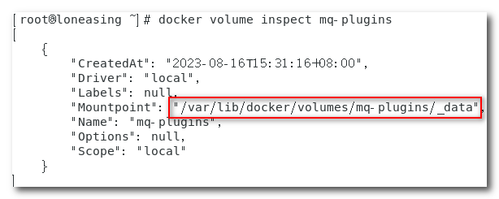

**安装插件**

进入MQ容器内部来执行安装，所以执行下面命令：

```sh
docker exec -it mq bash
```

进入容器内部后，执行下面命令开启插件：

```sh
rabbitmq-plugins enable rabbitmq_delayed_message_exchange
```

结果如下：

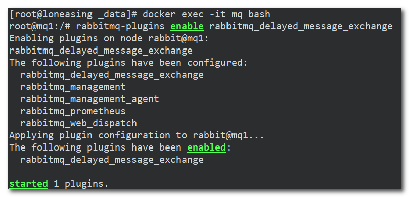


### 7.6.2 DelayExchange原理

DelayExchange需要将一个交换机声明为delayed类型。当我们发送消息到delayExchange时，流程如下：

- 接收消息
- 判断消息是否具备x-delay属性
- 如果有x-delay属性，说明是延迟消息，持久化到硬盘，读取x-delay值，作为延迟时间
- 返回routing not found结果给消息发送者
- x-delay时间到期后，重新投递消息到指定队列


### 7.6.3 使用DelayExchange

插件的使用也非常简单：声明一个交换机，交换机的类型可以是任意类型，只需要设定delayed属性为true，然后声明队列与其绑定。

1）声明DelayExchange交换机

基于`@RabbitListener`注解方式：

```Java
@RabbitListener(bindings = @QueueBinding(
        value = @Queue(name = "delay.queue",durable = "true"),
        exchange = @Exchange(name = "delay.direct",delayed = "true"),
        key = "delay"
))
public void listenDelayedQueue(String msg){
    log.info("接收到 delay.queue的延迟消息：{}",msg);
}
```

基于`@Bean`的方式：

```Java
@Configuration
public class DelayedQueueConfig {

    @Bean
    public DirectExchange delayedExchange(){
        return ExchangeBuilder
                .directExchange("delay.direct")
                .delayed()  // 设置延迟交换机
                .durable(true)
                .build();
    }

    @Bean
    public Queue delayedQueue(){
        return new Queue("delay.queue");
    }

    @Bean
    public Binding delayedBinding(){
        return BindingBuilder.bind(delayedQueue()).to(delayedExchange()).with("delay");
    }
}

```

2）发送消息

发送消息时，一定要携带 `x-delay` 属性，指定延迟的时间：

```Java
@Test
public void testDelayedMsg(){
    // 创建消息
    Message message = MessageBuilder
            .withBody("hello, ttl message".getBytes(StandardCharsets.UTF_8))
            .setHeader("x-delay",10000)
            .build();
    // 消息ID，需要封装到CorrelationData中
    CorrelationData correlationData = new CorrelationData(UUID.randomUUID().toString());
    // 发送消息
    rabbitTemplate.convertAndSend("delay.direct", "delay", message, correlationData);
    log.debug("发送消息成功");
}
```

3）查看结果

发送消息时的日志：


接收消息时的日志：


## 7.7 惰性队列

### 7.7.1 消息堆积问题

当生产者发送消息的速度超过了消费者处理消息的速度，就会导致队列中的消息堆积，直到队列存储消息达到上限。之后发送的消息就会成为死信，可能会被丢弃，这就是消息堆积问题。

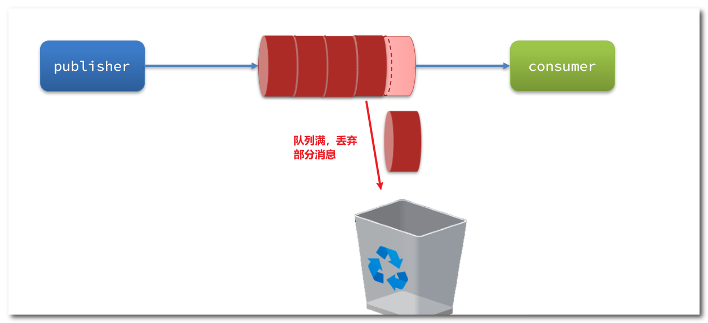

解决消息堆积有两种思路：

- 增加更多消费者，提高消费速度。也就是我们之前说的work queue模式
- 扩大队列容积，提高堆积上限


### 7.7.2 惰性队列

惰性队列（Lazy Queues）是一种在消息中间件中常见的优化策略，用于减少队列中消息的不必要消耗。通常，消息队列中的消息会一直保留在队列中，直到消费者准备好来消费它们。然而，在某些情况下，这些消息可能会在队列中停留很长时间，造成了资源浪费。

惰性队列解决了这个问题，其核心思想是，当消息队列中没有消费者订阅时，消息不会立即被保留在队列中。相反，只有在消息队列上有实际的消费者连接时，消息才会被添加到队列中等待消费。这样，当没有消费者需要处理消息时，队列不会占用系统资源。

惰性队列的特征如下：

- 接收到消息后直接存入磁盘而非内存
- 消费者要消费消息时才会从磁盘中读取并加载到内存
- 支持数百万条的消息存储

#### 基于命令行声明lazy-queue

设置一个队列为惰性队列，只需要在声明队列时，指定x-queue-mode属性为lazy即可：

```
rabbitmqctl set_policy Lazy "^lazy-queue$" '{"queue-mode":"lazy"}' --apply-to queues  
```

命令解读：

- `rabbitmqctl` ：RabbitMQ的命令行工具
- `set_policy` ：添加一个策略
- `Lazy` ：策略名称，可以自定义
- `"^lazy-queue$"` ：用正则表达式匹配队列的名字
- `'{"queue-mode":"lazy"}'` ：设置队列模式为lazy模式
- `--apply-to queues  `：策略的作用对象，是所有的队列


#### 基于Bean声明lazy-queue

```Java
@Bean
public Queue lazyQueue(){
    return QueueBuilder
            .durable("lazy.queue")
            .lazy() // 声明为惰性队列
            .build();
}
```


#### 基于注解声明lazy-queue

```Java
@RabbitListener(queuesToDeclare = @Queue(
        name = "lazy.queue",
        durable = "true",
        arguments = @Argument(name = "x-queue-mode", value = "lazy")
))
public void listenLazyQueue(String msg) {
    log.info("接收到 lazy.queue的消息：{}", msg);
}
```


#### 测试惰性队列和普通队列

声明两个队列：

```Java
@Configuration
public class LazyConfig {

    @Bean
    public Queue lazyQueue(){
        return QueueBuilder
                .durable("lazy.queue")
                .lazy() // 声明为惰性队列
                .build();
    }

    @Bean
    public Queue normalQueue(){
        return QueueBuilder
                .durable("normal.queue")
                .build();
    }
}
```

测试方法：

```Java
    @Test
    public void testLazyQueue() {
        for (int i = 0; i < 1000000; i++) {
            // 创建消息
            Message message = MessageBuilder
                    .withBody("hello, lazy queue".getBytes(StandardCharsets.UTF_8))
                    .setDeliveryMode(MessageDeliveryMode.NON_PERSISTENT)
                    .build();
            // 发送消息
            rabbitTemplate.convertAndSend("lazy.queue", message);
        }
    }

    @Test
    public void testNormalQueue() {
        for (int i = 0; i < 1000000; i++) {
            // 创建消息
            Message message = MessageBuilder
                    .withBody("hello, normal queue".getBytes(StandardCharsets.UTF_8))
                    .setDeliveryMode(MessageDeliveryMode.NON_PERSISTENT)
                    .build();
            // 发送消息
            rabbitTemplate.convertAndSend("normal.queue", message);
        }
    }

```

测试结果：

可以看到惰性队列的消息时没有存储在内存中，而是保存到了磁盘


普通队列的消息是保存在内存中，当达到限定大小时会扇出到磁盘

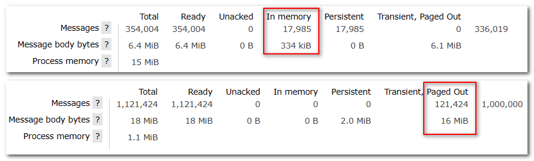


**小总结**

消息堆积问题的解决方案？

- 队列上绑定多个消费者，提高消费速度
- 使用惰性队列，可以再mq中保存更多消息

惰性队列的优点有哪些？

- 基于磁盘存储，消息上限高
- 没有间歇性的page-out，性能比较稳定

惰性队列的缺点有哪些？

- 基于磁盘存储，消息时效性会降低
- 性能受限于磁盘的IO


## 7.8 MQ集群

RabbitMQ的是基于Erlang语言编写，而Erlang又是一个面向并发的语言，天然支持集群模式。RabbitMQ的集群有两种模式：

- **普通集群**：是一种分布式集群，将队列分散到集群的各个节点，从而提高整个集群的并发能力。

- **镜像集群**：是一种主从集群，普通集群的基础上，添加了主从备份功能，提高集群的数据可用性。

镜像集群虽然支持主从，但主从同步并不是强一致的，某些情况下可能有数据丢失的风险。因此在RabbitMQ的3.8版本以后，推出了**仲裁队列**来代替镜像集群，底层采用Raft协议确保主从的数据一致性。


### 7.8.1 普通集群

普通集群，或者叫标准集群（classic cluster），具备下列特征：

- 会在集群的各个节点间共享部分数据，包括：交换机、队列元信息。不包含队列中的消息。
- 当访问集群某节点时，如果队列不在该节点，会从数据所在节点传递到当前节点并返回。
- 队列所在节点宕机，队列中的消息就会丢失。


#### 创建集群

下面部署3节点的mq集群：

| 主机名 | 控制台端口      | amqp通信端口  |
| ------ | --------------- | ------------- |
| mq1    | 15671---> 15672 | 5671---> 5672 |
| mq2    | 15672---> 15672 | 5672---> 5672 |
| mq3    | 15673---> 15672 | 5673---> 5672 |

集群中的节点表示默认都是：`rabbit@[hostname]`，因此以上三个节点的名称分别为：

- rabbit@mq1
- rabbit@mq2
- rabbit@mq3

**(1) 创建一个网络**

```sh
docker network create mq-net
```

**(2) 启动集群节点**

```sh
docker run -d --net mq-net \
--hostname mq1 \
--name mq1 \
-p 15671:15672 \
-p 5671:5672 \
-e RABBITMQ_DEFAULT_USER=root \
-e RABBITMQ_DEFAULT_PASS=123456 \
-e RABBITMQ_ERLANG_COOKIE='rabbitcookie' \
rabbitmq:3.9-management
```

```sh
docker run -d --net mq-net \
--hostname mq2 \
--name mq2 \
-p 15672:15672 \
-p 5672:5672 \
-e RABBITMQ_DEFAULT_USER=root \
-e RABBITMQ_DEFAULT_PASS=123456 \
-e RABBITMQ_ERLANG_COOKIE='rabbitcookie' \
rabbitmq:3.9-management
```

```sh
docker run -d --net mq-net \
--hostname mq3 \
--name mq3 \
-p 15673:15672 \
-p 5673:5672 \
-e RABBITMQ_DEFAULT_USER=root \
-e RABBITMQ_DEFAULT_PASS=123456 \
-e RABBITMQ_ERLANG_COOKIE='rabbitcookie' \
rabbitmq:3.9-management
```

每个节点都需要设置相同的cookie。

**(3) 加入集群节点**

```sh
docker exec -it mq1 bashsh
rabbitmqctl stop_appsh
rabbitmqctl resetsh
rabbitmqctl start_app
exit
```

```sh
docker exec -it mq2 bash
rabbitmqctl stop_app
rabbitmqctl reset
rabbitmqctl join_cluster --ram rabbit@mq1
rabbitmqctl start_app
exit
```

```sh
docker exec -it mq3 bash
rabbitmqctl stop_app
rabbitmqctl reset
rabbitmqctl join_cluster --ram rabbit@mq1
rabbitmqctl start_appsh
exit
```

上述加入集群节点的指令会报错，但是不影响成功创建集群。

访问任意一个节点的地址：192.168.101.100:15671

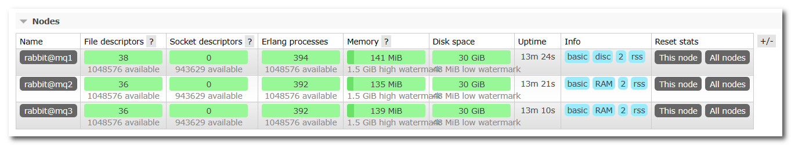


#### SpringAMQP连接MQ集群

注意，这里用address来代替host、port方式

```java
spring:
  rabbitmq:
    addresses: 192.168.101.100:5671, 192.168.101.100:5672, 192.168.101.100:5673
    username: root
    password: 123456
    virtual-host: /
```


### 7.8.2 镜像模式

在刚刚的案例中，一旦创建队列的主机宕机，队列就会不可用。不具备高可用能力。如果要解决这个问题，必须使用官方提供的镜像集群方案。官方文档地址：https://www.rabbitmq.com/ha.html

#### 镜像模式的特征

默认情况下，队列只保存在创建该队列的节点上。而镜像模式下，创建队列的节点被称为该队列的主节点，队列还会拷贝到集群中的其它节点，也叫做该队列的镜像节点。但是，不同队列可以在集群中的任意节点上创建，因此不同队列的主节点可以不同。甚至，一个队列的主节点可能是另一个队列的镜像节点。

用户发送给队列的一切请求，例如发送消息、消息回执默认都会在主节点完成，如果是从节点接收到请求，也会路由到主节点去完成。镜像节点仅仅起到备份数据作用。

当主节点接收到消费者的ACK时，所有镜像都会删除节点中的数据。

总结如下：

- 镜像队列结构是一主多从（从就是镜像）
- 所有操作都是主节点完成，然后同步给镜像节点
- 主宕机后，镜像节点会替代成新的主（如果在主从同步完成前，主就已经宕机，可能出现数据丢失）
- 不具备负载均衡功能，因为所有操作都会有主节点完成（但是不同队列，其主节点可以不同，可以利用这个提高吞吐量）


#### 镜像模式的配置

镜像模式的配置有3种模式：

|     ha-mode     |     ha-params     | 效果                                                         |
| :-------------: | :---------------: | :----------------------------------------------------------- |
| 准确模式exactly | 队列的副本量count | 集群中队列副本（主服务器和镜像服务器之和）的数量。count如果为1意味着单个副本：即队列主节点。count值为2表示2个副本：1个队列主和1个队列镜像。换句话说：count = 镜像数量 + 1。如果群集中的节点数少于count，则该队列将镜像到所有节点。如果有集群总数大于count+1，并且包含镜像的节点出现故障，则将在另一个节点上创建一个新的镜像。 |
|       all       |      (none)       | 队列在群集中的所有节点之间进行镜像。队列将镜像到任何新加入的节点。镜像到所有节点将对所有群集节点施加额外的压力，包括网络I / O，磁盘I / O和磁盘空间使用情况。推荐使用exactly，设置副本数为（N / 2 +1）。 |
|      nodes      |   *node names*    | 指定队列创建到哪些节点，如果指定的节点全部不存在，则会出现异常。如果指定的节点在集群中存在，但是暂时不可用，会创建节点到当前客户端连接到的节点。 |

这里我们以rabbitmqctl命令作为案例来讲解配置语法。

语法示例：

**(1) exactly模式**

```
rabbitmqctl set_policy ha-two "^two\." '{"ha-mode":"exactly","ha-params":2,"ha-sync-mode":"automatic"}'
```

- `rabbitmqctl set_policy`：固定写法
- `ha-two`：策略名称，自定义
- `"^two\."`：匹配队列的正则表达式，符合命名规则的队列才生效，这里是任何以`two.`开头的队列名称
- `'{"ha-mode":"exactly","ha-params":2,"ha-sync-mode":"automatic"}'`: 策略内容
  - `"ha-mode":"exactly"`：策略模式，此处是exactly模式，指定副本数量
  - `"ha-params":2`：策略参数，这里是2，就是副本数量为2，1主1镜像
  - `"ha-sync-mode":"automatic"`：同步策略，默认是manual，即新加入的镜像节点不会同步旧的消息。如果设置为automatic，则新加入的镜像节点会把主节点中所有消息都同步，会带来额外的网络开销

**(2) all模式**

```
rabbitmqctl set_policy ha-all "^all\." '{"ha-mode":"all"}'
```

- `ha-all`：策略名称，自定义
- `"^all\."`：匹配所有以`all.`开头的队列名
- `'{"ha-mode":"all"}'`：策略内容
  - `"ha-mode":"all"`：策略模式，此处是all模式，即所有节点都会称为镜像节点

**(3) nodes模式**

```
rabbitmqctl set_policy ha-nodes "^nodes\." '{"ha-mode":"nodes","ha-params":["rabbit@nodeA", "rabbit@nodeB"]}'
```

- `rabbitmqctl set_policy`：固定写法
- `ha-nodes`：策略名称，自定义
- `"^nodes\."`：匹配队列的正则表达式，符合命名规则的队列才生效，这里是任何以`nodes.`开头的队列名称
- `'{"ha-mode":"nodes","ha-params":["rabbit@nodeA", "rabbit@nodeB"]}'`: 策略内容
  - `"ha-mode":"nodes"`：策略模式，此处是nodes模式
  - `"ha-params":["rabbit@mq1", "rabbit@mq2"]`：策略参数，这里指定副本所在节点名称


#### 测试数据共享

我们使用exactly模式的镜像，因为集群节点数量为3，因此镜像数量就设置为2.

运行下面的命令：

```sh
docker exec -it mq1 rabbitmqctl set_policy ha-two "^two\." '{"ha-mode":"exactly","ha-params":2,"ha-sync-mode":"automatic"}'
```

下面，我们创建一个新的队列：


在任意一个mq控制台查看队列：

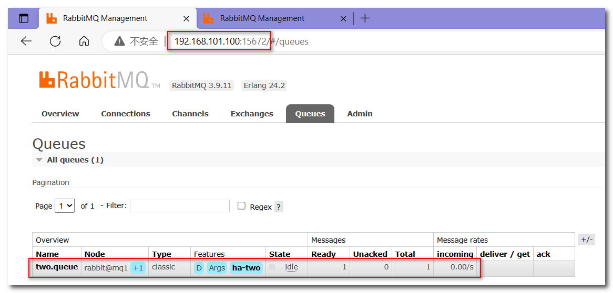

给two.queue发送一条消息：

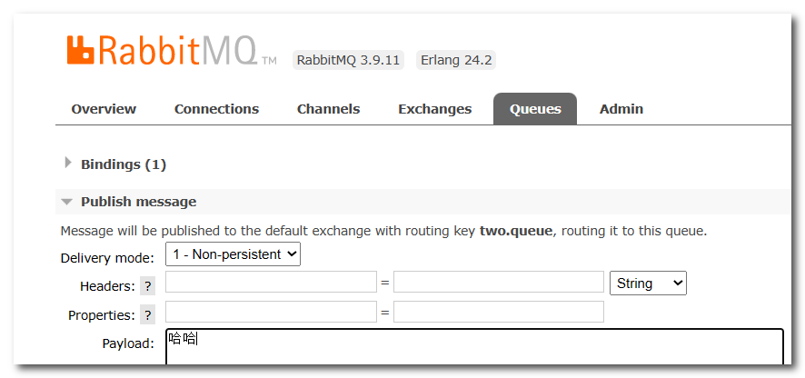

然后在mq1、mq2、mq3的任意控制台查看消息：

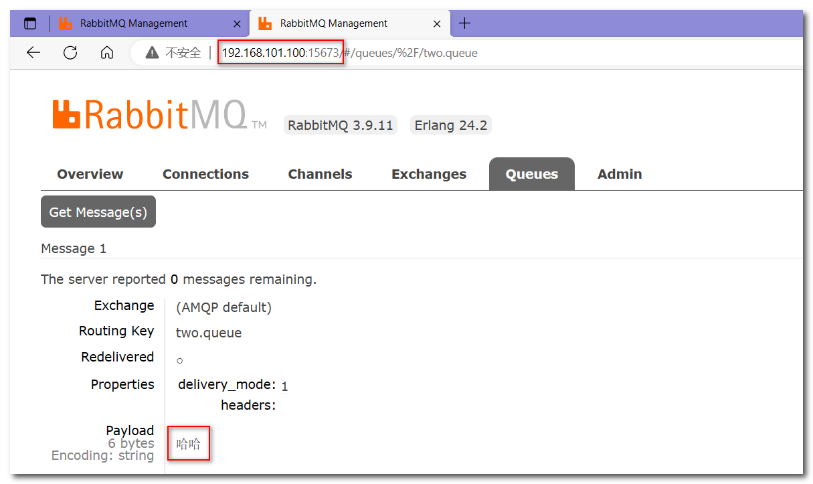


#### 测试高可用

现在，我们让two.queue的主节点mq1宕机：

```sh
docker stop mq1
```

查看集群状态：

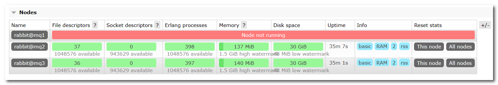

查看队列状态：

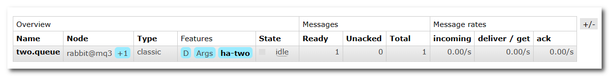

发现依然是健康的，并且其主节点切换到了rabbit@mq3上。


### 7.8.3 仲裁队列

从RabbitMQ 3.8版本开始，引入了新的仲裁队列，他具备与镜像队里类似的功能，但使用更加方便。

在任意控制台添加一个队列，一定要选择队列类型为Quorum类型。


在任意控制台查看队列：

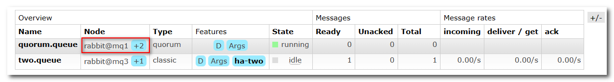

可以看到，仲裁队列的 + 2字样。代表这个队列有2个镜像节点。

因为仲裁队列默认的镜像数为5。如果你的集群有7个节点，那么镜像数肯定是5；而我们集群只有3个节点，因此镜像数量就是3。


#### **Java代码创建仲裁队列**

```Java
@Bean
public Queue quorumQueue() {
    return QueueBuilder
        .durable("quorum.queue") // 持久化
        .quorum() // 仲裁队列
        .build();
}
```


### 7.8.4 集群扩容

#### 加入集群

1）启动一个新的MQ容器：

```sh
docker run -d --net mq-net \
--hostname mq4 \
--name mq4 \
-p 15673:15672 \
-p 5673:5672 \
-e RABBITMQ_DEFAULT_USER=root \
-e RABBITMQ_DEFAULT_PASS=123456 \
-e RABBITMQ_ERLANG_COOKIE='rabbitcookie' \
rabbitmq:3.9-management
```

2）进入容器控制台：

```sh
docker exec -it mq4 bash
```

3）停止mq进程

```sh
rabbitmqctl stop_app
```

4）重置RabbitMQ中的数据：

```sh
rabbitmqctl reset
```

5）加入mq1：

```sh
rabbitmqctl join_cluster rabbit@mq1
```

6）再次启动mq进程

```sh
rabbitmqctl start_app
```


#### 增加仲裁队列副本

我们先查看下quorum.queue这个队列目前的副本情况，进入mq1容器：

```sh
docker exec -it mq1 bash
```

执行命令：

```sh
rabbitmq-queues quorum_status "quorum.queue"
```

结果：

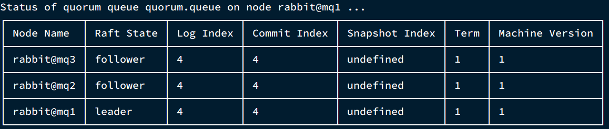

现在，我们让mq4也加入进来：

```sh
rabbitmq-queues add_member "quorum.queue" "rabbit@mq4"
```

结果：


再次查看：

```sh
rabbitmq-queues quorum_status "quorum.queue"
```


查看控制台，发现quorum.queue的镜像数量也从原来的 +2 变成了 +3：


# 8. Elasticsearch

Elasticsearch是一个开源的分布式搜索和分析引擎，构建在Apache Lucene库之上。它被设计用于处理大规模的实时数据，提供了高性能、可伸缩、全文搜索和复杂查询的功能。

以下是Elasticsearch的一些关键特点和功能：

1. 分布式架构：Elasticsearch采用分布式架构，可以将数据分散存储在多个节点上。这样可以实现数据的水平扩展和高可用性，同时支持大规模数据的处理和查询。
2. 实时搜索和分析：Elasticsearch提供了快速的实时搜索和分析能力。它能够在毫秒级别内响应用户的查询请求，并支持复杂的全文搜索、过滤、聚合和排序等操作。
3. 高性能和可伸缩性：Elasticsearch使用倒排索引（Inverted Index）来加快搜索速度。它采用分片和副本机制，可以水平扩展到数百台甚至数千台服务器，以应对大规模的数据和查询负载。
4. 多种数据类型支持：Elasticsearch支持多种数据类型，包括文本、数字、日期、地理位置等。它具有灵活的数据模型，可以轻松处理结构化、半结构化和非结构化的数据。
5. 分布式搜索和聚合：Elasticsearch支持分布式搜索和聚合操作。它可以将查询请求并行分发到多个节点上，并将结果进行合并和汇总，从而加快搜索和分析的速度。
6. RESTful API：Elasticsearch提供了简单易用的RESTful API，使得与Elasticsearch进行交互和操作变得非常方便。开发人员可以使用各种编程语言和工具来与Elasticsearch进行集成和开发应用程序。
7. 数据复制和故障恢复：Elasticsearch采用数据复制和故障恢复机制，确保数据的可靠性和持久性。它将数据分布到多个节点的副本上，并在节点故障时自动进行数据恢复和重新分配。
8. 插件生态系统：Elasticsearch拥有丰富的插件生态系统，提供了许多扩展功能和工具。这些插件可以用于数据分析、监控、安全性、可视化等方面，满足不同场景下的需求。


## 8.1 初识elasticsearch

### 8.1.1 文档和字段

elasticsearch是面向**文档（Document）**存储的，可以是数据库中的一条商品数据，一个订单信息。

文档数据会被序列化为json格式后存储在elasticsearch中，而Json文档中往往包含很多的**字段（Field）**，类似于数据库中的列。


### 8.1.2 索引和映射

**索引（Index）**，就是相同类型的文档的集合。我们可以把索引当做是数据库中的表。

例如：

- 所有用户文档，就可以组织在一起，称为用户的索引；
- 所有商品的文档，可以组织在一起，称为商品的索引；
- 所有订单的文档，可以组织在一起，称为订单的索引；

数据库的表会有约束信息，用来定义表的结构、字段的名称、类型等信息。因此，索引库中就有**映射（mapping）**，是索引中文档的字段约束信息，类似表的结构约束。


统一的把mysql与elasticsearch的概念做一下对比：

| **MySQL** | **Elasticsearch** | **说明**                                                     |
| --------- | ----------------- | ------------------------------------------------------------ |
| Table     | Index             | 索引(index)，就是文档的集合，类似数据库的表(table)           |
| Row       | Document          | 文档（Document），就是一条条的数据，类似数据库中的行（Row），文档都是JSON格式 |
| Column    | Field             | 字段（Field），就是JSON文档中的字段，类似数据库中的列（Column） |
| Schema    | Mapping           | Mapping（映射）是索引中文档的约束，例如字段类型约束。类似数据库的表结构（Schema） |
| SQL       | DSL               | DSL是elasticsearch提供的JSON风格的请求语句，用来操作elasticsearch，实现CRUD |


### 8.1.3 安装elasticsearch

**(1) 创建网络**

因为我们还需要部署kibana容器，因此需要让es和kibana容器互联。这里先创建一个网络：

```sh
docker network create es-net
```

**(2) 拉取镜像**

这里我们采用elasticsearch的7.12.1版本的镜像。

```sh
docker pull elasticsearch:7.12.1
```

**(3) 启动镜像**

```sh
docker run -d \
	--name elasticsearch \
    -e "ES_JAVA_OPTS=-Xms512m -Xmx512m" \
    -e "discovery.type=single-node" \
    -v es-data:/usr/share/elasticsearch/data \
    -v es-config:/user/share/elasticsearch/config \
    -v es-plugins:/usr/share/elasticsearch/plugins \
    --privileged \
    --network es-net \
    -p 9200:9200 \
    -p 9300:9300 \
elasticsearch:7.12.1
```

命令解释：

- `-e "cluster.name=es-docker-cluster"`：设置集群名称
- `-e "http.host=0.0.0.0"`：监听的地址，可以外网访问
- `-e "ES_JAVA_OPTS=-Xms512m -Xmx512m"`：内存大小
- `-e "discovery.type=single-node"`：非集群模式
- `-v es-data:/usr/share/elasticsearch/data`：挂载逻辑卷，绑定es的数据目录
- `-v es-logs:/usr/share/elasticsearch/logs`：挂载逻辑卷，绑定es的日志目录
- `-v es-config:/user/share/elasticsearch/config` ：挂载逻辑卷，绑定es的配置文件
- `-v es-plugins:/usr/share/elasticsearch/plugins`：挂载逻辑卷，绑定es的插件目录
- `--privileged`：授予逻辑卷访问权
- `--network es-net` ：加入一个名为es-net的网络中
- `-p 9200:9200`：端口映射配置

数据卷真实目录：

```sh
cd /var/lib/docker/volumes/es-config/_data
```

**(4) 访问elasticsearch**

访问：192.168.101.100:9200，高版本的es会出现下面的情况：

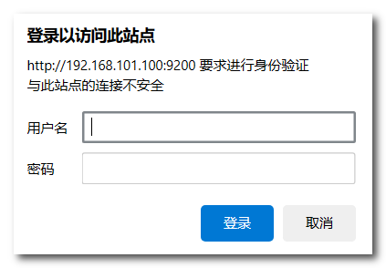

若出现上述情况，则需要创建Elasticsearch用户：

1. 首先，进入运行中的Elasticsearch容器，使用以下命令进入容器的shell环境：

   ```sh
   docker exec -it elasticsearch /bin/bash 
   ```

2. 在容器内，使用`elasticsearch-users`命令行工具或通过API进行用户管理：

   `bin/elasticsearch-users useradd <username> -p <password> -r <role(s)>`，其中，`<username>`为要创建的用户名，`<password>`为用户的密码，`<role(s)>`为用户的角色（如`superuser`、`monitoring`等）。

   例如，创建一个名为 "root" 的用户，设置密码为 "123456"，并将其分配为 "superuser" 角色：

   ```sh
   bin/elasticsearch-users useradd root -p 123456 -r superuser
   ```

   将上述两句命令合成一句命令：

   ```sh
   docker exec -it elasticsearch /bin/bash bin/elasticsearch-users useradd root -p 123456 -r superuser
   ```

3. 退出容器的shell环境：

   ```sh
   exit
   ```

   

### 8.1.4 安装kibana

kibana可以给我们提供一个elasticsearch的可视化界面，kibana的版本要和elasticsearch的版本一致。

**(1) 拉取镜像**

```
docker pull kibana:7.12.1
```

**(2) 启动镜像**

```sh
docker run -d \
	--name kibana \
	-e ELASTICSEARCH_HOSTS=http://elasticsearch:9200 \
	--network es-net \
	-p 5601:5601  \
kibana:7.12.1
```

命令解释：

- `--network es-net` ：加入一个名为es-net的网络中，与elasticsearch在同一个网络中
- `-e ELASTICSEARCH_HOSTS=http://elasticsearch:9200"`：设置elasticsearch的地址，因为kibana已经与elasticsearch在一个网络，因此可以用容器名直接访问elasticsearch
- `-p 5601:5601`：端口映射配置

kibana启动一般比较慢，可以通过命令查看运行日志：

```sh
docker logs -f kibana
```

**(3) 访问kibana**

访问：192.168.101.100:5601


### 8.1.5 安装ik分词器

es在创建倒排索引时需要对文档分词。在搜索时需要对用户输入的内容分词，但是默认的分词规则对中文的处理并不友好。

下面在kibana的DevTools中测试：


```
POST /_analyzer
{
	"analyzer":"standard",
	"text":"努力学习java找工作"
}
```

语法分析：

- POST为请求方式，后面接的是请求路径，这里省略了192.168.101.100:9200，kibana会自动补充。
- _analyze表示分词。
- 请求参数为json格式：
  - analyzer为分词器类型，这里是默认的standard分词器
  - text为要分词的内容

查看效果：

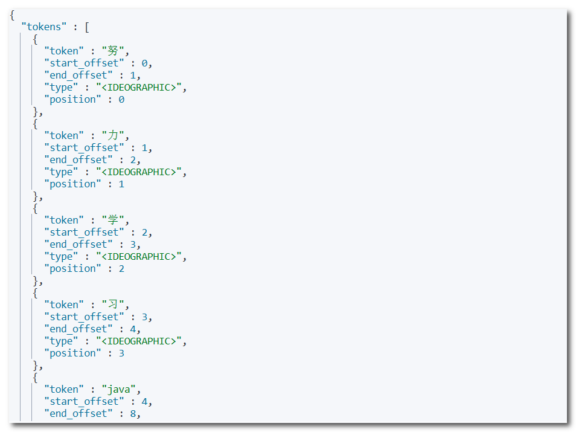

处理中文分词，一般会使用IK分词器，ik分词器包含两种模式：

- **ik_smart**：最少切分，粗粒度

- **ik_max_word**：最细切分，细粒度


**在线安装ik插件**

```sh
# 进入容器内部
docker exec -it elasticsearch /bin/bash

# 在线下载并安装
./bin/elasticsearch-plugin  install https://github.com/medcl/elasticsearch-analysis-ik/releases/download/v7.12.1/elasticsearch-analysis-ik-7.12.1.zip

#退出
exit

#重启容器
docker restart elasticsearch
```


**离线安装ik插件**

安装插件需要知道elasticsearch的plugins目录位置，而我们用了数据卷挂载，因此需要查看elasticsearch的数据卷目录：

```s
docker volume inspect es-plugins
```

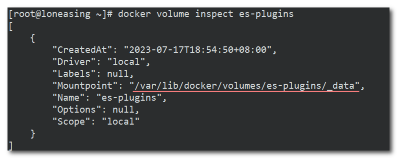

将资料中的ik文件夹上传到数据卷的真实目录：

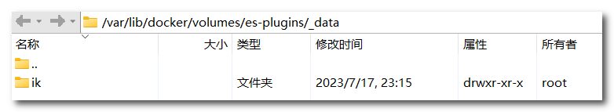

然后重启容器：

```sh
docker restart elasticsearch
```

将分词器更换为ik的 `ik_smart` 模式：

```
POST /_analyze
{
	"analyzer":"ik_smart",
	"text":"努力学习java找工作"
}
```

查看效果：


将分词器更换为ik的 `ik_max_word` 模式：

```
POST /_analyze
{
	"analyzer":"ik_max_word",
	"text":"努力学习java找工作"
}
```

查看效果：

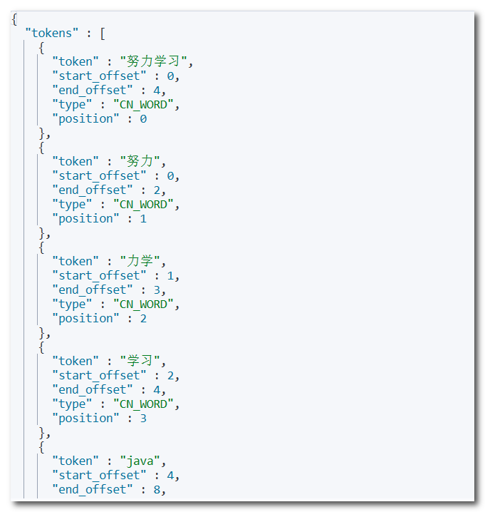


**扩展词词典**

随着互联网的发展，“造词运动”也越发的频繁。出现了很多新的词语，在原有的词汇列表中并不存在。比如：“奥力给”。

IK分词器提供了扩展词汇的功能。

（1）打开IK分词器config目录：


（2）在 `IKAnalyzer.cfg.xml` 配置文件内容添加：

```xml
<?xml version="1.0" encoding="UTF-8"?>
<!DOCTYPE properties SYSTEM "http://java.sun.com/dtd/properties.dtd">
<properties>
        <comment>IK Analyzer 扩展配置</comment>
        <!--用户可以在这里配置自己的扩展字典，etc.dic为自定义的词典，此时需要创建一个这样的文件-->
        <entry key="ext_dict">ext.dic</entry>
</properties>
```

（3）新建一个 ext.dic，添加如下内容，可以参考ik/config目录下的dic文件

```
奥里给
```

（4）重启elasticsearch 

```sh
docker restart elasticsearch
```

（5）测试效果

```
GET /_analyze
{
  "analyzer": "ik_max_word",
  "text": "努力学习java找工作，奥力给！"
}
```

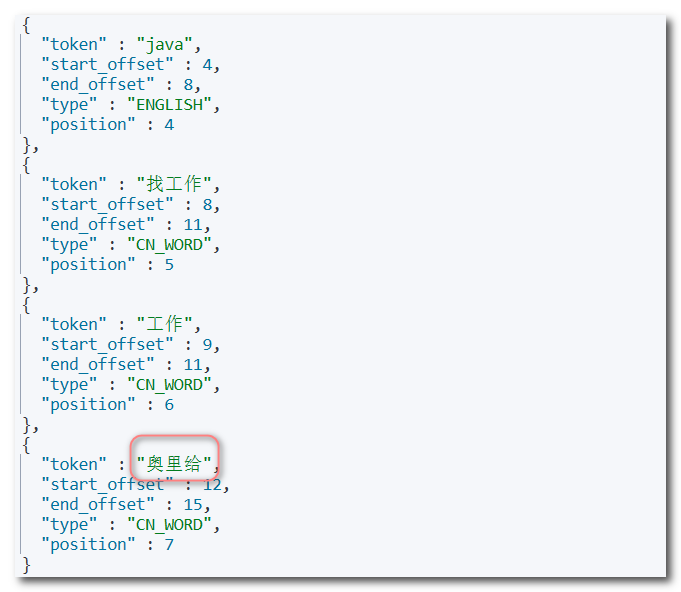

可以看到，ik将奥里给这三个字分成了一个词，因为我们配置了扩展词词典，其中就有这个词。


**停用词词典**

在互联网项目中，在网络间传输的速度很快，所以很多语言是不允许在网络上传递的，如：关于宗教、政治等敏感词语，那么我们在搜索时也应该忽略当前词汇。IK分词器也提供了强大的停用词功能，让我们在索引时就直接忽略当前的停用词汇表中的内容。

（1）在 `IKAnalyzer.cfg.xml` 配置文件内容添加：

```xml
<?xml version="1.0" encoding="UTF-8"?>
<!DOCTYPE properties SYSTEM "http://java.sun.com/dtd/properties.dtd">
<properties>
        <comment>IK Analyzer 扩展配置</comment>
        <!--用户可以在这里配置自己的扩展词字典-->
        <entry key="ext_dict">ext.dic</entry>
         <!--用户可以在这里配置自己的停用词字典-->
        <entry key="ext_stopwords">stopword.dic</entry>
</properties>
```

（2）新建stopword.dic，在该文件中添加停用词：

```
java
```

 （3）重启elasticsearch 

```
docker restart elasticsearch
```

（4）测试效果

```
GET /_analyze
{
  "analyzer": "ik_max_word",
  "text": "努力学习java找工作，奥力给！"
}
```

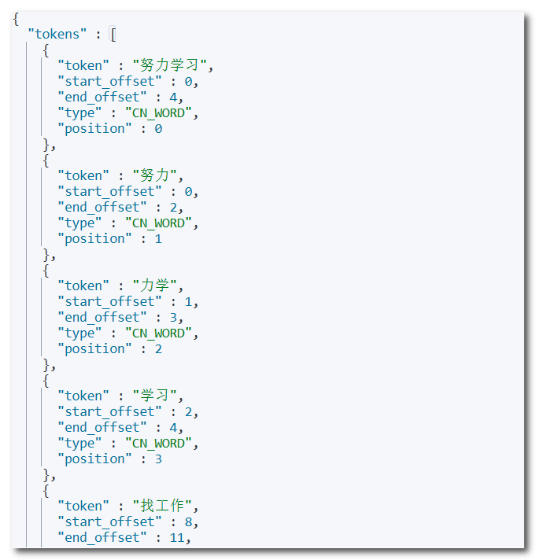

可以看到，查询结果中没有出现停用词java。


## 8.2 索引库操作

### 8.2.1 mapping属性

mapping是对索引库中文档的约束，常见的mapping属性包括：

- type：字段数据类型，常见的简单类型有：
  - 字符串：text（可分词的文本）、keyword（精确值，例如：品牌、国家、ip地址）
  - 数值：long、integer、short、byte、double、float、
  - 布尔：boolean
  - 日期：date
  - 对象：object
- index：是否创建索引，默认为true
- analyzer：使用哪种分词器
- properties：该字段的子字段

例如下面的json文档：

```
{
    "age": 21,
    "weight": 52.1,
    "isMarried": false,
    "info": "黑马程序员Java讲师",
    "email": "zy@itcast.cn",
    "score": [99.1, 99.5, 98.9],
    "name": {
        "firstName": "云",
        "lastName": "赵"
    }
}
```

对应的每个字段映射（mapping）：

- age：类型为 integer；参与搜索，因此需要index为true；无需分词器
- weight：类型为float；参与搜索，因此需要index为true；无需分词器
- isMarried：类型为boolean；参与搜索，因此需要index为true；无需分词器
- info：类型为字符串，需要分词，因此是text；参与搜索，因此需要index为true；分词器可以用ik_smart
- email：类型为字符串，但是不需要分词，因此是keyword；不参与搜索，因此需要index为false；无需分词器
- score：虽然是数组，但是我们只看元素的类型，类型为float；参与搜索，因此需要index为true；无需分词器
- name：类型为object，需要定义多个子属性
  - name.firstName；类型为字符串，但是不需要分词，因此是keyword；参与搜索，因此需要index为true；无需分词器
  - name.lastName；类型为字符串，但是不需要分词，因此是keyword；参与搜索，因此需要index为true；无需分词器


### 8.2.2 索引库操作

索引库操作有哪些？

- 创建索引库：PUT /索引库名
- 查询索引库：GET /索引库名
- 删除索引库：DELETE /索引库名
- 添加字段：PUT /索引库名/_mapping

下面展示的操作都是在kibana客户端实现的：

#### 创建索引库

创建索引库发送的是PUT请求。

创建索引库和mapping的DSL语法如下：

```dsl
PUT /索引库名称
{
  "mappings": {
    "properties": {
      "字段名":{
        "type": "text",
        "analyzer": "ik_smart"
      },
      "字段名2":{
        "type": "keyword",
        "index": "false"
      },
      "字段名3":{
        "properties": {
          "子字段名": {
            "type": "keyword"
          }
        }
      },
      // ...略
    }
  }
}
```

示例：

```
# 创建索引库
PUT /heima
{
  "mappings": {
    "properties": {
      "info": {
        "type": "text",
        "analyzer": "ik_smart"
      },
      "email": {
        "type": "keyword",
        "index": false
      },
      "name": {
        "properties": {
          "firstname":{
            "type": "keyword"
          },
          "lastname": {
            "type": "keyword"
          }
        }
      }
    }
  }
}
```

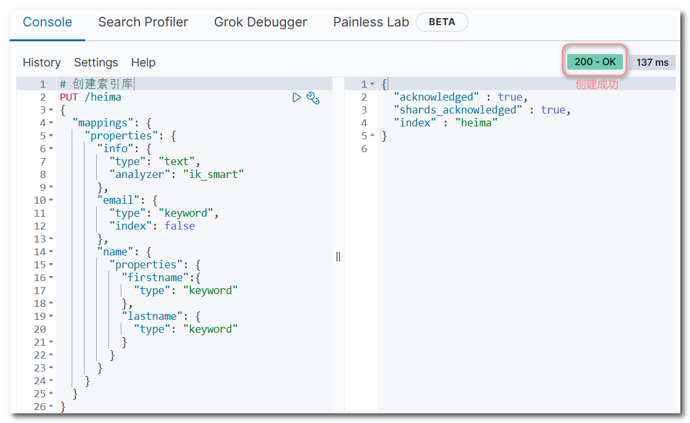

#### 查询索引库

查询索引库的语法：

```
GET /索引库名
```

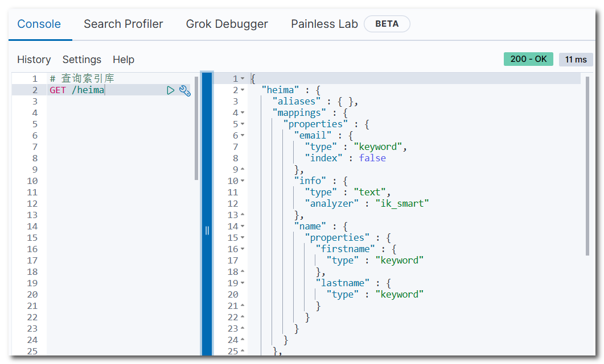

#### 添加字段信息

索引库是不支持需改的，只允许添加新字段的映射信息。

添加字段映射信息发送的是PUT请求，语法如下：

```
PUT /索引库名/_mapping
{
  "properties": {
    "新字段名":{
      "type": "integer"
    }
  }
}
```

示例：

```json
# 新增字段映射信息
PUT /heima/_mapping
{
  "properties": {
    "age": {
      "type": "integer"
    }
  }
}
```

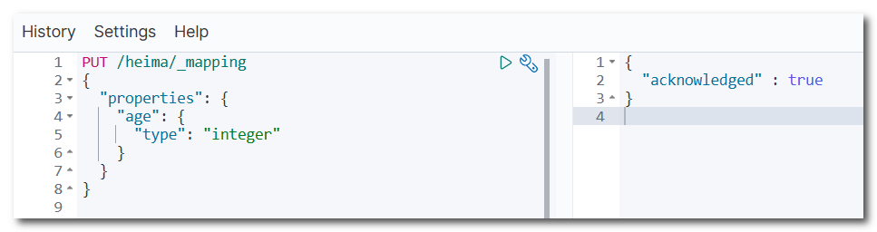

#### 删除索引库

删除索引库的语法：

```
DELETE /索引库名
```

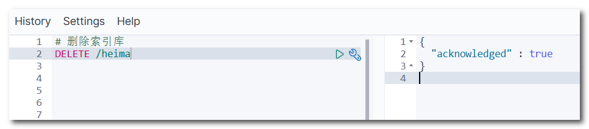


### 8.2.3 文档操作

#### 新增文档

语法：

```json
POST /索引库名/_doc/文档id
{
    "字段1": "值1",
    "字段2": "值2",
    "字段3": {
        "子属性1": "值3",
        "子属性2": "值4"
    },
    // ...
}
```

示例：

```json
# 新增文档
POST /heima/_doc/1
{
  "info":"黑马程序员java讲师",
  "email": "zs@qq.com",
  "name": {
    "firstname":"三",
    "lastname": "张"
  }
}
```

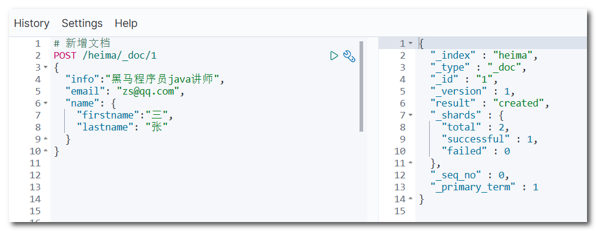

#### 查询文档

语法：

```
GET /索引库名称/_doc/文档id
```

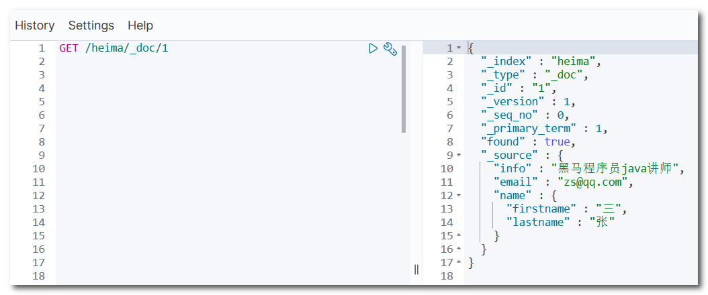

#### 修改文档

修改有两种方式：

- 全量修改：直接覆盖原来的文档，本质是先根据id删除，再新增
- 增量修改：修改文档中的部分字段

**(1) 全量修改**

全量修改发送的是PUT请求。

全量修改是覆盖原来的文档，其本质是根据指定的id删除文档，然后新增一个相同id的文档

**注意**：如果根据id删除时，id不存在，第二步的新增也会执行，也就从修改变成了新增操作了。

语法如下：

```
PUT /索引库名/_doc/文档id
{
    "字段1": "值1",
    "字段2": "值2",
    // ... 略
}
```

示例：

```
# 修改文档
POST /heima/_doc/1
{
  "info":"黑马程序员java讲师",
  "email": "ls@qq.com",
  "name": {
    "firstname":"四",
    "lastname": "李"
  }
}
```

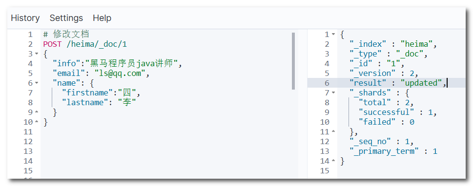

**(2) 增量修改**

增量修改发送的是POST请求。

增量修改是只修改指定id匹配的文档中的部分字段。

语法：

```json
POST /索引库名/_update/文档id
{
    "doc": {
         "字段名": "新的值",
    }
}
```

示例：

```
POST /heima/_update/1
{
	"doc": {
		"info": "黑马程序员Python讲师"
	}
}
```


#### 删除文档

语法：

```
DELETE /索引库名/_doc/文档id
```


## 8.3 RestClient

导入资料中提供的项目：


项目结构如图：

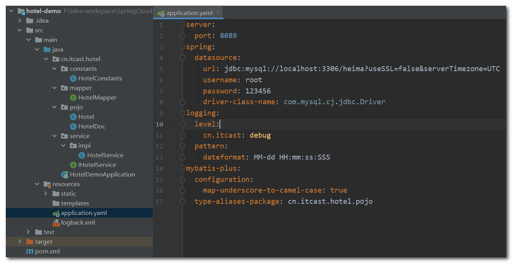

创建数据库heima，执行sql资料中提供的`tb_hotel.sql`文件

编写数据表对应的索引库的DSL语句（注意DSL语句不需要包括请求方法和请求路径）：

```json
{
  "mappings": {
    "properties": {
      "id": {
        "type": "keyword"
      },
      "name":{
        "type": "text",
        "analyzer": "ik_max_word",
        "copy_to": "all"
      },
      "address":{
        "type": "keyword",
        "index": false
      },
      "price":{
        "type": "integer"
      },
      "score":{
        "type": "integer"
      },
      "brand":{
        "type": "keyword",
        "copy_to": "all"
      },
      "city":{
        "type": "keyword",
        "copy_to": "all"
      },
      "starName":{
        "type": "keyword"
      },
      "business":{
        "type": "keyword"
      },
      "location":{
        "type": "geo_point"
      },
      "pic":{
        "type": "keyword",
        "index": false
      },
      "all":{
        "type": "text",
        "analyzer": "ik_max_word"
      }
    }
  }
}
```

几个特殊字段说明：

- location：地理坐标，里面包含精度、纬度
- all：一个组合字段，其目的是将多字段的值利用 `copy_to` 属性合并，提供给用户搜索


### 8.3.1 初始化RestClient

在elasticsearch提供的API中，与elasticsearch一切交互都封装在一个名为RestHighLevelClient的类中，必须先完成这个对象的初始化，建立与elasticsearch的连接。

(1) 引入es的RestHighLevelClient依赖

```xml
<dependency>
    <groupId>org.elasticsearch.client</groupId>
    <artifactId>elasticsearch-rest-high-level-client</artifactId>
</dependency>
```

(2) 因为当前使用的SpringBoot 2.3.10.RELEASE版本默认的ES版本是7.6.2，所以我们需要将当前使用的版本覆盖默认的ES版本：

```xml
<properties>
    <java.version>1.8</java.version>
    <elasticsearch.version>7.12.1</elasticsearch.version>
</properties>
```

(3) 初始化RestHighLevelClient

```java 
RestHighLevelClient client = 
new RestHighLevelClient(RestClient.builder(HttpHost.create("http://192.168.101.100:9200")));
```

这里为了单元测试方便，我们创建一个测试类`HotelIndexTest`，然后将初始化的代码编写在@BeforeEach标识的方法中：

> @BeforeEach注解所标识的方法会在每次执行测试方法之前执行。
>
> @AfterEach注解所标识的方法会在每次执行完测试方法之后执行。

```Java
public class HotelIndexTest {
    // 声明RestHighLevelClient
    private RestHighLevelClient client;

    @BeforeEach
    void setUp() {
        // 初始化RestHighLevelClient
        this.client = new RestHighLevelClient(RestClient.builder(
                HttpHost.create("http://192.168.101.100:9200")
        ));
    }

    @AfterEach
    void tearDown() throws IOException {
        // 关闭连接
        this.client.close();
    }
}
```


### 8.3.2 RestClient操作索引库

#### 创建索引库

首先在hotel-demo的cn.itcast.hotel.constants包下，创建一个类，定义mapping映射的JSON字符串常量：

```Java
package cn.itcast.hotel.constants;

public class HotelConstants {
    public static final String MAPPING_TEMPLATE = "{\n" +
            "  \"mappings\": {\n" +
            "    \"properties\": {\n" +
            "      \"id\": {\n" +
            "        \"type\": \"keyword\"\n" +
            "      },\n" +
            "      \"name\":{\n" +
            "        \"type\": \"text\",\n" +
            "        \"analyzer\": \"ik_max_word\",\n" +
            "        \"copy_to\": \"all\"\n" +
            "      },\n" +
            "      \"address\":{\n" +
            "        \"type\": \"keyword\",\n" +
            "        \"index\": false\n" +
            "      },\n" +
            "      \"price\":{\n" +
            "        \"type\": \"integer\"\n" +
            "      },\n" +
            "      \"score\":{\n" +
            "        \"type\": \"integer\"\n" +
            "      },\n" +
            "      \"brand\":{\n" +
            "        \"type\": \"keyword\",\n" +
            "        \"copy_to\": \"all\"\n" +
            "      },\n" +
            "      \"city\":{\n" +
            "        \"type\": \"keyword\",\n" +
            "        \"copy_to\": \"all\"\n" +
            "      },\n" +
            "      \"starName\":{\n" +
            "        \"type\": \"keyword\"\n" +
            "      },\n" +
            "      \"business\":{\n" +
            "        \"type\": \"keyword\"\n" +
            "      },\n" +
            "      \"location\":{\n" +
            "        \"type\": \"geo_point\"\n" +
            "      },\n" +
            "      \"pic\":{\n" +
            "        \"type\": \"keyword\",\n" +
            "        \"index\": false\n" +
            "      },\n" +
            "      \"all\":{\n" +
            "        \"type\": \"text\",\n" +
            "        \"analyzer\": \"ik_max_word\"\n" +
            "      }\n" +
            "    }\n" +
            "  }\n" +
            "}";
}
```

在HotelIndexTest测试类中编写创建索引库方法：

```Java
    @Test
    void testCreateHotelIndex() throws IOException {
        //1.创建Request对象
        CreateIndexRequest request = new CreateIndexRequest("hotel"); // 参数为索引库名
        //2.请求参数，MAPPING_TEMPLATE是自定义的静态常量字符串，内容是创建索引库的DSL语句
        request.source(MAPPING_TEMPLATE, XContentType.JSON);
        //3.发送请求
        client.indices().create(request, RequestOptions.DEFAULT);// indices方法返回操作索引库的对象
    }
```


#### 删除索引库

在HotelIndexTest测试类中编写删除索引库方法：

```java
    @Test
    void testDeleteHotelIndex() throws IOException {
        //1.创建Request对象
        DeleteIndexRequest request = new DeleteIndexRequest("hotel");
        //2.发送请求
        client.indices().delete(request,RequestOptions.DEFAULT);
    }
```


#### 判断索引库是否存在

在HotelIndexTest测试类中编写判断索引库是否存在的方法：

```Java
    @Test
    void testExistsHotelIndex() throws IOException {
        //1.创建Request对象
        GetIndexRequest request = new GetIndexRequest("hotel");
        //2.发起请求
        boolean exists = client.indices().exists(request, RequestOptions.DEFAULT);
        System.out.println(exists?"索引库已存在":"索引库不存在");
    }
```


### 8.3.3 RestClient操作文档

#### 创建索引库实体类

数据库查询后的结果是一个Hotel类型的对象，结构如下：

```Java
@Data
@TableName("tb_hotel")
public class Hotel {
    @TableId(type = IdType.INPUT)
    private Long id;
    private String name;
    private String address;
    private Integer price;
    private Integer score;
    private String brand;
    private String city;
    private String starName;
    private String business;
    private String longitude;
    private String latitude;
    private String pic;
}
```

与我们的索引库结构存在差异：longitude和latitude需要合并为location，因此需要定义一个新的类型，与索引库结构吻合：

```java
@Data
@NoArgsConstructor
public class HotelDoc {
    private Long id;
    private String name;
    private String address;
    private Integer price;
    private Integer score;
    private String brand;
    private String city;
    private String starName;
    private String business;
    private String location;
    private String pic;

    public HotelDoc(Hotel hotel) {
        this.id = hotel.getId();
        this.name = hotel.getName();
        this.address = hotel.getAddress();
        this.price = hotel.getPrice();
        this.score = hotel.getScore();
        this.brand = hotel.getBrand();
        this.city = hotel.getCity();
        this.starName = hotel.getStarName();
        this.business = hotel.getBusiness();
        this.location = hotel.getLatitude() + ", " + hotel.getLongitude();
        this.pic = hotel.getPic();
    }
}
```


#### 新增文档

新增文档的DSL语句如下：

```json
POST /索引库名/_doc/文档id
{
    "name": "Jack",
    "age": 21
}
```

对应的java代码如图：


可以看到与创建索引库类似，同样是三步走：

1）创建Request对象

2）准备请求参数，也就是DSL中的JSON文档

3）发送请求

变化的地方在于，这里直接使用client.xxx()的API，不再需要client.indices()了。


下面导入酒店数据，转换成文档，基本流程一致，但是需要考虑几点变化：

- 酒店数据来自于数据库，我们需要先查询出来，得到hotel对象
- hotel对象需要转为HotelDoc对象
- HotelDoc需要序列化为json格式

代码整体步骤如下：

1）根据id查询酒店数据Hotel

2）将Hotel封装为HotelDoc

3）将HotelDoc序列化为JSON

4）创建IndexRequest，指定索引库名和id

5）准备请求参数，也就是JSON文档

6）发送请求

在hotel-demo的HotelDocumentTest测试类中，测试新增文档：

```Java
@SpringBootTest
public class HotelDocumentTest {

    // 声明RestClient
    private RestHighLevelClient client;

    @Autowired
    private IHotelService hotelService;


    @BeforeEach
    void setUp() {
        this.client = new RestHighLevelClient(RestClient.builder(
                HttpHost.create("http://192.168.101.100:9200")
        ));
    }

    @AfterEach
    void tearDown() throws IOException {
        this.client.close();
    }

    /**
     * 新增文档
     */
    @Test
    void testAddDocument() throws IOException {
        // 1.根据id查询酒店数据
        Hotel hotel = hotelService.getById(61083L);
        // 2.转换为文档类型
        HotelDoc hotelDoc = new HotelDoc(hotel);
        // 3.将HotelDoc转json
        String json = JSON.toJSONString(hotelDoc);

        // 1.准备Request对象
        IndexRequest request = new IndexRequest("hotel").id(hotelDoc.getId().toString());
        // 2.准备Json文档
        request.source(json, XContentType.JSON);
        // 3.发送请求
        client.index(request, RequestOptions.DEFAULT);
    }

}
```


#### 查询文档

查询的DSL语句如下：

```
GET /索引库名/_doc/文档id
```

因此代码大概分两步：

- 准备Request对象
- 发送请求

对应的java代码如图：


不过查询的目的是得到结果，解析为HotelDoc，在hotel-demo的HotelDocumentTest测试类中，测试查询文档：

```Java
@Test
void testGetDocumentById() throws IOException {
    // 1.准备Request
    GetRequest request = new GetRequest("hotel", "61083");
    // 2.发送请求，得到响应
    GetResponse response = client.get(request, RequestOptions.DEFAULT);
    // 3.解析响应结果
    String json = response.getSourceAsString();
    HotelDoc hotelDoc = JSON.parseObject(json, HotelDoc.class); // 将json字符串转换成java对象
    System.out.println(hotelDoc);
}
```


#### 删除文档

删除的DSL语句如下：

```
DELETE /索引库名/_doc/文档id
```

与查询相比，仅仅是请求方式从DELETE变成GET：

1）准备Request对象，因为是删除，这次是DeleteRequest对象。要指定索引库名和id

2）发送请求，因为是删除，所以是client.delete()方法

在hotel-demo的HotelDocumentTest测试类中，编写单元测试：

```Java
@Test
void testDeleteDocument() throws IOException {
    // 1.准备Request
    DeleteRequest request = new DeleteRequest("hotel", "61083");
    // 2.发送请求
    client.delete(request, RequestOptions.DEFAULT);
}
```


#### 修改文档

修改有两种方式：

- 全量修改：直接覆盖原来的文档，本质是先根据id删除，再新增
- 增量修改：修改文档中的部分字段

在RestClient的API中，全量修改与新增的API完全一致，判断依据是ID：

- 如果新增时ID已经存在，则修改
- 如果新增时ID不存在，则新增

全量修改这里不再赘述，这里主要关注增量修改，代码流程如下：

1）准备Request对象。这次是修改，所以是UpdateRequest

2）准备参数。也就是JSON文档，里面包含要修改的字段

3）更新文档。这里调用client.update()方法

代码示例如图：


下面在hotel-demo的HotelDocumentTest测试类中，测试修改文档：

```Java
@Test
void testUpdateDocument() throws IOException {
    // 1.准备Request
    UpdateRequest request = new UpdateRequest("hotel", "61083");
    // 2.准备请求参数
    request.doc(
        "price", "952",
        "starName", "四钻"
    );
    // 3.发送请求
    client.update(request, RequestOptions.DEFAULT);
}
```


#### 批量导入文档

利用BulkRequest批量将数据库数据导入到索引库中。

步骤如下：

- 利用mybatis-plus查询酒店数据

- 将查询到的酒店数据（Hotel）转换为文档类型数据（HotelDoc）

- 利用RestClient中的BulkRequest批处理，实现批量新增文档。

BulkRequest，其本质就是将多个普通的CRUD请求组合在一起发送。

其中提供了一个add方法，用来添加其他请求：


可以看到，能添加的请求包括：

- IndexRequest，也就是新增
- UpdateRequest，也就是修改
- DeleteRequest，也就是删除

因此Bulk中添加了多个IndexRequest，就是批量新增功能了，代码流程如下：

1）创建Request对象。这里是BulkRequest

2）准备参数。批处理的参数，就是其它Request对象，这里就是多个IndexRequest

3）发起请求。这里是批处理，调用的方法为client.bulk()方法

代码示例：


我们在导入酒店数据时，将上述代码改造成for循环处理即可。在hotel-demo的HotelDocumentTest测试类中，测试批量新增文档：

```Java
@Test
void testBulkRequest() throws IOException {
    // 批量查询酒店数据
    List<Hotel> hotels = hotelService.list();

    // 1.创建Request
    BulkRequest request = new BulkRequest();
    // 2.准备参数，添加多个新增的Request
    for (Hotel hotel : hotels) {
        // 2.1.转换为文档类型HotelDoc
        HotelDoc hotelDoc = new HotelDoc(hotel);
        // 2.2.创建新增文档的Request对象
        request.add(new IndexRequest("hotel")
                    .id(hotelDoc.getId().toString())
                    .source(JSON.toJSONString(hotelDoc), XContentType.JSON));
    }
    // 3.发送请求
    client.bulk(request, RequestOptions.DEFAULT);
}
```


## 8.4 DSL查询文档

DSL查询语法的基本结构：

```
GET /hotel/_search
{
  "query": {
    "查询类型": {查询条件}
  }
}
```


### 8.4.1 全文检索查询

常见的全文检索查询包括：

- match查询：单字段查询
- multi_match查询：多字段查询，任意一个字段符合条件就算符合查询条件
- match_all：查询所有

#### match查询

match查询语法如下：

```
GET /索引库名/_search
{
  "query": {
    "match": {
      "字段名": "查询词"
    }
  }
}
```

示例：查询name字段中包含“地铁”的文档

```
GET /hotel/_search
{
  "query": {
    "match": {
      "name": "地铁"
    }
  }
}
```


#### multi_match查询

multi_match语法如下：

```
GET /索引库名/_search
{
  "query": {
    "multi_match": {
      "query": "查询词",
      "fields": ["字段1", " 字段2"]
    }
  }
}
```

示例：查询brand、name、business字段中包含”外滩“的文档

```
GET /hotel/_search
{
  "query": {
    "multi_match": {
      "query": "外滩",
      "fields": ["brand","name","business"]
    }
  }
}
```

参与搜索的字段越多，查询的效率就越低，所以推荐使用match查询，multi_match查询也可以使用match查询代替，那就是将需要参与查询的字段使用`copy_to`属性加入到一个字段中，然后查询该字段即可。

比如将上述查询的三个字段加入到一个all字段中，然后查询all字段，这样的效果和上述使用multi_match查询一样：

```
GET /hotel/_search
{
  "query": {
    "match": {
      "all": "外滩"
    }
  }
}
```


#### match_all查询

match_all查询语法：

```
GET /索引库名/_search
{
  "query": {
    "match_all": {}
  }
}
```

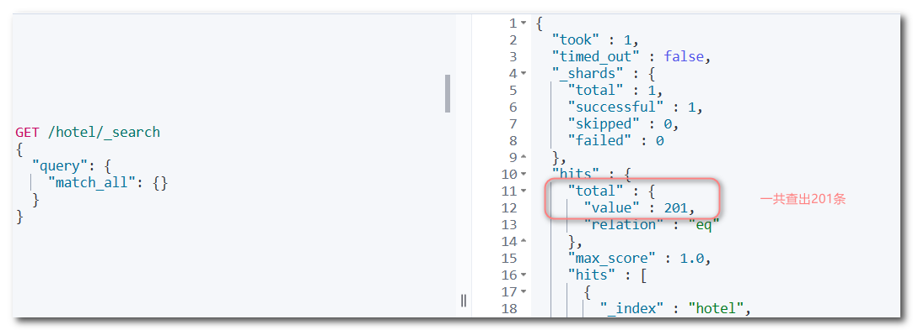


### 8.4.2 精确查询

精确查询一般是查找keyword、数值、日期、boolean等类型字段。所以不会对搜索条件分词。常见的有：

- term：根据词条精确值查询，一般搜索keyword类型、数值类型、布尔类型、日期类型字段。
- range：根据值的范围查询，可以是数值、日期的范围。

#### term查询

term查询语法如下：

```
GET /索引库名/_search
{
  "query": {
    "term": {
      "字段名": {
        "value": "查询值"
      }
    }
  }
}
```

或者：

```
GET /hotel/_search
{
  "query": {
    "term": {
      "字段名": "查询值"
    }
  }
}
```

示例：查询city字段为上海的文档

```
GET /hotel/_search
{
  "query": {
    "term": {
      "city": {
        "value": "上海"
      }
    }
  }
}
或者
GET /hotel/_search
{
  "query": {
    "term": {
      "city": "上海"
    }
  }
}
```


#### range查询

range查询语法：

```json
GET /索引库名/_search
{
  "query": {
    "range": {
      "字段名": {
        "gte": 10, // gte代表大于等于，gt则代表大于
        "lte": 20  // lte代表小于等于，lt则代表小于
      }
    }
  }
}
```

示例：查询酒店价格在1000-2000之间的

```json
GET /hotel/_search
{
  "query": {
    "range": {
      "price": {
        "gte": 1000,
        "lte": 2000
      }
    }
  }
}
```


### 8.4.3 地理坐标查询

#### geo_bounding_box查询

矩形范围查询，也就是geo_bounding_box查询，查询坐标落在某个矩形范围的所有文档：


查询时，需要指定矩形的**左上**、**右下**两个点的坐标，然后画出一个矩形，落在该矩形内的都是符合条件的点。

语法如下：

```json
GET /索引库名/_search
{
  "query": {
    "geo_bounding_box": {
      "字段": { // 需要是geo_point类型的字段
        "top_left": { // 左上点
          "lat": 31.1, // 纬度
          "lon": 121.5 // 精度
        },
        "bottom_right": { // 右下点
          "lat": 30.9,
          "lon": 121.7
        }
      }
    }
  }
}
```


#### geo_distance查询

附近查询，也叫做距离查询（geo_distance）：查询到指定中心点小于某个距离值的所有文档。


语法说明：

```
// geo_distance 查询
GET /索引库名/_search
{
  "query": {
    "geo_distance": {
      "distance": "15km", // 半径	
      "字段名": "31.21,121.5" // 圆心，意思就是查询指定经纬度字段，距离指定圆心15km以内的数据
    }
  }
}
```

需要注意的是指定的圆心的经纬度是**纬度在前，精度在后**。

示例：

```
GET /hotel/_search
{
  "query": {
    "geo_distance": {
      "distance": "2km",
      "location": "31.2,121.5"
    }
  }
}
```


### 8.4.4 复合查询

复合（compound）查询：复合查询可以将其它简单查询组合起来，实现更复杂的搜索逻辑。常见的有两种：

- fuction score：算分函数查询，可以控制文档相关性算分，控制文档排名
- bool query：布尔查询，利用逻辑关系组合多个其它的查询，实现复杂搜索


当我们利用match查询时，文档结果会根据与搜索词条的关联度打分（_score），返回结果时按照分值降序排列。

例如，我们搜索 "虹桥如家"，结果如下：

```
[
  {
    "_score" : 17.850193,
    "_source" : {
      "name" : "虹桥如家酒店真不错",
    }
  },
  {
    "_score" : 12.259849,
    "_source" : {
      "name" : "外滩如家酒店真不错",
    }
  },
  {
    "_score" : 11.91091,
    "_source" : {
      "name" : "迪士尼如家酒店真不错",
    }
  }
]
```

在elasticsearch中，早期使用的打分算法是TF-IDF算法，公式如下：


在后来的5.1版本升级中，elasticsearch将算法改进为BM25算法，公式如下：


要想人为控制相关性算分，就需要利用elasticsearch中的function score 查询了。

#### fuction score查询

fuction score查询语法说明：


function score 查询中包含四部分内容：

- **原始查询条件**：query部分，基于这个条件搜索文档，并且基于BM25算法给文档打分，得到**原始算分**（query score)
- **过滤条件**：filter部分，符合该条件的文档才会重新算分
- **算分函数**：符合filter条件的文档要根据这个函数做运算，得到**函数算分**（function score）。有四种函数：
  - weight：函数结果是常量
  - field_value_factor：以文档中的某个字段值作为函数结果
  - random_score：以随机数作为函数结果
  - script_score：自定义算分函数算法
- **运算模式**：算分函数的结果、原始查询的相关性算分。两者之间的运算方式如下：
  - multiply：相乘，默认的运算模式
  - replace：用function score替换query score
  - 其它，例如：sum、avg、max、min


function score的运行流程如下：

1）根据**原始条件**查询搜索文档，并且计算相关性算分，称为**原始算分**（query score）

2）根据**过滤条件**，过滤文档

3）符合**过滤条件**的文档，基于**算分函数**运算，得到**函数算分**（function score）

4）将**原始算分**（query score）和**函数算分**（function score）基于**运算模式**做运算，得到最终结果，作为相关性算分。


**需求**：给“如家”这个品牌的酒店排名靠前一些

翻译一下这个需求，转换为之前说的四个要点：

- 原始条件：不确定，可以任意变化
- 过滤条件：brand = "如家"
- 算分函数：可以简单粗暴，直接给固定的算分结果，weight
- 运算模式：比如求和

因此最终的DSL语句如下：

```
GET /hotel/_search
{
  "query": {
    "function_score": {
      "query": {  .... }, // 原始查询，可以是任意条件
      "functions": [ // 算分函数
        {
          "filter": { // 满足的条件，品牌必须是如家
            "term": {
              "brand": "如家"
            }
          },
          "weight": 2 // 算分权重为2
        }
      ],
      "boost_mode": "sum" // 加权模式，求和
    }
  }
}
```

在未添加算分函数时，如家得分如下：


添加了算分函数后：


#### bool查询

布尔查询是一个或多个查询子句的组合，每一个子句就是一个**子查询**。子查询的组合方式有：

- must：必须匹配每个子查询，类似“与”
- should：选择性匹配子查询，类似“或”
- must_not：必须不匹配，**不参与算分**，类似“非”
- filter：必须匹配，**不参与算分**


比如在搜索酒店时，除了关键字搜索外，我们还可能根据品牌、价格、城市等字段做过滤：


每一个不同的字段，其查询的条件、方式都不一样，必须是多个不同的查询，而要组合这些查询，就必须用bool查询了。

需要注意的是，搜索时，参与**打分的字段越多，查询的性能也越差**。因此这种多条件查询时，建议这样做：

- 搜索框的关键字搜索，是全文检索查询，使用must查询，参与算分
- 其它过滤条件，采用filter或者must_not查询，不参与算分

bool查询语法：

```
GET /hotel/_search
{
  "query": {
    "bool": {
      "must": [
        {"查询类型": {查询条件}}
      ],
      "should": [
        {"查询类型": {查询条件}},
      ],
      "must_not": [
        {"查询类型": {查询条件}}
      ],
      "filter": [
        {"查询类型": {查询条件}}
      ]
    }
  }
}
```

示例：

```
GET /hotel/_search
{
  "query": {
    "bool": {
      "must": [
        {"term": {"city": "上海" }}
      ],
      "should": [
        {"term": {"brand": "皇冠假日" }},
        {"term": {"brand": "华美达" }}
      ],
      "must_not": [
        { "range": { "price": { "lte": 500 } }}
      ],
      "filter": [
        { "range": {"score": { "gte": 45 } }}
      ]
    }
  }
}
```


需求：搜索名字包含“如家”，价格不高于400，在坐标31.21,121.5周围10km范围内的酒店。

分析：

- 名称搜索，属于全文检索查询，应该参与算分，放到must中
- 价格不高于400，用range查询，属于过滤条件，不参与算分。放到must_not中
- 周围10km范围内，用geo_distance查询，属于过滤条件，不参与算分。放到filter中


### 8.4.5 搜索结果处理

#### 排序

elasticsearch默认是根据相关度算分（_score）来排序，但是也支持自定义方式对搜索[结果排序](https://www.elastic.co/guide/en/elasticsearch/reference/current/sort-search-results.html)。可以排序字段类型有：keyword类型、数值类型、地理坐标类型、日期类型等。

**(1) 普通字段排序**

keyword、数值、日期类型排序的语法基本一致。

```json
GET /indexName/_search
{
  "query": {
    "match_all": {}
  },
  "sort": [
    {
      "FIELD": "desc"  // 排序字段、排序方式asc、desc
    }
  ]
}
```

排序条件是一个数组，也就是可以写多个排序条件。按照声明的顺序，当第一个条件相等时，再按照第二个条件排序，以此类推。


**示例**：酒店数据按照用户评价（score)降序排序，评价相同的按照价格(price)升序排序

```
GET /hotel/_search
{
  "query": {
    "match_all": {}
  },
  "sort": [
    {
      "score": "desc"
    },
    {
      "price": "asc"
    }
  ]
}
```


**(2) 地理坐标排序**

语法说明：

```json
GET /索引库名/_search
{
  "query": {
    "match_all": {}
  },
  "sort": [
    {
      "_geo_distance": {
        "字段名": {	//文档中geo_point类型的字段名
          "lat": 纬度,
          "lon": 精度
        }, 
        "unit": "km",	 // 排序的距离单位
        "order": "desc"	 // 排序方式
      }
    }
  ]
}

或者

GET /索引库名/_search
{
  "query": {
    "match_all": {}
  },
  "sort": [
    {
      "_geo_distance" : {
          "字段名" : "纬度,经度", // 文档中geo_point类型的字段名、目标坐标点
          "order" : "asc", 
          "unit" : "km" 
      }
    }
  ]
}
```

获取你的位置的经纬度的方式：https://lbs.amap.com/demo/jsapi-v2/example/map/click-to-get-lnglat/

示例：假设我的位置是：31.034661，121.612282，寻找我周围距离最近的酒店。

```json
GET /hotel/_search
{
  "query": {
    "match_all": {}
  },
  "sort": [
    {
      "_geo_distance": {
        "location": {
          "lat": 31.034661,
          "lon": 121.612282
        }, 
        "unit": "km", 
        "order": "asc"
      }
    }
  ]
}
```


#### 分页

elasticsearch 默认情况下只返回top10的数据。而如果要查询更多数据就需要修改分页参数了。

elasticsearch中通过修改from、size参数来控制要返回的分页结果：

- from：从第几个文档开始
- size：总共查询几个文档

类似于mysql中的`limit ?, ?`

分页的基本语法如下：

```json
GET /索引库名/_search
{
  "query": {
    "match_all": {}
  },
  "from": 0, // 分页开始的位置，默认为0
  "size": 10, // 期望获取的文档总数
  "sort": [
    {"字段名": "asc"}
  ]
}
```

es在单点模式下，假如查询第990~第1000条 数据，必须先查询 0~1000条，然后截取其中的990 ~ 1000的这10条：


实际生产时elasticsearch一定是集群启动，因此要想获取整个集群的TOP1000，必须先查询出每个节点的TOP1000，汇总结果后，重新排名，重新截取TOP1000：


假如要查询9900~10000的数据呢？是不是要先查询TOP10000呢？那每个节点都要查询10000条？汇总到内存中？

当查询分页深度较大时，汇总数据过多，对内存和CPU会产生非常大的压力，因此elasticsearch会禁止from+ size 超过10000的请求。

针对深度分页，ES提供了两种解决方案，[官方文档](https://www.elastic.co/guide/en/elasticsearch/reference/current/paginate-search-results.html)：

- `search after`：分页时需要排序，原理是从上一次的排序值开始，查询下一页数据。官方推荐使用的方式。
- `scroll`：原理将排序后的文档id形成快照，保存在内存。官方已经不推荐使用。


#### 高亮

高亮的语法：

```json
GET /索引库名/_search
{
  "query": {
    "match": {
      "字段名": "查询词" // 查询条件，高亮一定要使用全文检索查询
    }
  },
  "highlight": {
    "fields": { // 指定要高亮的字段
      "字段名": {
        "pre_tags": "<em>",  // 用来标记高亮字段的前置标签
        "post_tags": "</em>" // 用来标记高亮字段的后置标签
      }
    }
  }
}
```

注意：

- 高亮是对关键字高亮，因此**搜索条件必须带有关键字**，而不能是范围这样的查询。
- 默认情况下，**高亮的字段，必须与搜索指定的字段一致**，否则无法高亮
- 如果要对非搜索字段高亮，则需要添加一个属性：required_field_match=false

示例：将name字段中的"如家"高亮显示


### 8.4.6 总结

查询的DSL是一个大的JSON对象，包含下列属性：

- query：查询条件
- from和size：分页条件
- sort：排序条件
- highlight：高亮条件

示例：


## 8.5 RestClient查询文档

查询文档的操作步骤：

1）准备Request对象

2）准备请求参数

3）发起请求

4）解析响应


### 8.5.1 match_all查询

(1) 创建`SearchRequest`对象，指定索引库名

(2) 利用`request.source()`构建DSL，DSL中可以包含查询、分页、排序、高亮等。

`query()`：代表查询条件，利用`QueryBuilders.matchAllQuery()`构建一个match_all查询的DSL


这里关键的API有两个，一个是`request.source()`，其中包含了查询、排序、分页、高亮等所有功能：


另一个是`QueryBuilders`，其中包含match、term、function_score、bool等各种查询：


(3) 利用client.search()发送请求，得到响应


elasticsearch返回的结果是一个JSON字符串，结构包含：

- `hits`：命中的结果
  - `total`：总条数，其中的value是具体的总条数值
  - `max_score`：所有结果中得分最高的文档的相关性算分
  - `hits`：搜索结果的文档数组，其中的每个文档都是一个json对象
    - `_source`：文档中的原始数据，也是json对象

因此，我们解析响应结果，就是逐层解析JSON字符串，流程如下：

- `SearchHits`：通过response.getHits()获取，就是JSON中的最外层的hits，代表命中的结果
  - `SearchHits.getTotalHits().value`：获取总条数信息
  - `SearchHits.getHits()`：获取SearchHit数组，也就是文档数组
    - `SearchHit.getSourceAsString()`：获取文档结果中的_source，也就是原始的json文档数据


完整代码如下：

```Java
@Test
void testMatchAll() throws IOException {
    // 1.准备Request
    SearchRequest request = new SearchRequest("hotel");
    // 2.准备DSL
    request.source()
        .query(QueryBuilders.matchAllQuery());
    // 3.发送请求
    SearchResponse response = client.search(request, RequestOptions.DEFAULT);

    // 4.解析响应
    handleResponse(response);
}

private void handleResponse(SearchResponse response) {
    // 4.解析响应
    SearchHits searchHits = response.getHits();
    // 4.1.获取总条数
    long total = searchHits.getTotalHits().value;
    System.out.println("共搜索到" + total + "条数据");
    // 4.2.文档数组
    SearchHit[] hits = searchHits.getHits();
    // 4.3.遍历
    for (SearchHit hit : hits) {
        // 获取文档source
        String json = hit.getSourceAsString();
        // 反序列化
        HotelDoc hotelDoc = JSON.parseObject(json, HotelDoc.class);
        System.out.println("hotelDoc = " + hotelDoc);
    }
}
```


### 8.5.2 match查询

全文检索的match和multi_match查询与match_all的API基本一致。差别是查询条件，也就是query的部分。


因此，Java代码上的差异主要是request.source().query()中的参数了。同样是利用QueryBuilders提供的方法：

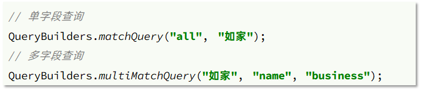

完整代码如下：

```Java
@Test
void testMatch() throws IOException {
    // 1.准备Request
    SearchRequest request = new SearchRequest("hotel");
    // 2.准备DSL
    request.source()
        .query(QueryBuilders.matchQuery("all", "如家"));
    // 3.发送请求
    SearchResponse response = client.search(request, RequestOptions.DEFAULT);
    // 4.解析响应
    handleResponse(response);

}
```


### 8.5.3 精确查询

精确查询主要是两者：

- term：词条精确匹配
- range：范围查询

与之前的查询相比，差异同样在查询条件，其它都一样。

查询条件构造的API如下：


### 8.5.4 布尔查询

布尔查询是用must、must_not、filter等方式组合其它查询，API与其它查询的差别同样是在查询条件的构建，代码示例如下：


完整代码如下：

```java
@Test
void testBool() throws IOException {
    // 1.准备Request
    SearchRequest request = new SearchRequest("hotel");
    // 2.准备DSL
    // 2.1.准备BooleanQuery
    BoolQueryBuilder boolQuery = QueryBuilders.boolQuery();
    // 2.2.添加term
    boolQuery.must(QueryBuilders.termQuery("city", "杭州"));
    // 2.3.添加range
    boolQuery.filter(QueryBuilders.rangeQuery("price").lte(250));

    request.source().query(boolQuery);
    // 3.发送请求
    SearchResponse response = client.search(request, RequestOptions.DEFAULT);
    // 4.解析响应
    handleResponse(response);

}
```


### 8.5.5 排序和分页

搜索结果的排序和分页是与query同级的参数，因此同样是使用request.source()来设置。

对应的API如下：


完整代码示例：

```java
@Test
void testPageAndSort() throws IOException {
    // 页码，每页大小
    int page = 1, size = 5; // 因为当前页码和展示条数由页面传过来，所以这里模拟接收前端传递的参数

    // 1.准备Request
    SearchRequest request = new SearchRequest("hotel");
    // 2.准备DSL
    // 2.1.query
    request.source().query(QueryBuilders.matchAllQuery());
    // 2.2.排序 sort
    request.source().sort("price", SortOrder.ASC);
    // 2.3.分页 from、size
    request.source().from((page - 1) * size).size(5);
    // 3.发送请求
    SearchResponse response = client.search(request, RequestOptions.DEFAULT);
    // 4.解析响应
    handleResponse(response);

}
```


### 8.5.6 高亮

高亮的代码与之前代码差异较大，有两点：

- 查询的DSL：其中除了查询条件，还需要添加高亮条件，同样是与query同级。
- 结果解析：结果除了要解析_source文档数据，还要解析高亮结果

**高亮请求构建**

高亮请求的构建API如下：


上述代码省略了查询条件部分，高亮查询必须使用全文检索查询，并且要有搜索关键字，将来才可以对关键字高亮。

完整代码如下：

```java
@Test
void testHighlight() throws IOException {
    // 1.准备Request
    SearchRequest request = new SearchRequest("hotel");
    // 2.准备DSL
    // 2.1.query
    request.source().query(QueryBuilders.matchQuery("all", "如家"));
    // 2.2.高亮
    // new HighlightBuilder()后面也可以链式调用preTags()和postTags()指定高亮的标签，默认是<em>标签。
    request.source().highlighter(new HighlightBuilder().field("name").requireFieldMatch(false));
    // 3.发送请求
    SearchResponse response = client.search(request, RequestOptions.DEFAULT);
    // 4.解析响应
    handleResponse(response);

}
```

**高亮结果解析**

高亮的结果与查询的文档结果默认是分离的，并不在一起。

因此解析高亮的代码需要额外处理：


代码解读：

- 第一步：从结果中获取source。hit.getSourceAsString()，这部分是非高亮结果，json字符串。还需要反序列为HotelDoc对象
- 第二步：获取高亮结果。hit.getHighlightFields()，返回值是一个Map，key是高亮字段名称，值是HighlightField对象，代表高亮值
- 第三步：从map中根据高亮字段名称，获取高亮字段值对象HighlightField
- 第四步：从HighlightField中获取Fragments，并且转为字符串。这部分就是真正的高亮字符串了
- 第五步：用高亮的结果替换HotelDoc中的非高亮结果

完整代码如下：

```java
private void handleResponse(SearchResponse response) {
    // 4.解析响应
    SearchHits searchHits = response.getHits();
    // 4.1.获取总条数
    long total = searchHits.getTotalHits().value;
    System.out.println("共搜索到" + total + "条数据");
    // 4.2.文档数组
    SearchHit[] hits = searchHits.getHits();
    // 4.3.遍历
    for (SearchHit hit : hits) {
        // 获取文档source
        String json = hit.getSourceAsString();
        // 反序列化
        HotelDoc hotelDoc = JSON.parseObject(json, HotelDoc.class);
        // 获取高亮结果
        Map<String, HighlightField> highlightFields = hit.getHighlightFields();
        // 注意这个集合工具类是这个包下的：org.springframework.util.CollectionUtils;
        if (!CollectionUtils.isEmpty(highlightFields)) {
            // 根据字段名获取高亮结果
            HighlightField highlightField = highlightFields.get("name");
            if (highlightField != null) {
                // 获取高亮值
                String name = highlightField.getFragments()[0].string();
                // 覆盖非高亮结果
                hotelDoc.setName(name);
            }
        }
        System.out.println("hotelDoc = " + hotelDoc);
    }
}
```

控制台查看结果：


## 8.6 黑马旅游案例

在之前导入的hotel_demo项目，已经提供好了黑马旅游案例的前端界面。

### 8.6.1 酒店搜索和分页

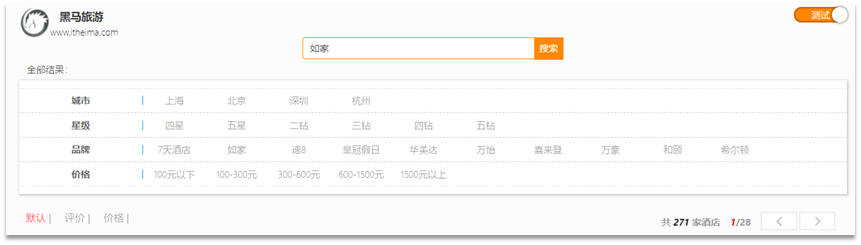

**(1) 需求分析**

在项目的首页，有一个搜索框，还有分页按钮，点击搜索按钮，可以看到浏览器控制台发出了请求：

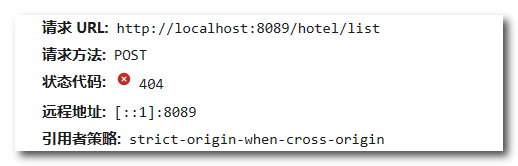

请求参数如下：


由此可以知道，我们这个请求的信息如下：

- 请求方式：POST
- 请求路径：/hotel/list
- 请求参数：JSON对象，包含4个字段：
  - key：搜索关键字
  - page：页码
  - size：每页大小
  - sortBy：排序，目前暂不实现
- 返回值：分页查询，需要返回分页结果PageResult，包含两个属性：
  - `total`：总条数
  - `List<HotelDoc>`：当前页的数据

因此，我们实现业务的流程如下：

- 步骤一：定义实体类，接收请求参数的JSON对象
- 步骤二：编写controller，接收页面的请求
- 步骤三：编写业务实现，利用RestHighLevelClient实现搜索、分页

**(2) 定义实体类** 

实体类有两个，一个是前端的请求参数实体，一个是服务端应该返回的响应结果实体。

1）请求参数

前端请求的json结构如下：

```json
{
    "key": "搜索关键字",
    "page": 1,
    "size": 3,
    "sortBy": "default"
}
```

因此，我们在`cn.itcast.hotel.pojo`包下定义一个实体类：

```java
package cn.itcast.hotel.pojo;

import lombok.Data;

@Data
public class RequestParams {
    private String key;
    private Integer page;
    private Integer size;
    private String sortBy;
}
```

2）返回值

分页查询，需要返回分页结果PageResult，包含两个属性：

- `total`：总条数
- `List<HotelDoc>`：当前页的数据

因此，我们在`cn.itcast.hotel.pojo`中定义返回结果：

```java
package cn.itcast.hotel.pojo;

import lombok.Data;

import java.util.List;

@Data
public class PageResult {
    private Long total;
    private List<HotelDoc> hotels;

    public PageResult() {
    }

    public PageResult(Long total, List<HotelDoc> hotels) {
        this.total = total;
        this.hotels = hotels;
    }
}
```


**(3) 定义controller**

定义一个HotelController，声明查询接口，满足下列要求：

- 请求方式：Post
- 请求路径：/hotel/list
- 请求参数：对象，类型为RequestParam
- 返回值：PageResult，包含两个属性
  - `Long total`：总条数
  - `List<HotelDoc> hotels`：酒店数据


因此，我们在`cn.itcast.hotel.controller`中定义HotelController：

```java
@RestController
@RequestMapping("/hotel")
public class HotelController {

    @Autowired
    private IHotelService hotelService;
	// 搜索酒店数据
    @PostMapping("/list")
    public PageResult search(@RequestBody RequestParams params){
        return hotelService.search(params);
    }
}
```


**(4) 实现搜索业务**

我们在controller调用了IHotelService，并没有实现该方法，因此下面我们就在IHotelService中定义方法，并且去实现业务逻辑。

1）在`cn.itcast.hotel.service`中的`IHotelService`接口中定义一个方法：

```java
/**
 * 根据关键字搜索酒店信息
 * @param params 请求参数对象，包含用户输入的关键字 
 * @return 酒店文档列表
 */
PageResult search(RequestParams params);
```

2）实现搜索业务，肯定离不开RestHighLevelClient，我们需要把它注册到Spring中作为一个Bean。在`cn.itcast.hotel`中的`HotelDemoApplication`中声明这个Bean：

```java
@Bean
public RestHighLevelClient client(){
    return  new RestHighLevelClient(RestClient.builder(
        HttpHost.create("http://192.168.101.100:9200")
    ));
}
```

3）在`cn.itcast.hotel.service.impl`中的`HotelServiceImpl`中实现search方法：

```java
@Override
public PageResult search(RequestParams params) {
    try {
        // 1.准备Request
        SearchRequest request = new SearchRequest("hotel");
        // 2.准备DSL
        // 2.1.query
        String key = params.getKey();
        if (key == null || "".equals(key)) {
            boolQuery.must(QueryBuilders.matchAllQuery());
        } else {
            boolQuery.must(QueryBuilders.matchQuery("all", key));
        }

        // 2.2.分页
        int page = params.getPage();
        int size = params.getSize();
        request.source().from((page - 1) * size).size(size);

        // 3.发送请求
        SearchResponse response = client.search(request, RequestOptions.DEFAULT);
        // 4.解析响应
        return handleResponse(response);
    } catch (IOException e) {
        throw new RuntimeException(e);
    }
}

// 结果解析
private PageResult handleResponse(SearchResponse response) {
    // 4.解析响应
    SearchHits searchHits = response.getHits();
    // 4.1.获取总条数
    long total = searchHits.getTotalHits().value;
    // 4.2.文档数组
    SearchHit[] hits = searchHits.getHits();
    // 4.3.遍历
    List<HotelDoc> hotels = new ArrayList<>();
    for (SearchHit hit : hits) {
        // 获取文档source
        String json = hit.getSourceAsString();
        // 反序列化
        HotelDoc hotelDoc = JSON.parseObject(json, HotelDoc.class);
		// 放入集合
        hotels.add(hotelDoc);
    }
    
    // 下面是使用stream流的方式
    //  List<HotelDoc> hotels = Arrays.stream(hits).map(
    //        (hit) -> {
    //            // 获取文档source
    //            String source = hit.getSourceAsString();
    //            // 反序列化
    //            HotelDoc hotelDoc = JSON.parseObject(source, HotelDoc.class);
    //            return hotelDoc;
    //        }
    // ).collect(Collectors.toList());
    
    // 4.4.封装返回
    return new PageResult(total, hotels);
}
```


### 8.6.2 酒店结果过滤


**(1) 需求分析**

添加品牌、城市、星级、价格等过滤功能，传递的参数如图：


包含的过滤条件有：

- brand：品牌值
- city：城市
- minPrice~maxPrice：价格范围
- starName：星级

我们需要做两件事情：

- 修改请求参数的对象RequestParams，接收上述参数
- 修改业务逻辑，在搜索条件之外，添加一些过滤条件

**(2) 修改实体类**

修改在`cn.itcast.hotel.pojo`包下的实体类RequestParams：

```java
@Data
public class RequestParams {
    private String key;
    private Integer page;
    private Integer size;
    private String sortBy;
    // 下面是新增的过滤条件参数
    private String city;
    private String brand;
    private String starName;
    private Integer minPrice;
    private Integer maxPrice;
}
```

**(3) 修改搜索业务**

在HotelService的search方法中，只有一个地方需要修改：requet.source().query( ... )其中的查询条件。

在之前的业务中，只有match查询，根据关键字搜索，现在要添加条件过滤，包括：

- 品牌过滤：是keyword类型，用term查询
- 星级过滤：是keyword类型，用term查询
- 价格过滤：是数值类型，用range查询
- 城市过滤：是keyword类型，用term查询

多个查询条件组合，肯定是boolean查询来组合：

- 关键字搜索放到must中，参与算分
- 其它过滤条件放到filter中，不参与算分


因为条件构建的逻辑比较复杂，这里先封装为一个函数：

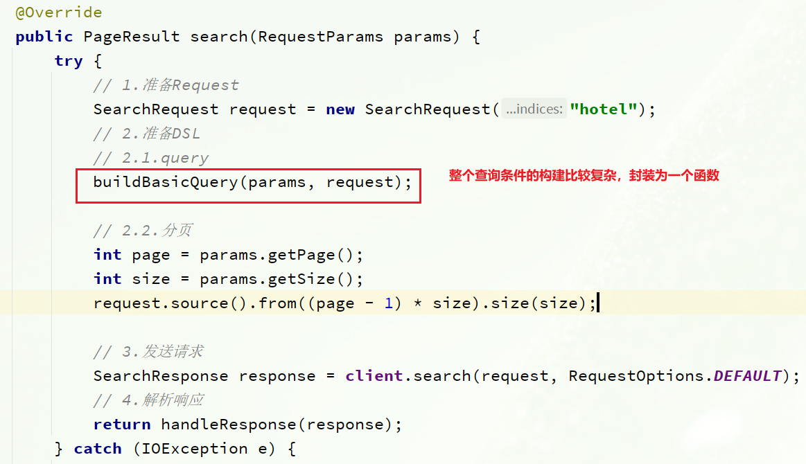

buildBasicQuery的代码如下：

```java
private void buildBasicQuery(RequestParams params, SearchRequest request) {
    // 1.构建BooleanQuery
    BoolQueryBuilder boolQuery = QueryBuilders.boolQuery();
    // 2.关键字搜索
    String key = params.getKey();
    if (key == null || "".equals(key)) {
        boolQuery.must(QueryBuilders.matchAllQuery());
    } else {
        boolQuery.must(QueryBuilders.matchQuery("all", key));
    }
    // 3.城市条件
    if (params.getCity() != null && !params.getCity().equals("")) {
        boolQuery.filter(QueryBuilders.termQuery("city", params.getCity()));
    }
    // 4.品牌条件
    if (params.getBrand() != null && !params.getBrand().equals("")) {
        boolQuery.filter(QueryBuilders.termQuery("brand", params.getBrand()));
    }
    // 5.星级条件
    if (params.getStarName() != null && !params.getStarName().equals("")) {
        boolQuery.filter(QueryBuilders.termQuery("starName", params.getStarName()));
    }
	// 6.价格
    if (params.getMinPrice() != null && params.getMaxPrice() != null) {
        boolQuery.filter(QueryBuilders
                         .rangeQuery("price")
                         .gte(params.getMinPrice())
                         .lte(params.getMaxPrice())
                        );
    }
	// 7.放入source
    request.source().query(boolQuery);
}
```


### 8.6.3 周边的酒店

**(1) 需求分析**

在酒店列表页的右侧，有一个小地图，点击地图的定位按钮，地图会找到你所在的位置：


并且，在前端会发起查询请求，将你的坐标发送到服务端：

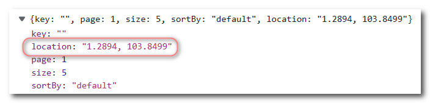

我们要做的事情就是基于这个location坐标，然后按照距离对周围酒店排序。实现思路如下：

- 修改RequestParams参数，接收location字段
- 修改search方法业务逻辑，如果location有值，添加根据geo_distance排序的功能

**(2) 修改实体类**

修改在`cn.itcast.hotel.pojo`包下的实体类RequestParams：

```java
package cn.itcast.hotel.pojo;

import lombok.Data;

@Data
public class RequestParams {
    private String key;
    private Integer page;
    private Integer size;
    private String sortBy;
    private String city;
    private String brand;
    private String starName;
    private Integer minPrice;
    private Integer maxPrice;
    // 我当前的地理坐标
    private String location;
}
```

**(3) 添加距离排序**

地理坐标排序DSL语法如下：

```
GET /indexName/_search
{
  "query": {
    "match_all": {}
  },
  "sort": [
    {
      "price": "asc"  
    },
    {
      "_geo_distance" : {
          "FIELD" : "纬度，经度",
          "order" : "asc",
          "unit" : "km"
      }
    }
  ]
}
```

对应的java代码示例：


在`cn.itcast.hotel.service.impl`的`HotelServiceImpl`的`search`方法中，添加一个排序功能：

```JAVA 
@Override
public PageResult search(RequestParams params) {
    try {
        // 1.准备Request
        SearchRequest request = new SearchRequest("hotel");
        // 2.准备DSL
        // 2.1.query
        buildBasicQuery(params, request);

        // 2.2.分页
        int page = params.getPage();
        int size = params.getSize();
        request.source().from((page - 1) * size).size(size);

        // 2.3.排序
        String location = params.getLocation();
        if (location != null && !location.equals("")) {
            request.source().sort(SortBuilders
                                  .geoDistanceSort("location", new GeoPoint(location))
                                  .order(SortOrder.ASC)
                                  .unit(DistanceUnit.KILOMETERS)
                                 );
        }

        // 3.发送请求
        SearchResponse response = client.search(request, RequestOptions.DEFAULT);
        // 4.解析响应
        return handleResponse(response);
    } catch (IOException e) {
        throw new RuntimeException(e);
    }
}
```

**(4) 排序距离显示**

排序完成后，页面还要获取我附近每个酒店的具体距离值，这个值在响应结果中是独立的：


因此，我们在结果解析阶段，除了解析source部分以外，还要得到sort部分，也就是排序的距离，然后放到响应结果中：

- 修改HotelDoc，添加排序距离字段，用于页面显示
- 修改HotelService类中的handleResponse方法，添加对sort值的获取

1）修改HotelDoc类，添加距离字段

```java
@Data
@NoArgsConstructor
public class HotelDoc {
    private Long id;
    private String name;
    private String address;
    private Integer price;
    private Integer score;
    private String brand;
    private String city;
    private String starName;
    private String business;
    private String location;
    private String pic;
    // 排序时的 距离值
    private Object distance;

    public HotelDoc(Hotel hotel) {
        this.id = hotel.getId();
        this.name = hotel.getName();
        this.address = hotel.getAddress();
        this.price = hotel.getPrice();
        this.score = hotel.getScore();
        this.brand = hotel.getBrand();
        this.city = hotel.getCity();
        this.starName = hotel.getStarName();
        this.business = hotel.getBusiness();
        this.location = hotel.getLatitude() + ", " + hotel.getLongitude();
        this.pic = hotel.getPic();
    }
}
```

2）修改HotelServiceImpl中的handleResponse方法

```java
	 // 结果解析
    private PageResult handleResponse(SearchResponse response) {
        // 4.解析响应
        SearchHits searchHits = response.getHits();
        // 4.1.获取总条数
        long total = searchHits.getTotalHits().value;
        // 4.2.文档数组
        SearchHit[] hits = searchHits.getHits();
        // 4.3.遍历，使用stream流的方式
        List<HotelDoc> hotels = Arrays.stream(hits).map(
                (hit) -> {
                    // 获取文档source
                    String source = hit.getSourceAsString();
                    // 反序列化
                    HotelDoc hotelDoc = JSON.parseObject(source, HotelDoc.class);
                    // 获取排序值
                    Object[] sortValues = hit.getSortValues();
                    if(sortValues.length>0){
                        Object sortValue = sortValues[0];
                        hotelDoc.setDistance(sortValue);
                    }
                    return hotelDoc;
                }
        ).collect(Collectors.toList());

        // 4.4.封装返回
        return new PageResult(total, hotels);
    }
```


### 8.6.4 酒店竞价排名

**(1) 需求分析**

让指定酒店排名靠前。因此我们需要给这些酒店添加一个标记，这样在过滤条件中就可以根据这个标记来判断，是否要提高算分。

比如，我们给酒店添加一个字段：isAD，Boolean类型：

- true：是广告
- false：不是广告

这样function_score包含3个要素就很好确定了：

- 过滤条件：判断isAD 是否为true
- 算分函数：我们可以用最简单暴力的weight，固定加权值
- 加权方式：可以用默认的相乘，大大提高算分


因此，业务的实现步骤包括：

1. 给HotelDoc类添加isAD字段，Boolean类型

2. 挑选几个你喜欢的酒店，给它的文档数据添加isAD字段，值为true

3. 修改search方法，添加function score功能，给isAD值为true的酒店增加权重

**(2) 修改HotelDoc实体**

给`cn.itcast.hotel.pojo`包下的HotelDoc类添加isAD字段：

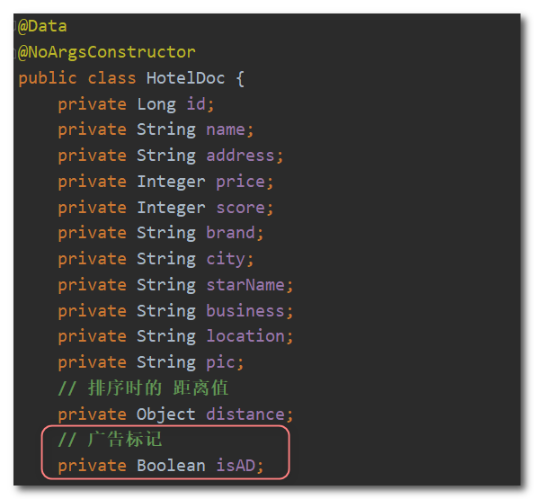

**(3) 添加广告标记**

我们挑几个酒店，使用kibana客户端添加isAD字段，设置为true：

```json
POST /hotel/_update/584697
{
    "doc": {
        "isAD": true
    }
}
POST /hotel/_update/659496
{
    "doc": {
        "isAD": true
    }
}
POST /hotel/_update/711837
{
    "doc": {
        "isAD": true
    }
}
POST /hotel/_update/200214538
{
    "doc": {
        "isAD": true
    }
}
```

**(4) 添加算分函数查询**

修改查询条件，之前是用的boolean 查询，现在要改成function_socre查询。

function_score查询结构对应的JavaAPI示例如下：


将之前写的boolean查询作为**原始查询**条件放到query中，然后添加**过滤条件**、**算分函数**、**加权模式**。

修改`cn.itcast.hotel.service.impl`包下的`HotelServiceImpl`类中的`buildBasicQuery`方法，添加算分函数查询：

```java
private void buildBasicQuery(RequestParams params, SearchRequest request) {
    // 1.构建BooleanQuery
    BoolQueryBuilder boolQuery = QueryBuilders.boolQuery();
    // 关键字搜索
    String key = params.getKey();
    if (key == null || "".equals(key)) {
        boolQuery.must(QueryBuilders.matchAllQuery());
    } else {
        boolQuery.must(QueryBuilders.matchQuery("all", key));
    }
    // 城市条件
    if (params.getCity() != null && !params.getCity().equals("")) {
        boolQuery.filter(QueryBuilders.termQuery("city", params.getCity()));
    }
    // 品牌条件
    if (params.getBrand() != null && !params.getBrand().equals("")) {
        boolQuery.filter(QueryBuilders.termQuery("brand", params.getBrand()));
    }
    // 星级条件
    if (params.getStarName() != null && !params.getStarName().equals("")) {
        boolQuery.filter(QueryBuilders.termQuery("starName", params.getStarName()));
    }
    // 价格
    if (params.getMinPrice() != null && params.getMaxPrice() != null) {
        boolQuery.filter(QueryBuilders
                         .rangeQuery("price")
                         .gte(params.getMinPrice())
                         .lte(params.getMaxPrice())
                        );
    }

    // 2.算分控制
    FunctionScoreQueryBuilder functionScoreQuery =
        QueryBuilders.functionScoreQuery(
        // 原始查询，相关性算分的查询
        boolQuery,
        // function score的数组
        new FunctionScoreQueryBuilder.FilterFunctionBuilder[]{
            // 其中的一个function score 元素
            new FunctionScoreQueryBuilder.FilterFunctionBuilder(
                // 过滤条件
                QueryBuilders.termQuery("isAD", true),
                // 算分函数
                ScoreFunctionBuilders.weightFactorFunction(10)
            )
        });
    request.source().query(functionScoreQuery);
}
```


## 8.7 数据聚合

**[聚合（](https://www.elastic.co/guide/en/elasticsearch/reference/current/search-aggregations.html)[aggregations](https://www.elastic.co/guide/en/elasticsearch/reference/current/search-aggregations.html)[）](https://www.elastic.co/guide/en/elasticsearch/reference/current/search-aggregations.html)**可以让我们极其方便的实现对数据的统计、分析、运算。例如：

- 什么品牌的手机最受欢迎？
- 这些手机的平均价格、最高价格、最低价格？
- 这些手机每月的销售情况如何？

实现这些统计功能的比数据库的sql要方便的多，而且查询速度非常快，可以实现近实时搜索效果。

聚合常见的有三类：

- **桶（Bucket）**聚合：用来对文档做分组
  - TermAggregation：按照文档字段值分组，例如按照品牌值分组、按照国家分组
  - Date Histogram：按照日期阶梯分组，例如一周为一组，或者一月为一组

- **度量（Metric）**聚合：用以计算一些值，比如：最大值、最小值、平均值等
  - Avg：求平均值
  - Max：求最大值
  - Min：求最小值
  - Stats：同时求max、min、avg、sum等
- **管道（pipeline）**聚合：其它聚合的结果为基础做聚合

**注意：**参加聚合的字段必须是keyword、日期、数值、布尔类型


### 8.7.1 DSL实现聚合

要统计所有数据中的酒店品牌有几种，其实就是按照品牌对数据分组。此时可以根据酒店品牌的名称做聚合，也就是Bucket聚合。

#### Bucket聚合语法

```json
GET /hotel/_search
{
  "size": 0,  // 设置size为0，结果中不包含文档，只包含聚合结果
  "aggs": { // 定义聚合
    "聚合名称": { //给聚合起个名字
      "terms": { // 聚合的类型，按照品牌值聚合，所以选择term
        "field": "字段名", // 参与聚合的字段
        "size": 20 // 希望获取的聚合结果数量
      }
    }
  }
}
```

示例：

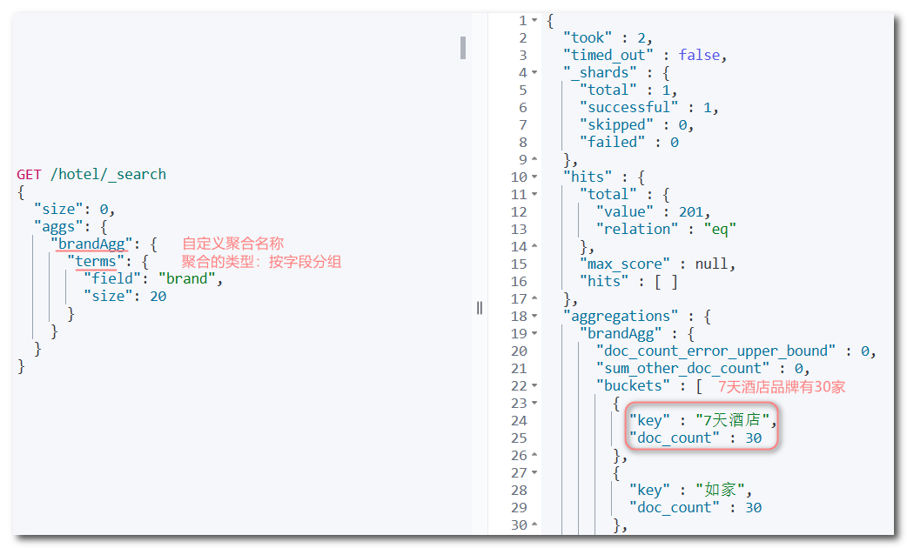


#### 聚合结果排序

默认情况下，Bucket聚合会统计Bucket内的文档数量，记为 `_count`，并且按照 `_count` 降序排序。

我们可以指定order属性，自定义聚合的排序方式：

```json
GET /hotel/_search
{
  "size": 0, 
  "aggs": {
    "brandAgg": {
      "terms": {
        "field": "brand",
        "order": {
          "_count": "asc" // 按照_count升序排列
        },
        "size": 20
      }
    }
  }
}
```


#### 限定聚合范围

默认情况下，Bucket聚合是对索引库的所有文档做聚合，但真实场景下，用户会输入搜索条件，因此聚合必须是对搜索结果聚合。那么聚合必须添加限定条件。我们可以限定要聚合的文档范围，只要添加query条件即可：

```json
GET /hotel/_search
{
  "query": {
    "range": {
      "price": {
        "lte": 200 //只对200元以下的文档聚合
      }
    }
  },
  "size": 0,
  "aggs": {
    "brandAgg": {
      "terms": {
        "field": "brand",
        "size": 20
      }
    }
  }
}
```


#### Metric聚合语法

之前对酒店按照品牌分组，形成了一个个桶。现在我们需要对桶内的酒店做运算，获取每个品牌的用户评分的min、max、avg等值。

这就要用到Metric聚合了，例如stats聚合：就可以获取min、max、avg等结果。

语法如下：

```json
GET /hotel/_search
{
  "size": 0, 
  "aggs": {
    "brandAgg": { 
      "terms": { 
        "field": "brand", 
        "size": 20
      },
      "aggs": { // 是brands聚合的子聚合，也就是分组后对每组分别计算
        "score_stats": { // 聚合名称
          "stats": { // 聚合类型，这里stats可以计算min、max、avg等
            "field": "score" // 聚合字段，这里是score
          }
        }
      }
    }
  }
}
```

我们还可以给聚合结果做个排序，例如按照每个桶的酒店平均分做排序：

```json
GET /hotel/_search
{
  "size": 0, 
  "aggs": {
    "brandAgg": { 
      "terms": { 
        "field": "brand", 
        "size": 20
        
      },
      "aggs": { // 是brands聚合的子聚合，也就是分组后对每组分别计算
        "score_stats": { // 聚合名称
          "stats": { // 聚合类型，这里stats可以计算min、max、avg等
            "field": "score" // 聚合字段，这里是score
          }
        }
      }
    }
  }
}
```


**小结**

aggs代表聚合，与query同级，此时query的作用是限定聚合的的文档范围。

聚合必须的三要素：聚合名称、聚合类型、聚合字段

聚合可配置属性有：

- size：指定聚合结果数量
- order：指定聚合结果排序方式
- field：指定聚合字段


### 8.7.2 RestAPI实现聚合

**API语法**

聚合条件与query条件同级别，因此需要使用request.source()来指定聚合条件。

聚合条件的语法：


聚合的结果也与查询结果不同，API也比较特殊。不过同样是JSON逐层解析：


下面实现黑马旅游案例中的一个需求：

**业务需求**

需求：搜索页面的品牌、城市等信息不应该是在页面写死，而是通过聚合索引库中的酒店数据得来的：


**需求分析**

用户搜索“东方明珠”，那搜索的酒店肯定是在上海东方明珠附近，因此，城市只能是上海，此时城市列表中就不应该显示北京、深圳、杭州这些信息了。也就是说，搜索结果中包含哪些城市，页面就应该列出哪些城市；搜索结果中包含哪些品牌，页面就应该列出哪些品牌。

如何得知搜索结果中包含哪些品牌？如何得知搜索结果中包含哪些城市？

使用聚合功能，利用Bucket聚合，对搜索结果中的文档基于品牌分组、基于城市分组，就能得知包含哪些品牌、哪些城市了。

因为是对搜索结果聚合，因此聚合是**限定范围的聚合**，也就是说聚合的限定条件跟搜索文档的条件一致。

返回值类型就是页面要展示的最终结果：


结果是一个Map结构：

- key是字符串，城市、星级、品牌、价格
- value是集合，例如多个城市的名称


**业务实现**

在`cn.itcast.hotel.controller`包的`HotelController`中添加一个方法，遵循下面的要求：

- 请求方式：`POST`
- 请求路径：`/hotel/filters`
- 请求参数：`RequestParams`，与搜索文档的参数一致
- 返回值类型：`Map<String, List<String>>`

```java
    @PostMapping("filters")
    public Map<String, List<String>> getFilters(@RequestBody RequestParams params){
        return hotelService.getFilters(params);
    }
```

这里调用了IHotelService中的getFilters方法，尚未实现，在`cn.itcast.hotel.service.IHotelService`中定义新方法：

```java
Map<String, List<String>> filters(RequestParams params);
```

在`cn.itcast.hotel.service.impl.HotelServiceImpl`中实现该方法：

```java
@Override
public Map<String, List<String>> filters(RequestParams params) {
    try {
        // 1.准备Request
        SearchRequest request = new SearchRequest("hotel");
        // 2.准备DSL
        // 2.1.query
        buildBasicQuery(params, request);
        // 2.2.设置size
        request.source().size(0);
        // 2.3.聚合
        buildAggregation(request);
        // 3.发出请求
        SearchResponse response = client.search(request, RequestOptions.DEFAULT);
        // 4.解析结果
        Map<String, List<String>> result = new HashMap<>();
        Aggregations aggregations = response.getAggregations();
        // 4.1.根据品牌名称，获取品牌结果
        List<String> brandList = getAggByName(aggregations, "brandAgg");
        result.put("brand", brandList);
        // 4.2.根据品牌名称，获取品牌结果
        List<String> cityList = getAggByName(aggregations, "cityAgg");
        result.put("city", cityList);
        // 4.3.根据品牌名称，获取品牌结果
        List<String> starList = getAggByName(aggregations, "starAgg");
        result.put("starName", starList);

        return result;
    } catch (IOException e) {
        throw new RuntimeException(e);
    }
}

private void buildAggregation(SearchRequest request) {
    request.source().aggregation(AggregationBuilders
                                 .terms("brandAgg")
                                 .field("brand")
                                 .size(100)
                                );
    request.source().aggregation(AggregationBuilders
                                 .terms("cityAgg")
                                 .field("city")
                                 .size(100)
                                );
    request.source().aggregation(AggregationBuilders
                                 .terms("starAgg")
                                 .field("starName")
                                 .size(100)
                                );
}

private List<String> getAggByName(Aggregations aggregations, String aggName) {
    // 4.1.根据聚合名称获取聚合结果
    Terms brandTerms = aggregations.get(aggName);
    // 4.2.获取buckets
    List<? extends Terms.Bucket> buckets = brandTerms.getBuckets();
    // 4.3.遍历
    List<String> brandList = new ArrayList<>();
    for (Terms.Bucket bucket : buckets) {
        // 4.4.获取key
        String key = bucket.getKeyAsString();
        brandList.add(key);
    }
    return brandList;
}
```


## 8.8 自动补全

### 8.8.1 拼音分词器

要实现根据字母做补全，就必须对文档按照拼音分词。

GitHub上好有elasticsearch的拼音分词插件，地址：https://github.com/medcl/elasticsearch-analysis-pinyin

下载与elasticsearch对应的版本（资料中已提供），将其上传到docker中elasticsearch的plugin目录，然后重启elasticsearch。


测试拼音分词器：

```json'
POST /_analyze
{
  "text": "如家酒店",
  "analyzer": "pinyin"
}
```


### 8.8.2 自定义分词器

默认的拼音分词器会将每个汉字单独分为拼音，而我们希望的是每个词条形成一组拼音，需要对拼音分词器做个性化定制。

elasticsearch中分词器（analyzer）的组成包含三部分：

- character filters：在tokenizer之前对文本进行处理。例如删除字符、替换字符
- tokenizer：将文本按照一定的规则切割成词条（term）。例如keyword，就是不分词；还有ik_smart
- tokenizer filter：将tokenizer输出的词条做进一步处理。例如大小写转换、同义词处理、拼音处理等


文档分词时会依次由这三部分来处理文档：


声明自定义分词器的语法示例如下：

```json
PUT /test
{
  "settings": {
    "analysis": {
      "analyzer": {	// 自定义分词器
        "my_analyzer": {	// 分词器名称
          "tokenizer": "ik_max_word",
          "filter": "py"	// 使用自定义的filter
        }
      },
      "filter": {	// 自定义tokenizer filter
        "py": {	// 过滤器名称
          "type": "pinyin",	// 过滤器类型，这里是pinyin
          "keep_full_pinyin": false,
          "keep_joined_full_pinyin": true,
          "keep_original": true,
          "limit_first_letter_length": 16,
          "remove_duplicated_term": true,
          "none_chinese_pinyin_tokenize": false
        }
      }
    }
  },
  "mappings": {
    "properties": {
      "name": {
        "type": "text",
        "analyzer": "my_analyzer",	// 创建文档时使用的分词器
        "search_analyzer": "ik_smart"	// 查找时使用的分词器
      }
    }
  }
}
```

测试：

```json
POST /test/_analyze
{
  "text": "如家酒店",
  "analyzer": "my_analyzer"
}
```

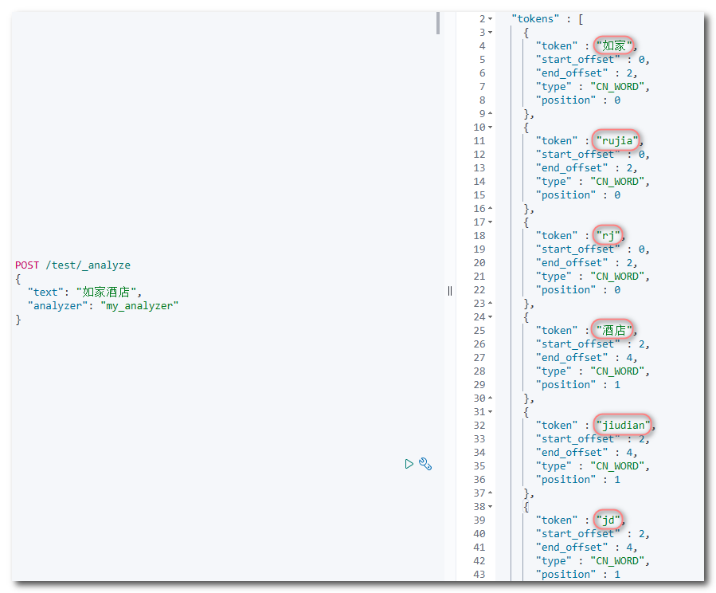


### 8.8.3 自动补全查询

elasticsearch提供了[Completion Suggester](https://www.elastic.co/guide/en/elasticsearch/reference/7.6/search-suggesters.html)查询来实现自动补全功能。

这个查询会匹配以用户输入内容开头的词条并返回。为了提高补全查询的效率，对于文档中字段的类型有一些约束：

- 参与补全查询的字段必须是completion类型。

- 字段的内容一般是用来补全的多个词条形成的数组。

比如，一个这样的索引库：

```json
PUT test2
{
  "mappings": {
    "properties": {
      "title": {
        "type": "completion"
      }
    }
  }
}
```

然后插入下面的数据：

```json
POST /test2/_doc
{
  "title": ["Sony", "WH-1000XM3"]
}
POST /test2/_doc
{
  "title": ["SK-II", "PITERA"]
}
POST /test2/_doc
{
  "title": ["Nintendo", "switch"]
}
```

查询的DSL语句如下：

```json
GET /test2/_search
{
  "suggest": {
    "title_suggest": {
      "text": "s",	// 关键字
      "completion": {
        "field": "title",	// 补全查询的字段
        "skip_duplicates": true,	// 跳过重复的
        "size": 10	// 获取前10条结果
      }
    }
  }
}
```


### 8.8.4 实现酒店搜索框自动补全

1. 修改hotel索引库结构，设置自定义拼音分词器

2. 修改索引库的name、all字段，使用自定义分词器

3. 索引库添加一个新字段suggestion，类型为completion类型，使用自定义的分词器

4. 给HotelDoc类添加suggestion字段，内容包含brand、business

5. 重新导入数据到hotel库

**修改酒店映射结构**

首先先删除酒店数据索引库：

```
DELETE /hotel
```

然后创建酒店数据索引库：

```
PUT /hotel
{
  "settings": {
    "analysis": {
      "analyzer": {
        "text_anlyzer": {
          "tokenizer": "ik_max_word",
          "filter": "py"
        },
        "completion_analyzer": {
          "tokenizer": "keyword",
          "filter": "py"
        }
      },
      "filter": {
        "py": {
          "type": "pinyin",
          "keep_full_pinyin": false,
          "keep_joined_full_pinyin": true,
          "keep_original": true,
          "limit_first_letter_length": 16,
          "remove_duplicated_term": true,
          "none_chinese_pinyin_tokenize": false
        }
      }
    }
  },
  "mappings": {
    "properties": {
      "id":{
        "type": "keyword"
      },
      "name":{
        "type": "text",
        "analyzer": "text_anlyzer",
        "search_analyzer": "ik_smart",
        "copy_to": "all"
      },
      "address":{
        "type": "keyword",
        "index": false
      },
      "price":{
        "type": "integer"
      },
      "score":{
        "type": "integer"
      },
      "brand":{
        "type": "keyword",
        "copy_to": "all"
      },
      "city":{
        "type": "keyword"
      },
      "starName":{
        "type": "keyword"
      },
      "business":{
        "type": "keyword",
        "copy_to": "all"
      },
      "location":{
        "type": "geo_point"
      },
      "pic":{
        "type": "keyword",
        "index": false
      },
      "all":{
        "type": "text",
        "analyzer": "text_anlyzer",
        "search_analyzer": "ik_smart"
      },
      "suggestion":{
          "type": "completion",
          "analyzer": "completion_analyzer"
      }
    }
  }
}
```


**修改HotelDoc实体**

因为mappings中新增了一个字段suggestion，因此在HotelDoc中添加一个suggestion字段，类型为`List<String>`，然后将brand、business等信息放到里面。

```java
@Data
@NoArgsConstructor
public class HotelDoc {
    private Long id;
    private String name;
    private String address;
    private Integer price;
    private Integer score;
    private String brand;
    private String city;
    private String starName;
    private String business;
    private String location;
    private String pic;
    private Object distance;
    private Boolean isAD;
    private List<String> suggestion;

    public HotelDoc(Hotel hotel) {
        this.id = hotel.getId();
        this.name = hotel.getName();
        this.address = hotel.getAddress();
        this.price = hotel.getPrice();
        this.score = hotel.getScore();
        this.brand = hotel.getBrand();
        this.city = hotel.getCity();
        this.starName = hotel.getStarName();
        this.business = hotel.getBusiness();
        this.location = hotel.getLatitude() + ", " + hotel.getLongitude();
        this.pic = hotel.getPic();
        // 组装suggestion
        if(this.business.contains("、")){
            // business有多个值，需要切割
            String[] arr = this.business.split("、");
            // 添加元素
            this.suggestion = new ArrayList<>();
            this.suggestion.add(this.brand);
            Collections.addAll(this.suggestion, arr);
        }else {
            this.suggestion = Arrays.asList(this.brand, this.business);
        }
    }
}
```


**自动补全查询API**

自动补全查询的DSL对应的JavaAPI，这里给出一个示例：

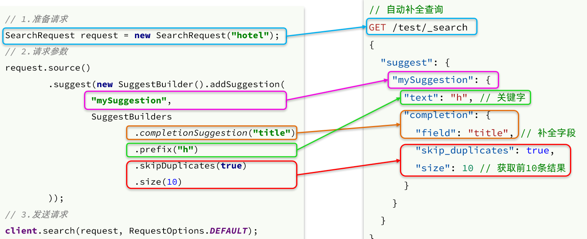

自动补全的结果也比较特殊，解析的代码如下：


**实现搜索框自动补全**

查看前端页面，可以发现当我们在输入框键入时，前端会发起ajax请求：


返回值是补全词条的集合，类型为`List<String>`

1）在`cn.itcast.hotel.controller`包下的`HotelController`中添加新接口，接收新的请求：

```java
@GetMapping("suggestion")
public List<String> getSuggestions(@RequestParam("key") String prefix) {
    return hotelService.getSuggestions(prefix);
}
```

2）在`cn.itcast.hotel.service`包下的`IhotelService`中添加方法：

```java
List<String> getSuggestions(String prefix);
```

3）在`cn.itcast.hotel.service.impl.HotelServiceImpl`中实现该方法：

```java
@Override
public List<String> getSuggestions(String prefix) {
    try {
        // 1.准备Request
        SearchRequest request = new SearchRequest("hotel");
        // 2.准备DSL
        request.source().suggest(new SuggestBuilder().addSuggestion(
            "suggestions",
            SuggestBuilders.completionSuggestion("suggestion")
            .prefix(prefix)
            .skipDuplicates(true)
            .size(10)
        ));
        // 3.发起请求
        SearchResponse response = client.search(request, RequestOptions.DEFAULT);
        // 4.解析结果
        Suggest suggest = response.getSuggest();
        // 4.1.根据补全查询名称，获取补全结果
        CompletionSuggestion suggestions = suggest.getSuggestion("suggestions");
        // 4.2.获取options
        List<CompletionSuggestion.Entry.Option> options = suggestions.getOptions();
        // 4.3.遍历
        List<String> list = new ArrayList<>(options.size());
        for (CompletionSuggestion.Entry.Option option : options) {
            String text = option.getText().toString();
            list.add(text);
        }
        return list;
    } catch (IOException e) {
        throw new RuntimeException(e);
    }
}
```


## 8.9 数据同步

elasticsearch中的酒店数据来自于mysql数据库，因此mysql数据发生改变时，elasticsearch也必须跟着改变，这个就是elasticsearch与mysql之间的**数据同步**。

在微服务中，负责酒店管理（操作mysql）的业务与负责酒店搜索（操作elasticsearch）的业务可能在两个不同的微服务上，数据同步该如何实现？

### 8.9.1 数据同步方案

常见的数据同步方案有三种：

- 同步调用
- 异步通知
- 监听binlog

#### 同步调用


基本步骤如下：

- hotel-demo对外提供接口，用来修改elasticsearch中的数据
- 酒店管理服务在完成数据库操作后，直接调用hotel-demo提供的接口

优缺点：

- 优点：实现简单，粗暴
- 缺点：业务耦合度高


#### 异步通知


流程如下：

- hotel-admin对mysql数据库数据完成增、删、改后，发送MQ消息
- hotel-demo监听MQ，接收到消息后完成elasticsearch数据修改

优缺点：

- 优点：低耦合，实现难度一般
- 缺点：依赖mq的可靠性


#### 监听binlog


流程如下：

- 给mysql开启binlog功能
- mysql完成增、删、改操作都会记录在binlog中
- hotel-demo基于canal监听binlog变化，实时更新elasticsearch中的内容

优缺点：

- 优点：完全解除服务间耦合
- 缺点：开启binlog增加数据库负担、实现复杂度高


### 8.9.2 异步通知实现数据同步

资料提供的hotel-admin项目作为酒店管理的微服务，当酒店数据发生增、删、改时，要求对elasticsearch中数据也要完成相同操作。

步骤：

- 导入资料提供的hotel-admin项目，启动并测试酒店数据的CRUD

- 声明exchange、queue、RoutingKey

- 在hotel-admin中的增、删、改业务中完成消息发送

- 在hotel-demo中完成消息监听，并更新elasticsearch中数据

- 启动并测试数据同步功能

**(1) 导入demo**

导入资料提供的hotel-admin项目：


运行启动类，访问 http://localhost:8099


**(2) 声明交换机和队列**

(1) 引入依赖

在hotel-admin、hotel-demo中引入rabbitmq的依赖：

```xml
<!--amqp-->
<dependency>
    <groupId>org.springframework.boot</groupId>
    <artifactId>spring-boot-starter-amqp</artifactId>
</dependency>
```

(2) 声明队列交换机名称

在hotel-admin和hotel-demo中的`cn.itcast.hotel.constants`包下新建一个类`MqConstants`：

```java 
package cn.itcast.hotel.constants;

    public class MqConstants {
    /**
     * 交换机
     */
    public final static String HOTEL_EXCHANGE = "hotel.topic";
    /**
     * 监听新增和修改的队列
     */
    public final static String HOTEL_INSERT_QUEUE = "hotel.insert.queue";
    /**
     * 监听删除的队列
     */
    public final static String HOTEL_DELETE_QUEUE = "hotel.delete.queue";
    /**
     * 新增或修改的RoutingKey
     */
    public final static String HOTEL_INSERT_KEY = "hotel.insert";
    /**
     * 删除的RoutingKey
     */
    public final static String HOTEL_DELETE_KEY = "hotel.delete";
}
```

(3) 定义交换机和队列

在hotel-demo的`cn.itcast.hotel.config`包中，定义配置类，定义队列、交换机：

```java
@Configuration
public class MqConfig {
    @Bean
    public TopicExchange topicExchange(){
        return new TopicExchange(MqConstants.HOTEL_EXCHANGE, true, false);
    }

    @Bean
    public Queue insertQueue(){
        return new Queue(MqConstants.HOTEL_INSERT_QUEUE, true);
    }

    @Bean
    public Queue deleteQueue(){
        return new Queue(MqConstants.HOTEL_DELETE_QUEUE, true);
    }

    @Bean
    public Binding insertQueueBinding(){
        return BindingBuilder.bind(insertQueue()).to(topicExchange()).with(MqConstants.HOTEL_INSERT_KEY);
    }

    @Bean
    public Binding deleteQueueBinding(){
        return BindingBuilder.bind(deleteQueue()).to(topicExchange()).with(MqConstants.HOTEL_DELETE_KEY);
    }
}
```


**(3) 配置rabbitmq**

在hotel-demo和hotel-admin的application.yml文件中添加rabbitmq的配置信息：

```yml
spring:
  rabbitmq:
    host: 192.168.101.100 # 主机名
    port: 5672 # 端口
    virtual-host: / # 虚拟主机
    username: root # 用户名
    password: 123456 # 密码
```


**(4) 发送MQ消息**

在hotel-admin中的增、删、改业务中分别发送MQ消息，因为业务逻辑较简单，所以这里直接将业务逻辑写在controller方法中。

```Java
    
    @Autowired
    private IHotelService hotelService;
    @Autowired
    private RabbitTemplate rabbitTemplate;

	/**
     * 新增
     */
    @PostMapping
    public void saveHotel(@RequestBody Hotel hotel){
     	hotelService.save(hotel);
        // 发送消息，发送整个酒店对象占用内存，只需要发送酒店id，es根据id查询对应的酒店信息然后保存到索引库
     rabbitTemplate.convertAndSend(MqConstants.HOTEL_EXCHANGE,MqConstants.HOTEL_INSERT_KEY,hotel.getId());
    }

    /**
     * 修改
     */
    @PutMapping()
    public void updateById(@RequestBody Hotel hotel){
        if (hotel.getId() == null) {
            throw new InvalidParameterException("id不能为空");
        }
        hotelService.updateById(hotel);
        // 发送消息
     rabbitTemplate.convertAndSend(MqConstants.HOTEL_EXCHANGE,MqConstants.HOTEL_INSERT_KEY,hotel.getId());
    }

    /**
     * 删除
     */
    @DeleteMapping("/{id}")
    public void deleteById(@PathVariable("id") Long id) {
        hotelService.removeById(id);
        // 发送消息
        rabbitTemplate.convertAndSend(MqConstants.HOTEL_EXCHANGE,MqConstants.HOTEL_DELETE_KEY,id);
    }
```


**(5) 接收MQ消息**

hotel-demo接收到MQ消息要做的事情包括：

- 新增消息：根据传递的hotel的id查询hotel信息，然后新增一条数据到索引库
- 删除消息：根据传递的hotel的id删除索引库中的一条数据

1）首先在hotel-demo的`cn.itcast.hotel.service`包下的`IHotelService`中新增新增、删除业务

```java
void deleteById(Long id);

void insertById(Long id);
```

2）给hotel-demo中的`cn.itcast.hotel.service.impl`包下的HotelServiceImpl中实现业务：

```java
/**
 * 删除文档
 */
@Override
public void deleteById(Long id) {
    try {
        // 1.准备Request
        DeleteRequest request = new DeleteRequest("hotel", id.toString());
        // 2.发送请求
        client.delete(request, RequestOptions.DEFAULT);
    } catch (IOException e) {
        throw new RuntimeException(e);
    }
}

/**
 * 新增文档
 */
@Override
public void insertById(Long id) {
    try {
        // 1.根据id查询酒店数据
        Hotel hotel = getById(id);
        // 转换为文档类型
        HotelDoc hotelDoc = new HotelDoc(hotel);

        // 2.准备Request对象
        IndexRequest request = new IndexRequest("hotel").id(hotel.getId().toString());
        // 3.准备Json文档
        request.source(JSON.toJSONString(hotelDoc), XContentType.JSON);
        // 4.发送请求
        client.index(request, RequestOptions.DEFAULT);
    } catch (IOException e) {
        throw new RuntimeException(e);
    }
}
```

3）编写监听器

在hotel-demo中的`cn.itcast.hotel.mq`包新增一个类HotelListener：

```java
package cn.itcast.hotel.mq;

import cn.itcast.hotel.constants.MqConstants;
import cn.itcast.hotel.service.IHotelService;
import org.springframework.amqp.rabbit.annotation.RabbitListener;
import org.springframework.beans.factory.annotation.Autowired;
import org.springframework.stereotype.Component;

@Component
public class HotelListener {

    @Autowired
    private IHotelService hotelService;

    /**
     * 监听酒店新增或修改的业务
     * @param id 酒店id
     */
    @RabbitListener(queues = MqConstants.HOTEL_INSERT_QUEUE)
    public void listenHotelInsertOrUpdate(Long id){
        hotelService.insertById(id);
    }

    /**
     * 监听酒店删除的业务
     * @param id 酒店id
     */
    @RabbitListener(queues = MqConstants.HOTEL_DELETE_QUEUE)
    public void listenHotelDelete(Long id){
        hotelService.deleteById(id);
    }
}
```


## 8.10 elasticsearch集群

**ES集群相关概念**:

* 集群（cluster）：一组拥有共同的 cluster name 的 节点。

* <font color="red">节点（node)</font>   ：集群中的一个 Elasticearch 实例

* <font color="red">分片（shard）</font>：索引可以被拆分为不同的部分进行存储，称为分片。在集群环境下，一个索引的不同分片可以拆分到不同的节点中

  解决问题：数据量太大，单点存储量有限的问题。

* 主分片（Primary shard）：相对于副本分片的定义。

* 副本分片（Replica shard）每个主分片可以有一个或者多个副本，数据和主分片一样。


数据备份可以保证高可用，但是每个分片备份一份，所需要的节点数量就会翻一倍，为了在高可用和成本间寻求平衡，我们可以这样做：

- 首先对数据分片，存储到不同节点
- 然后对每个分片进行备份，放到对方节点，完成互相备份

这样可以大大减少所需要的服务节点数量，如图，我们以3分片，每个分片备份一份为例：


### 8.10.1 搭建es集群

部署es集群可以直接使用docker-compose来完成，但这要求你的Linux虚拟机至少有**4G**的内存空间

首先编写一个docker-compose.yml文件（资料中已给出，上传到虚拟机根目录即可），内容如下：

```yml
version: '2.2'
services:
  es01:
    image: elasticsearch:7.12.1
    container_name: es01
    environment:
      - node.name=es01
      - cluster.name=es-docker-cluster
      - discovery.seed_hosts=es02,es03
      - cluster.initial_master_nodes=es01,es02,es03
      - "ES_JAVA_OPTS=-Xms512m -Xmx512m"
    volumes:
      - data01:/usr/share/elasticsearch/data
    ports:
      - 9200:9200
    networks:
      - elastic
  es02:
    image: elasticsearch:7.12.1
    container_name: es02
    environment:
      - node.name=es02
      - cluster.name=es-docker-cluster
      - discovery.seed_hosts=es01,es03
      - cluster.initial_master_nodes=es01,es02,es03
      - "ES_JAVA_OPTS=-Xms512m -Xmx512m"
    volumes:
      - data02:/usr/share/elasticsearch/data
    ports:
      - 9201:9200
    networks:
      - elastic
  es03:
    image: elasticsearch:7.12.1
    container_name: es03
    environment:
      - node.name=es03
      - cluster.name=es-docker-cluster
      - discovery.seed_hosts=es01,es02
      - cluster.initial_master_nodes=es01,es02,es03
      - "ES_JAVA_OPTS=-Xms512m -Xmx512m"
    volumes:
      - data03:/usr/share/elasticsearch/data
    networks:
      - elastic
    ports:
      - 9202:9200
volumes:
  data01:
    driver: local
  data02:
    driver: local
  data03:
    driver: local

networks:
  elastic:
    driver: bridge
```

es运行需要修改一些linux系统权限，修改`/etc/sysctl.conf`文件：

```sh
vi /etc/sysctl.conf
```

添加下面的内容：

```sh
vm.max_map_count=262144
```

执行命令使让配置生效：

```sh
sysctl -p
```

通过docker-compose启动集群：

```sh
docker-compose up -d
```


### 8.10.2 集群状态监控

这里推荐使用cerebro来监控es集群状态，官方网址：https://github.com/lmenezes/cerebro

资料已经提供了安装包：


点进去，进入bin目录双击运行 `cerebro.bat` 文件，然后访问localhost:9000


### 8.10.3 创建索引库并分片

**(1) 利用kibana的DevTools创建索引库**

在DevTools中输入指令：

```
PUT /itcast
{
  "settings": {
    "number_of_shards": 3, // 分片数量
    "number_of_replicas": 1 // 副本数量
  },
  "mappings": {
    "properties": {
      // mapping映射定义 ...
    }
  }
}
```

**(2) 利用cerebro创建索引库**

在cerebro管理界面点击more后点击create index：


填写索引库信息：


查看分片效果：

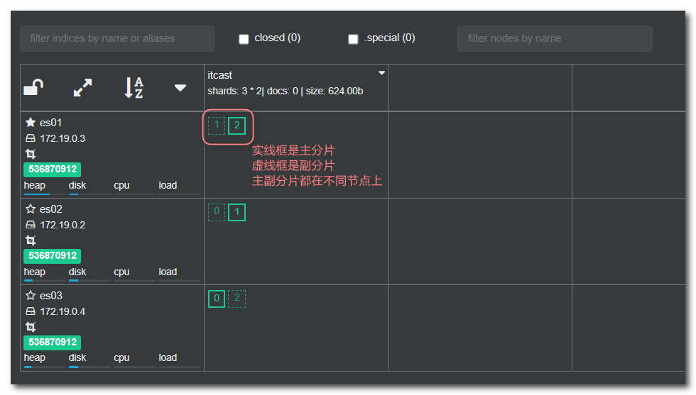


### 8.10.4 集群职责划分

elasticsearch中集群节点有不同的职责划分：

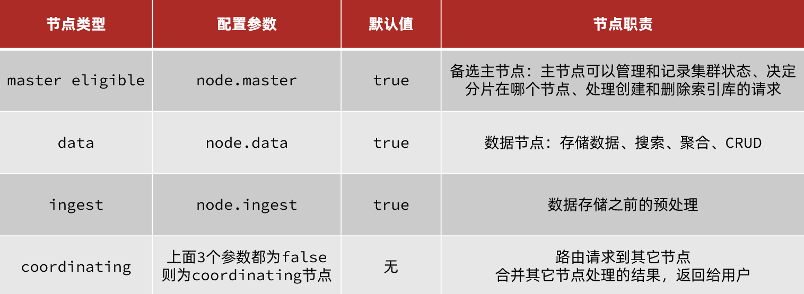

默认情况下，集群中的任何一个节点都同时具备上述四种角色，但是真实的集群一定要将集群职责分离：

- master节点：对CPU要求高，但是内存要求第
- data节点：对CPU和内存要求都高
- coordinating节点：对网络带宽、CPU要求高

职责分离可以让我们根据不同节点的需求分配不同的硬件去部署，而且避免业务之间的互相干扰。

一个典型的es集群职责划分如图：

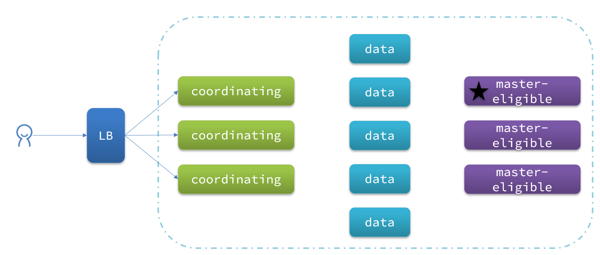


### 8.10.5 脑裂问题

脑裂是因为集群中的节点失联导致的。

例如一个集群中，主节点与其它节点失联：

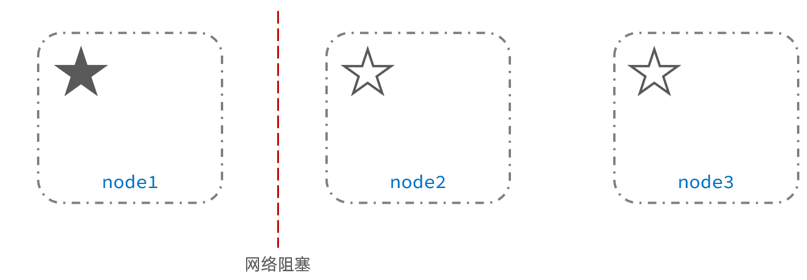

此时，node2和node3认为node1宕机，就会重新选主：


当node3当选后，集群继续对外提供服务，node2和node3自成集群，node1自成集群，两个集群数据不同步，出现数据差异。

当网络恢复后，因为集群中有两个master节点，集群状态的不一致，出现脑裂的情况：

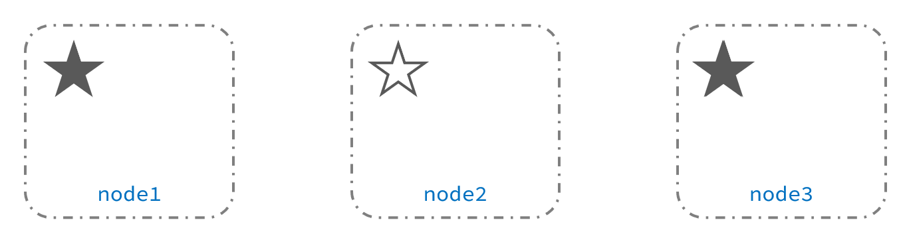

解决脑裂的方案是，要求选票超过 ( eligible节点数量 + 1 ）/ 2 才能当选为主，因此eligible节点数量最好是奇数。对应配置项是discovery.zen.minimum_master_nodes，在es7.0以后，已经成为默认配置，因此一般不会发生脑裂问题


### 8.10.6 集群分布式存储

当新增文档时，应该保存到不同分片，保证数据均衡，那么coordinating node如何确定数据该存储到哪个分片呢？

#### 分片存储测试

插入三条数据：


然后查询所有文档，并且设置"explain"属性（与query同等级）的值为true，这样可以显示文档存储在哪个分片：

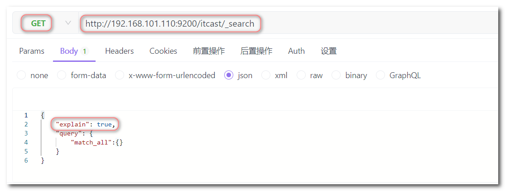

查看响应结果，可以看到，三条数据分别在不同分片：

```json
{
    "took": 708,
    "timed_out": false,
    "_shards": {
        "total": 3,
        "successful": 3,
        "skipped": 0,
        "failed": 0
    },
    "hits": {
        "total": {
            "value": 3,
            "relation": "eq"
        },
        "max_score": 1.0,
        "hits": [
            {
                "_shard": "[itcast][1]",
                "_node": "HMsCu29MQPugzltXKI3kUQ",
                "_index": "itcast",
                "_type": "_doc",
                "_id": "2",
                "_score": 1.0,
                "_source": {
                    "title": "插入一条数据，id=2"
                },
                "_explanation": {
                    "value": 1.0,
                    "description": "*:*",
                    "details": []
                }
            },
            {
                "_shard": "[itcast][1]",
                "_node": "HMsCu29MQPugzltXKI3kUQ",
                "_index": "itcast",
                "_type": "_doc",
                "_id": "3",
                "_score": 1.0,
                "_source": {
                    "title": "插入一条数据，id=3"
                },
                "_explanation": {
                    "value": 1.0,
                    "description": "*:*",
                    "details": []
                }
            },
            {
                "_shard": "[itcast][2]",
                "_node": "KMov_sqPQoStTyqLwKQcdw",
                "_index": "itcast",
                "_type": "_doc",
                "_id": "1",
                "_score": 1.0,
                "_source": {
                    "title": "插入一条数据，id=1"
                },
                "_explanation": {
                    "value": 1.0,
                    "description": "*:*",
                    "details": []
                }
            }
        ]
    }
}
```


#### 分片存储原理

elasticsearch会通过hash算法来计算文档应该存储到哪个分片：


- _routing默认是文档的id
- 算法与分片数量有关，因此索引库一旦创建，分片数量不能修改！

例如新增文档的流程如下：


解读：

- 1）新增一个id=1的文档
- 2）对id做hash运算，假如得到的是2，则应该存储到shard-2
- 3）shard-2的主分片在node3节点，将数据路由到node3
- 4）保存文档
- 5）同步给shard-2的副本replica-2，在node2节点
- 6）返回结果给coordinating-node节点


### 8.10.7 集群分布式查询

elasticsearch的查询分成两个阶段：

- scatter phase：分散阶段，coordinating node会把请求分发到每一个分片

- gather phase：聚集阶段，coordinating node汇总data node的搜索结果，并处理为最终结果集返回给用户


### 8.10.8 集群故障转移

集群的master节点会监控集群中的节点状态，如果发现有节点宕机，会立即将宕机节点的分片数据迁移到其它节点，确保数据安全，这个叫做故障转移。

1）例如一个集群结构如图，node1是主节点，其它两个节点是从节点。


2）假设node1发生了故障：


宕机后的第一件事，需要重新选主，例如选中了node2：


node2成为主节点后，会检测集群监控状态，发现shard-1、shard-0没有副本节点，因此将node1上的数据迁移到node2、node3：


示例：

把node1关闭后，查看cerebro管理界面，可以看到将故障节点的分片信息迁移到了正常节点上


重启node1后，分片信息又恢复回去了，但是不会恢复主节点的身份

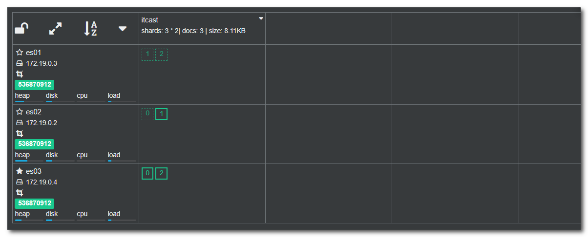


# 9. Sentinel

## 9.1 雪崩问题及解决方案

**雪崩问题**：微服务之间相互调用，因为调用链中的一个服务故障，引起整个链路都无法访问的情况。

解决雪崩问题的常见方式有四种：

**(1) 超时处理**：设定超时时间，请求超过一定时间没有响应就返回错误信息，不会无休止等待。


**(2) 仓壁模式**：限定每个业务能使用的线程数，避免耗尽整个tomcat的资源，因此也叫线程隔离。


**(3) 断路器模式**：由断路器统计业务执行的异常比例，如果超出阈值则会熔断该业务，拦截访问该业务的一切请求。


上图中当发现访问服务D的请求异常比例过高时，认为服务D有导致雪崩的风险，会拦截访问服务D的一切请求，形成熔断。

**(4) 流量控制**：限制业务访问的QPS，避免服务因流量的突增而故障。


## 9.2 服务保护技术对比

在SpringCloud当中支持多种服务保护技术：

- [Netfix Hystrix](https://github.com/Netflix/Hystrix)
- [Sentinel](https://github.com/alibaba/Sentinel)
- [Resilience4J](https://github.com/resilience4j/resilience4j)

早期比较流行的是Hystrix框架，但目前国内使用最广泛的还是阿里巴巴的Sentinel框架，这里我们做下对比：

|                | **Sentinel**                                   | **Hystrix**                   |
| -------------- | ---------------------------------------------- | ----------------------------- |
| 隔离策略       | 信号量隔离                                     | 线程池隔离/信号量隔离         |
| 熔断降级策略   | 基于慢调用比例或异常比例                       | 基于失败比率                  |
| 实时指标实现   | 滑动窗口                                       | 滑动窗口（基于 RxJava）       |
| 规则配置       | 支持多种数据源                                 | 支持多种数据源                |
| 扩展性         | 多个扩展点                                     | 插件的形式                    |
| 基于注解的支持 | 支持                                           | 支持                          |
| 限流           | 基于 QPS，支持基于调用关系的限流               | 有限的支持                    |
| 流量整形       | 支持慢启动、匀速排队模式                       | 不支持                        |
| 系统自适应保护 | 支持                                           | 不支持                        |
| 控制台         | 开箱即用，可配置规则、查看秒级监控、机器发现等 | 不完善                        |
| 常见框架的适配 | Servlet、Spring Cloud、Dubbo、gRPC  等         | Servlet、Spring Cloud Netflix |


## 9.3 Sentinel介绍和安装

Sentinel是阿里巴巴开源的一款微服务流量控制组件。官网地址：https://sentinelguard.io/zh-cn/index.html

Sentinel 具有以下特征:

**丰富的应用场景**：Sentinel 承接了阿里巴巴近 10 年的双十一大促流量的核心场景，例如秒杀（即突发流量控制在系统容量可以承受的范围）、消息削峰填谷、集群流量控制、实时熔断下游不可用应用等。

**完备的实时监控**：Sentinel 同时提供实时的监控功能。您可以在控制台中看到接入应用的单台机器秒级数据，甚至 500 台以下规模的集群的汇总运行情况。

**广泛的开源生态**：Sentinel 提供开箱即用的与其它开源框架/库的整合模块，例如与 Spring Cloud、Dubbo、gRPC 的整合。您只需要引入相应的依赖并进行简单的配置即可快速地接入 Sentinel。

**完善的** **SPI** **扩展点**：Sentinel 提供简单易用、完善的 SPI 扩展接口。您可以通过实现扩展接口来快速地定制逻辑。例如定制规则管理、适配动态数据源等。


**安装Sentinel**

1）下载

sentinel官方提供了UI控制台，方便我们对系统做限流设置。可以在[GitHub](https://github.com/alibaba/Sentinel/releases)下载。

资料也提供了下载好的jar包：


2）运行

将jar包放到任意非中文目录，执行命令：

```sh
java -jar sentinel-dashboard-1.8.6.jar
```

如果要修改Sentinel的默认端口、账户、密码，可以通过下列配置：

| **配置项**                       | **默认值** | **说明**   |
| -------------------------------- | ---------- | ---------- |
| server.port                      | 8080       | 服务端口   |
| sentinel.dashboard.auth.username | sentinel   | 默认用户名 |
| sentinel.dashboard.auth.password | sentinel   | 默认密码   |

例如，修改端口：

```sh
java -Dserver.port=8090 -jar sentinel-dashboard-1.8.6.jar
```

3）访问

访问http://localhost:8090页面，就可以看到sentinel的控制台了，用户名密码默认都为sentinel：


## 9.4 微服务整合Sentinel

我们在order-service中整合sentinel，并连接sentinel的控制台，步骤如下：

1）引入sentinel依赖

```xml
<!--sentinel-->
<dependency>
    <groupId>com.alibaba.cloud</groupId> 
    <artifactId>spring-cloud-starter-alibaba-sentinel</artifactId>
</dependency>
```

2）配置控制台

修改application.yaml文件，添加下面内容：

```yaml
server:
  port: 8080
spring:
  cloud: 
    sentinel:
      transport:
        dashboard: localhost:8090
```

3）访问order-service的任意端点

打开浏览器，访问http://localhost:8080/order/101，这样才能触发sentinel的监控。

然后再访问sentinel的控制台，查看效果：


## 9.5 流量控制

### 9.5.1 簇点链路

当请求进入微服务时，首先会访问DispatcherServlet，然后进入Controller、Service、Mapper，这样的一个调用链就叫做**簇点链路**。簇点链路中被监控的每一个接口就是一个**资源**。

默认情况下sentinel会监控SpringMVC的每一个端点（Endpoint，也就是controller中的方法），因此SpringMVC的每一个端点（Endpoint）就是调用链路中的一个资源。

例如，我们刚才访问的order-service中的OrderController中的端点：/order/{orderId}


流控、熔断等都是针对簇点链路中的资源来设置的，因此我们可以点击对应资源后面的按钮来设置规则：

- 流控：流量控制
- 降级：降级熔断
- 热点：热点参数限流，是限流的一种
- 授权：请求的权限控制

点击资源/order/{orderId}后面的流控按钮，就可以弹出表单。


**QPS的是指每秒请求数**，上述设置含义是限制 /order/{orderId}这个资源每秒只允许1次请求，超出的请求会被拦截并报错。


### 9.5.2 jmeter快速入门

(1) 安装jmeter

Jmeter依赖于JDK，所以必须确保当前计算机上已经安装了JDK，并且配置了环境变量。

可以Apache Jmeter官网下载，地址：http://jmeter.apache.org/download_jmeter.cgi

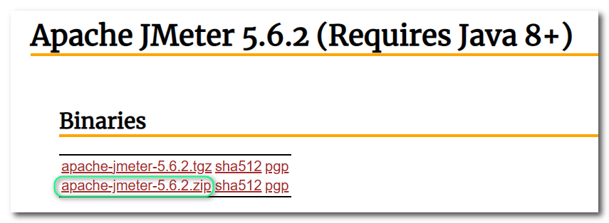

资料也提供了下载好的安装包，因为下载的是zip包，解压缩即可使用，其中的bin目录就是执行的脚本，其中包含启动脚本：


双击即可运行，但是有两点注意：

- 启动速度比较慢，要耐心等待
- 启动后黑窗口不能关闭，否则Jmeter也跟着关闭了

(2) 基本用法

在测试计划上点鼠标右键，选择添加 > 线程（用户） > 线程组：


在新增的线程组中，填写线程信息：


给线程组点鼠标右键，添加http取样器：

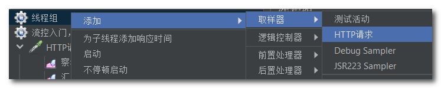

编写取样器内容：

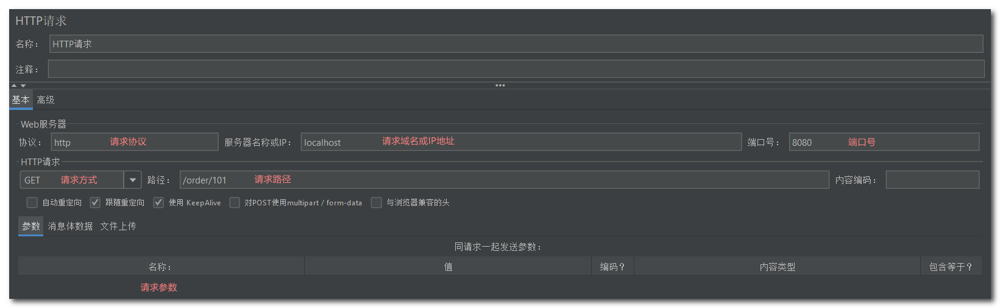


案例：给 /order/{orderId}这个资源设置流控规则，QPS不能超过 5，然后测试。

1）首先在sentinel控制台添加限流规则


2）利用jmeter测试

资料提供了编写好的Jmeter测试样例：


打开jmeter，导入资料提供的测试样例（注意端口号是否对应），选中`流控入门，QPS<5`右键运行：

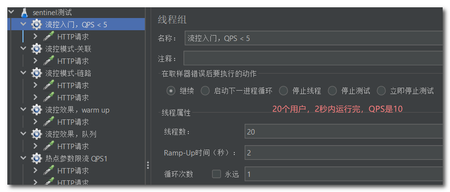

查看结果：


### 9.5.3 流控模式

在添加限流规则时，点击高级选项，可以选择三种**流控模式**：

- 直接：统计当前资源的请求，触发阈值时对当前资源直接限流，也是默认的模式
- 关联：统计与当前资源相关的另一个资源，触发阈值时，对当前资源限流
- 链路：统计从指定链路访问到本资源的请求，触发阈值时，对指定链路限流


#### 关联模式

统计与当前资源相关的另一个资源，触发阈值时，对当前资源限流。

配置规则：


语法说明：当/write资源访问量触发阈值时，就会对/read资源限流，避免影响/write资源。

使用场景：比如用户支付时需要修改订单状态，同时用户要查询订单。查询和修改操作会争抢数据库锁，产生竞争。业务需求是优先支付和更新订单的业务，因此当修改订单业务触发阈值时，需要对查询订单业务限流。

需求说明：

- 在OrderController新建两个端点：/order/query和/order/update，无需实现业务

- 配置流控规则，当/order/ update资源被访问的QPS超过5时，对/order/query请求限流

1）定义/order/query端点，模拟订单查询

```java
@GetMapping("/query")
public String queryOrder() {
    return "查询订单成功";
}
```

2）定义/order/update端点，模拟订单更新

```java
@GetMapping("/update")
public String updateOrder() {
    return "更新订单成功";
}
```

重启服务，查看sentinel控制台的簇点链路：

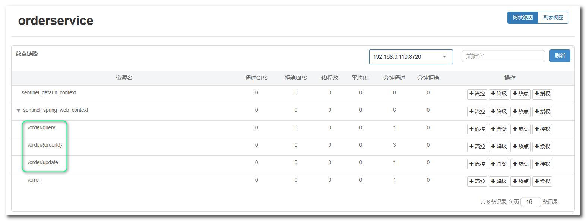

3）配置流控规则

对哪个端点限流，就点击哪个端点后面的按钮。我们是对订单查询/order/query限流，因此点击它后面的流控按钮：


4）在Jmeter测试

选择《流控模式-关联》启动：

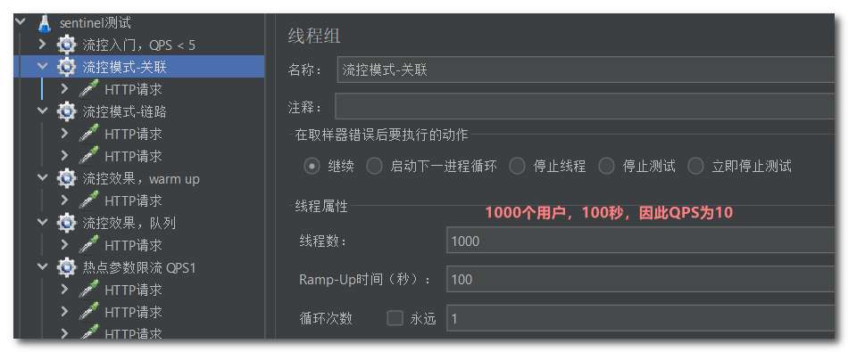

请求的目标是/order/update，因为QPS大于阈值这样这个断点就会触发阈值，但限流的目标是/order/query。

在浏览器访问：[localhost:8080/order/query](http://localhost:8080/order/query)


#### 链路模式

只针对从指定链路访问到本资源的请求做统计，判断是否超过阈值。

配置示例：例如有两条请求链路：

- /test1 --> /common

- /test2 --> /common

如果只希望统计从/test2进入到/common的请求，则可以这样配置：


**实战案例**

需求：有查询订单和创建订单业务，两者都需要查询商品。针对从查询订单进入到查询商品的请求统计，并设置限流。

步骤：

(1) 在OrderServiceImpl中添加一个queryGoods方法，不用实现业务

```Java
public void queryGoods(){
    System.err.println("查询商品");
}
```

(2) 在OrderController中，改造/order/query端点，调用OrderServiceImpl中的queryGoods方法

```Java
@GetMapping("/query")
public String queryOrder() {
    // 查询商品
    orderService.queryGoods();
    // 查询订单
    System.out.println("查询订单");
    return "查询订单成功";
}
```

(3) 在OrderController中添加一个/order/save的端点，调用OrderServiceImpl的queryGoods方法

```java
@GetMapping("/save")
public String saveOrder() {
    // 查询商品
    orderService.queryGoods();
    // 查询订单
    System.err.println("新增订单");
    return "新增订单成功";
}
```

(4) 给queryGoods设置限流规则，从/order/query进入queryGoods的方法限制QPS必须小于2

默认情况下，OrderServiceImpl中的方法是不被Sentinel监控的，需要我们自己通过注解来标记要监控的方法。

给OrderServiceImpl的queryGoods方法添加 `@SentinelResource` 注解，注解内指定资源名称。

```java
@SentinelResource("goods")
public void queryGoods(){
    System.err.println("查询商品");
}
```

链路模式中，是对不同来源的两个链路做监控。但是sentinel默认会给进入SpringMVC的所有请求设置同一个root资源，会导致链路模式失效。我们需要关闭这种对SpringMVC的资源聚合，修改order-service服务的application.yml文件：

```yml
spring:
  cloud:
    sentinel:
      web-context-unify: false # 关闭context整合
```

重启服务，访问/order/query和/order/save，可以查看到sentinel的簇点链路规则中，出现了新的资源：


(5) 添加流控规则

只统计从/order/query进入/goods的资源，QPS阈值为2，超出则被限流。

点击goods资源后面的流控按钮，在弹出的表单中填写下面信息：


(6) Jmeter测试

选择《流控模式-链路》启动：

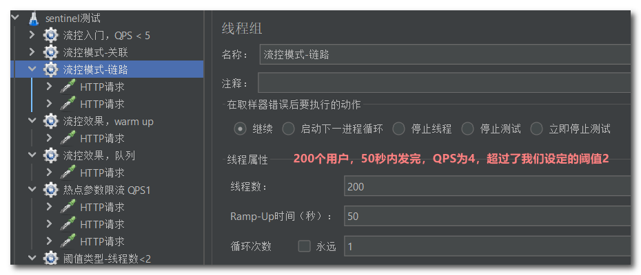

查看结果：


### 9.5.4 流控效果

在流控的高级选项中，还有一个流控效果选项：


流控效果是指请求达到流控阈值时应该采取的措施，包括三种：

- 快速失败：达到阈值后，新的请求会被立即拒绝并抛出FlowException异常。是默认的处理方式。

- warm up：预热模式，对超出阈值的请求同样是拒绝并抛出异常。但这种模式阈值会动态变化，从一个较小值逐渐增加到最大阈值。

- 排队等待：让所有的请求按照先后次序排队执行，两个请求的间隔不能小于指定时长


#### warm up

阈值一般是一个微服务能承担的最大QPS，但是一个服务刚刚启动时，一切资源尚未初始化（**冷启动**），如果直接将QPS跑到最大值，可能导致服务瞬间宕机。

warm up也叫**预热模式**，是应对服务冷启动的一种方案。请求阈值初始值是 maxThreshold / coldFactor，持续指定时长后，逐渐提高到maxThreshold值。而coldFactor的默认值是3.

例如，我设置QPS的maxThreshold为10，预热时间为5秒，那么初始阈值就是 10 / 3 ，也就是3，然后在5秒后逐渐增长到10.

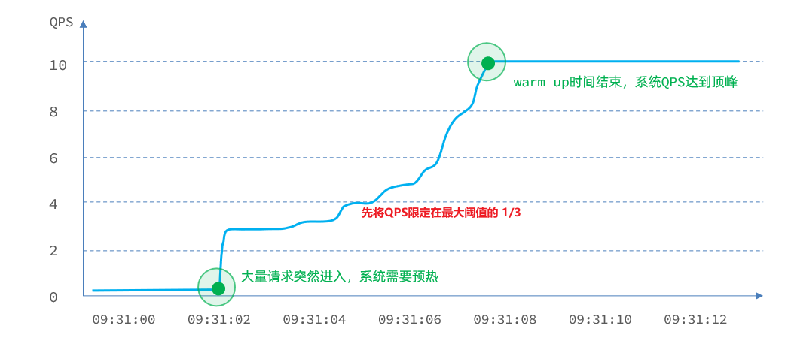

案例：给/order/{orderId}这个资源设置限流，最大QPS为10，利用warm up效果，预热时长为5秒

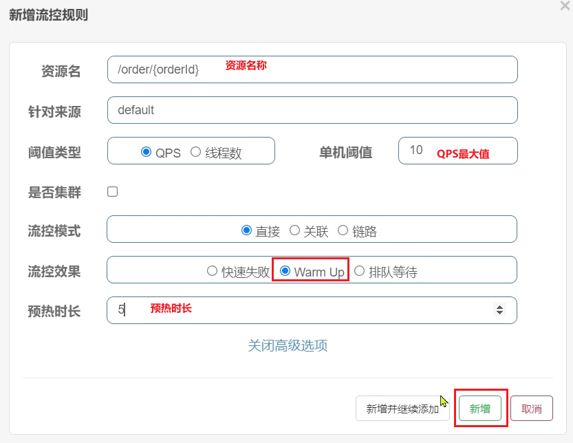


#### 排队等待

当请求超过QPS阈值时，快速失败和warm up 会拒绝新的请求并抛出异常。

而排队等待则是让所有请求进入一个队列中，然后按照阈值允许的时间间隔依次执行。后来的请求必须等待前面执行完成，如果请求预期的等待时间超出最大时长，则会被拒绝。

例如：QPS = 5，即200ms处理一个队列中的请求；timeout = 2000，意味着预期等待时长超过2000ms的请求会被拒绝并抛出异常。

比如现在一下子来了12 个请求，因为每200ms执行一个请求，那么：

- 第6个请求的预期等待时长 =  200 * （6 - 1） = 1000ms
- 第12个请求的预期等待时长 = 200 * （12-1） = 2200ms，被抛弃

第1秒同时接收到10个请求，但第2秒只有1个请求。如果使用队列模式做流控，以固定的200ms的间隔执行，QPS会变的很平滑：


案例：给/order/{orderId}这个资源设置限流，最大QPS为10，利用排队的流控效果，超时时长设置为5s


### 9.5.5 热点参数限流

之前的限流是统计访问某个资源的所有请求，判断是否超过QPS阈值。而热点参数限流是分别统计参数值相同的请求，判断是否超过QPS阈值。

例如，一个根据id查询商品的接口：


访问/goods/{id}的请求中，id参数值会有变化，热点参数限流会根据参数值分别统计QPS，统计结果：


当id=1的请求触发阈值被限流时，id值不为1的请求不受影响。

配置示例：对hot这个资源的0号索引参数（第一个参数）做统计，每1秒相同参数值的请求数不能超过5。


上述配置，对查询商品这个接口的所有商品QPS都限定为5，而在实际开发中，可能部分商品是热点商品，例如秒杀商品，我们希望这部分商品的QPS限制与其它商品不一样，高一些。那就需要配置热点参数限流的高级选项了：


这里的含义是对0号的long类型参数限流，每1秒相同参数的QPS不能超过5，有两个例外：

- 如果参数值是100，则每1秒允许的QPS为10


- 如果参数值是101，则每1秒允许的QPS为15


**案例需求**：给/order/{orderId}这个资源添加热点参数限流，规则如下：

- 默认的热点参数规则是每1秒请求量不超过2

- 给102这个参数设置例外：每1秒请求量不超过4

- 给103这个参数设置例外：每1秒请求量不超过10

**注意**：热点参数限流对默认的SpringMVC资源无效，需要利用@SentinelResource注解标记资源

(1) 标记资源

给order-service中的OrderController中的/order/{orderId}资源添加注解：


(2) 热点参数限流规则

点击左侧菜单中热点规则菜单：


填写限流规则：


(3) Jmeter测试

选择《热点参数限流 QPS1》启动


查看结果：

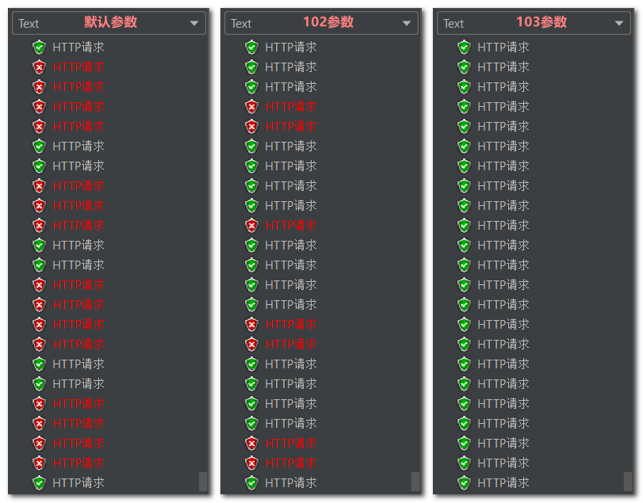


## 9.6 隔离和降级

限流是一种预防措施，虽然限流可以尽量避免因高并发而引起的服务故障，但服务还会因为其它原因而故障。

而要将这些故障控制在一定范围，避免雪崩，就要靠**线程隔离**（舱壁模式）和**熔断降级**手段了。

**线程隔离**之前讲到过：调用者在调用服务提供者时，给每个调用的请求分配独立线程池，出现故障时，最多消耗这个线程池内资源，避免把调用者的所有资源耗尽。

**熔断降级**：是在调用方这边加入断路器，统计对服务提供者的调用，如果调用的失败比例过高，则熔断该业务，不允许访问该服务的提供者了。

不管是线程隔离还是熔断降级，都是对**客户端**（调用方）的保护。需要在**调用方** 发起远程调用时做线程隔离、或者服务熔断。

微服务远程调用都是基于Feign来完成的，因此需要将Feign与Sentinel整合，在Feign里面实现线程隔离和服务熔断。

### 9.6.1 FeignClient整合Sentinel

SpringCloud中，微服务调用都是通过Feign来实现的，因此做客户端保护必须整合Feign和Sentinel。

(1) 修改配置，开启sentinel功能

修改OrderService的application.yml文件，开启Feign的Sentinel功能：

```yml
feign:
  sentinel:
    enabled: true # 开启feign对sentinel的支持
```

(2) 编写失败降级逻辑

业务失败后，不能直接报错，而应该返回用户一个友好提示或者默认结果，这个就是失败降级逻辑。

①方式一：FallbackClass，无法对远程调用的异常做处理

②方式二：FallbackFactory，可以对远程调用的异常做处理，我们选择这种

这里演示方式二的失败降级处理：

(1) 在feing-api项目中定义类，实现FallbackFactory：

```Java
@Slf4j
public class UserClientFallbackFactory implements FallbackFactory<UserClient> {
    @Override
    public UserClient create(Throwable throwable) {
        return new UserClient() {
            @Override
            public User findById(Long id) {
                // 编写降级逻辑
                log.error("查询用户异常", throwable);
                return new User();
            }
        };
    }
}
```

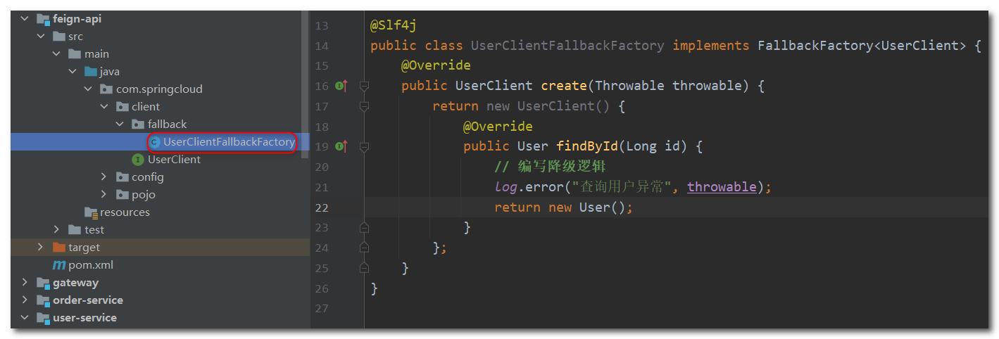

(2) 在feing-api项目中的DefaultFeignConfiguration类中将UserClientFallbackFactory注册为一个Bean：

```java
@Bean
public UserClientFallbackFactory userClientFallbackFactory(){
    return new UserClientFallbackFactory();
}
```

(3) 在feing-api项目中的UserClient接口中使用UserClientFallbackFactory：

```java
@FeignClient(value = "userservice", fallbackFactory = UserClientFallbackFactory.class)
public interface UserClient {

    @GetMapping("/user/{id}")
    User findById(@PathVariable("id") Long id);
}
```

重启后，访问一次订单查询业务，然后查看sentinel控制台，可以看到新的簇点链路：


### 9.6.2 sentinel的线程隔离

线程隔离有两种方式实现：

- 线程池隔离：给每个服务调用业务分配一个线程池，利用线程池本身实现隔离效果
- 信号量隔离：Sentinel默认采用。不创建线程池，而是计数器模式，记录业务使用的线程数量，达到信号量上限时，禁止新的请求。


**用法说明**：

在添加限流规则时，可以选择两种阈值类型：

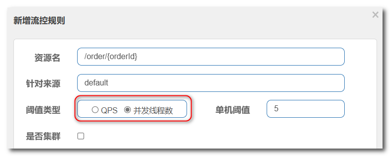

- QPS：就是每秒的请求数，在快速入门中已经演示过

- 线程数：是该资源能使用用的tomcat线程数的最大值。也就是通过限制线程数量，实现**线程隔离**（舱壁模式）。


**案例需求**：给 order-service服务中的UserClient的查询用户接口设置流控规则，线程数不能超过 2。

(1) 配置隔离规则

选择feign接口后面的流控按钮


填写表单：


(2) Jmeter测试

选择《阈值类型-线程数<2》：


一次发生10个请求，有较大概率并发线程数超过2，而超出的请求会走之前定义的失败降级逻辑。

查看运行结果：


虽然结果都是通过了，不过部分请求得到的响应是降级返回的null信息。


### 9.6.3 熔断降级

熔断降级是解决雪崩问题的重要手段。其思路是由断路器统计服务调用的异常比例、慢请求比例，如果超出阈值则会**熔断**该服务。即拦截访问该服务的一切请求；而当服务恢复时，断路器会放行访问该服务的请求。

断路器控制熔断和放行是通过状态机来完成的：


状态机包括三个状态：

- closed：关闭状态，断路器放行所有请求，并开始统计异常比例、慢请求比例。超过阈值则切换到open状态
- open：打开状态，服务调用被**熔断**，访问被熔断服务的请求会被拒绝，快速失败，直接走降级逻辑。Open状态5秒后会进入half-open状态
- half-open：半开状态，放行一次请求，根据执行结果来判断接下来的操作。
  - 请求成功：则切换到closed状态
  - 请求失败：则切换到open状态

断路器熔断策略有三种：慢调用、异常比例、异常数。

#### 慢调用

业务的响应时长（RT）大于指定时长的请求认定为慢调用请求。在指定时间内，如果请求数量超过设定的最小数量，慢调用比例大于设定的阈值，则触发熔断。

例如下图所示规则：RT超过500ms的调用是慢调用，统计最近10000ms内的请求，如果请求量超过10次，并且慢调用比例不低于0.5，则触发熔断，熔断时长为5秒。然后进入half-open状态，放行一次请求做测试。


**案例需求**：给 UserClient的查询用户接口设置降级规则，慢调用的RT阈值为50ms，统计时间为1秒，最小请求数量为5，失败阈值比例为0.4，熔断时长为5。

(1) 设置慢调用

修改user-service中的/user/{id}这个接口的业务。通过休眠模拟一个延迟时间：


此时，orderId=101的订单，关联的是id为1的用户，调用时长为82ms，orderId=102的订单，关联的是id为2的用户，调用时长为16ms

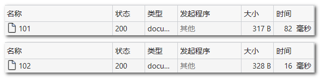

(2) 设置熔断规则

给feign接口设置降级规则：超过50ms的请求都认为是慢请求。


(3) 测试

在浏览器访问：http://localhost:8080/order/101，快速刷新5次，可以发现触发了熔断，请求时长缩短至9ms，快速失败了，并且走降级逻辑，返回的null。

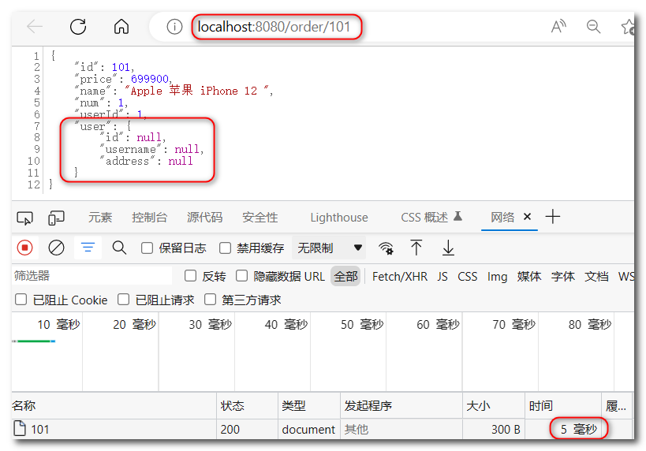

在浏览器访问：http://localhost:8080/order/102，被熔断了，走的降级逻辑。

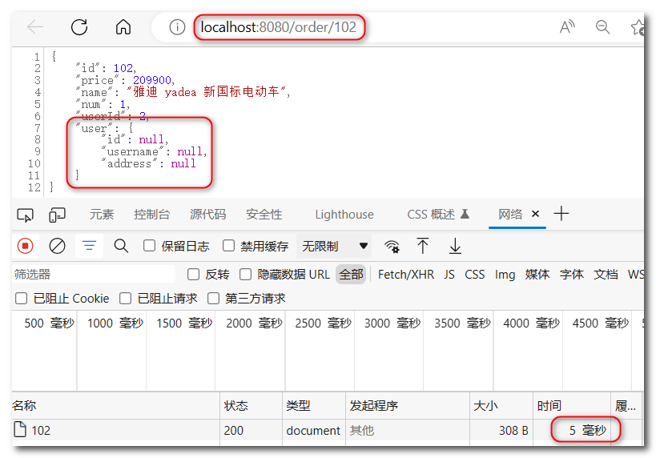


#### 异常比例、异常数

统计指定时间内的调用，如果调用次数超过指定请求数，并且出现异常的比例达到设定的比例阈值（或超过指定异常数），则触发熔断。

例如，一个异常比例设置：统计最近1000ms内的请求，如果请求量超过10次，并且异常比例不低于0.4，则触发熔断。如下所示。


**案例需求**：给 UserClient的查询用户接口设置降级规则，统计时间为1秒，最小请求数量为5，失败阈值比例为0.4，熔断时长为5

(1) 设置异常请求

修改user-service中的/user/{id}这个接口的业务，id 为 2时，手动抛出异常，以触发异常比例的熔断：


(2) 设置熔断规则

给feign接口设置降级规则：在5次请求中，只要异常比例超过0.4，也就是有2次以上的异常，就会触发熔断。


(3) 测试

在浏览器快速访问：http://localhost:8080/order/102，快速刷新5次，触发熔断：


同时去访问本来应该正常的103，也执行了降级逻辑。

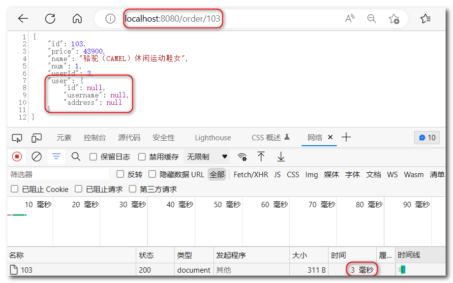


## 9.7 授权规则

授权规则可以对调用方的来源做控制，有白名单和黑名单两种方式。

- 白名单：来源（origin）在白名单内的调用者允许访问
- 黑名单：来源（origin）在黑名单内的调用者不允许访问

点击左侧菜单的授权规则，新增授权规则：

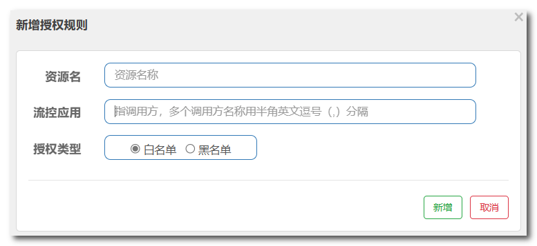

资源名：就是受保护的资源，例如/order/{orderId}

流控应用：是来源者的名单（请求头信息）

如果是勾选白名单，则名单中的来源被许可访问；如果是勾选黑名单，则名单中的来源被禁止访问。

比如允许请求从gateway到order-service，不允许浏览器访问，那么白名单中就要填写网关的来源名称（请求头：origin）


### 9.7.1 获取origin

Sentinel是通过RequestOriginParser这个接口的parseOrigin来获取请求的来源的。

```java
public interface RequestOriginParser {
    /**
     * 从请求request对象中获取origin，获取方式自定义
     */
    String parseOrigin(HttpServletRequest request);
}
```

这个方法的作用就是从request对象中，获取请求者的origin值并返回。

默认情况下，sentinel不管请求者从哪里来，返回值永远是default，也就是说一切请求的来源都被认为是一样的值default。

因此，需要自定义这个接口的实现，让**不同的请求，返回不同的origin**。这样会尝试从request-header中获取origin值。

例如order-service服务中，在com.springcloud.sentinel包下定义一个RequestOriginParser的实现类：

```java
@Component
public class HeaderOriginParser implements RequestOriginParser {
    @Override
    public String parseOrigin(HttpServletRequest request) {
        // 1.获取请求头
        String origin = request.getHeader("origin");
        // 2.非空判断
        if (StringUtils.isEmpty(origin)) {
            origin = "blank";
        }
        return origin;
    }
}
```


### 9.7.2 给网关添加请求头

既然获取请求origin的方式是从request-header中获取origin值，我们必须让**所有从gateway路由到微服务的请求都带上origin头**。

这个需要利用之前学习的一个GatewayFilter来实现，AddRequestHeaderGatewayFilter。

修改gateway服务中的application.yml，添加一个defaultFilter：

```yaml
spring:
  cloud:
    gateway:
      default-filters:
        - AddRequestHeader=origin,gateway
      routes:
        - id: order-service
          uri: lb://orderservice
          predicates:
            - Path=/order/**
```

这样，从gateway路由的所有请求都会带上origin头，值为gateway，而从其它地方到达微服务的请求则没有这个头。


### 9.7.3 配置授权规则

添加一个授权规则，放行origin值为gateway的请求：


规则如下：

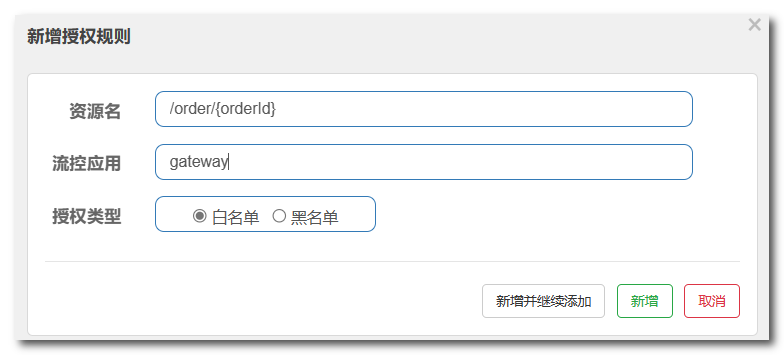

现在，我们直接跳过网关，访问order-service服务：


通过网关访问，不受影响：


### 9.7.4 自定义异常结果

默认情况下，发生限流、降级、授权拦截时，都会抛出异常到调用方。异常结果都是flow limmiting（限流）。这样不够友好，无法得知是限流还是降级还是授权拦截。

如果要自定义异常时的返回结果，需要实现 `BlockExceptionHandler` 接口：

```java
public interface BlockExceptionHandler {
    /**
     * 处理请求被限流、降级、授权拦截时抛出的异常：BlockException
     */
    void handle(HttpServletRequest request, HttpServletResponse response, BlockException e) throws Exception;
}
```

这个方法有三个参数：

- HttpServletRequest request：request对象
- HttpServletResponse response：response对象
- BlockException e：被sentinel拦截时抛出的异常

这里的BlockException包含多个不同的子类：

| **异常**             | **说明**           |
| -------------------- | ------------------ |
| FlowException        | 限流异常           |
| ParamFlowException   | 热点参数限流的异常 |
| DegradeException     | 降级异常           |
| AuthorityException   | 授权规则异常       |
| SystemBlockException | 系统规则异常       |

下面在order-service定义一个自定义异常处理类实现 `BlockExceptionHandler` 接口：

```Java
@Component
public class SentinelExceptionHandler implements BlockExceptionHandler {
    @Override
    public void handle(HttpServletRequest request, HttpServletResponse response, BlockException e) throws Exception {
        String msg = "未知异常";
        int status = 429;

        if (e instanceof FlowException) {
            msg = "请求被限流了";
        } else if (e instanceof ParamFlowException) {
            msg = "请求被热点参数限流";
        } else if (e instanceof DegradeException) {
            msg = "请求被降级了";
        } else if (e instanceof AuthorityException) {
            msg = "没有权限访问";
            status = 401;
        }

        response.setContentType("application/json;charset=utf-8");
        response.setStatus(status);
        response.getWriter().println("{\"msg\": " + msg + ", \"status\": " + status + "}");
    }
}
```

重启测试，在不同场景下，会返回不同的异常消息：

限流异常：


授权规则异常：


### 9.7.5 规则持久化

sentinel的所有规则都是内存存储，重启后所有规则都会丢失。在生产环境下，我们必须确保这些规则的持久化，避免丢失。

规则是否能持久化，取决于规则管理模式，sentinel支持三种规则管理模式：

- 原始模式：Sentinel的默认模式，将规则保存在内存，重启服务会丢失。
- pull模式
- push模式


#### pull模式

pull模式：控制台将配置的规则推送到Sentinel客户端，而客户端会将配置规则保存在本地文件或数据库中。以后会定时去本地文件或数据库中查询，更新本地规则。


#### push模式

push模式：控制台将配置规则推送到远程配置中心，例如Nacos。Sentinel客户端监听Nacos，获取配置变更的推送消息，完成本地配置更新。


实现push模式参考资料提供的《sentinel规则持久化》，修改后的项目也在资料中提供了。


# 10. Seata

## 10.1 分布式事务

**分布式事务**，就是指不是在单个服务或单个数据库架构下，产生的事务。

在数据库水平拆分、服务垂直拆分之后，一个业务操作通常要跨多个数据库、服务才能完成。

例如电商行业中比较常见的下单付款案例，包括下面几个行为：

- 创建新订单
- 扣减商品库存
- 从用户账户余额扣除金额

完成上面的操作需要访问三个不同的微服务和三个不同的数据库：


订单的创建、库存的扣减、账户扣款在每一个服务和数据库内是一个本地事务，可以保证ACID原则。

但是当我们把三件事情看做一个"业务"，要满足保证“业务”的原子性，要么所有操作全部成功，要么全部失败，不允许出现部分成功部分失败的现象，这就是分布式系统下的事务了。此时ACID难以满足，这是分布式事务要解决的问题。


### 10.1.1 演示分布式事务的问题

(1) 导入资料提供的seata-server项目：


(2) 导入sql文件创建对应的数据库表：


项目结构如下：


父工程版本信息如下：


seata-demo：父工程，负责管理项目依赖

- account-service：账户服务，负责管理用户的资金账户。提供扣减余额的接口
- storage-service：库存服务，负责管理商品库存。提供扣减库存的接口
- order-service：订单服务，负责管理订单。创建订单时，需要调用account-service和storage-service

(3) 启动nacos、所有微服务，测试下单功能，使用Apifox工具发出Post请求：

```
http://localhost:8082/order?userId=user202103032042012&commodityCode=100202003032041&count=20&money=200
```


测试发现，当库存不足时，如果余额已经扣减，并不会回滚，出现了分布式事务问题。


### 10.1.2 CAP定理

分布式系统有三个指标：

- **Consistency（一致性）**：用户访问分布式系统中的任意节点，得到的数据必须一致。
- **Availability（可用性）**：用户访问集群中的任意健康节点，必须能得到响应，而不是超时或拒绝。
- **Partition tolerance （分区容错性）**
  - Partition（分区）：因为网络故障或其它原因导致分布式系统中的部分节点与其它节点失去连接，形成独立分区。
  - Tolerance（容错）：在集群出现分区时，整个系统也要持续对外提供服务


在分布式系统中，系统间的网络不能100%保证健康，一定会有故障的时候，而服务有必须对外保证服务。因此Partition Tolerance不可避免。当节点接收到新的数据变更时，就会出现问题了：

如果此时要保证**一致性**，就必须等待网络恢复，完成数据同步后，整个集群才对外提供服务，服务处于阻塞状态，不可用。

如果此时要保证**可用性**，就不能等待网络恢复，那node01、node02与node03之间就会出现数据不一致。


也就是说，在P一定会出现的情况下，A和C之间只能实现一个。


### 10.1.3 BASE理论

BASE理论是对CAP的一种解决思路，包含三个思想：

- **Basically Available** **（基本可用）**：分布式系统在出现故障时，允许损失部分可用性，即保证核心可用。
- **Soft State（软状态）：**在一定时间内，允许出现中间状态，比如临时的不一致状态。
- **Eventually Consistent（最终一致性）**：虽然无法保证强一致性，但是在软状态结束后，最终达到数据一致。


**解决分布式事务的思路**

分布式事务最大的问题是各个子事务的一致性问题，因此可以借鉴CAP定理和BASE理论，有两种解决思路：

- AP模式：各子事务分别执行和提交，允许出现结果不一致，然后采用弥补措施恢复数据即可，实现最终一致。

- CP模式：各个子事务执行后互相等待，同时提交，同时回滚，达成强一致。但事务等待过程中，处于弱可用状态。

不管是哪一种模式，都需要在子系统事务之间互相通讯，协调事务状态，也就是需要一个**事务协调者(TC)**：

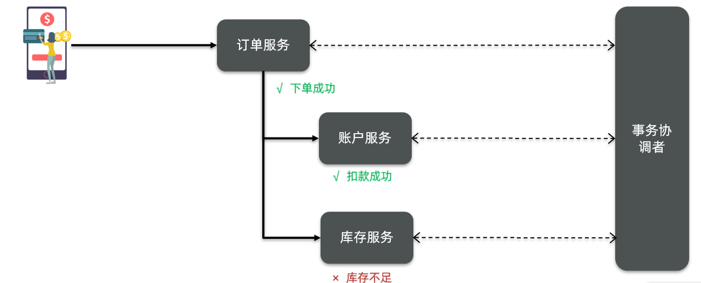

这里的子系统事务，称为**分支事务**；有关联的各个分支事务在一起称为**全局事务**。


## 10.2 初识Seata

Seata是 开源的分布式事务解决方案。致力于提供高性能和简单易用的分布式事务服务，为用户打造一站式的分布式解决方案。

官网地址：http://seata.io/

Seata事务管理中有三个重要的角色：

- **TC (Transaction Coordinator) -** **事务协调者：**维护全局和分支事务的状态，协调全局事务提交或回滚。

- **TM (Transaction Manager) -** **事务管理器：**定义全局事务的范围、开始全局事务、提交或回滚全局事务。

- **RM (Resource Manager) -** **资源管理器：**管理分支事务处理的资源，与TC交谈以注册分支事务和报告分支事务的状态，并驱动分支事务提交或回滚。

整体的架构如图：


Seata基于上述架构提供了四种不同的分布式事务解决方案：

- XA模式：强一致性分阶段事务模式，牺牲了一定的可用性，无业务侵入
- TCC模式：最终一致的分阶段事务模式，有业务侵入
- AT模式：最终一致的分阶段事务模式，无业务侵入，也是Seata的默认模式
- SAGA模式：长事务模式，有业务侵入

无论哪种方案，都离不开TC，也就是事务的协调者。


## 10.3 部署Seata服务

部署Seata-server，也就是Seata的TC服务。

**(1) 下载**

首先我们要下载seata-server包，地址在[http](http://seata.io/zh-cn/blog/download.html)[://seata.io/zh-cn/blog/download](http://seata.io/zh-cn/blog/download.html)[.](http://seata.io/zh-cn/blog/download.html)[html](http://seata.io/zh-cn/blog/download.html) ，资料中已经准备好了。


**(2) 修改配置**

解压后进入conf目录，修改registry.conf文件，内容如下：

```properties
registry {
  # TC服务的注册中心类，这里选择nacos，也可以是eureka、zookeeper等
  type = "nacos"

  nacos {
    # seata tc 服务注册到 nacos的服务名称，可以自定义
    application = "seata-server"
    serverAddr = "127.0.0.1:8848"
    group = "DEFAULT_GROUP"
    namespace = ""
    cluster = "SH"
  }
}

config {
  # 读取TC服务端的配置文件的方式，这里是从nacos配置中心读取，这样如果TC是集群，可以共享配置
  type = "nacos"
  # 配置nacos地址等信息
  nacos {
    serverAddr = "127.0.0.1:8848"
    namespace = ""
    group = "SEATA_GROUP"
    dataId = "seataServer.properties"
  }
}
```

**(3) 在nacos添加配置**

为了让TC服务的集群可以共享配置，选择nacos作为统一配置中心。因此服务端配置文件seataServer.properties需要在nacos中配好。


```properties
# 数据存储方式，db代表数据库
store.mode=db
store.db.datasource=druid
store.db.dbType=mysql
store.db.driverClassName=com.mysql.cj.jdbc.Driver
store.db.url=jdbc:mysql://127.0.0.1:3306/seata?useUnicode=true&rewriteBatchedStatements=true&serverTimezone=UTC
store.db.user=root
store.db.password=123456
store.db.minConn=5
store.db.maxConn=30
store.db.globalTable=global_table
store.db.branchTable=branch_table
store.db.queryLimit=100
store.db.lockTable=lock_table
store.db.maxWait=5000
# 事务、日志等配置
server.recovery.committingRetryPeriod=1000
server.recovery.asynCommittingRetryPeriod=1000
server.recovery.rollbackingRetryPeriod=1000
server.recovery.timeoutRetryPeriod=1000
server.maxCommitRetryTimeout=-1
server.maxRollbackRetryTimeout=-1
server.rollbackRetryTimeoutUnlockEnable=false
server.undo.logSaveDays=7
server.undo.logDeletePeriod=86400000

# 客户端与服务端传输方式
transport.serialization=seata
transport.compressor=none
# 关闭metrics功能，提高性能
metrics.enabled=false
metrics.registryType=compact
metrics.exporterList=prometheus
metrics.exporterPrometheusPort=9898
```

其中的数据库地址、用户名、密码都需要修改成你自己的数据库信息。

**(4) 创建数据库表**

新建一个名为seata的数据库，运行资料提供的sql文件：


**(5) 启动TC服务**

进入bin目录，双击seata-server.bat即可启动。启动成功后，seata-server已经注册到nacos注册中心。


## 10.4 微服务集成Seata

以order-service为例来演示。

**(1) 引入依赖**

首先，在order-service中引入依赖：

```xml
<dependency>
    <groupId>com.alibaba.cloud</groupId>
    <artifactId>spring-cloud-starter-alibaba-seata</artifactId>
</dependency>
```

**(2) 配置Seata地址**

```yml
seata:
  registry:  # TC服务注册中心的配置，微服务根据这些信息去注册中心获取TC服务地址
    type: nacos # 注册中心类型 nacos
    nacos:
      server-addr: localhost:8848 # nacos地址
      namespace: ""  # namespace，默认为空
      group: DEFAULT_GROUP  # 分组，默认是DEFAULT_GROUP
      application: seata-server # seata服务名称
  tx-service-group: seata-demo  # 事务组名称
  service:
    vgroup-mapping: # 事务组与cluster的映射关系
      seata-demo: SH  # 事务组对应的集群 SH
```

我们知道注册到Nacos中的微服务，确定一个具体实例需要四个信息：

- namespace：命名空间
- group：分组
- application：服务名
- cluster：集群名


namespace为空，就是默认的public，结合起来，TC服务的信息就是：public@DEFAULT_GROUP@seata-tc-server@SH，这样就能确定TC服务集群了。然后就可以去Nacos拉取对应的实例信息了。其它两个微服务也都参考order-service的步骤来做，完全一样。

**(3) 配置事务解决方案**

### 10.4.1 XA模式

XA 规范 是分布式事务处理（DTP，Distributed Transaction Processing）标准，XA 规范 描述了全局的TM与局部的RM之间的接口，几乎所有主流的数据库都对 XA 规范 提供了支持。目前主流数据库都实现了这种规范，实现的原理都是基于两阶段提交。

一阶段：

- 事务协调者通知每个事物参与者执行本地事务
- 本地事务执行完成后报告事务执行状态给事务协调者，此时事务不提交，继续持有数据库锁

二阶段：

- 事务协调者基于一阶段的报告来判断下一步操作
  - 如果一阶段都成功，则通知所有事务参与者，提交事务
  - 如果一阶段任意一个参与者失败，则通知所有事务参与者回滚事务

正常情况：

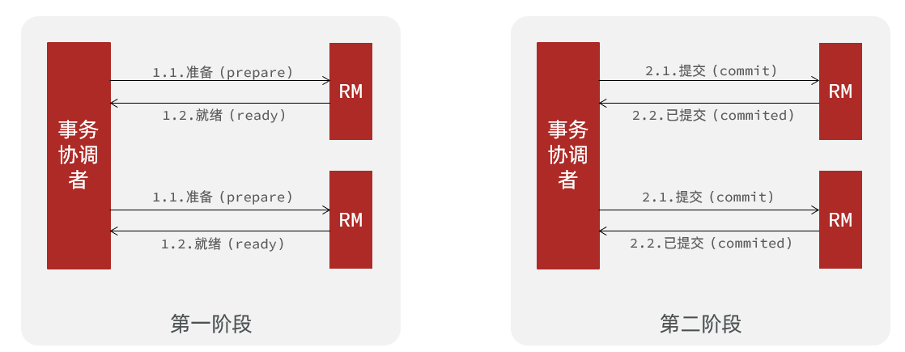

异常情况：


**Seata的XA模型**

Seata对原始的XA模式做了简单的封装和改造，以适应自己的事务模型，基本架构如图：


RM一阶段的工作：

​	① 注册分支事务到TC

​	② 执行分支业务sql但不提交

​	③ 报告执行状态到TC

TC二阶段的工作：

- TC检测各分支事务执行状态

  a.如果都成功，通知所有RM提交事务

  b.如果有失败，通知所有RM回滚事务

RM二阶段的工作：

- 接收TC指令，提交或回滚事务


**实现XA模式**

Seata的starter已经完成了XA模式的自动装配，实现非常简单，步骤如下：

(1) 修改application.yml文件（每个参与事务的微服务），开启XA模式：

```yml
seata:
  data-source-proxy-mode: XA
```

(2) 给发起全局事务的入口方法添加 `@GlobalTransactional` 注解：

本例中是OrderServiceImpl中的create方法

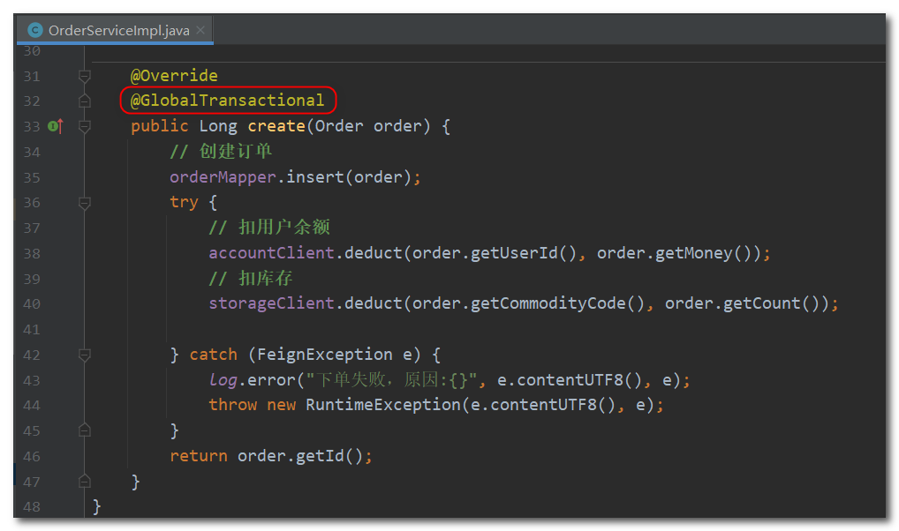

(3) 重启服务并测试

重启微服务，使用Apifox工具发送请求再次测试，在库存不足的情况下，扣款成功后会进行回滚。

```
http://localhost:8082/order?userId=user202103032042012&commodityCode=100202003032041&count=20&money=200
```


**XA模式优缺点**

优点：

- 事务的强一致性，满足ACID原则。
- 常用数据库都支持，实现简单，并且没有代码侵入

缺点是：

- 因为一阶段需要锁定数据库资源，等待二阶段结束才释放，性能较差
- 依赖关系型数据库实现事务


### 10.4.2 AT模式

AT模式同样是分阶段提交的事务模型，不过缺弥补了XA模型中资源锁定周期过长的缺陷。

**Seata的AT模型**


阶段一RM的工作：

- 注册分支事务
- 记录undo-log（数据快照）
- 执行业务sql并提交
- 报告事务状态

阶段二提交时RM的工作：

- 删除undo-log即可

阶段二回滚时RM的工作：

- 根据undo-log恢复数据到更新前


**流程分析**

用一个真实的业务来梳理下AT模式的原理。

比如，现在又一个数据库表，记录用户余额：

| **id** | **money** |
| ------ | --------- |
| 1      | 100       |

其中一个分支业务要执行的SQL为：

```sql
update tb_account set money = money - 10 where id = 1
```

AT模式下，当前分支事务执行流程如下：

一阶段：

1）TM发起并注册全局事务到TC

2）TM调用分支事务

3）分支事务准备执行业务SQL

4）RM拦截业务SQL，根据where条件查询原始数据，形成快照。

```json
{
    "id": 1, "money": 100
}
```

5）RM执行业务SQL，提交本地事务，释放数据库锁。此时 `money = 90`

6）RM报告本地事务状态给TC

二阶段：

1）TM通知TC事务结束

2）TC检查分支事务状态

①如果都成功，则立即删除快照

②如果有分支事务失败，需要回滚。读取快照数据（`{"id": 1, "money": 100}`），将快照恢复到数据库。此时数据库再次恢复为100


**脏写问题**

在多线程并发访问AT模式的分布式事务时，有可能出现脏写问题，如图：


解决思路就是引入了全局锁的概念。在释放DB锁之前，先拿到全局锁。避免同一时刻有另外一个事务来操作当前数据。


**实现AT模式**

AT模式中的快照生成、回滚等动作都是由框架自动完成，没有任何代码侵入，因此实现非常简单。

只不过，AT模式需要一个表来记录全局锁、另一张表来记录数据快照undo_log。

1）导入数据库表，记录全局锁

导入课前资料提供的Sql文件，其中lock_table导入到TC服务关联的数据库，undo_log导入到微服务关联的数据库：


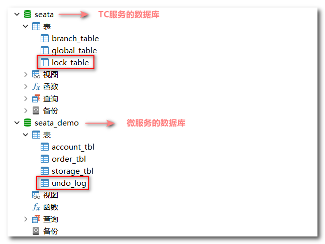

2）修改微服务的application.yml文件，将事务模式修改为AT模式即可：

```yaml
seata:
  data-source-proxy-mode: AT # 默认就是AT
```

3）重启服务并测试


**AT模式优缺点**

AT模式的优点：

- 一阶段完成直接提交事务，释放数据库资源，性能比较好
- 利用全局锁实现读写隔离
- 没有代码侵入，框架自动完成回滚和提交

AT模式的缺点：

- 两阶段之间属于软状态，属于最终一致
- 框架的快照功能会影响性能，但比XA模式要好很多


**AT与XA的区别**

- XA模式一阶段不提交事务，锁定资源；AT模式一阶段直接提交，不锁定资源。
- XA模式依赖数据库机制实现回滚；AT模式利用数据快照实现数据回滚。
- XA模式强一致；AT模式最终一致


### 10.4.3 TCC模式

TCC模式与AT模式非常相似，每阶段都是独立事务，不同的是TCC通过人工编码来实现数据恢复。需要实现三个方法：

- Try：资源的检测和预留； 

- Confirm：完成资源操作业务；要求 Try 成功 Confirm 一定要能成功。

- Cancel：预留资源释放，可以理解为try的反向操作。

**Seata的TCC模型**


**流程分析**

举例，一个扣减用户余额的业务。假设账户A原来余额是100，需要余额扣减30元。

(1) 阶段一（ Try ）：检查余额是否充足，如果充足则冻结金额增加30元，可用余额扣除30

初始余额：


余额充足，可以冻结：


此时，总金额 = 冻结金额 + 可用金额，数量依然是100不变。事务直接提交无需等待其它事务。

(2) 阶段二：

- 假如要提交（Confirm），则清除冻结金额：


- 如果要回滚（Cancel），则释放冻结金额，恢复可用金额：


**空回滚和事务悬挂**

(1) 空回滚

当某分支事务的try阶段阻塞时，可能导致全局事务超时而触发二阶段的cancel操作。在未执行try操作时先执行了cancel操作，这时cancel不能做回滚，就是空回滚。执行cancel操作时，应当判断try是否已经执行，如果尚未执行，则应该空回滚。


(2) 事务悬挂

对于已经空回滚的业务，之前被阻塞的try操作恢复，继续执行try，就永远不可能confirm或cancel ，事务一直处于中间状态，这就是业务悬挂。执行try操作时，应当判断cancel是否已经执行过了，如果已经执行，应当阻止空回滚后的try操作，避免悬挂。


**实现TCC模式**

(1) 创建资源预留记录表

在微服务的数据库中创建资源预留记录表，资料中已经提供好了


```sql
DROP TABLE IF EXISTS `account_freeze_tbl`;
CREATE TABLE `account_freeze_tbl`  (
  `xid` varchar(128) CHARACTER SET utf8 COLLATE utf8_general_ci NOT NULL,
  `user_id` varchar(255) CHARACTER SET utf8 COLLATE utf8_general_ci NULL DEFAULT NULL,
  `freeze_money` int(11) UNSIGNED NULL DEFAULT 0,
  `state` int(1) NULL DEFAULT NULL COMMENT '事务状态，0:try，1:confirm，2:cancel',
  PRIMARY KEY (`xid`) USING BTREE
) ENGINE = InnoDB CHARACTER SET = utf8 COLLATE = utf8_general_ci ROW_FORMAT = COMPACT;
```

- xid：是全局事务id
- freeze_money：用来记录用户冻结金额
- state：用来记录事务状态

(2) 业务分析

- Try业务：
  - 记录冻结金额和事务状态到account_freeze表
  - 扣减account表可用金额
- Confirm业务
  - 根据xid删除account_freeze表的冻结记录
- Cancel业务
  - 修改account_freeze表，冻结金额为0，state为2
  - 修改account表，恢复可用金额
- 如何判断是否空回滚？
  - cancel业务中，根据xid查询account_freeze，如果为null则说明try还没做，需要空回滚
- 如何避免业务悬挂？
  - try业务中，根据xid查询account_freeze ，如果已经存在则证明Cancel已经执行，拒绝执行try业务


(3) 声明TCC接口

接下来，改造微服务account-service，利用TCC实现余额扣减功能。TCC的Try、Confirm、Cancel方法都需要在接口中基于注解来声明。

在`cn.itcast.account.service`包中新建一个接口，声明TCC三个方法，该接口需要使用 `@LocalTCC` 注解标识：

```Java
@LocalTCC
public interface AccountTCCService {

    @TwoPhaseBusinessAction(name = "deduct", commitMethod = "confirm", rollbackMethod = "cancel")
    void deduct(@BusinessActionContextParameter(paramName = "userId") String userId,
                @BusinessActionContextParameter(paramName = "money")int money);

    boolean confirm(BusinessActionContext ctx);

    boolean cancel(BusinessActionContext ctx);
}
```

- 使用 `@TwoPhaseBusinessAction` 注解标识的方法就是Try方法，在该注解中还需要声明Confirm、Cancel方法的名字。

- 使用 `@BusinessActionContextParameter` 注解标识的参数会保存到上下文对象中，可以通过 `BusinessActionContext` 获取。


(4) 编写实现类

在account-service服务中的`cn.itcast.account.service.impl`包下新建一个类，实现TCC业务：

```Java
@Service
@Slf4j
public class AccountTCCServiceImpl implements AccountTCCService {

    @Autowired
    private AccountMapper accountMapper;
    @Autowired
    private AccountFreezeMapper freezeMapper;

    @Override
    @Transactional
    public void deduct(String userId, int money) {
        // 1.获取事务id
        String xid = RootContext.getXID();
        // 2.业务悬挂判断：判断freeze中是否有冻结记录，如果有，一定是cancel执行过(confirm执行后会删除记录)，则不执行业务
        AccountFreeze oldFreeze = freezeMapper.selectById(xid);
        if (oldFreeze != null) {
            return;
        }
        // 3.扣减可用余额
        accountMapper.deduct(userId, money);
        // 4.记录冻结金额，事务状态
        AccountFreeze freeze = new AccountFreeze();
        freeze.setUserId(userId);
        freeze.setFreezeMoney(money);
        freeze.setState(AccountFreeze.State.TRY);
        freeze.setXid(xid);
        freezeMapper.insert(freeze);
    }

    @Override
    public boolean confirm(BusinessActionContext ctx) {
        // 1.获取事务id
        String xid = ctx.getXid();
        // 2.根据id删除冻结记录
        int count = freezeMapper.deleteById(xid);
        return count == 1;
    }

    @Override
    public boolean cancel(BusinessActionContext ctx) {
        // 1.查询冻结记录
        String xid = ctx.getXid();
        String userId = ctx.getActionContext("userId").toString();
        AccountFreeze freeze = freezeMapper.selectById(xid);
        // 2.空回滚判断，判断freeze是否为null，如果是，说明Try方法没有执行(如果Try执行了且没有记录说明执行了Confirm方法)，需要空回滚
        if (freeze == null) {
            freeze = new AccountFreeze();
            freeze.setUserId(userId);
            freeze.setFreezeMoney(0); // 冻结金额置零，因为没执行Try方法，冻结金额本来就是0
            freeze.setState(AccountFreeze.State.TRY);
            freeze.setXid(xid);
            freezeMapper.insert(freeze);
            return true;
        }
        // 3.幂等判断：只要Cancel方法执行了，状态一定会变成CANCEL
        if (freeze.getState() == AccountFreeze.State.CANCEL) {
            // 已经执行过Cancel方法，无需重复处理
            return true;
        }
        // 4.恢复可用余额
        accountMapper.refund(freeze.getUserId(), freeze.getFreezeMoney());
        // 5.将冻结金额清零，状态改为CANCEL
        freeze.setFreezeMoney(0);
        freeze.setState(AccountFreeze.State.CANCEL);
        int count = freezeMapper.updateById(freeze);
        return count == 1;
    }
}
```


(4) 测试

将 AccountController 中的调用的接口改为 AccountTCCService ：


重启微服务测试库存不足的情况下回滚效果：

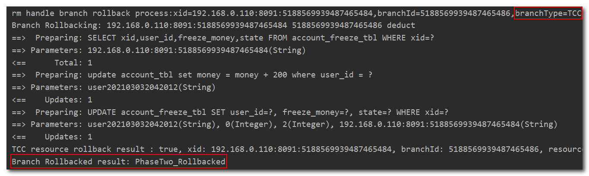


**TCC模式优缺点**

TCC的优点：

- 一阶段完成直接提交事务，释放数据库资源，性能好
- 相比AT模型，无需生成快照，无需使用全局锁，性能最强
- 不依赖数据库事务，而是依赖补偿操作，可以用于非事务型数据库

TCC的缺点：

- 有代码侵入，需要人为编写try、Confirm和Cancel接口，太麻烦
- 软状态，事务是最终一致
- 需要考虑Confirm和Cancel的失败情况，做好幂等处理

> 所谓的幂等性，是分布式环境下的一个常见问题，一般是指在进行多次操作时，所得到的结果是一样的，即多次运算结果是一致的。
>
> 也就是说，用户对于同一操作，无论是发起一次请求还是多次请求，最终的执行结果是一致的，不会因为多次点击而产生副作用。


### 10.4.4 SAGA模式

 **Saga 模式原理**

在 Saga 模式下，分布式事务内有多个参与者，每一个参与者都是一个冲正补偿服务，需要用户根据业务场景实现其正向操作和逆向回滚操作。

分布式事务执行过程中，依次执行各参与者的正向操作，如果所有正向操作均执行成功，那么分布式事务提交。如果任何一个正向操作执行失败，那么分布式事务会去退回去执行前面各参与者的逆向回滚操作，回滚已提交的参与者，使分布式事务回到初始状态。


Saga也分为两个阶段：

- 一阶段：直接提交本地事务
- 二阶段：成功则什么都不做；失败则通过编写补偿业务来回滚


**Saga模式优缺点**

优点：

- 事务参与者可以基于事件驱动实现异步调用，吞吐高
- 一阶段直接提交事务，无锁，性能好
- 不用编写TCC中的三个阶段，实现简单

缺点：

- 软状态持续时间不确定，时效性差
- 没有锁，没有事务隔离，会有脏写


#### 四种模式对比


## 10.5 TC服务集群

搭建TC服务集群非常简单，启动多个TC服务，注册到nacos即可。

但集群并不能确保100%安全，万一集群所在机房故障怎么办？所以如果要求较高，一般都会做异地多机房容灾。

比如一个TC集群在上海，另一个TC集群在杭州：


微服务基于事务组（tx-service-group)与TC集群的映射关系，来查找当前应该使用哪个TC集群。当SH集群故障时，只需要将vgroup-mapping中的映射关系改成HZ。则所有微服务就会切换到HZ的TC集群了。


### (1) 搭建异地容灾的TC集群

计划启动两台seata的tc服务节点（性能有限，这里一个集群只设置一个节点）：

| 节点名称 | ip地址    | 端口号 | 集群名称 |
| -------- | --------- | ------ | -------- |
| seata    | 127.0.0.1 | 8091   | SH       |
| seata2   | 127.0.0.1 | 8092   | HZ       |

之前我们已经启动了一台seata服务，端口是8091，集群名为SH。现在，将seata目录复制一份，起名为seata2。


修改seata2/conf/registry.conf内容如下：

```properties
registry {
  type = "nacos"
  nacos {
    application = "seata-server"
    serverAddr = "127.0.0.1:8848"
    group = "DEFAULT_GROUP"
    namespace = ""
    cluster = "HZ"
    username = "nacos"
    password = "nacos"
  }
}

config {
  type = "nacos"
  nacos {
    serverAddr = "127.0.0.1:8848"
    namespace = ""
    group = "SEATA_GROUP"
    username = "nacos"
    password = "nacos"
    dataId = "seataServer.properties"
  }
}
```

进入seata2/bin目录，打开命令行窗口然后运行命令：

```powershell
seata-server.bat -p 8092
```

打开nacos控制台，查看服务列表：

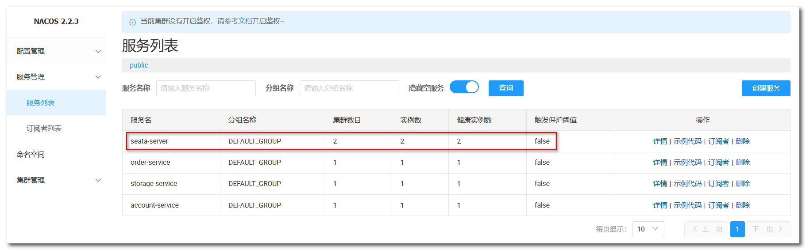

点进详情查看：


### (2) 将事务组映射配置到nacos

将tx-service-group与cluster的映射关系都配置到nacos配置中心。


配置内容如下：

```properties
# 事务组映射关系
service.vgroupMapping.seata-demo=SH

service.enableDegrade=false
service.disableGlobalTransaction=false
# 与TC服务的通信配置
transport.type=TCP
transport.server=NIO
transport.heartbeat=true
transport.enableClientBatchSendRequest=false
transport.threadFactory.bossThreadPrefix=NettyBoss
transport.threadFactory.workerThreadPrefix=NettyServerNIOWorker
transport.threadFactory.serverExecutorThreadPrefix=NettyServerBizHandler
transport.threadFactory.shareBossWorker=false
transport.threadFactory.clientSelectorThreadPrefix=NettyClientSelector
transport.threadFactory.clientSelectorThreadSize=1
transport.threadFactory.clientWorkerThreadPrefix=NettyClientWorkerThread
transport.threadFactory.bossThreadSize=1
transport.threadFactory.workerThreadSize=default
transport.shutdown.wait=3
# RM配置
client.rm.asyncCommitBufferLimit=10000
client.rm.lock.retryInterval=10
client.rm.lock.retryTimes=30
client.rm.lock.retryPolicyBranchRollbackOnConflict=true
client.rm.reportRetryCount=5
client.rm.tableMetaCheckEnable=false
client.rm.tableMetaCheckerInterval=60000
client.rm.sqlParserType=druid
client.rm.reportSuccessEnable=false
client.rm.sagaBranchRegisterEnable=false
# TM配置
client.tm.commitRetryCount=5
client.tm.rollbackRetryCount=5
client.tm.defaultGlobalTransactionTimeout=60000
client.tm.degradeCheck=false
client.tm.degradeCheckAllowTimes=10
client.tm.degradeCheckPeriod=2000

# undo日志配置
client.undo.dataValidation=true
client.undo.logSerialization=jackson
client.undo.onlyCareUpdateColumns=true
client.undo.logTable=undo_log
client.undo.compress.enable=true
client.undo.compress.type=zip
client.undo.compress.threshold=64k
client.log.exceptionRate=100
```


### (3) 微服务读取nacos配置

修改每一个微服务的application.yml文件，添加config配置，让微服务读取nacos中的client.properties文件：

```yaml
seata:
  config:
    type: nacos
    nacos:
      server-addr: localhost:8848
      group: SEATA_GROUP
      data-id: client.properties
```


重启微服务，现在微服务连接的集群都统一由nacos的client.properties来决定了。

修改nacos中的client.properties可以实现热更新，这样修改集群配置信息就不需要再重启微服务了。


### (4) 测试TC集群容灾

修改nacos配置列表中client.properties的配置，将集群更改为HZ，即seata2所在的集群


查看结果，可以看到微服务全部注册到HZ集群的8091节点的TC服务上，这样就实现了集群容灾的效果，：


