# Vue脚手架笔记


## 1. 初识脚手架

**(1) 脚手架项目结构**

├── node_modules 
├── public
│   ├── favicon.ico: 页签图标
│   └── index.html: 主页面
├── src
│   ├── assets: 存放静态资源
│   │   └── logo.png
│   │── component: 存放组件
│   │   └── HelloWorld.vue
│   │── App.vue: 汇总所有组件
│   │── main.js: 入口文件
├── .gitignore: git版本管制忽略的配置
├── babel.config.js: babel的配置文件
├── package.json: 应用包配置文件 
├── README.md: 应用描述文件
├── package-lock.json：包版本控制文件


**(2) main.js文件**

```js
/* 该文件是整个项目的入口文件*/
//引入Vue
import Vue from 'vue' // 这个vue是运行版的vue.runtime.esm.js
//引入App组件，它是所有组件的父组件
import App from './App.vue'
//关闭vue的生产提示
Vue.config.productionTip = false
//创建Vue实例对象
new Vue({
  /*render函数功能：注册组件，将App组件放入容器中
    render函数的形参是一个函数，用于创建元素，它需要将创建的元素返回。*/
  render: h => h(App),
}).$mount('#app')
```


**(3) App.vue文件**

```vue
<template>
  <div id="app">
    <!-- 使用组件 -->
    <MySchool></MySchool>
    <MyStudent></MyStudent>
  </div>
</template>

<script>
// 引入组件
import MySchool from "./components/MySchool.vue"; // 组件名要改成多单词大驼峰命名，不然会报错（或者关闭语法检查）
import MyStudent from "./components/MyStudent.vue";
// 默认暴露
export default {
  // 设置Vue开发者工具中显示的组件名
  name: "App",
  // 注册组件
  components: {
    MySchool,
    MyStudent,
  },
};
</script>

<style></style>
```

MySchool组件

```vue
<template>
  <div class="demo">
    <h3>学校名字：{{ name }}</h3>
    <h3>学校地址：{{ address }}</h3>
    <button @click="showInfo">Click Me</button>
  </div>
</template>

<script>
export default {
  data() {
    return {
      name: "哔哩哔哩",
      address: "上海",
    };
  },
  methods: {
    showInfo() {
      alert("学校名：" + this.name + ",学校地址：" + this.address);
    },
  },
};
</script>

<style>
.demo {
  background-color: aquamarine;
}
</style>
```


**(4) 不同版本的Vue**

- vue.js与vue.runtime.xxx.js的区别：
  - vue.js是完整版的Vue，包含：核心功能 + 模板解析器。
  - vue.runtime.xxx.js是运行版的Vue，只包含核心功能，没有模板解析器。

- vue.runtime.xxx.js没有模板解析器，所以不能使用template这个配置项，需要使用render函数接收到的createElement函数去指定具体内容。

```js
//创建Vue实例对象
new Vue({
  /*render函数功能：将App组件放入容器中
    render函数的形参是一个函数，用于创建元素，它需要将创建的元素返回。*/
  /*
      render(createElement){
         const div = createElement('div','你好呀')
         return div
      }
  */
  // 下面是箭头函数的写法，h代表的就是函数的形参，App代表组件名，组件的内容在App里面，所以只需要传入一个参数给h函数
  render: h => h(App),
}).$mount('#app')
```

------


## 2. 标签的ref属性

> **定义**：用来给元素或子组件注册引用信息（id的替代者），所有的ref都储存在vm或vc的$refs属性中。
>
> 若ref标记在html标签上，则通过vm.$refs获取的是真实DOM元素。
>
> 若ref标记在组件标签上，则通过vm.$refs获取的是组件实例对象。
>
> 使用ref标记元素或组件：<div ref="xxx">.....</div> 或 <School ref="xxx"></School>
>
> 获取ref标记的元素对象或组件实例：this.$refs.xxx（this指Vue实例或者VueComponent实例）

代码演示：

```vue
<template>
  <div id="app">
    <div ref="mydiv">欢迎学习Vue</div>  
    <MySchool ref="mySchool"/><br>
  </div>
</template>

<script>
import MySchool from "./components/MySchool.vue";
export default {
  name: "App",
  components: {
    MySchool
  },
  mounted() {
      console.log(this.$refs.mydiv) // 获取div元素
      console.log(this.$refs.mySchool) // 获取MySchool组件的实例对象
  }
};
</script>
```


------


## 3. props配置项

**功能**：接收组件标签上声明的参数。

props配置项接收的数据也会被代理到组件实例上，并且**props配置项的优先级比data配置项高**。即传递过来的参数中有与data中同名的参数时，优先取props中的参数。

**传递数据**：<组件标签 name="Alice" age="18" sex="女"/>，注意标签中的属性的值都是字符串类型，需要传递数值型数据需要使用数据绑定，比如<School :age="20"/>，这样传递的就是数值型的20。

```vue
<Student name="Alice" sex="女" :age="20"/>
```

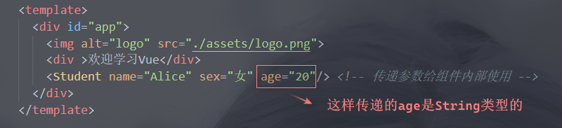

**接收数据**：

- 只负责接收：props:['name','age','sex']	（不需要按照顺序）

- 限制类型接收：

  > props:{ 
  > 	name:String, 
  > 	age:Number,
  > 	sex:String
  > }

- 限制类型、必要性、指定默认值：

  > props:{ 
  > 	name:{
  > 		type:String,
  > 		required:true
  > 	},
  > 	age:{
  > 		type:Number,
  > 		default:20
  > 	},
  > }

```vue
<template>
    <div>
        <h3>姓名：{{name}}</h3>
        <h3>年龄：{{age}}</h3>
        <h3>性别：{{sex}}</h3>
    </div>
</template>

<script>
export default {
    name:'Student',
    data:{
        name:'Tom',  // 获取name时会优先考虑props接收到的参数，因为props的优先级比data高
        myName:this.name    // props的加载顺序先于data，所以可以使用props中的数据
    },
    // props配置项：接收参数
    /* 方式一：只负责接收
     props:['name','sex','age']  // 接收传递过来的参数 */

    /* 方式二：限制类型接收
     props:{
         name:String,    // name只能是String类型
         age:Number,     // age只能是Number类型
         sex:String      
     }*/

    // 方式三：限制类型、必要性、指定默认值
    props:{
        name:{
            type:String,
            required:true   // 必须传递name参数
        },
        age:{
            type:Number,
            default:18  // 若没有传递age参数则使用默认值
        },
        sex:{
            type:String,
            required:true
        }
    }
}
</script>

<style></style>
```

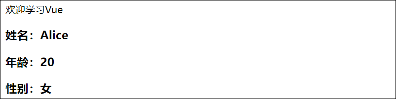

备注：**props是只读的**，Vue底层会监测对props的修改，如果进行了修改，就会发出警告，若业务需求确实需要修改，可以在data中引用props的数据，然后修改data中的数据。

------


## 4. mixins配置项

**功能**：引入混入配置(js文件)。

**混入配置**：多个组件共用的配置。

**定义混入配置**：{ data(){}, methods(){}, ... } ，该配置写在一个单独的js文件中，记得暴露。

**注册混入配置**：mixins:[ 混入名 ] ，例如mixins:[showTime]，showTime是导入的混入名。

mixin配置项比data和methods配置项加载的更早，因此可以在data或methods中可以获取到mixin中的配置；

data的优先级比mixin的优先级更高。不过mixin中的mounted()函数比当前组件的mounteda()函数先执行。

下面定义混入配置：

```js
export const showName = {
	methods: {
		showName(){
			alert(this.email)
		}
    },
    mounted() {
        console.log("mixin")	// 该函数先于组件的mounted()执行
    },
}
export const mydata = {
	data() {
        return {
            sex: '女',
            age:18
		}
	},
}
```

引入混入配置：引入混入后再注册混入，即可使用混入中的配置了

> 注册混入分为局部注册和全局注册：
>
> - 局部注册：mixins:[ xxx]，在组件文件中注册。
> - 全局注册：Vue.mixin(xxx)，在入口文件main.js中注册。

```vue
<template>
  <div>
    <h2 @click="showName">Alice信息</h2>
    <h2>邮箱：{{ email }}</h2>
    <h2>性别：{{ sex }}</h2>
    <h2>年龄：{{ age }}</h2> <!-- age是混入里面的配置 -->
  </div>
</template>

<script>
// 引入混入配置
import { showName, mydata } from "../mixin";
export default {
  name: "Alice",
  data() {
    return {
      email: "alice@qq.com",
      age:20
    };
  },
  methods: {
    showName() {
      // mixin的加载顺序先于data或者methods，所以可以使用mixin中的配置
      console.log(this.age); // 输出20，说明data的优先级高于mixin
    },
  },
  // 混入配置项：注册混入(局部注册混入)
  mixins: [showName, mydata], // 混入配置项的值是个数组的形式，即使只有一个值也要写成数组形式。注意注册的混入名不用加引号。
  mounted() {
    console.log("Alice"); // 注意混入中的mounted()函数先于当前组件的mounted()函数执行
  },
};
</script>
```

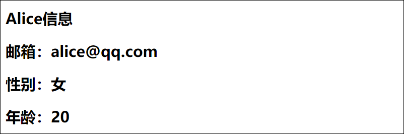

------


## 5. 插件

功能：用于增强Vue。

插件的本质：包含`install()`方法的一个对象，install()第一个参数接收的是Vue构造函数，后面的参数是插件使用者传递的参数。

**定义插件**：`export const plugins = { install(Vue,形参2,形参3,...){} }`，插件的定义写在一个单独的js文件中。

**引入插件**：`import 插件名 from '插件路径'`

**注册插件**：`Vue.use(插件名,参数1,参数2,...)`，后面的参数根据需求传递。

需要注意的是：`use()`方法的传入的第一个参数是插件名，并不是`install()`方法的接收的第一个参数，install()方法接收的第一个参数是Vue构造函数，后面的传入的参数才会被install()方法接收。

下面定义一个插件：

```js
export default {	// 默认暴露
	install(Vue,x,y,z){
		console.log(x,y,z) // 插件注册后打印Alice、18、undefined
        
		//全局过滤器
		Vue.filter('mySlice',function(value){
			return value.slice(0,4)	//截取前四个字符
		})

		//给Vue原型上添加一个方法（vm和vc就都能用了）
		Vue.prototype.hello = ()=>{alert('你好啊')}
        
        //还可以定义混入、自定义指令等等
        ...
	}
}
```

下面在main.js中引入插件和注册插件：

```js
//引入Vue
import Vue from 'vue' 
//引入App组件，它是所有组件的父组件
import App from './App.vue'
//引入插件
import plugins from './plugins'
//关闭Vue的生产提示
Vue.config.productionTip = false
//注册插件，并传入参数
Vue.use(plugins,'Alice',18)
//创建Vue实例
new Vue({
  render: h => h(App),
}).$mount('#app')
```

下面在组件文件中使用插件的内容：

```vue
<template>
  <div>
    <h2>Alice信息</h2>
    <h2>邮箱：{{ email | mySlice }}</h2>  <!--使用插件中的过滤器截取邮箱的前4个字符-->
    <button @click="hello">Click Me</button> <!--使用插件中给Vue原型对象添加的hello()方法-->
  </div>
</template>
```

查看结果：

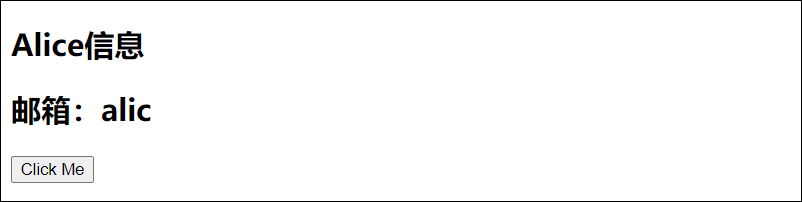

------


## 6. style标签的scoped属性

**使用方式**：`<style scoped><style>`

scoped属性表示当前样式只适用于当前组件，不会和其他组件同名的样式产生冲突。

**原理**：使用了`scoped`修饰的样式，Vue会为其添加一个属性选择器，属性名为`data-v-xxx`，xxx是随机生成的，并且为使用该样式的元素添加该属性，这样就可以保证该样式只修饰使用该属性的元素。

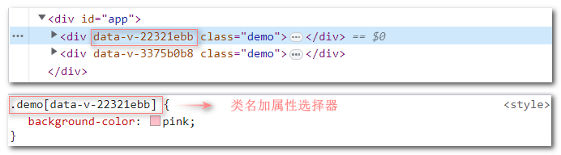

如果组件中样式不使用scoped修饰，那么同名的样式会产生冲突，后面导入的组件中的样式会覆盖先前导入的组件中同名的样式。

一般App组件中的样式不用加scoped修饰，加了的话只能在App组件中的标签才生效。

下面是School组件的样式：

```html
<style scoped>
	.demo{
		background-color: skyblue;
	}
</style>
```

Student组件的样式：

```html
<style lang="less" scoped>
// lang表示语法格式，不写默认是css语法
// less语法，需要安装less-loader（npm install less-loader）
// less语法支持单行注释
// less语法支持样式嵌套
	.demo {
 	 background-color: pink;
  		.demo2 {
    		font-size: 40px;
  		}
	}
</style>
```

App组件的样式：

```html
<style>
	.title {
  		color: red;
	}
</style>
```

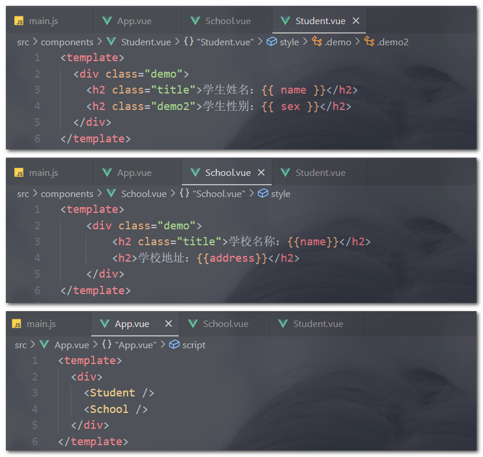

查看效果：

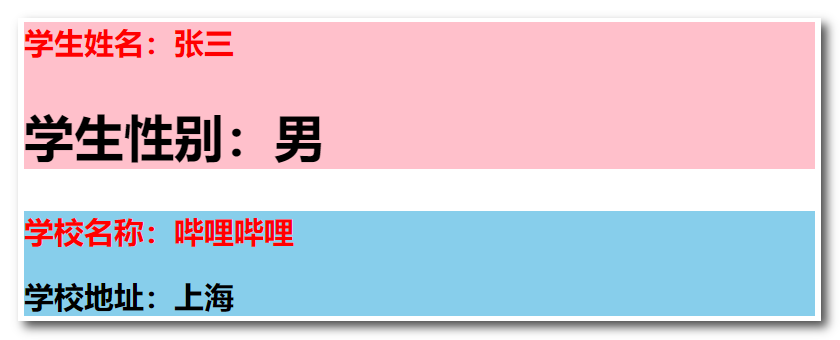

------


## 7. TodoList案例

**App.vue**

```vue
<template>
  <div id="app">
    <div class="todo-container">
      <div class="todo-wrap">
        <!-- addTodo()方法传给子组件MyHeader使用 -->
        <MyHeader :addTodo="addTodo" />
        <!-- checkTodo()方法传给子组件MyList，MyList再传给MyItem。deleteTodo()亦是如此-->
        <MyList
          :todoList="todoList"
          :checkTodo="checkTodo"
          :deleteTodo="deleteTodo"
        />
        <MyFooter :todoList="todoList" :checkAllTodo="checkAllTodo" :clearAllTodo="clearAllTodo"/>
      </div>
    </div>
  </div>
</template>

<script>
import MyFooter from "./components/MyFooter.vue";
import MyHeader from "./components/MyHeader.vue";
import MyList from "./components/MyList.vue";
export default {
  name: "App",
  components: { MyHeader, MyList, MyFooter },
  data() {
    return {
      // 由于todoList(对象数组)是MyList组件和MyFooter组件都在使用，所以放在App中（状态提升）
      todoList: [
        { id: "001", title: "学习", done: true },
        { id: "002", title: "音乐", done: true },
        { id: "003", title: "游戏", done: false },
      ],
    };
  },
  methods: {
    // 添加一个todo
    addTodo(todoObj) {
      this.todoList.unshift(todoObj);
    },
    // 勾选和取消勾选
    checkTodo(id) {
      this.todoList.forEach((todo) => {
        if (todo.id === id) todo.done = !todo.done;
      });
    },
    // 根据id删除todo
    deleteTodo(id) {
      this.todoList = this.todoList.filter((todo) => todo.id !== id); // 使用过滤器，记得重新赋值
    },
    //全选和取消全选
    checkAllTodo(done) {
      this.todoList.forEach((todo) => {
        todo.done = done;
      });
    },
    //清除所有已经完成的todo
    clearAllTodo() {
      this.todoList = this.todoList.filter((todo) => {
        return !todo.done; // filter()方法默认会筛选过滤条件为true的元素组成新的数组并返回。
      });
    },
  },
};
</script>

<style>
/*一般一些通用的样式就放在App组件的样式中*/
/*base*/
body {
  background: #fff;
}
.btn {
  display: inline-block;
  padding: 4px 12px;
  margin-bottom: 0;
  font-size: 14px;
  line-height: 20px;
  text-align: center;
  vertical-align: middle;
  cursor: pointer;
  box-shadow: inset 0 1px 0 rgba(255, 255, 255, 0.2),
    0 1px 2px rgba(0, 0, 0, 0.05);
  border-radius: 4px;
}
.btn-danger {
  color: #fff;
  background-color: #da4f49;
  border: 1px solid #bd362f;
}
.btn-danger:hover {
  color: #fff;
  background-color: #bd362f;
}
.btn:focus {
  outline: none;
}
.todo-container {
  width: 600px;
  margin: 0 auto;
}
.todo-container .todo-wrap {
  padding: 10px;
  border: 1px solid #ddd;
  border-radius: 5px;
}
</style>

```


**MyHeader.vue**

```vue
<template>
  <div class="todo-header">
    <input
      type="text"
      placeholder="请输入你的任务名称，按回车键确认"
	  v-model="title"
      @keyup.enter="add"
    />
  </div>
</template>

<script>
import { nanoid } from "nanoid"; // 导入生成id的组件nanoid，这是一个函数，调用时需要加小括号
export default {
  name: "MyHeader",
  props: ["addTodo"], // 接收从App传过来的addTodo()方法
  data() {
    return {
      title: "", // 收集用户输入的title
    };
  },
  methods: {
    add() {
      // 校验数据
      if (!this.title.trim()) return alert("输入不能为空");
      //将用户输入的数据包装成一个todo对象
      const todoObj = { id: nanoid(), title: this.title, done: false };
      //通知App组件去添加一个todo对象
      this.addTodo(todoObj);
      //清空输入
      this.title = "";
    },
  },
};
</script>

<style scoped>
/*header*/
.todo-header input {
  width: 560px;
  height: 28px;
  font-size: 14px;
  border: 1px solid #ccc;
  border-radius: 4px;
  padding: 4px 7px;
}

.todo-header input:focus {
  outline: none;
  border-color: rgba(82, 168, 236, 0.8);
  box-shadow: inset 0 1px 1px rgba(0, 0, 0, 0.075),
    0 0 8px rgba(82, 168, 236, 0.6);
}
</style>
```


**MyList.vue**

```vue
<template>
  <ul class="todo-main">
      <!-- 遍历数组的内容 -->
      <MyItem v-for="todo in todoList" :key="todo.id" :todo="todo" :checkTodo="checkTodo" :deleteTodo="deleteTodo"/>
  </ul>
</template>

<script>
import MyItem from './MyItem.vue';
export default {
  components: { MyItem },
  name: "MyList",
  // 接收App传递过来的数据，其中todoList是自己用的，checkTodo和deleteTodo是给子组件MyItem用的
  props:['todoList','checkTodo','deleteTodo'], 
};
</script>

<style scoped>
/*main*/
.todo-main {
  margin-left: 0px;
  border: 1px solid #ddd;
  border-radius: 2px;
  padding: 0px;
}

.todo-empty {
  height: 40px;
  line-height: 40px;
  border: 1px solid #ddd;
  border-radius: 2px;
  padding-left: 5px;
  margin-top: 10px;
}
</style>
```


**MyItem.vue**

```vue
<template>
  <li>
    <label>
      <!-- checked的值为真表示选上，为假表示未选上 -->
      <!-- change事件表示当前元素发生了变化则触发事件修改todo对象的done值 -->
      <input
        type="checkbox"
        :checked="todo.done"
        @change="handleCheck(todo.id)"
      />
      <!-- 当然上述操作可以使用v-model完成，v-model是双向数据绑定，会修改todo的值，但是todo是props接收的数据，
           props的数据原则上是不允许修改的，所以不见以使用v-model -->
      <!-- <input type="checkbox" v-model="todo.done"> -->
      <span>{{ todo.title }}</span>
    </label>
    <button class="btn btn-danger" @click="handleDelete(todo.id)">删除</button>
  </li>
</template>

<script>
export default {
  name: "MyItem",
  // 接收MyList传递的参数
  props: ['todo', 'checkTodo','deleteTodo'],
  methods: {
    // 勾选和取消勾选
    handleCheck(id) {
      // 调用App组件传过来的checkTodo()，将id对应的todo对象的done值取反(这个逻辑写在App中，数据在谁那谁操做数据)
      this.checkTodo(id);
    },
    // 删除todo
    handleDelete(id){
     if(confirm('确定删除吗？')){
					//通知App组件将对应的todo对象删除
					this.deleteTodo(id)
				}
    }
  },
};
</script>

<style scoped>
/*item*/
li {
  list-style: none;
  height: 36px;
  line-height: 36px;
  padding: 0 5px;
  border-bottom: 1px solid #ddd;
}
li label {
  float: left;
  cursor: pointer;
}
li label li input {
  vertical-align: middle;
  margin-right: 6px;
  position: relative;
  top: -1px;
}
li button {
  float: right;
  display: none;
  margin-top: 3px;
}
li:before {
  content: initial;
}
li:last-child {
  border-bottom: none;
}
li:hover {
  background-color: #ddd;
}
li:hover button {
  display: block;
}
</style>
```


**MyFooter.vue**

```vue
<template>
  <!-- 总数大于1时显示此元素 -->
  <div class="todo-footer" v-show="total">
    <label>
      <!-- checkbox类型的表单的value值即checked的值，所以isAll为true表示全选 -->
      <!-- isAll不是props的值，所以可以使用v-model绑定 -->
      <input type="checkbox" v-model="isAll" />
    </label>
    <span>
      <span>已完成{{ doneTotal }}</span> / 全部{{ total }}
    </span>
    <button class="btn btn-danger" @click="clearAll">清除已完成任务</button>
  </div>
</template>

<script>
export default {
  name: "MyFooter",
  props: ["todoList", "checkAllTodo", "clearAllTodo"],
  computed: {
    // 总数
    total() {
      return this.todoList.length;
    },
    // 已完成数
    doneTotal() {
      //此处使用reduce方法做条件统计
      //reduce()方法有两个参数，第一个参数为一个条件函数，第二个参数为初始值。
      //条件函数有两个参数，第一参数为上一次的值，第二个参数为当前值。该函数还需要返回值。
      /* const x = this.todoList.reduce((pre,current)=>{
					return pre + (current.done ? 1 : 0)	// 当前值的done为true则加1
				},0) */
      //箭头函数形式
      return this.todoList.reduce((pre, todo) => pre + (todo.done ? 1 : 0), 0);
    },
    // 全选框是否勾选
    isAll: {
      get() {
        // 已完成数和总数相等且大于0时返回true
        return this.doneTotal === this.total && this.total > 0;
      },
      // isAll被修改时set被调用
      set(value) {
        this.checkAllTodo(value);
      },
    },
  },
  methods: {
    //清空所有已完成
    clearAll() {
      this.clearAllTodo();
    },
  },
};
</script>

<style scoped>
/*footer*/
.todo-footer {
  height: 40px;
  line-height: 40px;
  padding-left: 6px;
  margin-top: 5px;
}

.todo-footer label {
  display: inline-block;
  margin-right: 20px;
  cursor: pointer;
}

.todo-footer label input {
  position: relative;
  top: -1px;
  vertical-align: middle;
  margin-right: 5px;
}

.todo-footer button {
  float: right;
  margin-top: 5px;
}
</style>
```

效果展示：

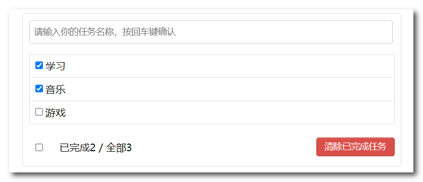

**TodoList案例总结**

1. 组件化编码流程：

   - 拆分静态组件：组件要按照功能点拆分，命名不要与html元素冲突。
   
   
      - 实现动态组件：考虑好数据的存放位置，数据是一个组件在用，还是一些组件在用：
   
        - 一个组件在用：放在组件自身即可。
        - 一些组件在用：放在他们共同的父组件上（状态提升）。
   
   
      - 实现交互：从绑定事件开始。
   
2. props可以用于父子组件间的通信：

   - 子组件需要使用父组件中的数据，父组件可以在子组件标签使用参数传递。
   
   
      - 父组件需要获取子组件中的数据，父组件则需要传递一个函数参数给子组件。(理解为：父组件的函数与子组件的参数形成闭包)
   
3. 使用v-model时要切记：v-model绑定的值不能是props传过来的值，因为props是不可以修改的！

4. props传过来的若是对象类型的值，修改对象中的属性时Vue不会报错，但不推荐这样做。

------


## 8. 浏览器的本地存储

1. 浏览器端通过 Window.sessionStorage 和 Window.localStorage 属性来实现本地存储机制。
2. 相关API：
      - `setItem('key','value')`：该方法接受一个键和值作为参数，会把键值对添加到存储中，如果键名存在，则更新其对应的值。
      - `getItem('key')`：该方法接受一个键名作为参数，返回键名对应的值。
      - `removeItem('key')`：该方法接受一个键名作为参数，并把该键名从存储中删除。
      - `clear()`：该方法会清空存储中的所有数据。

3. 使用方式：`window.xxxStorage.xxx()`，window可以省略。例如localStorage.setItem('name','张三')
4. 备注：

      - SessionStorage存储的内容会随着浏览器窗口关闭而消失。

      - LocalStorage存储的内容，需要手动清除才会消失。

      - xxxStorage.getItem(xxx)如果xxx对应的value获取不到，那么getItem的返回值是null。

      - `JSON.parse(String)`表示将一个JSON格式的字符串解析成一个JSON对象，JSON.parse(null)的结果依然是null。

      - `JSON.stringify(Object)`表示将一个对象转换成JSON格式的字符串。


------


## 9. 组件自定义事件

之前学习了使用props实现父子组件之间的通信，下面学习自定义事件实现父子组件间的通信。

自定义事件通常使用在组件标签上。绑定在组件标签上的事件会被当作自定义事件，即使是js中的事件也不例外，因此原生js事件想要在组件标签中正常触发，需要使用**native修饰符**，例如`@click.native`

**使用场景**：A是父组件，B是子组件，B要传数据给A，那么就要在A中给B绑定自定义事件。其中事件的回调在A中。

**注册自定义事件**：

- 第一种方式：`<组件名 @自定义事件="callback"/>`  或 `<组件名 v-on:自定义事件="callback"/>`
- 第二种方式：先使用ref标记组件标签：`<组件名 ref="xxx"/>`，然后获取到该组件实例调用`$on('自定义事件',callback)`方法。
    - $on()第一个参数是自定义事件名，第二个参数是绑定的回调函数，触发事件时传递的参数由回调函数的参数接收。
    -  一般在mounted()函数中调用$on()方法：mounted(){ `this.$refs.xxx.$on('自定义事件',callback)`}
    -  若想让自定义事件只触发一次：第一种方式可以使用once修饰符：`@myEvent.once`；第二种方式可以使用`$once()`方法。

**触发自定义事件**：`this.$emit('自定义事件',数据)`。传递多个参数时可以用剩余参数`...参数名`接收，剩余参数是一个数组。

**解绑自定义事件**：`this.$off('自定义事件')`，解绑多个事件则参数写成数组形似：this.$off(['事件1','事件2'])

*下面是App.vue的代码：*

```vue
<template>
  <div class="app">
    <h1>{{ msg }}学生姓名是：{{ studentName }}</h1>

    <!-- 通过父组件给子组件绑定一个自定义事件实现子给父传递数据（第一种写法，使用@或v-on） -->
    <Student @myEvent="getStudentName" @myEvent2="myTest" />

    <!-- 通过父组件给子组件绑定一个自定义事件实现子给父传递数据（第二种写法，使用ref） -->
    <School ref="school" />

    <!-- 原生事件写在组件标签中不使用native修饰会被当作自定义事件 -->
    <!-- <School ref="school" @click.native="getSchoolAddress" /> -->
  </div>
</template>

<script>
import Student from "./components/Student";
import School from "./components/School";

export default {
  name: "App",
  components: { School, Student },
  data() {
    return {
      msg: "你好啊！",
      studentName: "",
    };
  },
  methods: {
    // 自定义事件myEvent的回调函数
    getStudentName(name, ...params) {
      // ...表示剩余参数，即name接收第一个参数，剩余的参数由params数组接收。
      console.log("App收到了学生名：", name, params);
      this.studentName = name;
    },
    myTest() {
      console.log("myEvent2事件被触发了！");
    },
    getSchoolName(name) {
      console.log("App收到了学校名：", name);
    },
    getSchoolAddress(address) {
      console.log("App收到了学校地址：" + address);
    },
  },
  mounted() {
    this.$refs.school.$on("myEvent3", this.getSchoolName); //使用$on()方法绑定自定义事件
    this.$refs.school.$once("myEvent4", this.getSchoolAddress); //使用$once()方法绑定自定义事件（一次性）
    /* 	$emit()方法传递的参数会传给$on()方法中的第二个参数使用，第二个参数是一个回调函数。
	$on()方法中回调函数的this是该方法调用者，即School组件实例。
	但是这里是写在mounted函数中，使用this调用了methods中的方法，this指的是当前App组件实例对象。
	如果直接写回调函数例如$on('myEvent',function(){this.getSchoolName})则会报错，因为该this是School组件实例。
	因此要直接写回调函数则须使用箭头函数形式，这样this就找到了mounted()函数的调用者，这样this代表App组件实例，可以调用该方法。 */

    // 下面语句打印this为School组件实例，这种方式不能使用this.getSchoolName，会报错，School组件实例没有该方法。
    // this.$refs.school.$on("myEvent5",function(name){console.log(this);this.getSchoolName(name)})
    // 写成箭头含数才能用this.getSchoolName，如下所示
    // this.$refs.school.$on("myEvent5", (name) => {this.getSchoolName(name);});
    // 或者直接将逻辑写在箭头函数里面
     this.$refs.school.$on("myEvent5", (name) => {console.log("App收到了学校名：", name);});
  },
};
</script>

<style scoped>
.app {
  background-color: gray;
  padding: 5px;
}
</style>
```

*下面是Student.vue的代码：*

```vue
<template>
  <div class="student">
    <h2>学生姓名：{{ name }}</h2>
    <h2>学生性别：{{ sex }}</h2>
    <button @click="sendStudentName">把学生名给App</button>
    <button @click="unbind">解绑myEvent2事件</button>
    <button @click="death">销毁当前Student组件的实例</button>
  </div>
</template>

<script>
export default {
  name: "Student",
  data() {
    return {
      name: "Alice",
      sex: "女",
    };
  },
  methods: {
    sendStudentName() {
      //使用$emit()方法触发事件：
      //第一个参数为事件名，千万不要写错。后面的参数为传递的数据，接收的时候可以用剩余参数“...参数名”接收。
      this.$emit("myEvent", this.name, "Bryan", "Cindy", "David");//触发Student组件实例身上的自定义事件myEvent
      this.$emit("myEvent2");//触发Student组件实例身上的自定义事件myEvent2
    },
    unbind() {
      this.$off("myEvent2"); //解绑一个自定义事件
      // this.$off(['myEvent','myEvent2']) //解绑多个自定义事件
      // this.$off() //解绑所有的自定义事件
    },
    death() {
      this.$destroy(); //销毁了当前Student组件的实例，销毁后Student实例的所有事件全都无效。
	  // Vue2.7版本之前，销毁vm或vc后自定义事件全部失效，原生js事件还有效，2.7版本以后全部事件都失效。
    },
  },
};
</script>

<style lang="less" scoped>
.student {
  background-color: pink;
  padding: 5px;
  margin-top: 10px;
}
</style>
```

*下面是School.vue的代码：*

```vue
<template>
	<div class="school">
		<h2>学校名称：{{name}}</h2>
		<h2>学校地址：{{address}}</h2>
		<button @click="sendSchoolName">把学校名给App</button>
		<button @click="sendSchoolAddress">把学校地址给App(仅一次)</button>
		<button @click="unbindAll">解绑当前School组件实例绑定的所有自定义事件</button>
	</div>
</template>

<script>
	export default {
		name:'School',
		data() {
			return {
				name:'哔哩哔哩',
				address:'上海',
			}
		},
		methods: {
			sendSchoolName(){
				this.$emit("myEvent3",this.name)
				this.$emit("myEvent5",this.name)
			},
			sendSchoolAddress(){
				this.$emit("myEvent4",this.address)
			},
			unbindAll(){
				this.$off()
			}
		},
	}
</script>

<style scoped>
	.school{
		background-color: skyblue;
		padding: 5px;
		margin-top: 10px;
	}
</style>
```

查看结果：

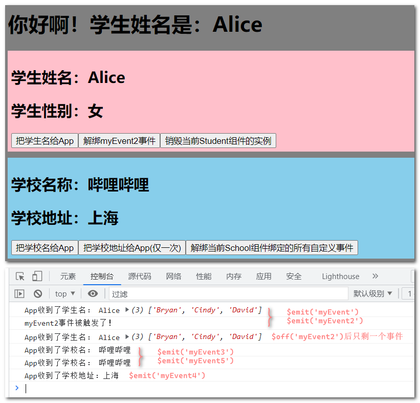

------


## 10. 全局事件总线

**全局事件总线**：适用于任意组件之间的通信。

*分析注册的过程*：

① 首先需要一个“傀儡”作为信息的载体，这个“傀儡”是全部组件都能看见的，所以可以考虑将这个傀儡放在`window`或者`Vue的原型`或者`VueComponent的原型`上。

② 其次这个傀儡还要能被操控，即拥有`$on()`、`$emit()`、`$off()`等方法，这些方法在Vue的原型上，所以这个傀儡必须是vm或vc。

③ 然而不建议给window添加属性(window.xxx = vm)，所以考虑这个傀儡放在Vue或者VueComponent的原型上。

④ 因为不同的vc是由不同的VueComponent创建出来的，如果将“傀儡”放在VueComponent原型上这样就会有很多个“傀儡”，但是Vue只有一个，并且VueComponent的原型指向了Vue的原型，vc可以访问的到Vue的原型上的“傀儡”。因此傀儡放在Vue的原型上。

⑤ 再说这个“傀儡”可以是vm或者vc，但是vc不容易获取：const Vc = Vue.extend({}); const vc = new Vc() 。因此使用vm作为傀儡。

⑥ 一般这个“傀儡”一般使用`$bus`作为变量名：`Vue.prototype.$bus = new Vue()`

⑦ ”傀儡“初始化需要一个合适的时期，因此将傀儡的初始化在beforeCreate()方法中执行：beforeCreate(){ Vue.prototype.$bus = this}

⑧ 最后这个“傀儡”就是所谓的全局事件总线。

**使用步骤**：

①注册全局事件总线

```js
import Vue from 'vue' 
import App from './App.vue'
Vue.config.productionTip = false

//const Vc = Vue.extend({})
//Vue.prototype.$bus = new Vc()

new Vue({
  render: h => h(App),
  beforeCreate() {
    Vue.prototype.$bus = this // 注册全局事件总线
  }
}).$mount('#app')
```

②School组件中给全局事件总线注册事件、绑定事件回调函数

```js
mounted() {
    // 给全局事件总线绑定自定义事件receive
    this.$bus.$on('receive', (data) => {
      console.log("我是School组件，收到了数据：" + data);
    });
  }
}
```

③Student组件中触发全局事件总线绑定的事件，传输数据

```js
 methods:{
    sendData(){
      // 触发全局事件总线绑定的receive事件，传输数据
      this.$bus.$emit('receive',this.name)
    }
  }
```

查看结果：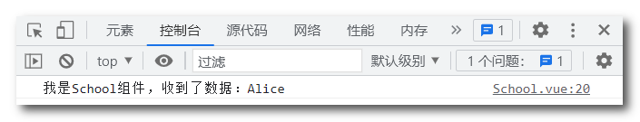

------


## 11. 发布与订阅

首先安装发布与订阅的第三方库：`npm i pubsub-js`

导入发布与订阅的第三方库：`import PubSub from 'pubsub-js'`

**订阅消息**：`PubSub.subscribe(msgName,callback)`

- *subscribe()有两个参数，第一个参数为消息名（唯一标识）；第二个参数为回调函数，接收到的数据都传给回调函数使用。*

- *回调函数第一个参数为消息名，第二个参数为消息的内容。第一个参数没多大用处但是又不能不写，所以一般会用" _  "来占位。*

- *subscribe()会返回一个值，这个值是订阅者的唯一标识。*

**取消订阅**：`PubSub.unsubscribe(id)`

*`unsubscribe()`函数的参数为订阅者的唯一标识，该函数通常放在`beforeDestroy()`方法中执行*

```js
mounted() {
    // 订阅消息
    // 将订阅者的id存储到当前实例上，取消订阅的时候就可以直接获取到这个id
    this.pbId = PubSub.subscribe('hello',(_,...data)=>{
      console.log('我是School组件，收到了来自'+_+'的消息：'+data)
    })
  },
beforeDestroy() {
    // 取消订阅
    PubSub.unsubscribe(this.pbId)
  }
```

**发布消息**：`PubSub.publish(msgName,content)`

*publish()函数第一个参数为消息名字，第二个参数为发布的消息内容*

```js
  methods:{
    sendData(){
      // 发布消息
      Pubsub.publish('hello',['Alice','Bryan','Cindy'])
    }
  }
```

查看结果：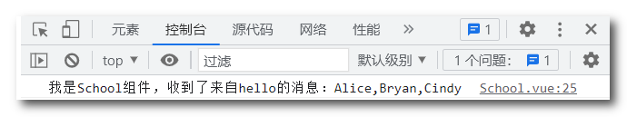

------


## 12. 过渡与动画

**transition** ：过渡，从一个状态过渡到另一状态。谁做过渡给谁加transition。

使用方法：`transition：属性 时间 曲线 延时`

- 属性：需要过渡变化的属性（宽度高度、背景颜色、内外边距等），如果想要所有的属性都过渡变化，则写一个all即可
- 时间：过渡花费的时间，注意单位是秒（s），必须写单位
- 曲线：运动曲线，默认是ease，可以省略
  - linear：匀速运动
  - ease：逐渐减速
  - ease-in：加速运动
  - ease-out：减速运动
  - ease-in-out：先加速后减速
- 延时：过渡动画延迟触发的时间，单位是秒（s），要写单位，不写延时默认是0秒

```css
<style scoped>
	h1{
		background-color: #fab;
	}
        /* 下面使用过渡完成两个动画 ：
            ①由进入起点过渡到进入的终点，也就是入场过程(v-enter-active)
            ②由离开的起点过渡到离开的终点，也就是出场过程(v-leave-active)
            提示：进入指的是元素从页面外进入到页面中，离开指的是元素从页面中离开到页面之外。
        */

	/* 进入的起点、离开的终点  */
	.v-enter,
	.v-leave-to{
		transform: translateX(-100%);
	}

	/* 将过渡属性写在入场过程和出场过程的样式中 */
	.v-enter-active,
	.v-leave-active{
		transition: 0.5s linear;
	}
	/* 进入的终点、离开的起点 */
	.v-enter-to,
	.v-leave{
		transform: translateX(0);
	}
	/*上述的类名都是Vue规定的默认类名*/
</style>
```


**animation** ：动画，相比较过渡，动画可以实现更多变化，更多控制，连续自动播放等效果。谁用动画给谁加animation。

**定义动画**：`@keyframes 动画名 {变化过程}`

(1) 两个状态时可以用`from{}` 、`to{}`来表示状态，from表示开始状态，to表示结束状态

*@keyframes 动画名{ from{ transform：xxx } to{ transform：xxx } }*

(2) 多个状态时可以用百分比来表示某个状态

*@keyframes 动画名 {*

​          */ \*开始状态\*/ 	0%{ transform：xxx }*

​          */\*中间状态\*/	x%{ transform：xxx }*

​          */\*结束状态\*/	100%{ transform：xxx }*

​        *}*

**使用动画**：`animation：动画名称 持续时间 运动曲线 延时开始时间 播放次数 是否反方向 动画结束后的状态`

大致按照这个顺序写，没有强硬要求，但是持续时间肯定是写在延时开始时间之前。

比如	animation：myAnimation 5s linear 2s infinite alternate forwards

```vue
<template>
  <div>
    <button @click="isShow = !isShow">显示/隐藏</button>
    <!-- 要给谁做动画，就把谁用transition标签包起来，然后Vue会给包起来的标签添加对应的类名-->
    <!-- appear表示页面一加载就执行一次动画 ，直接写appear相当于appear="true"，不写则相当于appear="false"-->
    <transition appear>
      <h1 v-show="isShow">你好啊！</h1>
    </transition>

    <!-- 给transition添加name属性，这样只能匹配.hello-xxx-xxx的类名 -->
    <transition name="hello" appear>
      <h1 v-show="isShow">太酷啦！</h1>
    </transition>

    <!-- 当要给多个标签添加动画时需要使用transition-group标签，并且多个标签还需要使用key标识-->
    <transition-group name="hello">
      <h1 v-show="isShow" key="1">你好帅！</h1>
      <h1 v-show="isShow" key="2">我不信！</h1>
    </transition-group>
  </div>
</template>

<script>
export default {
  name: "Test",
  data() {
    return {
      isShow: true,
    };
  },
};
</script>

<style scoped>
h1 {
  background-color: #bfa;
}
/* 下面介绍定义动画的使用*/

/* 当没有给transition标签添加name属性时，默认匹配v-xxx-active类名的样式 */
/* 当给transition标签添加了name属性时，则匹配name-xxx-active类名的样式，这些类名格式是固定的 */

/* 入场过程*/
.v-enter-active {
  animation: myAnimation 0.5s linear; /* linear表示匀速 */
}
.hello-enter-active {
  animation: myAnimation 0.5s linear;
}
/* 出场过程 */
.v-leave-active {
  animation: myAnimation 0.5s linear reverse; /* reverse表示反转 */
}
.hello-leave-active {
  animation: myAnimation 0.5s linear reverse;
}

/* 自定义动画 */
/* myAnimation是自定义的动画名 */
@keyframes myAnimation {
  /* 起始状态 */
  from {
    transform: translateX(-100%);
  }
  /* 结束状态 */
  to {
    transform: translateX(0px);
  }
}
</style>
```

------


## 13. 配置代理解决跨域

浏览器有一个重要的安全策略，称之为「同源策略」，两个源相同，称之为同源，两个源不同，称之为跨源或跨域。

向一个域发送请求，如果要请求的域和当前域是不同域，就叫跨域。不同域之间的请求，就是跨域请求。

**http(协议)://ip(域名):port(端口号)/source(路径)**，其中协议、域名、端口号，任何一个不一样，就是不同域，与路径无关。

例如下列的不同域：

- https://www.abc.com:8080/a
- http://www.abc.com:8080/a
- http://www.abcd.com:8080/a
- http://abc.com:8080/a

同域：

- http://www.abc.com:8080
- http://www.abc.com:8080/a/b
- http://www.abc.com:8080/b/a

发送跨域请求时，请求发出去了，服务器也响应了，只是响应被浏览器拦截了，下面通过配置代理服务器解决跨域问题。


**在vue.config.js中配置devServe解决发送Ajax请求跨域问题**

**方式一**：`devServe: { proxy: 'http://localhost:5000' }`

> 这种方式的缺点是不能配置多个代理，不能灵活的控制请求是否走代理。
>
> 如果本地（public文件夹）有同名的文件则不会发送请求获取数据，而是直接请求本地同名的文件。


首先编写一台服务器server1.js然后启动

```js
const express = require('express')
const app = express()

app.use((request,response,next)=>{
	console.log('有人请求服务器1了');
	console.log('请求来自于',request.get('Host'));
	console.log('请求的地址',request.url);
	next()
})

app.get('/students',(request,response)=>{
	const students = [
		{id:'001',name:'Alice',age:18},
		{id:'002',name:'Bryan',age:19},
		{id:'003',name:'Cindy',age:120},
	]
	response.send(students)
})

app.listen(5000,(err)=>{
	if(!err) console.log('服务器1启动成功了,请求学生信息地址为：http://localhost:5000/students');
```

按照方式一配置代理服务器后发送Ajax访问服务器server1的‘/student’

```html
<script>
	import axios from 'axios'
	export default {
		name:'App',
		methods: {
			getStudents(){
				axios.get('http://localhost:8080/students').then(
					response => {
						console.log('请求成功了',response.data)
					},
					error => {
						console.log('请求失败了',error.message)
					}
				)
			}
		}
	}
</script>
```

查看浏览器结果：


在public文件夹添加一个student文件：

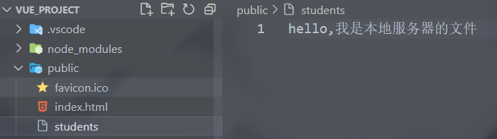

再次发送Ajax请求，可以看到请求的是public文件夹（项目的根目录）的students文件，没有发送请求给服务器。

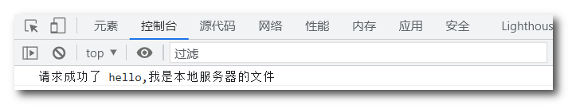

**方式二**：

```js
//开启代理服务器（方式二）
//这种方式可以配置多个代理，能灵活的控制请求是否走代理（设置了前缀就走代理）。
	devServer: {
    proxy: {
       // 路径前缀，这个前缀是加在端口号之后的路径的前面
      '/hello': { // 匹配所有以 '/hello'开头的请求路径
        target: 'http://localhost:5000', // 目标服务器
		pathRewrite:{'^/hello':''}, //去除前缀，因为访问的服务器没有这个路径，代理服务器发送请求时要将这个前缀去掉
        ws: true, //用于支持websocket
        changeOrigin: true //用于控制请求头中的host值。
      },
     '/demo': {	// 匹配所有以 '/demo'开头的请求路径
        target: 'http://localhost:5001',
		pathRewrite:{'^/demo':''},
        ws: true, 
        changeOrigin: true 
      }
    }
  }
```

其中proxy的值是一个个的路径前缀配置项，一个前缀配置项代表一个代理服务器，配置项中有四个主要的属性：

> `target`：请求的目标服务器的地址。
>
> `pathRewrite`：路径重写，将路径中匹配到的内容替换成指定内容。
>
> `ws`：用于支持websocket。
>
> `changeOrigin`：用于控制代理服务器请求头中的host值（主机名(IP):端口号），true表示代理服务器的host值就和请求的服务器的host值一样，设置为false就是本机的host值。

下面使用方式二配置代理服务器后发送Ajax请求：

```html
<script>
	// 导入axios
	import axios from 'axios'
	export default {
		name:'App',
		methods: {
			getStudents(){
				// 发送get方式的Ajax
				// 因为配置了前缀，所以请求的时候要把前缀hello加上。
				axios.get('http://localhost:8080/hello/students').then(
					response => {
						console.log('请求成功了',response.data)	
						// response参数接收服务器响应的对象，数据存储在该对象中的data属性
					},
					error => {
						console.log('请求失败了',error.message) 
						// error接收错误的对象，错误信息存储在message属性中
					}
				)
			},
            getCars(){
				axios.get('http://localhost:8080/demo/cars').then(
					response => {
						console.log('请求成功了',response.data)
					},
					error => {
						console.log('请求失败了',error.message)
					}
				)
			}
        }
	}
</script>
```

查看结果，可以看到响应回来了服务器的数据，并没有受到本地文件的影响

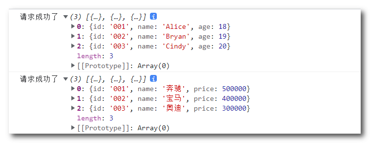

查看server1服务器端结果：


------


## 14. 查找github用户案例

**查找github用户接口地址**：https://api.github.com/search/users?q=xxx

App组件

```vue
<template>
	<div class="container">
		<Search/>
		<List/>
	</div>
</template>

<script>
	import Search from './components/Search'
	import List from './components/List'
	export default {
		name:'App',
		components:{Search,List}
	}
</script>
```

Search组件主要代码

```vue
<template>
  <section class="jumbotron">
    <h3 class="jumbotron-heading">Search Github Users</h3>
    <div>
    	<input type="text" placeholder="enter the name you search" v-model="keyword"/>&nbsp;
		<button @click="searchUsers">Search</button>
    </div>
  </section>
</template>

<script>
// 导入axios
import axios from 'axios'
export default {
  name: "Search",
  data() {
	return {
		keyword:''
	}
  },
  methods: {
	searchUsers(){
		//发送请求前先更新状态信息以及清空users的数据
		this.$bus.$emit('updateData',{isFirst:false,isLoading:true,errMsg:'',users:[]})
		//发送Ajax请求（查询github用户接口为：https://api.github.com/search/users?q=xxx）
        //这里需要用到模板字符串（``），方便传入参数
		axios.get(`https://api.github.com/search/users?q=${this.keyword}`).then(
			response =>{
				console.log('请求成功了')
				// 请求成功后更新数据
				// 注意axios发送请求返回的是一个Promise对象，返回的数据存储在该对象的PromiseResult属性中。
				// then()方法的第一个参数为一个响应成功的对象，该对象中的data属性存储着PromiseResult属性中成功的数据。
                // 第二个参数则反之。
				this.$bus.$emit('updateData',{isLoading:false,errMsg:'',users:response.data.items})
                // 用户信息在接口返回的对象的item属性中
			},
			error =>{
				// 请求失败后更新数据（主要是提示错误信息，清空列表信息）
				this.$bus.$emit('updateData',{isLoading:false,errMsg:error.message,users:response.data.items})
			}
		)

	}
  },
};
</script>

```

List组件主要代码

```vue
<template>
  <div class="row">
    <!-- 展示用户列表 -->
	<!-- 列表长度为0则不显示此元素 -->
    <div v-show="info.users.length" class="card" v-for="user in info.users" :key="user.login">	
		<!-- 跳转用户主页链接(链接存储在用户信息的html_url属性)-->
    	<a :href="user.html_url" target="_blank">
			<!-- 用户头像地址(地址存储在用户信息的avatar_url属性-->
        	
    	</a>
		<!-- 用户名 login -->
      	<p class="card-text">{{user.login}}</p>
		
    </div>
	<!-- 展示欢迎词 -->
	<h1 v-show="info.isFirst">欢迎使用！</h1>
	<!-- 展示加载中 -->
	<h1 v-show="info.isLoading">加载中....</h1>
	<!-- 展示错误信息 -->
	<h1 v-show="info.errMsg">{{info.errMsg}}</h1>
  </div>
</template>

<script>
export default {
  name: "List",
  data() {
	return {
		info:{
			isFirst:true,	// 是否是第一次打卡界面，是就显示欢迎信息
			isLoading:false,	// 是否处于加载中，是就显示加载提示
			errMsg:false,	// 是否出现错误，是就展示错误信息
			users:[]	// 用户列表
		}
	}
  },
  mounted(){
	this.$bus.$on('updateData',data =>{
		this.info = {...this.info,...data}	
        // 展开运算符可以合并数组，也可以合并对象，合并可以去除重复元素（属性），相同的元素会被后者的元素覆盖
	})
  }
};
</script>
```

效果展示：

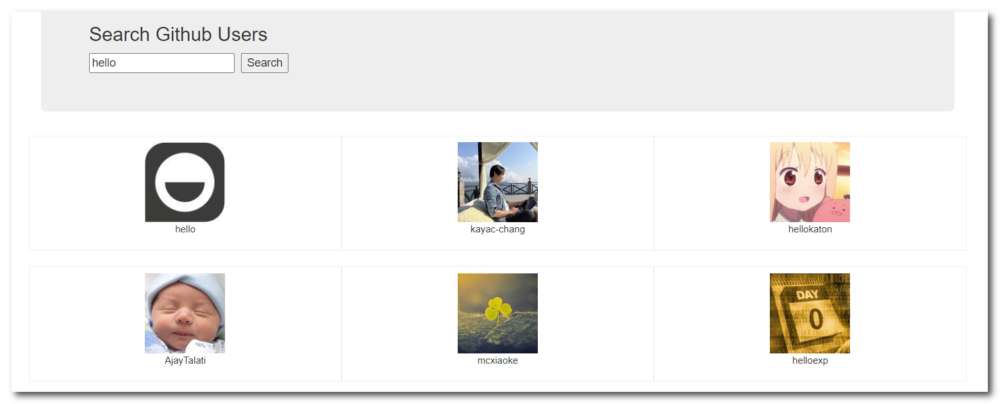

------


## 15. 插槽

**默认插槽**

*默认插槽就是没有给插槽配置名字，默认将组件标签体中的内容都插入到插槽中。*

*组件标签体中的结构被解析完才会插入到插槽中*。

App组件：

```vue
<template>
	<div class="container">
		<Category title="美食" >	<!-- 给子组件传递一个title参数 -->
			<!-- 向插槽中插入一张图片 -->
			
		</Category>

		<Category title="游戏" >
			<ul>
				<li v-for="(g,index) in games" :key="index">{{g}}</li>
			</ul>
		</Category>

		<Category title="电影">
			<!-- 插入一个视频，controls的作用是显示控制按钮 -->
			<video controls src="http://clips.vorwaerts-gmbh.de/big_buck_bunny.mp4"></video>
		</Category>
	</div>
</template>

<script>
	import Category from './components/Category'
	export default {
		name:'App',
		components:{Category},
		data() {
			return {
				foods:['火锅','烧烤','龙虾','牛排'],
				games:['王者荣耀','和平精英','穿越火线','QQ飞车'],
				films:['《钢铁侠3》','《美国队长》','《X战警 黑凤凰》','《复仇者联盟4》']
			}
		},
	}
</script>

<style scoped>
	.container{
		display: flex;	/* flex布局 */
		justify-content: space-around;
	}

	/* 向下面这种组件标签体中结构的样式写在App中和子组件中都可以
	   写在App中则是解析完标签体中的结构带着样式插入到插槽中。
	   写在子组件中，则只是带着结构插入到插槽中，最终的效果都是一样的。
	*/
	video{
		width: 100%;
	}
	img{
		width: 100%;
	}
</style>

```

Category子组件：

```vue
<template>
	<div class="category">
		<h3>{{title}}分类</h3>
		<!-- 定义一个插槽（组件标签的标签体内容会填充到插槽中） -->
		<slot>我是插槽，若组件标签体没有传递内容时，我会出现</slot>
	</div>
</template>

<script>
	export default {
		name:'Category',
		props:['title']
	}
</script>

<style scoped>
	.category{
		background-color: skyblue;
		width: 200px;
		height: 300px;
	}
	h3{
		text-align: center;
		background-color: #fab;
	}
</style>
```

效果展示：


**具名插槽**

*具名插槽就是具有名字的插槽，给<slot>标签添加name属性设置名字。*

*给需要传入到插槽的结构添加slot属性，属性值为插槽的name值。*

App组件：

```vue
<template>
	<div class="container">
		<Category title="美食" >
			<!-- 添加slot属性，插入到指定插槽中 -->
			
			<a slot="footer" href="javascript:;">更多美食</a>
		</Category>

		<Category title="游戏" >
			<ul slot="center">
				<li v-for="(g,index) in games" :key="index">{{g}}</li>
			</ul>
			<div class="foot" slot="footer">
				<a href="javascript:;">单机游戏</a>
				<a href="javascript:;">网络游戏</a>
			</div>
		</Category>

		<Category title="电影">
			<video slot="center" controls src="http://clips.vorwaerts-gmbh.de/big_buck_bunny.mp4"></video>
			<!-- 使用template标签将多个标签包裹起来插入到插槽中，可以用『v-slot:插槽名』来指定插槽 -->
			<!-- 注意『v-slot:插槽名』插槽名不需要加引号，并且该指令只能在template标签中使用 -->
			<template v-slot:footer>
				<div class="foot">
					<a href="javascript:;">经典</a>
					<a href="javascript:;">热门</a>
					<a href="javascript:;">推荐</a>
				</div>
				<h4>欢迎前来观影</h4>
			</template>
		</Category>
	</div>
</template>

<script>
	import Category from './components/Category'
	export default {
		name:'App',
		components:{Category},
		data() {
			return {
				foods:['火锅','烧烤','龙虾','牛排'],
				games:['王者荣耀','和平精英','穿越火线','QQ飞车'],
				films:['《钢铁侠3》','《美国队长》','《X战警 黑凤凰》','《复仇者联盟4》']
			}
		},
	}
</script>

<style scoped>
	.container,.foot{
		display: flex;
		justify-content: space-around;
	}
	h4{
		text-align: center;
	}
</style>

```

Category子组件：

```vue
<template>
	<div class="category">
		<h3>{{title}}分类</h3>
		<!-- 定义一个插槽，给插槽配置名字-->
		<slot name="center">我是一些默认值，当使用者没有传递具体结构时，我会出现1</slot>
		<slot name="footer">我是一些默认值，当使用者没有传递具体结构时，我会出现2</slot>
	</div>
</template>

<script>
	export default {
		name:'Category',
		props:['title']
	}
</script>

<style scoped>
	.category{
		background-color: skyblue;
		width: 200px;
		height: 300px;
	}
	h3{
		text-align: center;
		background-color: #fab;
	}
	video{
		width: 100%;
	}
	img{
		width: 100%;
	}
</style>
```

效果展示：

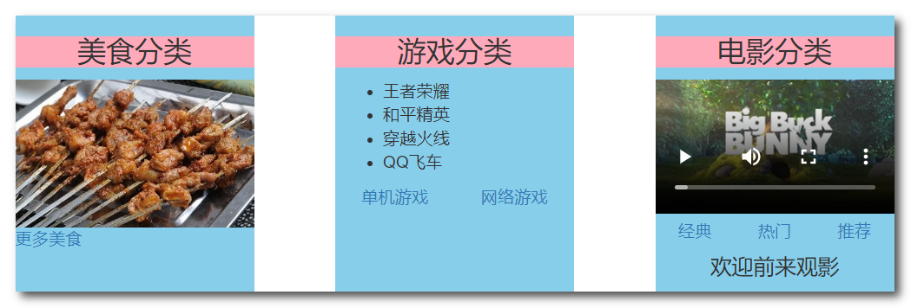


**作用域插槽**

*在<slot>标签上传递数据（之前是父组件给子组件传递props，现在是子组件的<slot>标签给插槽的使用者传递props），然后在组件标签体中给template标签添加一个scope属性接收数据，该属性的值是一个对象，获取数据时需要通过『scope对象.xxx』来获取数据(或者使用对象解构）。注意scope属性必须在template标签中使用，否则无法获取到插槽传过来的数据。*

使用场景：数据在子组件中，通过插槽转递数据给父组件，父组件拿到数据后可以将数据展示出不同的效果。

App组件：

```vue
<template>
	<div class="container">

		<Category title="游戏">
			<!-- 添加一个scope属性接收插槽传递的数据，数据存储在myData中，需要通过myData.xxx获取数据 -->
			<template scope="myData">
				<ul>
					<li v-for="(g,index) in myData.games" :key="index">{{g}}</li>
				</ul>
			</template>
		</Category>

		<Category title="游戏">
			<!-- 这里使用了对象解构方式获取数据 -->
			<template scope="{games}">
				<ol>
					<li style="color:red" v-for="(g,index) in games" :key="index">{{g}}</li>
				</ol>
			</template>
		</Category>

		<Category title="游戏">
			<template slot-scope="{games}">
				<h4 v-for="(g,index) in games" :key="index">{{g}}</h4>
			</template>
		</Category>

	</div>
</template>

<script>
	import Category from './components/Category'
	export default {
		name:'App',
		components:{Category},
	}
</script>

<style scoped>
	.container,.foot{
		display: flex;
		justify-content: space-around;
	}
	h4{
		text-align: center;
	}
</style>
```

Category子组件：

```vue
<template>
	<div class="category">
		<h3>{{title}}分类</h3>
		<!-- 给插槽的使用者传递数据 -->
		<slot :games="games" msg="hello">我是默认的一些内容</slot>
	</div>
</template>

<script>
	export default {
		name:'Category',
		props:['title'],
		data() {
			return {
				games:['王者荣耀','和平精英','穿越火线','QQ飞车'],
			}
		},
	}
</script>

<style scoped>
	.category{
		background-color: skyblue;
		width: 200px;
		height: 300px;
	}
	h3{
		text-align: center;
		background-color: #fab;
	}
	video{
		width: 100%;
	}
	img{
		width: 100%;
	}
</style>
```

效果展示：

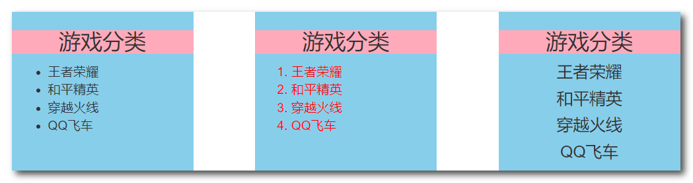

------


## 16. Vuex

概念：在Vue中实现集中式状态（数据）管理的一个Vue插件，对vue应用中多个组件的共享状态进行集中式的管理（读/写），也是一种组件间通信的方式，且适用于任意组件间通信。当多个组件需要共享数据时可以使用Vuex。

**Vuex中的两个重要方法**：`dispatch()`和`commit()`，这两个方法的第一个参数都是'操作名'，第二个参数为传递的数据。

**Vuex的工作流程**：组件实例调用`$store.dispatch()`将操作传递给`actions`对象，actions对其加工然后调用`$store.commint()`将操作传递给`mutations`对象，mutations自动调用$store.mutate()执行操作然后将结果保存在`state`对象中，state中数据发生了改变调用$store.render()重新渲染页面。

注意：上述方法和对象都store对象中的，store对象存储在vm或vc身上的$store属性中，所以需要通过$store.xxx()来调用方法。

### *Vuex环境的搭建*

**安装Vuex**：`npm i vuex@3`

> 这里需要注意Vue2版本只能使用Vuex3版本，Vue3版本次啊能使用Vuex3之后的版本。

**导入Vuex**：`import Vuex from 'vuex'`

**使用Vuex**：`Vue.use(Vuex)`

> 这里需要注意一下，使用Vuex需要在创建store对象之前，store对象需要在外部js文件创建，所以也需要导入，而使用import导入的文件都会最先执行无论写在哪个位置，所以Vuex的导入与使用不能写在main.js中，而需要写在创建store对象的文件中，然后将Vue.use(Vuex)写在new Vue.Store()之前即可。

**创建store**：`new Vue.Store(options)`

> store对象是通过Vue构造函数中的Store构造函数创建，其参数是一个配置对象。配置对象包括actions、mutations、state配置项。
>
> actions：用于响应组件中的动作
>
> mutations：用于操作state中的数据
>
> state：用于存储数据，state中的数据也是响应式的。
>
> **actions可以理解为业务逻辑层，mutations相当于数据访问层，state相当于数据库**。
>
> **actions中通过commit()调用mutations中的方法，mutations操作state中的数据。**
>
> **对于简单的操作，可以不经过actions，直接通过commit()调用mutations中的方法。**
>
> 下面为创建Store模块的代码：
>
> ```js
> // 引入Vue，调用use()时要用到
> import Vue from 'vue'
> // 引入Vuex，创建Store对象
> import Vuex from 'vuex'
> 
> // 准备actions
> const actions = {}
> // 准备mutations
> const mutations = {}
> // 准备state
> const state = {}
> 
> // 使用Vuex
> Vue.use(Vuex)
> 
> // 创建Store对象
> export default new Vuex.Store({
>     actions: actions, // 键和值同名时可以触发对象的简写形式
>     mutations,
>     state
> })
> ```

**导入store**：`import store from './store'`

> 在入口文件中导入store主模块。创建store对象的文件就是一个模块，该模块一般放在store目录中，并且该模块一般命名为index.js，样导入的时候只需导入store文件夹即可自动识别到该文件。

**配置store**：`new Vue({ store })`

> 在创建Vue实例传递的配置对象中配置store配置项。
>
> ```js
> //引入Vue
> import Vue from 'vue'
> //引入App
> import App from './App.vue'
> //引入模块
> //该模块一般放在store目录中，并且模块文件用index.js命名，这样导入的时候导入store文件夹即可自动识别到该文件
> import store from './store'
> //关闭Vue的生产提示
> Vue.config.productionTip = false
> 
> 
> //创建vm
> new Vue({
> 	el:'#app',
> 	render: h => h(App),
> 	// 配置store
> 	store: store,	// 可以使用简写形式
> 	beforeCreate() {
> 		Vue.prototype.$bus = this	// 注册全局事件总线
> 	}
> })
> ```
>
> 配置完store后，vm和vc身上就出现了$store属性，该属性就是store对象。

------


### *Vuex实现求和案例*

**store主模块（index.js）**

```js
// 引入Vue，调用use()时要用到
import Vue from 'vue'
// 引入Vuex，创建Store对象
import Vuex from 'vuex'

// 准备actions
const actions = {
    // actions中存储着一个个的方法（处理业务逻辑），方法有两个参数，第一个参数为上下文对象，第二个参数为dispatch()传递的值。
    // 上下文对象一般用context表示，该对象中拥有commit()方法、dispatch()方法、state对象等等。
    increment: function (context,value) {   // 可以使用简写形式，直接写成一个函数
        console.log(context)
        console.log('actions中的increment方法被调用了')
        // 调用commit()，通知mutations执行操作
        context.commit('INCREMENT',value)  
    },
    decrement(context, value) {
        console.log('mutations中的decrement方法被调用了')
        context.commit('DECREMENT',value)
    },

    /* 
        向上面这两个操作，没有处理任何逻辑，可以不用写在actions中，直接$store.commit()对用的操作通知mutations即可。
        actions就相当于业务逻辑层，mutations相当于数据访问层，state相当于数据库。
        actions中通过commit()调用mutations中的方法，mutations操作state中的数据。
        对于简单的操作，可以不经过actions，直接通过commit()调用mutations中的方法。
    
    */

    incrementOdd(context, value) {
        console.log('mutations中的incrementOdd方法被调用了')
        // 奇数时才增加
        if (context.state.sum % 2) {
            context.commit('INCREMENT',value)
        }
    },
    incrementWait(context, value) {
        console.log('mutations中的incrementWait方法被调用了')
        // 等待500毫秒后增加
        setTimeout(() => {
            context.commit('INCREMENT',value)
        }, 500);
    }
}
// 准备mutations
const mutations = {
    /*  mutations中也存储着一个个的方法（操作数据），方法也有两个参数，
    	第一个参数为state对象，第二个参数为dispatch()或commit()传递的数据。
   	   	一般mutations中的方法名(操作名)用大写，方便和actions对象中的方法名区分。*/
    INCREMENT(state, value) {
        console.log('mutations中的INCREMENT方法被调用了')
        state.sum += value
    },
    DECREMENT(state, value) {
        console.log('mutations中的DECREMENT方法被调用了')
        state.sum -= value
    },

}
// 准备state
const state = {
    sum:0
}

// 使用Vuex
Vue.use(Vuex)

// 创建Store对象
export default new Vuex.Store({
    actions: actions, // 键和值同名时可以触发对象的简写形式
    mutations,
    state
})
```

**求和组件Count：**

```vue
<template>
	<div>
		<h1>当前求和为：{{$store.state.sum}}</h1>
		<!-- 下拉框选择增加步长 -->
		<select v-model.number="n">
			<option value="1">1</option>
			<option value="2">2</option>
			<option value="3">3</option>
		</select>
		<button @click="increment">+</button>
		<button @click="decrement">-</button>
		<button @click="incrementOdd">当前求和为奇数再加</button>
		<button @click="incrementWait">等一等再加</button>
	</div>
</template>

<script>
	export default {
		name:'Count',
		data() {
			return {
				n:1, //步长默认为1
			}
		},
		methods: {
			increment(){
				console.log(this)
				this.$store.dispatch('increment',this.n)
			},
			/* 
				像上面这个操作没有处理逻辑，调用dispatch()通知actions，actions收到后直接就调用commit()给mutations了
				一般这种不需要逻辑处理的操作，可以直接调用commit()通知mutations操作数据。如下所示：
			*/
			decrement(){
				this.$store.commit('DECREMENT',this.n)
			},
		
			/* 
				下面两个操作需要处理逻辑，所以需要经过actions处理，所以需要调用dispatch()
				（当然完全可以将逻辑写在下面方法中，这里只是为了演示Vuex的流程，）
			*/
			incrementOdd(){
				this.$store.dispatch('incrementOdd',this.n)
			},
			incrementWait(){
				this.$store.dispatch('incrementWait',this.n)
			},
		},
	}
</script>

<style lang="css">
	button{
		margin-left: 5px;
	}
</style>

```

查看结果：

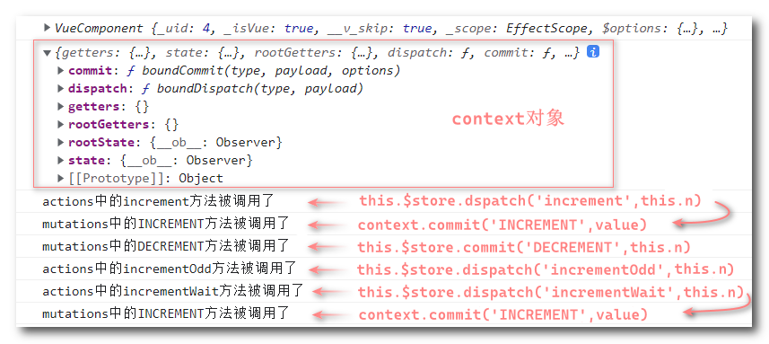

查看state对象的结构：

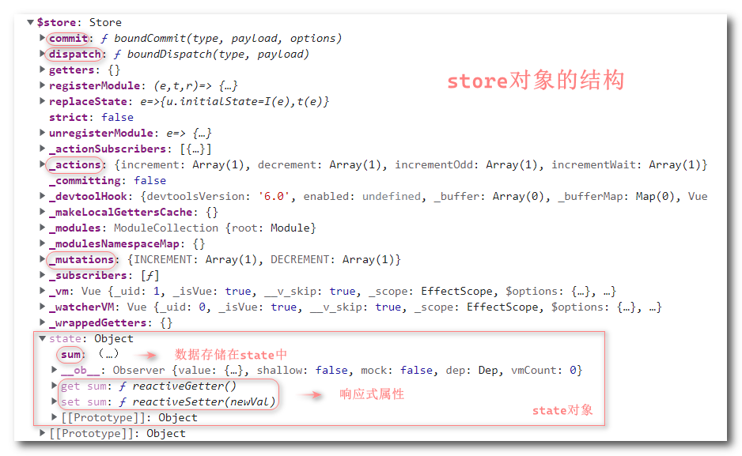

------

*下面再学习Store配置对象中一个新的配置项：**getters***

getters配置项类似于computed配置项，通过计算state中的数据得出一个新的属性，通过return返回计算属性的值。

getters配置项中计算属性方法的返回值就是计算属性的值，该方法也会收到一个参数，就是state对象。

getters配置项中计算属性方法的返回值存储在store对象中的getters属性。获取需要通过`this.$store.getters.xxx`。

*注意：配置项不等价于创建的实例中的属性，它需要经过加工（比如数据代理、数据劫持）才会成为实例中的属性*

下面在主模块中配置getters（部分代码）：

```js
// 准备getters
const getters = {
    // getters中的方法为计算属性方法，该方法会接收到一个参数为state对象
    // getters中计算属性方法的返回值存储在store对象中的getters属性。获取需要通过this.$store.getters.xxx
    bigSum(state) {
        return state.sum*10	// 扩大为十倍
    }
}

// 创建Store对象
export default new Vuex.Store({
    actions: actions, // 键和值同名时可以触发对象的简写形式
    mutations,
    state,
    getters	// 配置getters
})
```

读取getters中的计算属性：

```html
<!-- 注意插值语法中可以直接读取到vm或vc身上的属性，不需要使用this -->
<h1>当前求和为：{{$store.state.sum}}</h1>
<h1>扩大十倍后：{{$store.getters.bigSum}}</h1>
```

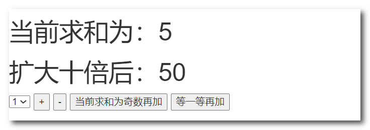

------


### Vuex的mapXxx方法

导入mapState、mapGetters、mapActions、mapMutations：

`import {mapState,mapGetters,mapActions,mapMutations} from 'vuex'`

这里只考虑这些方法中只有一个参数的情况，后续模块化的时候再考虑两个参数的情况。

#### ***mapState()方法***

**作用**：将store对象中的state配置项中的属性映射成为当前组件的计算属性。

该方法的参数可以是一个对象，也可以是一个数组。该方法返回一个对象。

**对象形式的参数**：mapState({key:'value',key2:'value2',key:'value3'})

> 对象中是一个个的键值对，键代表生成的计算属性名，值代表state中的属性名。注意值如果不是变量名一定要加引号。
>
> 使用对象形式的参数时，不能使用简写形式，即使键和值同名。因为这里的值绝大多数情况是普通的字符串需要加引号。
>
> 而对象的简写形式是键和值相同，值要是一个变量且变量名要和键名相同才能简写。

**数组形式的参数**：mapState(['name1','name2','name3'])

> 使用数组形式的参数的前提是生成的计算属性名和state对象中的属性名是同名的。比如{name1:name1}
>
> 若计算属性名和state对象中的属性名不同，则只能使用对象形式的参数。比如mapState({xuexiao:'school'})


#### ***mapGetters()方法***

**作用**：将store对象中的getters配置项中的计算属性映射成为当前组件的计算属性。

其余的和mapState的使用方式一样。


#### ***mapActions()方法***

**作用**：将actions配置项中的方法映射为当前组件的方法。

mapActions()的参数可以是一个对象也可以是一个数组。

若参数为对象，对象中的属性名为生成的方法名，属性值为actions对象中的方法名。

借助mapActions生成对应的方法，方法中会调用dispatch去联系actions对象中的方法。


#### ***mapMutations()方法***

**作用**：将mutations配置项中的方法映射为当前组件的方法。

mapMutations()的参数可以是一个对象也可以是一个数组。

若参数为对象，对象中的属性名为生成的方法名，属性值为mutations对象中的方法名。

若生成的方法名和mutations对象中的方法名同名，则可以使用更简单的数组形式的参数，只需要将该方法名作为数组的元素即可。

借助mapMutations生成对应的方法，方法中会调用commit去联系mutations对象中的方法。


**注意**：要给mapActions或mapMutations生成的方法传入参数需要在该方法调用的时候在小括号中传入参数。

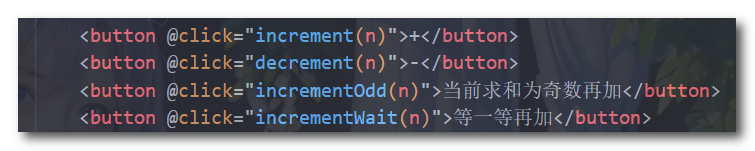

> 因为生成的方法是这样的：
> 		increment(value){
> 			this.$store.commit('InCREMENT',value)
> 		}
> 它会给方法添加一个参数，然后传递这个值给对应的对象处理，如果不在小括号中传入参数，默认参数就是事件对象。
>
> 下面为不传参的情况：
>
> 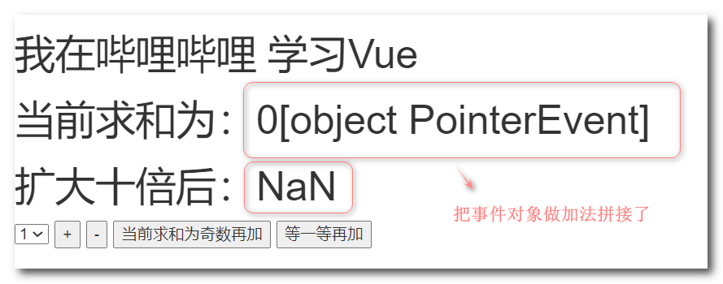


Count组件整体代码展示：

```vue
<template>
	<div>
		<!-- 下面插值语法中反复用到了$store.state，可以将该数据存储在计算属性中，减少代码冗余 -->
		<!-- <h1>我在{{$store.state.school}} 学习{{$store.state.subject}}</h1> -->
		<!-- <h1>当前求和为：{{$store.state.sum}}</h1> -->
		<!-- <h1>扩大十倍后：{{$store.getters.bigSum}}</h1> -->

		<!-- 这样就比上面简洁多了 -->
		<h1>我在{{school}} 学习{{subject}}</h1>
		<h1>当前求和为：{{sum}}</h1>
		<h1>扩大十倍后：{{bigSum}}</h1>


		<!-- 下拉框选择增加步长 -->
		<select v-model.number="n">
			<option value="1">1</option>
			<option value="2">2</option>
			<option value="3">3</option>
		</select>
		<button @click="increment(n)">+</button>
		<button @click="decrement(n)">-</button>
		<button @click="incrementOdd(n)">当前求和为奇数再加</button>
		<button @click="incrementWait(n)">等一等再加</button>
	</div>
</template>

<script>
	// 导入mapState、mapGetters、mapActions、mapMutations
	import {mapState,mapGetters,mapActions,mapMutations} from 'vuex'
	export default {
		name:'Count',
		data() {
			return {
				n:1, //步长默认为1
			}
		},
		// mapXxx()返回的是一个对象，而对象不能直接写在computed中，因此可以使用展开运算符，将对象中的属性添加到computed中。
		computed:{
			...mapState(['school','subject','sum']),	// 使用数组形式的参数
			...mapGetters({bigSum:'bigSum'})	// 使用对象形式的参数
			/* 
				展开后相当于：
				school:function(){
					return this.$store.state.school
				},
				subject(){
					return this.$store.state.subject
				},
				sum(){
					return this.$store.state.sum
				},
				bigSum(){
					return this.$store.getters.bigSum
				}

			*/
		},
        
		methods: {
		...mapMutations({increment:'INCREMENT',decrement:'DECREMENT'}),	// 名字不同，所以不能使用简写的数组形式
		...mapActions(['incrementOdd','incrementWait'])
		},

	}
</script>

<style lang="css">
	button{
		margin-left: 5px;
	}
</style>
```

------


### Vuex模块化

#### **编写组件**

Count组件

```vue
<template>
	<div>
		<h1>当前求和为：{{sum}}</h1>
		<h3>当前求和放大10倍为：{{bigSum}}</h3>
		<h3>我在{{school}}，学习{{subject}}</h3>
		<h3 style="color:red">Words组件的总语录数是：{{wordsList.length}}</h3>
		<select v-model.number="n">
			<option value="1">1</option>
			<option value="2">2</option>
			<option value="3">3</option>
		</select>
		<button @click="increment(n)">+</button>
		<button @click="decrement(n)">-</button>
		<button @click="incrementOdd(n)">当前求和为奇数再加</button>
		<button @click="incrementWait(n)">等一等再加</button>
	</div>
</template>

<script>
	import {mapState,mapGetters,mapMutations,mapActions} from 'vuex'
	export default {
		name:'Count',
		data() {
			return {
				n:1, 
			}
		},
		computed:{
			/*
				因为使用模块化后此时Store的配置对象中有很多个模块，每个模块对应一个配置对象。
				所以在使用mapXxx方法时，要在方法的第一个参数指定是哪个模块，第二个参数为该模块中对应配置项的数据。
			*/
			//借助mapState生成计算属性，从state中读取数据。
			...mapState('countAbout',['sum','school','subject']),
			...mapState('wordsAbout',['wordsList']),
			//借助mapGetters生成计算属性，从getters中读取数据。
			...mapGetters('countAbout',['bigSum'])
		},
		methods: {
			//借助mapMutations生成对应的方法，方法中会调用commit去联系mutations。
			...mapMutations('countAbout',{increment:'INCREMENT',decrement:'DECREMENT'}),
			//借助mapActions生成对应的方法，方法中会调用dispatch去联系actions。
			...mapActions('countAbout',['incrementOdd','incrementWait'])
		},
		mounted() {
			// 查看store对象的结构
			console.log(this.$store)
		},
	}
</script>

<style lang="css">
	button{
		margin-left: 5px;
	}
</style>
```

Words组件

```vue
<template>
	<div>
		<h1>语录列表</h1>
		<h3 style="color:red">Count组件求和为：{{sum}}</h3>
		<h4>第一句语录是：{{firstWords}}</h4>
		<input type="text" placeholder="请输入文字" v-model="word">
		<button @click="publish">发布</button>
		<button @click="oneWords">每日一言</button>
		<ul>
			<li v-for="words in wordsList" :key="words.id">{{words.content}}</li>
		</ul>
	</div>
</template>

<script>
	import {nanoid} from 'nanoid'
	export default {
		name:'Words',
		data() {
			return {
				word:''
			}
		},
		// 这里不使用mapXxx方法生成计算属性和方法，通过手写来说明一些注意点
		computed:{
			wordsList(){
				// 导入的模块中state配置项的数据，会成为模块对象的属性，而模块对象存储在store对象的state属性中。
				// 所以要访问模块的数据需要通过this.$store.state.模块名.xxx
				return this.$store.state.wordsAbout.wordsList
			},
			sum(){
				return this.$store.state.countAbout.sum
			},
			firstWords(){
				// 模块getters配置项的数据最终会在store对象的getters属性身上，数据是以键值对形式存储。
				// 键就是计算属性的名字，键的形式：模块名/计算属性名。
				// getters属性值就是一个对象，获取该对象上的数据可以通过属性名的方式获取：对象['属性名']。
				// 因为获取的属性名字有特殊符号'/'，所以不能通过.的方式获取。
				return this.$store.getters['wordsAbout/firstWordsName']
			}
		},
		methods: {
			// actions、mutations配置项中的方法最终也会分别存在于_actions、_mutations对象中，也是以键值对形式存储。
			// 键为方法名，需要加上模块名称前缀：模块名称/方法名；值是一个函数。
			publish(){
				const wordsObj = {id:nanoid(),content:this.word}
				this.$store.dispatch('wordsAbout/addWords',wordsObj)
				this.word = ''
			},
			oneWords(){
				this.$store.dispatch('wordsAbout/addWordsByAjax')
			}
		},
	}
</script>
```

#### **编写模块**

count.js模块

```js
//求和相关的配置
export default {
	namespaced: true,
	// 开启命名空间，这样在mapXxx()方法的第一个参数写本模块名才能被识别。比如mapState('countAbout',['school'])
	actions:{
		incrementOdd(context,value){
			console.log('actions中的incrementOdd被调用了')
			if(context.state.sum % 2){
				context.commit('INCREMENT',value)
			}
		},
		incrementWait(context,value){
			console.log('actions中的incrementWait被调用了')
			setTimeout(()=>{
				context.commit('INCREMENT',value)
			},500)
		}
	},
	mutations:{
		INCREMENT(state,value){
			console.log('mutations中的INCREMENT被调用了')
			state.sum += value
		},
		DECREMENT(state,value){
			console.log('mutations中的DECREMENT被调用了')
			state.sum -= value
		},
	},
	state:{
		sum:0, 
		school:'哔哩哔哩',
		subject:'Vue',
	},
	getters:{
		bigSum(state){
			return state.sum*10
		}
	},
}
```

words.js模块

```js
//语录相关的配置
import axios from 'axios'
import { nanoid } from 'nanoid'
export default {
	namespaced:true,
	actions:{
		addWords(context,words){
			if (words.content.length < 12) {
				// 记住在当前模块中不用添加模块前缀，它会自动加上去的
				// context.commit('wordsAbout/ADD_WORDS',words)
				context.commit('ADD_WORDS',words)
			}else{
				alert('输入字符不能超过12个')
			}
		},
		// 通过网络请求数据，就不需要在方法中接收数据了，只需要接收一个上下文参数即可
		addWordsByAjax(context) {
			// 安慰语句接口：https://v.api.aa1.cn/api/api-wenan-anwei/index.php?type=json
			// 社会语录接口：https://api.uixsj.cn/hitokoto/get?type=social
			axios.get('https://v.api.aa1.cn/api/api-wenan-anwei/index.php?type=json').then(
				response => {
					context.commit('ADD_WORDS',{id:nanoid(),content:response.data.anwei})
				},
				error => {
					alert(error.message)
				}
			)
		}
	},
	mutations:{
		ADD_WORDS(state,words){
			console.log('mutations中的ADD_WORDS被调用了')
			state.wordsList.unshift(words)
		}
	},
	state:{
		wordsList:[
			{id:'001',content:'一定要优秀，堵住那悠悠众口'}
		]
	},
	getters: {
		// 获取第一条语录的内容
		firstWordsName(state){
			return state.wordsList[0].content
		}
	},
}
```

#### **传入模块配置项**

*首先要引入创建的module*。

*创建Store对象时，传入一个modules配置项，配置项中的每一项都是一个module，一个modul对应一个Store配置对象。*

下面是主模块index.js

```js
import Vue from 'vue'
//引入Vuex
import Vuex from 'vuex'
//引入模块
import countOptions from './count'
import wordsOptions from './words'
//应用Vuex插件
Vue.use(Vuex)

//创建并暴露store对象
export default new Vuex.Store({
	// modules：模块配置项
	// 包含多个 module，一个 module 是一个 store 的配置对象，与一个组件（包含有共享数据）对应
	modules: {
		// 键指的是模块的名称，这里也可以用对象的简写形式
		countAbout:countOptions,	// 这就是一个module
		wordsAbout: wordsOptions	// 这也是一个module
		
		/* 	模块中的state配置项的数据会存在以该模块名命名的对象中，并且这些数据是响应式的(有对应的getter和setter)
			该模块对象存在store对象的state属性中。所以想要获取模块中state配置项的数据则需要this.$store.state.模块名.xxx 		 */
	
		/*  这些模块的getters配置项的数据存放store对象的getters属性中，键值对形式存在。
			键的形式：模块名称/计算属性名，比如countAbout/bigSum；值是一个函数。	*/
		
		/* 	这些模块的actions、mutations配置项的数据则存放在_actions、_mutations属性中，也是键值对形式存在。
			键的形式：模块名称/方法名，比如wordsAbout/addWords；值是一个函数。*/
	}
})
```

效果展示：

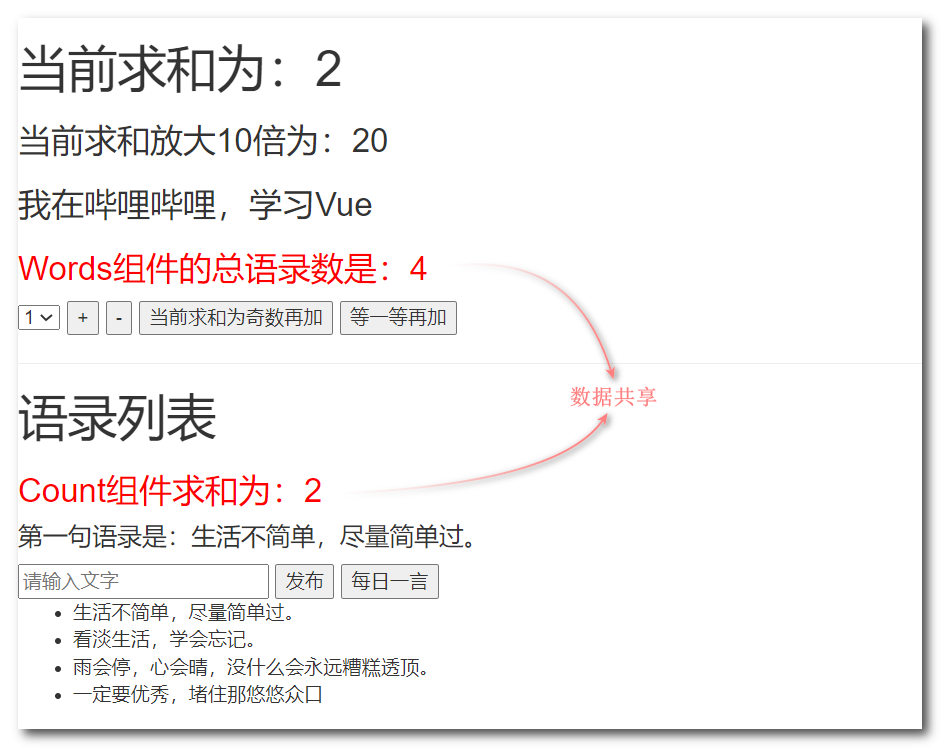

查看store对象的state属性的结构：

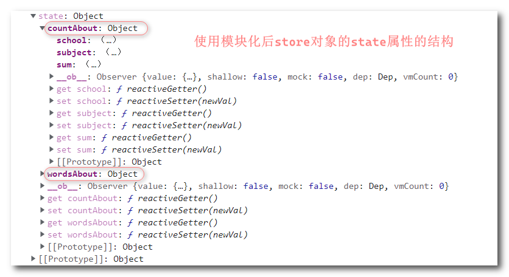

------


## 17. VueRouter

### 路由的基本使用

(1) 首先安装vue-router插件：`npm install vue-router`，需要注意vue-router3以上的版本只适合在vue3中使用。

(2) 在路由器文件（一般命名为index.js）引入插件创建路由器（需要引入路由组件）：`new VueRouter({ routes:[{}] })`

*创建路由器的文件index.js内容如下：*

```js
// 该文件专门用于创建整个应用的路由器
import VueRouter from 'vue-router'
//引入组件
import About from '../components/About'
import Home from '../components/Home'

//创建并暴露一个路由器
export default new VueRouter({
	// 路由配置项routes，值是一个数组，数组中的元素是一个个的路由配置对象
	routes: [
		// path表示请求路径，该路径会拼接在端口号后面，不要忘记写“/”
		// component表示请求路径所代表的组件
		// 这些属性名都是固定的，不能随意写
		{
			path:'/about',
			component:About	// '/about'访问About组件
            
		},
		{
			path:'/home',
			component:Home	// '/home'访问Home组件
            
		}
	]
})
```

(3) 在main.js文件引入插件并注册插件：`import VueRouter from 'vue-router'`，`Vue.use(VueRouter)`

(4) 引入路由器并配置到Vue的配置项中：`import router from './router'`，`new Vue({router})`

```js
//引入Vue
import Vue from 'vue'
//引入App
import App from './App.vue'
//引入vue-router插件
import VueRouter from 'vue-router'
//引入路由器，路由器一般放在router文件中，路由器文件一本命名为index.js（如果是index.js则引入的时候可以省略文件名）
import router from './router'
//关闭Vue的生产提示
Vue.config.productionTip = false
//注册vue-router插件
Vue.use(VueRouter)	// 注册vue-router插件，并且配置router配置项后，vm和vc身上就会出现$router属性和$route属性
// 每一个组件实例的$route属性的值都不同，但是$router属性的值是相同的。

//创建vm
new Vue({
	el:'#app',
	render: h => h(App),
	// 配置路由器（可以使用对象简写形式）
	router:router 
})
```

(5) 跳转路由组件

路由组件就是配置路由时一个path对应的一个组件。

Vue中借助**router-link标签**实现路由组件的跳转。router-link标签最终会被解析成a标签。

router-link标签中的**active-class属性**表示该标签激活后添加的类名。

router-link标签中的**to属性**表示跳转链接，相当于href。to属性的值为路由中配置的path，不要忘记写“/”。

路由组件的展示位置用**router-view标签**占位。

每次跳转组件，上一次的组件实例就会被销毁。

*App组件内容如下：*

```vue
<template>
  <div>
    <div class="row">
      <div class="col-xs-offset-2 col-xs-8">
        <div class="page-header"><h2>Vue Router Demo</h2></div>
      </div>
    </div>
    <div class="row">
      <div class="col-xs-2 col-xs-offset-2">
        <div class="list-group">
          <!-- 原始html中我们使用a标签实现页面的跳转 -->
          <!-- <a class="list-group-item active" href="./about.html">About</a> -->
          <!-- <a class="list-group-item" href="./home.html">Home</a> -->

          <!-- Vue中借助router-link标签实现路由的切换 -->
          <router-link class="list-group-item" active-class="active" to="/about">About</router-link>
          <router-link class="list-group-item" active-class="active" to="/home">Home</router-link>
        </div>
      </div>
      <div class="col-xs-6">
        <div class="panel">
          <div class="panel-body">
            <!-- 请求路径所代表的组件的呈现位置 使用router-view标签占位-->
            <router-view></router-view>
          </div>
        </div>
      </div>
    </div>
  </div>
</template>

<script>
export default {
  name: "App",
};
</script>
```


### 多级路由

路由配置对象还有一个属性叫children，该属性表示二级路由。它的值是一个数组，数组的元素又是一个个路由配置对象。

注意二级路由的path不需要加“/”，它会自动加上。二级路由组件的访问地址：〔一级路由path/二级路由path〕

**说明**：之前的组件都是写在components文件夹中，放在该文件夹中的组件表示默认组件，现在将路由组件单独放在pages文件夹中。

*下面是创建路由器的文件index.js*

```js
// 该文件专门用于创建整个应用的路由器
import VueRouter from 'vue-router'
//引入组件
import About from '../pages/About.vue'
import Home from '../pages/Home.vue'
import News from '../pages/News.vue'
import Message from '../pages/Message.vue'

//创建并暴露一个路由器
export default new VueRouter({
	// 路由配置项routes，值是一个数组，数组中的元素是一个个的路由配置对象
	routes: [
		// path表示请求路径，该路径会拼接在端口号后面，不要忘记写“/”
		// component表示请求路径所代表的组件
		// children表示二级路由，值是一个数组，可以配置多个二级路由
		// 这些属性名都是固定的，不能随意写
		{
			path:'/about',
			component: About,
		},
		{
			path:'/home',
			component: Home,
			children: [
				// 注意二级路由的path不需要加“/”，它会自动加上
				{
					path: 'news',
					component:News
				},
				{
					path: 'message',
					component:Message
				}
			]
		}
	]
})
```

下面是Home组件的内容，Home组件中包含了二级路由组件

```vue
<template>
<div>
	<h2>Home组件内容</h2>
	<div>
	<ul class="nav nav-tabs">
		<li>
        <!-- 访问二级路由的组件，访问地址：一级路由path/二级路由path -->
		<router-link class="list-group-item" active-class="active" to="/home/news">News</router-link>
		</li>
        <li>
		<router-link class="list-group-item" active-class="active" to="/home/message">Message</router-link>			</li>
	</ul>
    <router-view></router-view>
	</div>
</div>
</template>

<script>
	export default {
		name:'Home',
	}
</script>
```


### query参数

传递query参数给路由组件使用有两种方式：

​            (1) to的模板字符串写法：将参数以name=value&name=value的形式用?拼接到路径中。

​            (2) to的对象写法： 将路径和参数分被封装成对象的path属性和query属性。（参数最终也会拼接到路径上）  

*下面将Message组件的数据通过query参数传递给路由组件使用：*

```vue
<template>
	<div>
		<ul>
			<li v-for="msg in messageList" :key="msg.id">

				<!-- 跳转路由并携带query参数，to的模板字符串写法 -->
				<router-link :to="`/home/message/detail?id=${msg.id}&title=${msg.title}`">
                    {{msg.title}}
    			</router-link>

				<!-- 跳转路由并携带query参数，to的对象写法 -->
				<router-link :to="{
					path:'/home/message/detail',
					query:{
						id:msg.id,
						title:msg.title
					}
				}">
					{{msg.title}}
				</router-link>

			</li>
		</ul>
		<hr>
		<router-view></router-view>
	</div>
</template>

<script>
	export default {
		name:'Message',
		data(){
			return{
				messageList:[
					{id:'001',title:'消息001'},
					{id:'002',title:'消息002'},
					{id:'003',title:'消息003'}
				]
			}
		}
	}
</script>
```


**路由的命名**：在路由配置对象中添加name属性，配置了name，访问该路由的时候就可以用name代替path了。

只适合在to的对象形式中使用，在路由的访问地址很长时使用name会很方便。

```html
配置路由
{
	name:'hello',
	path:'hello,
	component: hello,
}

<!-- to的对象写法，name替换path -->
<router-link :to="{
	name:'detail',
	query:{}
}"></router-link>
```


通过拼接请求地址传递的参数叫query参数，**存储在$route属性中的query属性中**。

*下面接收Message组件传递的query参数：*

```vue
<template>
	<ul>
		<!-- 通过拼接请求地址传递的参数叫query参数，存储在$route属性中的query属性中 -->
		<li>消息编号：{{$route.query.id}}</li>
		<li>消息标题：{{$route.query.title}}</li>
	</ul>
</template>

<script>
	export default {
		name:'Detail',
		mounted() {
			console.log(this.$route)
		},
	}
</script>
```


$route属性的结构：

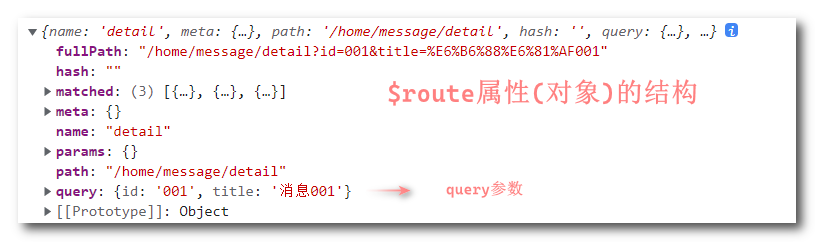


### params参数

params参数需要在路径中设置占位符，然后将参数直接写在路径中。例如/hello/参数1/参数2

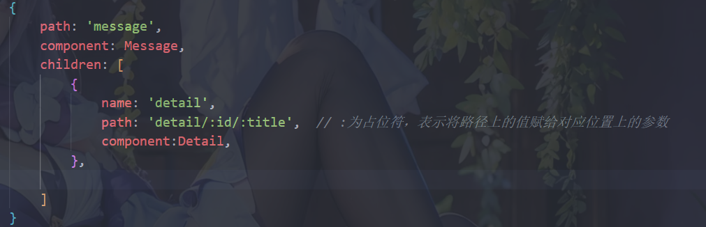

传递params参数给路由组件使用有两种方式：

​            *(1) to的模板字符串写法：将参数直接写到路径中*。

​            *(2) to的对象写法： 将路径和参数分被封装成对象的path属性和params属性（path属性可以用name属性替换）*

```vue
<template>
	<div>
		<ul>
			<li v-for="msg in messageList" :key="msg.id">

				<!-- 跳转路由并携带params参数，to的模板字符串写法 -->
				<router-link :to="`/home/message/detail/${msg.id}/${msg.title}`">{{msg.title}}</router-link>

				<!-- 跳转路由并携带params参数，to的对象写法 -->
				<router-link :to="{
					name:'detail',
					params:{
						id:msg.id,
						title:msg.title
					}
				}">
					{{msg.title}}
				</router-link>

			</li>
		</ul>
		<hr>
		<router-view></router-view>
	</div>
</template>

<script>
	export default {
		name:'Message',
		data(){
			return{
				messageList:[
					{id:'001',title:'消息001'},
					{id:'002',title:'消息002'},
					{id:'003',title:'消息003'}
				]
			}
		}
	}
</script>
```

params参数存储在$route对象的params属性中

*下面在路由组件中获取params参数：*

```vue
<template>
	<ul>
		<!-- params参数存储在$route属性的params属性中 -->
		<li>消息编号：{{$route.params.id}}</li>
		<li>消息标题：{{$route.params.title}}</li>
	</ul>
</template>

<script>
	export default {
		name:'Detail'
	}
</script>
```

------


### propsp参数

在路由配置对象中配置props，可以将参数转换成props形式的参数，这样接收的时候就可以用props配置项接收。

配置props的三种方式：

- 值为对象：该对象中的所有key-value都会以props的形式传给路由组件。
- 值为布尔值：若布尔值为真，就会把该路由组件收到的所有params参数，以props的形式传递。
- 值为函数：函数的形参接收到的是$route对象，可以将任何参数以props形式传递。

```js
{
		name: 'detail',	
		path: 'detail',	
		component: Detail,
		// props的第一种写法，值为对象，该对象中的所有key-value都会以props的形式传给Detail组件。
		// props:{a:1,b:'hello'}

		// props的第二种写法，值为布尔值，若布尔值为真，就会把该路由组件收到的所有params参数，以props的形式传给Detail组件。
		// props:true

		//props的第三种写法，值为函数，函数的形参接收到的是$route对象
		props($route){	
			return {
				// 可以获取query参数以props的形式传递
				id:$route.query.id,
				title: $route.query.title,
				// 可以传自定义参数
				a:1,
				b:'hello'
			}
		}
}
```

接收参数：

```vue
// 配置props后，传递query参数可以用props配置项接收。
<router-link :to="`/home/message/detail/${msg.id}/${msg.title}`">{{msg.title}}</router-link>
// 接收props参数
props:['id','title','a','b']
```


### push和replace属性

作用：控制路由跳转时操作浏览器历史记录的模式。

浏览器的历史记录有两种写入方式：分别为```push```和```replace```，`push`是追加历史记录，`replace`是替换当前记录。

push方式跳转路由，会留下历史记录，可以点击浏览器的左上角的箭头回退到上一个路由组件 

replacef方式跳转路由，不会留下历史记录，不可以回退到『上一个』路由组件。路由跳转默认是push方式写入历史记录。

如何开启replace方式：给router-link标签添加replace属性:`<router-link replace></router-link>`


### 编程式路由导航

之前通过router-link标签实现路由跳转，下面通过push()和replace()方法实现路由跳转。

编程式路由导航式通过push()或replace()方法实现的，这两个方法在$router对象中。参数是一个对象，和to的对象写法中的对象一样。

push方法就是push方式，replace方法就是replace方式。

*主要代码展示*

```vue
<button @click="pushShow(msg)">push查看</button>
<button @click="replaceShow(msg)">replace查看</button>

<script>
methods: {
			// 编程式路由导航
			pushShow(msg){
				this.$router.push({
					name:'detail',
					query:{
						id:msg.id,
						title:msg.title
					}
				})
			},
			replaceShow(msg){
				this.$router.replace({
					name:'detail',
					query:{
						id:msg.id,
						title:msg.title
					}
				})
			}
		}
</script>
```

路由器对象$router还有三个路由跳转的方法：

- *back()：后退*

- *forward(): 前进*
- *go(): 前进或后退指定次数*

```html
<button @click="$router.back()">后退</button>
<button @click="$router.forward()">前进</button>
<!-- go()的参数为正数表示前进对应的次数，为负数表示后退对应的次数 
  若前进或后退的次数与记录数不符合，则不执行任何操作-->
<button @click="$router.go(-3)">后退3次</button>
<button @click="$router.go(3)">前进3次</button>
```


### 缓存路由组件

前面了解过切换路由后被切换的路由组件就被销毁了，假如一个路由组件中填写了表单数据，但是切换路由后该组件就被销毁了，重新切换回来表单数据也不见了，那么怎么才能让被切换的路由组件不被销毁？

*将router-view标签用keep-alive标签包裹起来，该标签有一个include属性，值为组件名。该属性用来指定路由组件不被销毁。*

*若不使用include属性，表示该router-view中出现过的所有路由组件都不会被销毁，而是将他们缓存下来了。*

*一般不需要全部缓存下来，而是将include使用数据绑定将值写成数组形式指定不需要被销毁的路由组件。* 

```html
<!-- 跳转路由后News组件都不会被销毁 -->
<keep-alive include="News"><router-view></router-view></keep-alive>
<!-- 路由跳转后New、Message组件都不会被销毁 -->
<keep-alive :include="['News','Message']"><router-view></router-view></keep-alive>
```


### activated()和deactivated()

keep-alive可以让路由组件不被销毁，但是如果路由组件中设有定时器，即使路由被切换了，定时器也依旧在运行。这会占用系统资源。那么该如何解决该问题？将定时器放在activated()中，组件激活时才正常运行。

这里介绍两个新的生命周期钩子：

- activated()：组件激活时被调用

- deactivated()：组件失活时被调用

```js
// 组件激活时被调用
activated() {
	console.log('News组件被激活了')
	this.timer = setInterval(() => {},1000)	// 定时器返回的是该定时器的唯一标识
},
// 组件是失活时被调用
deactivated() {
	console.log('News组件失活了')
	clearInterval(this.timer)// 清除定时器，参数为定时器的唯一标识
}
```


### 路由守卫

#### 全局路由守卫

设置全局前置路由守卫：`router.beforeEach(to,from,next)`，router为路由器对象。

> 该方法在初始化时被调用、每次切换路由之前被调用。
>
> 该方法有三个参数，第一个参数表示要跳转的路由，第二个参数表示从哪个路由跳转，第三个参数为放行函数。

设置全局后置路由守卫：`router.afterEach(to,from)`

> 该方法在初始化时被调用、每次路由切换之后被调用。
>
> 该方法有三个参数，第一个参数表示要跳转的路由，第二个参数表示从哪个路由跳转。

全局路由守卫的共能类似于Web中的拦截器。

*下面为路由器设置全局路由守卫：*

```js
// 该文件专门用于创建整个应用的路由器
import VueRouter from 'vue-router'
//引入组件
import About from '../pages/About.vue'
import Home from '../pages/Home.vue'
import News from '../pages/News.vue'
import Message from '../pages/Message.vue'
import Detail from '../pages/Detail.vue'

// 创建一个路由器
// 这里需要设置全局路由守卫所以定义一个变量接收路由器，设置完了再暴露出去
const router =  new VueRouter({
	// 路由配置项routes，值是一个数组，数组中的元素是一个个的路由配置对象
	routes: [
		{
			name:'about',
			path:'/about',
			component: About,
			// meta配置项，它的值是一个对象，我们自定义的一些属性就放在该配置项里面，比如权是否需要鉴权
			meta:{title:'关于'}
			
		},
		{
			name:'home',
			path:'/home',
			component: Home,
			children: [
				{
					name:'news',
					path: 'news',
					component: News,
					meta:{isAuth:true,title:'新闻'}	// 自定义一个isAuth属性，表示是否需要鉴权
				},
				{
					name:'message',
					path: 'message',
					component: Message,
					children: [
						{
							name: 'detail',	
							path: 'detail',	
							component: Detail,
							meta:{isAuth:true,title:'详情'},
							props($route){
								return {
									// 可以获取query参数以props的形式传递
									id:$route.query.id,
									title: $route.query.title,
									// 可以传自定义参数
									a:1,
									b:'hello'
								}
							}
						},
						
					]
				}
			]
		}
	]
})

// 设置全局路由守卫
router.beforeEach((to, from, next) => {
	console.log('前置路由守卫',to,from)
	if (to.meta.isAuth) { //读取meta中的isAuth判断是否需要鉴权
		// 这里从浏览器本地存储中获取数据，若获取到数据不符合要求则无权查看
		if(localStorage.getItem('name')==='hello'){
			next()	// next()表示放行，可以查看
		}else{
			alert('数据错误，无权限查看！')
		}
	}else{
		next()
	}
})

router.afterEach((to,from)=>{
	console.log('后置路由守卫',to,from)
	document.title = to.meta.title || '学习Vue'	// 将meta中自定义的title设置为页面的标题，若没有则默认“学习Vue”
})


// 暴露路由器
export default router
```

效果展示：

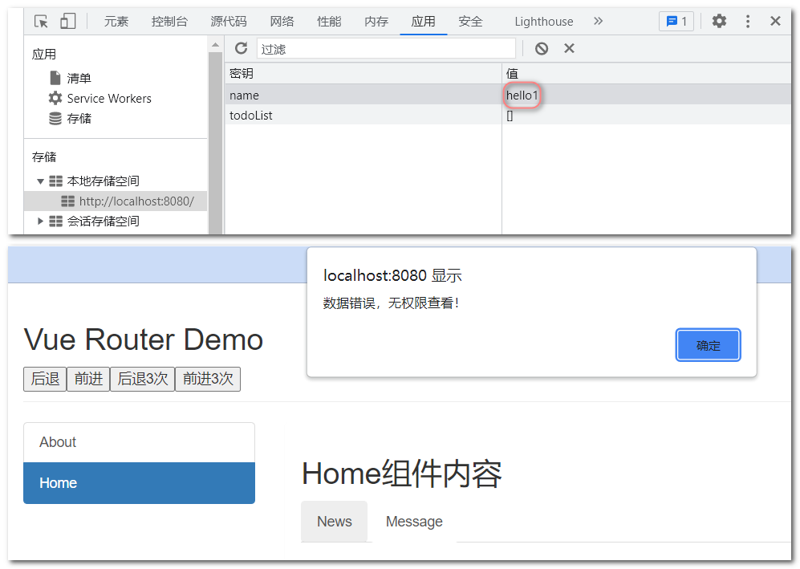


#### 独享路由守卫

独享路由守卫就是给指定的路由设置路由守卫。

设置独享路由守卫：`beforeEnter(to,from,next)`，三个参数和全局路由守卫参数一样。

> 该方法在切换到该路由之前被调用。
>
> 独享路由守卫没有afterEnter()方法，切换路由之后需要执行逻辑直接使用afterEach()即可。

*下面给news路由设置独享路由守卫：*

```js
{
	name:'news',
	path: 'news',
	component: News,
	meta: { isAuth: true, title: '新闻' },	// 自定义一个isAuth属性，表示是否需要鉴权
	// 设置独享路由守卫：beforeEnter() ，三个参数和beforeEach()参数一样
	beforeEnter: (to, from, next) => {
		console.log('独享路由守卫',to,from)
		if(to.meta.isAuth){ //判断是否需要鉴权
            // 这里从浏览器本地存储中获取数据，若获取到数据不符合要求则无权查看
			if(localStorage.getItem('name')==='hello'){
				next()
			}else{
				alert('数据错误，无权限查看！')
			}
		}else{
			next()
		}
	}
}
```


#### 组件内路由守卫

设置进入守卫：`beforeRouteEnter(to,from,next)`，进入该组件时被调用

设置离开守卫：`afterRouteLeave(to,from,next)`，离开该组件时被调用

这两个方法的参数都和beforeEach()方法的参数一致。

*下面给About组件设置组件内路由守护：*

```vue
<script>
	export default {
		name:'About',
		//通过路由规则，进入该组件时被调用
		beforeRouteEnter (to, from, next) {
			console.log('About--beforeRouteEnter',to,from)
			if(to.meta.isAuth){ //判断是否需要鉴权
				if(localStorage.getItem('name')==='hello'){
					next()
				}else{
					alert('数据错误，无权限查看！')
				}
			}else{
				next()
			}
		},

		//通过路由规则，离开该组件时被调用
		beforeRouteLeave (to, from, next) {	// 即使参数没使用也要写出来，可以使用_占位：beforeRouteLeave(_,_,next)
			console.log('About--beforeRouteLeave')
			next()
		}
	}
</script>
```


### 路由器的两种工作模式

1. 对于一个url来说，什么是hash值？地址中"#"及其后面的内容就是hash值。
2. hash值不会包含在 HTTP 请求中，即：hash值不会带给服务器。
3. hash模式：
   1. 地址中永远带着#号，不美观 。
   2. 若以后将地址通过第三方手机app分享，若app校验严格，则地址会被标记为不合法。
   3. 兼容性较好。
4. history模式：
   1. 地址干净，美观 。
   2. 兼容性和hash模式相比略差。
   3. 应用部署上线时需要后端人员支持，解决刷新页面服务端404的问题。

路由器默认使用的hash模式，因此地址栏中的路径带有"#"这个符号。

如何开启history模式：在路由器的配置对象中添加mode配置项： `mode:'history'`

------


## 18. element-ui组件库

安装element-ui组件库：`npm i element-ui`

**完整引入**：

```js
// 完整引入ElementUI组件库
import ElementUI from 'element-ui';
// 引入ElementUI全部样式
import 'element-ui/lib/theme-chalk/index.css';
// 应用ElementUI组件库
Vue.use(ElementUI);
```

当然也可以在页面上引入 js 和 css 文件即可开始使用：

```html
<!-- 引入样式 -->
<link rel="stylesheet" href="https://unpkg.com/element-ui/lib/theme-chalk/index.css">
<!-- 引入组件库 -->
<script src="https://unpkg.com/element-ui/lib/index.js"></script>
```

**按需引入**：

借助 [babel-plugin-component](https://github.com/QingWei-Li/babel-plugin-component)，可以只引入需要的组件，以达到减小项目体积的目的。

首先安装babel-plugin-component：` npm install babel-plugin-component -D`

修改babel.config.js文件

```js
module.exports = {
  presets: [
    '@vue/cli-plugin-babel/preset',
    ["@babel/preset-env", { "modules": false }]
  ],
  // 配置babel-plugin-component（用于按需引入）
  plugins: [
    [
      "component",
      {
        "libraryName": "element-ui",
        "styleLibraryName": "theme-chalk"
      }
    ]
  ]
}
```

按需引入组件：

```js
// 按需引入组件		---按需引入不需要引入样式，插件会根据引入的组件自动引入组件使用的样式
import { Button,Row,DatePicker } from 'element-ui';
// 全局注册引入的组件		---这里可以将给组件自定义名字，比如Vue.component('hello',Button)
Vue.component('element-row', Row);
Vue.component('element-button', Button);
Vue.component('element-date-picker', DatePicker);
```

下面使用element组件：

```vue
<template>
  <div>
		<button>原生的按钮</button>
		<input type="text">
		<element-row>
			<element-button>默认按钮</element-button>
			<element-button type="primary">主要按钮</element-button>
			<element-button type="success">成功按钮</element-button>
			<element-button type="info">信息按钮</element-button>
			<element-button type="warning">警告按钮</element-button>
			<element-button type="danger">危险按钮</element-button>
		</element-row>
		<element-date-picker type="date" placeholder="选择日期"></element-date-picker>
		<element-row>
			<element-button icon="el-icon-search" circle></element-button>
			<element-button type="primary" icon="el-icon-s-check" circle></element-button>
			<element-button type="success" icon="el-icon-check" circle></element-button>
			<element-button type="info" icon="el-icon-message" circle></element-button>
			<element-button type="warning" icon="el-icon-star-off" circle></element-button>
			<element-button type="danger" icon="el-icon-delete" circle></element-button>
		</element-row>
  </div>
</template>

<script>
	export default {
		name:'App',
	}
</script>
```

element-button标签中的一些属性：

|   属性    |     说明     |  类型   |                       可选值                       | 默认值 |
| :-------: | :----------: | :-----: | :------------------------------------------------: | :----: |
|   type    |     类型     | string  | primary / success / warning / danger / info / text |   -    |
|   icon    |   图标类名   | string  |                         -                          |   -    |
| disabled  | 是否禁用状态 | boolean |                     true/false                     | false  |
|   round   | 是否圆角按钮 | boolean |                     true/false                     | false  |
|  circle   | 是否圆形按钮 | boolean |                     true/false                     | false  |
| autofocus | 是否默认聚焦 | boolean |                     true/false                     | false  |

布尔值为真的属性直接写属性名即可。

更多组件的使用请查看Element UI官网：https://element.eleme.cn

