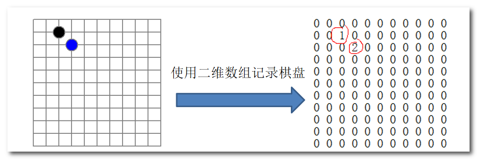
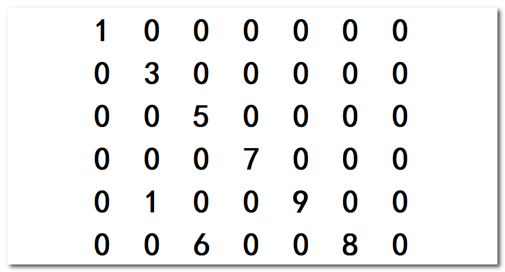
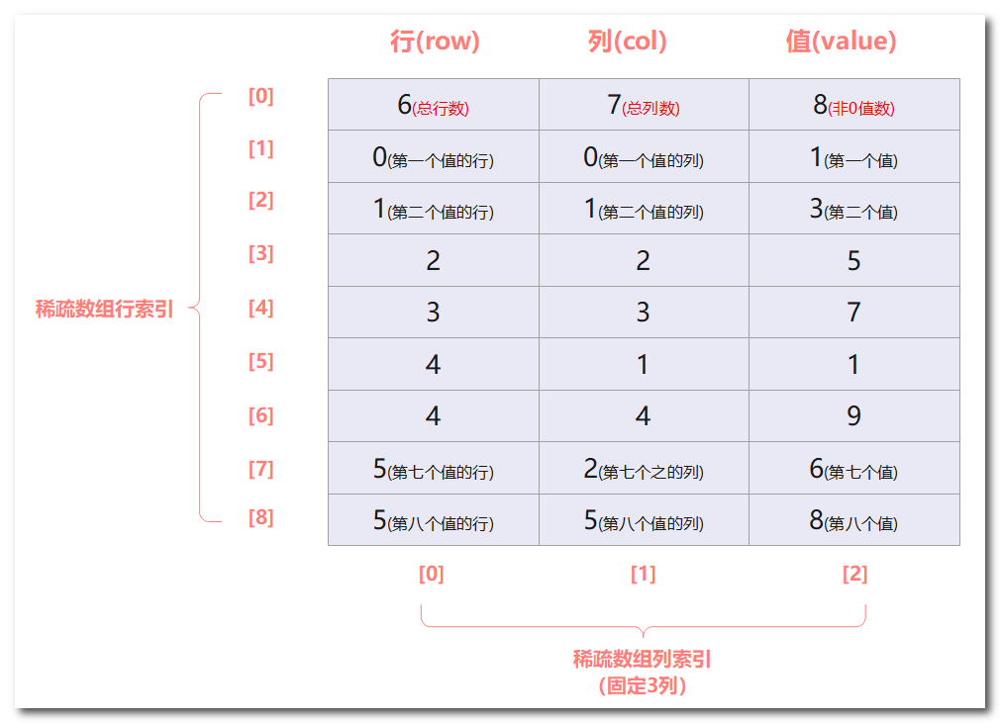

## 数据结构之数组

数组(Array)是一种常见的线性数据结构，它是一组具有相同数据类型的元素的集合，这些元素按照一定的顺序排列，并且可以通过一个固定的索引值来访问。

数组是由若干个相同类型的元素组成，这些元素在内存中是连续存储的。数组通常具有固定的长度，一旦定义了数组的长度，就不能再改变它的长度。数组的索引从0开始，可以通过数组的索引值来访问数组中的元素。在访问数组元素时，可以使用下标操作符"[]"来访问数组元素，例如，array[0]表示访问数组array中的第一个元素。


### 稀疏数组

▼下面由棋盘保存问题引出稀疏数组：



观察该棋盘发现只有两个子，因此使用二维数组保存会有很多默认值0，记录了很多没有意义的数据。使用稀疏数组可以解决该问题。


▼下面介绍一下稀疏数组：

**稀疏数组**(Sparse Array)是一种特殊的数组，它通常用于表示大部分元素为0的二维数组，以节省内存空间。

稀疏数组是由三个元素构成的三元组：**行、列、值**，其中行和列表示数组中非0元素的位置，值表示该位置上的元素的值。

稀疏数组通常用于解决以下问题：

1. 对于大部分元素为0的矩阵，如何有效地存储这些元素？
2. 如何在节省内存空间的同时，方便地对稀疏矩阵进行操作？

稀疏数组的存储方式如下：

1. **第一行存储原始数组的行数、列数和非0元素个数**。
2. **从第二行开始，每一行存储一个非0元素的行数、列数和值**。


▼下面定义一个二维数组：



将该二维数组转化成稀疏数组：



稀疏数组的第一行存储了二维数组行数、列数、值(不为0)的个数信息。后面的行存储每个值及对应行列的索引。


▼下面使用java代码实现二维数组转稀疏数组以及稀疏数组转二维数组

```Java
public class SparseArray {
    public static void main(String[] args) {
        // 创建一原始个二维数组6*7
        int chessArr[][] = new int[6][7];
        // 初始化数组
        chessArr[0][0] = 1;
        chessArr[1][1] = 3;
        chessArr[2][2] = 5;
        chessArr[3][3] = 7;
        chessArr[4][1] = 1;
        chessArr[4][4] = 9;
        chessArr[5][2] = 6;
        chessArr[5][5] = 8;
        // 输出原始的二维数组
        System.out.println("原始的二维数组：");
        for (int[] row : chessArr) {
            for (int data : row) {
                System.out.printf("%d\t", data);// 格式化输出
            }
            System.out.println();// 换行
        }


        /**
         * 将二维数组转稀疏数组
         */
        // 1. 先遍历二维数组得到非0数据的个数
        int n = 0;
        for (int[] row : chessArr) {
            for (int data : row) {
                if (data != 0) {
                    n++;
                }
            }
        }
        // 2. 创建对应的稀疏数组
        int[][] sparseArr = new int[n+1][3];
        // 给稀疏数组第一行元素赋值
        sparseArr[0][0] = 6;
        sparseArr[0][1] = 7;
        sparseArr[0][2] = n;
        // 3. 遍历原始数组将非0数存储到sparseArr中
        int count = 0;//记录第几个非0数据
        for (int i = 0; i < 6; i++) {
            for (int j = 0; j < 7; j++) {
                if(chessArr[i][j]!=0){
                    count++;
                    sparseArr[count][0] = i;    // 第几个数据对应稀疏数组中的行索引就是几
                    sparseArr[count][1] = j;
                    sparseArr[count][2] = chessArr[i][j];

                }
            }
        }
        System.out.println();
        // 4. 输出稀疏数组
        System.out.println("得到的稀疏数组：");
        for (int i = 0; i < sparseArr.length; i++) {
            System.out.printf("%d\t%d\t%d\t\n", sparseArr[i][0], sparseArr[i][1], sparseArr[i][2]);
        }
        System.out.println();


        /**
         * 将稀疏数组转换成二维数组
         */
        // 1. 先读取稀疏数组的第一行，根据第一行的数据，创建原始的二维数组
        int[][] chessArr2 = new int[sparseArr[0][0]][sparseArr[0][1]];
        // 2. 读取第二行开始的数据，赋给创建的二维数组
        for(int i = 1;i<sparseArr.length;i++){
            chessArr2[sparseArr[i][0]][sparseArr[i][1]] = sparseArr[i][2];
        }
        // 3. 输出由稀疏数组得到的二维数组
        System.out.println("稀疏数组转二维数组：");
        for (int i = 0 ;i<chessArr2.length;i++){
            for (int j = 0;j<chessArr2[i].length;j++){
                System.out.printf("%d\t",chessArr2[i][j]);
            }
            System.out.println();
        }
    }
}

```

查看结果：

