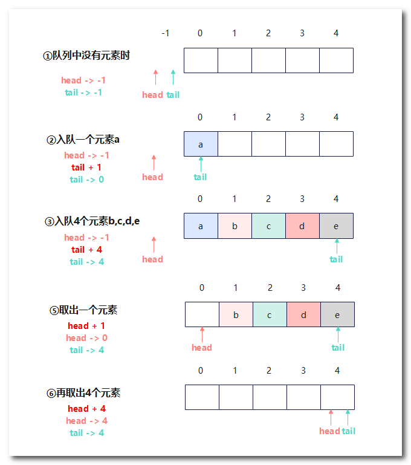
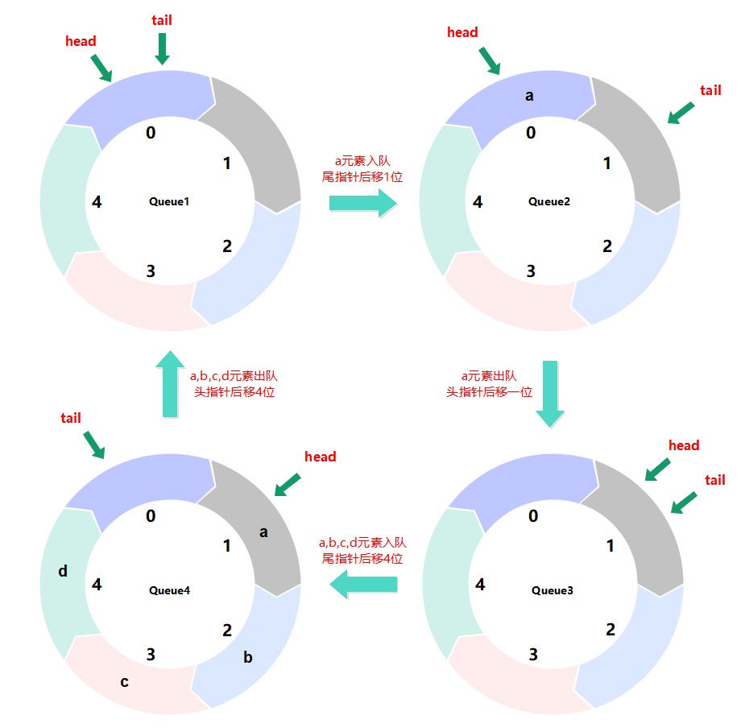
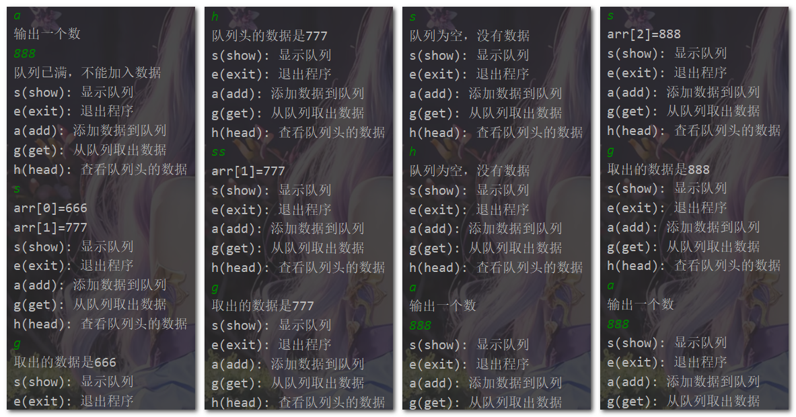

## 数据结构之队列

队列（Queue）是一种数据结构，它是一种特殊的线性表，**只能在队尾插入元素，在队头删除元素，满足先进先出的原则**。

队列中允许的操作包括：入队（enqueue），出队（dequeue），查看队头元素（peek），查看队列大小（size）等。

队列的实现可以**采用数组或链表**等数据结构。在使用数组实现队列时，可以使用两个指针分别指向队列的头部和尾部。**入队操作时，向尾部指针所指向的位置插入元素；出队操作时，从头部指针所指向的位置删除元素**。

由于数组的长度是固定的，因此在实现队列时，需要采用循环数组的方式来避免队列满时无法入队的情况。

链表实现的队列可以采用单链表或双向链表等形式。入队操作时，向链表尾部添加新节点；出队操作时，删除链表头部的节点。由于链表的长度可以动态变化，因此链表实现的队列可以支持更大的队列容量。


### 数组模拟队列

▼下面使用数组模拟队列



使用数组实现队列，定义一个**容量(长度)maxSize=5**的数组，定义两个指针指向-1(表示没有指向任何元素)。

当入队一个元素时tail+1，尾指针指向入队元素的位置。

当出队一个元素时head+1，头指针指向出队元素的位置，此时将该位置上的元素出队。

当`tail=maxSize-1`时，表明队列已满。

当`tail=head`时，表明队列为空。

▼下面使用java代码实现数组模拟队列

```Java
public class ArrayQueueTest {
    public static void main(String[] args) {
        // 创建一个队列
        ArrayQueue queue = new ArrayQueue(3);
        char key = ' '; // 接收用户输入
        Scanner scanner = new Scanner(System.in);
        boolean loop = true;
        while (loop) {
            System.out.println("s(show): 显示队列");
            System.out.println("e(exit): 退出程序");
            System.out.println("a(add): 添加数据到队列");
            System.out.println("g(get): 从队列取出数据");
            System.out.println("h(head): 查看队列头的数据");
            key = scanner.next().charAt(0);//接收一个字符
            switch (key) {
                case 's':
                    queue.showQueue();
                    break;
                case 'a':   // 入队列
                    System.out.println("输出一个数");
                    int value = scanner.nextInt();
                    queue.enqueue(value);
                    break;
                case 'g':    //出队列
                    try {
                        int res = queue.dequeue();
                        System.out.printf("取出的数据是%d\n", res);
                    } catch (Exception e) {
                        System.out.println(e.getMessage());
                    }
                    break;
                case 'h':   //查看队列头数据
                    try {
                        int res = queue.getHead();
                        System.out.printf("队列头的数据是%d\n", res);
                    } catch (Exception e) {
                        System.out.println(e.getMessage());
                    }
                    break;
                case 'e':   //退出
                    scanner.close();
                    loop = false;
                    break;
                default:
                    break;
            }
        }

    }
}

// 定义一个类来表示队列
class ArrayQueue {
    private int maxSize; // 表示数组的最大容量
    private int head; // 队列头
    private int tail; // 队列尾
    private int[] arr; // 数组模拟队列

    // 创建队列构造器
    public ArrayQueue(int maxSize) {
        this.maxSize = maxSize;
        this.arr = new int[maxSize];
        this.head = -1;
        this.tail = -1;
    }

    // 判断队列是否已满
    public boolean isFull() {
        return tail == maxSize-1;   // 尾指针指向数组长度减1表示队列已满
    }

    // 判断队列是否为空
    public boolean isEmpty() {
        return head == tail;
    }

    // 添加数据到队列
    public void enqueue(int n) {
        // 判断队列是否满了
        if (isFull()) {
            System.out.println("队列已满，不能加入数据");
            return;
        }
        tail++;
        arr[tail] = n;
    }

    // 获取队列数据（出队列,这里并没有删除取出的元素，只是将头指针往后移了）
    public int dequeue() {
        // 判断队列是否为空
        if (isEmpty()) {
            // 抛出异常
            throw new RuntimeException("队列为空，不能取数据");
        }
        return arr[++head];
    }

    // 显示队列所有数据
    public void showQueue() {
        // 遍历
        if (isEmpty()) {
            System.out.println("队列为空，没有数据");
            return;
        }
        for (int i = 0; i < arr.length; i++) {
            System.out.printf("arr[%d]=%d\n", i, arr[i]);
        }
    }

    // 打印队列的头数据
    public int getHead() {
        if (isEmpty()) {
            throw new RuntimeException("队列为空，没有数据");
        }
        return arr[head+1];
    }

}

```


### 循环数组队列

▼下面使用数组模拟环形队列



这里定义一个**长度为5**的数组模拟环形队列，下面用**`maxSize`**表示该长度。

在Queue1状态时，此时没有存入元素，头指针和尾指针指向索引0位置。

在尾指针指向位入队一个元素，然后尾指针后移一位，此时队列变成Queue2状态。

在头指针指向位置出队一个元素，然后头指针后移一位，此时队列中没有元素，头指针和尾指针又指向同一位置。

此时得出一个结论：**`head=tail`**时，**队列为空**。

在Queue3状态时，依次入队4个元素，尾指针后移4位， 此时队列中有四个元素，队列变成Queue4状态。

在Queue4状态时，尾指针指向队列最后一个元素的后一位，此时超出了数组范围，因此需要进行**取模：⟨tail%数组长度⟩**，将其重新指向索引0位置，实现环形队列。如果此时再入队一个元素，那么问题来了，此时头指针和尾指针又指向同一位置，此时我们知道队列是满的，但是逻辑层面无法判断队列是空还是满。

因此规定队列对多能存入**`maxSize-1`**个元素，规定尾指针当前指向的位置永远为空(这个位置是变化的)。

所以得出一个结论就是满足**`(tail+1)%maxSize= head`**，**此时队列已满**。

因此Queue4状态为队列满状态，不能再入队元素。正常来说队列中有效元素个数为：tail-head，但是在Queue4状态下，tail指向的索引比head小，要求他们之间得个数需要取模，但是(tail-head)%length=-4得到的是一个负数，因此一般先加上模再取模。

所以得出一个结论就是队列中元素个数为：**`(tail+maxSize-head)%maxSize`**。

▼下面是用java代码实现数组模拟环形队列

```java
public class CircularQueue {
    public static void main(String[] args) {
        // 创建一个队列
        MyCircularQueue queue = new MyCircularQueue(3);
        char key = ' '; // 接收用户输入
        Scanner scanner = new Scanner(System.in);
        boolean loop = true;
        while (loop) {
            System.out.println("s(show): 显示队列");
            System.out.println("e(exit): 退出程序");
            System.out.println("a(add): 添加数据到队列");
            System.out.println("g(get): 从队列取出数据");
            System.out.println("h(head): 查看队列头的数据");
            key = scanner.next().charAt(0);//接收一个字符
            switch (key) {
                case 's':
                    queue.showQueue();
                    break;
                case 'a':   // 入队列
                    System.out.println("输出一个数");
                    int value = scanner.nextInt();
                    queue.enqueue(value);
                    break;
                case 'g':    //出队列
                    try {
                        int res = queue.dequeue();
                        System.out.printf("取出的数据是%d\n", res);
                    } catch (Exception e) {
                        System.out.println(e.getMessage());
                    }
                    break;
                case 'h':   //查看队列头数据
                    try {
                        int res = queue.getHead();
                        System.out.printf("队列头的数据是%d\n", res);
                    } catch (Exception e) {
                        System.out.println(e.getMessage());
                    }
                    break;
                case 'e':   //退出
                    scanner.close();
                    loop = false;
                    break;
                default:
                    break;
            }
        }

    }
}

// 使用数组模拟队列
class MyCircularQueue {
    private int maxSize; // 表示数组的最大容量
    private int head = 0; // 队列头
    private int tail = 0; // 队列尾
    private int[] arr; // 数组模拟队列

    // 创建队列构造器
    public MyCircularQueue(int maxSize) {
        this.maxSize = maxSize;
        this.arr = new int[maxSize];
    }

    // 判断队列是否已满
    public boolean isFull() {
        return (tail + 1) % maxSize == head;   // tail+1然后取模，等于head表示队列已满（这是一个约定：队列最大容量为数组容量减1）
    }

    // 判断队列是否为空
    public boolean isEmpty() {
        return head == tail;    // 头指针和尾指针指向同一位置为空。
    }

    // 添加数据到队列
    public void enqueue(int n) {
        // 判断队列是否满了
        if (isFull()) {
            System.out.println("队列已满，不能加入数据");
            return;
        }
        // 将元素添加在尾指针指向位置，然后尾指针后移一位。
        arr[tail] = n;
        // 尾指针后移，需要考虑取模
        tail = (tail + 1) % maxSize;
    }

    // 获取队列数据（出队列，这里并没有删除取出的元素，只是将头指针往后移了）
    public int dequeue() {
        // 判断队列是否为空
        if (isEmpty()) {
            // 抛出异常
            throw new RuntimeException("队列为空，不能取数据");
        }
        int value = arr[head]; // 将头指针指向的位置的值取出，然后头指针后移一位
        head = (head + 1) % maxSize;
        return value;
    }

    // 显示队列所有数据
    public void showQueue() {
        // 遍历
        if (isEmpty()) {
            System.out.println("队列为空，没有数据");
            return;
        }
        // 从头部开始，i小于(head+队列元素的个数)
        for (int i = head; i < head + size(); i++) {
          System.out.printf("arr[%d]=%d\n", i % maxSize, arr[i % maxSize]); // i也有可能超出数组边界，所以需要取模
        }
    }

    // 获取队列中有效元素的个数
    public int size() {
        return (tail + maxSize - head) % maxSize;
    }

    // 打印队列的头数据
    public int getHead() {
        if (isEmpty()) {
            throw new RuntimeException("队列为空，没有数据");
        }
        return arr[head];
    }

}
```

运行结果：




### 优先队列

🔸提示：学完二叉树结构和堆结构再来学习优先队列。

优先队列（Priority Queue）是一种特殊的队列数据结构，它可以存储具有优先级的元素，并根据元素的优先级确定其在队列中的位置。在优先队列中，元素的优先级决定了其在队列中的相对顺序，具有较高优先级的元素会被优先处理。

优先队列通常用于解决需要按照优先级处理元素的场景，比如任务调度、事件处理等。常见的应用包括任务调度器、最小/最大堆等。

优先队列可以有不同的实现方式，常见的包括二叉堆、斐波那契堆、红黑树等。其中，二叉堆是最常用的实现方式之一。

具体而言，如果优先队列是基于堆实现的，那么在最小堆中，根节点存储的是最小值，即具有最高优先级的元素；在最大堆中，根节点存储的是最大值，也是具有最高优先级的元素。因此，通过`poll`操作从优先队列中删除的就是具有最高优先级的元素。

优先队列的主要操作包括插入、删除和查找最值。插入操作将一个元素按照其优先级插入到队列中，删除操作会删除优先级最高（或最低）的元素，查找操作会返回当前优先队列中优先级最高（或最低）的元素。

在Java中，可以使用`java.util.PriorityQueue`类实现优先队列。它基于堆的数据结构，并提供了插入（offer）和获取并删除（poll），是否为空（isEmpty）等操作，可以根据元素的自然顺序或自定义比较器来确定优先级。

▼下面是一个简单的示例代码，演示了如何使用`PriorityQueue`：

```java 
import java.util.PriorityQueue;

public class PriorityQueueExample {
    public static void main(String[] args) {
        // 创建一个优先队列，默认为自然顺序排序
        PriorityQueue<Integer> pq = new PriorityQueue<>();

        // 插入元素
        pq.offer(5);
        pq.offer(2);
        pq.offer(8);
        pq.offer(1);

        while (!pq.isEmpty()) {
            // 使用poll方法逐个取出优先队列中的元素，并按照升序输出。
            System.out.println(pq.poll());
        }
    }
}
```

除了`offer`方法外，也可以使用`add`方法添加元素。在PriorityQueue类中，offer()和add()方法在功能上是相同的，它们都用于将元素添加到优先队列中。它们的区别在于在插入失败的情况下的处理方式：

> offer()方法：如果无法插入元素（例如，由于容量限制），则会返回false，而不会抛出异常。
>
> add()方法：如果无法插入元素（例如，由于容量限制），则会抛出一个异常（通常是IllegalStateException或ClassCastException）

需要注意的是，在`PriorityQueue`中，处理（取出）最值的节点与优先队列的实现方式有关。

通常情况下，优先队列使用堆作为其底层数据结构：

如果使用最小堆实现，那么优先处理的就是权值最小的节点。如果使用最大堆实现，优先处理的就是权值最大的节点。

而使用最小堆还是最大堆实现由比较器的排序规则决定：

如果是升序，优先队列形成的就是最小堆。如果是降序，优先队列形成的就是最大堆。


▼下面使用最小堆实现一个优先级队列：

```Java
import java.util.Arrays;

public class MinHeapPriorityQueue {
    private int[] heap;
    private int size;
    
    public MinHeapPriorityQueue(int capacity) {
        heap = new int[capacity];
        size = 0;
    }
    
    public void offer(int value) {
        if (size == heap.length) {
            // 扩容
            heap = Arrays.copyOf(heap, heap.length * 2);
        }
        
        // 插入新元素到堆的末尾
        heap[size] = value;
        size++;
        
        // 从下往上调整堆，维持堆属性
        int index = size - 1;
        while (index > 0) {
            int parentIndex = (index - 1) / 2;
            
            if (heap[parentIndex] > heap[index]) {
                swap(parentIndex, index);
                index = parentIndex;
            } else {
                break;
            }
        }
    }
    
    public int poll() {
        if (isEmpty()) {
            throw new IllegalStateException("Priority queue is empty.");
        }
        
        // 获取堆的根节点（最小值）
        int minValue = heap[0];
        
        // 将堆的最后一个元素移到根节点位置
        heap[0] = heap[size - 1];
        size--;
        
        // 从上往下调整堆，维持堆属性
        int index = 0;
        while (index < size / 2) {
            int leftChildIndex = index * 2 + 1;
            int rightChildIndex = index * 2 + 2;
            
            int minIndex = leftChildIndex;
            if (rightChildIndex < size && heap[rightChildIndex] < heap[leftChildIndex]) {
                minIndex = rightChildIndex;
            }
            
            if (heap[index] > heap[minIndex]) {
                swap(index, minIndex);
                index = minIndex;
            } else {
                break;
            }
        }
        
        return minValue;
    }
    
    public boolean isEmpty() {
        return size == 0;
    }
    
    private void swap(int i, int j) {
        int temp = heap[i];
        heap[i] = heap[j];
        heap[j] = temp;
    }
}
```

在上述代码中，使用数组`heap`来表示堆，使用变量`size`来记录当前堆中元素的个数。`offer`方法用于插入元素，`poll`方法用于获取最小值并删除，`isEmpty`方法用于检查队列是否为空。
