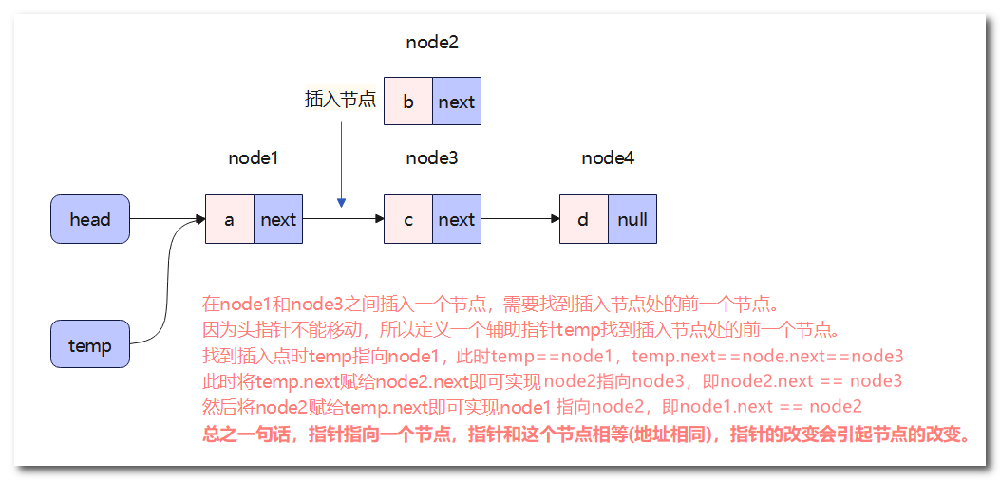
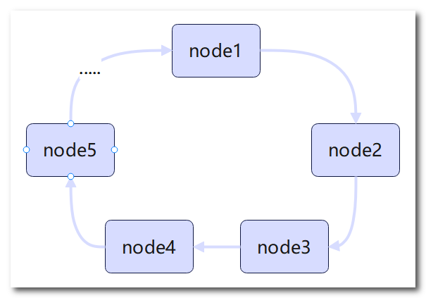

## 数据结构之链表

链表可以分为单向链表、双向链表和循环链表等类型：

- 单向链表只有一个指针域，指向下一个节点。
- 双向链表则有两个指针域，分别指向前一个和后一个节点。
- 循环链表的最后一个节点的指针域指向头节点，形成一个环。

链表分带头节点的链表和没有头节点的链表，根据实际的需求来确定。

链表的优点在于可以动态地分配内存，插入和删除节点的时间复杂度为O(1)，相比于数组，可以更高效地进行插入和删除操作。但缺点是访问某个节点的时间复杂度为O(n)，无法像数组那样通过下标直接访问。


### 单向链表

单向链表是一种常见的数据结构，它是由一系列节点构成的，**每个节点包含两个部分：data域和next域**。

其中，data域存储节点的数据，next域存储下一个节点的地址。

单向链表的主要特点如下：

- 内存空间利用率高：由于节点只保存指向下一个节点的指针，因此每个节点占用的内存空间较小，而且节点之间并不需要连续的内存空间，因此可以更加灵活地利用内存空间。
- 插入和删除操作效率高：相比于数组，单向链表在插入和删除节点时效率更高。因为单向链表的节点只保存指向下一个节点的指针，所以在删除或插入一个节点时，只需要修改其前一个节点的指针即可，不需要像数组那样将后面的元素往前移动。
- 查找元素效率低：由于单向链表只能单向遍历，因此在查找元素时需要从头节点开始遍历整个链表，效率较低。

下面是单链表在内存中存储的示意图：


下面是单链表的逻辑结构示意图：


遍历单向链表的原理：

> 因为头节点不能动，我们需要一个辅助节点来遍历：ListNode temp = head.next; 


在单向链表中指定位置插入节点的原理图：




单向链表的节点可以用一个类来表示，如下所示：

```java
public class ListNode {
    int val; // 数据域
    ListNode next; // 指针域

    public ListNode(int val) {
        this.val = val;
        this.next = null;
    }
}
```

单向链表的插入、删除、反转

```Java
// 单向链表插入操作
public void insert(ListNode head, ListNode newNode) {
    newNode.next = head.next;
    head.next = newNode;
}

// 单向链表删除操作
public void delete(ListNode head, ListNode delNode) {
    ListNode cur = head.next;
    ListNode pre = head;
    while (cur != null) {
        if (cur == delNode) {
            pre.next = cur.next;
            cur.next = null;
            break;
        }
        pre = cur;
        cur = cur.next;
    }
}

// 单向链表反转
public ListNode reverse(ListNode head) {
    ListNode cur = head.next;
    ListNode pre = null;
    while (cur != null) {
        ListNode next = cur.next;
        cur.next = pre;
        pre = cur;
        cur = next;
    }
    head.next = pre;
    return head;
}
```


### 双向链表

双向链表（doubly linked list）是一种链式存储结构，它具有链表的基本特点，同时还能够**支持双向遍历**。相比于单向链表，双向链表的每个节点**除了保存指向下一个节点的指针外，还保存指向上一个节点的指针**。

双向链表的主要特点如下：

1. 可以双向遍历：双向链表中每个节点都有两个指针，一个指向下一个节点，一个指向上一个节点。这使得我们可以在链表中沿着前向或后向方向遍历链表。
2. 插入和删除操作效率高：相比于单向链表，在双向链表中，我们可以在常数时间内删除或插入一个节点。因为删除或插入一个节点时，只需要修改其前后节点的指针即可，不需要像单向链表那样要从头遍历到对应节点。
3. 占用内存空间较大：由于每个节点需要保存指向前一个节点的指针，因此相对于单向链表，双向链表需要更多的内存空间。

双向链表结构示意图：


▼下面是使用 Java 实现双向链表的示例代码：

```Java
public class DoublyLinkedList {
    static class Node {
        int data;
        Node prev;
        Node next;

        Node(int data) {
            this.data = data;
        }
    }

    // 定义辅助变量
    private Node head;
    private Node tail;

    // 在链表前端插入节点
    public void insertAtFront(int data) {
        Node newNode = new Node(data);
        if (head == null) {
            // 如果链表为空，设置头节点和尾节点为新节点
            head = newNode;
            tail = newNode;
        } else {
            // 将新节点插入到头部，调整节点的前后关系
            newNode.next = head;
            head.prev = newNode;
            head = newNode;
        }
    }

    // 在链表末尾插入节点
    public void insertAtEnd(int data) {
        Node newNode = new Node(data);
        if (head == null) {
            // 如果链表为空，设置头节点和尾节点为新节点
            head = newNode;
            tail = newNode;
        } else {
            // 将新节点插入到尾部，调整节点的前后关系
            tail.next = newNode;
            newNode.prev = tail;
            tail = newNode;
        }
    }

    // 删除链表中指定数据的节点
    public void delete(int data) {
        if (head == null) {
            return;
        }

        Node current = head;
        while (current != null) {
            if (current.data == data) {
                if (current == head) {
                    // 如果要删除的节点是头节点，更新头节点的指针
                    head = head.next;
                    if (head != null) {
                        head.prev = null;
                    }
                } else if (current == tail) {
                    // 如果要删除的节点是尾节点，更新尾节点的指针
                    tail = tail.prev;
                    tail.next = null;
                } else {
                    // 如果要删除的节点是中间节点，调整前后节点的关系
                    current.prev.next = current.next;
                    current.next.prev = current.prev;
                }
                break;
            }
            current = current.next;
        }
    }

    // 打印链表中的所有节点
    public void display() {
        Node current = head;
        while (current != null) {
            System.out.print(current.data + " ");
            current = current.next;
        }
        System.out.println();
    }

    public static void main(String[] args) {
        DoublyLinkedList doublyLinkedList = new DoublyLinkedList();

        doublyLinkedList.insertAtEnd(10);
        doublyLinkedList.insertAtFront(5);
        doublyLinkedList.insertAtEnd(15);
        doublyLinkedList.insertAtFront(2);

        doublyLinkedList.display(); // 输出：2 5 10 15

        doublyLinkedList.delete(5);

        doublyLinkedList.display(); // 输出：2 10 15
    }
}

```

在上述代码中，我们定义了一个内部类 `Node`，用于表示双向链表中的节点。每个节点都包含一个 `data` 属性，用于存储数据，以及 `prev` 和 `next` 属性，分别指向前一个节点和后一个节点。

在 `DoublyLinkedList` 类中，我们定义了头节点 `head` 和尾节点 `tail`，并实现了以下操作：

- `insertAtFront` 方法用于在链表的前端插入节点。
- `insertAtEnd` 方法用于在链表的末尾插入节点。
- `delete` 方法用于删除链表中指定数据的节点。
- `display` 方法用于打印链表中的所有节点。


### 单向环形链表

单向环形链表是一种特殊的单向链表，其最后一个节点指向链表的头节点，形成了一个环形结构。相比于普通单向链表，单向环形链表可以更高效地进行循环操作。

单向环形链表的操作与单向链表类似，不同的是在进行插入和删除操作时需要特别注意节点的前后指针关系，以免破坏链表的环形结构。

单向环形链表常见的应用场景包括**循环队列、约瑟夫问题**等。

单向循环链表结构图：



▼下面主要学习约瑟夫问题

约瑟夫问题：

> 在一个环形排列的 n 个人中，从第 k 个人开始，从1开始报数，数到 m 的那个人出列；他的下一个人又从 1 开始报数，数到 m 的那个人又出列；依此规律重复下去，直到所有人都出列为止。问题是，给定 n、k 和 m 的值，求出出列人的顺序。

思路：

1. 创建单向环形链表

   (1) 先创建第一个节点first，让first节点指向它本身形成环形。

   (2) 后面创建的每一个节点添加到该环形链表中：first.next = newnode; newnode.next = first;

2. 遍历

    定义一个辅助指针cur指向first节点，当cur.next = first时表示遍历链表结束。

3. 出列

   (1) 创建一个辅助指针tail，首先该指针指向first指针，利用while循环让其指向最后一个节点。循环结束条件：tail.next  == first。

   (2) 首次报数之前，让tail和first指向第k的节点，即利用for循环移动k-1次。

   (3) 利用while循环操作出列，首先报数m次，让tail指针和first指针往后移动m-1次，循环结束条件是只剩一个节点即tail == first。

   此时first指向的就是出列的节点，然后将first指向下一个节点、tail的下一个节点指向first，然后由当前first指向的节点继续报数。

图解：

1. 初始链表状态

   

2. 出列前的链表状态


3. 出列后的链表状态


▼下面使用Java代码实现约瑟夫问题

```java
public class JosephusProblem {
    static class Node {
        int data;
        Node next;

        Node(int data) {
            this.data = data;
        }
    }

    public static int findSurvivor(int n, int k) {
        if (n <= 0 || k <= 0) {
            throw new IllegalArgumentException("Invalid input");
        }

        // 创建循环链表
        Node head = new Node(1);
        Node prev = head;
        for (int i = 2; i <= n; i++) {
            Node newNode = new Node(i);
            prev.next = newNode;
            prev = newNode;
        }
        prev.next = head; // 将链表首尾相连形成循环

        // 从头节点开始报数k次并删除节点，直到只剩下一个节点
        Node current = head; // 
        while (current.next != current) {
            // 移动 k-1 次
            for (int i = 0; i < k - 1; i++) {
                current = current.next;
            }
            current.next = current.next.next;// 删除 current 指向节点的下一个节点
            current = current.next; // 移动到下一个节点继续报数
        }
        return current.data; // 获取最后一个出列的人
    }

    public static void main(String[] args) {
        int n = 7; // 总人数
        int k = 3; // 报数到第 k 的人出列

        int survivor = findSurvivor(n, k);
        System.out.println("The survivor is: " + survivor);
    }
}

```

