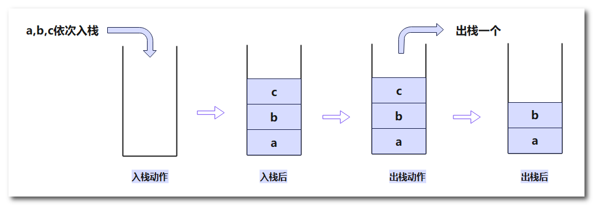

## 数据结构之栈


栈（Stack）是一种有序列表，它遵循先进后出（First In Last Out，FILO）的原则。栈可以被看作是一种容器，类似于一叠盘子，只能从顶部插入和移除元素。

栈的主要特点包括：

1. 元素的插入和删除只能发生在栈顶：只能在栈顶进行元素的插入（称为压栈或入栈）和删除（称为弹栈或出栈）操作。
2. 后进先出（FILO）：栈的元素遵循后进先出的原则，最后插入的元素总是最先被访问或删除。
3. 有限性：栈有容量限制，当栈的容量达到上限时，无法再插入新的元素，称为栈溢出。

下面为出栈入栈示意图：



栈是一种常用的数据结构，主要应用场景包括但不限于以下几个方面：

1. 表达式求值：在数学计算和编程中，表达式求值通常需要借助栈来实现。可以通过将操作符和操作数分别存入两个栈中，然后依次取出操作符和操作数进行运算。
2. 括号匹配：在编程中，很多语言都需要用到括号来限定语句或函数的作用范围，因此括号匹配是一个比较常见的问题。可以使用栈来存储左括号，并在遇到右括号时进行匹配，如果匹配成功则弹出左括号，否则表示括号不匹配。
3. 递归函数调用：在递归函数中，每一次函数调用都会将当前函数的执行环境（包括参数、局部变量等）保存在栈中，直到递归结束后，才会依次从栈中弹出这些执行环境并执行函数。
4. 浏览器的前进和后退：在浏览器中，前进和后退功能可以通过维护一个栈来实现。每当用户访问一个新的网页时，将当前页面的URL入栈；当用户点击后退按钮时，从栈中弹出上一个URL并显示在浏览器中。
5. 迷宫求解：在迷宫求解中，通常需要使用回溯法来遍历所有可能的路径。可以使用栈来保存当前路径，并在遍历到死路时回退到上一个节点继续遍历。


### 数组模拟栈

要使用数组来模拟栈，可以按照以下步骤进行操作：

1. 创建一个固定大小的数组，并声明一个变量用于表示栈顶的索引。初始时，栈顶索引可以设置为 -1，表示栈为空。
2. 定义栈的基本操作，包括入栈（push）和出栈（pop）操作，以及获取栈顶元素（peek）和判断栈是否为空（isEmpty）的操作。
   - 入栈操作：将元素插入到栈顶位置，需要将栈顶索引加一，并将元素赋值给对应的数组位置。
   - 出栈操作：从栈顶位置移除元素，需要先取出栈顶元素，然后将栈顶索引减一。
   - 获取栈顶元素：返回栈顶位置对应的数组元素的值。
   - 判断栈是否为空：根据栈顶索引是否为 -1 来判断。
3. 在进行入栈和出栈操作时，需要注意栈的边界条件。例如，当栈已满时（栈顶索引等于数组的最大索引），无法执行入栈操作；当栈为空时（栈顶索引为 -1），无法执行出栈操作。

以下是使用 Java 数组实现栈的示例代码

```Java
public class ArrayStack {
    private int[] stack; // 存储栈元素的数组
    private int top; // 栈顶索引
    private int capacity; // 栈容量

    public ArrayStack(int capacity) {
        this.stack = new int[capacity]; // 创建指定容量的数组作为栈的存储空间
        this.top = -1; // 初始化栈顶指针为-1，表示栈为空
        this.capacity = capacity; // 设置栈的容量
    }

    public boolean isEmpty() {
        return top == -1; // 栈为空的条件是栈顶指针为-1
    }

    public boolean isFull() {
        return top == capacity - 1; // 栈为满的条件是栈顶指针等于栈容量减1
    }

    public void push(int data) {
        if (isFull()) {
            System.out.println("Stack is full. Cannot push element: " + data);
            return;
        }
        top++; // 将栈顶指针加1
        stack[top] = data; // 将元素放入栈顶位置
    }

    public int pop() {
        if (isEmpty()) {
            System.out.println("Stack is empty. Cannot pop element.");
            return -1;
        }
        int data = stack[top]; // 取出栈顶元素
        top--; // 栈顶指针减1
        return data;
    }

    public int peek() {
        if (isEmpty()) {
            System.out.println("Stack is empty. Cannot peek element.");
            return -1;
        }
        return stack[top]; // 返回栈顶元素，不删除
    }

    public void display() {
        if (isEmpty()) {
            System.out.println("Stack is empty.");
            return;
        }
        System.out.print("Stack: ");
        for (int i = top; i >= 0; i--) {
            System.out.print(stack[i] + " "); // 从栈顶开始逐个打印元素
        }
        System.out.println();
    }

    public static void main(String[] args) {
        ArrayStack stack = new ArrayStack(5);

        stack.push(10);
        stack.push(20);
        stack.push(30);
        stack.display(); // 输出: Stack: 30 20 10

        int item = stack.pop();
        System.out.println("Popped element: " + item); // 输出: Popped element: 30

        stack.push(40);
        stack.push(50);
        stack.push(60);
        stack.display(); // 输出: Stack: 60 50 40 20 10

        item = stack.peek();
        System.out.println("Peeked element: " + item); // 输出: Peeked element: 60

        stack.display(); // 输出: Stack: 60 50 40 20 10
    }
}

```


### 中缀表达式

中缀表达式是一种常见的数学表达式表示法，它是我们通常在书写数学表达式时使用的方式。中缀表达式是基于运算符的位置相对于操作数的方式来表示运算式。

在中缀表达式中，运算符位于操作数的中间，例如 `2 + 3` 或 `4 * (5 - 2)`。这种表示方法符合我们在日常生活中习惯的数学表达方式。

中缀表达式遵循以下约定：

- 运算符可以是一元运算符（如正负号）或二元运算符（如加减乘除）。
- 运算符具有不同的优先级，例如乘法和除法的优先级高于加法和减法。
- 可以使用括号来改变运算符的优先级。

中缀表达式的主要特点是易于理解和书写。然而，对于计算机来说，中缀表达式的处理较为复杂。因此，在计算机领域中，通常使用其他表达式表示法，如**后缀表达式**（逆波兰表达式）或前缀表达式（波兰表达式）来进行计算。这些表达式形式更适合计算机的处理方式，并且不需要考虑运算符的优先级和括号的位置。

**中缀表达式计算思路**：

1. 通过索引遍历表达式字符串。

2. 确认是数字直接入数栈。

3. 确认是符号则分如下情况：

   - 如果符号栈为空，直接入符号栈。

   - 如果符号栈有运算符，并且当前运算符的优先级小于或等于符号栈中栈顶运算符的优先级，就需要从数栈中弹出两个数，从符号栈中弹出一个运算符，然后进行运算，将运算结果入数栈，再将当前运算符入符号栈。
   - 如果符号栈由运算符，并且当前运算符的优先级大于符号栈中栈顶运算符的优先级，则直接入符号栈。

4. 表达式扫描完毕，顺序的从数栈和符号栈中弹出相应的数和符号进行计算，计算结果入数栈，这就是最终的计算结果。

▼下面使用Java实现中缀表达式的计算

```Java
import java.util.Stack;

public class InfixExpressionEvaluator {
    public static int evaluateInfix(String infix) {
        // 创建一个运算符栈
        Stack<Character> operatorStack = new Stack<>();
        // 创建一个操作数栈
        Stack<Integer> operandStack = new Stack<>();

        for (int i = 0; i < infix.length(); i++) {
            char ch = infix.charAt(i);

            if (ch == ' ') {
                // 如果是空格，忽略
                continue;
            } else if (Character.isDigit(ch)) {
                // 如果是数字字符，则将其转换为整数并压入操作数栈
                int operand = ch - '0';
                operandStack.push(operand);
            } else if (isOperator(ch)) {
                /*如果是运算符，并且栈顶的运算符的优先级比该运算符的优先级高，
                  则在数栈弹出两个数(注意后者弹出的在前)，运算符栈弹出一个运算符进行计算，
                  然后将计算结果入操作数栈，当前运算符入运算符栈。
                */
        while (!operatorStack.isEmpty() && operatorPrecedence(operatorStack.peek()) >= operatorPrecedence(ch)) {
                    evaluateTopOperator(operatorStack, operandStack);
                }
                operatorStack.push(ch);// 当前运算符入运算符栈
            } else if (ch == '(') {
                // 如果是左括号，则压入操作符栈
                operatorStack.push(ch);
            } else if (ch == ')') {
                // 如果是右括号，则进行相应的操作
                while (operatorStack.peek() != '(') {
                    evaluateTopOperator(operatorStack, operandStack);
                }
                operatorStack.pop(); // 弹出左括号
            }
        }

        // 处理剩余的运算符
        while (!operatorStack.isEmpty()) {
            evaluateTopOperator(operatorStack, operandStack);
        }

        // 最终操作数栈中的元素即为中缀表达式的计算结果
        return operandStack.pop();
    }

    // 判断是是否为‘+’、‘-’、‘*’、‘/’操作符
    private static boolean isOperator(char ch) {
        return ch == '+' || ch == '-' || ch == '*' || ch == '/';
    }

    // 操作优先级
    private static int operatorPrecedence(char operator) {
        if (operator == '+' || operator == '-') {
            return 1;
        } else if (operator == '*' || operator == '/') {
            return 2;
        }
        return 0;
    }

    private static void evaluateTopOperator(Stack<Character> operatorStack, Stack<Integer> operandStack) {
        char operator = operatorStack.pop();
        int operand2 = operandStack.pop();//注意顺序
        int operand1 = operandStack.pop();
        int result;

        switch (operator) {
            case '+':
                result = operand1 + operand2;
                break;
            case '-':
                result = operand1 - operand2;
                break;
            case '*':
                result = operand1 * operand2;
                break;
            case '/':
                result = operand1 / operand2;
                break;
            default:
                throw new IllegalArgumentException("Invalid operator: " + operator);
        }

        operandStack.push(result);
    }

    public static void main(String[] args) {
        String infix = "5 + 2 * 3 - (4 + 1)";
        int result = evaluateInfix(infix);
        System.out.println("Infix expression: " + infix);
        System.out.println("Result: " + result); // 输出: 6
    }
}
```

在上述代码中，我们定义了一个 `evaluateInfix` 方法来计算中缀表达式的结果。该方法使用两个栈，一个用于操作符，一个用于操作数。我们按顺序遍历中缀表达式的每个字符，并根据字符的类型执行相应的操作。这个示例实现了常见的运算符优先级，包括加法、减法、乘法和除法。它还支持括号的处理，可以正确处理表达式中的括号嵌套。

上述代码用到了`isDigit`方法，`isDigit` 是 `Character` 类中的一个静态方法，用于判断指定的字符是否是一个数字字符。

> 该方法接受一个 `char` 类型的参数 `ch`，并返回一个布尔值。如果给定的字符是一个数字字符（0-9），则返回 `true`；否则返回 `false`。
>
> 例如，以下代码片段演示了如何使用 `isDigit` 方法来判断字符是否为数字：
>
> ```
> char ch1 = '5';
> char ch2 = 'A';
> 
> boolean isCh1Digit = Character.isDigit(ch1);
> boolean isCh2Digit = Character.isDigit(ch2);
> 
> System.out.println("Is ch1 a digit? " + isCh1Digit); // 输出: true
> System.out.println("Is ch2 a digit? " + isCh2Digit); // 输出: false
> ```

`一个数字字符-'0'`表示将该字符转化成对应的整数值。

> 在 ASCII 编码中，数字字符 `'0'` 到 `'9'` 连续排列，并且它们的 ASCII 值是依次递增的。具体地说，字符 `'0'` 的 ASCII 值是 48，字符 `'1'` 的 ASCII 值是 49，以此类推，字符 `'9'` 的 ASCII 值是 57。
>
> 通过执行表达式 `ch - '0'`，我们可以获得字符 `ch` 所代表的数字字符对应的整数值。这是因为在计算机中，字符的内部表示实际上是一个整数。通过减去字符 `'0'` 的 ASCII 值，我们可以得到与数字字符对应的整数值。
>
> 例如，假设 `ch` 的值为 `'5'`，那么表达式 `ch - '0'` 将计算为 5，因为字符 `'5'` 的 ASCII 值是 53，字符 `'0'` 的 ASCII 值是 48，所以结果为 53 - 48 = 5。


### 前缀表达式

前缀表达式，也被称为波兰表达式（Polish Notation），是一种用于表示数学表达式的形式。与中缀表达式和后缀表达式相比，前缀表达式更加紧凑且易于计算机处理。

在前缀表达式中，运算符位于操作数的前面。例如，表达式 `2 + 3` 在前缀表达式中可以表示为 `+ 2 3`，而表达式 `4 * (5 - 2)` 则可以表示为 `* 4 - 5 2`。

前缀表达式遵循以下规则：

- 操作数按照它们在表达式中出现的顺序排列。
- 运算符放置在相应的操作数之前。

通过**从右到左遍历**前缀表达式，并使用栈来辅助计算，我们可以准确地计算出表达式的结果。

前缀表达式的处理过程通常如下：

1. 从右到左遍历前缀表达式的每个字符。
2. 如果当前字符是操作数，则将其推入栈中。
3. 如果当前字符是运算符，则从栈中弹出相应数量的操作数进行计算，并将计算结果推回到栈中。
4. 遍历完前缀表达式后，栈中最后剩下的元素即为表达式的结果。

前缀表达式的优点是它具有一种自然的计算顺序，不需要括号来明确运算符的优先级。前缀表达式通常用于计算器程序、编译器、计算机代数系统等领域中。虽然前缀表达式不太常见于日常数学表示，但在计算机科学和算法中具有重要的应用价值。

▼下面是使用 Java 实现计算前缀表达式的示例代码（没有考虑多位数的情况）：

```Java
import java.util.Stack;

public class PrefixExpressionCalculator {
    public static int evaluate(String expression) {
        // 创建一个栈用于存储操作数
        Stack<Integer> stack = new Stack<>();

        // 从右到左遍历表达式的每个字符
        for (int i = expression.length() - 1; i >= 0; i--) {
            char ch = expression.charAt(i);

            // 如果当前字符是数字，则将其转换为整数并推入栈中
            if (Character.isDigit(ch)) {
                stack.push(ch - '0');
            } else if (ch == '+' || ch == '-' || ch == '*' || ch == '/') {
                // 如果当前字符是运算符，则从栈中弹出相应数量的操作数进行计算，并将计算结果推回到栈中
                int operand1 = stack.pop();
                int operand2 = stack.pop();
                int result = performOperation(ch, operand1, operand2);
                stack.push(result);
            }
        }

        // 栈中最后剩下的元素即为表达式的结果
        return stack.pop();
    }

    // 执行运算符的计算
    private static int performOperation(char operator, int operand1, int operand2) {
        switch (operator) {
            case '+':
                return operand1 + operand2;
            case '-':
                return operand1 - operand2;
            case '*':
                return operand1 * operand2;
            case '/':
                return operand1 / operand2;
            default:
                throw new IllegalArgumentException("Unsupported operator: " + operator);
        }
    }

    public static void main(String[] args) {
        String prefixExpression = "* + 4 5 - 2 1";
        int result = evaluate(prefixExpression);
        System.out.println("Result: " + result);
    }
}
```


### 后缀表达式


后缀表达式，也被称为逆波兰表达式（Reverse Polish Notation，简称 RPN），是一种用于表示数学表达式的形式。与中缀表达式相比，后缀表达式更符合计算机的处理方式，并且不需要括号来表示运算符的优先级。

在后缀表达式中，运算符位于操作数的后面。例如，表达式 `2 + 3` 在后缀表达式中可以表示为 `2 3 +`，而表达式 `4 * (5 - 2)` 则可以表示为 `4 5 2 - *`。

后缀表达式遵循以下规则：

- 操作数按照它们在表达式中出现的顺序排列。
- 运算符放置在相应的操作数之后。

通过**从左到右遍历**后缀表达式，并使用栈来辅助计算，我们可以准确地计算出表达式的结果。

后缀表达式的处理过程通常如下：

1. 从左到右遍历后缀表达式的每个字符。
2. 如果当前字符是操作数，则将其推入栈中。
3. 如果当前字符是运算符，则从栈中弹出相应数量的操作数进行计算，并将计算结果推回到栈中。
4. 遍历完后缀表达式后，栈中最后剩下的元素即为表达式的结果。

后缀表达式的优点是它具有一种自然的计算顺序，不需要括号来明确运算符的优先级，计算过程更直观和简单。因此，后缀表达式常用于计算器程序、编译器、计算机代数系统等领域中。

▼下面是一个使用后缀表达式计算的示例代码（没有考虑多位数的情况）：

```Java
import java.util.Stack;

public class PostfixEvaluator {
    public static int evaluatePostfix(String postfix) {
        Stack<Integer> stack = new Stack<>();

       	// 这里没有考虑多位数的情况
        for (int i = 0; i < postfix.length(); i++) {
            char ch = postfix.charAt(i);

            if (Character.isDigit(ch)) {
                // 如果字符是数字，则将其转换为整数并压入栈中
                stack.push(ch - '0');
            } else if (ch == ' ') {
                // 如果是空格，忽略
                continue;
            } else {
                // 如果是运算符，则从栈中弹出两个操作数进行计算
                int operand2 = stack.pop();
                int operand1 = stack.pop();

                // 根据运算符进行相应的计算，并将结果压入栈中
                int result;
                switch (ch) {
                    case '+':
                        result = operand1 + operand2;
                        break;
                    case '-':
                        result = operand1 - operand2;
                        break;
                    case '*':
                        result = operand1 * operand2;
                        break;
                    case '/':
                        result = operand1 / operand2;
                        break;
                    default:
                        throw new IllegalArgumentException("Invalid operator: " + ch);
                }

                stack.push(result);
            }
        }

        // 最终栈中的元素即为后缀表达式的计算结果
        return stack.pop();
    }

    public static void main(String[] args) {
        String postfix = "3 2 * 8 4 / -"; // 3*2 - 8/4
        int result = evaluatePostfix(postfix);
        System.out.println("Postfix expression: " + postfix);
        System.out.println("Result: " + result); // 输出: 4
    }
}
```


### 中缀转后缀

**将中缀表达式转换为后缀表达式的一般步骤如下**：

1. 创建一个空的栈用于存储运算符。
2. 创建一个空的字符串用于存储后缀表达式。
3. 从左到右遍历中缀表达式的每个字符。
4. 如果当前字符是操作数（数字），则将其添加到后缀表达式字符串中。
5. 如果当前字符是左括号'('，则将其推入栈中。
6. 如果当前字符是右括号')'，则弹出栈中的运算符，并将它们添加到后缀表达式字符串中，直到遇到左括号为止。注意，左括号不会添加到后缀表达式中。
7. 如果当前字符是运算符，比较其与栈顶运算符的优先级。
   - 如果栈为空或栈顶为左括号'('，则将当前运算符推入栈中。
   - 如果当前运算符优先级高于栈顶运算符，则将当前运算符推入栈中。
   - 如果当前运算符优先级低于或等于栈顶运算符，则将栈顶运算符弹出，并将其添加到后缀表达式字符串中。然后重复步骤7与栈中新的栈顶运算符进行比较。
8. 重复步骤4至7，直到处理完所有的字符。
9. 将栈中剩余的运算符弹出，并将它们添加到后缀表达式字符串中。

最终，后缀表达式字符串就是转换后的后缀表达式。

例如，将中缀表达式 "3 + 4 * (2 - 1) / 5" 转换为后缀表达式的步骤如下：

中缀表达式: 3 + 4 * (2 - 1) / 5 后缀表达式:

1. 遍历字符 '3'，将其添加到后缀表达式中。
2. 遍历字符 '+'，将其推入栈中。
3. 遍历字符 '4'，将其添加到后缀表达式中。
4. 遍历字符 '*'，将其推入栈中。
5. 遍历字符 '('，将其推入栈中。
6. 遍历字符 '2'，将其添加到后缀表达式中。
7. 遍历字符 '-'，栈顶为'('，将其推入栈中。
8. 遍历字符 '1'，将其添加到后缀表达式中。
9. 遍历字符 ')'，弹出栈中的运算符 '-' 和 '('，将它们添加到后缀表达式中。
10. 遍历字符 '/'，栈顶为'\*'，将'*'弹出并添加到后缀表达式中。然后将'/'推入栈中。
11. 遍历字符 '5'，将其添加到后缀表达式中。
12. 处理完所有字符后，将栈中剩余的运算符 '*' 和 '/' 弹出，并添加到后缀表达式中。

最终得到后缀表达式 "3 4 2 1 - * 5 / +"

注意：后缀表达式不包含括号，操作符的顺序决定了运算的顺序。

▼下面使用Java实现中缀表达式转后缀表达式的示例代码

```java
import java.util.Stack;

public class InfixToPostfix {

    // 方法：将中缀表达式转换为后缀表达式
    public static String convertToPostfix(String infixExpression) {
        StringBuilder postfixExpression = new StringBuilder(); // 用于存储后缀表达式的字符串
        Stack<Character> operatorStack = new Stack<>(); // 运算符栈

        for (int i = 0; i < infixExpression.length(); i++) {
            char ch = infixExpression.charAt(i);

            // 如果当前字符是空格，则跳过
            if (ch == ' ') {
                continue;
            }

            // 如果当前字符是数字或字母，则直接添加到后缀表达式字符串中
            if (Character.isLetterOrDigit(ch)) {
                postfixExpression.append(ch);
            }
            // 如果当前字符是左括号'('，则将其推入运算符栈
            else if (ch == '(') {
                operatorStack.push(ch);
            }
            // 如果当前字符是右括号')'，则将运算符栈中的运算符弹出，并添加到后缀表达式字符串中，直到遇到左括号'('为止
            else if (ch == ')') {
                while (!operatorStack.isEmpty() && operatorStack.peek() != '(') {
                    postfixExpression.append(operatorStack.pop());
                }
                operatorStack.pop(); // 弹出左括号
            }
            // 如果当前字符是运算符
            else {
                // 将运算符栈中优先级高于等于当前运算符的运算符弹出，并添加到后缀表达式字符串中
                while (!operatorStack.isEmpty() && hasHigherPrecedence(ch, operatorStack.peek())) {
                    postfixExpression.append(operatorStack.pop());
                }
                operatorStack.push(ch); // 将当前运算符推入运算符栈
            }
        }

        // 将运算符栈中剩余的运算符弹出，并添加到后缀表达式字符串中
        while (!operatorStack.isEmpty()) {
            postfixExpression.append(operatorStack.pop());
        }

        return postfixExpression.toString();
    }

    // 方法：判断当前运算符是否优先级高于栈顶运算符
    private static boolean hasHigherPrecedence(char currentOperator, char topOperator) {
        int currentPrecedence = getPrecedence(currentOperator);
        int topPrecedence = getPrecedence(topOperator);
        return currentPrecedence <= topPrecedence;
    }

    // 方法：获取运算符的优先级
    private static int getPrecedence(char operator) {
        switch (operator) {
            case '+':
            case '-':
                return 1;
            case '*':
            case '/':
                return 2;
            case '^':
                return 3;
            default:
                return -1; // 无效运算符
        }
    }

    public static void main(String[] args) {
        String infixExpression = "3 + 4 * (2 - 1) / 5";
		String postfixExpression = convertToPostfix(infixExpression);
		System.out.println("Infix Expression: " + infixExpression);
		System.out.println("Postfix Expression: " + postfixExpression);
	}
}
```

该示例代码通过遍历中缀表达式的每个字符，根据运算符的优先级和栈中运算符的顺序，将中缀表达式转换为后缀表达式。

输出结果为：Infix Expression: 3 + 4 * (2 - 1) / 5 

​					   Postfix Expression: 3 4 2 1 - * 5 / +

注：此示例代码仅适用于包含数字、字母和基本运算符（+、-、*、/）的中缀表达式。对于更复杂的表达式，可能需要进一步扩展代码。


### 后缀转中缀

将后缀表达式转换为中缀表达式的步骤如下：

1. 创建一个空的栈用于存储中间结果。
2. 从左到右遍历后缀表达式的每个字符。
3. 如果当前字符是操作数（operand），则将其推入栈中。
4. 如果当前字符是运算符（operator ），从栈中弹出两个操作数。
   - 第一个弹出的操作数记为"operand2"。
   - 第二个弹出的操作数记为"operand1"。
5. 根据当前运算符和弹出的操作数构建中缀表达式片段，并将该片段推入栈中。
   - 如果当前运算符是双目运算符（如 +、-、*、/），则构建片段为 "(operand1 operator operand2)"。
   - 如果当前运算符是单目运算符（如 sin、cos、sqrt），则构建片段为 "operator(operand2)"。
6. 重复步骤4至5，直到处理完所有的字符。
7. 最终，栈中存储的唯一元素即为转换后的中缀表达式。

例如，将后缀表达式 "3421-*5/+" 转换为中缀表达式的步骤如下：

后缀表达式: 3421-*5/+ 中缀表达式:

1. 遍历字符 '3'，将其作为操作数推入栈中。
2. 遍历字符 '4'，将其作为操作数推入栈中。
3. 遍历字符 '2'，将其作为操作数推入栈中。
4. 遍历字符 '1'，将其作为操作数推入栈中。
5. 遍历字符 '-'，从栈中弹出 '2' 和 '1'，构建中缀表达式片段为 "(2-1)"，将该片段推入栈中。
6. 遍历字符 '\*'，从栈中弹出 '4' 和 "(2-1)"，构建中缀表达式片段为 "4*(2-1)"，将该片段推入栈中。
7. 遍历字符 '5'，将其作为操作数推入栈中。
8. 遍历字符 '/'，从栈中弹出 '5' 和 "4\*(2-1)"，构建中缀表达式片段为 "5/(4*(2-1))"，将该片段推入栈中。
9. 遍历字符 '+'，从栈中弹出 "5/(4\*(2-1))" 和 '3'，构建中缀表达式片段为 "(5/(4*(2-1)))+3"。
10. 处理完所有字符后，栈中唯一元素即为转换后的中缀表达式。

最终得到中缀表达式 "(5/(4*(2-1)))+3"。

请注意，转换后的中缀表达式需要考虑运算符的优先级和括号的位置，以确保表达式的正确性。在实际实现中，可能需要考虑更多的运算符和操作数类型，并进行适当的处理。


### 逆波兰计算器

逆波兰计算器就是用来计算后缀表达式，之前的后缀表达式计算没有考虑多位数的计算。

下面代码使用正则表达式 `"-?\\d+(\\.\\d+)?"` 来判断一个字符串是否为数字，可以匹配整数和浮点数。

```Java
import java.util.Stack;

public class ReversePolishCalculator {
    public static double calculate(String expression) {
        Stack<Double> stack = new Stack<>();

        String[] tokens = expression.split(" ");
        for (String token : tokens) {
            if (isNumeric(token)) {
                stack.push(Double.parseDouble(token));
            } else {
                double operand2 = stack.pop();
                double operand1 = stack.pop();
                double result = performOperation(token, operand1, operand2);
                stack.push(result);
            }
        }

        return stack.pop();
    }

    private static boolean isNumeric(String token) {
        return token.matches("-?\\d+(\\.\\d+)?");
    }

    private static double performOperation(String operator, double operand1, double operand2) {
        switch (operator) {
            case "+":
                return operand1 + operand2;
            case "-":
                return operand1 - operand2;
            case "*":
                return operand1 * operand2;
            case "/":
                return operand1 / operand2;
            default:
                throw new IllegalArgumentException("Invalid operator: " + operator);
        }
    }

    public static void main(String[] args) {
        String expression = "34 2 * 8 4 / -";// 注意表达式要写标准，用空格隔开
        double result = calculate(expression);
        System.out.println("Result: " + result);
    }
}
```

