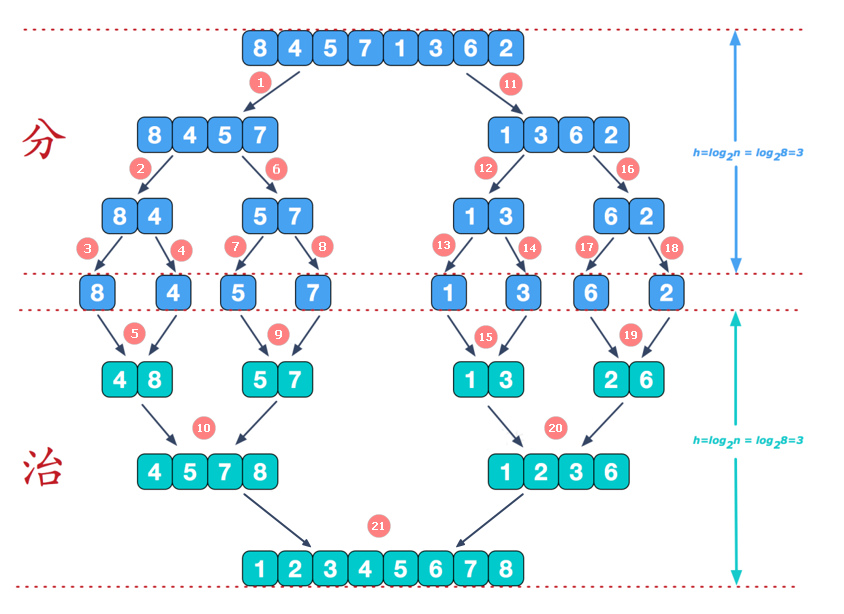

## 排序算法

常见的排序算法有以下几种：

1. 冒泡排序（Bubble Sort）：从序列的起始位置开始，逐个比较相邻元素的大小，将较大的元素逐步交换到序列的末尾。
2. 插入排序（Insertion Sort）：将序列分为已排序和未排序两部分，从未排序部分依次选择元素插入到已排序部分的合适位置，使得已排序部分始终有序。
3. 选择排序（Selection Sort）：从序列中选择最小（或最大）的元素，将其放置在序列的起始位置，然后从剩余元素中继续选择最小（或最大）的元素，放置在已排序部分的末尾。
4. 快速排序（Quick Sort）：通过选择一个基准元素，将序列分为左右两部分，使得左边部分的元素都小于等于基准元素，右边部分的元素都大于等于基准元素，然后对左右部分递归地进行快速排序。
5. 归并排序（Merge Sort）：将序列递归地分成两个子序列，分别进行排序，然后将两个有序的子序列合并成一个有序的序列。
6. 堆排序（Heap Sort）：将序列构建成一个堆，然后将堆顶元素与堆的最后一个元素交换，再调整堆使其满足堆的性质，重复该过程直到整个序列有序。
7. 希尔排序（Shell Sort）：将序列分成若干个子序列，对每个子序列进行插入排序，逐步缩小子序列的间隔，直到整个序列有序。
8. 计数排序（Counting Sort）：统计序列中每个元素出现的次数，然后根据统计信息将元素放置到有序的位置上。
9. 桶排序（Bucket Sort）：将序列划分为若干个桶，每个桶内的元素进行排序，然后按照桶的顺序将元素依次取出，形成有序序列。
10. 基数排序（Radix Sort）：将待排序的数字按照位数进行分组，从最低位到最高位依次进行排序，最终得到有序序列。

这些排序算法在不同的场景下具有不同的优劣势，选择合适的排序算法取决于数据规模、数据特点以及对排序稳定性、内存消耗和执行效率的要求。

▼下面是各种排序算法的对比图


图中n表示数据规模，k表示“桶”的个数，In-place表示不占用额外内存，Out-place表示占用额外内存。

稳定性指的是相同元素在排序前后的相对顺序是否保持不变。换句话说，如果待排序数组中的元素 A 和 B，A = B且 A 在 B 之前，那么排序后 A 仍然会在 B 之前。相反，如果排序算法是不稳定的，那么在排序过程中，相同元素的相对顺序可能发生改变。


### 冒泡排序

冒泡排序（Bubble Sort）是一种简单的排序算法，它重复地遍历待排序的元素列表，依次比较相邻的两个元素，并交换顺序，直到整个列表按照指定的顺序排序完成。

冒泡排序的步骤如下：

1. 从待排序的数组中选择第一个元素作为当前元素。
2. 依次比较当前元素和其后面的元素，如果当前元素大于后面的元素，则交换它们的位置，使较大的元素冒泡到数组的末尾。
3. 继续比较相邻的元素，重复步骤2，直到数组末尾。
4. 重复步骤1至步骤3，每次循环将未排序部分中最大的元素冒泡到已排序部分的末尾。
5. 当所有的元素都完成比较和交换后，排序完成。

冒泡排序的核心思想是相邻元素之间的比较和交换，通过不断将最大的元素往数组末尾冒泡，逐步形成有序序列。由于每一轮循环都会将未排序部分中最大的元素放到已排序部分的末尾，所以称为冒泡排序。

冒泡排序是一种简单但效率较低的排序算法，它的时间复杂度为O(n^2)。在最坏情况下，即逆序序列的情况下，需要进行n-1轮比较和交换操作。然而，冒泡排序是一种稳定排序算法，它不会改变相等元素之间的相对顺序。

▼下面是冒泡排序示例代码：

```java
public static void bubbleSort(int[] arr) {
    int n = arr.length;
    
    // 外层循环控制比较轮数
    for (int i = 0; i < n - 1; i++) {
        
        // 内层循环控制每轮比较的次数
        // 每比较一轮，最大的元素就会"冒泡"到最后面
        for (int j = 0; j < n - i - 1; j++) {
            
            // 如果当前元素大于下一个元素，则交换它们的位置
            if (arr[j] > arr[j + 1]) {
                int temp = arr[j];
                arr[j] = arr[j + 1];
                arr[j + 1] = temp;
            }
        }
    }
}
```

冒泡排序可以进行一定的优化，即添加一个标志位来判断是否已经完成排序。

优化后的冒泡排序代码如下所示：

```Java
public static void bubbleSort(int[] arr) {
    int n = arr.length;
    boolean sorted;
    
    for (int i = 0; i < n - 1; i++) {
        sorted = true; // 初始化标志位为true
        
        for (int j = 0; j < n - i - 1; j++) {
            if (arr[j] > arr[j + 1]) {
                int temp = arr[j];
                arr[j] = arr[j + 1];
                arr[j + 1] = temp;
                sorted = false; // 如果有交换操作，则说明数组还未排序完成
            }
        }
        
        if (sorted) {
            break; // 如果没有交换操作，说明数组已经排序完成，可以提前结束循环
        }
    }
}
```


### 选择排序

选择排序（Selection Sort）是一种简单直观的排序算法，它的基本思想是每次从未排序的部分中选取最小（或最大）的元素，将其放到已排序部分的末尾。

选择排序的步骤如下：

1. 首先，假设要排序的数组为 arr，长度为 n。
2. 从数组中选择最小元素，将其与数组的第一个元素交换位置。
3. 然后，在剩余的 n-1 个元素中选择最小元素，将其与数组的第二个元素交换位置。
4. 依此类推，每次选择剩余部分中的最小元素，并与相应位置的元素交换，直到整个数组排序完成。

选择排序图解：


> 第一轮排序：i=0，选出未排序部分的最小数与数组第一位元素进行交换，即与arr[0]交换。
>
> 第二轮排序：i=1，选出未排序部分的最小数与数组第二位元素进行交换，即与arr[1]交换。
>
> 第三轮排序：i=2，选出未排序部分的最小数与数组第三位元素进行交换，即与arr[2]交换。
>
> 第四轮排序：i=3，选出未排序部分的最小数与数组第四位元素进行交换，即与arr[3]交换。
>
> 最后一轮排序后未排序部分只剩一个元素，该元素已在正确的位置。

▼下面是选择排序的示例代码：

```Java
public static void selectionSort(int[] arr) {
    int n = arr.length;
    
    // 一共比较n-1轮，第n-1轮时最后一个元素已经在正确的位置上
    for (int i = 0; i < n - 1; i++) {
        // 假定最小元素的下标为每一轮的第一个元素
        int minIndex = i;
        
        // 在未排序部分中找到最小元素的索引
        for (int j = i + 1; j < n; j++) {
            if (arr[j] < arr[minIndex]) {
                minIndex = j;
            }
        }
        
        // 将最小元素与当前位置的元素交换
        int temp = arr[i];
        arr[i] = arr[minIndex];
        arr[minIndex] = temp;
    }
}
```


### 插入排序

插入排序是一种简单直观的排序算法，它的基本思路是将数组分为已排序部分和未排序部分，每次从未排序部分取出一个元素，将它插入到已排序部分的正确位置。

具体的插入排序算法步骤如下：

1. 假设第一个元素是已排序部分，从第二个元素开始作为当前元素。
2. 将当前元素与已排序部分的元素从后往前逐个比较，找到合适的位置插入。
3. 如果当前元素小于已排序部分的某个元素，则将该元素向后移动一位，为当前元素腾出插入位置。
4. 重复步骤3，直到找到当前元素的合适位置。
5. 将当前元素插入到合适的位置后，已排序部分增加一个元素。
6. 重复步骤2至5，直到所有元素都被插入到已排序部分。

通过不断地将元素插入到已排序部分，最终实现整个数组的排序。

插入排序的时间复杂度为O(n^2)，其中n为数组的长度。它是一种稳定的排序算法，适用于小规模数据或者部分有序的数据。在实际应用中，插入排序在部分有序的情况下表现较好，因为它的比较次数较少。

插入排序图解：


> 第四步插入的过程：
>
> 此时只剩最后一个待插入数arr[i] = 1，它的前一个索引为j=i-1，用它与索引为j位置的值进行比较，即arr[i]和arr[j]进行比较：
>
> - 首先1和8比较，比8小，将8后移一位，即将8赋给索引为j+1的位置，然后j--，此时数组为{2,3,5,8,8}（1的值已经保存下来了）
> - 其次1和5比较，比5小，将5后移一位，即将5赋给索引为j+1的位置，然后j--，此时数组为{2,3,5,5,8}
> - 然后1和3比较，比3小，将3后移一位，即将5赋给索引为j+1的位置，然后j--，此时数组为{2,3,3,5,8}
> - 最后1和2比较，比2小，将2后移一位，即将5赋给索引为j+1的位置，然后j--，此时数组为{2,2,3,5,8}
> - 此时j--等于-1，退出循环，将待插入数1赋给索引为j+1的位置，此时数组为{1,2,3,5,8}，完成排序。
>
> 如果arr[i]比arr[j]大，则直接将arr[i]的值赋给arr[j+1]的位置。比如第二次8>5，第三次的3>2。

▼下面是插入排序算法的示例代码：

```Java
public static void insertionSort(int[] array) {
    int n = array.length;

    // 外层循环 i 控制当前要插入的元素的索引，从第二个元素开始到最后一个元素。
    // 内层循环 j 将当前元素与已排序部分进行比较，并将大于当前元素的元素向右移动。
    for (int i = 1; i < n; i++) {
        // 当前要插入的元素
        int key = array[i];
        // 当前插入元素的前一个元素的下标(已排序部分的最后一个元素)
        int j = i - 1;

        // 将当前元素与已排序部分进行比较并插入合适的位置
        while (j >= 0 && array[j] > key) { // 插入值大于已排序部分某个值，则插入到该值的后面
            array[j + 1] = array[j];
            j--;
        }

        // 将当前元素插入合适的位置
        array[j + 1] = key;
    }
}
```


### 希尔排序

希尔排序的步骤如下：

1. 初始化增量（gap）为数组长度的一半。
2. 根据增量将数组分成多个子序列。
3. 对每个子序列进行插入排序，即将每个子序列看作一个独立的小数组，使用插入排序算法对其进行排序。
4. 逐步缩小增量，继续对子序列进行插入排序。
5. 重复步骤3和步骤4，直到增量缩小为1。
6. 最后一次插入排序时，整个数组合成了一个序列，进行最终的排序。
7. 排序完成后，数组就是有序的。

希尔排序图解：


希尔排序是一种原地排序算法，它不需要额外的空间来存储中间结果。它在处理中等大小的数据集时表现良好，但对于大规模数据集和最坏情况下的逆序序列，效率较低。希尔排序通过逐步缩小增量值的方式，可以提前对序列进行一定程度的粗略排序，从而减少了后续插入排序的比较和交换次数，提高了整体的排序效率。

相比于直接使用插入排序，希尔排序在初始阶段使用较大的增量值，通过将序列分成多个较小的子序列进行排序，可以将较大的元素移动到序列的较后位置，从而减少了后续插入排序的移动次数。

希尔排序的时间复杂度与增量序列的选择有关，最坏情况下为O(n²)，但通常情况下表现良好，平均时间复杂度约为O(n log n)。希尔排序是一种不稳定的排序算法，即相同元素的相对位置可能发生变化。

▼下面是交换法的希尔排序

```java
public static void shellSort(int[] arr) {
		
	int temp = 0;
	for (int gap = arr.length / 2; gap > 0; gap /= 2) {
		for (int i = gap; i < arr.length; i++) {
			for (int j = i - gap; j >= 0; j -= gap) {
                // 交换法的希尔排序内部使用的是反向冒泡排序（将小的数移到q）
				if (arr[j] > arr[j + gap]) {
					temp = arr[j];
					arr[j] = arr[j + gap];
					arr[j + gap] = temp;
				}
			}
		}
	}
}
```

▼下面是插入法的希尔排序

```Java
public class ShellSort {
    public static void shellSort(int[] array) {
        int n = array.length;
        
        // 初始增量为数组长度的一半        
        // 增量逐步缩小直到为1 (1/2=0.5=0,退出循环)
        for(int gap = n / 2; gap > 0; gap /= 2){
            // 对每个子序列进行插入排序
            for (int i = gap; i < n; i++) {
                int temp = array[i]; // 当前要插入的元素
                int j = i;
                
                // 在当前子序列中进行插入排序
                while (j >= gap && array[j - gap] > temp) {
                    array[j] = array[j - gap]; // 向后移动较大的元素
                    // j = gap时，最后一次进入循环，然后j-=gap，此时arra[j]为当前序列的第一个元素
                    j -= gap;
                } 
                array[j] = temp; // 将当前元素插入到合适的位置
            }
        }
    }
}
```

在插入法的希尔排序的代码中，`while` 循环的退出条件为 `j < gap`。这是因为在每个增量值 `gap` 下，我们需要比较和交换的元素是 `array[j]` 和 `array[j-gap]`，并且 `j` 的初始值为 `gap`。当  `j < gap`，意味着 `array[j]` 的索引小于 `gap`，此时无法与 `array[j-gap]` 进行比较和交换，因为它们不在同一个子序列中。因此，确保 `j` 的值不小于 `gap`，以保证每次比较和交换都是在同一个子序列中进行的。

需要注意的是，`while` 循环中的条件 `j < gap` 是控制子序列中的元素索引，而不是整个序列的索引。整个序列的遍历是通过外层的 `for` 循环来实现的。


### 快速排序


快速排序是一种常用且高效的排序算法，其步骤如下：

1. 选择一个基准元素（pivot），可以是数组中的任意一个元素。通常情况下，我们选择数组的第一个元素作为基准元素。
2. 设定两个指针，一个指向数组的第二个元素（一般称为左指针），另一个指向数组的末尾位置（一般称为右指针）。
3. 左指针开始向右移动，直到找到一个大于等于基准元素的元素。
4. 右指针开始向左移动，直到找到一个小于等于基准元素的元素。
5. 如果左指针和右指针还没有相遇，则交换左指针和右指针所指向的元素。
6. 重复步骤 3、4、5，直到左指针和右指针相遇。
7. 将基准元素与左指针所指向的元素进行交换，将基准元素放置在正确的位置上。
8. 分而治之：对基准元素左侧的子数组和右侧的子数组分别递归地应用上述步骤，重复执行快速排序。
9. 递归的结束条件是子数组的大小为 0 或 1，此时子数组已经有序。

快速排序的核心思想是通过每一轮的分区操作将数组分割成两部分，左边部分的元素都小于等于基准元素，右边部分的元素都大于基准元素。这样在递归过程中，每个子数组都会被排好序，最终得到整个数组的有序序列。

在实现快速排序时，可以选择不同的方式来选择基准元素和进行分区。常用的方式有三种：取第一个元素作为基准、取中间元素作为基准以及随机选择一个元素作为基准。另外，在实际应用中，为了避免快速排序在最坏情况下的性能退化，可以采用随机化的策略或者使用三数取中法来选择基准元素。

快速排序的时间复杂度通常为O(nlogn)，其中n为待排序数组的长度。在平均情况下，快速排序的性能非常好，并且它是一种原地排序算法，不需要额外的辅助空间。然而，在最坏情况下，即每次选择的基准元素都是当前数组中最小或最大的元素时，快速排序的时间复杂度为O(n^2)。为了避免这种情况，可以采用上述提到的优化策略。

尽管快速排序不需要额外的辅助空间来存储中间结果，但它需要使用递归调用栈来保存每个子问题的状态。递归调用栈的空间复杂度取决于排序数组的大小和递归调用的深度。在最坏情况下，快速排序的递归调用栈可能达到 O(n)，其中 n 是数组的长度。

说明：数据的顺序越乱，快速排序的效率越好，数据的顺序越整齐，快速排序的效率越差。

快速排序图解：


▼下面是快速排序的示例代码

```java
public class QuickSort {
    public static void quickSort(int[] arr, int low, int high) {
        if (low < high) {
            // 找到基准元素的正确位置
            int pivotIndex = partition(arr, low, high);

            // 对基准元素左侧的子数组进行快速排序
            quickSort(arr, low, pivotIndex - 1);

            // 对基准元素右侧的子数组进行快速排序
            quickSort(arr, pivotIndex + 1, high);
        }
    }

    public static int partition(int[] arr, int low, int high) {
        // 选择第一个元素作为基准元素
        int pivot = arr[low];

        int left = low + 1;
        int right = high;

        while (true) {
            // 左指针向右移动，直到找到一个大于等于基准元素的元素
            while (left <= right && arr[left] < pivot) {
                left++;
            }

            // 右指针向左移动，直到找到一个小于等于基准元素的元素
            while (left <= right && arr[right] > pivot) {
                right--;
            }

            if (left > right) {
                // 左指针和右指针相遇，退出循环
                break;
            }

            // 交换左指针和右指针所指向的元素
            int temp = arr[left];
            arr[left] = arr[right];
            arr[right] = temp;

            left++;
            right--;
        }

        // 将基准元素放置在正确的位置上
        arr[low] = arr[right];
        arr[right] = pivot;

        // 返回基准元素的正确位置
        return right;
    }

    public static void main(String[] args) {
        int[] arr = {9, 5, 1, 3, 8, 4, 7, 2, 6};
        int n = arr.length;
        quickSort(arr, 0, n - 1);

        System.out.println("Sorted array:");
        for (int num : arr) {
            System.out.print(num + " ");
        }
    }
}

```


### 归并排序

归并排序是一种经典的排序算法，它采用分治法（Divide and Conquer）的思想，将一个大问题拆分成小问题，最后将小问题的结果合并起来得到最终结果。下面是归并排序的详细步骤：

1. **分解**：将待排序的数组不断拆分成更小的子数组，直到每个子数组只包含一个元素（认为单个元素是有序的）。

2. **合并**：按照顺序将拆分得到的子数组两两合并，直到所有子数组合并为一个完整的有序数组。

具体步骤如下：

**分解步骤：**

- 通过 `(left + right) / 2` 计算数组的中间位置`mid`，将待排序的数组分为两个子数组，分别是左子数组和右子数组。
- 左子数组的起始索引为 `left`。左子数组的结束索引为 `mid`。右子数组的起始索引为 `mid + 1`。右子数组的结束索引为 `right`。
- 递归地对左子数组进行归并排序，直到左子数组只剩下一个元素。
- 递归地对右子数组进行归并排序，直到右子数组只剩下一个元素。

**合并步骤：**

- 创建一个临时数组 `temp`，用于存储归并过程中的中间结果。
- 初始化三个指针：
  - `i` 指针指向左子数组的起始位置。
  - `j` 指针指向右子数组的起始位置。
  - `k` 指针指向临时数组 `temp` 的起始位置。
- 通过比较左子数组和右子数组中的元素大小，将较小的元素复制到临时数组中，并将相应的指针向后移动一位。
  - 如果 `arr[i]` 小于等于 `arr[j]`，则将 `arr[i]` 复制到 `temp[k]`，然后将 `i` 和 `k` 的值都加 1。
  - 如果 `arr[i]` 大于 `arr[j]`，则将 `arr[j]` 复制到 `temp[k]`，然后将 `j` 和 `k` 的值都加 1。
- 如果某个子数组的所有元素都已经复制到临时数组中，而另一个子数组还有剩余元素，将剩余元素全部复制到临时数组的末尾。
  - 如果左子数组有剩余元素，将剩余元素依次复制到 `temp[k]`，并将 `i` 和 `k` 的值都加 1。
  - 如果右子数组有剩余元素，将剩余元素依次复制到 `temp[k]`，并将 `j` 和 `k` 的值都加 1。
- 将临时数组 `temp` 中的元素复制回原始数组 `arr` 的对应位置，覆盖原来的元素。
  - 使用一个循环，从临时数组的起始位置开始遍历，将 `temp` 中的元素逐个复制到 `arr` 中的对应位置，即 `arr[left + m] = temp[m]`，其中 `m` 是从 0 到 `k-1` 的索引。
- 通过不断拆分和合并子数组，最终实现了整个数组的排序。

在合并过程中，我们只需要复制有序子数组的元素，而不需要复制整个数组的元素。在复制元素的步骤中，我们使用了一个循环来遍历临时数组 `temp`，并将其中的元素逐个复制回原始数组 `arr` 的对应位置。这个循环的范围是从 0 到 `k-1`，其中 `k` 是临时数组 `temp` 中存储的元素个数。

归并排序的时间复杂度是 O(n log n)，其中 n 是数组的长度。它是一种稳定的排序算法，适用于各种规模的数据集。

归并排序图解：



上述图解过程中，编号为执行的顺序，第一次合并的是{8}和{4}，将{8}，{4}在临时数组中排好序然后复制回原数组对应的位置。

下面为最后一次合并的图解过程：


▼下面是归并排序的示例代码

```java
public class MergeSort {
    public static void mergeSort(int[] arr) {
        if (arr == null || arr.length <= 1) {
            return; // 如果数组为空或只有一个元素，则已经有序，无需排序
        }
        int[] temp = new int[arr.length]; // 创建一个临时数组用于存储归并过程中的中间结果
        mergeSort(arr, 0, arr.length - 1, temp); // 调用归并排序函数进行排序
    }

    private static void mergeSort(int[] arr, int left, int right, int[] temp) {
        if (left < right) {
            int mid = (left + right) / 2; // 找到数组的中间位置
            mergeSort(arr, left, mid, temp); // 对左侧子数组进行归并排序
            mergeSort(arr, mid + 1, right, temp); // 对右侧子数组进行归并排序
            merge(arr, left, mid, right, temp); // 合并左右两个有序子数组
        }
    }

    private static void merge(int[] arr, int left, int mid, int right, int[] temp) {
        int i = left; // 左侧子数组的起始索引
        int j = mid + 1; // 右侧子数组的起始索引
        int k = 0; // 临时数组的起始索引

        // 将左右两个子数组中的元素按照顺序合并到临时数组中
        while (i <= mid && j <= right) {
            if (arr[i] <= arr[j]) {
                temp[k++] = arr[i++];
            } else {
                temp[k++] = arr[j++];
            }
        }

        // 将左侧子数组中剩余的元素复制到临时数组中
        while (i <= mid) {
            temp[k++] = arr[i++];
        }

        // 将右侧子数组中剩余的元素复制到临时数组中
        while (j <= right) {
            temp[k++] = arr[j++];
        }

        // 将临时数组中的元素复制回原始数组的对应位置
        for (int m = 0; m < k; m++) {
            arr[left + m] = temp[m];
        }
        
    }

    public static void main(String[] args) {
        int[] arr = { 5, 2, 8, 3, 1 };
        mergeSort(arr);	
        System.out.println("Sorted array: " + Arrays.toString(arr));
    }
}
```


### 基数排序

基数排序是一种**非比较**的排序算法，它根据数字的每个位数进行排序。它适用于待排序元素为**非负整数**的情况。

基数排序的基本思想是将待排序的元素按照低位到高位的顺序进行排序，每一位上的排序都是**稳定的**。

基数排序的轮数取决于待排序元素中最大值的位数。

以下是基数排序的详细步骤：

1. 确定待排序数组中最大值的位数（最高位数）。遍历数组，找到数组中的最大值，然后确定最大值的位数，记为 `digit`。

2. 创建 10 个桶（数组），每个桶表示数字的一个位数（0 到 9）。初始化每个桶为空。

3. 从最低位（个位）开始，依次按照每个数字的位数将元素放入对应的桶中。具体操作如下：
   - 遍历待排序数组，将每个元素的当前位数（个位、十位、百位等）取出。
   - 将该元素放入当前位数对应的桶中。

4. 将桶中的元素按照顺序取出，依次放回原始数组。根据桶的顺序依次将每个桶中的元素放回原始数组。

5. 重复第 3 和第 4 步，依次对十位、百位、千位等高位数字进行相同的操作，直到达到最高位数。每次操作后，元素在数组中的顺序将更加接近最终排序结果。

6. 当完成所有位数的排序后，待排序数组就变为有序数组。

基数排序的时间复杂度是 O(d * (n + k))，其中 d 是最大值的位数，n 是待排序元素的数量，k 是数字的取值范围。在实践中，当 d 相对较小且 k 不是很大时，基数排序具有较好的性能。

基数排序使用了稳定的排序算法，例如计数排序或桶排序，来对每个位数上的元素进行排序。

基数排序是一种常见的排序算法，尤其适用于位数固定的整数排序，例如身份证号码、手机号码等的排序。

基数排序是桶排序的一种特殊情况，桶排序可以适用于更广泛的场景，不仅限于整数排序，而基数排序主要用于整数排序。

基数排序图解：


▼下面为基数排序的代码示例

```Java
import java.util.Arrays;

public class RadixSort {
    public static void radixSort(int[] arr) {
        // 获取数组中的最大值，确定最大值的位数
        int max = getMax(arr);
        int digit = getDigit(max);

        // 创建 10 个桶
        int[][] buckets = new int[10][arr.length];
        // 桶中元素的数量，用于确定每个桶中元素的位置
        int[] bucketCount = new int[10];

        // 对每个位数进行排序
        for (int i = 1; i <= digit; i++) {
            // 将元素分配到桶中
            for (int num : arr) {
                int digitValue = getDigitValue(num, i);
                buckets[digitValue][bucketCount[digitValue]] = num;
                bucketCount[digitValue]++;
            }

            // 将桶中的元素按照顺序合并到原始数组中
            int index = 0;
            for (int j = 0; j < 10; j++) {
                int count = bucketCount[j];
                if (count > 0) {
                    for (int k = 0; k < count; k++) {
                        arr[index] = buckets[j][k];
                        index++;
                    }
                    // 清空桶中元素的计数
                    bucketCount[j] = 0;
                }
            }
        }
    }

    // 获取数组中的最大值
    private static int getMax(int[] arr) {
        int max = arr[0];
        for (int num : arr) {
            if (num > max) {
                max = num;
            }
        }
        return max;
    }

    // 获取最大数字的位数
    private static int getDigit(int num) {
        int digit = 0;
        while (num > 0) {
            num /= 10;
            digit++;
        }
        return digit;
    }

    // 获取数字某位上的值
    private static int getDigitValue(int num, int digit) {
        return (num / (int) Math.pow(10, digit - 1)) % 10;
    }

    public static void main(String[] args) {
        int[] arr = { 170, 45, 75, 90, 802, 24, 2, 66 };
        System.out.println("原始数组: " + Arrays.toString(arr));

        radixSort(arr);

        System.out.println("排序后数组: " + Arrays.toString(arr));
    }
}
```

上述代码中，`Math.pow(a, b)` 用于计算 a 的 b 次幂。其中，a 和 b 都是 double 类型的参数，表示底数和指数。函数返回一个 double 类型的结果。例如，`Math.pow(2, 3)` 表示计算 2 的 3 次幂，即 2 的立方，结果为 8.0。

