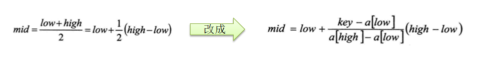

## 查找算法

查找算法是指在给定的数据集中寻找特定元素或确定某个元素是否存在的算法。以下是常见的查找算法：

1. 线性查找（Linear Search）：从头到尾逐个元素进行比较，直到找到目标元素或遍历完整个数据集。
2. 二分查找（Binary Search）：要求数据集必须是有序的，通过将数据集分成两半，然后判断目标元素可能存在的一半，逐步缩小查找范围，最终找到目标元素或确定不存在。
3. 插值查找（Interpolation Search）：适用于有序且分布均匀的数据集。根据目标元素与数据集的最小值和最大值之间的比例，通过插值计算得出目标元素可能的位置，并进行比较和调整，直到找到目标元素或确定不存在。
4. 哈希查找（Hashing）：利用哈希函数将元素映射到哈希表中的位置，通过索引快速访问目标元素。哈希查找在平均情况下具有快速的查找速度，但对于冲突较多的情况下可能存在性能下降。
5. 二叉搜索树（Binary Search Tree）：通过构建二叉搜索树结构，在每个节点上比较目标元素与当前节点的值，根据比较结果决定继续向左子树或右子树进行查找，直到找到目标元素或确定不存在。
6. 平衡二叉搜索树（Balanced Binary Search Tree）：例如红黑树（Red-Black Tree）、AVL树等，通过平衡二叉搜索树的性质，保证树的高度较小，提供快速的查找效率。
7. 哈希表（Hash Table）：利用哈希函数将元素存储在数组中，通过哈希函数计算出的索引快速访问目标元素。哈希表在平均情况下具有快速的查找速度，但对于冲突较多的情况下可能存在性能下降。
8. 跳表（Skip List）：通过使用多层链表结构，在每一层中快速跳跃进行查找，减少了比较的次数，提供较快的查找效率。


### 线性查找

线性查找（Linear Search），也称为顺序查找，是一种简单直观的查找算法。它逐个遍历待搜索的数据集，按顺序比较每个元素，直到找到目标元素或遍历完整个数据集。

以下是线性查找的具体步骤：

1. 从数据集的第一个元素开始，将目标元素与当前元素进行比较。

2. 如果当前元素等于目标元素，说明找到了目标元素，返回当前位置。

3. 如果当前元素不等于目标元素，则继续向下一个元素进行比较。

4. 重复步骤 2 和步骤 3，直到找到目标元素或遍历完整个数据集。

5. 如果遍历完整个数据集都没有找到目标元素，说明目标元素不存在于数据集中，返回一个表示不存在的值（例如 -1）。

线性查找是一种简单直观的查找方法，适用于小型数据集或无序数据集的查找。然而，由于它是逐个比较的方式，时间复杂度为 O(n)，其中 n 是数据集的大小。因此，在大型数据集或需要高效查找的情况下，其他更高效的查找算法（如二分查找）可能更合适。

▼下面是线性查找示例代码

```Java
public class LinearSearch {

    public static int linearSearch(int[] arr, int value) {
        for (int i = 0; i < arr.length; i++) {
            if (arr[i] == value) {
                return i;
            }
        }
        return -1;
    }

    public static void main(String[] args) {
        int[] arr = {1, 5, 7, 3, 8, 9, 2};
        int i = linearSearch(arr, 12);
        if (i >= 0) {
            System.out.println("该元素索引为：" + i);
        } else {
            System.out.println("没有找到该元素");
        }
    }
}
```


### 二分查找

二分查找（Binary Search），也称为折半查找，是一种高效的查找算法，适用于有序数组或有序列表。

以下是二分查找的具体步骤：

1. 确定目标元素的搜索范围。初始时，将整个有序数组或列表作为搜索范围。

2. 比较目标元素与搜索范围的中间元素。计算搜索范围的中间位置（mid），将目标元素与中间元素进行比较。

3. 如果目标元素等于中间元素，则找到目标元素，返回中间位置。

4. 如果目标元素小于中间元素，则目标元素可能存在于中间元素的左侧。将搜索范围缩小为左侧一半，即将右边界更新为 mid-1，继续进行二分查找。

5. 如果目标元素大于中间元素，则目标元素可能存在于中间元素的右侧。将搜索范围缩小为右侧一半，即将左边界更新为 mid+1，继续进行二分查找。

6. 重复步骤 2 到步骤 5，直到找到目标元素或搜索范围缩小为一个空范围（左边界大于右边界），表示目标元素不存在于数组或列表中。

二分查找的关键是每次将搜索范围缩小为一半，因此它的时间复杂度为 O(log n)，其中 n 是数组或列表的大小。

二分查找要求数据集必须是有序的，因为它利用有序性质来确定搜索范围。如果数据集无序，需要先进行排序，然后再进行二分查找。

▼下面是迭代（非递归）方式实现二分查找的示例代码

```Java
public class BinarySearch {
    // 二分查找算法
    public static int binarySearch(int[] array, int target) {
        int left = 0;
        int right = array.length - 1;

        while (left <= right) {
            int mid = left + (right - left) / 2;

            if (array[mid] == target) {
                return mid; // 找到目标元素，返回索引
            } else if (array[mid] < target) {
                left = mid + 1; // 目标元素可能在右侧，缩小搜索范围到右侧一半
            } else {
                right = mid - 1; // 目标元素可能在左侧，缩小搜索范围到左侧一半
            }
        }

        return -1; // 目标元素不存在，返回 -1
    }

    public static void main(String[] args) {
        int[] array = {2, 4, 6, 8, 10, 12, 14, 16};
        int target = 10;

        int result = binarySearch(array, target);

        if (result == -1) {
            System.out.println("目标元素不存在");
        } else {
            System.out.println("目标元素在索引 " + result + " 处");
        }
    }
}
```

将迭代方式的二分查找进行改进，可以找出相同元素的索引

```Java
import java.util.ArrayList;
import java.util.List;

public class BinarySearchExample {
    // 二分查找算法
    public static List<Integer> binarySearch(int[] array, int target) {
        List<Integer> indices = new ArrayList<>();

        int left = 0;
        int right = array.length - 1;

        while (left <= right) {
            int mid = left + (right - left) / 2;

            if (array[mid] == target) {
                indices.add(mid); // 找到目标元素，记录索引

                // 向左侧继续搜索
                int i = mid - 1;
                while (i >= left && array[i] == target) {
                    indices.add(i);
                    i--;
                }

                // 向右侧继续搜索
                int j = mid + 1;
                while (j <= right && array[j] == target) {
                    indices.add(j);
                    j++;
                }

                return indices;
            } else if (array[mid] < target) {
                left = mid + 1; // 目标元素可能在右侧，缩小搜索范围到右侧一半
            } else {
                right = mid - 1; // 目标元素可能在左侧，缩小搜索范围到左侧一半
            }
        }

        return indices; // 返回记录的索引列表，如果没有找到则为空列表
    }

    public static void main(String[] args) {
        int[] array = {2, 4, 6, 8, 10, 10, 12, 14, 16};
        int target = 10;

        List<Integer> indices = binarySearch(array, target);

        if (indices.isEmpty()) {
            System.out.println("目标元素不存在");
        } else {
            System.out.println("目标元素的索引列表为 " + indices);
        }
    }
}
```

▼下面是递归方式实现二分查找

```java
public class BinarySearchExample {
    // 二分查找算法（递归实现）
    public static int binarySearchRecursive(int[] array, int target, int left, int right) {
        if (left > right) {
            return -1; // 目标元素不存在，返回 -1
        }

        int mid = left + (right - left) / 2;

        if (array[mid] == target) {
            return mid; // 找到目标元素，返回索引
        } else if (array[mid] < target) {
            return binarySearchRecursive(array, target, mid + 1, right); // 在右侧继续查找
        } else {
            return binarySearchRecursive(array, target, left, mid - 1); // 在左侧继续查找
        }
    }

    public static void main(String[] args) {
        int[] array = {2, 4, 6, 8, 10, 12, 14, 16};
        int target = 10;

        int result = binarySearchRecursive(array, target, 0, array.length - 1);

        if (result == -1) {
            System.out.println("目标元素不存在");
        } else {
            System.out.println("目标元素的索引为 " + result);
        }
    }
}
```

递归实现二分查找的改进后的代码，可以找出所有相同元素的索引

```Java
import java.util.ArrayList;
import java.util.List;

public class BinarySearchExample {
    // 二分查找算法（递归实现）
    public static List<Integer> binarySearchRecursive(int[] array, int target, int left, int right) {
        if (left > right) {
            return new ArrayList<>(); // 目标元素不存在，返回空列表
        }

        int mid = left + (right - left) / 2;

        if (array[mid] == target) {
            // 找到目标元素，继续向左右两侧搜索相同元素的索引
            List<Integer> indices = new ArrayList<>();
            indices.add(mid);

            // 向左侧搜索相同元素的索引
            int i = mid - 1;
            while (i >= left && array[i] == target) {
                indices.add(i);
                i--;
            }

            // 向右侧搜索相同元素的索引
            int j = mid + 1;
            while (j <= right && array[j] == target) {
                indices.add(j);
                j++;
            }

            return indices;
        } else if (array[mid] < target) {
            return binarySearchRecursive(array, target, mid + 1, right); // 在右侧继续查找
        } else {
            return binarySearchRecursive(array, target, left, mid - 1); // 在左侧继续查找
        }
    }

    public static void main(String[] args) {
        int[] array = {2, 4, 6, 8, 10, 10, 12, 14, 16};
        int target = 10;

        List<Integer> indices = binarySearchRecursive(array, target, 0, array.length - 1);

        if (indices.isEmpty()) {
            System.out.println("目标元素不存在");
        } else {
            System.out.println("目标元素的索引列表为 " + indices);
        }
    }
}
```


### 插值查找

插值查找是一种在有序数组中进行查找的算法，它是对二分查找算法的改进。二分查找每次将查找范围缩小为一半，而插值查找则根据目标值与数组元素的相对位置来预测目标值的位置，从而更快地缩小查找范围。

下面对二分公式进行改进：

由上述推导过程可以得出一个线性插值公式：

```
pos = left + (target - array[left]) * (right - left) / (array[right] - array[left])
```

其中，left 和 right 分别表示当前查找范围的左边界和右边界，target为目标值。通过插值公式的值来**估计**目标值所在的位置。

然后，我们比较目标值与估计位置上的元素的大小。如果目标值等于估计位置上的元素，则找到了目标值，返回对应的索引。如果目标值小于估计位置上的元素，则说明目标值可能在当前估计位置的左侧，我们将搜索范围缩小为左侧部分，并继续进行查找。如果目标值大于估计位置上的元素，则说明目标值可能在当前估计位置的右侧，我们将搜索范围缩小为右侧部分，并继续进行查找。

通过不断缩小搜索范围，最终可以找到目标值或确定目标值不存在于数组中。

插值查找的优势在于对于数据分布较为均匀的情况下，它可以快速地逼近目标值，从而减少查找的比较次数。但是对于数据分布不均匀或存在较大差距的情况，插值查找可能不如二分查找稳定。

▼下面是插值查找代码示例

```Java
public class InterpolationSearch {
    // 插值查找算法
    public static int interpolationSearch(int[] array, int target) {
        int left = 0;
        int right = array.length - 1;

        // 判断查找的值是否在数组最小元素与最大元素之间，如果不判断可能会出现s越界。
        while (left <= right && target >= array[left] && target <= array[right]) {
            if (left == right) {
                if (array[left] == target) {
                    return left; // 找到目标元素，返回索引
                }
                return -1; // 目标元素不存在，返回 -1
            }

            // 计算插值公式
            int pos = left + ((target - array[left]) * (right - left)) / (array[right] - array[left]);

            if (array[pos] == target) {
                return pos; // 找到目标元素，返回索引
            } else if (array[pos] < target) {
                left = pos + 1; // 目标元素可能在右侧，缩小搜索范围
            } else {
                right = pos - 1; // 目标元素可能在左侧，缩小搜索范围
            }
        }

        return -1; // 目标元素不存在，返回 -1
    }

    public static void main(String[] args) {
        int[] array = {2, 4, 6, 8, 10, 12, 14, 16};
        int target = 10;

        int result = interpolationSearch(array, target);

        if (result == -1) {
            System.out.println("目标元素不存在");
        } else {
            System.out.println("目标元素的索引为 " + result);
        }
    }
}
```

插值查找算法通常使用迭代而不是递归实现，因为递归可能导致性能下降和栈溢出的风险。

虽然理论上可以使用递归实现插值查找，但这并不是推荐的做法。递归实现的插值查找算法可能会导致不必要的递归调用和额外的空间开销，同时增加了代码的复杂性。


### 斐波那契查找

斐波那契查找（Fibonacci Search）是一种利用斐波那契数列来确定查找范围的查找算法。它是对二分查找的一种改进，通过调整查找范围的方式来提高查找效率。

斐波那契查找的基本思想如下：

1. 初始化斐波那契数列，确保数列的最大值大于等于待查找的数组长度。可以通过递推或迭代的方式生成斐波那契数列。

2. 在斐波那契数列中找到最小的大于等于待查找数组长度的数值，记为 `F(k)`。

3. 将数组的长度扩展为 `F(k)`，即将数组填充到长度为 `F(k)`。

4. 初始化查找范围的左边界 `left` 和右边界 `right`，初始时 `left = 0`，`right = 数组长度 - 1`。

5. 进入循环，循环条件为 `left <= right`。

6. 计算将数组分成两部分的位置 `mid`，即 `mid = left + F(k-1) - 1`。

7. 比较目标值与位置 `mid` 上的元素的大小。

   - 如果目标值等于位置 `mid` 上的元素，则找到了目标值，返回对应的索引。

   - 如果目标值小于位置 `mid` 上的元素，则说明目标值可能在当前位置的左侧，将搜索范围缩小为左侧部分， `right = mid - 1`。

   - 如果目标值大于位置 `mid` 上的元素，则说明目标值可能在当前位置的右侧，将搜索范围缩小为右侧部分， `left = mid + 1`。

8. 重复步骤 6 和步骤 7，直到找到目标值或确定目标值不存在于数组中。

9. 如果循环结束后仍未找到目标值，则返回 -1，表示目标值不存在于数组中。

斐波那契查找的时间复杂度为 O(log n)，其中 n 是数组的长度。与二分查找相比，斐波那契查找通过按照斐波那契数列的增长来确定查找范围，可以更快地逼近目标值，从而减少查找的比较次数。

需要注意的是，斐波那契查找对于较小的数组可能效率不高，而在大型数组中表现良好。此外，由于斐波那契数列的特性，需要预先计算数列并占用额外的空间。

▼下面是斐波那契查找示例代码

```Java
import java.util.Arrays;

public class FibonacciSearch {
    // 生成斐波那契数列
    private static int[] generateFibonacci(int length) {
        int[] fibonacci = new int[length];
        fibonacci[0] = 0;
        fibonacci[1] = 1;
        for (int i = 2; i < length; i++) {
            fibonacci[i] = fibonacci[i - 1] + fibonacci[i - 2];
        }
        return fibonacci;
    }

    public static int fibonacciSearch(int[] array, int target) {
        int length = array.length;
        
        // 生成斐波那契数列
        int[] fibonacci = generateFibonacci(length);
        
        int fibIndex = 0;
        while (fibonacci[fibIndex] < length) {
            fibIndex++;
        }
        
        // 将数组长度扩展为斐波那契数列对应位置的值
        int[] extendedArray = Arrays.copyOf(array, fibonacci[fibIndex]);
        
        // 初始化查找范围的左边界和右边界
        int left = 0;
        int right = length - 1;
        
        while (left <= right) {
            int mid = left + fibonacci[fibIndex - 1] - 1;
            
            if (target == extendedArray[mid]) {
                // 找到目标值，返回索引
                return Math.min(mid, length - 1);
            } else if (target < extendedArray[mid]) {
                // 目标值在左侧部分，缩小右边界
                right = mid - 1;
                fibIndex -= 1;
            } else {
                // 目标值在右侧部分，缩小左边界
                left = mid + 1;
                fibIndex -= 2;
            }
        }
        
        // 目标值不存在于数组中
        return -1;
    }

    public static void main(String[] args) {
        int[] array = {2, 4, 6, 8, 10, 12, 14, 16, 18, 20};
        int target = 12;
        int index = fibonacciSearch(array, target);
        if (index != -1) {
            System.out.println("目标值 " + target + " 的索引是 " + index);
        } else {
            System.out.println("目标值 " + target + " 不存在于数组中");
        }
    }
}
```

