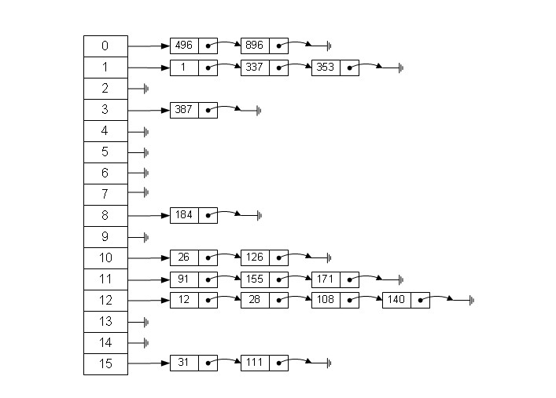

## 数据结构之哈希表

哈希表（Hash Table），也称为散列表，是一种用于存储和查找键值对的数据结构。它通过将键映射到数组中的一个位置来实现快速的插入、查找和删除操作。哈希表利用哈希函数将键转换为数组索引，使得查找操作的时间复杂度接近常数级别。

哈希表的底层是数组，每个数组元素被称为哈希桶（Hash Bucket）或槽位（Slot），每个槽位可以存储一个键值对或一个链表。

哈希表结构图：



哈希表的核心思想是将键映射到数组索引上。当需要插入或查找一个键值对时，首先使用哈希函数对键进行计算，得到对应的哈希值（也称为哈希码）。然后，使用哈希值来确定该键值对在数组中的位置（通常是通过对数组长度取模来计算索引）。如果数组中该位置为空，则可以直接插入键值对；如果该位置不为空，则可能存在哈希冲突，需要处理冲突的情况，常见的处理方法有拉链法和开放地址法。

哈希表的优点包括：

- 快速的插入、查找和删除操作：通过哈希函数和数组索引的映射关系，可以快速定位到键值对所在的位置，具有较高的查找效率。
- 良好的平均时间复杂度：在理想情况下，哈希表的插入、查找和删除操作的平均时间复杂度为常数级别 O(1)。
- 空间利用率高：哈希表利用数组存储键值对，没有额外的指针和链表节点，具有较高的空间利用率。

然而，哈希表也存在一些限制和注意事项：

- 哈希冲突：不同的键可能映射到相同的数组索引，即发生哈希冲突。解决哈希冲突的方法包括拉链法和开放地址法。
- 哈希函数的设计：选择合适的哈希函数可以减少冲突的概率，提高哈希表的性能。
- 内存消耗：为了提高哈希表的性能，需要分配较大的数组空间。当键的数量较少时，可能会导致内存浪费。

总之，哈希表是一种高效的数据结构，适用于需要频繁的插入、查找和删除操作的场景。在实际应用中，哈希表被广泛使用，例如在数据库索引、缓存系统、编程语言中的字典等。

▼下面是使用数组加链表的方式实现哈希表的示例代码

```Java
// 定义一个员工链表
class Employee {
    private int id;
    private String name;
    private Employee next;

    public Employee(int id, String name) {
        this.id = id;
        this.name = name;
        this.next = null;
    }

    public int getId() {
        return id;
    }

    public String getName() {
        return name;
    }

    public void setName(String name) {
        this.name = name;
    }

    public Employee getNext() {
        return next;
    }
    
    public void setNext(Employee next) {
        this.next = next;
    }
}

// 定义一个管理员工链表的哈希表
class HashTable {
    private Employee[] table; // 存储员工链表的数组
    private int size; // 哈希表的大小

    public HashTable(int size) {
        this.size = size;
        table = new Employee[size];
    }

    // 哈希函数，计算键的哈希值，采用简单的取模运算
    private int hashFunction(int id) {
        return id % size;
    }

    // 添加员工
    public void put(Employee employee) {
        int index = hashFunction(employee.getId()); // 计算哈希值(哈希值对应哈希表的索引)
        Employee current = table[index]; // 根据哈希值获取对应的槽位的链表(哈希表也是一个数组，获取对应索引位置的值)
        if (current == null) {
            table[index] = employee; // 当前槽位为空，直接插入新节点
        } else {
            while (current.getNext() != null) {
                if (current.getId() == employee.getId()) {
                    current.setName(employee.getName()); // 更新员工信息
                    return;
                }
                current = current.getNext();
            }
            if (current.getId() == employee.getId()) {
                current.setName(employee.getName()); // 更新员工信息
            } else {
                current.setNext(employee); // 在链表末尾插入新节点
            }
        }
    }

    // 根据id查找员工
    public Employee get(int id) {
        int index = hashFunction(id); // 计算哈希值
        Employee current = table[index]; // 根据哈希值获取对应的槽位的链表
        while (current != null) { // 遍历链表
            if (current.getId() == id) { // 如果找到id，则返回对应的员工信息
                return current;
            }
            current = current.getNext();
        }
        return null; // 没有找到对应员工
    }

    // 根据id删除员工
    public void remove(int id) {
        int index = hashFunction(id); // 计算哈希值
        Employee current = table[index]; // 根据哈希值获取对应的槽位的链表
        if (current == null) {
            return; // 槽位为空，无需删除
        }
        if (current.getId() == id) { // 待删除员工是链表的头节点
            // 当要删除头节点时，需要特殊处理，即更新哈希表槽位的引用，将其指向下一个节点，确保链表的完整性。
            // 直接删除头节点，会导致链表丢失，并且无法通过其他节点访问到链表的其他部分。
            table[index] = current.getNext(); // 删除链表头节点
        } else {
            Employee prev = null;
            while (current != null) {
                if (current.getId() == id) { // 因为头节点的判断在上面判断过了，所以第一次进入while循环时不会进入if判断
                    prev.setNext(current.getNext()); // 删除链表中的当前节点
                    return;
                }
                prev = current;
                current = current.getNext();
            }
        }
    }
}

public class HashTabDemo {
    public static void main(String[] args) {
        HashTable hashTable = new HashTable(10);

        Employee employee1 = new Employee(1, "Alice");
        Employee employee2 = new Employee(2, "Bryan");
        Employee employee3 = new Employee(11, "Cindy");

        hashTable.put(employee1);
        hashTable.put(employee2);
        hashTable.put(employee3);

        System.out.println(hashTable.get(1).getName());   // 输出: Alice
        System.out.println(hashTable.get(2).getName());   // 输出: Bryan
        System.out.println(hashTable.get(3));             // 输出: null

        hashTable.remove(2);
        System.out.println(hashTable.get(2));             // 输出: null
    }
}
```

▼下面使用LinkedList实现的哈希表

在下面的示例代码中，我们定义了一个`HashTable`类来表示哈希表。该类使用一个数组来存储链表，每个链表表示一个哈希桶(bucket)，用于存储键值对。哈希函数采用简单的取模运算来计算键的哈希值，并将键值对存储到对应的哈希桶中。这只是一个简单的哈希表实现的示例代码，实际的哈希表实现可能会更复杂，涉及更多的处理冲突方法、动态扩容等。

```Java
class Employee {
    private int id;
    private String name;

    public Employee(int id, String name) {
        this.id = id;
        this.name = name;
    }

    public int getId() {
        return id;
    }

    public String getName() {
        return name;
    }
}

class HashTable {
    private LinkedList<Employee>[] table; // 存储链表的数组
    private int size; // 哈希表的大小

    public HashTable(int size) {
        this.size = size;
        table = new LinkedList[size];
        Arrays.fill(table, new LinkedList<>()); // 初始化数组中的链表
        //fill()方法用于初始化数组元素
    }

    // 哈希函数，计算键的哈希值，
    private int hashFunction(int id) {
        return id % size;
    }

    // 添加员工
    public void put(Employee employee) {
        int index = hashFunction(employee.getId()); // 计算哈希值
        LinkedList<Employee> bucket = table[index]; // 获取对应的哈希桶
        for (Employee emp : bucket) { // 遍历链表
            if (emp.getId() == employee.getId()) { // 如果id已存在，则更新现有的员工信息
                emp = employee;
                return;
            }
        }
        // 员工不存在，则添加新员工到链表中
        bucket.add(employee);
    }

    // 根据id查找员工
    public Employee get(int id) {
        int index = hashFunction(id); // 计算哈希值
        LinkedList<Employee> bucket = table[index]; // 获取对应的哈希桶
        for (Employee emp : bucket) { // 遍历链表
            if (emp.getId() == id) { // 如果找到id，则返回对应的员工信息
                return emp;
            }
        }
        return null; // 没有找到对应员工
    }

    // 删除员工信息
    public void remove(int id) {
        int index = hashFunction(id); // 计算哈希值
        LinkedList<Employee> bucket = table[index]; // 获取对应的哈希桶
        for (Employee emp : bucket) { // 遍历链表
            if (emp.getId() == id) { // 如果找到id，则从链表中删除对应的员工信息
                bucket.remove(emp);
                return;
            }
        }
    }
}

public class HashTabDemo {
    public static void main(String[] args) {
        HashTable hashTable = new HashTable(10);

        Employee employee1 = new Employee(1, "Alice");
        Employee employee2 = new Employee(2, "Bryan");
        Employee employee3 = new Employee(11, "Cindy");

        hashTable.put(employee1);
        hashTable.put(employee2);
        hashTable.put(employee3);

        System.out.println(hashTable.get(1).getName());   // 输出: Alice
        System.out.println(hashTable.get(2).getName());   // 输出: Bryan
        System.out.println(hashTable.get(3));             // 输出: null

        hashTable.remove(2);
        System.out.println(hashTable.get(2));             // 输出: null
    }
}
```

