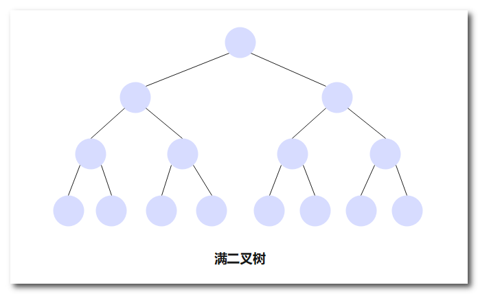
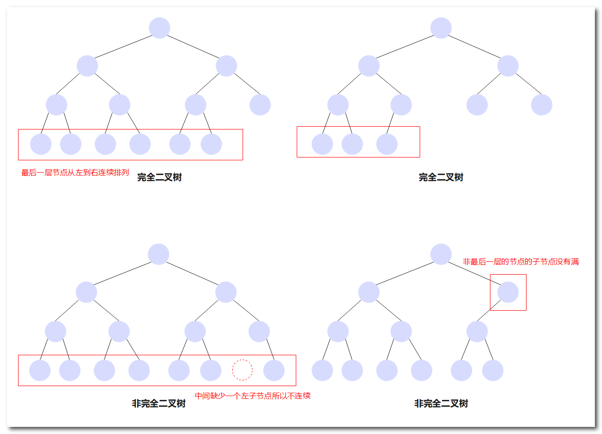
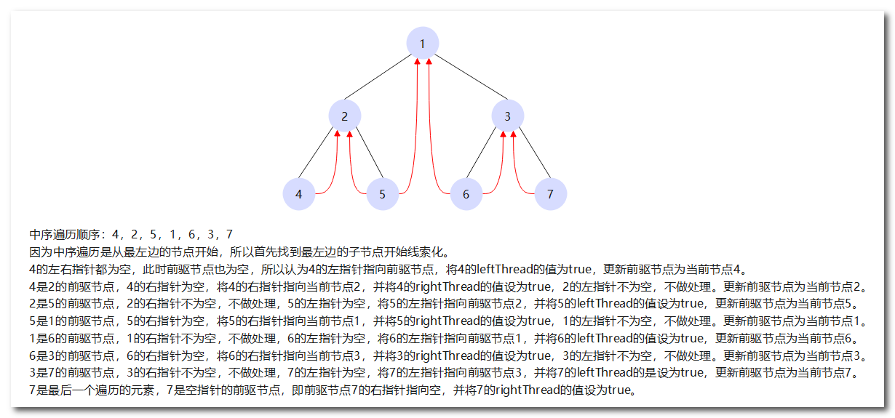
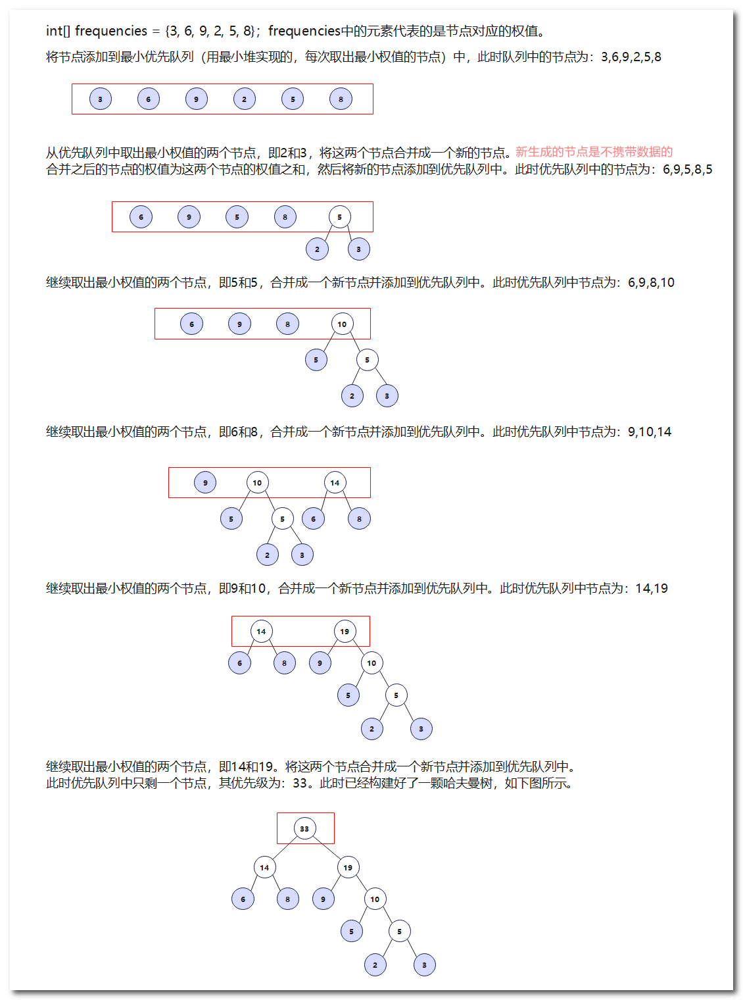
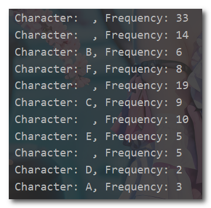
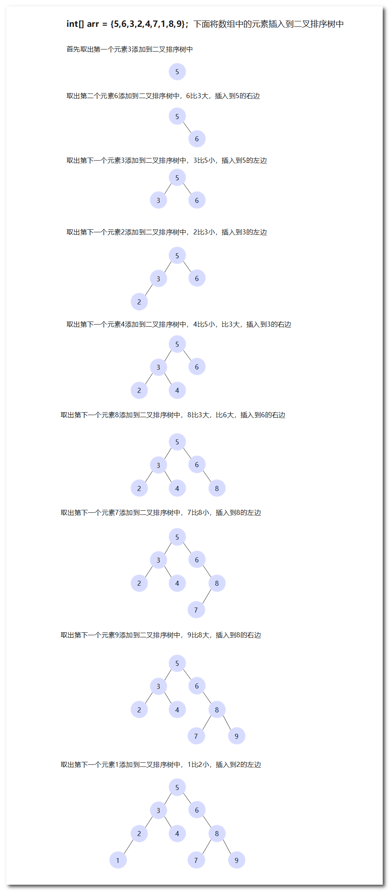
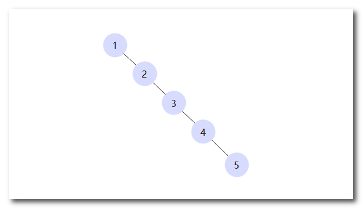

## 数据结构之二叉树

二叉树（Binary Tree）是一种常见的树状数据结构，它由一组节点组成，每个节点最多有两个子节点，分别称为左子节点和右子节点。

以下是对二叉树的介绍：

1. 根节点（Root Node）：二叉树的顶部节点，它没有父节点。从根节点开始，可以通过左子节点和右子节点向下访问其他节点。
2. 内部节点（Internal Node）：除了根节点之外，其他具有至少一个父节点和一个子节点的节点被称为内部节点。
3. 叶节点（Leaf Node）：没有子节点的节点称为叶节点，也被称为终端节点或叶子节点。叶节点是二叉树中最底层的节点。
4. 子树（Subtree）：二叉树中的任何节点都可以看作是一个子树的根节点，它包括该节点及其所有子节点和后代节点。
5. 二叉树的分类：
   - 满二叉树（Full Binary Tree）：除了叶节点外，每个节点都有两个子节点，并且所有叶节点在同一层级上。
   - 完全二叉树（Complete Binary Tree）：除了最后一层外，其他层都是满的，并且最后一层的节点依次从左到右排列。
   - 平衡二叉树（Balanced Binary Tree）：左右子树的高度差不超过1的二叉树。
   - 二叉搜索树（Binary Search Tree）：也叫排序二叉树，左子节点的值小于根节点的值，右子节点的值大于根节点的值。
6. 二叉树的遍历方式：
   - 前序遍历（Preorder Traversal）：根节点 -> 左子树 -> 右子树。先访问根节点，然后递归地遍历左子树和右子树。
   - 中序遍历（Inorder Traversal）：左子树 -> 根节点 -> 右子树。先递归地遍历左子树，然后访问根节点，最后递归遍历右子树。
   - 后序遍历（Postorder Traversal）：左子树 -> 右子树 -> 根节点。先递归地遍历左子树和右子树，然后访问根节点。
   - 层序遍历（Level Order Traversal）：逐层从上到下，从左到右遍历。按照层级顺序依次访问二叉树的所有节点。

满二叉树示意图：



完全二叉树示意图：




### 普通二叉树

▼下面是普通二叉树的示例代码

```Java
class TreeNode {
    int value;          // 节点值
    TreeNode left;      // 左子节点
    TreeNode right;     // 右子节点

    // 构造函数
    public TreeNode(int value) {
        this.value = value;
        this.left = null;
        this.right = null;
    }
}

class BinaryTree {
    private TreeNode root;  // 根节点

    // 构造函数
    public BinaryTree() {
        this.root = null;
    }

    // 插入节点
    public void insert(int value) {
        root = insertNode(root, value);
    }

    // 递归插入节点
    private TreeNode insertNode(TreeNode node, int value) {
        // 如果节点为空，说明是插入的位置，创建新节点并返回
        if (node == null) {
            return new TreeNode(value);
        }

        // 通过比较节点值确定插入的位置
        // 优先插入左子节点
        if (node.left == null) {
            node.left = insertNode(node.left, value);
        }
        // 如果左子节点已存在，则插入右子节点
        else {
            node.right = insertNode(node.right, value);
        }

        return node;
    }

    // 查找节点
    public TreeNode find(int value) {
        return findNode(root, value);
    }

    // 递归查找节点
    private TreeNode findNode(TreeNode node, int value) {
        // 如果节点为空或者节点值等于目标值，返回当前节点
        if (node == null || node.value == value) {
            return node;
        }

        // 在左子树中递归查找
        if (node.left != null) { // 先判断左子节点是否为空
            TreeNode leftResult = findNode(node.left, value);
            if (leftResult != null) { // 
                return leftResult;
            }
        }

        // 在右子树中递归查找
        if (node.right != null) {
            TreeNode rightResult = findNode(node.right, value);
            if (rightResult != null) {
                return rightResult;
            }
        }

        // 如果左右子树都没有找到，返回null
        return null;
    }

    // 删除节点
    public void delete(int value) {
        root = deleteNode(root, value);
    }

    // 递归删除节点
    // 删除节点后会返回一个节点，如果删除的节点左右都有节点，那么将该节点的右子树中最小的节点与之进行替换，然后返回
    private TreeNode deleteNode(TreeNode node, int value) {
        // 如果节点为空，直接返回null
        if (node == null) {
            return null;
        }

        // 如果找到目标值，进行删除操作
        if (node.value == value) {
            // 如果节点没有子节点，直接返回null
            if (node.left == null && node.right == null) {
                return null;
            }
            // 如果节点只有左子节点，返回左子节点
            else if (node.left != null && node.right == null) {
                return node.left;
            }
            // 如果节点只有右子节点，返回右子节点
            else if (node.left == null && node.right != null) {
                return node.right;
            }
            // 如果节点有左右子节点，找到右子树中的最小节点替换
            else {
                TreeNode minNode = findMinNode(node.right);// 找到最小节点
                node.value = minNode.value;// 将最小节点的值赋给当前节点
                node.right = deleteNode(node.right, minNode.value);// 递归将最小节点删除，这样就达成了替换的目的
                return node;
            }
        }

        // 在左子树中递归删除
        // 这里的删除操作是在原来的节点上进行修改引用，当前递归删除左节点，所以需要将删除后返回的节点赋给当前递归的左节点
        node.left = deleteNode(node.left, value);

        // 在右子树中递归删除
        node.right = deleteNode(node.right, value);

        return node;
    }

    // 查找最小节点（这里还是认为左节点小于右节点）
    private TreeNode findMinNode(TreeNode node) {
        if (node.left == null) {
            return node;
        } else {
            return findMinNode(node.left);
        }
    }

    // 前序遍历
    public void preorderTraversal(TreeNode node) {
        if (node != null) {
            System.out.print(node.value + " ");  // 先输出当前节点的值
            preorderTraversal(node.left);        // 递归遍历左子树
            preorderTraversal(node.right);       // 递归遍历右子树
        }
    }

    // 中序遍历
    public void inorderTraversal(TreeNode node) {
        if (node != null) {
            inorderTraversal(node.left);         // 递归遍历左子树
            System.out.print(node.value + " ");  // 输出当前节点的值
            inorderTraversal(node.right);        // 递归遍历右子树
        }
    }

    // 后序遍历
    public void postorderTraversal(TreeNode node) {
        if (node != null) {
            postorderTraversal(node.left);       // 递归遍历左子树
            postorderTraversal(node.right);      // 递归遍历右子树
            System.out.print(node.value + " ");  // 输出当前节点的值
        }
    }
}

public class Main {
    public static void main(String[] args) {
        BinaryTree tree = new BinaryTree();

        // 插入节点
        tree.insert(50);
        tree.insert(30);
        tree.insert(70);
        tree.insert(20);
        tree.insert(40);
        tree.insert(60);
        tree.insert(80);

        // 前序遍历
        System.out.println("前序遍历:");
        tree.preorderTraversal(tree.root);

        // 中序遍历
        System.out.println("\n中序遍历:");
        tree.inorderTraversal(tree.root);

        // 后序遍历
        System.out.println("\n后序遍历:");
        tree.postorderTraversal(tree.root);

        // 查找节点
        TreeNode node = tree.find(40);
        if (node != null) {
            System.out.println("\n查找节点: " + node.value);
        } else {
            System.out.println("\n节点不存在");
        }

        // 删除节点
        tree.delete(40);
        System.out.println("\n删除节点后的中序遍历:");
        tree.inorderTraversal(tree.root);
    }
}
```


### 顺序二叉树

顺序二叉树是一种使用数组来表示二叉树的方法，它利用数组的连续内存空间和索引关系来存储二叉树的节点。顺序二叉树通常用于完全二叉树或近似完全二叉树的情况。

对于一个顺序二叉树，节点按照**从上到下、从左到右**的顺序存储在数组中。假设根节点存储在数组索引为0的位置，那么对于任意一个节点在数组中的索引为`i`，它的左子节点的索引为`2i+1`，右子节点的索引为`2i+2`。这样，通过数组的索引关系就可以在不使用指针的情况下找到节点之间的父子关系。

顺序二叉树的优点是节省存储空间，**不需要额外的指针来表示节点间的关系**。缺点是如果树的高度较大，而实际节点较少，会造成较多的空间浪费。此外，对于删除或插入节点的操作较为复杂，需要进行数组元素的移动。

▼下面是顺序二叉树的示例代码

```Java
class ArrayBinaryTree {
    private int[] array;
    private int size;
    
    public ArrayBinaryTree(int[] array) {
        this.array = array;
        this.size = array.length;
    }
    
    /**
     * 前序遍历顺序二叉树
     */
    public void preOrderTraversal() {
        preOrderTraversal(0);
    }
    
    /**
     * 前序遍历递归函数
     * @param index 当前节点在数组中的索引
     */
    private void preOrderTraversal(int index) {
        if (index < size) {
            System.out.print(array[index] + " ");  // 输出当前节点的值
            preOrderTraversal(2 * index + 1);      // 遍历左子节点
            preOrderTraversal(2 * index + 2);      // 遍历右子节点
        }
    }
    
    /**
     * 中序遍历顺序二叉树
     */
    public void inOrderTraversal() {
        inOrderTraversal(0);
    }
    
    /**
     * 中序遍历递归函数
     * @param index 当前节点在数组中的索引
     */
    private void inOrderTraversal(int index) {
        if (index < size) {
            inOrderTraversal(2 * index + 1);      // 遍历左子节点
            System.out.print(array[index] + " ");  // 输出当前节点的值
            inOrderTraversal(2 * index + 2);      // 遍历右子节点
        }
    }
    
    /**
     * 后序遍历顺序二叉树
     */
    public void postOrderTraversal() {
        postOrderTraversal(0);
    }
    
    /**
     * 后序遍历递归函数
     * @param index 当前节点在数组中的索引
     */
    private void postOrderTraversal(int index) {
        if (index < size) {
            postOrderTraversal(2 * index + 1);     // 遍历左子节点
            postOrderTraversal(2 * index + 2);     // 遍历右子节点
            System.out.print(array[index] + " "); // 输出当前节点的值
        }
    }
}

public class ArrayBinaryTreeDemo {
    public static void main(String[] args) {
        int[] array = {1, 2, 3, 4, 5, 6, 7};
        ArrayBinaryTree tree = new ArrayBinaryTree(array);

        System.out.print("Pre-order traversal: ");
        tree.preOrderTraversal(); // 输出：1 2 4 5 3 6 7

        System.out.print("\nIn-order traversal: ");
        tree.inOrderTraversal(); // 输出：4 2 5 1 6 3 7

        System.out.print("\nPost-order traversal: ");
        tree.postOrderTraversal(); // 输出：4 5 2 6 7 3 1

    }
}
```


### 线索二叉树

我们知道，叶子节点的左指针和右指针都是空的。在n个节点的二叉树中，一共有2n个指针，除了根节点，每一个节点都会被父节点的左指针或右指针指向，相当于整个二叉树使用了n-1个指针，剩下的**`2n-(n-1) = n+1`**个指针是空域，即没有使用的。使用线索化二叉树充分利用这些空域，减少内存的浪费。

线索化二叉树是一种对二叉树进行优化的方法，通过在二叉树节点中添加线索（线索表示节点的前驱和后继），可以实现在不使用递归和栈的情况下对二叉树进行遍历。

具体实现线索化二叉树的步骤如下：

1. 定义线索化二叉树节点的数据结构，通常除了存储节点值之外，还需要添加指向前驱和后继节点的指针。
2. 遍历二叉树并进行线索化，可以选择使用中序遍历。
   - 对于当前节点，如果其左子节点为空，将其左指针指向前驱节点，并将左线索标志设置为true。
   - 对于当前节点的前驱节点（上一个遍历的节点），如果其右子节点为空，将其右指针指向当前节点，并将右线索标志设置为true。
3. 在线索化后的二叉树中，可以通过线索直接访问前驱和后继节点，无需通过递归或栈的方式进行遍历。

线索化二叉树图解：



下面是一个示例代码，演示如何实现线索化二叉树的中序遍历：

```java
class ThreadedBinaryTree {
    private Node root;  // 根节点
    private Node prev; // 前驱节点

    public ThreadedBinaryTree(Node root) {
        this.root = root;
        this.prev = null;
    }

    // 节点类
    private static class Node {
        int data;            // 节点值
        Node left, right;    // 左子节点和右子节点
        boolean leftThread;  // 左线索标志
        boolean rightThread; // 右线索标志

        public Node(int data) {
            this.data = data;
            this.left = null;
            this.right = null;
            this.leftThread = false;
            this.rightThread = false;
        }
    }

    // 线索化二叉树的中序遍历
    public void inOrderTraversal() {
        Node current = getLeftMostNode(root);  // 获取最左边的节点

        while (current != null) {
            System.out.print(current.data + " ");  // 输出当前节点的值

            // 如果当前节点有右线索，直接访问后继节点
            if (current.rightThread) {
                current = current.right;
            } else {
                // 否则，找到当前节点的右子树中的最左边节点（因为中序遍历就是先从左节点开始的）
                // 为什么是右子树？因为一直往右访问节点。
                current = getLeftMostNode(current.right);
            }
        }
    }

    // 获取以指定节点为根的子树中最左边的节点
    private Node getLeftMostNode(Node node) {
        if (node == null) {
            return null;
        }

        while (node.left != null && !node.leftThread) {
            node = node.left;
        }

        return node;
    }

    // 线索化二叉树
    public void threadTree() {
        threadTree(root);
    }

    // 线索化二叉树递归函数
    private void threadTree(Node node) {
        if (node == null) {
            return;
        }

        // 递归线索化左子树
        threadTree(node.left);

        // 如果当前节点的左子节点为空，将其左指针指向前驱节点，并将左线索标志设置为true
        if (node.left == null) {
            node.left = prev;
            node.leftThread = true;
        }

        // 如果前驱节点的右子节点为空，将其右指针指向当前节点，并将右线索标志设置为true
        if (prev != null && prev.right == null) {
            prev.right = node;
            prev.rightThread = true;
        }

        // 更新前驱节点为当前节点
        prev = node;

        // 递归线索化右子树
        threadTree(node.right);
    }

    public static void main(String[] args) {

        // 构造二叉树
        Node root = new Node(1);
        root.left = new Node(2);
        root.right = new Node(3);
        root.left.left = new Node(4);
        root.left.right = new Node(5);
        root.right.left = new Node(6);
        root.right.right = new Node(7);

        ThreadedBinaryTree threadTree = new ThreadedBinaryTree(root);
        // 线索化二叉树
        threadTree.threadTree();
        // 中序遍历线索化二叉树
        System.out.print("In-order traversal: ");
        threadTree.inOrderTraversal();  // 输出：4 2 5 1 6 3 7
    }
}
```


### 哈夫曼树

哈夫曼树（Huffman Tree），也称为最优二叉树（Optimal Binary Tree），是一种特殊的二叉树，用于数据压缩和编码。它的主要特点是，树中的叶子节点表示要编码的字符，而树中的非叶子节点表示字符的编码规则。哈夫曼树的构建基于字符的出现频率，通过频率来确定字符的权重，从而构建一个带有最小权重的树。

哈夫曼树的构建过程具体步骤如下：

1. 统计字符频率：遍历待编码的文本或字符序列，统计每个字符出现的频率（或权值）。
2. 创建叶节点：根据字符频率创建相应的叶节点，每个叶节点包含一个字符和其对应的频率。
3. 构建最小堆：将所有叶节点作为初始节点集合，以频率作为关键字构建一个最小优先队列（最小堆）。每个节点的频率作为其优先级，频率最低的节点在堆顶。
4. 合并节点：从最小堆中选择两个频率最低的节点（最小优先级），将它们合并为一个新的节点，并将新节点插入到最小优先队列中。合并后的节点的频率等于两个子节点频率之和。
5. 更新最小堆：删除已合并的两个子节点，并将新合并的节点插入到最小堆中。重复此步骤，直到最小堆中只剩下一个节点，即哈夫曼树的根节点。
6. 哈夫曼树构建完成：最终得到的最小堆中剩下的唯一节点就是哈夫曼树的根节点。

哈夫曼树构建过程图解：



哈夫曼树的主要应用是数据压缩，特别是针对频率不同的字符进行编码。由于频率高的字符被赋予了较短的编码，而频率低的字符被赋予了较长的编码，所以可以有效地减少编码后的数据长度，实现更高效的数据存储和传输。

在实现哈夫曼树时，可以使用优先队列（Priority Queue）的`poll`操作来选择权重最小的节点，优先队列就是基于最小堆或最大堆实现。`poll`操作在优先队列中获取并删除最值元素，其结果与优先队列的实现方式有关。在使用堆实现的优先队列中，`poll`操作获取并删除堆的根节点，即具有最高优先级的元素。如果是最小堆，则删除的是最小优先级节点；如果是最大堆，则删除的是最大优先级节点。

▼下面是哈夫曼树的代码示例

```Java
class Node implements Comparable<Node> {
    char data; // 字符数据
    int frequency; // 字符出现的频率
    Node left, right; // 左子节点和右子节点

    public Node(char data, int frequency) {
        this.data = data;
        this.frequency = frequency;
        left = null;
        right = null;
    }

    @Override
    // 定义排序
    public int compareTo(Node other) {
        // “我减它->升序，它减我->降序”
        return this.frequency - other.frequency;
    }
}

public class HuffmanTreeDemo {

    /**
     * 构建哈夫曼树
     * @param characters
     * @param frequencies
     * @return
     */
    public static Node buildHuffmanTree(char[] characters, int[] frequencies) {
        PriorityQueue<Node> queue = new PriorityQueue<>();

        // 创建叶子节点并加入优先队列
        for (int i = 0; i < characters.length; i++) {
            Node node = new Node(characters[i], frequencies[i]);
            
            queue.add(node);
        }

        // 构建哈夫曼树
        while (queue.size() > 1) {
            // 选择权重最小的两个节点
            // poll操作是优先队列中的一种操作，用于获取并删除队列中的最值元素。
            Node leftNode = queue.poll();
            Node rightNode = queue.poll();

            // 创建新节点，权重为左右节点的权重之和
            Node parent = new Node('\0', leftNode.frequency + rightNode.frequency);
            parent.left = leftNode;
            parent.right = rightNode;

            // 将新节点加入优先队列
            queue.add(parent);
        }

        // 返回哈夫曼树的根节点
        return queue.poll();
    }

    /**
     * 前序遍历
     * @param root
     */
    public static void preorderTraversal(Node root) {
        if (root == null) {
            return;
        }
        // 打印节点信息
        System.out.println("Character: " + root.data + ", Frequency: " + root.frequency);
        // 遍历左子树
        preorderTraversal(root.left);
        // 遍历右子树
        preorderTraversal(root.right);
    }

    public static void main(String[] args) {
        char[] characters = {'A', 'B', 'C', 'D','E','F'};
        int[] frequencies = {3, 6, 9, 2, 5, 8}; // 上面字符数组中对应字符出现的次数

        // 构建哈夫曼树
        Node root = buildHuffmanTree(characters, frequencies);

        // 前序遍历哈夫曼树
        preorderTraversal(root);

        // 进行后续操作，如生成编码表等
    }
}
```

在上面的代码中，我们首先定义了一个`Node`类表示哈夫曼树的节点。每个节点包含字符数据、字符的频率以及左右子节点。`Node`类实现了`Comparable`接口，以便在优先队列中根据节点的频率进行比较。

然后，我们在`buildHuffmanTree`方法中使用优先队列来构建哈夫曼树。首先，将字符和频率信息转化为叶子节点，并将叶子节点加入优先队列。然后，循环从队列中通过`poll`操作取出权重最小的两个节点，创建一个新节点作为它们的父节点，并将父节点加入队列。重复这个过程，直到队列中只剩下一个节点，即为哈夫曼树的根节点。

上述代码的运行结果：


### 二叉排序树

二叉排序树，也称为二叉搜索树（Binary Search Tree，简称BST），是一种特殊的二叉树结构，它具有以下特点：

1. 每个节点都包含一个关键字（或称为键值），且节点的关键字不重复。
2. 对于任意节点，其左子树中的所有节点的关键字都小于该节点的关键字，而右子树中的所有节点的关键字都大于该节点的关键字。
3. 左子树和右子树也分别是二叉排序树。

这种特性使得二叉排序树具有以下优势：

1. 查找效率高：由于节点按照一定的顺序排列，因此可以利用二叉排序树进行快速的查找操作。在平均情况下，查找一个节点的时间复杂度为O(log n)，其中n是二叉排序树中节点的数量。
2. 插入和删除操作方便：通过比较节点的关键字，可以快速找到要插入或删除的位置，而不需要对整个树进行遍历。
3. 排序功能：通过中序遍历二叉排序树，可以得到一个有序的关键字序列。

然而，二叉排序树的性能也受到树的平衡性的影响。如果树的左右子树高度差较大，会导致树的高度增加，从而影响查找、插入和删除操作的效率。为了解决这个问题，可以采用平衡二叉搜索树，如红黑树和AVL树等，来保持树的平衡性。

▼下面是二叉排序过程图解



▼下面是二叉搜索树的示例代码

```Java
// 定义二叉树节点类
class TreeNode {
    int val;
    TreeNode left; // 左子节点
    TreeNode right; // 右子节点

    public TreeNode(int val) {
        this.val = val;
        left = null;
        right = null;
    }
}

// 定义二叉树类
class BinaryTree {
    TreeNode root;

    public BinaryTree() {
        root = null;
    }

    // 前序遍历
    public void preorderTraversal(TreeNode node) {
        if (node == null) {
            return;
        }

        System.out.print(node.val + " ");  // 访问当前节点
        preorderTraversal(node.left);      // 遍历左子树
        preorderTraversal(node.right);     // 遍历右子树
    }

    // 中序遍历
    public void inorderTraversal(TreeNode node) {
        if (node == null) {
            return;
        }

        inorderTraversal(node.left);       // 遍历左子树
        System.out.print(node.val + " ");  // 访问当前节点
        inorderTraversal(node.right);      // 遍历右子树
    }

    // 后序遍历
    public void postorderTraversal(TreeNode node) {
        if (node == null) {
            return;
        }

        postorderTraversal(node.left);      // 遍历左子树
        postorderTraversal(node.right);     // 遍历右子树
        System.out.print(node.val + " ");   // 访问当前节点
    }

    // 插入节点
    public void insert(int value) {
        root = insertNode(root, value);
    }

    // 递归插入节点
    private TreeNode insertNode(TreeNode node, int value) {
        // 如果节点为空，说明是插入的位置，创建新节点并返回
        if (node == null) {
            return new TreeNode(value);
        }

        // 如果插入的值小于当前节点值，将节点插入到左子树中
        if (value < node.value) {
            node.left = insertNode(node.left, value);
        }
        // 如果插入的值大于等于当前节点值，将节点插入到右子树中
        else {
            node.right = insertNode(node.right, value);
        }

        return node;
    }

    // 查找节点
    public TreeNode find(int value) {
        return findNode(root, value);
    }

    // 递归查找节点
    private TreeNode findNode(TreeNode node, int value) {
        // 如果节点为空或者节点值等于目标值，返回当前节点
        if (node == null || node.value == value) {
            return node;
        }

        // 如果目标值小于当前节点值，继续在左子树中查找
        if (value < node.value) {
            return findNode(node.left, value);
        }
        // 如果目标值大于当前节点值，继续在右子树中查找
        else {
            return findNode(node.right, value);
        }
    }

    // 删除节点
    public void delete(int value) {
        root = deleteNode(root, value);
    }

    // 递归删除节点
    private TreeNode deleteNode(TreeNode node, int value) {
        // 如果节点为空，说明已经遍历到叶子节点仍未找到目标值，直接返回null
        if (node == null) {
            return null;
        }

        // 如果目标值小于当前节点值，继续在左子树中删除
        if (value < node.value) {
            node.left = deleteNode(node.left, value);
        }
        // 如果目标值大于当前节点值，继续在右子树中删除
        else if (value > node.value) {
            node.right = deleteNode(node.right, value);
        }
        // 找到目标值，进行删除操作
        else {
            // 如果目标节点没有子节点，直接将其置为null
            if (node.left == null && node.right == null) {
                node = null;
            }
            // 如果目标节点只有左子节点，将其替换为左子节点
            else if (node.left != null && node.right == null) {
                node = node.left;
            }
            // 如果目标节点只有右子节点，将其替换为右子节点
            else if (node.left == null && node.right != null) {
                node = node.right;
            }
            // 如果目标节点有左右子节点，找到其右子树中的最小节点替换
            else {
                TreeNode minNode = findMinNode(node.right);  // 找到右子树中的最小节点
                node.value = minNode.value;  // 将最小节点的值替换到目标节点
                node.right = deleteNode(node.right, minNode.value);  // 递归删除最小节点
            }
        }

        return node;
    }

    // 查找最小节点
    private TreeNode findMinNode(TreeNode node) {
        if (node.left == null) {
            return node;
        } else {
            return findMinNode(node.left);
        }
    }
}

// 测试代码
public class Main {
    public static void main(String[] args) {
        BinaryTree tree = new BinaryTree();

        // 插入节点
        tree.insert(50);
        tree.insert(30);
        tree.insert(70);
        tree.insert(20);
        tree.insert(40);
        tree.insert(60);
        tree.insert(80);

        // 前序遍历
        System.out.println("前序遍历:");
        tree.preorderTraversal(tree.root);

        // 中序遍历
        System.out.println("\n中序遍历:");
        tree.inorderTraversal(tree.root);

        // 后序遍历
        System.out.println("\n后序遍历:");
        tree.postorderTraversal(tree.root);

        // 查找节点
        TreeNode node = tree.find(40);
        if (node != null) {
            System.out.println("\n查找节点: " + node.value);
        } else {
            System.out.println("\n节点不存在");
        }

        // 删除节点
        tree.delete(40);
        System.out.println("\n删除节点后的中序遍历:");
        tree.inorderTraversal(tree.root);
    }
}
```

**二叉排序树存在的问题**：

如果按照有序序列构建二叉排序树，或者是按照有序序列插入节点，可能会形成极端不平衡的二叉排序树，也称为链表式二叉树（List-like Binary Tree）。链表式二叉树的高度为N-1，其中N是节点的数量，这导致了所有的查找、插入和删除操作的时间复杂度变为O(N)，失去了二叉排序树的优势，如下图所示。使用平衡二叉树可以解决这个问题。




### 平衡二叉树

平衡二叉树（Balanced Binary Tree），也称为AVL树，是一种自平衡的二叉搜索树。在平衡二叉树中，任何节点的左子树和右子树的高度差（平衡因子）不超过1。这种特性使得平衡二叉树具有较快的查找、插入和删除操作的平均时间复杂度。

平衡二叉树具有以下特点：
1. 每个节点都有一个平衡因子，即左子树高度减去右子树高度的值，平衡因子的绝对值不超过1。
2. 平衡二叉树的左子树和右子树都是平衡二叉树。
3. 平衡二叉树的左子树中的节点值都小于根节点的值，右子树中的节点值都大于根节点的值。

树的高度是指从根节点到最远叶子节点的路径上经过的节点数（边数），可以等同于树的层数。

为了保持平衡二叉树的平衡性，需要在插入和删除节点时进行相应的调整。常用的调整操作包括左旋、右旋、左右旋和右左旋等。

如果当前节点的右子树的高度减左子树的高度大于1，那么就需要进行左旋转，反之则需要进行右旋转。

下面介绍几种常见情况下需要进行左旋转的情况：

1. 插入节点导致右子树过重
2. 删除节点导致右子树过重
3. 右子树的右子树过重


**左旋（Left Rotation）操作步骤**：

> 1. 确定旋转的节点和子树：如下示意图中需要对 `A` 进行左旋转，`B` 是 `A` 的右子节点，`C` 是 `B` 的左子节点。
> 2. 调整连接关系：
>    - 将当前节点 `A` 的右子树 `B` 的左子树（节点 `C`）设为 `A` 的右子树。
>    - 将 当前节点 `A` 设为 当前节点的右子树 `B` 的左子树。
> 3. 更新父节点的连接关系： 如果节点 `A` 有父节点，还需要将 `B` 设为 `A` 的父节点的相应子节点。
>
> 下面是左旋转的示意图：
>
> ```
>     A                           B
>      \                         / \
>       B            ==>        A   D
>      / \                       \
>     C   D                       C
> ```


**右旋转操作步骤**：

> 如下示意图中需要对A节点右旋转：
>
> - 将当前节点 `A` 的左子树 `B` 的右子树（节点 `E`）设为 `A` 的左子树。
>
> - 将 当前节点 `A` 设为 当前节点的左子树 `B` 的右子树。
>
> 下面是右旋转的示意图：
>
> ```
>            A                         B
>           / \                       / \
>          B   C       ----->        D   A
>         / \                       /   / \
>        D   E                     F   E   C
>       /
>      F
> ```


下面是双旋转示意图

> 当需要进行右旋转的节点 `A` 的左子树的右子树的高度大于左子树，即图中 `B` 节点的右子树高度高于左子树，此时需要将 `B` 节点左旋转，然后再进行将 `A` 节点进行右旋转。
>
> ```
>            A                         A                         E
>           / \                       / \                       / \
>          B   C       ----->        E   C       ----->        B   A
>         / \                       / \                       / \ / \
>        D   E                     B   G                     D   FG  C
>           / \                   / \ 
>          F   G                 D   F
> ```


通过左旋转操作，可以将过重的右子树调整为平衡状态，使得树的结构保持相对平衡。左旋转操作可以保持平衡二叉树的平衡性，并提高查找、插入和删除等操作的效率。 	 	

平衡二叉树的优点是能够在最坏情况下保证较好的时间复杂度，使得查找、插入和删除等操作的平均时间复杂度保持在O(log n)级别。然而，平衡二叉树的缺点是需要额外的平衡因子来维护树的平衡性，增加了额外的空间开销，并且插入和删除节点时的调整操作可能会导致性能的下降。

常见的平衡二叉树实现包括AVL树、红黑树等。这些树结构在各种应用中被广泛使用，例如数据库索引、集合操作等。

▼下面是平衡二叉树的示例代码

```Java
class Node {
    int key;
    int height;
    Node left;
    Node right;

    public Node(int key) {
        this.key = key;
        this.height = 1;
        this.left = null;
        this.right = null;
    }
}

class AVLTree {
    private Node root;

    // 获取节点的高度
    private int getHeight(Node node) {
        if (node == null) {
            return 0;
        }
        return node.height;
    }

    // 更新节点的高度
    /*
     *树的高度通常定义为树中从根节点到最远叶子节点的路径上的节点数。对于一个节点来说，它的高度是以它为根的子树的高度加1。
     具体来说，对于一棵非空树，它的高度可以通过以下方式计算：
     如果树只有一个节点（即根节点），则树的高度为1。
     否则，树的高度等于根节点的高度加上左子树和右子树中较大的那棵子树的高度。
     即树的高度 = max(左子树的高度, 右子树的高度) + 1。
     */
    private void updateHeight(Node node) {
        node.height = 1 + Math.max(getHeight(node.left), getHeight(node.right));
    }

    // 获取节点的平衡因子
    private int getBalanceFactor(Node node) {
        if (node == null) {
            return 0;
        }
        return getHeight(node.left) - getHeight(node.right);
    }

    // 左旋转
    private Node leftRotate(Node node) {
        Node newRoot = node.right;
        Node temp = newRoot.left;

        newRoot.left = node;
        node.right = temp;

        updateHeight(node);
        updateHeight(newRoot);

        return newRoot;
    }

    // 右旋转
    private Node rightRotate(Node node) {
        Node newRoot = node.left;
        Node temp = newRoot.right;

        newRoot.right = node;
        node.left = temp;

        updateHeight(node);
        updateHeight(newRoot);

        return newRoot;
    }

    // 插入节点
    public void insert(int key) {
        root = insertNode(root, key);
    }

    private Node insertNode(Node node, int key) {
        if (node == null) {
            return new Node(key);
        }

        if (key < node.key) {
            node.left = insertNode(node.left, key);
        } else if (key > node.key) {
            node.right = insertNode(node.right, key);
        } else {
            // 如果树中已经存在相同的节点，可以根据实际需求决定是替换还是忽略
            return node;
        }

        updateHeight(node);
        int balanceFactor = getBalanceFactor(node);

        // 如果插入节点导致不平衡，则进行相应的旋转操作
        if (balanceFactor > 1 && key < node.left.key) {
            return rightRotate(node);
        }
        if (balanceFactor < -1 && key > node.right.key) {
            return leftRotate(node);
        }
        if (balanceFactor > 1 && key > node.left.key) {
            node.left = leftRotate(node.left);
            return rightRotate(node);
        }
        if (balanceFactor < -1 && key < node.right.key) {
            node.right = rightRotate(node.right);
            return leftRotate(node);
        }

        return node;
    }

    // 删除节点
    public void delete(int key) {
        root = deleteNode(root, key);
    }

    private Node deleteNode(Node node, int key) {
        if (node == null) {
            return null;
        }

        if (key < node.key) {
            node.left = deleteNode(node.left, key);
        } else if (key > node.key) {
            node.right = deleteNode(node.right, key);
        } else {
            // 找到要删除的节点

            // 情况1：节点没有子节点或只有一个子节点
            if (node.left == null || node.right == null) {
                Node temp = (node.left != null) ? node.left : node.right;

                // 没有子节点的情况
                if (temp == null) {
                    temp = node;
                    node = null;
                } else { // 有一个子节点的情况
                    node = temp;
                }
            } else { // 情况2：节点有两个子节点
                Node temp = getMinValueNode(node.right);
                node.key = temp.key;
                node.right = deleteNode(node.right, temp.key);
            }
        }

        if (node == null) {
            return null;
        }

        updateHeight(node);
        int balanceFactor = getBalanceFactor(node);

        // 如果删除节点导致不平衡，则进行相应的旋转操作
        if (balanceFactor > 1 && getBalanceFactor(node.left) >= 0) {
            return rightRotate(node);
        }
        if (balanceFactor < -1 && getBalanceFactor(node.right) <= 0) {
            return leftRotate(node);
        }
        if (balanceFactor > 1 && getBalanceFactor(node.left) < 0) {
            node.left = leftRotate(node.left);
            return rightRotate(node);
        }
        if (balanceFactor < -1 && getBalanceFactor(node.right) > 0) {
            node.right = rightRotate(node.right);
            return leftRotate(node);
        }

        return node;
    }

    // 查找节点
    public Node search(int key) {
        return searchNode(root, key);
    }

    private Node searchNode(Node node, int key) {
        if (node == null || node.key == key) {
            return node;
        }

        if (key < node.key) {
            return searchNode(node.left, key);
        } else {
            return searchNode(node.right, key);
        }
    }

    // 获取最小值节点
    private Node getMinValueNode(Node node) {
        Node current = node;
        while (current.left != null) {
            current = current.left;
        }
        return current;
    }
}
```


### 红黑树

红黑树（Red-Black Tree）是一种自平衡的二叉查找树，它在插入和删除操作后会通过重新排列和染色节点来保持树的平衡。红黑树的设计旨在确保树的高度较低，从而提供高效的查找、插入和删除操作。

红黑树具有以下特性：

1. 节点颜色：每个节点要么是红色，要么是黑色。
2. 根节点颜色：根节点必须为黑色。
3. 叶子节点：叶子节点（NIL节点或空节点）被视为黑色。
4. 红色节点规则：如果一个节点是红色，则它的两个子节点都必须是黑色。也就是说，红色节点不能连续存在。
5. 黑色节点规则：对于每个节点，从该节点到其后代的所有叶子节点的简单路径上，黑色节点的数量相同。这个特性确保了树的平衡。

通过这些特性，红黑树能够自动调整自身结构，以保持平衡。当插入或删除节点时，红黑树会执行一系列的旋转和重新染色操作，以确保树的平衡性质被维护。这样可以保持树的高度相对较低，使得查找、插入和删除等操作的时间复杂度保持在对数级别。

红黑树被广泛应用于各种领域，特别是在实现高效的字典、关联数组和数据库索引等数据结构和算法中。它是一种强大且高效的数据结构，能够提供稳定的性能和良好的可扩展性。
