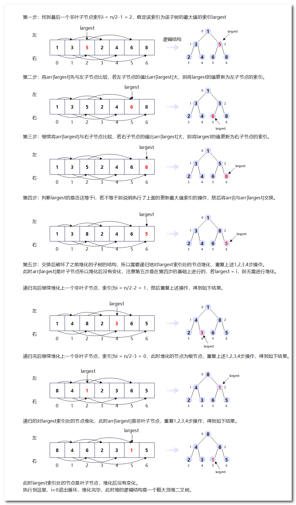
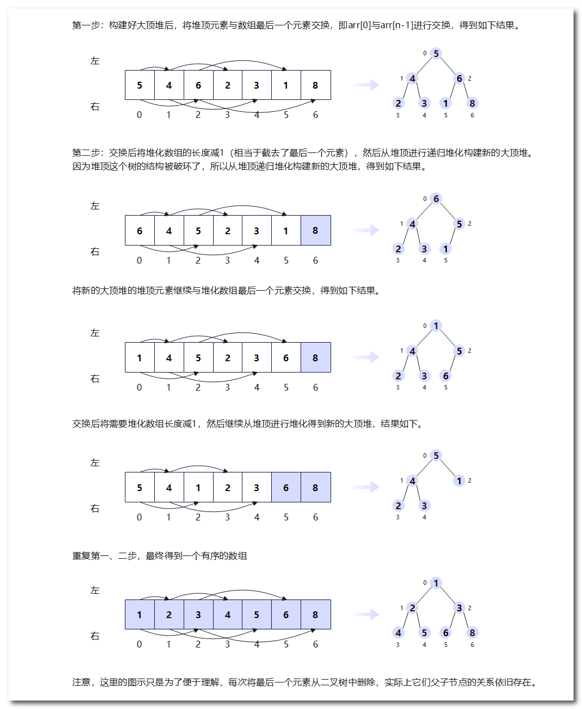

## 数据结构之堆

堆（Heap）是一种特殊的树形数据结构，它是一棵完全二叉树或近似完全二叉树。

堆与普通树的区别在于其具有以下特点：

1. 完全二叉树结构：堆是一种完全二叉树或近似完全二叉树，意味着除了最后一层外，其他层的节点都必须填满。
2. 堆属性：堆的节点具有特定的顺序关系，即根节点与其子节点之间存在一定的大小关系，可以是大顶堆或小顶堆。在大顶堆中，每个节点的值都大于或等于其子节点的值；而在小顶堆中，每个节点的值都小于或等于其子节点的值。
3. 无序性：堆中的节点在同一层级内没有顺序要求，即同一层级的节点之间不需要按照任何特定的顺序排列。

堆分为最大堆和最小堆两种类型：

- 最大堆（Max Heap）是一种满足以下条件的堆：对于每个节点i，节点i的值大于或等于其父节点的值。


- 最小堆（Min Heap）是一种满足以下条件的堆：对于每个节点i，节点i的值小于或等于其父节点的值。


堆的主要特点是根节点具有最大或最小的值，因此可以高效地获取最大或最小元素。堆常用于实现优先级队列、排序算法（如堆排序）以及解决一些具有优先级相关需求的问题。

堆的操作包括插入（向堆中添加元素）、删除（从堆中删除指定元素）、获取堆顶元素（即最大或最小元素）、堆化（调整堆的结构以满足堆的性质）等。插入和删除操作的时间复杂度为O(log N)，获取堆顶元素的时间复杂度为O(1)。

在堆的实现中，通常使用数组来表示堆的结构，通过根据节点索引计算父节点和子节点的索引来实现堆的各种操作。堆的构建过程可以通过逐个插入元素或者从一个无序数组中构建的方式进行。

堆在算法和数据结构中具有重要的应用，它可以高效地解决一些需要快速获取最大或最小值的问题，并被广泛应用于各种领域，如操作系统调度、图像处理、网络路由等。


### 最小堆

构建最小堆的详细步骤如下：

1. 创建一个数组来表示堆，数组下标从0开始。
2. 将要构建最小堆的数据依次存入数组中。
3. 从数组的最后一个非叶子节点开始，向前依次对每个非叶子节点进行下沉操作（堆化操作）。
4. 下沉操作的步骤如下：
   - 比较当前节点与其左右子节点的值，找到其中最小的节点。
   - 如果当前节点的值大于最小子节点的值，交换它们的位置。
   - 将当前节点更新为最小子节点的位置。
   - 继续向下比较，直到当前节点小于或等于其左右子节点的值，或者已经到达叶子节点。
5. 完成对所有非叶子节点的下沉操作后，最小堆构建完成。

下面是一个示例代码，展示如何构建最小堆：

```java
public class MinHeap {
    private int[] heap;
    private int size;

    public MinHeap(int capacity) {
        heap = new int[capacity];
        size = 0;
    }

    public void buildHeap(int[] array) {
        if (array.length > heap.length) {
            throw new IllegalArgumentException("Array size exceeds heap capacity");
        }

        // 将数组中的元素复制到堆数组中
        System.arraycopy(array, 0, heap, 0, array.length);
        size = array.length;

        // 从最后一个非叶子节点开始进行下沉操作
        for (int i = (size - 1) / 2; i >= 0; i--) {
            heapifyDown(i);
        }
    }

    // 堆化
    private void heapifyDown(int index) {
        int smallest = index;
        int left = 2 * index + 1;
        int right = 2 * index + 2;

        // 比较当前节点与左子节点的值
        if (left < size && heap[left] < heap[smallest]) {
            smallest = left;
        }

        // 比较当前节点与右子节点的值
        if (right < size && heap[right] < heap[smallest]) {
            smallest = right;
        }

        // 如果当前节点的值大于最小子节点的值，则交换它们的位置
        if (smallest != index) {
            swap(index, smallest);
            // 递归进行下沉操作
            heapifyDown(smallest);
        }
    }

    private void swap(int i, int j) {
        int temp = heap[i];
        heap[i] = heap[j];
        heap[j] = temp;
    }

    // 其他方法和逻辑...
}
```


### 最大堆

构建最大堆的步骤与构建最小堆的步骤类似，只是在比较和交换元素的过程中会使用相反的逻辑。下面是构建最大堆的详细步骤：

1. 创建一个数组来表示堆，数组下标从0开始。
2. 将要构建最大堆的数据依次存入数组中。
3. 从数组的最后一个非叶子节点开始，向前依次对每个非叶子节点进行下沉操作。
4. 下沉操作的步骤如下：
   - 比较当前节点与其左右子节点的值，找到其中最大的节点。
   - 如果当前节点的值小于最大子节点的值，交换它们的位置。
   - 将当前节点更新为最大子节点的位置。
   - 继续向下比较，直到当前节点大于或等于其左右子节点的值，或者已经到达叶子节点。
5. 完成对所有非叶子节点的下沉操作后，最大堆构建完成。

下面是一个示例代码，展示如何构建最大堆：

```java
public class MaxHeap {
    private int[] heap;
    private int size;

    public MaxHeap(int capacity) {
        heap = new int[capacity];
        size = 0;
    }

    public void buildHeap(int[] array) {
        if (array.length > heap.length) {
            throw new IllegalArgumentException("Array size exceeds heap capacity");
        }

        // 将数组中的元素复制到堆数组中
        System.arraycopy(array, 0, heap, 0, array.length);
        size = array.length;

        // 从最后一个非叶子节点开始进行下沉操作
        for (int i = (size - 1) / 2; i >= 0; i--) {
            heapifyDown(i);
        }
    }

    // 堆化
    private void heapifyDown(int index) {
        int largest = index;
        int left = 2 * index + 1;
        int right = 2 * index + 2;

        // 比较当前节点与左子节点的值
        if (left < size && heap[left] > heap[largest]) {
            largest = left;
        }

        // 比较当前节点与右子节点的值
        if (right < size && heap[right] > heap[largest]) {
            largest = right;
        }

        // 如果当前节点的值小于最大子节点的值，则交换它们的位置
        if (largest != index) {
            swap(index, largest);
            // 递归进行下沉操作
            heapifyDown(largest);
        }
    }

    private void swap(int i, int j) {
        int temp = heap[i];
        heap[i] = heap[j];
        heap[j] = temp;
    }

    // 其他方法和逻辑...
}
```


### 堆排序

堆排序是一种基于堆数据结构的排序算法。它利用堆的性质进行排序，堆是一个完全二叉树。

堆排序的基本思想是首先将待排序的序列构建成一个大顶堆（或小顶堆），然后依次取出堆顶元素，将其与最后一个元素交换，再对剩余的元素重新进行堆调整，重复这个过程直到所有元素都排好序。

堆排序的具体步骤如下：

- 首先，构建最大堆：

  - 从最后一个非叶子节点开始，依次向上遍历，对每个节点进行堆化操作（下沉操作）。
  - 堆化操作：比较当前节点与其左右子节点的值，找到最大值，并将最大值放置在当前节点位置，然后继续向下比较调整子节点。

  下面是构建最大堆的图解：

  

- 构建完成后，得到一个最大堆，堆顶元素即为最大值。

- 接下来，通过不断交换堆顶元素和堆的最后一个元素，并缩小堆的范围，重复进行堆化操作，实现排序过程。

  - 交换堆顶元素和堆的最后一个元素，将最大值放置在数组的末尾。
  - 缩小堆的范围，即堆的大小减1。
  - 对堆顶元素进行堆化操作，调整堆结构，使得堆顶元素重新成为最大值。
  - 重复以上步骤，直到堆的大小为1，排序完成。

  下面是堆排序的图解：

  

最终得到的数组就是按照升序排列的有序序列。堆排序的时间复杂度为O(nlogn)，其中n为数组的长度。它是一种原地排序算法，不需要额外的辅助空间，但是由于堆的构建和堆调整的过程涉及到元素的交换，因此是一种不稳定的排序算法。

最后一个非叶子节点的定义是从上到下、从左到右的最后一个节点的父节点。它的索引为 `i = n/2 - 1`，下面为推导的过程：

> 在数组表示的堆中，假设一个父节点的索引为i，则父节点和子节点的索引之间存在以下关系：
>
> 左子节点索引 = `2 * i + 1` 
>
> 右子节点索引 = `2 * i + 2`
>
> 假定一个具有n个节点的完全二叉树的最后一个非叶子节点的索引为i，则它的左子节点索引为2i+1，右子节点的索引为2i+2。
>
> 而最后一个非叶子节点的子节点（有右子节点则为右子节点，没有则为左子节点）肯定是最后一个元素，需要满足如下关系：
>
> `2i+1 = n-1` 或 `2i+2 = n-1`，最终取2i + 2 = n - 1得到 i = n/2 - 1.5，因为索引为整数，n/2需要取整，1.5也需要取整。
>
> 最终得到 `i = (n/2) - 1`。

▼下面是堆排序的示例代码

```Java
public class HeapSort {
    public static void heapSort(int[] array) {
        int n = array.length;

        // 构建最大堆
        buildMaxHeap(array);

        // 逐步将堆顶元素（最大值）与末尾元素交换，并调整堆结构
        for (int i = n - 1; i > 0; i--) {
            // 将堆顶元素与末尾元素交换
            swap(array, 0, i);

            // 调整堆结构
            heapify(array, i, 0);
        }
    }

   /**
     * 构建最大堆
     */
    private static void buildMaxHeap(int[] array) {
        int n = array.length;

        // 从最后一个非叶子节点开始，依次进行堆化操作
        for (int i = (n / 2) - 1; i >= 0; i--) {
            heapify(array, n, i);
        }
    }

    
   /**
     * 堆化操作
     * @param n 数组的长度
     * @param i 当前非叶子节点索引
     */
    private static void heapify(int[] array, int n, int i) {
        int largest = i; // 假设当前父节点(非叶子节点)是最大值
        int leftChild = 2 * i + 1; // 左子节点的索引
        int rightChild = 2 * i + 2; // 右子节点的索引

        // 如果左子节点大于父节点，则更新最大值索引
        if (leftChild < n && array[leftChild] > array[largest]) {
            largest = leftChild;
        }

        // 如果右子节点大于父节点，则更新最大值索引
        if (rightChild < n && array[rightChild] > array[largest]) {
            largest = rightChild;
        }

        // 如果最大值不是父节点，则交换父节点和最大值节点，并继续堆化子节点
        if (largest != i) {
            swap(array, i, largest);
            heapify(array, n, largest);
        }
    }

    private static void swap(int[] array, int i, int j) {
        int temp = array[i];
        array[i] = array[j];
        array[j] = temp;
    }

    public static void main(String[] args) {
        int[] array = { 4, 1, 9, 3, 7, 5 };
        heapSort(array);

        for (int num : array) {
            System.out.print(num + " ");
        }
    }
}
```

