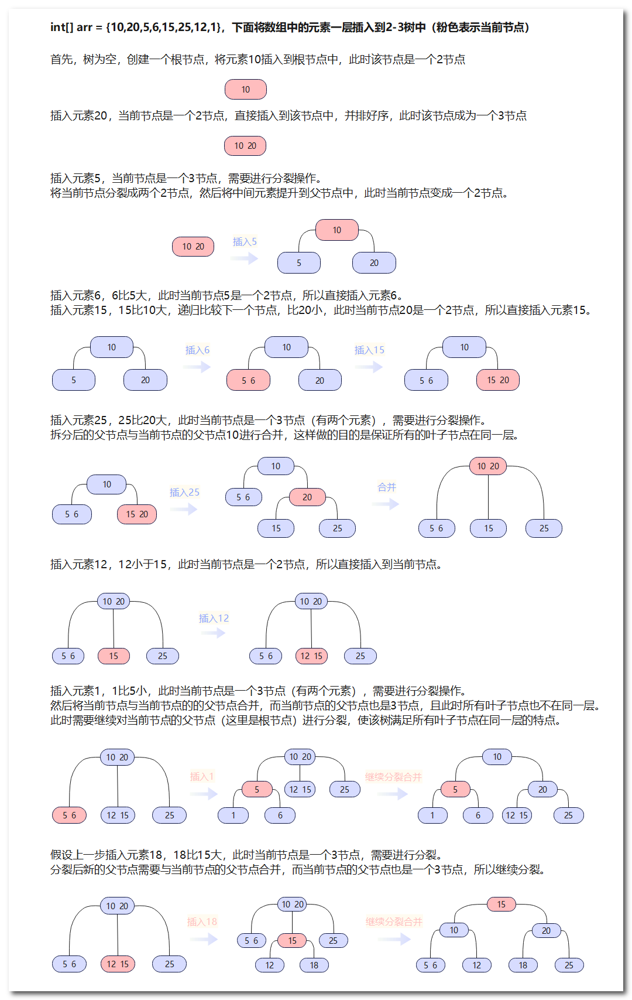
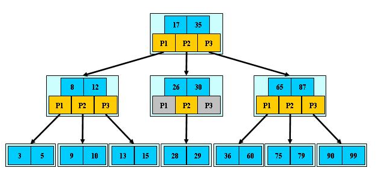
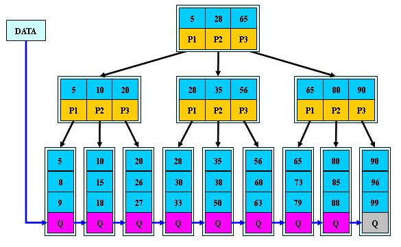
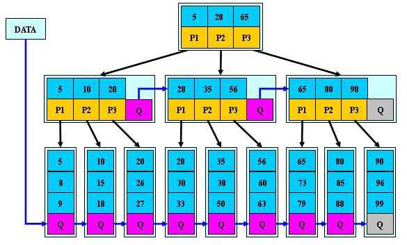

## 数据结构之多叉树

多叉树（或称为多路树）是一种树状数据结构，其中每个节点可以有多个子节点。相比于二叉树每个节点只能有两个子节点的限制，多叉树的节点可以有任意多个子节点。

多叉树的结构灵活，适用于各种应用场景。例如，文件系统可以使用多叉树来表示目录结构，其中每个目录节点可以有多个子目录或文件节点。语言解析树和组织架构图也可以用多叉树来表示。

多叉树的节点由一个存储数据的值和一个指向子节点的指针数组组成。指针数组的长度取决于每个节点可以有的子节点个数。对于一个有n个子节点的节点，指针数组将包含n个指针，每个指针指向一个子节点。

多叉树的遍历方法有多种，包括深度优先遍历和广度优先遍历。深度优先遍历通过递归或栈来遍历树的节点，先访问当前节点，然后依次访问子节点。广度优先遍历使用队列来按层级顺序遍历树的节点，先访问根节点，然后依次访问同一层级的子节点。

多叉树的优点是能够更好地模拟真实世界的问题，并提供更大的灵活性。然而，与二叉树相比，多叉树的操作可能稍微复杂一些，需要处理多个子节点的插入、删除和查找操作。

常见的多叉树有**2-3树**、**B树**、**B+树**、**B*树**。


### 2-3树

2-3树是一种自平衡的树结构，用于存储和管理有序数据。它的名称表示每个内部节点可以包含2个或3个子节点。

2-3树具有以下特点：

- 节点类型：2-3树的节点可以是2节点或3节点。

  - 2节点：2节点包含一个元素和两个子节点（或0个子节点）。左子节点包含小于元素的值，右子节点包含大于元素的值。

  - 3节点：3节点包含两个元素和三个子节点（或0个子节点）。左子节点包含小于第一个元素的值，中间子节点包含介于两个元素之间的值，右子节点包含大于第二个元素的值。

- 排序性质：对于每个节点来说，其左子树的所有值都小于节点的第一个元素，右子树的所有值都大于节点的第二个元素，而中间子树（如果存在）的所有值都介于两个元素之间。

- 平衡性：2-3树始终保持平衡状态，即从根节点到叶子节点的所有路径都具有相同的长度。即所有叶子节点都在同一层级上。

插入和删除操作是2-3树中的关键操作，它们会导致树的结构发生变化。在插入操作中，新的元素被插入到合适的叶子节点中，并根据需要进行节点的分裂或合并。在删除操作中，被删除的元素会引起节点的合并或下溢（即节点中的元素减少），同时需要进行适当的调整来维持树的平衡性。

当插入一个元素到2-3树时，可以按照以下步骤进行：

1. 如果树为空，创建一个根节点，并将元素插入到根节点中，结束插入操作。
2. 如果树非空，从根节点开始寻找合适的位置插入元素。
3. 从根节点开始，遍历节点的元素，**找到合适的位置插入元素**：
   - 如果要插入的元素小于当前节点的某个元素，则继续遍历当前节点的左子节点。
   - 如果要插入的元素大于当前节点的最后一个元素，则继续遍历当前节点的右子节点。
   - 如果要插入的元素介于当前节点的两个元素之间，则继续遍历当前节点的中间子节点。
4. 如果当前节点是一个2节点（包含一个元素和两个子节点），将元素插入到该节点中，并调整节点的顺序，使元素有序。
5. 如果当前节点是一个3节点（包含两个元素和三个子节点），则需要进行节点的分裂操作：
   - 将节点分裂为两个2节点。
   - 选出中间元素提升为父节点。
   - 将分裂后新的父节点与当前节点的父节点进行合并，并将分裂后的两个子节点与当前节点的父节点建立关联。
6. 重复步骤3至步骤5，直到找到合适的位置插入元素并完成插入操作。

注意：在2-3树中，节点的分裂操作是关键步骤。当一个节点分裂为两个2节点时，需要调整父节点和子节点之间的连接关系，以保持树的有序性和平衡性。

以上是2-3树插入操作的基本步骤。实际的代码实现可能会更加复杂，需要处理节点的分裂、合并和树的平衡等情况。

▼下面是2-3树的图解



2-3树是红黑树的一种特例，它提供了一种理论基础，帮助我们理解和实现更复杂的自平衡树结构。它在某些特定场景下可以提供较高的性能，尤其适用于内存受限的环境或需要频繁进行插入和删除操作的情况。


### B树

B树是一种自平衡的树结构，用于高效地存储和管理大量有序数据。它被广泛应用于文件系统和数据库等存储系统中，以提供快速的查找、插入和删除操作。

**B树的阶数定义了每个节点可以包含的最大元素数量和子节点数量。阶数等于最大子节点的数量。**

**一个B树的阶数为M，则每个节点最多可以有M-1个元素和M个子节点**（除了根节点和叶子节点有特殊的限制）

B树是2-3树的扩展形式，2-3树是B树的一种特例。B树和2-3树在构建过程中使用了类似的插入、分裂和合并操作。

B树具有以下特点：

1. 多路平衡搜索树：B树是一种多路搜索树，每个节点可以拥有多个子节点。相比于二叉树，B树的每个节点可以包含更多的子节点，从而减少树的高度，提高查找效率。

2. 排序性质：对于每个节点来说，其子节点的值范围被划分为多个区间，每个区间对应一个子节点。这些区间满足有序性质，即对于每个节点的值来说，左子树的值都小于该节点的值，右子树的值都大于该节点的值。

3. 自平衡性：B树保持平衡状态，即从根节点到叶子节点的所有路径具有相同的长度。通过调整节点的分裂和合并，B树可以自动平衡，使得树的高度较小，从而保持高效的操作性能。

4. 多级索引：B树通常具有多个级别的索引，根节点作为最高级别的索引，中间节点作为次级别的索引，叶子节点包含实际的数据。这种多级索引的结构使得B树在查找操作中可以快速定位到目标数据所在的位置。

5. 顺序访问：B树的节点通常按顺序存储在磁盘或其他存储介质上，这使得顺序访问大量数据非常高效。B树的节点大小通常与磁盘块的大小相匹配，从而最大程度上利用了磁盘的读取能力。

插入和删除操作是B树中的关键操作，它们会导致树的结构发生变化。在插入操作中，新的数据项被插入到合适的叶子节点中，可能会导致节点的分裂和上层节点的调整。在删除操作中，被删除的数据项会引起节点的合并和下层节点的调整。这些操作都会保持B树的平衡性和排序性质。

B树的查找操作步骤如下：

1. 从根节点开始，比较要查找的关键字与当前节点中的关键字。
2. 如果关键字匹配，说明找到了目标关键字，返回查找成功。
3. 如果关键字小于当前节点中的最小关键字，且当前节点有子节点，则进入当前节点的最左子节点，并返回步骤1。
4. 如果关键字大于当前节点中的最大关键字，且当前节点有子节点，则进入当前节点的最右子节点，并返回步骤1。
5. 如果关键字在当前节点的关键字范围内，但不匹配任何关键字，则按照关键字的大小选择进入相应子节点，并返回步骤1。
6. 如果经过上述步骤仍未找到目标关键字，且当前节点为叶子节点，则表示关键字不存在，返回查找失败。

B树是一种非常灵活和高效的数据结构，它在处理大量数据和频繁的插入/删除操作时表现出色。它的广泛应用于文件系统和数据库等领域，使得这些存储系统能够高效地管理和访问大规模数据。

下面是B数的示意图，其中P表示的是指针，关键字集合分布在整颗树中, 即叶子节点和非叶子节点都存放数据：



▼下面是B树示例代码

```Java
// B树节点类
class BTreeNode {
     int[] keys;          // 存储关键字的数组
     int t;               // B树的最小度数
     BTreeNode[] children; // 存储子节点的数组
     int keyCount;        // 当前节点包含的关键字个数
     boolean leaf;        // 是否为叶子节点

    // 构造函数
    public BTreeNode(int t, boolean leaf) {
        this.t = t;
        this.leaf = leaf;
        this.keys = new int[2 * t - 1];
        this.children = new BTreeNode[2 * t];
        this.keyCount = 0;
    }

    // 在当前节点中查找关键字的索引
    private int findKeyIndex(int key) {
        int index = 0;
        while (index < keyCount && keys[index] < key) {
            index++;
        }
        return index;
    }

    // 插入关键字到当前节点
    public void insertNonFull(int key) {
        int index = keyCount - 1;

        if (leaf) {
            // 在叶子节点中找到关键字的插入位置并将其他关键字后移
            while (index >= 0 && keys[index] > key) {
                keys[index + 1] = keys[index];
                index--;
            }
            keys[index + 1] = key;
            keyCount++;
        } else {
            // 在非叶子节点中找到子节点的插入位置并递归插入
            while (index >= 0 && keys[index] > key) {
                index--;
            }
            if (children[index + 1].keyCount == 2 * t - 1) {
                splitChild(index + 1, children[index + 1]);
                if (keys[index + 1] < key) {
                    index++;
                }
            }
            children[index + 1].insertNonFull(key);
        }
    }

    // 分裂子节点
    public void splitChild(int childIndex, BTreeNode child) {
        BTreeNode newNode = new BTreeNode(t, child.leaf);
        newNode.keyCount = t - 1;

        // 将子节点的后半部分关键字和子节点移动到新节点
        for (int i = 0; i < t - 1; i++) {
            newNode.keys[i] = child.keys[i + t];
        }
        if (!child.leaf) {
            for (int i = 0; i < t; i++) {
                newNode.children[i] = child.children[i + t];
            }
        }

        // 更新当前节点的关键字和子节点
        for (int i = keyCount; i > childIndex; i--) {
            children[i + 1] = children[i];
        }
        children[childIndex + 1] = newNode;
        for (int i = keyCount - 1; i >= childIndex; i--) {
            keys[i + 1] = keys[i];
        }
        keys[childIndex] = child.keys[t - 1];

        keyCount++;
        child.keyCount = t - 1;
    }

    // 在当前节点中查找指定关键字
    public BTreeNode search(int key) {
        int index = findKeyIndex(key);
        if (index < keyCount && keys[index] == key) {
            return this;
        } else if (leaf) {
            return null;
        } else {
            return children[index].search(key);
        }
    }
    
    // 递归打印当前节点及其子节点的关键字
    public void printKeysRecursive() {
        int i;
        for (i = 0; i < keyCount; i++) {
            System.out.print(keys[i] + " ");
        }

        if (!leaf) {
            for (i = 0; i <= keyCount; i++) {
                children[i].printKeysRecursive();
            }
        }
    }

}

// B树类
class BTree {
    private BTreeNode root; // B树的根节点
    private int t;          // B树的最小度数

    // 构造函数
    public BTree(int t) {
        this.t = t;
        this.root = null;
    }

    // 插入关键字到B树
    public void insert(int key) {
        if (root == null) {
            root = new BTreeNode(t, true);
            root.keys[0] = key;
            root.keyCount = 1;
        } else {
            if (root.keyCount == 2 * t - 1) {
                BTreeNode newNode = new BTreeNode(t, false);
                newNode.children[0] = root;
                newNode.splitChild(0, root);
                newNode.insertNonFull(key);
                root = newNode;
            } else {
                root.insertNonFull(key);
            }
        }
    }

    // 在B树中查找指定关键字
    public BTreeNode search(int key) {
        if (root != null) {
            return root.search(key);
        } else {
            return null;
        }
    }

    // 打印B树中的关键字
    public void printKeys() {
        if (root != null) {
            root.printKeysRecursive();
        }
        System.out.println();
    }
}

// 示例代码
public class BTreeDemo {
    public static void main(String[] args) {
        BTree bTree = new BTree(3);

        // 插入关键字
        bTree.insert(6);
        bTree.insert(3);
        bTree.insert(8);
        bTree.insert(2);
        bTree.insert(4);
        bTree.insert(9);
        bTree.insert(1);
        bTree.insert(7);
        //bTree.insert(5);

        // 打印关键字
        bTree.printKeys();

        // 查找关键字
        BTreeNode node = bTree.search(5);
        if (node != null) {
            System.out.println("Key 5 found in the B-tree.");
        } else {
            System.out.println("Key 5 not found in the B-tree.");
        }
    }
}
```


### B+数

B+树是一种扩展自B树的数据结构，具有以下特点：

1. 多路平衡树：B+树是一种多路平衡树，类似于B树，每个节点可以有多个子节点。但相比于B树，B+树的叶子节点不存储数据，只存储关键字和指向数据的指针，而实际的数据都存储在叶子节点的相邻节点中。这种特性使得B+树在磁盘存储中更加高效。

2. 叶子节点串联：B+树的叶子节点之间通过指针进行串联，形成一个有序链表。这样可以方便地进行范围查询操作，通过遍历叶子节点链表即可获取一个区间范围内的数据。

3. 内部节点不存储数据：B+树的内部节点只存储关键字和指向子节点的指针，不存储实际的数据。这样可以使得内部节点的大小更小，减少磁盘访问开销，提高磁盘IO效率。

4. 顺序访问性能好：由于B+树的叶子节点形成有序链表，因此顺序访问时的性能非常好。对于范围查询、排序和顺序遍历等操作，B+树的性能表现优秀。

5. 适用于范围查询和排序：B+树的特性使得它非常适合用于范围查询和排序操作。由于叶子节点之间有序，并且通过叶子节点链表连接，所以在B+树上进行范围查询非常高效。

▼下面是B+数的示意图




### B*数

B* 树是一种扩展自B树的数据结构，是B+树的一种变种。B* 树在B+树的基础上做了一些改进，具有以下特点：

1. 更高的填充因子：B* 树相比于B+树，对于非叶子节点的填充因子要求更高。B+树要求非叶子节点至少填满一半的关键字，而B* 树要求非叶子节点至少填满2/3的关键字。这样可以减少非叶子节点的层数，提高查询性能。

2. 更多的指针：B* 树在非叶子节点上添加了指向相邻兄弟节点的指针，这样可以加速范围查询操作，减少磁盘IO的次数。同时，B* 树的叶子节点也可以具有指向下一个叶子节点的指针，形成叶子节点之间的链表，方便范围查询和排序操作。

3. 更高的树高度：由于B* 树要求非叶子节点填满更多的关键字，所以相比于B+树，B* 树的树高度可能会更高。然而，由于磁盘IO是B* 树性能的瓶颈，通过增加填充因子和指针来减少磁盘IO的次数，可以在实际应用中取得更好的性能。

4. 范围查询性能优化：B* 树通过增加指向相邻兄弟节点的指针，可以更快地定位到范围查询的起始节点，然后沿着兄弟节点链表遍历，减少磁盘IO次数，提高范围查询的性能。

总的来说，B* 树在B+树的基础上做了一些优化，主要目标是减少磁盘IO次数，提高范围查询和排序操作的性能。虽然B* 树的树高度可能会更高，但通过增加填充因子和指针来优化磁盘访问，可以在实际应用中取得更好的性能。

▼下面是B*数的示意图


