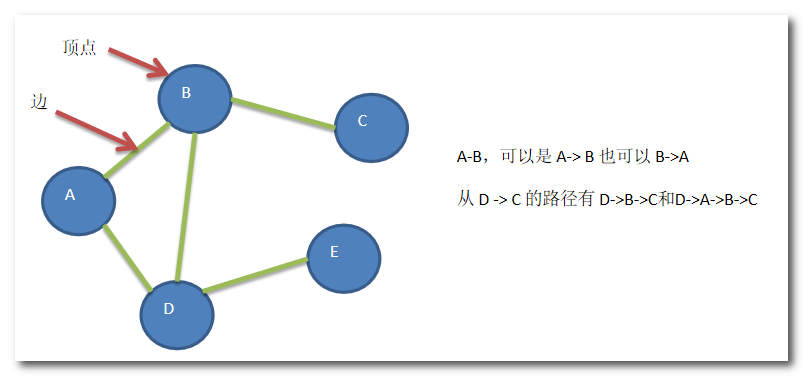
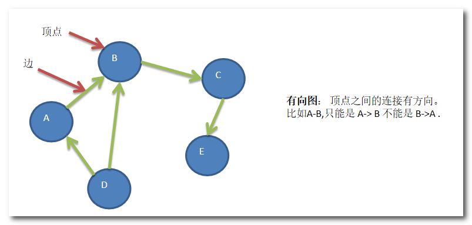
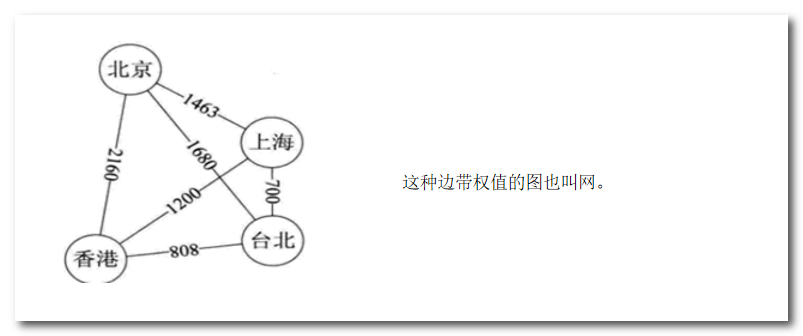
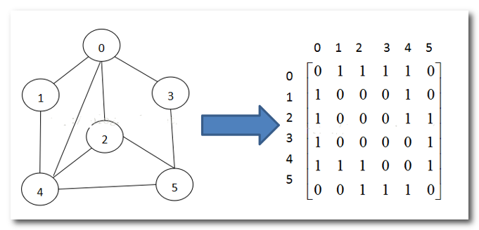
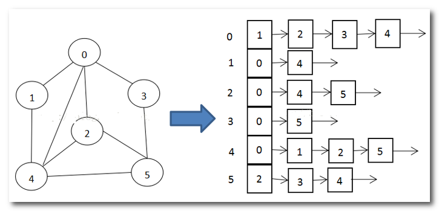

## 数据结构之图

图是一种由节点和边组成的数据结构，用于描述对象之间的关系。它是一种非线性的数据结构，可以用于表示各种实际问题中的关系和连接。

图由两个基本元素组成：节点（也称为顶点或点）和边。节点代表图中的实体，可以是人、地点、物品或任何其他对象。边表示节点之间的连接或关系。

图可以分为有向图和无向图两种类型。在有向图中，边有方向，表示连接节点的箭头指向的方向。而在无向图中，边没有方向，表示连接节点的关系是双向的。

图的表示方式有多种，常用的有邻接矩阵和邻接表。邻接矩阵是一个二维数组，其中行和列表示节点，矩阵中的元素表示边的存在与否或边的权重。邻接表是一种链表的集合，每个节点对应一个链表，链表中存储与该节点相邻的节点。

图的应用非常广泛，可以用于解决许多实际问题，例如社交网络分析、路由算法、图像处理等。常见的图算法包括深度优先搜索（DFS）、广度优先搜索（BFS）、最短路径算法（如Dijkstra算法和Floyd-Warshall算法）、最小生成树算法（如Prim算法和Kruskal算法）等。

图的常用概念包括以下几个：

1. 节点（Node）：图中的实体，也称为顶点（Vertex）。节点可以表示一个实际对象或概念，比如人、城市、物品等。

2. 边（Edge）：连接图中节点的线段或箭头，用于表示节点之间的关系。边可以是有向的（有向图）或无向的（无向图）。

3. 邻接点（Adjacent Nodes）：对于一个节点，与它直接连接的其他节点称为它的邻接点。邻接点可以是该节点的直接子节点或与其相邻的节点。

4. 路径（Path）：在图中，从一个节点到另一个节点经过的一系列边构成的序列。路径可以是有向的或无向的，可以是简单路径（不重复经过节点）或循环路径（起点和终点相同）。

5. 连通图（Connected Graph）：如果图中的任意两个节点之间都存在路径，则该图被称为连通图。连通图中的任意两个节点都可以互相到达。

6. 强连通图（Strongly Connected Graph）：对于有向图，如果图中的任意两个节点之间都存在双向路径，则该图被称为强连通图。

7. 子图（Subgraph）：图G的子集，包含图G中的一些节点和边。子图可以是原图的部分，但也必须满足图的定义。

8. 权重（Weight）：在带权图中，边可以具有权重或距离值，表示节点之间的某种度量。权重可以用于表示距离、成本、容量等。

下面是无向图的示意图：



下面是有向图的示意图：



下面是带权图的示意图：




### 邻接矩阵

邻接矩阵是一种常用的图的表示方法，它使用一个二维数组来表示图中节点之间的连接关系。邻接矩阵的主要思想是通过矩阵中的元素来表示节点之间的边或连接。

具体来说，邻接矩阵由一个 n × n 的二维数组构成，其中 n 是图中节点的个数。数组的行和列分别表示图中的节点，数组中的元素表示节点之间的连接关系。

对于无向图，邻接矩阵是一个对称矩阵，即对于任意的节点 i 和 j，若存在连接关系，则邻接矩阵中的第 i 行第 j 列和第 j 行第 i 列的元素都为 1（或非零值）。若不存在连接关系，则对应位置的元素为 0。

对于有向图，邻接矩阵中的元素表示了有向边的存在与否。如果存在从节点 i 到节点 j 的有向边，则邻接矩阵中的第 i 行第 j 列的元素为 1（或非零值）。否则，元素为 0。

邻接矩阵的优点是简单直观，易于理解和实现。它适用于表示稠密图，即节点之间的连接关系比较多的情况。然而，邻接矩阵对于表示稀疏图（节点之间连接关系较少）则比较浪费空间，因为大部分元素为 0。

在邻接矩阵中，可以进行快速的节点连接性查询，以及获取节点的度数（即与节点相邻的边的数量）。但是，在插入和删除节点时，需要修改整个邻接矩阵，时间复杂度较高。

下面是邻接矩阵表示图的示意图

> 其中有关联的两个节点之间的边用1表示，没有关联的用0表示。



▼下面是使用邻接矩阵表示图的示例代码

```Java
public class Graph {
    private int numVertices; // 图中顶点的数量
    private int[][] adjMatrix; // 邻接矩阵

    public Graph(int numVertices) {
        this.numVertices = numVertices;
        this.adjMatrix = new int[numVertices][numVertices];
    }

    public void addEdge(int src, int dest) {
        if (src >= 0 && src < numVertices && dest >= 0 && dest < numVertices) {
            adjMatrix[src][dest] = 1;
            adjMatrix[dest][src] = 1; // 如果是有向图，则不需要这行
        }
    }

    public void removeEdge(int src, int dest) {
        if (src >= 0 && src < numVertices && dest >= 0 && dest < numVertices) {
            adjMatrix[src][dest] = 0;
            adjMatrix[dest][src] = 0; // 如果是有向图，则不需要这行
        }
    }

    public void printGraph() {
        for (int i = 0; i < numVertices; i++) {
            for (int j = 0; j < numVertices; j++) {
                System.out.print(adjMatrix[i][j] + " ");
            }
            System.out.println();
        }
    }

    public static void main(String[] args) {
        Graph graph = new Graph(5);
        graph.addEdge(0, 1);
        graph.addEdge(0, 4);
        graph.addEdge(1, 2);
        graph.addEdge(1, 3);
        graph.addEdge(1, 4);
        graph.addEdge(2, 3);
        graph.addEdge(3, 4);

        graph.printGraph();
    }
}
```


### 邻接表

邻接表是一种常用的图的表示方法，它使用链表来表示图中节点之间的连接关系。邻接表是通过节点列表和边列表来表示图的结构。

具体来说，邻接表由两部分组成：节点列表和边列表。

1. 节点列表：节点列表是一个包含图中所有节点的链表或数组。每个节点通常包含一个值和一个指向其相邻节点的指针（或引用）。

2. 边列表：边列表是一个包含图中所有边的链表或数组。每条边通常由两个部分组成：源节点和目标节点。对于有权图，还可以包含权值。

邻接表的构建过程如下：

1. 创建一个节点列表，包含图中的所有节点。

2. 遍历图中的边，对于每条边 (u, v)，将节点 u 加入节点 v 的邻接列表中。如果是有向图，则只需要将节点 u 加入节点 v 的邻接列表；如果是无向图，则需要同时将节点 u 加入节点 v 的邻接列表，以及将节点 v 加入节点 u 的邻接列表。

邻接表的优点是节省空间，特别适用于表示稀疏图，即节点之间的连接关系相对较少的情况。每个节点只存储与之相邻的节点信息，减少了存储空间的浪费。

下面是邻接表表示图的示意图：

> 其中0,1,2,3,4,5为数组索引，每个索引位置存放链表，链表节点为该索引位置的关联节点，链表是按照关键字从小到大排序。



▼下面是邻接表的表示图的示例代码

```Java
import java.util.LinkedList;

public class Graph {
    private int numVertices; // 图中顶点的数量
    private LinkedList<Integer>[] adjList; // 邻接表

    public Graph(int numVertices) {
        this.numVertices = numVertices;
        this.adjList = new LinkedList[numVertices];
        for (int i = 0; i < numVertices; i++) {
            adjList[i] = new LinkedList<>();
        }
    }

    public void addEdge(int src, int dest) {
        if (src >= 0 && src < numVertices && dest >= 0 && dest < numVertices) {
            adjList[src].add(dest);
            adjList[dest].add(src); // 如果是有向图，则不需要这行
        }
    }

    public void removeEdge(int src, int dest) {
        if (src >= 0 && src < numVertices && dest >= 0 && dest < numVertices) {
            adjList[src].remove(Integer.valueOf(dest));
            adjList[dest].remove(Integer.valueOf(src)); // 如果是有向图，则不需要这行
        }
    }

    public void printGraph() {
        for (int i = 0; i < numVertices; i++) {
            System.out.print(i + " -> ");
            for (int neighbor : adjList[i]) {
                System.out.print(neighbor + " ");
            }
            System.out.println();
        }
    }

    public static void main(String[] args) {
        Graph graph = new Graph(5);
        graph.addEdge(0, 1);
        graph.addEdge(0, 4);
        graph.addEdge(1, 2);
        graph.addEdge(1, 3);
        graph.addEdge(1, 4);
        graph.addEdge(2, 3);
        graph.addEdge(3, 4);

        graph.printGraph();
    }
}
```


### 深度和广度优先算法

深度优先搜索（Depth-First Search，DFS）和广度优先搜索（Breadth-First Search，BFS）是常用的图遍历算法。

#### 深度优先算法

深度优先搜索（DFS）：

- 从图中的某个顶点开始遍历，沿着路径尽可能深地访问图的节点，直到达到最深的节点为止，然后回溯并继续遍历其他路径。
- 使用栈（Stack）数据结构来实现DFS，通过将下一个要访问的顶点压入栈中，实现深度遍历。
- DFS 遍历过程中会探索图中的所有可能的路径，适用于寻找路径、判断连通性、解决迷宫等问题。

以下是深度优先搜索的步骤：

1. 创建一个布尔类型的数组 `visited`，用于标记每个顶点是否被访问过。初始时，所有顶点的访问状态都设置为 `false`。
2. 选择一个起始顶点作为搜索的起点，将起始顶点标记为已访问，并将其输出。
3. 从起始顶点开始，依次访问它的邻居顶点。
4. 对于每个邻居顶点，如果它未被访问过，就将其标记为已访问，并将其输出。
5. 递归地对当前邻居顶点进行深度优先搜索，即重复步骤4和步骤5，直到当前顶点没有未访问的邻居顶点。
6. 如果当前顶点没有未访问的邻居顶点，回溯到上一个顶点，并继续探索其他未访问的邻居顶点。
7. 重复步骤4到步骤6，直到所有顶点都被访问过。


####  广度优先算法

广度优先搜索（BFS）

- 从图中的某个顶点开始遍历，先访问其所有相邻节点，然后逐层向外拓展访问其他节点，直到图中所有顶点都被访问为止。
- 使用队列（Queue）数据结构来实现BFS，通过将下一个要访问的顶点加入队列中，实现广度遍历。
- BFS 遍历过程中按层次逐级访问，适用于寻找最短路径、查找特定节点等问题。

以下是广度优先搜索的步骤：

1. 创建一个布尔类型的数组 `visited`，用于标记每个顶点是否被访问过。初始时，所有顶点的访问状态都设置为 `false`。
2. 创建一个队列 `queue`，用于存储待访问的顶点。
3. 选择一个起始顶点作为搜索的起点，并将其标记为已访问。
4. 将起始顶点加入队列 `queue`。
5. 从队列中取出一个顶点，并将其输出。
6. 遍历该顶点的所有邻居顶点，如果邻居顶点未被访问过，将其标记为已访问，并将其加入队列 `queue`。
7. 重复步骤5和步骤6，直到队列为空。
8. 如果此时还有未被访问的顶点，选择一个未被访问的顶点作为起始顶点，并重复步骤4到步骤7，直到所有顶点都被访问过。


▼下面是图的深度优先算法和广度优先算法示例代码：

```Java
import java.util.ArrayList;
import java.util.LinkedList;
import java.util.List;
import java.util.Queue;

// 图的邻接矩阵表示法
class AdjacencyMatrixGraph {
    private int vertexCount; // 图中顶点的数量
    private int[][] adjacencyMatrix; // 邻接矩阵

    // 构造函数
    public AdjacencyMatrixGraph(int vertexCount) {
        this.vertexCount = vertexCount;
        this.adjacencyMatrix = new int[vertexCount][vertexCount];
    }

    // 添加边
    public void addEdge(int start, int end) {
        // 由于是无向图，所以边是双向的，即两个方向上的矩阵值都为1
        adjacencyMatrix[start][end] = 1;
        adjacencyMatrix[end][start] = 1;
    }

    // 深度优先搜索遍历
    public void dfsTraversal(int startVertex) {
        boolean[] visited = new boolean[vertexCount]; // 用于标记已访问的节点
        dfsUtil(startVertex, visited);
    }

    // 深度优先搜索遍历的辅助方法
    private void dfsUtil(int vertex, boolean[] visited) {
        visited[vertex] = true; // 标记当前节点为已访问
        System.out.print(vertex + " "); // 输出当前节点

        // 遍历当前节点的邻居节点
        for (int i = 0; i < vertexCount; i++) {
            if (adjacencyMatrix[vertex][i] == 1 && !visited[i]) {
                // 如果存在连接且未访问过的邻居节点，递归调用dfsUtil方法进行遍历
                dfsUtil(i, visited);
            }
        }
    }

    // 广度优先搜索遍历
    public void bfsTraversal(int startVertex) {
        boolean[] visited = new boolean[vertexCount]; // 用于标记已访问的节点
        Queue<Integer> queue = new LinkedList<>(); // 用于存储待访问的节点

        visited[startVertex] = true; // 标记起始节点为已访问
        queue.offer(startVertex); // 将起始节点加入队列

        while (!queue.isEmpty()) {
            int vertex = queue.poll(); // 取出队列中的节点
            System.out.print(vertex + " "); // 输出当前节点

            // 遍历当前节点的邻居节点
            for (int i = 0; i < vertexCount; i++) {
                if (adjacencyMatrix[vertex][i] == 1 && !visited[i]) {
                    // 如果存在连接且未访问过的邻居节点，将其标记为已访问并加入队列
                    visited[i] = true;
                    queue.offer(i);
                }
            }
        }
    }
}

// 图的邻接表表示法
class AdjacencyListGraph {
    private int vertexCount; // 图中顶点的数量
    private List<List<Integer>> adjacencyList; // 邻接表

    // 构造函数
    public AdjacencyListGraph(int vertexCount) {
        this.vertexCount = vertexCount;
        this.adjacencyList = new ArrayList<>(vertexCount);

        // 初始化邻接表中的每个顶点列表
        for (int i = 0; i < vertexCount; i++) {
            adjacencyList.add(new ArrayList<>());
        }
    }

    // 添加边
    public void addEdge(int start, int end) {
        // 由于是无向图，所以边是双向的，即两个方向上都需要添加对应的边
        adjacencyList.get(start).add(end);
        adjacencyList.get(end).add(start);
    }

    // 深度优先搜索遍历
    public void dfsTraversal(int startVertex) {
        boolean[] visited = new boolean[vertexCount]; // 用于标记已访问的节点
        dfsUtil(startVertex, visited);
    }

    // 深度优先搜索遍历的辅助方法
    private void dfsUtil(int vertex, boolean[] visited) {
        visited[vertex] = true; // 标记当前节点为已访问
        System.out.print(vertex + " "); // 输出当前节点

        // 遍历当前节点的邻居节点
        for (int neighbor : adjacencyList.get(vertex)) {
            if (!visited[neighbor]) {
                // 如果邻居节点未访问过，递归调用dfsUtil方法进行遍历
                dfsUtil(neighbor, visited);
            }
        }
    }

    // 广度优先搜索遍历
    public void bfsTraversal(int startVertex) {
        boolean[] visited = new boolean[vertexCount]; // 用于标记已访问的节点
        Queue<Integer> queue = new LinkedList<>(); // 用于存储待访问的节点

        visited[startVertex] = true; // 标记起始节点为已访问
        queue.offer(startVertex); // 将起始节点加入队列

        while (!queue.isEmpty()) {
            int vertex = queue.poll(); // 取出队列中的节点
            System.out.print(vertex + " "); // 输出当前节点

            // 遍历当前节点的邻居节点
            for (int neighbor : adjacencyList.get(vertex)) {
                if (!visited[neighbor]) {
                    // 如果邻居节点未访问过，将其标记为已访问并加入队列
                    visited[neighbor] = true;
                    queue.offer(neighbor);
                }
            }
        }
    }
}

// 测试
public class GraphTest {
    public static void main(String[] args) {
        // 创建一个邻接矩阵表示的图
        AdjacencyMatrixGraph matrixGraph = new AdjacencyMatrixGraph(6);
        matrixGraph.addEdge(0, 1);
        matrixGraph.addEdge(0, 2);
        matrixGraph.addEdge(1, 3);
        matrixGraph.addEdge(2, 4);
        matrixGraph.addEdge(2, 5);

        System.out.println("深度优先搜索遍历：");
        matrixGraph.dfsTraversal(0); // 从顶点0开始遍历
        System.out.println();

        System.out.println("广度优先搜索遍历：");
        matrixGraph.bfsTraversal(0); // 从顶点0开始遍历
        System.out.println();

        // 创建一个邻接表表示的图
        AdjacencyListGraph listGraph = new AdjacencyListGraph(6);
        listGraph.addEdge(0, 1);
        listGraph.addEdge(0, 2);
        listGraph.addEdge(1, 3);
        listGraph.addEdge(2, 4);
        listGraph.addEdge(2, 5);

        System.out.println("深度优先搜索遍历：");
        listGraph.dfsTraversal(0); // 从顶点0开始遍历
        System.out.println();

        System.out.println("广度优先搜索遍历：");
        listGraph.bfsTraversal(0); // 从顶点0开始遍历
        System.out.println();
    }
}
```


